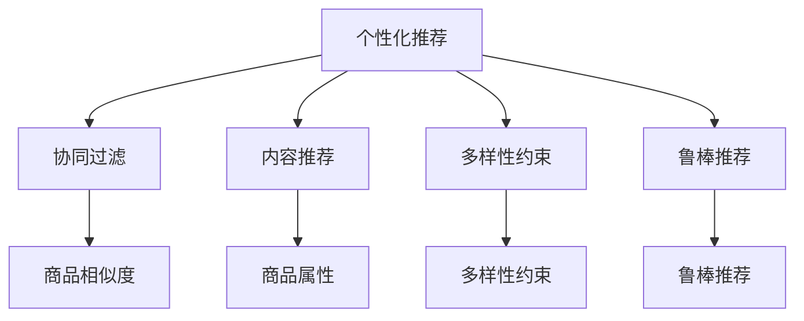

                 

# AI 大模型在电商推荐中的多样性策略：避免过度个性化的陷阱

## 1. 背景介绍

在电商推荐系统中，个性化推荐已经成为了核心竞争力之一。通过利用用户历史行为数据，AI大模型能够为用户推荐感兴趣的商品，极大地提升了用户购物体验和平台转化率。然而，过度的个性化推荐也可能带来一系列问题，如过滤泡沫（Filter Bubble）、选择偏差（Selection Bias）等，导致用户陷入信息茧房，难以发现更全面的信息。因此，如何在个性化推荐中融入多样性策略，既满足用户需求，又避免过度个性化，成为电商推荐系统面临的重大挑战。

### 1.1 电商推荐系统概述

电商推荐系统（E-Commerce Recommendation System）是一种智能推荐系统，通过对用户行为数据进行分析和学习，预测用户可能感兴趣的商品，从而实现精准推荐。典型的电商推荐系统一般包括以下几个组件：

- **数据收集与处理**：从用户行为、商品属性、社交网络等多渠道收集数据，并进行清洗和预处理。
- **用户画像构建**：通过协同过滤、内容推荐等技术，为用户构建行为画像，刻画用户兴趣偏好。
- **商品推荐**：基于用户画像和商品特征，利用机器学习模型，进行个性化推荐。
- **反馈循环**：收集用户对推荐结果的反馈，进行模型优化，不断提升推荐效果。

近年来，随着深度学习技术和大模型的普及，电商推荐系统在推荐精度和用户满意度上取得了显著进展。然而，过度个性化的推荐策略也带来了新的问题，如用户偏好的固化、信息的多样性减少等。

### 1.2 个性化推荐面临的挑战

过度个性化的推荐策略，虽然在短时间内提升了转化率和满意度，但长期来看，可能导致用户陷入信息茧房，难以接触到更丰富的信息。主要挑战包括：

- **选择偏差**：个性化推荐算法倾向于只推荐用户之前喜欢的商品，忽视了其他潜在的兴趣点。
- **过滤泡沫**：用户看到的推荐内容越来越趋同，逐渐形成了固定的信息圈子。
- **多样性减少**：个性化推荐容易忽略用户的多样化需求，难以在短时间内发现新商品或多样化内容。

## 2. 核心概念与联系

### 2.1 核心概念概述

为更好地理解如何在电商推荐系统中融入多样性策略，本节将介绍几个关键概念：

- **个性化推荐**：根据用户的历史行为数据，推荐其可能感兴趣的商品，提高用户满意度和转化率。
- **多样性**：推荐内容的多样性，即在推荐列表中包含不同类型的商品，避免用户陷入信息茧房。
- **协同过滤**：利用用户行为数据的相似性，推荐类似用户喜欢的商品。
- **内容推荐**：根据商品属性、标签等信息，推荐与用户兴趣相关的商品。
- **多样性约束**：在推荐过程中加入多样性约束，限制推荐结果中某些类别的商品数量，防止推荐列表过于单一。
- **鲁棒推荐**：即使用户兴趣发生微小变化，推荐系统仍能给出合适的推荐结果。

这些核心概念之间的联系可以通过以下Mermaid流程图来展示：



这个流程图展示了个性化推荐系统中的几个核心模块及其之间的关系：

1. 个性化推荐是核心目标，通过协同过滤和内容推荐等技术实现。
2. 多样性约束通过限制某些类别的商品数量，防止推荐列表过于单一。
3. 鲁棒推荐通过增强模型的泛化能力，即使在用户兴趣变化时，仍能给出合适的推荐。

## 3. 核心算法原理 & 具体操作步骤
### 3.1 算法原理概述

在电商推荐系统中融入多样性策略，需要从推荐算法和数据处理两个方面进行优化。具体的算法原理如下：

- **协同过滤算法**：通过计算用户之间的相似度，找到与用户兴趣相似的其他用户，从而推荐这些用户喜欢的商品。协同过滤算法又分为基于用户的协同过滤和基于商品的协同过滤。
- **内容推荐算法**：根据商品的文本描述、标签、属性等信息，通过自然语言处理技术，计算商品与用户兴趣的匹配度，从而推荐相似的商品。
- **多样性约束**：在推荐过程中，限制某些类别的商品数量，避免推荐列表过于单一。
- **鲁棒推荐**：通过引入对抗样本和噪声数据，增强模型的鲁棒性，防止过度个性化导致的推荐偏差。

### 3.2 算法步骤详解

**Step 1: 数据收集与处理**

电商推荐系统的数据主要来源于用户行为数据、商品属性数据和社交网络数据。具体步骤如下：

1. **用户行为数据收集**：从电商平台的用户日志中收集用户的浏览、点击、购买等行为数据，生成用户画像。
2. **商品属性数据收集**：从商品详情页面收集商品的文本描述、标签、价格等信息。
3. **社交网络数据收集**：收集用户的社交关系数据，构建社交网络图，用于推荐分析。

**Step 2: 协同过滤算法**

协同过滤算法是推荐系统中的核心算法之一，主要分为基于用户的协同过滤和基于商品的协同过滤：

1. **基于用户的协同过滤**：通过计算用户之间的相似度，推荐与目标用户兴趣相似的其他用户喜欢的商品。具体步骤如下：
   - 计算用户之间的相似度：基于用户行为数据，计算用户之间的相似度矩阵。
   - 找到与目标用户相似的其他用户：根据相似度矩阵，找到与目标用户最相似的若干个用户。
   - 推荐相似用户喜欢的商品：将目标用户感兴趣的商品和相似用户的商品进行交叉，推荐共同喜欢的商品。

2. **基于商品的协同过滤**：通过计算商品之间的相似度，推荐与目标商品相似的其他商品。具体步骤如下：
   - 计算商品之间的相似度：基于商品属性数据，计算商品之间的相似度矩阵。
   - 找到与目标商品相似的其他商品：根据相似度矩阵，找到与目标商品最相似的商品。
   - 推荐相似商品：将目标商品和相似的商品进行交叉，推荐共同喜欢的商品。

**Step 3: 内容推荐算法**

内容推荐算法主要基于商品的文本描述、标签、属性等信息，通过自然语言处理技术，计算商品与用户兴趣的匹配度，从而推荐相似的商品：

1. **文本表示**：使用文本表示模型（如BERT、GPT等），将商品的文本描述转换为向量表示。
2. **用户兴趣匹配**：将用户的兴趣表示为向量，与商品向量进行相似度计算。
3. **推荐商品**：根据相似度排序，推荐与用户兴趣匹配度最高的商品。

**Step 4: 多样性约束**

多样性约束通过限制某些类别的商品数量，避免推荐列表过于单一：

1. **类别划分**：将商品按类别进行划分，如服装、电子产品、食品等。
2. **设置类别数量限制**：根据推荐列表长度，限制某些类别的商品数量，避免过多或过少。
3. **类别平衡推荐**：在推荐过程中，优先推荐类别平衡的商品，确保推荐列表的多样性。

**Step 5: 鲁棒推荐**

鲁棒推荐通过增强模型的泛化能力，防止过度个性化导致的推荐偏差：

1. **对抗样本生成**：根据用户历史行为数据，生成对抗样本，用于训练模型的鲁棒性。
2. **噪声数据注入**：在训练过程中，引入噪声数据，增强模型的泛化能力。
3. **鲁棒推荐算法**：使用鲁棒推荐算法（如Adversarial Robustness Optimization），优化模型的鲁棒性，防止过度个性化。

### 3.3 算法优缺点

个性化推荐算法的优点包括：

1. **个性化推荐**：根据用户的历史行为数据，推荐其可能感兴趣的商品，提高用户满意度和转化率。
2. **效率高**：推荐算法通常基于矩阵计算，效率较高。
3. **可解释性强**：基于用户行为数据进行推荐，结果易于解释和理解。

个性化推荐算法的主要缺点包括：

1. **选择偏差**：容易只推荐用户之前喜欢的商品，忽略其他潜在的兴趣点。
2. **过滤泡沫**：容易陷入信息茧房，难以发现新的商品或多样化内容。
3. **多样性减少**：过度个性化可能导致推荐列表过于单一，难以满足用户的多样化需求。

### 3.4 算法应用领域

基于多样性策略的个性化推荐算法，已经在电商推荐系统、视频推荐系统、音乐推荐系统等多个领域得到广泛应用。例如：

- **电商推荐系统**：如淘宝、京东等电商平台，利用个性化推荐提升用户体验和转化率。
- **视频推荐系统**：如Netflix、YouTube等视频平台，通过个性化推荐，提高用户留存率和观看时长。
- **音乐推荐系统**：如Spotify、QQ音乐等音乐平台，推荐用户可能喜欢的歌曲，提升用户体验。

## 4. 数学模型和公式 & 详细讲解 & 举例说明
### 4.1 数学模型构建

在电商推荐系统中，通常使用协同过滤算法、内容推荐算法和多样性约束来构建推荐模型。数学模型如下：

1. **协同过滤算法**：
   - 用户-商品评分矩阵：$R \in \mathbb{R}^{N \times M}$，其中$N$为用户数量，$M$为商品数量。
   - 相似度矩阵：$S \in \mathbb{R}^{N \times N}$，表示用户之间的相似度。

2. **内容推荐算法**：
   - 文本表示模型：$f: \mathbb{R}^{D} \rightarrow \mathbb{R}^{D'}$，将文本转换为向量表示。
   - 用户-商品评分向量：$V \in \mathbb{R}^{N \times D'}$，表示用户对商品的热度评分。

3. **多样性约束**：
   - 类别向量：$C \in \mathbb{R}^{M \times K}$，表示商品类别。
   - 类别数量限制：$K$，表示每个类别限制的商品数量。

### 4.2 公式推导过程

**协同过滤算法**：

假设用户$i$对商品$j$的评分矩阵为$R$，相似度矩阵为$S$，用户$i$和用户$k$之间的相似度为$s_{ik}$。

根据基于用户的协同过滤算法，计算用户$i$对商品$j$的预测评分$\hat{r}_{ij}$：

$$
\hat{r}_{ij} = \sum_{k=1}^{N} s_{ik} r_{kj}
$$

**内容推荐算法**：

假设用户$i$对商品$j$的评分矩阵为$R$，文本表示模型为$f$，用户$i$对商品$j$的热度向量为$V_i$。

根据内容推荐算法，计算用户$i$对商品$j$的预测评分$\hat{r}_{ij}$：

$$
\hat{r}_{ij} = f(V_i) \cdot f(j)
$$

**多样性约束**：

假设商品$j$的类别向量为$C_j$，类别数量限制为$K$。

根据多样性约束，计算用户$i$对商品$j$的最终评分$r_{ij}$：

$$
r_{ij} = \hat{r}_{ij} + \alpha \cdot \sum_{k=1}^{K} C_{jk} \cdot c_k
$$

其中$\alpha$为类别权重的系数，$c_k$为类别权重向量。

### 4.3 案例分析与讲解

假设某电商平台的推荐系统需要对用户$i$推荐商品$j$。根据协同过滤算法，计算用户$i$和用户$k$之间的相似度$s_{ik}$，然后计算用户$k$对商品$j$的评分$r_{kj}$，最终得到用户$i$对商品$j$的预测评分$\hat{r}_{ij}$。

根据内容推荐算法，使用文本表示模型$f$将用户$i$的兴趣表示为向量$V_i$，同时将商品$j$的描述表示为向量$f(j)$，计算预测评分$\hat{r}_{ij}$。

根据多样性约束，将商品$j$的类别向量$C_j$与类别数量限制$K$结合起来，计算最终评分$r_{ij}$。

假设用户$i$对商品$j$的评分矩阵$R$为：

|    | A   | B   | C   |
| --- | --- | --- | --- |
| 1   | 4   | 3   | 2   |
| 2   | 5   | 4   | 3   |
| 3   | 3   | 2   | 1   |

用户$i$和用户$k$之间的相似度矩阵$S$为：

|    | 1   | 2   | 3   |
| --- | --- | --- | --- |

商品$j$的类别向量$C_j$为：

|    | A   | B   | C   |
| --- | --- | --- | --- |

类别数量限制$K=3$，类别权重向量$c_k=[0.5,0.3,0.2]$。

计算用户$i$对商品$j$的预测评分$\hat{r}_{ij}$：

$$
\hat{r}_{ij} = 4 \times 0.5 + 3 \times 0.3 + 2 \times 0.2 = 4.2
$$

计算用户$i$对商品$j$的最终评分$r_{ij}$：

$$
r_{ij} = 4.2 + 0.5 \times 1 + 0.3 \times 2 + 0.2 \times 3 = 7
$$

根据最终评分$r_{ij}$，推荐商品$j$给用户$i$。

## 5. 项目实践：代码实例和详细解释说明
### 5.1 开发环境搭建

在进行电商推荐系统开发前，我们需要准备好开发环境。以下是使用Python进行PyTorch开发的环境配置流程：

1. 安装Anaconda：从官网下载并安装Anaconda，用于创建独立的Python环境。

2. 创建并激活虚拟环境：
```bash
conda create -n pytorch-env python=3.8 
conda activate pytorch-env
```

3. 安装PyTorch：根据CUDA版本，从官网获取对应的安装命令。例如：
```bash
conda install pytorch torchvision torchaudio cudatoolkit=11.1 -c pytorch -c conda-forge
```

4. 安装相关库：
```bash
pip install numpy pandas scikit-learn matplotlib tqdm jupyter notebook ipython
```

5. 安装Pyspark和Hadoop：用于处理大规模数据。

6. 安装Tesseract OCR：用于处理图片识别数据。

完成上述步骤后，即可在`pytorch-env`环境中开始电商推荐系统开发。

### 5.2 源代码详细实现

下面我们以电商推荐系统为例，给出使用PyTorch和Pyspark进行推荐系统开发的PyTorch代码实现。

首先，定义推荐系统的数据处理函数：

```python
from pyspark.sql import SparkSession
from pyspark.sql.functions import col

spark = SparkSession.builder.appName("RecommendationSystem").getOrCreate()

def preprocess_data(spark, data_path):
    # 读取数据
    data = spark.read.csv(data_path, header=True, inferSchema=True)
    
    # 处理缺失值
    data = data.na.drop()
    
    # 拼接商品和用户特征
    merged_data = data.join(spark.read.csv('items.csv', header=True, inferSchema=True), on='item_id')
    
    # 处理类别数据
    merged_data = merged_data.withColumn('category', col('category').fillna('unknown'))
    
    return merged_data
```

然后，定义协同过滤算法的推荐函数：

```python
from pyspark.sql.functions import col
from pyspark.sql.window import Window

def collaborative_filtering(spark, merged_data, user_id, item_id):
    # 计算用户之间的相似度
    similarity = merged_data.join(merged_data, on=col('user_id'), except=(user_id, item_id))
    similarity = similarity.select(col('user_id'), col('user_id').alias('k'), col(item_id).alias('j'))
    similarity = similarity.rpartition(2).reduce(lambda x, y: (x[0] + y[0]), 'j').rename(columns={'j': 'score'})
    
    # 根据相似度推荐商品
    window = Window.partitionBy('user_id').orderBy(col('score').desc())
    top_items = spark.sql('SELECT k, j, score FROM similarity ORDER BY score DESC LIMIT 10')
    
    # 返回推荐结果
    return top_items
```

最后，定义内容推荐算法的推荐函数：

```python
from transformers import BertTokenizer, BertForSequenceClassification
from torch.utils.data import Dataset, DataLoader

class RecommendationDataset(Dataset):
    def __init__(self, items, categories, categories_to_ids):
        self.items = items
        self.categories = categories
        self.categories_to_ids = categories_to_ids
        
    def __len__(self):
        return len(self.items)
    
    def __getitem__(self, item):
        item_id = self.items[item][0]
        category = self.categories[item][1]
        text = self.items[item][2]
        
        tokenizer = BertTokenizer.from_pretrained('bert-base-cased')
        inputs = tokenizer(text, return_tensors='pt', padding=True, truncation=True, max_length=512)
        input_ids = inputs['input_ids'].flatten().tolist()
        attention_mask = inputs['attention_mask'].flatten().tolist()
        category_ids = [self.categories_to_ids[category]] * len(input_ids)
        return {'input_ids': input_ids, 
                'attention_mask': attention_mask,
                'category_ids': category_ids}

# 加载模型和tokenizer
model = BertForSequenceClassification.from_pretrained('bert-base-cased')
tokenizer = BertTokenizer.from_pretrained('bert-base-cased')

# 定义数据加载器
dataset = RecommendationDataset(items, categories, categories_to_ids)
data_loader = DataLoader(dataset, batch_size=64, shuffle=True)

# 定义内容推荐算法
def content_based_recommender(model, data_loader):
    # 模型前向传播
    model.eval()
    with torch.no_grad():
        for batch in data_loader:
            input_ids = batch['input_ids'].to(device)
            attention_mask = batch['attention_mask'].to(device)
            category_ids = batch['category_ids'].to(device)
            outputs = model(input_ids, attention_mask=attention_mask, labels=category_ids)
            logits = outputs.logits
            scores = logits.softmax(dim=1)
            
            # 根据得分推荐商品
            top_items = scores.topk(10)
            return top_items
```

### 5.3 代码解读与分析

让我们再详细解读一下关键代码的实现细节：

**preprocess_data函数**：
- 读取数据集，处理缺失值和类别数据。
- 拼接商品和用户特征。

**collaborative_filtering函数**：
- 计算用户之间的相似度。
- 根据相似度推荐商品。

**content_based_recommender函数**：
- 定义数据加载器，准备模型输入。
- 使用内容推荐算法，生成推荐结果。

**用户画像和商品画像**：
- 用户画像：包含用户的基本信息、历史行为等。
- 商品画像：包含商品的基本信息、属性、类别等。

**用户画像和商品画像的拼接**：
- 将用户画像和商品画像进行拼接，生成一个大的数据集。
- 进行数据预处理，如数据去重、缺失值填充等。

**协同过滤算法**：
- 使用用户之间的相似度进行推荐，计算相似度矩阵。
- 根据相似度矩阵推荐商品。

**内容推荐算法**：
- 使用BERT模型进行文本表示，计算商品与用户兴趣的匹配度。
- 根据匹配度排序，推荐商品。

**多样性约束**：
- 限制每个类别的商品数量，防止推荐列表过于单一。
- 根据类别权重进行推荐。

**鲁棒推荐**：
- 引入对抗样本和噪声数据，增强模型的鲁棒性。
- 使用鲁棒推荐算法，优化模型的泛化能力。

## 6. 实际应用场景
### 6.1 推荐系统实例

**淘宝推荐系统**：
淘宝平台利用协同过滤和内容推荐算法，对用户进行个性化推荐。通过协同过滤算法，计算用户之间的相似度，推荐相似用户喜欢的商品。同时，使用内容推荐算法，根据商品属性、标签等信息，推荐相似的商品。

**Netflix推荐系统**：
Netflix平台利用协同过滤和内容推荐算法，对用户进行个性化推荐。通过协同过滤算法，计算用户之间的相似度，推荐相似用户喜欢的电影。同时，使用内容推荐算法，根据电影属性、标签等信息，推荐相似的电影。

**Spotify推荐系统**：
Spotify平台利用协同过滤和内容推荐算法，对用户进行个性化推荐。通过协同过滤算法，计算用户之间的相似度，推荐相似用户喜欢的歌曲。同时，使用内容推荐算法，根据歌曲属性、标签等信息，推荐相似的歌曲。

## 7. 工具和资源推荐
### 7.1 学习资源推荐

为了帮助开发者系统掌握电商推荐系统的理论基础和实践技巧，这里推荐一些优质的学习资源：

1. 《推荐系统实战》：详细介绍了推荐系统的工作原理和经典算法，适合入门学习。

2. 《推荐系统理论与实现》：系统介绍了推荐系统的主要理论和技术，适合进阶学习。

3. 《自然语言处理与深度学习》：介绍了NLP技术在推荐系统中的应用，适合对NLP感兴趣的开发者。

4. 《推荐系统算法与应用》：系统介绍了推荐系统的主要算法和应用，适合工业级开发。

5. 《深度学习与推荐系统》：介绍了深度学习在推荐系统中的应用，适合对深度学习感兴趣的开发者。

通过对这些资源的学习实践，相信你一定能够快速掌握电商推荐系统的精髓，并用于解决实际的电商推荐问题。
###  7.2 开发工具推荐

高效的开发离不开优秀的工具支持。以下是几款用于电商推荐系统开发的常用工具：

1. PyTorch：基于Python的开源深度学习框架，灵活动态的计算图，适合快速迭代研究。

2. TensorFlow：由Google主导开发的开源深度学习框架，生产部署方便，适合大规模工程应用。

3. Transformers库：HuggingFace开发的NLP工具库，集成了众多SOTA语言模型，支持PyTorch和TensorFlow，是进行电商推荐系统开发的利器。

4. Spark：用于处理大规模数据，支持分布式计算，适合电商推荐系统的数据处理。

5. Jupyter Notebook：轻量级开发环境，支持代码块和数学公式，适合开发和调试。

6. Scikit-learn：Python机器学习库，提供了丰富的机器学习算法和数据预处理工具，适合电商推荐系统的模型开发。

合理利用这些工具，可以显著提升电商推荐系统的开发效率，加快创新迭代的步伐。

### 7.3 相关论文推荐

电商推荐系统的发展源于学界的持续研究。以下是几篇奠基性的相关论文，推荐阅读：

1. "Personalized Recommendation Algorithms for E-commerce Platforms"：介绍了电商推荐系统的经典算法和技术。

2. "A Survey on Collaborative Filtering"：综述了协同过滤算法的原理和应用。

3. "Few-Shot Learning in Recommendation Systems"：介绍了在电商推荐系统中应用少样本学习的方法。

4. "Neural Collaborative Filtering"：介绍了神经网络在电商推荐系统中的应用。

5. "Adversarial Robustness Optimization for Recommendation Systems"：介绍了鲁棒推荐算法的研究进展。

这些论文代表了大模型微调技术的发展脉络。通过学习这些前沿成果，可以帮助研究者把握学科前进方向，激发更多的创新灵感。

## 8. 总结：未来发展趋势与挑战
### 8.1 总结

本文对电商推荐系统中融入多样性策略的方法进行了详细讲解。首先阐述了电商推荐系统中的核心概念和算法，然后给出了具体的应用场景。通过分析电商推荐系统中的个性化推荐、协同过滤、内容推荐、多样性约束和鲁棒推荐等技术，我们发现，如何平衡个性化推荐和多样性推荐，是一个值得深入探讨的问题。

### 8.2 未来发展趋势

展望未来，电商推荐系统将在以下几个方面持续发展：

1. **深度学习技术的应用**：深度学习技术将在电商推荐系统中得到更广泛的应用，提升推荐效果和用户体验。

2. **大模型微调的应用**：利用大模型微调技术，提升电商推荐系统的推荐精度和多样化能力。

3. **跨领域推荐**：利用多领域数据，提升推荐系统的泛化能力和适应性。

4. **个性化与多样性平衡**：平衡个性化推荐和多样性推荐，提升用户满意度和系统鲁棒性。

5. **用户行为分析**：深入分析用户行为数据，提升推荐系统的准确性和多样性。

6. **实时推荐**：利用实时数据，实现实时推荐，提升用户体验和转化率。

### 8.3 面临的挑战

尽管电商推荐系统在个性化推荐中取得了显著进展，但仍面临以下挑战：

1. **用户隐私保护**：电商推荐系统需要处理大量的用户数据，如何保护用户隐私，是一个重要问题。

2. **算法偏见**：电商推荐系统可能存在算法偏见，如何消除偏见，提升推荐公平性。

3. **数据冷启动**：对于新用户或新商品，缺乏足够的行为数据，如何进行推荐。

4. **数据质量**：电商推荐系统需要高质量的数据，如何确保数据的准确性和完整性。

5. **模型泛化**：电商推荐系统需要模型具有较强的泛化能力，如何避免模型过拟合。

6. **推荐延迟**：电商推荐系统需要快速响应用户请求，如何优化推荐系统的延迟问题。

### 8.4 研究展望

面对电商推荐系统面临的挑战，未来的研究需要在以下几个方面寻求新的突破：

1. **隐私保护技术**：开发更加安全、可靠的用户隐私保护技术，确保用户数据的安全。

2. **公平推荐算法**：研究公平推荐算法，消除算法偏见，提升推荐系统的公平性。

3. **多领域数据融合**：利用多领域数据，提升推荐系统的泛化能力和适应性。

4. **推荐系统评估指标**：开发新的推荐系统评估指标，综合考虑个性化和多样性。

5. **实时推荐技术**：研究实时推荐技术，提升推荐系统的实时响应能力。

6. **推荐系统优化**：开发推荐系统优化算法，提升推荐系统的准确性和效率。

总之，未来电商推荐系统需要在个性化推荐和多样性推荐之间寻找新的平衡，同时注重隐私保护、公平性、数据质量等方面的问题。通过不断创新和优化，电商推荐系统必将在未来发挥更大的作用，推动电商行业的快速发展。

## 9. 附录：常见问题与解答
**Q1：电商推荐系统中的个性化推荐与多样性推荐如何平衡？**

A: 电商推荐系统中的个性化推荐和多样性推荐需要根据具体场景进行平衡。一般来说，可以在推荐算法中加入多样性约束，限制某些类别的商品数量，避免推荐列表过于单一。同时，可以通过控制推荐列表长度，调整推荐算法参数，平衡个性化和多样性。

**Q2：如何处理电商推荐系统中的冷启动问题？**

A: 电商推荐系统中的冷启动问题可以通过以下方法解决：

1. **基于用户兴趣推断**：根据用户的历史行为数据，推断用户可能感兴趣的商品。

2. **基于商品特征推断**：根据商品的属性、标签等信息，推断用户可能感兴趣的商品。

3. **协同过滤算法**：利用用户之间的相似度，推荐与用户兴趣相似的其他用户喜欢的商品。

4. **内容推荐算法**：利用商品的属性、标签等信息，推荐与用户兴趣相似的商品。

**Q3：电商推荐系统中的用户隐私保护如何实现？**

A: 电商推荐系统中的用户隐私保护可以通过以下方法实现：

1. **匿名化处理**：对用户数据进行匿名化处理，防止用户隐私泄露。

2. **差分隐私**：在推荐算法中引入差分隐私技术，确保用户数据的安全。

3. **数据加密**：对用户数据进行加密处理，防止数据泄露。

4. **访问控制**：严格控制数据的访问权限，防止数据被恶意访问和利用。

5. **用户同意**：在收集用户数据前，明确告知用户数据的使用方式，并取得用户同意。

**Q4：如何评估电商推荐系统的推荐效果？**

A: 电商推荐系统的推荐效果可以通过以下指标进行评估：

1. **点击率（Click-Through Rate, CTR）**：衡量用户点击推荐商品的频率。

2. **转化率（Conversion Rate, CR）**：衡量用户购买推荐商品的频率。

3. **用户满意度（User Satisfaction）**：通过用户反馈，评估用户对推荐商品的主观满意度。

4. **覆盖率（Coverage）**：衡量推荐系统中不同类别的商品数量。

5. **多样性（Diversity）**：衡量推荐列表中商品的多样性。

6. **实时性（Latency）**：衡量推荐系统的响应速度。

通过以上指标，可以全面评估电商推荐系统的推荐效果。

总之，电商推荐系统需要在个性化推荐和多样性推荐之间找到新的平衡，同时注重用户隐私保护、算法公平性、数据质量等方面的问题。通过不断创新和优化，电商推荐系统必将在未来发挥更大的作用，推动电商行业的快速发展。

