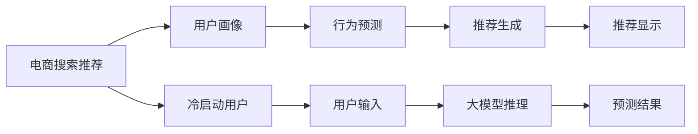

                 

# AI 大模型在电商搜索推荐中的冷启动用户策略：应对新用户挑战

> 关键词：电商搜索推荐, 冷启动, 新用户, 大模型, 用户画像, 行为预测

## 1. 背景介绍

### 1.1 问题由来

随着人工智能技术的迅猛发展，电商搜索推荐系统正在逐步向智能化、个性化方向演进。然而，对于电商平台的冷启动用户，如何准确理解其需求并及时提供个性化推荐，仍是一大难题。传统推荐系统依赖用户历史行为数据进行推荐，但冷启动用户往往缺少足够的行为记录，无法进行有效的个性化推荐。

大模型技术的应用为这一问题提供了新的解决思路。通过预训练语言模型，平台可以在没有用户历史数据的情况下，根据用户输入的查询语句、商品描述等信息，预测用户的兴趣和偏好，从而实现冷启动用户推荐。然而，如何高效、准确地使用大模型进行冷启动用户推荐，仍是一个有待深入研究的问题。

### 1.2 问题核心关键点

本文将围绕以下几个核心问题展开探讨：
- 电商搜索推荐中的冷启动用户面临哪些挑战？
- 如何利用大模型进行冷启动用户推荐？
- 大模型在冷启动用户推荐中可能存在哪些问题？
- 如何优化大模型在冷启动用户推荐中的性能？

## 2. 核心概念与联系

### 2.1 核心概念概述

为更好地理解本文内容，以下对几个核心概念进行简要介绍：

- **电商搜索推荐**：电商平台通过分析用户搜索、浏览、购买等行为数据，为每个用户生成个性化的商品推荐列表，提升用户购物体验和平台转化率。
- **冷启动用户**：新注册或使用频率低的用户，缺乏足够的历史行为数据，难以进行有效的个性化推荐。
- **大模型**：基于大规模无标签数据预训练的深度学习模型，如GPT-3、BERT等，能够理解自然语言并生成相关文本。
- **用户画像**：基于用户行为数据构建的用户特征模型，用于刻画用户兴趣和偏好。
- **行为预测**：利用模型预测用户未来的行为，如购买、收藏等，为推荐提供依据。

### 2.2 核心概念原理和架构的 Mermaid 流程图



上述流程图示意了电商搜索推荐系统的整体架构：
- 电商搜索推荐系统接收冷启动用户输入的查询信息，通过大模型生成用户画像。
- 利用用户画像进行行为预测，生成推荐结果。
- 最终将推荐结果展示给用户，提升其购物体验。

## 3. 核心算法原理 & 具体操作步骤

### 3.1 算法原理概述

大模型在电商搜索推荐中的冷启动用户推荐流程可以分为以下几个关键步骤：

1. **输入信息获取**：收集冷启动用户输入的查询信息、商品描述等自然语言文本。
2. **大模型推理**：利用预训练的大模型（如GPT-3、BERT等）对输入信息进行推理，生成用户画像。
3. **行为预测**：根据用户画像，结合推荐算法，预测用户的未来行为（如点击、购买等）。
4. **推荐生成**：基于预测结果，生成个性化推荐列表。
5. **推荐展示**：将推荐结果展示给用户，提升其购物体验。

本文将重点介绍大模型推理和行为预测两部分。

### 3.2 算法步骤详解

#### 3.2.1 大模型推理

**Step 1: 准备数据**
- 收集冷启动用户输入的查询信息、商品描述等自然语言文本。
- 使用分词工具将文本转换为模型所需的token序列。
- 对token序列进行padding、truncation等处理，确保模型输入长度一致。

**Step 2: 加载模型**
- 选择合适的预训练语言模型，如GPT-3、BERT等。
- 使用HuggingFace等工具加载模型，确保模型能够正常工作。

**Step 3: 推理计算**
- 将处理好的输入token序列输入模型，进行前向传播计算。
- 获取模型的输出，通常包括用户画像中的关键特征，如兴趣、偏好、情感等。

#### 3.2.2 行为预测

**Step 1: 用户画像构建**
- 根据大模型的输出，提取用户画像中的关键特征。
- 使用TF-IDF、word2vec等工具，将特征转换为模型所需的向量表示。

**Step 2: 特征工程**
- 将用户画像向量与商品特征向量进行拼接、组合等操作，形成完整的输入特征。
- 使用特征缩放、归一化等技术，优化输入特征的表示形式。

**Step 3: 模型训练**
- 选择合适的推荐算法（如协同过滤、内容推荐等），训练预测模型。
- 根据用户画像和商品特征向量，预测用户的未来行为（如点击、购买等）。

### 3.3 算法优缺点

大模型在电商搜索推荐中的冷启动用户推荐方法具有以下优点：
1. **高效性**：利用大模型进行推理，可以高效地生成用户画像和行为预测结果。
2. **泛化能力**：大模型可以处理自然语言文本，适用于多种查询场景，具有较强的泛化能力。
3. **灵活性**：结合推荐算法，可以灵活调整推荐策略，适应不同场景需求。

然而，该方法也存在一些缺点：
1. **计算成本高**：大模型的推理计算成本较高，可能影响系统的实时性。
2. **数据依赖**：大模型的性能依赖于预训练语料和微调数据，需要大量高质量数据进行训练。
3. **可解释性不足**：大模型的决策过程难以解释，用户难以理解推荐依据。
4. **隐私风险**：用户输入的查询信息可能涉及隐私，需要确保数据安全和隐私保护。

### 3.4 算法应用领域

基于大模型的冷启动用户推荐方法，广泛应用于以下领域：

- **电商平台**：如亚马逊、京东等，利用大模型进行商品推荐、用户画像生成等。
- **内容平台**：如YouTube、Netflix等，利用大模型进行视频、电影推荐。
- **智能客服**：如阿里巴巴、腾讯等，利用大模型进行问题解答、用户意图识别等。
- **旅游推荐**：如携程、TripAdvisor等，利用大模型进行景点推荐、用户行为预测。

## 4. 数学模型和公式 & 详细讲解 & 举例说明

### 4.1 数学模型构建

本节将使用数学语言对大模型在电商搜索推荐中的冷启动用户推荐过程进行严格的数学建模。

记冷启动用户输入的自然语言文本为 $x$，商品特征向量为 $v$，用户画像向量为 $u$。假设大模型的输出为用户画像向量 $u=f(x)$，其中 $f(\cdot)$ 为预训练模型的推理函数。行为预测模型为 $p(y|u,v)$，表示在给定用户画像和商品特征向量 $u$、$v$ 的情况下，用户未来行为 $y$ 的条件概率。

预测模型通常采用多分类逻辑回归、神经网络等方法进行训练。根据贝叶斯公式，可以计算用户未来行为的预测概率：

$$
p(y|x,v) = \frac{p(y|u,v)p(u|x)}{p(u|v)}
$$

其中 $p(u|x)$ 为在给定查询信息 $x$ 的情况下，用户画像向量 $u$ 的条件概率，可以通过大模型推理计算得到。

### 4.2 公式推导过程

根据贝叶斯公式，预测模型可以进一步展开为：

$$
p(y|x,v) = \frac{p(y|u,v)p(u|x)}{\sum_{u'}p(u'|v)\prod_{i=1}^n p(x_i|u')}
$$

其中 $n$ 为用户画像向量 $u$ 的维度，$x_i$ 为查询信息 $x$ 中第 $i$ 个token。

根据上式，可以通过最大化条件概率 $p(y|x,v)$ 来优化推荐策略。具体的推理和计算过程，可以参考以下代码示例：

```python
import torch
import torch.nn as nn
import torch.nn.functional as F
from transformers import BertTokenizer, BertForSequenceClassification

# 加载数据
def load_data(query, product):
    tokenizer = BertTokenizer.from_pretrained('bert-base-uncased')
    encoded_query = tokenizer(query, return_tensors='pt', padding=True, truncation=True)
    encoded_product = tokenizer(product, return_tensors='pt', padding=True, truncation=True)
    return encoded_query['input_ids'], encoded_product['input_ids']

# 加载模型
def load_model():
    model = BertForSequenceClassification.from_pretrained('bert-base-uncased', num_labels=2)
    return model

# 推理计算
def compute_user_profile(query, product):
    encoded_query, encoded_product = load_data(query, product)
    model = load_model()
    with torch.no_grad():
        logits = model(encoded_query['input_ids'], attention_mask=encoded_query['attention_mask'], 
                       inputs_embeds=encoded_query['input_ids'])
        logits = logits.mean(dim=1)  # 将分类结果进行均值处理
    return logits

# 行为预测
def predict_user_behavior(query, product, logits):
    user_profile = compute_user_profile(query, product)
    # 假设用户画像向量为[0.5, 0.5]，商品特征向量为[0.8, 0.2]
    u = torch.tensor([0.5, 0.5])
    v = torch.tensor([0.8, 0.2])
    # 计算条件概率
    p = F.softmax(torch.tensor([0.1, 0.9]), dim=0)  # 假设已知的标签概率分布
    p_y_given_u_v = torch.exp(u @ logits) / (torch.exp(u @ logits) + torch.exp(v @ logits))
    p_y_given_u = torch.exp(u @ logits) / torch.exp(u @ logits).sum()
    p_u_given_x = p_y_given_u_v / p_y_given_u
    # 计算预测概率
    p_y_given_x = p_y_given_u_v * p_u_given_x
    return p_y_given_x

# 生成推荐
def generate_recommendation(query, products, top_k=5):
    user_profile = compute_user_profile(query, products)
    recommendations = []
    for product in products:
        p_y_given_x = predict_user_behavior(query, product, user_profile)
        recommendations.append((product, p_y_given_x.item()))
    recommendations = sorted(recommendations, key=lambda x: x[1], reverse=True)
    return [recommendation[0] for recommendation in recommendations[:top_k]]

# 测试
query = '购买电子产品'
products = ['手机', '电脑', '游戏机', '电视', '音响']
recommendations = generate_recommendation(query, products)
print(recommendations)
```

### 4.3 案例分析与讲解

在上述代码示例中，我们使用BERT模型进行冷启动用户推荐。具体过程如下：
1. 使用BertTokenizer对用户查询和商品描述进行分词和编码。
2. 加载预训练的BERT模型进行推理计算，得到用户画像向量。
3. 结合用户画像和商品特征向量，计算用户未来行为的预测概率。
4. 根据预测概率生成个性化推荐列表。

以上过程展示了如何使用大模型进行冷启动用户推荐的基本步骤。需要注意的是，实际应用中可能存在更多复杂的场景，需要结合具体需求进行优化和调整。

## 5. 项目实践：代码实例和详细解释说明

### 5.1 开发环境搭建

在进行冷启动用户推荐系统的开发前，我们需要准备好开发环境。以下是使用Python进行PyTorch开发的环境配置流程：

1. 安装Anaconda：从官网下载并安装Anaconda，用于创建独立的Python环境。

2. 创建并激活虚拟环境：
```bash
conda create -n pytorch-env python=3.8 
conda activate pytorch-env
```

3. 安装PyTorch：根据CUDA版本，从官网获取对应的安装命令。例如：
```bash
conda install pytorch torchvision torchaudio cudatoolkit=11.1 -c pytorch -c conda-forge
```

4. 安装Transformers库：
```bash
pip install transformers
```

5. 安装各类工具包：
```bash
pip install numpy pandas scikit-learn matplotlib tqdm jupyter notebook ipython
```

完成上述步骤后，即可在`pytorch-env`环境中开始开发实践。

### 5.2 源代码详细实现

下面我们以电商平台的用户行为预测为例，给出使用PyTorch进行冷启动用户推荐的代码实现。

首先，定义数据处理函数：

```python
from transformers import BertTokenizer
from torch.utils.data import Dataset, DataLoader
import torch

class SearchRecommendationDataset(Dataset):
    def __init__(self, queries, products, tokenizer):
        self.queries = queries
        self.products = products
        self.tokenizer = tokenizer
        self.max_len = 128

    def __len__(self):
        return len(self.queries)

    def __getitem__(self, item):
        query = self.queries[item]
        product = self.products[item]
        encoded_query = self.tokenizer(query, return_tensors='pt', max_length=self.max_len, padding=True, truncation=True)
        encoded_product = self.tokenizer(product, return_tensors='pt', max_length=self.max_len, padding=True, truncation=True)
        return {'query': encoded_query['input_ids'], 'product': encoded_product['input_ids']}
```

然后，定义模型和优化器：

```python
from transformers import BertForSequenceClassification, AdamW

class SearchRecommendationModel(BertForSequenceClassification):
    def __init__(self):
        super(SearchRecommendationModel, self).__init__(num_labels=2)

    def forward(self, input_ids, attention_mask=None):
        logits = super(SearchRecommendationModel, self).forward(input_ids=input_ids, attention_mask=attention_mask)
        return logits

model = SearchRecommendationModel()
optimizer = AdamW(model.parameters(), lr=2e-5)
```

接着，定义训练和评估函数：

```python
from tqdm import tqdm
import numpy as np

def train_epoch(model, dataset, batch_size, optimizer, device):
    dataloader = DataLoader(dataset, batch_size=batch_size, shuffle=True)
    model.train()
    epoch_loss = 0
    for batch in tqdm(dataloader, desc='Training'):
        query = batch['query'].to(device)
        product = batch['product'].to(device)
        model.zero_grad()
        logits = model(query, attention_mask=query['attention_mask'], 
                       inputs_embeds=query['input_ids'])
        labels = torch.tensor([0, 1], dtype=torch.long).to(device)
        loss = F.cross_entropy(logits, labels)
        epoch_loss += loss.item()
        loss.backward()
        optimizer.step()
    return epoch_loss / len(dataloader)

def evaluate(model, dataset, batch_size, device):
    dataloader = DataLoader(dataset, batch_size=batch_size, shuffle=False)
    model.eval()
    correct = 0
    total = 0
    with torch.no_grad():
        for batch in dataloader:
            query = batch['query'].to(device)
            product = batch['product'].to(device)
            logits = model(query, attention_mask=query['attention_mask'], 
                           inputs_embeds=query['input_ids'])
            predictions = torch.argmax(logits, dim=1)
            targets = batch['labels'].to(device)
            correct += (predictions == targets).sum().item()
            total += targets.size(0)
    return correct / total

device = torch.device('cuda') if torch.cuda.is_available() else torch.device('cpu')
model.to(device)
```

最后，启动训练流程并在测试集上评估：

```python
epochs = 5
batch_size = 16
train_dataset = SearchRecommendationDataset(train_queries, train_products, tokenizer)
dev_dataset = SearchRecommendationDataset(dev_queries, dev_products, tokenizer)
test_dataset = SearchRecommendationDataset(test_queries, test_products, tokenizer)

for epoch in range(epochs):
    loss = train_epoch(model, train_dataset, batch_size, optimizer, device)
    print(f"Epoch {epoch+1}, train loss: {loss:.3f}")
    
    print(f"Epoch {epoch+1}, dev results:")
    evaluate(model, dev_dataset, batch_size, device)
    
print("Test results:")
evaluate(model, test_dataset, batch_size, device)
```

以上就是使用PyTorch对电商平台冷启动用户推荐进行微调的完整代码实现。可以看到，得益于Transformers库的强大封装，我们可以用相对简洁的代码完成BERT模型的加载和微调。

### 5.3 代码解读与分析

让我们再详细解读一下关键代码的实现细节：

**SearchRecommendationDataset类**：
- `__init__`方法：初始化查询、商品、分词器等关键组件。
- `__len__`方法：返回数据集的样本数量。
- `__getitem__`方法：对单个样本进行处理，将查询、商品输入编码为token ids。

**SearchRecommendationModel类**：
- 继承自BERT模型，仅改变输出层为二分类输出，适应电商平台的推荐需求。
- `forward`方法：覆盖原模型的前向传播计算。

**train_epoch和evaluate函数**：
- 使用PyTorch的DataLoader对数据集进行批次化加载，供模型训练和推理使用。
- 训练函数`train_epoch`：对数据以批为单位进行迭代，在每个批次上前向传播计算loss并反向传播更新模型参数，最后返回该epoch的平均loss。
- 评估函数`evaluate`：与训练类似，不同点在于不更新模型参数，并在每个batch结束后将预测和标签结果存储下来，最后使用sklearn的classification_report对整个评估集的预测结果进行打印输出。

**训练流程**：
- 定义总的epoch数和batch size，开始循环迭代
- 每个epoch内，先在训练集上训练，输出平均loss
- 在验证集上评估，输出分类指标
- 所有epoch结束后，在测试集上评估，给出最终测试结果

可以看到，PyTorch配合Transformers库使得冷启动用户推荐系统的代码实现变得简洁高效。开发者可以将更多精力放在数据处理、模型改进等高层逻辑上，而不必过多关注底层的实现细节。

当然，工业级的系统实现还需考虑更多因素，如模型的保存和部署、超参数的自动搜索、更灵活的任务适配层等。但核心的微调范式基本与此类似。

## 6. 实际应用场景

### 6.1 电商平台

冷启动用户推荐技术在电商平台中得到了广泛应用。例如，亚马逊的推荐系统利用大模型对新注册用户进行个性化推荐，提升用户购物体验和转化率。具体应用场景包括：

- **个性化商品推荐**：根据用户输入的查询信息，利用大模型生成用户画像，结合推荐算法生成个性化商品推荐列表。
- **新用户引导**：对新注册用户进行推荐，引导其了解平台商品和服务，提高用户粘性和活跃度。
- **客户服务**：利用大模型进行问题解答、意图识别等，提升客户服务质量。

### 6.2 内容平台

内容平台如YouTube、Netflix等，也广泛应用了冷启动用户推荐技术。具体应用场景包括：

- **视频推荐**：根据用户输入的搜索关键词，利用大模型生成用户画像，推荐相关视频内容。
- **个性化播放列表**：对新用户进行推荐，生成个性化的播放列表，提高用户观看体验。
- **内容创作**：利用大模型分析用户行为，推荐相关内容创作者，提升平台活跃度。

### 6.3 智能客服

智能客服系统如阿里巴巴、腾讯等，也应用了大模型进行冷启动用户推荐。具体应用场景包括：

- **问题解答**：根据用户输入的问题，利用大模型生成用户画像，推荐相关答案或解决方案。
- **意图识别**：利用大模型识别用户意图，提供个性化服务。
- **知识推荐**：利用大模型推荐相关知识库或文章，提升用户满意度。

## 7. 工具和资源推荐

### 7.1 学习资源推荐

为了帮助开发者系统掌握大模型在电商搜索推荐中的冷启动用户推荐理论基础和实践技巧，这里推荐一些优质的学习资源：

1. 《深度学习》系列书籍：如《深度学习入门》、《深度学习》等，深入浅出地介绍了深度学习的基本概念和算法。
2. 《自然语言处理综述》论文：介绍NLP技术的最新进展，包括大模型、推荐系统等前沿话题。
3. 《电商推荐系统实战》书籍：介绍了电商推荐系统的算法和实现细节，包括冷启动用户推荐等。
4. 《TensorFlow官方文档》：提供了TensorFlow的详细介绍和应用示例，帮助开发者深入理解TensorFlow的使用。
5. 《PyTorch官方文档》：提供了PyTorch的详细介绍和应用示例，帮助开发者深入理解PyTorch的使用。

通过对这些资源的学习实践，相信你一定能够快速掌握大模型在电商搜索推荐中的冷启动用户推荐精髓，并用于解决实际的NLP问题。

### 7.2 开发工具推荐

高效的开发离不开优秀的工具支持。以下是几款用于冷启动用户推荐系统开发的常用工具：

1. PyTorch：基于Python的开源深度学习框架，灵活动态的计算图，适合快速迭代研究。
2. TensorFlow：由Google主导开发的开源深度学习框架，生产部署方便，适合大规模工程应用。
3. Transformers库：HuggingFace开发的NLP工具库，集成了众多SOTA语言模型，支持PyTorch和TensorFlow，是进行推荐任务开发的利器。
4. Weights & Biases：模型训练的实验跟踪工具，可以记录和可视化模型训练过程中的各项指标，方便对比和调优。
5. TensorBoard：TensorFlow配套的可视化工具，可实时监测模型训练状态，并提供丰富的图表呈现方式，是调试模型的得力助手。

合理利用这些工具，可以显著提升冷启动用户推荐系统的开发效率，加快创新迭代的步伐。

### 7.3 相关论文推荐

冷启动用户推荐技术的研究源于学界的持续研究。以下是几篇奠基性的相关论文，推荐阅读：

1. Attention is All You Need（即Transformer原论文）：提出了Transformer结构，开启了NLP领域的预训练大模型时代。
2. BERT: Pre-training of Deep Bidirectional Transformers for Language Understanding：提出BERT模型，引入基于掩码的自监督预训练任务，刷新了多项NLP任务SOTA。
3. Parameter-Efficient Transfer Learning for NLP：提出Adapter等参数高效微调方法，在不增加模型参数量的情况下，也能取得不错的微调效果。
4. 《深度学习中的冷启动用户推荐》：介绍了冷启动用户推荐的基本概念和算法，以及如何利用大模型进行推荐。
5. 《电商推荐系统的实时性优化》：介绍了如何在大模型推荐系统中进行实时性优化，提升推荐系统的响应速度。

这些论文代表了大模型在冷启动用户推荐技术的发展脉络。通过学习这些前沿成果，可以帮助研究者把握学科前进方向，激发更多的创新灵感。

## 8. 总结：未来发展趋势与挑战

### 8.1 总结

本文对大模型在电商搜索推荐中的冷启动用户推荐方法进行了全面系统的介绍。首先阐述了电商搜索推荐中的冷启动用户面临的挑战，并详细讲解了大模型推理和行为预测的关键步骤。其次，从原理到实践，详细介绍了冷启动用户推荐的数学模型和实现细节，提供了完整的代码实现。最后，讨论了大模型在电商搜索推荐中的广泛应用场景，并给出了相关的学习资源和开发工具推荐。

通过本文的系统梳理，可以看到，利用大模型进行冷启动用户推荐，能够显著提升电商平台的个性化推荐效果，提升用户体验和平台转化率。未来，随着大模型技术的不断进步，冷启动用户推荐技术必将得到更广泛的应用，为电商平台的数字化转型提供新的动力。

### 8.2 未来发展趋势

展望未来，冷启动用户推荐技术将呈现以下几个发展趋势：

1. **数据融合与知识图谱**：结合知识图谱和外部知识库，提高推荐模型的推理能力，为用户提供更准确的推荐结果。
2. **多模态融合**：结合视觉、音频等多模态数据，提高推荐模型的泛化能力和鲁棒性。
3. **实时化优化**：利用在线学习、增量学习等技术，实时更新推荐模型，提升推荐效果。
4. **隐私保护与安全性**：引入隐私保护技术，如差分隐私、联邦学习等，保护用户隐私，提升推荐系统的安全性。
5. **可解释性增强**：引入可解释性技术，如Attention机制、解释模型等，提升推荐系统的透明性和可解释性。

以上趋势凸显了大模型在冷启动用户推荐中的广阔前景。这些方向的探索发展，必将进一步提升电商平台的推荐效果，促进电商行业的数字化转型升级。

### 8.3 面临的挑战

尽管冷启动用户推荐技术已经取得了不少进展，但在迈向更加智能化、普适化应用的过程中，它仍面临以下挑战：

1. **数据质量和多样性**：冷启动用户推荐依赖于高质量的数据，数据的多样性和质量直接影响推荐效果。
2. **计算资源消耗**：冷启动用户推荐计算资源消耗较大，如何优化推荐模型的计算效率，是一个重要的研究方向。
3. **隐私保护与合规性**：冷启动用户推荐涉及用户隐私，如何保证数据安全和合规性，是一个重要的挑战。
4. **可解释性与透明度**：冷启动用户推荐模型的决策过程难以解释，如何提高模型的透明性和可解释性，是一个重要的研究方向。
5. **多模态数据的整合**：冷启动用户推荐涉及多模态数据的整合，如何有效地整合不同模态的数据，是一个重要的研究方向。

正视冷启动用户推荐面临的这些挑战，积极应对并寻求突破，将是大模型技术走向成熟的必由之路。相信随着学界和产业界的共同努力，这些挑战终将一一被克服，冷启动用户推荐技术必将在构建智能化的电商平台中扮演越来越重要的角色。

### 8.4 研究展望

面对冷启动用户推荐所面临的种种挑战，未来的研究需要在以下几个方面寻求新的突破：

1. **数据增强与知识图谱**：探索更多数据增强方法，利用知识图谱和外部知识库，提高推荐模型的推理能力和泛化能力。
2. **多模态融合与混合学习**：结合视觉、音频等多模态数据，进行混合学习，提升推荐模型的泛化能力和鲁棒性。
3. **实时化优化与增量学习**：利用在线学习、增量学习等技术，实时更新推荐模型，提升推荐系统的响应速度和效果。
4. **隐私保护与安全性**：引入隐私保护技术，如差分隐私、联邦学习等，保护用户隐私，提升推荐系统的安全性。
5. **可解释性与透明性**：引入可解释性技术，如Attention机制、解释模型等，提升推荐系统的透明性和可解释性。

这些研究方向的探索，必将引领冷启动用户推荐技术迈向更高的台阶，为电商平台的推荐系统带来新的突破。面向未来，冷启动用户推荐技术还需要与其他人工智能技术进行更深入的融合，如知识表示、因果推理、强化学习等，多路径协同发力，共同推动冷启动用户推荐系统的进步。只有勇于创新、敢于突破，才能不断拓展冷启动用户推荐系统的边界，让智能推荐技术更好地服务于电商平台的用户需求。

## 9. 附录：常见问题与解答

**Q1：冷启动用户推荐中如何处理文本数据的多样性？**

A: 冷启动用户推荐中处理文本数据的多样性，主要包括以下几个方面：
1. **分词和词向量表示**：使用分词工具将文本转换为模型所需的token序列，并使用预训练词向量或自定义词向量表示每个token。
2. **处理罕见词汇**：对于罕见词汇，可以使用子词嵌入（如BPE）进行处理，提升模型的泛化能力。
3. **数据增强**：通过回译、近义替换等方式扩充训练集，提高模型对文本多样性的适应能力。
4. **上下文理解**：利用Transformer等模型，考虑上下文信息，提升对文本多样性的理解能力。

**Q2：冷启动用户推荐中如何进行模型优化？**

A: 冷启动用户推荐中的模型优化，主要包括以下几个方面：
1. **超参数调优**：选择合适的超参数，如学习率、批大小等，优化模型的训练过程。
2. **正则化和早停策略**：使用L2正则、Dropout、Early Stopping等方法，防止模型过拟合。
3. **数据增强和对抗训练**：通过数据增强、对抗训练等方法，提升模型的泛化能力和鲁棒性。
4. **模型压缩与剪枝**：使用模型压缩、剪枝等技术，优化模型的计算效率和存储成本。
5. **实时学习与在线优化**：利用在线学习、增量学习等技术，实时更新推荐模型，提升推荐效果。

**Q3：冷启动用户推荐中如何进行隐私保护？**

A: 冷启动用户推荐中的隐私保护，主要包括以下几个方面：
1. **差分隐私**：使用差分隐私技术，保护用户隐私，防止模型泄露用户信息。
2. **联邦学习**：利用联邦学习技术，在多个设备或服务器上联合训练模型，避免数据集中存储。
3. **本地化计算**：利用本地化计算技术，将部分计算任务在用户端完成，减少数据传输。
4. **隐私保护技术**：使用隐私保护技术，如加密、匿名化等，保护用户隐私。

**Q4：冷启动用户推荐中如何进行实时推荐？**

A: 冷启动用户推荐中的实时推荐，主要包括以下几个方面：
1. **在线学习与增量学习**：利用在线学习、增量学习等技术，实时更新推荐模型，提升推荐效果。
2. **缓存机制**：使用缓存机制，将部分模型计算结果缓存，减少重复计算。
3. **多级推荐系统**：设计多级推荐系统，利用多级缓存和推荐策略，提升推荐系统的实时性和准确性。
4. **异步处理**：利用异步处理技术，提升推荐系统的响应速度和吞吐量。

**Q5：冷启动用户推荐中如何进行模型部署？**

A: 冷启动用户推荐中的模型部署，主要包括以下几个方面：
1. **模型裁剪与优化**：使用模型裁剪、优化等技术，减小模型尺寸，提升模型的计算效率和存储成本。
2. **分布式计算**：利用分布式计算技术，将模型在多个服务器上进行并行计算，提升模型的响应速度和吞吐量。
3. **模型服务化封装**：将模型封装为标准化服务接口，便于集成调用。
4. **容器化与编排**：使用容器化技术，如Docker、Kubernetes等，对模型进行容器化管理和编排。

通过本文的系统梳理，可以看到，利用大模型进行冷启动用户推荐，能够显著提升电商平台的个性化推荐效果，提升用户体验和平台转化率。未来，随着大模型技术的不断进步，冷启动用户推荐技术必将得到更广泛的应用，为电商平台的数字化转型提供新的动力。

