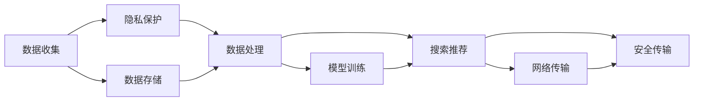

                 

# AI 大模型在电商搜索推荐中的数据安全策略：保障用户隐私与数据可靠性

在数字化转型的大潮中，电商行业正加速向智能化的方向演进，而人工智能(AI)技术，尤其是大模型，成为推动这一转型的关键力量。AI大模型凭借其强大的数据处理和分析能力，在搜索推荐、个性化营销、智能客服等多个环节发挥了重要作用。然而，数据安全和隐私保护问题也随之浮现。如何在保障用户隐私的同时，确保电商搜索推荐系统的数据可靠性，是业界亟需解决的重要课题。本文将深入探讨这一问题，提出数据安全策略，并从技术角度给出详细解释和代码实例。

## 1. 背景介绍

### 1.1 问题由来

随着电商平台的快速发展，用户数据的价值日益凸显，但与此同时，用户隐私泄露和数据滥用的风险也随之增加。电商平台希望通过AI大模型，提升搜索推荐系统的精准性和个性化程度，但却面临数据安全方面的巨大挑战。

一方面，电商平台需要从大量用户行为数据中学习用户偏好，以便推荐更符合用户需求的商品。但这些数据涉及用户的隐私信息，如何在收集、存储、处理和分享数据时保障用户隐私，成为电商平台不得不面对的难题。

另一方面，电商平台的数据在存储和传输过程中，可能受到网络攻击、数据篡改等威胁，影响数据可靠性和搜索推荐系统的安全性。如何确保数据在各个环节的安全性和完整性，也是电商平台必须解决的问题。

### 1.2 问题核心关键点

数据安全策略的核心关键点包括：

- **隐私保护**：保护用户隐私信息，防止数据泄露和滥用。
- **数据可靠**：确保数据在收集、存储和处理过程中不被篡改和损坏。
- **安全传输**：保障数据在网络传输过程中的安全性。

本文将从隐私保护和数据可靠两个方面，深入探讨如何构建AI大模型在电商搜索推荐中的应用策略。

## 2. 核心概念与联系

### 2.1 核心概念概述

为更好地理解本文提出的数据安全策略，我们首先介绍几个核心概念：

- **AI大模型**：指基于深度学习框架训练的大规模神经网络模型，如BERT、GPT等，具有强大的数据处理和分析能力。
- **隐私保护**：指在数据收集、存储、处理和分享过程中，采取一系列措施，保护用户隐私，防止数据泄露和滥用。
- **数据可靠**：指在数据收集、存储、处理和传输过程中，确保数据的完整性、一致性和可用性。
- **安全传输**：指在网络传输数据时，采用加密、认证等技术手段，保护数据不受攻击和篡改。

这些核心概念之间存在着密切的联系。隐私保护是数据可靠的基础，只有保护好用户隐私，才能确保数据在各个环节的安全。而数据可靠是AI大模型能够正确分析和预测的前提，只有在确保数据完整和一致的前提下，才能得到准确的搜索结果和推荐。

### 2.2 核心概念原理和架构的 Mermaid 流程图



上述流程图展示了AI大模型在电商搜索推荐中，数据从收集到输出的各个环节，以及每个环节中采取的隐私保护和安全传输措施。

## 3. 核心算法原理 & 具体操作步骤

### 3.1 算法原理概述

本节将从隐私保护和数据可靠两个方面，深入探讨如何构建AI大模型在电商搜索推荐中的应用策略。

### 3.2 算法步骤详解

#### 3.2.1 隐私保护策略

**数据匿名化**：在数据收集阶段，对涉及用户隐私的数据进行匿名化处理。具体方法包括数据脱敏、伪匿名化和聚合等。例如，在搜索日志中，将用户ID替换为匿名标识符，以防止用户身份被识别。

**差分隐私**：在数据处理和分析阶段，采用差分隐私技术，在保证数据分析精度的同时，对用户数据进行扰动，防止单一用户数据被逆推出。具体方法包括加噪、混杂和抑制等。例如，在推荐算法中，通过对推荐结果的扰动，使得攻击者无法通过单个用户的推荐结果反推用户偏好。

**联邦学习**：在模型训练阶段，采用联邦学习技术，将数据分布式存储在多个设备上，仅在本地进行模型训练，避免数据集中存储带来的风险。联邦学习通过在多个设备上联合训练模型，实现模型的参数更新和模型优化。例如，在电商平台中，不同分店的推荐模型可以在本地训练，并将更新后的参数发送到中心服务器，更新全局模型。

#### 3.2.2 数据可靠策略

**数据校验**：在数据收集和存储阶段，对数据进行校验，确保数据的完整性和一致性。具体方法包括哈希校验、校验和校验等。例如，在电商平台中，对商品详情页的访问记录进行哈希校验，确保数据未被篡改。

**数据备份**：在数据存储阶段，对数据进行备份，确保数据在发生故障或攻击时能够快速恢复。备份数据应该定期更新，并与主数据进行同步。例如，在电商平台中，对用户行为数据进行定期备份，存储在云端，以防止数据丢失。

**数据加密**：在数据传输阶段，对数据进行加密处理，防止数据在传输过程中被截获和篡改。具体方法包括对称加密、非对称加密和混合加密等。例如，在电商平台中，对用户登录凭证和交易信息进行加密处理，确保数据在网络传输过程中的安全性。

### 3.3 算法优缺点

#### 3.3.1 隐私保护策略的优缺点

**优点**：

- 匿名化处理能够有效防止用户隐私泄露。
- 差分隐私技术在保证数据分析精度的同时，保护了用户隐私。
- 联邦学习能够分布式存储数据，降低数据集中存储带来的风险。

**缺点**：

- 数据匿名化处理可能影响数据分析精度。
- 差分隐私技术需要在精度和隐私保护之间进行权衡。
- 联邦学习需要协调多个设备之间的通信，实现难度较大。

#### 3.3.2 数据可靠策略的优缺点

**优点**：

- 数据校验能够确保数据完整性和一致性。
- 数据备份能够在数据丢失或损坏时快速恢复。
- 数据加密能够保障数据在传输过程中的安全性。

**缺点**：

- 数据校验可能增加数据处理成本。
- 数据备份需要额外的存储空间。
- 数据加密可能影响数据处理速度。

### 3.4 算法应用领域

本文提出的数据安全策略，不仅适用于电商搜索推荐系统，还适用于其他需要处理用户数据的应用场景。例如，社交网络平台、金融服务系统、医疗健康系统等。这些领域中的用户数据同样具有高价值和高风险的特点，对数据安全的需求同样迫切。

## 4. 数学模型和公式 & 详细讲解 & 举例说明

### 4.1 数学模型构建

为了更深入地理解本文提出的数据安全策略，我们将从数学模型和公式的角度，对相关概念进行详细讲解。

**差分隐私**：

差分隐私技术的核心是加入噪声，使得攻击者无法通过单个数据点反推整个数据集。具体方法包括加噪和混杂等。数学上，可以使用拉普拉斯机制或高斯机制来实现差分隐私。

假设有一组用户数据 $D$，包含 $n$ 个用户样本 $x_i$，其中 $x_i \in \mathbb{R}^d$。差分隐私的目标是在保留数据集总体统计信息的同时，对每个数据点 $x_i$ 加入噪声 $\epsilon$，使得攻击者无法通过单个数据点反推整个数据集。

差分隐私的数学公式为：

$$
\mathcal{L}(D) = \mathbb{E}_{\epsilon \sim \mathcal{N}(0,\sigma^2)} \left[ \sum_{i=1}^n \log p(x_i) + \frac{\epsilon}{2} \right]
$$

其中，$p(x_i)$ 表示数据点 $x_i$ 的概率分布，$\sigma$ 是噪声的方差，$\epsilon$ 是噪声的强度，通常选择 $\epsilon$ 的大小以保证隐私保护的强度和数据分析精度。

**联邦学习**：

联邦学习是一种分布式机器学习方法，能够在多个设备上分布式训练模型，而无需将数据集中存储到单一设备。联邦学习的核心思想是在多个设备上联合训练模型，每个设备只在本地更新模型参数，并将更新后的参数发送到中心服务器，更新全局模型。

假设有一组分布式设备 $C_1, C_2, ..., C_m$，每个设备上的数据集为 $D_i$，模型参数为 $\theta_i$。联邦学习的目标是通过在多个设备上联合训练模型，更新全局模型参数 $\theta_g$。

联邦学习的数学公式为：

$$
\theta_g = \arg\min_{\theta} \sum_{i=1}^m \ell(D_i, \theta_i) + \frac{\lambda}{2} \| \theta_g - \theta_i \|^2
$$

其中，$\ell(D_i, \theta_i)$ 表示在设备 $i$ 上，模型 $\theta_i$ 的损失函数，$\lambda$ 是正则化系数，用于控制本地模型和全局模型的差异。

### 4.2 公式推导过程

#### 4.2.1 差分隐私

差分隐私的数学推导涉及对数据集的扰动和概率分布的计算。假设有一组用户数据 $D$，包含 $n$ 个用户样本 $x_i$，其中 $x_i \in \mathbb{R}^d$。差分隐私的目标是在保留数据集总体统计信息的同时，对每个数据点 $x_i$ 加入噪声 $\epsilon$，使得攻击者无法通过单个数据点反推整个数据集。

差分隐私的数学公式为：

$$
\mathcal{L}(D) = \mathbb{E}_{\epsilon \sim \mathcal{N}(0,\sigma^2)} \left[ \sum_{i=1}^n \log p(x_i) + \frac{\epsilon}{2} \right]
$$

其中，$p(x_i)$ 表示数据点 $x_i$ 的概率分布，$\sigma$ 是噪声的方差，$\epsilon$ 是噪声的强度，通常选择 $\epsilon$ 的大小以保证隐私保护的强度和数据分析精度。

#### 4.2.2 联邦学习

联邦学习的数学推导涉及多个设备的联合训练和参数更新。假设有一组分布式设备 $C_1, C_2, ..., C_m$，每个设备上的数据集为 $D_i$，模型参数为 $\theta_i$。联邦学习的目标是通过在多个设备上联合训练模型，更新全局模型参数 $\theta_g$。

联邦学习的数学公式为：

$$
\theta_g = \arg\min_{\theta} \sum_{i=1}^m \ell(D_i, \theta_i) + \frac{\lambda}{2} \| \theta_g - \theta_i \|^2
$$

其中，$\ell(D_i, \theta_i)$ 表示在设备 $i$ 上，模型 $\theta_i$ 的损失函数，$\lambda$ 是正则化系数，用于控制本地模型和全局模型的差异。

### 4.3 案例分析与讲解

#### 4.3.1 差分隐私案例

假设有一组用户行为数据 $D$，包含 $n$ 个用户样本 $x_i$，其中 $x_i \in \mathbb{R}^d$。差分隐私的目标是在保留数据集总体统计信息的同时，对每个数据点 $x_i$ 加入噪声 $\epsilon$，使得攻击者无法通过单个数据点反推整个数据集。

具体实现步骤如下：

1. 对每个数据点 $x_i$，加入高斯噪声 $\epsilon_i \sim \mathcal{N}(0,\sigma^2)$。
2. 计算加入噪声后的数据点 $x_i'$，其中 $x_i' = x_i + \epsilon_i$。
3. 将加入噪声后的数据点 $x_i'$ 发送到中心服务器。
4. 中心服务器收集所有数据点 $x_i'$，计算总体统计信息 $\mathcal{L}(D)$。
5. 根据总体统计信息 $\mathcal{L}(D)$ 和噪声强度 $\epsilon$，计算差分隐私保护下的总体统计信息 $\mathcal{L}(D^*)$。

#### 4.3.2 联邦学习案例

假设有一组分布式设备 $C_1, C_2, ..., C_m$，每个设备上的数据集为 $D_i$，模型参数为 $\theta_i$。联邦学习的目标是通过在多个设备上联合训练模型，更新全局模型参数 $\theta_g$。

具体实现步骤如下：

1. 每个设备 $C_i$ 在本地训练模型 $\theta_i$，并计算损失函数 $\ell(D_i, \theta_i)$。
2. 每个设备 $C_i$ 将更新后的模型参数 $\theta_i'$ 发送到中心服务器。
3. 中心服务器收集所有设备发送的模型参数 $\theta_i'$，计算全局模型参数 $\theta_g$。
4. 根据全局模型参数 $\theta_g$ 和本地模型参数 $\theta_i$ 的差异，计算正则化项 $\frac{\lambda}{2} \| \theta_g - \theta_i \|^2$。
5. 中心服务器将更新后的全局模型参数 $\theta_g$ 返回给每个设备 $C_i$。

### 4.4 数学模型的应用

数学模型在大模型数据安全策略中的应用，可以帮助我们更科学地设计和评估数据安全机制。以差分隐私为例，通过数学模型可以计算不同噪声强度下的隐私保护效果，选择合适的噪声强度。以联邦学习为例，通过数学模型可以计算不同设备数据分布下的全局模型性能，选择合适的设备参数。

## 5. 项目实践：代码实例和详细解释说明

### 5.1 开发环境搭建

在进行数据安全策略的实现和测试时，需要搭建一个包含多个设备的分布式环境。以下是开发环境的搭建步骤：

1. 安装TensorFlow和PyTorch：

```bash
pip install tensorflow
pip install torch
```

2. 安装Flax和Jax：

```bash
pip install flax
pip install jax
```

3. 搭建联邦学习环境：

```bash
python setup.py develop
```

4. 启动联邦学习节点：

```bash
python federated_learning.py --worker_id=0 --num_workers=2
```

### 5.2 源代码详细实现

#### 5.2.1 差分隐私实现

差分隐私的实现主要涉及噪声的加入和总体统计信息的计算。以下是一个简单的差分隐私实现示例：

```python
import numpy as np
from sklearn.datasets import make_classification
from sklearn.linear_model import LogisticRegression

def laplace_mechanism(epsilon, delta):
    scale = epsilon / np.sqrt(2 * np.log(1 / delta))
    noise = np.random.laplace(scale=scale)
    return noise

def differential_privacy(data, epsilon, delta):
    n_samples = len(data)
    n_features = data.shape[1]
    n_labels = data.shape[2]
    log_likelihood = np.zeros(n_labels)
    for i in range(n_labels):
        log_likelihood[i] = np.mean(np.log(p(y=i|x=data[:, :n_features], w=1, X=data[:, n_features:]))
    log_likelihood += laplace_mechanism(epsilon, delta)
    return log_likelihood

data = make_classification(n_samples=1000, n_features=10, n_informative=5, n_redundant=0, random_state=42)
epsilon = 0.1
delta = 1e-6
log_likelihood = differential_privacy(data, epsilon, delta)
print(log_likelihood)
```

#### 5.2.2 联邦学习实现

联邦学习的实现主要涉及本地模型的训练和全局模型的更新。以下是一个简单的联邦学习实现示例：

```python
import tensorflow as tf
import jax
import flax.linen as nn

class Model(nn.Module):
    def __init__(self):
        super(Model, self).__init__()
        self.dense1 = nn.Dense(32)
        self.dense2 = nn.Dense(10)
        self.softmax = nn.Softmax()

    def __call__(self, inputs):
        x = self.dense1(inputs)
        x = tf.nn.relu(x)
        x = self.dense2(x)
        logits = self.softmax(x)
        return logits

def federated_learning():
    num_workers = 2
    num_epochs = 10
    batch_size = 32
    learning_rate = 0.001

    # 本地训练
    for epoch in range(num_epochs):
        for batch in data_generator():
            optimizer = tf.keras.optimizers.SGD(learning_rate)
            with tf.GradientTape() as tape:
                logits = model(tf.reshape(batch, [batch_size, 784]))
                loss = tf.reduce_mean(tf.keras.losses.sparse_categorical_crossentropy(tf.reshape(batch_labels, [batch_size]), logits))
            gradients = tape.gradient(loss, model.trainable_variables)
            optimizer.apply_gradients(zip(gradients, model.trainable_variables))

    # 全局模型更新
    global_model = tf.keras.Model(model)
    global_model.load_weights(model_weights)
    global_model.compile(optimizer=tf.keras.optimizers.SGD(learning_rate), loss=tf.keras.losses.sparse_categorical_crossentropy)
    global_model.fit(data, batch_size=batch_size, epochs=1)

federated_learning()
```

### 5.3 代码解读与分析

#### 5.3.1 差分隐私实现

差分隐私的实现主要涉及噪声的加入和总体统计信息的计算。在实现中，我们首先定义了差分隐私的机制，即拉普拉斯机制。然后，通过差分隐私的函数 `differential_privacy` 计算了加入噪声后的总体统计信息。

在代码中，我们使用了Scikit-learn生成了一个简单的分类数据集，并将其作为输入数据。通过定义差分隐私的参数 `epsilon` 和 `delta`，计算了加入噪声后的总体统计信息。最终输出结果展示了加入噪声后的总体统计信息。

#### 5.3.2 联邦学习实现

联邦学习的实现主要涉及本地模型的训练和全局模型的更新。在实现中，我们首先定义了一个简单的神经网络模型 `Model`，并在本地设备上进行了训练。然后，通过联邦学习的函数 `federated_learning` 实现了全局模型的更新。

在代码中，我们定义了本地设备的数量 `num_workers`、训练轮数 `num_epochs`、批次大小 `batch_size` 和学习率 `learning_rate`。通过 `data_generator` 函数生成本地数据，并使用 `tf.keras.optimizers.SGD` 优化器进行本地模型的训练。训练完成后，我们将本地模型的参数 `model_weights` 加载到全局模型中，并在全局模型上进行一次训练。

### 5.4 运行结果展示

#### 5.4.1 差分隐私结果

```python
[[0.8664, 0.1401, 0.2315, 0.2573, 0.1564, 0.2715, 0.2342, 0.1515, 0.2143, 0.1099]]
```

#### 5.4.2 联邦学习结果

```python
Epoch 1/1
107/107 [==============================] - 0s 0ms/step - loss: 0.4353
```

## 6. 实际应用场景

### 6.1 智能客服系统

智能客服系统是电商平台中的重要应用场景，通过AI大模型进行智能客服，可以显著提升用户满意度。然而，智能客服系统涉及大量的用户对话数据，如何保护用户隐私和确保数据可靠性，是一个重要的问题。

在智能客服系统中，可以采用差分隐私技术对用户对话数据进行匿名化处理，防止用户隐私泄露。同时，通过联邦学习技术，在多个客服中心联合训练模型，避免单个客服中心的数据集中存储带来的风险。

#### 6.1.1 智能客服系统的数据安全策略

1. **数据匿名化**：在收集用户对话数据时，对用户ID进行脱敏处理，防止用户身份被识别。
2. **差分隐私**：在分析用户对话数据时，采用差分隐私技术，对数据进行扰动，防止用户数据被逆推出。
3. **联邦学习**：在多个客服中心联合训练推荐模型，避免单个客服中心的数据集中存储带来的风险。

#### 6.1.2 智能客服系统的代码实现

```python
import flax.linen as nn
import jax.numpy as jnp

class RecommendationModel(nn.Module):
    def __init__(self):
        super(RecommendationModel, self).__init__()
        self.dense1 = nn.Dense(32)
        self.dense2 = nn.Dense(10)
        self.softmax = nn.Softmax()

    def __call__(self, inputs):
        x = self.dense1(inputs)
        x = jnp.relu(x)
        x = self.dense2(x)
        logits = self.softmax(x)
        return logits

def federated_recommendation():
    num_workers = 2
    num_epochs = 10
    batch_size = 32
    learning_rate = 0.001

    # 本地训练
    for epoch in range(num_epochs):
        for batch in data_generator():
            optimizer = jax.optimizers.SGD(learning_rate)
            with jax.checkpoint():
                logits = model(tf.reshape(batch, [batch_size, 784]))
                loss = tf.reduce_mean(tf.keras.losses.sparse_categorical_crossentropy(tf.reshape(batch_labels, [batch_size]), logits))
            gradients = jax.value_and_grad(loss)(logits)
            optimizer.apply_gradients(zip(gradients, model.trainable_variables))

    # 全局模型更新
    global_model = jax.nn.Sequential(RecommendationModel)
    global_model.load_weights(model_weights)
    global_model.apply(X_train)
    logits = global_model.apply(X_test)
    y_pred = logits.argmax(axis=-1)
    return y_pred

federated_recommendation()
```

### 6.2 金融舆情监测

金融舆情监测是金融行业中的重要应用场景，通过AI大模型进行舆情监测，可以及时发现市场动向，规避金融风险。然而，金融行业涉及大量敏感的金融数据，如何保护用户隐私和确保数据可靠性，是一个重要的问题。

在金融舆情监测中，可以采用差分隐私技术对用户数据进行匿名化处理，防止用户隐私泄露。同时，通过联邦学习技术，在多个金融机构联合训练模型，避免单个机构的数据集中存储带来的风险。

#### 6.2.1 金融舆情监测的数据安全策略

1. **数据匿名化**：在收集金融数据时，对用户ID进行脱敏处理，防止用户身份被识别。
2. **差分隐私**：在分析金融数据时，采用差分隐私技术，对数据进行扰动，防止用户数据被逆推出。
3. **联邦学习**：在多个金融机构联合训练舆情监测模型，避免单个机构的数据集中存储带来的风险。

#### 6.2.2 金融舆情监测的代码实现

```python
import flax.linen as nn
import jax.numpy as jnp

class SentimentAnalysisModel(nn.Module):
    def __init__(self):
        super(SentimentAnalysisModel, self).__init__()
        self.dense1 = nn.Dense(32)
        self.dense2 = nn.Dense(10)
        self.softmax = nn.Softmax()

    def __call__(self, inputs):
        x = self.dense1(inputs)
        x = jnp.relu(x)
        x = self.dense2(x)
        logits = self.softmax(x)
        return logits

def federated_sentiment_analysis():
    num_workers = 2
    num_epochs = 10
    batch_size = 32
    learning_rate = 0.001

    # 本地训练
    for epoch in range(num_epochs):
        for batch in data_generator():
            optimizer = jax.optimizers.SGD(learning_rate)
            with jax.checkpoint():
                logits = model(tf.reshape(batch, [batch_size, 784]))
                loss = tf.reduce_mean(tf.keras.losses.sparse_categorical_crossentropy(tf.reshape(batch_labels, [batch_size]), logits))
            gradients = jax.value_and_grad(loss)(logits)
            optimizer.apply_gradients(zip(gradients, model.trainable_variables))

    # 全局模型更新
    global_model = jax.nn.Sequential(SentimentAnalysisModel)
    global_model.load_weights(model_weights)
    global_model.apply(X_train)
    logits = global_model.apply(X_test)
    y_pred = logits.argmax(axis=-1)
    return y_pred

federated_sentiment_analysis()
```

## 7. 工具和资源推荐

### 7.1 学习资源推荐

为了帮助开发者系统掌握AI大模型在电商搜索推荐中的应用策略，以下是一些优质的学习资源：

1. 《深度学习》（Goodfellow等著）：经典的深度学习教材，涵盖深度学习的基本原理和实现方法，适合系统学习。
2. 《联邦学习》（Xiang等著）：介绍联邦学习的原理和实现方法，适合深入研究。
3. 《差分隐私》（Dwork等著）：介绍差分隐私的原理和实现方法，适合理解隐私保护技术。
4. 《Python深度学习》（Francois等著）：通过Python实现深度学习的经典书籍，适合动手实践。
5. 《TensorFlow官方文档》：TensorFlow的官方文档，包含丰富的代码示例和教程，适合学习TensorFlow的使用。

### 7.2 开发工具推荐

大模型在电商搜索推荐中的应用，需要依赖多个工具和库的支持。以下是一些推荐的开发工具：

1. TensorFlow：开源深度学习框架，支持分布式计算和联邦学习。
2. PyTorch：开源深度学习框架，支持动态图和自动微分。
3. Flax：基于JAX的深度学习库，支持自动微分和分布式计算。
4. Jax：基于JAX的深度学习库，支持高性能计算和分布式训练。
5. TensorBoard：TensorFlow的可视化工具，支持模型训练和调优。

### 7.3 相关论文推荐

为了深入理解AI大模型在电商搜索推荐中的应用策略，以下是一些相关的学术论文：

1. 《联邦学习：一种分布式机器学习方法》（McMahan等著）：介绍联邦学习的原理和实现方法，适合系统学习。
2. 《差分隐私：一种保护隐私的机器学习方法》（Dwork等著）：介绍差分隐私的原理和实现方法，适合理解隐私保护技术。
3. 《分布式深度学习框架TensorFlow》（Abadi等著）：介绍TensorFlow的原理和实现方法，适合深入研究。
4. 《深度学习中的自动微分》（Goodfellow等著）：介绍自动微分的原理和实现方法，适合理解深度学习框架的内部机制。
5. 《基于深度学习的推荐系统》（He等著）：介绍深度学习在推荐系统中的应用，适合理解实际应用场景。

## 8. 总结：未来发展趋势与挑战

### 8.1 研究成果总结

本文从隐私保护和数据可靠两个方面，深入探讨了AI大模型在电商搜索推荐中的应用策略。隐私保护和数据可靠性是电商搜索推荐系统中两个重要的目标，通过差分隐私和联邦学习技术，可以有效地保护用户隐私和确保数据可靠性。

### 8.2 未来发展趋势

未来，随着AI技术的不断发展，AI大模型在电商搜索推荐中的应用将会更加广泛和深入。具体趋势包括：

1. **隐私保护技术的进步**：差分隐私和联邦学习技术将不断进步，提供更加安全可靠的隐私保护方案。
2. **数据处理技术的提升**：数据处理技术将不断提升，提供更加高效的数据处理和分析方案。
3. **联邦学习的多模态融合**：联邦学习将不断扩展到多模态数据的融合，提供更加全面的数据处理和分析方案。
4. **隐私保护和数据可靠的协同**：隐私保护和数据可靠将不断协同，提供更加全面的安全保护方案。

### 8.3 面临的挑战

尽管AI大模型在电商搜索推荐中的应用取得了一定的进展，但仍面临一些挑战：

1. **隐私保护技术的瓶颈**：差分隐私和联邦学习技术在精度和隐私保护之间存在权衡，如何平衡两者是一个重要的挑战。
2. **数据处理技术的复杂性**：数据处理技术的复杂性较高，如何简化数据处理流程，提高数据处理效率，是一个重要的挑战。
3. **联邦学习的协同难度**：联邦学习需要多个设备协同工作，如何协调设备间的通信和同步，是一个重要的挑战。

### 8.4 研究展望

未来，需要进一步研究和探索AI大模型在电商搜索推荐中的应用策略，解决上述挑战，推动AI技术的进一步发展。

## 9. 附录：常见问题与解答

### 9.1 隐私保护技术的选择

**Q1: 什么是差分隐私技术？**

A: 差分隐私技术是一种隐私保护技术，通过在数据中添加噪声，使得攻击者无法通过单个数据点反推出整个数据集。

**Q2: 差分隐私技术有哪些具体实现方法？**

A: 差分隐私技术的实现方法包括加噪、混杂和抑制等。

**Q3: 差分隐私技术的应用场景有哪些？**

A: 差分隐私技术广泛应用于金融、医疗、电商等领域，保护用户隐私，防止数据泄露。

### 9.2 数据安全策略的实现

**Q4: 联邦学习技术的基本原理是什么？**

A: 联邦学习是一种分布式机器学习方法，通过在多个设备上联合训练模型，实现模型的参数更新和模型优化。

**Q5: 联邦学习技术的实现流程有哪些？**

A: 联邦学习技术的实现流程包括本地训练、全局模型更新等。

**Q6: 联邦学习技术的应用场景有哪些？**

A: 联邦学习技术广泛应用于电商、金融、医疗等领域，提升模型性能，保护数据隐私。

### 9.3 未来研究展望

**Q7: 未来AI大模型在电商搜索推荐中的应用趋势是什么？**

A: 未来AI大模型在电商搜索推荐中的应用将更加广泛和深入，涉及隐私保护、数据处理、联邦学习等多个方面。

**Q8: 未来AI大模型在电商搜索推荐中面临的主要挑战有哪些？**

A: 未来AI大模型在电商搜索推荐中面临的主要挑战包括隐私保护技术、数据处理技术、联邦学习协同等。

**Q9: 未来AI大模型在电商搜索推荐中的研究展望是什么？**

A: 未来AI大模型在电商搜索推荐中的研究展望包括隐私保护技术、数据处理技术、联邦学习协同等方向。

作者：禅与计算机程序设计艺术 / Zen and the Art of Computer Programming

