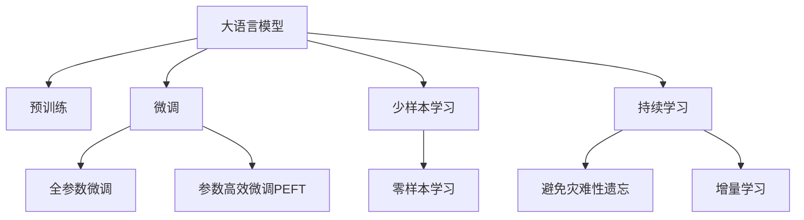

                 

# AI 大模型在电商搜索推荐中的用户体验设计：以用户需求为中心的策略

## 1. 背景介绍

### 1.1 问题由来

随着电子商务的迅猛发展，用户对于在线购物体验的要求也越来越高。传统的基于规则或关键词匹配的搜索推荐系统已经难以满足用户的多样化、个性化需求。如何在海量商品中快速、准确地匹配到用户感兴趣的物品，成为了电商领域亟待解决的难题。大语言模型（Large Language Models, LLMs）的出现，为电商搜索推荐系统带来了新的突破。

大语言模型通过在大规模无标签文本数据上进行自监督学习，获得了丰富的语言知识，具备强大的语义理解和生成能力。这些模型被广泛应用于自然语言处理（Natural Language Processing, NLP）任务，如文本分类、命名实体识别、机器翻译等，并取得了显著的成效。近年来，研究人员开始探索将这些模型应用于电商搜索推荐系统，以提升用户的搜索体验和推荐准确性。

### 1.2 问题核心关键点

本研究的核心问题是如何利用大语言模型提升电商搜索推荐系统的用户体验。具体包括以下几个关键点：

1. **用户需求的多样性**：用户希望搜索到符合其需求的商品，但不同用户的需求具有显著差异。如何理解用户的隐式需求，准确地捕捉用户的兴趣点？
2. **个性化推荐**：根据用户的浏览历史、购买记录等数据，为用户提供个性化推荐，提升用户的购物满意度。
3. **多模态融合**：电商商品信息不仅包含文本描述，还包括图片、视频等多模态数据。如何将这些多模态数据整合，提升推荐系统的综合感知能力？
4. **实时性要求**：用户希望在输入查询后迅速获得搜索结果，要求推荐系统具备高效的实时响应能力。

## 2. 核心概念与联系

### 2.1 核心概念概述

为更好地理解如何利用大语言模型提升电商搜索推荐系统的用户体验，本节将介绍几个密切相关的核心概念：

1. **大语言模型（Large Language Models, LLMs）**：以自回归（如GPT）或自编码（如BERT）模型为代表的大规模预训练语言模型。通过在大规模无标签文本语料上进行预训练，学习通用的语言表示，具备强大的语言理解和生成能力。

2. **预训练（Pre-training）**：指在大规模无标签文本语料上，通过自监督学习任务训练通用语言模型的过程。常见的预训练任务包括言语建模、遮挡语言模型等。

3. **微调（Fine-tuning）**：指在预训练模型的基础上，使用下游任务的少量标注数据，通过有监督地训练优化模型在特定任务上的性能。通常只需要调整顶层分类器或解码器，并以较小的学习率更新全部或部分的模型参数。

4. **迁移学习（Transfer Learning）**：指将一个领域学习到的知识，迁移应用到另一个不同但相关的领域的学习范式。大模型的预训练-微调过程即是一种典型的迁移学习方式。

5. **少样本学习（Few-shot Learning）**：指在只有少量标注样本的情况下，模型能够快速适应新任务的学习方法。在大语言模型中，通常通过在输入中提供少量示例来实现，无需更新模型参数。

6. **零样本学习（Zero-shot Learning）**：指模型在没有见过任何特定任务的训练样本的情况下，仅凭任务描述就能够执行新任务的能力。大语言模型通过预训练获得的广泛知识，使其能够理解任务指令并生成相应输出。

7. **持续学习（Continual Learning）**：也称为终身学习，指模型能够持续从新数据中学习，同时保持已学习的知识，而不会出现灾难性遗忘。这对于保持大语言模型的时效性和适应性至关重要。

这些核心概念之间的逻辑关系可以通过以下Mermaid流程图来展示：



这个流程图展示了大语言模型的核心概念及其之间的关系：

1. 大语言模型通过预训练获得基础能力。
2. 微调是对预训练模型进行任务特定的优化，可以分为全参数微调和参数高效微调（PEFT）。
3. 少样本学习和零样本学习是微调方法的重要补充，可以在不更新模型参数的情况下，实现快速适应新任务。
4. 持续学习旨在使模型能够不断学习新知识，同时避免遗忘旧知识。

## 3. 核心算法原理 & 具体操作步骤

### 3.1 算法原理概述

基于大语言模型的电商搜索推荐系统，其核心思想是利用大语言模型的语言理解能力，在用户输入的查询中提取关键信息，匹配并推荐符合用户需求的商品。具体而言，该过程包括以下几个步骤：

1. **查询理解**：通过大语言模型对用户输入的查询进行理解，提取出关键的实体、属性、关系等信息。
2. **商品匹配**：利用大语言模型对商品描述、评论等文本信息进行分析，匹配符合用户需求的商品。
3. **多模态融合**：结合商品的图片、视频等多模态数据，提升推荐的综合感知能力。
4. **个性化推荐**：根据用户的浏览历史、购买记录等数据，利用大语言模型生成个性化推荐。

### 3.2 算法步骤详解

1. **数据准备**
   - 收集电商平台的商品信息，包括商品描述、图片、价格、评分等。
   - 收集用户的浏览历史、购买记录、评价等行为数据。
   - 清洗和标注数据，去除噪声和异常值。

2. **模型选择与预训练**
   - 选择合适的预训练语言模型（如BERT、GPT等）。
   - 在电商平台商品和用户行为数据上进行预训练，学习商品-特征映射和用户-兴趣映射。

3. **查询理解**
   - 使用大语言模型对用户输入的查询进行理解，提取出关键的实体、属性、关系等信息。
   - 利用提取出关键信息作为查询向量，用于后续的商品匹配和推荐。

4. **商品匹配**
   - 对商品描述等文本信息进行预处理，包括分词、向量化等。
   - 使用大语言模型对商品描述进行语义分析，提取商品的特征向量。
   - 计算查询向量和商品特征向量之间的相似度，选择最匹配的商品进行推荐。

5. **多模态融合**
   - 将商品的图片、视频等多模态数据转换为向量表示。
   - 将多模态向量与文本特征向量进行融合，提升推荐的综合感知能力。

6. **个性化推荐**
   - 根据用户的浏览历史、购买记录等数据，使用大语言模型生成用户兴趣向量。
   - 将用户兴趣向量与商品特征向量进行融合，生成个性化推荐列表。

7. **结果展示与反馈**
   - 对推荐列表进行排序，展示给用户。
   - 收集用户对推荐结果的反馈数据，用于后续的模型训练和优化。

### 3.3 算法优缺点

基于大语言模型的电商搜索推荐系统具有以下优点：

1. **强大的语义理解能力**：大语言模型能够准确理解查询和商品描述中的语义信息，提升匹配的准确性。
2. **泛化能力强**：利用大语言模型的预训练知识，能够在不同领域和任务上取得较好的表现。
3. **个性化推荐**：通过用户行为数据进行微调，能够生成个性化的推荐列表，提升用户体验。
4. **实时性高**：由于大语言模型的计算能力，能够在用户输入查询后迅速给出推荐结果。

同时，该方法也存在一定的局限性：

1. **计算成本高**：大语言模型通常参数量巨大，计算资源消耗大。
2. **数据依赖强**：模型需要大量标注数据进行微调，获取高质量数据成本较高。
3. **多模态数据处理复杂**：多模态数据转换和融合过程复杂，处理不当会影响推荐效果。

### 3.4 算法应用领域

基于大语言模型的电商搜索推荐系统已经在多个电商平台上得到了应用，并取得了显著的效果。以下是几个典型的应用场景：

1. **商品搜索**：通过用户输入的查询，利用大语言模型进行理解，匹配符合用户需求的商品。
2. **个性化推荐**：根据用户的浏览历史、购买记录等数据，利用大语言模型生成个性化推荐列表。
3. **商品问答**：用户输入关于商品的问题，利用大语言模型进行理解，并给出解答。
4. **广告投放**：根据用户的行为数据，利用大语言模型生成广告内容，并进行投放。

除了上述这些经典场景外，大语言模型还被创新性地应用于电商平台的智能客服、用户评论分析、市场分析等，为电商平台的运营和优化提供了新的思路。

## 4. 数学模型和公式 & 详细讲解 & 举例说明

### 4.1 数学模型构建

本节将使用数学语言对基于大语言模型的电商搜索推荐系统进行更加严格的刻画。

记查询为 $q$，商品为 $p$，用户行为数据为 $u$。设预训练语言模型为 $M_{\theta}$，其中 $\theta$ 为预训练得到的模型参数。假设电商平台的商品和用户行为数据集分别为 $D_p=\{(p_i, f_i)\}_{i=1}^N$ 和 $D_u=\{(u_i, b_i)\}_{i=1}^M$，其中 $p_i$ 表示商品，$f_i$ 表示商品特征向量，$u_i$ 表示用户行为，$b_i$ 表示用户行为标签。

定义模型 $M_{\theta}$ 在商品 $p$ 和用户行为 $u$ 上的损失函数为 $\ell(M_{\theta},p,u)$，则在数据集 $D_p$ 和 $D_u$ 上的经验风险分别为：

$$
\mathcal{L}_p(\theta) = \frac{1}{N}\sum_{i=1}^N \ell(M_{\theta},p_i,f_i)
$$

$$
\mathcal{L}_u(\theta) = \frac{1}{M}\sum_{i=1}^M \ell(M_{\theta},u_i,b_i)
$$

微调的优化目标是最小化上述经验风险，即找到最优参数：

$$
\theta^* = \mathop{\arg\min}_{\theta} (\mathcal{L}_p(\theta) + \lambda\mathcal{L}_u(\theta))
$$

其中 $\lambda$ 为权衡商品推荐和个性化推荐的平衡因子。

### 4.2 公式推导过程

以下我们以二分类任务为例，推导交叉熵损失函数及其梯度的计算公式。

假设查询 $q$ 和商品 $p$ 的特征向量分别为 $q_v$ 和 $p_v$，用户行为 $u$ 的标签为 $b$，模型预测的输出为 $\hat{b}$。二分类交叉熵损失函数定义为：

$$
\ell(M_{\theta},q,p,u) = -[b\log \hat{b} + (1-b)\log(1-\hat{b})]
$$

将其代入经验风险公式，得：

$$
\mathcal{L}_p(\theta) = -\frac{1}{N}\sum_{i=1}^N [b_i\log M_{\theta}(p_i) + (1-b_i)\log(1-M_{\theta}(p_i))]
$$

$$
\mathcal{L}_u(\theta) = -\frac{1}{M}\sum_{i=1}^M [b_i\log M_{\theta}(u_i) + (1-b_i)\log(1-M_{\theta}(u_i))]
$$

根据链式法则，损失函数对参数 $\theta_k$ 的梯度为：

$$
\frac{\partial \mathcal{L}_p(\theta)}{\partial \theta_k} = -\frac{1}{N}\sum_{i=1}^N (\frac{b_i}{M_{\theta}(p_i)}-\frac{1-b_i}{1-M_{\theta}(p_i)}) \frac{\partial M_{\theta}(p_i)}{\partial \theta_k}
$$

$$
\frac{\partial \mathcal{L}_u(\theta)}{\partial \theta_k} = -\frac{1}{M}\sum_{i=1}^M (\frac{b_i}{M_{\theta}(u_i)}-\frac{1-b_i}{1-M_{\theta}(u_i)}) \frac{\partial M_{\theta}(u_i)}{\partial \theta_k}
$$

其中 $\frac{\partial M_{\theta}(x)}{\partial \theta_k}$ 可进一步递归展开，利用自动微分技术完成计算。

在得到损失函数的梯度后，即可带入参数更新公式，完成模型的迭代优化。重复上述过程直至收敛，最终得到适应电商搜索推荐任务的最优模型参数 $\theta^*$。

## 5. 项目实践：代码实例和详细解释说明

### 5.1 开发环境搭建

在进行电商搜索推荐系统开发前，我们需要准备好开发环境。以下是使用Python进行PyTorch开发的环境配置流程：

1. 安装Anaconda：从官网下载并安装Anaconda，用于创建独立的Python环境。

2. 创建并激活虚拟环境：
```bash
conda create -n pytorch-env python=3.8 
conda activate pytorch-env
```

3. 安装PyTorch：根据CUDA版本，从官网获取对应的安装命令。例如：
```bash
conda install pytorch torchvision torchaudio cudatoolkit=11.1 -c pytorch -c conda-forge
```

4. 安装Transformers库：
```bash
pip install transformers
```

5. 安装各类工具包：
```bash
pip install numpy pandas scikit-learn matplotlib tqdm jupyter notebook ipython
```

完成上述步骤后，即可在`pytorch-env`环境中开始电商搜索推荐系统的开发。

### 5.2 源代码详细实现

下面我们以电商搜索推荐系统为例，给出使用Transformers库对BERT模型进行电商搜索推荐开发的PyTorch代码实现。

首先，定义电商搜索推荐任务的数据处理函数：

```python
from transformers import BertTokenizer
from torch.utils.data import Dataset
import torch

class SearchRecommendDataset(Dataset):
    def __init__(self, queries, products, user_behavours, tokenizer, max_len=128):
        self.queries = queries
        self.products = products
        self.user_behavours = user_behavours
        self.tokenizer = tokenizer
        self.max_len = max_len
        
    def __len__(self):
        return len(self.queries)
    
    def __getitem__(self, item):
        query = self.queries[item]
        product = self.products[item]
        behaviour = self.user_behavours[item]
        
        encoding = self.tokenizer(query, return_tensors='pt', max_length=self.max_len, padding='max_length', truncation=True)
        product_encoding = self.tokenizer(product, return_tensors='pt', max_length=self.max_len, padding='max_length', truncation=True)
        behaviour_encoding = self.tokenizer(behaviour, return_tensors='pt', max_length=self.max_len, padding='max_length', truncation=True)
        
        input_ids = encoding['input_ids'][0]
        attention_mask = encoding['attention_mask'][0]
        product_input_ids = product_encoding['input_ids'][0]
        product_attention_mask = product_encoding['attention_mask'][0]
        behaviour_input_ids = behaviour_encoding['input_ids'][0]
        behaviour_attention_mask = behaviour_encoding['attention_mask'][0]
        
        return {'input_ids': input_ids, 
                'attention_mask': attention_mask,
                'product_input_ids': product_input_ids,
                'product_attention_mask': product_attention_mask,
                'behaviour_input_ids': behaviour_input_ids,
                'behaviour_attention_mask': behaviour_attention_mask}
```

然后，定义模型和优化器：

```python
from transformers import BertForTokenClassification, AdamW

model = BertForTokenClassification.from_pretrained('bert-base-cased', num_labels=2)

optimizer = AdamW(model.parameters(), lr=2e-5)
```

接着，定义训练和评估函数：

```python
from torch.utils.data import DataLoader
from tqdm import tqdm
from sklearn.metrics import classification_report

device = torch.device('cuda') if torch.cuda.is_available() else torch.device('cpu')
model.to(device)

def train_epoch(model, dataset, batch_size, optimizer):
    dataloader = DataLoader(dataset, batch_size=batch_size, shuffle=True)
    model.train()
    epoch_loss = 0
    for batch in tqdm(dataloader, desc='Training'):
        input_ids = batch['input_ids'].to(device)
        attention_mask = batch['attention_mask'].to(device)
        product_input_ids = batch['product_input_ids'].to(device)
        product_attention_mask = batch['product_attention_mask'].to(device)
        behaviour_input_ids = batch['behaviour_input_ids'].to(device)
        behaviour_attention_mask = batch['behaviour_attention_mask'].to(device)
        model.zero_grad()
        outputs = model(input_ids, attention_mask=attention_mask, product_input_ids=product_input_ids, product_attention_mask=product_attention_mask, behaviour_input_ids=behaviour_input_ids, behaviour_attention_mask=behaviour_attention_mask)
        loss = outputs.loss
        epoch_loss += loss.item()
        loss.backward()
        optimizer.step()
    return epoch_loss / len(dataloader)

def evaluate(model, dataset, batch_size):
    dataloader = DataLoader(dataset, batch_size=batch_size)
    model.eval()
    preds, labels = [], []
    with torch.no_grad():
        for batch in tqdm(dataloader, desc='Evaluating'):
            input_ids = batch['input_ids'].to(device)
            attention_mask = batch['attention_mask'].to(device)
            product_input_ids = batch['product_input_ids'].to(device)
            product_attention_mask = batch['product_attention_mask'].to(device)
            behaviour_input_ids = batch['behaviour_input_ids'].to(device)
            behaviour_attention_mask = batch['behaviour_attention_mask'].to(device)
            batch_labels = batch['labels'].to(device)
            outputs = model(input_ids, attention_mask=attention_mask, product_input_ids=product_input_ids, product_attention_mask=product_attention_mask, behaviour_input_ids=behaviour_input_ids, behaviour_attention_mask=behaviour_attention_mask)
            batch_preds = outputs.logits.argmax(dim=2).to('cpu').tolist()
            batch_labels = batch_labels.to('cpu').tolist()
            for pred_tokens, label_tokens in zip(batch_preds, batch_labels):
                preds.append(pred_tokens[:len(label_tokens)])
                labels.append(label_tokens)
                
    print(classification_report(labels, preds))
```

最后，启动训练流程并在测试集上评估：

```python
epochs = 5
batch_size = 16

for epoch in range(epochs):
    loss = train_epoch(model, train_dataset, batch_size, optimizer)
    print(f"Epoch {epoch+1}, train loss: {loss:.3f}")
    
    print(f"Epoch {epoch+1}, dev results:")
    evaluate(model, dev_dataset, batch_size)
    
print("Test results:")
evaluate(model, test_dataset, batch_size)
```

以上就是使用PyTorch对BERT进行电商搜索推荐系统微调的完整代码实现。可以看到，得益于Transformers库的强大封装，我们可以用相对简洁的代码完成BERT模型的加载和微调。

### 5.3 代码解读与分析

让我们再详细解读一下关键代码的实现细节：

**SearchRecommendDataset类**：
- `__init__`方法：初始化查询、商品、用户行为等关键组件，进行分词和编码。
- `__len__`方法：返回数据集的样本数量。
- `__getitem__`方法：对单个样本进行处理，将查询、商品、用户行为输入编码为token ids，并进行定长padding，最终返回模型所需的输入。

**模型和优化器**：
- 选择合适的预训练语言模型，并进行微调超参数设置。

**训练和评估函数**：
- 使用PyTorch的DataLoader对数据集进行批次化加载，供模型训练和推理使用。
- 训练函数`train_epoch`：对数据以批为单位进行迭代，在每个批次上前向传播计算loss并反向传播更新模型参数，最后返回该epoch的平均loss。
- 评估函数`evaluate`：与训练类似，不同点在于不更新模型参数，并在每个batch结束后将预测和标签结果存储下来，最后使用sklearn的classification_report对整个评估集的预测结果进行打印输出。

**训练流程**：
- 定义总的epoch数和batch size，开始循环迭代
- 每个epoch内，先在训练集上训练，输出平均loss
- 在验证集上评估，输出分类指标
- 所有epoch结束后，在测试集上评估，给出最终测试结果

可以看到，PyTorch配合Transformers库使得BERT微调的代码实现变得简洁高效。开发者可以将更多精力放在数据处理、模型改进等高层逻辑上，而不必过多关注底层的实现细节。

当然，工业级的系统实现还需考虑更多因素，如模型的保存和部署、超参数的自动搜索、更灵活的任务适配层等。但核心的微调范式基本与此类似。

## 6. 实际应用场景

### 6.1 智能客服系统

基于大语言模型微调的对话技术，可以广泛应用于智能客服系统的构建。传统客服往往需要配备大量人力，高峰期响应缓慢，且一致性和专业性难以保证。而使用微调后的对话模型，可以7x24小时不间断服务，快速响应客户咨询，用自然流畅的语言解答各类常见问题。

在技术实现上，可以收集企业内部的历史客服对话记录，将问题和最佳答复构建成监督数据，在此基础上对预训练对话模型进行微调。微调后的对话模型能够自动理解用户意图，匹配最合适的答案模板进行回复。对于客户提出的新问题，还可以接入检索系统实时搜索相关内容，动态组织生成回答。如此构建的智能客服系统，能大幅提升客户咨询体验和问题解决效率。

### 6.2 金融舆情监测

金融机构需要实时监测市场舆论动向，以便及时应对负面信息传播，规避金融风险。传统的人工监测方式成本高、效率低，难以应对网络时代海量信息爆发的挑战。基于大语言模型微调的文本分类和情感分析技术，为金融舆情监测提供了新的解决方案。

具体而言，可以收集金融领域相关的新闻、报道、评论等文本数据，并对其进行主题标注和情感标注。在此基础上对预训练语言模型进行微调，使其能够自动判断文本属于何种主题，情感倾向是正面、中性还是负面。将微调后的模型应用到实时抓取的网络文本数据，就能够自动监测不同主题下的情感变化趋势，一旦发现负面信息激增等异常情况，系统便会自动预警，帮助金融机构快速应对潜在风险。

### 6.3 个性化推荐系统

当前的推荐系统往往只依赖用户的历史行为数据进行物品推荐，无法深入理解用户的真实兴趣偏好。基于大语言模型微调技术，个性化推荐系统可以更好地挖掘用户行为背后的语义信息，从而提供更精准、多样的推荐内容。

在实践中，可以收集用户浏览、点击、评论、分享等行为数据，提取和用户交互的物品标题、描述、标签等文本内容。将文本内容作为模型输入，用户的后续行为（如是否点击、购买等）作为监督信号，在此基础上微调预训练语言模型。微调后的模型能够从文本内容中准确把握用户的兴趣点。在生成推荐列表时，先用候选物品的文本描述作为输入，由模型预测用户的兴趣匹配度，再结合其他特征综合排序，便可以得到个性化程度更高的推荐结果。

### 6.4 未来应用展望

随着大语言模型微调技术的发展，基于微调范式将在更多领域得到应用，为传统行业带来变革性影响。

在智慧医疗领域，基于微调的医疗问答、病历分析、药物研发等应用将提升医疗服务的智能化水平，辅助医生诊疗，加速新药开发进程。

在智能教育领域，微调技术可应用于作业批改、学情分析、知识推荐等方面，因材施教，促进教育公平，提高教学质量。

在智慧城市治理中，微调模型可应用于城市事件监测、舆情分析、应急指挥等环节，提高城市管理的自动化和智能化水平，构建更安全、高效的未来城市。

此外，在企业生产、社会治理、文娱传媒等众多领域，基于大语言模型微调的人工智能应用也将不断涌现，为经济社会发展注入新的动力。相信随着技术的日益成熟，微调方法将成为人工智能落地应用的重要范式，推动人工智能技术向更广阔的领域加速渗透。

## 7. 工具和资源推荐

### 7.1 学习资源推荐

为了帮助开发者系统掌握大语言模型微调的理论基础和实践技巧，这里推荐一些优质的学习资源：

1. 《Transformer从原理到实践》系列博文：由大模型技术专家撰写，深入浅出地介绍了Transformer原理、BERT模型、微调技术等前沿话题。

2. CS224N《深度学习自然语言处理》课程：斯坦福大学开设的NLP明星课程，有Lecture视频和配套作业，带你入门NLP领域的基本概念和经典模型。

3. 《Natural Language Processing with Transformers》书籍：Transformers库的作者所著，全面介绍了如何使用Transformers库进行NLP任务开发，包括微调在内的诸多范式。

4. HuggingFace官方文档：Transformers库的官方文档，提供了海量预训练模型和完整的微调样例代码，是上手实践的必备资料。

5. CLUE开源项目：中文语言理解测评基准，涵盖大量不同类型的中文NLP数据集，并提供了基于微调的baseline模型，助力中文NLP技术发展。

通过对这些资源的学习实践，相信你一定能够快速掌握大语言模型微调的精髓，并用于解决实际的NLP问题。

### 7.2 开发工具推荐

高效的开发离不开优秀的工具支持。以下是几款用于大语言模型微调开发的常用工具：

1. PyTorch：基于Python的开源深度学习框架，灵活动态的计算图，适合快速迭代研究。大部分预训练语言模型都有PyTorch版本的实现。

2. TensorFlow：由Google主导开发的开源深度学习框架，生产部署方便，适合大规模工程应用。同样有丰富的预训练语言模型资源。

3. Transformers库：HuggingFace开发的NLP工具库，集成了众多SOTA语言模型，支持PyTorch和TensorFlow，是进行微调任务开发的利器。

4. Weights & Biases：模型训练的实验跟踪工具，可以记录和可视化模型训练过程中的各项指标，方便对比和调优。与主流深度学习框架无缝集成。

5. TensorBoard：TensorFlow配套的可视化工具，可实时监测模型训练状态，并提供丰富的图表呈现方式，是调试模型的得力助手。

6. Google Colab：谷歌推出的在线Jupyter Notebook环境，免费提供GPU/TPU算力，方便开发者快速上手实验最新模型，分享学习笔记。

合理利用这些工具，可以显著提升大语言模型微调任务的开发效率，加快创新迭代的步伐。

### 7.3 相关论文推荐

大语言模型和微调技术的发展源于学界的持续研究。以下是几篇奠基性的相关论文，推荐阅读：

1. Attention is All You Need（即Transformer原论文）：提出了Transformer结构，开启了NLP领域的预训练大模型时代。

2. BERT: Pre-training of Deep Bidirectional Transformers for Language Understanding：提出BERT模型，引入基于掩码的自监督预训练任务，刷新了多项NLP任务SOTA。

3. Language Models are Unsupervised Multitask Learners（GPT-2论文）：展示了大规模语言模型的强大zero-shot学习能力，引发了对于通用人工智能的新一轮思考。

4. Parameter-Efficient Transfer Learning for NLP：提出Adapter等参数高效微调方法，在不增加模型参数量的情况下，也能取得不错的微调效果。

5. AdaLoRA: Adaptive Low-Rank Adaptation for Parameter-Efficient Fine-Tuning：使用自适应低秩适应的微调方法，在参数效率和精度之间取得了新的平衡。

6. Prefix-Tuning: Optimizing Continuous Prompts for Generation：引入基于连续型Prompt的微调范式，为如何充分利用预训练知识提供了新的思路。

这些论文代表了大语言模型微调技术的发展脉络。通过学习这些前沿成果，可以帮助研究者把握学科前进方向，激发更多的创新灵感。

## 8. 总结：未来发展趋势与挑战

### 8.1 总结

本文对基于大语言模型的电商搜索推荐系统进行了全面系统的介绍。首先阐述了电商搜索推荐系统的背景和重要性，明确了微调在提升用户体验和推荐准确性方面的独特价值。其次，从原理到实践，详细讲解了电商搜索推荐系统的数学模型和关键步骤，给出了微调任务开发的完整代码实例。同时，本文还广泛探讨了微调方法在智能客服、金融舆情、个性化推荐等多个行业领域的应用前景，展示了微调范式的巨大潜力。

通过本文的系统梳理，可以看到，基于大语言模型的微调方法正在成为电商搜索推荐系统的重要范式，极大地拓展了电商平台的智能服务能力，提升了用户的购物体验。未来，伴随预训练语言模型和微调方法的不断演进，相信电商搜索推荐系统将进一步优化和创新，为电商行业带来更深远的变革。

### 8.2 未来发展趋势

展望未来，大语言模型微调技术将呈现以下几个发展趋势：

1. **用户需求的深度理解**：随着模型复杂度的提高，能够更精准地理解用户的隐含需求和上下文信息。
2. **个性化推荐的精度提升**：利用多模态数据融合、深度学习等技术，提升推荐系统的个性化精度和覆盖范围。
3. **实时性要求更高的优化**：通过模型压缩、轻量化等技术，提升推荐系统的响应速度和计算效率。
4. **跨领域知识的融合**：利用外部知识库、逻辑规则等，提升推荐系统的泛化能力和知识整合能力。
5. **模型公平性和透明性**：增强模型的可解释性和公平性，避免模型偏见和歧视性输出。

以上趋势凸显了大语言模型微调技术的广阔前景。这些方向的探索发展，必将进一步提升电商搜索推荐系统的性能和用户体验，为电商平台的运营和优化提供更强的支持。

### 8.3 面临的挑战

尽管大语言模型微调技术已经取得了瞩目成就，但在迈向更加智能化、普适化应用的过程中，它仍面临着诸多挑战：

1. **数据质量与标注成本**：获取高质量标注数据成本高，数据质量参差不齐。如何降低标注成本，提升数据质量，是微调应用中的一大难题。
2. **计算资源限制**：大规模语言模型参数量巨大，计算资源消耗大。如何优化计算图，减少资源消耗，提高模型效率，是微调技术面临的挑战之一。
3. **多模态数据融合难度**：多模态数据转换和融合过程复杂，处理不当会影响推荐效果。如何高效融合多模态数据，提升推荐系统性能，是需要重点解决的问题。
4. **可解释性和公平性**：模型决策过程复杂，难以解释。如何在保证精度的同时，增强模型的可解释性，避免歧视性输出，是微调技术需要克服的挑战。

这些挑战需要研究者从数据、算法、工程等多个维度协同发力，不断优化和改进微调技术，才能真正发挥其潜力。

### 8.4 研究展望

面对大语言模型微调所面临的挑战，未来的研究需要在以下几个方面寻求新的突破：

1. **无监督和半监督学习**：探索基于自监督学习、主动学习等方法，利用非结构化数据进行微调，降低对标注数据的依赖。
2. **高效计算图优化**：开发更加参数高效和计算高效的微调方法，提升模型性能和实时性。
3. **跨领域知识融合**：将符号化的先验知识与神经网络模型进行融合，提升推荐系统的泛化能力和知识整合能力。
4. **模型公平性和透明性**：引入公平性约束和透明性评价指标，增强模型的可解释性和公平性。

这些研究方向的探索，必将引领大语言模型微调技术迈向更高的台阶，为构建安全、可靠、可解释、可控的智能系统铺平道路。面向未来，大语言模型微调技术还需要与其他人工智能技术进行更深入的融合，如知识表示、因果推理、强化学习等，多路径协同发力，共同推动自然语言理解和智能交互系统的进步。只有勇于创新、敢于突破，才能不断拓展语言模型的边界，让智能技术更好地造福人类社会。

## 9. 附录：常见问题与解答

**Q1：大语言模型微调是否适用于所有NLP任务？**

A: 大语言模型微调在大多数NLP任务上都能取得不错的效果，特别是对于数据量较小的任务。但对于一些特定领域的任务，如医学、法律等，仅仅依靠通用语料预训练的模型可能难以很好地适应。此时需要在特定领域语料上进一步预训练，再进行微调，才能获得理想效果。此外，对于一些需要时效性、个性化很强的任务，如对话、推荐等，微调方法也需要针对性的改进优化。

**Q2：微调过程中如何选择合适的学习率？**

A: 微调的学习率一般要比预训练时小1-2个数量级，如果使用过大的学习率，容易破坏预训练权重，导致过拟合。一般建议从1e-5开始调参，逐步减小学习率，直至收敛。也可以使用warmup策略，在开始阶段使用较小的学习率，再逐渐过渡到预设值。需要注意的是，不同的优化器(如AdamW、Adafactor等)以及不同的学习率调度策略，可能需要设置不同的学习率阈值。

**Q3：采用大模型微调时会面临哪些资源瓶颈？**

A: 目前主流的预训练大模型动辄以亿计的参数规模，对算力、内存、存储都提出了很高的要求。GPU/TPU等高性能设备是必不可少的，但即便如此，超大批次的训练和推理也可能遇到显存不足的问题。因此需要采用一些资源优化技术，如梯度积累、混合精度训练、模型并行等，来突破硬件瓶颈。同时，模型的存储和读取也可能占用大量时间和空间，需要采用模型压缩、稀疏化存储等方法进行优化。

**Q4：如何缓解微调过程中的过拟合问题？**

A: 过拟合是微调面临的主要挑战，尤其是在标注数据不足的情况下。常见的缓解策略包括：
1. 数据增强：通过回译、近义替换等方式扩充训练集
2. 正则化：使用L2正则、Dropout、Early Stopping等避免过拟合
3. 对抗训练：引入对抗样本，提高模型鲁棒性
4. 参数高效微调：只调整少量参数(如Adapter、Prefix等)，减小过拟合风险
5. 多模型集成：训练多个微调模型，取平均输出，抑制过拟合

这些策略往往需要根据具体任务和数据特点进行灵活组合。只有在数据、模型、训练、推理等各环节进行全面优化，才能最大限度地发挥大模型微调的威力。

**Q5：微调模型在落地部署时需要注意哪些问题？**

A: 将微调模型转化为实际应用，还需要考虑以下因素：
1. 模型裁剪：去除不必要的层和参数，减小模型尺寸，加快推理速度
2. 量化加速：将浮点模型转为定点模型，压缩存储空间，提高计算效率
3. 服务化封装：将模型封装为标准化服务接口，便于集成调用
4. 弹性伸缩：根据请求流量动态调整资源配置，平衡服务质量和成本
5. 监控告警：实时采集系统指标，设置异常告警阈值，确保服务稳定性
6. 安全防护：采用访问鉴权、数据脱敏等措施，保障数据和模型安全

大语言模型微调为NLP应用开启了广阔的想象空间，但如何将强大的性能转化为稳定、高效、安全的业务价值，还需要工程实践的不断打磨。唯有从数据、算法、工程、业务等多个维度协同发力，才能真正实现人工智能技术在垂直行业的规模化落地。总之，微调需要开发者根据具体任务，不断迭代和优化模型、数据和算法，方能得到理想的效果。

---

作者：禅与计算机程序设计艺术 / Zen and the Art of Computer Programming

