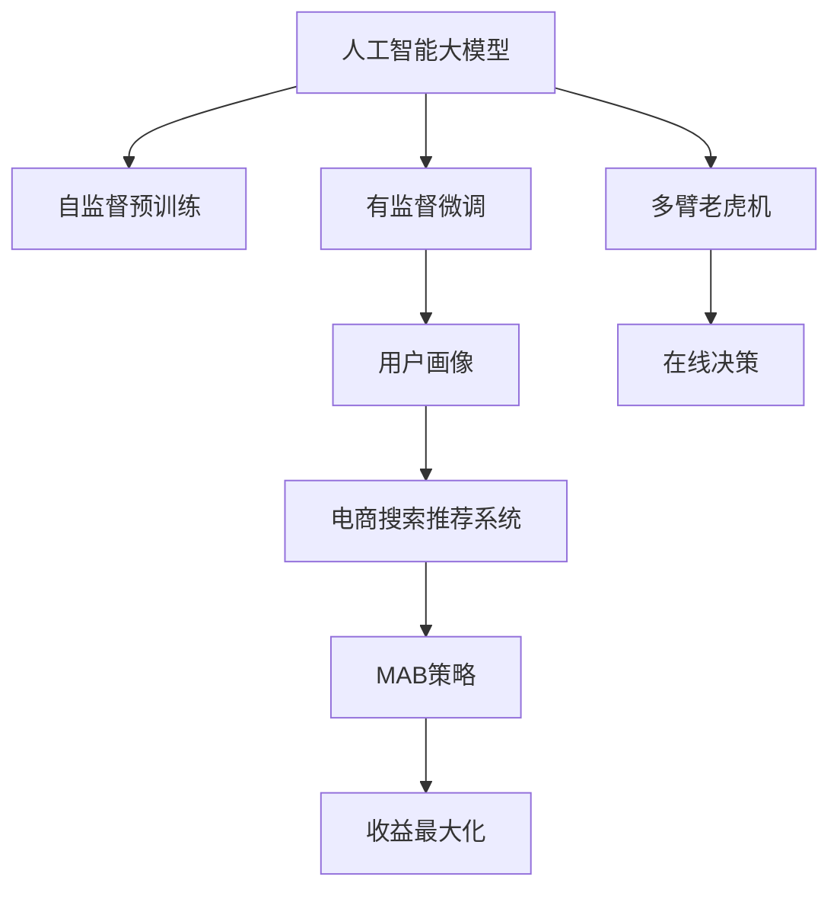

                 

# AI 大模型在电商搜索推荐中的用户画像应用：深度挖掘用户行为偏好

> 关键词：人工智能大模型, 用户画像, 电商平台, 搜索推荐系统, 行为偏好, 深度学习, 自然语言处理(NLP), 用户意图, 点击率, 模型优化, 电商广告, 多臂老虎机(MAB), 数据挖掘, 数据隐私, 用户行为分析

## 1. 背景介绍

### 1.1 问题由来
在电商平台上，搜索和推荐系统是用户获取商品信息、进行购买决策的重要工具。传统搜索推荐方法多依赖手工特征工程，提取用户的点击、浏览、购买等行为数据，通过统计学习或协同过滤等算法为每个用户生成个性化推荐列表。然而，由于手工特征工程的局限性，特征提取与用户真实行为之间的映射关系往往难以充分挖掘。

近年来，人工智能大模型在电商领域的应用逐渐兴起，基于深度学习的大模型可以通过自监督预训练学习到丰富的用户行为语义知识，并通过有监督的微调任务，深入挖掘用户偏好，提升搜索推荐系统的个性化与准确度。

### 1.2 问题核心关键点
人工智能大模型在电商搜索推荐中的核心应用，在于构建精准的"用户画像"。即通过深度学习模型，捕捉用户的行为偏好、购买历史、兴趣变化等关键特征，将用户画像嵌入到推荐系统中，进行个性化推荐。这将大幅提升用户购物体验，增加电商平台的转化率和用户满意度。

核心问题包括：
- 如何构建准确的用户画像模型？
- 用户画像如何有效嵌入到推荐系统中？
- 如何权衡模型性能与计算成本？
- 如何保护用户隐私和数据安全？

## 2. 核心概念与联系

### 2.1 核心概念概述

为更好地理解大模型在电商搜索推荐中的用户画像应用，本节将介绍几个关键概念：

- 人工智能大模型(AI Large Model)：以自回归模型(如GPT)或自编码模型(如BERT)为代表的深度学习模型。通过在大规模无标签文本语料上进行预训练，学习到丰富的语言和知识表示。
- 用户画像(User Profile)：通过收集和分析用户行为数据，构建用户的全方位画像，用于个性化推荐、广告投放等电商场景。
- 电商搜索推荐系统(E-commerce Search and Recommendation System)：利用用户的浏览、点击、购买等行为数据，为用户推荐相关商品，提高转化率，提升用户体验的电商系统。
- 多臂老虎机(Multi-Armed Bandit, MAB)：一种经典的在线决策问题，目标是在有限次试验中，通过平衡探索与利用，优化收益最大化。
- 深度学习(Deep Learning)：一类基于神经网络的机器学习方法，通过大量数据训练，可以高效提取高层次特征，用于各类任务。

这些概念之间的逻辑关系可以通过以下Mermaid流程图来展示：



这个流程图展示了大模型在电商搜索推荐中的核心概念及其之间的关系：

1. 大模型通过自监督预训练获得通用知识表示。
2. 通过有监督微调深入学习用户行为语义，构建用户画像。
3. 将用户画像嵌入到电商搜索推荐系统中，进行个性化推荐。
4. 引入多臂老虎机模型优化推荐策略，提升推荐效果。
5. 利用多臂老虎机进行在线决策，最大化收益。

## 3. 核心算法原理 & 具体操作步骤
### 3.1 算法原理概述

基于大模型的电商搜索推荐系统，其核心在于构建用户画像，并通过有监督的微调任务深入学习用户行为语义，然后将用户画像嵌入到推荐系统中，进行个性化推荐。

算法流程如下：

1. **数据收集**：收集用户的点击、浏览、购买等行为数据。
2. **数据预处理**：对原始数据进行清洗、归一化等处理。
3. **自监督预训练**：在大规模无标签文本语料上，对大模型进行自监督预训练，学习通用语言和知识表示。
4. **有监督微调**：在有标注的用户行为数据上，对大模型进行有监督微调，深入学习用户行为语义。
5. **用户画像建模**：将微调后的模型作为用户画像模型，通过嵌入到推荐系统中，进行个性化推荐。
6. **在线决策优化**：引入多臂老虎机模型，优化推荐策略，提升推荐效果。

### 3.2 算法步骤详解

以下是基于大模型的电商搜索推荐系统的主要操作步骤：

**Step 1: 数据收集与预处理**
- 收集用户行为数据，包括点击、浏览、购买记录等。
- 对原始数据进行清洗，去除异常值和重复记录。
- 将数据归一化，处理缺失值，构建特征向量。

**Step 2: 自监督预训练**
- 选择大模型架构，如BERT、GPT等。
- 在大规模无标签文本语料上进行自监督预训练，学习通用语言和知识表示。
- 选择预训练任务的特征提取方式，如掩码语言模型、Next Sentence Prediction等。
- 在预训练后，获取模型权重。

**Step 3: 有监督微调**
- 在标注好的用户行为数据集上进行有监督微调，学习用户行为语义。
- 选择微调任务的损失函数，如交叉熵、均方误差等。
- 设置合适的学习率、批大小等超参数。
- 使用梯度下降等优化算法，最小化损失函数，更新模型权重。
- 在验证集上评估微调效果，确保模型性能。

**Step 4: 用户画像建模**
- 将微调后的模型作为用户画像模型，用于提取用户行为语义特征。
- 定义用户画像的特征表示，如兴趣向量、行为序列等。
- 将用户画像嵌入到推荐系统中，进行个性化推荐。

**Step 5: 在线决策优化**
- 引入多臂老虎机模型，优化推荐策略。
- 设计多臂老虎机模型，选择合适的探索与利用策略。
- 在实际推荐系统中，实时调整推荐策略，最大化收益。

### 3.3 算法优缺点

基于大模型的电商搜索推荐系统具有以下优点：

- 深度挖掘用户行为语义：通过大模型学习用户行为深层次语义，提升推荐效果。
- 通用性高：大模型适用于多种电商领域，如服饰、家居、电子产品等。
- 模型鲁棒性强：大模型通过自监督预训练，具备较强的泛化能力，对抗数据分布变化。
- 高个性化：通过用户画像，实现高度定制化的推荐策略。

同时，该方法也存在以下局限性：

- 计算资源需求高：大模型需要高计算资源进行预训练和微调，成本较高。
- 数据隐私问题：用户行为数据涉及隐私保护，数据收集和处理需符合法律法规。
- 模型复杂度高：大模型结构复杂，训练和推理速度较慢。
- 对标注数据依赖高：微调效果依赖标注数据质量，数据标注成本较高。

尽管存在这些局限性，但就目前而言，基于大模型的推荐系统仍是目前电商搜索推荐的主流范式，具有显著优势和应用前景。

### 3.4 算法应用领域

大模型在电商搜索推荐中的应用场景非常广泛，以下是几个典型的应用案例：

- **个性化推荐**：根据用户浏览历史、点击行为、购买记录等，为用户推荐个性化商品。
- **广告投放优化**：利用用户画像，精准投放广告，提高广告点击率和转化率。
- **价格优化**：预测不同价格策略下的点击率，优化商品定价。
- **库存管理**：预测商品销售趋势，优化库存水平，减少缺货或积压。
- **客户细分**：基于用户画像，进行客户细分，制定针对性营销策略。
- **智能客服**：利用用户画像，构建智能客服系统，提升客户服务质量。

除了上述这些经典应用外，大模型在电商搜索推荐领域还有更多创新场景，如反欺诈检测、异常行为识别、用户流失预警等。

## 4. 数学模型和公式 & 详细讲解 & 举例说明

### 4.1 数学模型构建

本节将使用数学语言对基于大模型的电商搜索推荐系统进行更加严格的刻画。

记用户行为数据集为 $D=\{(x_i, y_i)\}_{i=1}^N$，其中 $x_i$ 为行为向量，$y_i$ 为标签，如是否点击、购买等。假设用户画像模型为 $f_{\theta}$，其中 $\theta$ 为模型参数。

定义模型 $f_{\theta}$ 在数据样本 $(x,y)$ 上的损失函数为 $\ell(f_{\theta}(x),y)$，则在数据集 $D$ 上的经验风险为：

$$
\mathcal{L}(\theta) = \frac{1}{N} \sum_{i=1}^N \ell(f_{\theta}(x_i),y_i)
$$

微调的优化目标是最小化经验风险，即找到最优参数：

$$
\theta^* = \mathop{\arg\min}_{\theta} \mathcal{L}(\theta)
$$

在实践中，我们通常使用基于梯度的优化算法（如SGD、Adam等）来近似求解上述最优化问题。设 $\eta$ 为学习率，则参数的更新公式为：

$$
\theta \leftarrow \theta - \eta \nabla_{\theta}\mathcal{L}(\theta)
$$

其中 $\nabla_{\theta}\mathcal{L}(\theta)$ 为损失函数对参数 $\theta$ 的梯度，可通过反向传播算法高效计算。

### 4.2 公式推导过程

以下我们以点击率预测任务为例，推导交叉熵损失函数及其梯度的计算公式。

假设用户行为向量为 $x=[x_1,x_2,\cdots,x_d]$，表示用户历史上点击、浏览、购买等行为的向量表示。模型预测用户点击概率为 $p=f_{\theta}(x)$，其中 $\theta$ 为模型参数。真实标签 $y \in \{0,1\}$，表示用户是否点击了推荐商品。则二分类交叉熵损失函数定义为：

$$
\ell(f_{\theta}(x),y) = -[y\log p + (1-y)\log(1-p)]
$$

将其代入经验风险公式，得：

$$
\mathcal{L}(\theta) = -\frac{1}{N}\sum_{i=1}^N [y_i\log f_{\theta}(x_i)+(1-y_i)\log(1-f_{\theta}(x_i))]
$$

根据链式法则，损失函数对参数 $\theta_k$ 的梯度为：

$$
\frac{\partial \mathcal{L}(\theta)}{\partial \theta_k} = -\frac{1}{N}\sum_{i=1}^N \frac{\partial \log f_{\theta}(x_i)}{\partial \theta_k} - \frac{\partial \log(1-f_{\theta}(x_i))}{\partial \theta_k}
$$

其中 $\frac{\partial \log f_{\theta}(x_i)}{\partial \theta_k}$ 可进一步递归展开，利用自动微分技术完成计算。

在得到损失函数的梯度后，即可带入参数更新公式，完成模型的迭代优化。重复上述过程直至收敛，最终得到适应点击率预测任务的最优模型参数 $\theta^*$。

## 5. 项目实践：代码实例和详细解释说明
### 5.1 开发环境搭建

在进行推荐系统开发前，我们需要准备好开发环境。以下是使用Python进行PyTorch开发的环境配置流程：

1. 安装Anaconda：从官网下载并安装Anaconda，用于创建独立的Python环境。

2. 创建并激活虚拟环境：
```bash
conda create -n pytorch-env python=3.8 
conda activate pytorch-env
```

3. 安装PyTorch：根据CUDA版本，从官网获取对应的安装命令。例如：
```bash
conda install pytorch torchvision torchaudio cudatoolkit=11.1 -c pytorch -c conda-forge
```

4. 安装HuggingFace Transformers库：
```bash
pip install transformers
```

5. 安装各类工具包：
```bash
pip install numpy pandas scikit-learn matplotlib tqdm jupyter notebook ipython
```

完成上述步骤后，即可在`pytorch-env`环境中开始推荐系统开发。

### 5.2 源代码详细实现

下面我们以点击率预测任务为例，给出使用PyTorch和Transformers库对BERT模型进行微调的代码实现。

首先，定义点击率预测的数据处理函数：

```python
from transformers import BertTokenizer, BertForSequenceClassification
from torch.utils.data import Dataset
import torch

class ClickRatesDataset(Dataset):
    def __init__(self, texts, labels, tokenizer, max_len=128):
        self.texts = texts
        self.labels = labels
        self.tokenizer = tokenizer
        self.max_len = max_len
        
    def __len__(self):
        return len(self.texts)
    
    def __getitem__(self, item):
        text = self.texts[item]
        label = self.labels[item]
        
        encoding = self.tokenizer(text, return_tensors='pt', max_length=self.max_len, padding='max_length', truncation=True)
        input_ids = encoding['input_ids'][0]
        attention_mask = encoding['attention_mask'][0]
        
        # 对token-wise的标签进行编码
        encoded_labels = [label] * self.max_len
        labels = torch.tensor(encoded_labels, dtype=torch.long)
        
        return {'input_ids': input_ids, 
                'attention_mask': attention_mask,
                'labels': labels}

# 标签映射
label2id = {0: 'not_click', 1: 'click'}
id2label = {v: k for k, v in label2id.items()}

# 创建dataset
tokenizer = BertTokenizer.from_pretrained('bert-base-cased')

train_dataset = ClickRatesDataset(train_texts, train_labels, tokenizer)
dev_dataset = ClickRatesDataset(dev_texts, dev_labels, tokenizer)
test_dataset = ClickRatesDataset(test_texts, test_labels, tokenizer)
```

然后，定义模型和优化器：

```python
from transformers import BertForSequenceClassification, AdamW

model = BertForSequenceClassification.from_pretrained('bert-base-cased', num_labels=len(label2id))

optimizer = AdamW(model.parameters(), lr=2e-5)
```

接着，定义训练和评估函数：

```python
from torch.utils.data import DataLoader
from tqdm import tqdm
from sklearn.metrics import classification_report

device = torch.device('cuda') if torch.cuda.is_available() else torch.device('cpu')
model.to(device)

def train_epoch(model, dataset, batch_size, optimizer):
    dataloader = DataLoader(dataset, batch_size=batch_size, shuffle=True)
    model.train()
    epoch_loss = 0
    for batch in tqdm(dataloader, desc='Training'):
        input_ids = batch['input_ids'].to(device)
        attention_mask = batch['attention_mask'].to(device)
        labels = batch['labels'].to(device)
        model.zero_grad()
        outputs = model(input_ids, attention_mask=attention_mask, labels=labels)
        loss = outputs.loss
        epoch_loss += loss.item()
        loss.backward()
        optimizer.step()
    return epoch_loss / len(dataloader)

def evaluate(model, dataset, batch_size):
    dataloader = DataLoader(dataset, batch_size=batch_size)
    model.eval()
    preds, labels = [], []
    with torch.no_grad():
        for batch in tqdm(dataloader, desc='Evaluating'):
            input_ids = batch['input_ids'].to(device)
            attention_mask = batch['attention_mask'].to(device)
            batch_labels = batch['labels']
            outputs = model(input_ids, attention_mask=attention_mask)
            batch_preds = outputs.logits.argmax(dim=2).to('cpu').tolist()
            batch_labels = batch_labels.to('cpu').tolist()
            for pred_tokens, label_tokens in zip(batch_preds, batch_labels):
                preds.append(pred_tokens[:len(label_tokens)])
                labels.append(label_tokens)
                
    print(classification_report(labels, preds))
```

最后，启动训练流程并在测试集上评估：

```python
epochs = 5
batch_size = 16

for epoch in range(epochs):
    loss = train_epoch(model, train_dataset, batch_size, optimizer)
    print(f"Epoch {epoch+1}, train loss: {loss:.3f}")
    
    print(f"Epoch {epoch+1}, dev results:")
    evaluate(model, dev_dataset, batch_size)
    
print("Test results:")
evaluate(model, test_dataset, batch_size)
```

以上就是使用PyTorch和Transformers库对BERT模型进行点击率预测任务微调的完整代码实现。可以看到，得益于Transformers库的强大封装，我们可以用相对简洁的代码完成BERT模型的加载和微调。

### 5.3 代码解读与分析

让我们再详细解读一下关键代码的实现细节：

**ClickRatesDataset类**：
- `__init__`方法：初始化文本、标签、分词器等关键组件。
- `__len__`方法：返回数据集的样本数量。
- `__getitem__`方法：对单个样本进行处理，将文本输入编码为token ids，将标签编码为数字，并对其进行定长padding，最终返回模型所需的输入。

**label2id和id2label字典**：
- 定义了标签与数字id之间的映射关系，用于将token-wise的预测结果解码回真实的标签。

**训练和评估函数**：
- 使用PyTorch的DataLoader对数据集进行批次化加载，供模型训练和推理使用。
- 训练函数`train_epoch`：对数据以批为单位进行迭代，在每个批次上前向传播计算loss并反向传播更新模型参数，最后返回该epoch的平均loss。
- 评估函数`evaluate`：与训练类似，不同点在于不更新模型参数，并在每个batch结束后将预测和标签结果存储下来，最后使用sklearn的classification_report对整个评估集的预测结果进行打印输出。

**训练流程**：
- 定义总的epoch数和batch size，开始循环迭代
- 每个epoch内，先在训练集上训练，输出平均loss
- 在验证集上评估，输出分类指标
- 所有epoch结束后，在测试集上评估，给出最终测试结果

可以看到，PyTorch配合Transformers库使得BERT微调的代码实现变得简洁高效。开发者可以将更多精力放在数据处理、模型改进等高层逻辑上，而不必过多关注底层的实现细节。

当然，工业级的系统实现还需考虑更多因素，如模型的保存和部署、超参数的自动搜索、更灵活的任务适配层等。但核心的微调范式基本与此类似。

## 6. 实际应用场景
### 6.1 智能推荐系统

基于大模型的电商搜索推荐系统，已经在各大电商平台上得到了广泛应用，显著提升了用户的购物体验。以下是几个典型的应用场景：

- **个性化推荐**：根据用户浏览历史、点击行为、购买记录等，为用户推荐个性化商品。例如，京东推荐系统通过点击率预测模型，为用户推荐相关商品，提升转化率。
- **广告投放优化**：利用用户画像，精准投放广告，提高广告点击率和转化率。例如，阿里巴巴通过点击率预测模型，优化广告投放策略，降低广告投放成本。
- **价格优化**：预测不同价格策略下的点击率，优化商品定价。例如，亚马逊通过点击率预测模型，动态调整商品价格，最大化销售额。
- **库存管理**：预测商品销售趋势，优化库存水平，减少缺货或积压。例如，苏宁易购通过点击率预测模型，优化库存管理策略，提高供应链效率。
- **客户细分**：基于用户画像，进行客户细分，制定针对性营销策略。例如，京东通过用户画像模型，细分客户群体，推送个性化广告。
- **智能客服**：利用用户画像，构建智能客服系统，提升客户服务质量。例如，美团通过用户画像模型，提供个性化客服服务，提高用户满意度。

除了上述这些经典应用外，大模型在电商搜索推荐领域还有更多创新场景，如反欺诈检测、异常行为识别、用户流失预警等。

### 6.2 未来应用展望

随着大模型和微调方法的不断发展，基于大模型的推荐系统将呈现以下几个发展趋势：

1. **模型规模持续增大**：随着算力成本的下降和数据规模的扩张，预训练语言模型的参数量还将持续增长。超大规模语言模型蕴含的丰富语言知识，有望支撑更加复杂多变的推荐任务。
2. **推荐算法多样化**：未来将涌现更多推荐算法，如协同过滤、矩阵分解、深度学习等，相互结合，提升推荐效果。
3. **多模态融合**：未来的推荐系统将更多融合图像、音频、视频等多模态信息，提升对用户行为的综合理解。
4. **个性化增强**：通过深度挖掘用户行为语义，构建更精细的用户画像，提升个性化推荐效果。
5. **实时化**：利用多臂老虎机模型，实时调整推荐策略，提升推荐系统的动态响应能力。
6. **智能化**：结合自然语言处理技术，提升推荐系统的交互能力，支持用户自然语言查询。
7. **数据隐私保护**：在数据收集、处理、存储等环节，严格遵守数据隐私保护法规，保护用户隐私。
8. **解释性增强**：开发更加透明、可解释的推荐模型，提升用户信任度。

## 7. 工具和资源推荐
### 7.1 学习资源推荐

为了帮助开发者系统掌握大模型在电商推荐系统中的应用，这里推荐一些优质的学习资源：

1. 《深度学习在推荐系统中的应用》：详细介绍了深度学习在推荐系统中的应用场景和方法，适合入门学习。
2. 《推荐系统实战》：介绍了推荐系统的基本原理、算法和实战案例，适合应用开发。
3. 《深度学习与推荐系统》：介绍了深度学习在推荐系统中的应用方法和最新进展，适合进阶学习。
4. 《自然语言处理与深度学习》：介绍了NLP和深度学习技术在推荐系统中的应用，适合对NLP和深度学习感兴趣的学习者。
5. 《TensorFlow推荐系统实战》：介绍了TensorFlow在推荐系统中的应用，适合TensorFlow开发人员。

通过对这些资源的学习实践，相信你一定能够快速掌握大模型在电商推荐系统中的应用方法，并用于解决实际的推荐问题。
### 7.2 开发工具推荐

高效的开发离不开优秀的工具支持。以下是几款用于电商推荐系统开发的常用工具：

1. PyTorch：基于Python的开源深度学习框架，灵活动态的计算图，适合快速迭代研究。大部分预训练语言模型都有PyTorch版本的实现。
2. TensorFlow：由Google主导开发的开源深度学习框架，生产部署方便，适合大规模工程应用。同样有丰富的预训练语言模型资源。
3. Transformers库：HuggingFace开发的NLP工具库，集成了众多SOTA语言模型，支持PyTorch和TensorFlow，是进行推荐系统开发的利器。
4. Weights & Biases：模型训练的实验跟踪工具，可以记录和可视化模型训练过程中的各项指标，方便对比和调优。与主流深度学习框架无缝集成。
5. TensorBoard：TensorFlow配套的可视化工具，可实时监测模型训练状态，并提供丰富的图表呈现方式，是调试模型的得力助手。
6. Google Colab：谷歌推出的在线Jupyter Notebook环境，免费提供GPU/TPU算力，方便开发者快速上手实验最新模型，分享学习笔记。

合理利用这些工具，可以显著提升电商推荐系统的开发效率，加快创新迭代的步伐。

### 7.3 相关论文推荐

大模型在电商推荐领域的发展得益于学界的持续研究。以下是几篇奠基性的相关论文，推荐阅读：

1. Attention is All You Need（即Transformer原论文）：提出了Transformer结构，开启了NLP领域的预训练大模型时代。
2. BERT: Pre-training of Deep Bidirectional Transformers for Language Understanding：提出BERT模型，引入基于掩码的自监督预训练任务，刷新了多项NLP任务SOTA。
3. Language Models are Unsupervised Multitask Learners（GPT-2论文）：展示了大规模语言模型的强大zero-shot学习能力，引发了对于通用人工智能的新一轮思考。
4. Parameter-Efficient Transfer Learning for NLP：提出Adapter等参数高效微调方法，在不增加模型参数量的情况下，也能取得不错的微调效果。
5. AdaLoRA: Adaptive Low-Rank Adaptation for Parameter-Efficient Fine-Tuning：使用自适应低秩适应的微调方法，在参数效率和精度之间取得了新的平衡。
6. AdaFit: Scalable and Scalable Feature Selection for Deep Learning：介绍了一种可扩展的特征选择方法，适合在大规模数据上训练高效推荐模型。

这些论文代表了大模型在电商推荐领域的研究进展。通过学习这些前沿成果，可以帮助研究者把握学科前进方向，激发更多的创新灵感。

## 8. 总结：未来发展趋势与挑战
### 8.1 总结

本文对基于大模型的电商搜索推荐系统进行了全面系统的介绍。首先阐述了电商搜索推荐系统的重要性，以及大模型在其中的核心应用——构建用户画像。接着从原理到实践，详细讲解了深度学习模型的构建、微调过程、推荐算法等关键步骤，给出了具体的代码实现。同时，本文还广泛探讨了电商搜索推荐系统的实际应用场景，展示了其广泛的应用前景。此外，本文精选了推荐系统的各类学习资源，力求为读者提供全方位的技术指引。

通过本文的系统梳理，可以看到，基于大模型的推荐系统已经在大电商平台上得到广泛应用，显著提升了用户的购物体验。随着深度学习、自然语言处理等技术的不断进步，未来的推荐系统将更加智能、高效、个性化，为电商行业带来更大的创新价值。

### 8.2 未来发展趋势

展望未来，基于大模型的推荐系统将呈现以下几个发展趋势：

1. **模型规模持续增大**：随着算力成本的下降和数据规模的扩张，预训练语言模型的参数量还将持续增长。超大规模语言模型蕴含的丰富语言知识，有望支撑更加复杂多变的推荐任务。
2. **推荐算法多样化**：未来将涌现更多推荐算法，如协同过滤、矩阵分解、深度学习等，相互结合，提升推荐效果。
3. **多模态融合**：未来的推荐系统将更多融合图像、音频、视频等多模态信息，提升对用户行为的综合理解。
4. **个性化增强**：通过深度挖掘用户行为语义，构建更精细的用户画像，提升个性化推荐效果。
5. **实时化**：利用多臂老虎机模型，实时调整推荐策略，提升推荐系统的动态响应能力。
6. **智能化**：结合自然语言处理技术，提升推荐系统的交互能力，支持用户自然语言查询。
7. **数据隐私保护**：在数据收集、处理、存储等环节，严格遵守数据隐私保护法规，保护用户隐私。
8. **解释性增强**：开发更加透明、可解释的推荐模型，提升用户信任度。

以上趋势凸显了基于大模型的推荐系统的广阔前景。这些方向的探索发展，必将进一步提升电商推荐系统的性能和应用范围，为电商行业带来更多的创新价值。

### 8.3 面临的挑战

尽管基于大模型的推荐系统已经取得了瞩目成就，但在迈向更加智能化、普适化应用的过程中，它仍面临着诸多挑战：

1. **计算资源需求高**：大模型需要高计算资源进行预训练和微调，成本较高。
2. **数据隐私问题**：用户行为数据涉及隐私保护，数据收集和处理需符合法律法规。
3. **模型复杂度高**：大模型结构复杂，训练和推理速度较慢。
4. **对标注数据依赖高**：微调效果依赖标注数据质量，数据标注成本较高。
5. **公平性问题**：大规模预训练模型的偏见可能导致推荐结果的不公平，需要注意公平性问题。
6. **安全性问题**：预训练模型的有害信息可能传递到推荐系统，需要注意安全性问题。
7. **数据迁移问题**：预训练模型在不同领域上的迁移效果有限，需要针对特定领域进行微调。

尽管存在这些挑战，但就目前而言，基于大模型的推荐系统仍是目前电商搜索推荐的主流范式，具有显著优势和应用前景。

### 8.4 研究展望

面对基于大模型的推荐系统所面临的挑战，未来的研究需要在以下几个方面寻求新的突破：

1. **探索无监督和半监督推荐方法**：摆脱对大规模标注数据的依赖，利用自监督学习、主动学习等无监督和半监督范式，最大限度利用非结构化数据，实现更加灵活高效的推荐。
2. **研究参数高效和计算高效的推荐范式**：开发更加参数高效的推荐方法，在固定大部分预训练参数的情况下，只更新极少量的任务相关参数。同时优化推荐模型的计算图，减少前向传播和反向传播的资源消耗，实现更加轻量级、实时性的部署。
3. **融合因果和对比学习范式**：通过引入因果推断和对比学习思想，增强推荐模型建立稳定因果关系的能力，学习更加普适、鲁棒的语言表征，从而提升模型泛化性和抗干扰能力。
4. **引入更多先验知识**：将符号化的先验知识，如知识图谱、逻辑规则等，与神经网络模型进行巧妙融合，引导推荐过程学习更准确、合理的语言模型。同时加强不同模态数据的整合，实现视觉、语音等多模态信息与文本信息的协同建模。
5. **结合因果分析和博弈论工具**：将因果分析方法引入推荐模型，识别出模型决策的关键特征，增强推荐结果的因果性和逻辑性。借助博弈论工具刻画人机交互过程，主动探索并规避推荐模型的脆弱点，提高系统稳定性。
6. **纳入伦理道德约束**：在模型训练目标中引入伦理导向的评估指标，过滤和惩罚有害的推荐结果，确保推荐内容符合用户价值观和伦理道德。

这些研究方向的探索，必将引领大模型在电商推荐系统中的应用向更高的台阶迈进，为构建智能、高效、公平、安全的推荐系统铺平道路。

## 9. 附录：常见问题与解答

**Q1：如何构建准确的电商推荐系统？**

A: 构建准确的电商推荐系统需要从以下几个方面进行：
1. 数据收集：收集用户行为数据，包括点击、浏览、购买记录等。
2. 数据预处理：对原始数据进行清洗、归一化等处理。
3. 自监督预训练：在大规模无标签文本语料上进行自监督预训练，学习通用语言和知识表示。
4. 有监督微调：在有标注的用户行为数据上，对大模型进行有监督微调，深入学习用户行为语义。
5. 用户画像建模：将微调后的模型作为用户画像模型，用于提取用户行为语义特征。
6. 推荐算法优化：引入多臂老虎机模型，优化推荐策略，提升推荐效果。

**Q2：如何保护用户隐私和数据安全？**

A: 保护用户隐私和数据安全是电商推荐系统设计中必须要考虑的问题。具体措施包括：
1. 数据匿名化：对用户行为数据进行去标识化处理，保护用户隐私。
2. 数据加密：在数据传输和存储过程中，采用加密技术保护数据安全。
3. 访问控制：设置严格的访问控制机制，限制对用户数据的访问权限。
4. 数据审计：定期对数据处理过程进行审计，确保数据安全。
5. 用户授权：在数据处理过程中，获取用户授权，保护用户权益。

**Q3：如何处理数据不平衡问题？**

A: 数据不平衡问题在电商推荐系统中普遍存在，具体措施包括：
1. 数据增强：通过数据扩充、噪声注入等方式增加少数类样本数量。
2. 类别权重调整：在损失函数中加入类别权重，提升少数类样本的训练效果。
3. 欠采样与过采样：对多数类样本进行欠采样，对少数类样本进行过采样，平衡数据分布。
4. 集成学习：结合多种推荐模型，通过集成学习提升整体性能。

**Q4：如何提高推荐系统的实时性？**

A: 提高推荐系统的实时性需要从以下几个方面进行：
1. 模型压缩：对大模型进行压缩，减小模型尺寸，提高推理速度。
2. 模型剪枝：剪枝掉模型中无关紧要的参数，减少计算量。
3. 并行计算：利用分布式计算、GPU加速等方式提高计算效率。
4. 缓存机制：利用缓存机制减少重复计算，提升系统响应速度。

**Q5：如何处理推荐系统的冷启动问题？**

A: 推荐系统的冷启动问题指的是新用户或新商品难以得到有效推荐的情况。具体措施包括：
1. 用户兴趣建模：通过用户行为数据或明示信息，构建用户兴趣模型，帮助新用户快速推荐。
2. 商品特征建模：利用商品描述、标签等数据，构建商品特征模型，提升新商品推荐效果。
3. 推荐规则设计：设计合理的推荐规则，提高新用户和新商品的推荐效果。

**Q6：如何评估推荐系统的性能？**

A: 推荐系统的性能评估需要从以下几个方面进行：
1. 点击率预测：利用交叉熵损失等方法，评估推荐系统对点击行为的预测效果。
2. 推荐准确率：通过准确率、召回率等指标，评估推荐系统的准确性和完备性。
3. NDCG和MRR：利用NDCG和MRR指标，评估推荐系统的排名效果。
4. A/B测试：通过A/B测试，比较不同推荐策略的效果，优化推荐系统。

**Q7：如何优化电商推荐系统的广告投放效果？**

A: 优化电商推荐系统的广告投放效果需要从以下几个方面进行：
1. 广告定向：通过用户画像和推荐系统，精准定向广告投放，提升广告点击率和转化率。
2. 广告创意优化：利用A/B测试等方法，优化广告创意，提高广告效果。
3. 广告投放策略：结合多臂老虎机等优化策略，实时调整广告投放策略，提升广告效果。

通过本文的系统梳理，可以看到，基于大模型的推荐系统已经在各大电商平台上得到广泛应用，显著提升了用户的购物体验。随着深度学习、自然语言处理等技术的不断进步，未来的推荐系统将更加智能、高效、个性化，为电商行业带来更多的创新价值。相信随着学界和产业界的共同努力，这些挑战终将一一被克服，大模型在电商推荐系统中的应用必将在全球范围内大放异彩。

