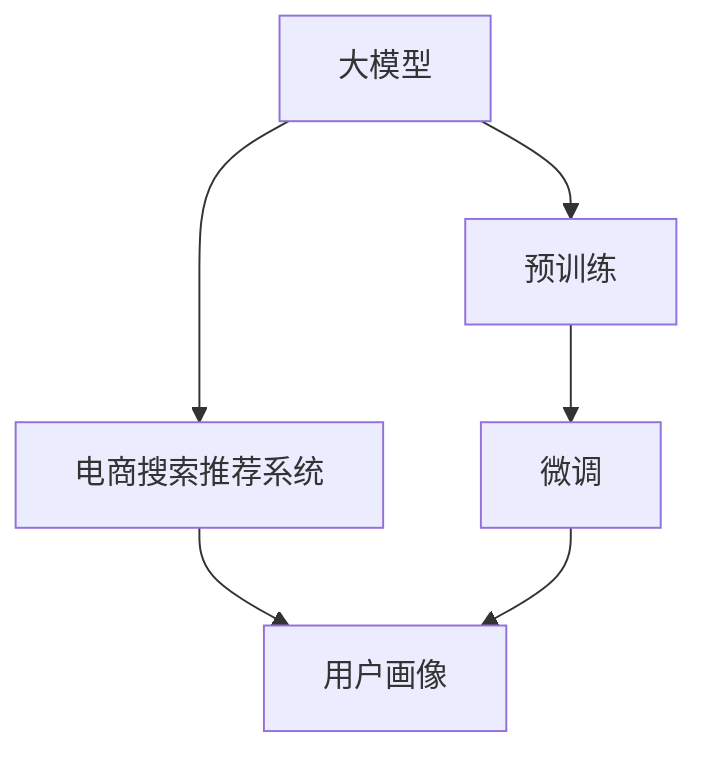

                 

# AI 大模型在电商搜索推荐中的用户画像技术：精准把握用户需求与行为偏好

> 关键词：大模型,用户画像,电商搜索,推荐系统,深度学习,自然语言处理,NLP

## 1. 背景介绍

### 1.1 问题由来
电商搜索推荐系统是电商平台的基石，直接影响着用户的使用体验和购买决策。一个优秀的电商搜索推荐系统能够显著提升平台的用户粘性和转化率。然而，传统搜索推荐系统依赖于简单的基于规则或统计模型，难以捕捉复杂的用户需求和行为模式。近年来，AI大模型在电商领域的应用为搜索推荐系统带来了新的突破。

大模型通过在大规模无标签数据上进行预训练，学习到丰富的语义表示和语义理解能力。在电商搜索推荐任务中，大模型可以精准捕捉用户输入的自然语言描述，生成精准的用户画像，从而提升搜索推荐系统的准确性和个性化。本文将详细介绍大模型在电商搜索推荐系统中的应用，特别是如何利用大模型进行用户画像构建，帮助电商平台精准把握用户需求与行为偏好。

### 1.2 问题核心关键点
大模型在电商搜索推荐系统中的应用，关键在于如何将用户输入的自然语言描述转化为精准的用户画像，从而提升搜索推荐的效果。其核心步骤如下：
1. 收集电商平台的搜索和推荐数据，构建训练集。
2. 使用预训练大模型，如BERT、GPT等，对数据进行预处理。
3. 设计损失函数和优化算法，对模型进行微调，生成用户画像。
4. 将用户画像应用于搜索推荐模型，优化搜索推荐效果。

本文将系统介绍大模型在电商搜索推荐中的应用，特别关注如何构建用户画像以及具体的微调过程。

## 2. 核心概念与联系

### 2.1 核心概念概述

为了深入理解大模型在电商搜索推荐系统中的应用，我们先介绍几个核心概念：

- 大模型(Large Model)：通常指参数数量在亿级别的预训练语言模型，如BERT、GPT等。通过在大规模无标签数据上进行预训练，学习到丰富的语义表示和语义理解能力。

- 用户画像(User Profile)：指对用户需求、行为、兴趣等信息进行系统化的描述和表示。用户画像在电商搜索推荐系统中，用于刻画用户的个性化需求，提高推荐效果。

- 电商搜索推荐系统(e-Commerce Search and Recommendation System)：指通过用户的搜索行为和购买历史，构建用户画像，并生成个性化推荐结果的系统。其目标是提升用户满意度，增加平台收入。

- 深度学习(Deep Learning)：指使用多层次神经网络模型，进行复杂数据处理和模式识别的学习范式。大模型是深度学习的重要分支，应用广泛。

- 自然语言处理(Natural Language Processing, NLP)：指使用计算机处理、理解、生成人类语言的技术，大模型在NLP领域取得了重大突破。

这些概念之间的联系可以通过以下Mermaid流程图来展示：



这个流程图展示了大模型在电商搜索推荐系统中的应用流程：

1. 大模型通过预训练获得语言理解能力。
2. 用户画像通过微调大模型生成。
3. 电商搜索推荐系统利用用户画像优化推荐结果。

## 3. 核心算法原理 & 具体操作步骤
### 3.1 算法原理概述

大模型在电商搜索推荐系统中的应用，主要基于以下原理：

- 大模型能够学习到丰富的语义表示和语义理解能力，可以有效捕捉自然语言描述中的用户需求和行为偏好。
- 用户画像通过将自然语言描述映射到高维语义空间，生成对用户需求的精准表示，从而提升搜索推荐效果。
- 微调大模型，使其适应电商搜索推荐系统中的具体任务，生成精准的用户画像。

具体来说，大模型通过以下步骤进行微调：

1. 数据预处理：将电商搜索推荐系统中的自然语言描述数据进行分词、向量化等处理。
2. 设计损失函数：根据电商搜索推荐任务的需求，设计相应的损失函数，如交叉熵损失、均方误差损失等。
3. 模型微调：使用预训练大模型作为初始化权重，通过梯度下降等优化算法，最小化损失函数，生成用户画像。
4. 应用用户画像：将生成的用户画像应用于电商搜索推荐系统中的模型，优化推荐效果。

### 3.2 算法步骤详解

以下是具体的操作步骤：

**Step 1: 数据预处理**

电商搜索推荐系统中，用户输入的自然语言描述需要进行预处理。预处理主要包括以下几个步骤：

1. 分词：将用户输入的自然语言描述进行分词，生成单词序列。
2. 向量化：将分词后的单词序列转化为向量表示。常见的向量化方法包括Word2Vec、GloVe、BERT等。
3. 数据增强：通过同义词替换、回译等方式丰富训练数据，提升模型的泛化能力。

**Step 2: 设计损失函数**

电商搜索推荐任务的目标是优化推荐效果，因此损失函数的设计应围绕这一目标进行。常见的损失函数包括交叉熵损失、均方误差损失等。

假设电商搜索推荐系统中的推荐任务为生成式任务，即模型需根据用户输入的自然语言描述生成推荐结果。此时，可以使用语言模型的解码器输出概率分布，并以负对数似然为损失函数：

$$
\mathcal{L}(\theta) = -\frac{1}{N}\sum_{i=1}^N \log P(y_i|x_i)
$$

其中 $x_i$ 为自然语言描述，$y_i$ 为推荐结果，$P(y_i|x_i)$ 为模型在自然语言描述 $x_i$ 下的推荐结果 $y_i$ 的概率分布，$N$ 为样本数量。

**Step 3: 模型微调**

模型微调的主要目标是优化损失函数，生成精准的用户画像。具体操作流程如下：

1. 选择预训练模型：选择合适的预训练大模型，如BERT、GPT等，作为初始化权重。
2. 加载模型：加载预训练模型，并设置模型参数为可训练状态。
3. 训练模型：使用梯度下降等优化算法，最小化损失函数，更新模型参数。
4. 评估模型：在验证集上评估模型性能，根据性能指标决定是否继续微调。

**Step 4: 应用用户画像**

微调后的模型生成用户画像后，将其应用于电商搜索推荐系统中的推荐模型。推荐模型可以利用用户画像进行个性化推荐，提升推荐效果。

### 3.3 算法优缺点

大模型在电商搜索推荐系统中的应用，具有以下优点：

1. 语义表示能力强：大模型具备强大的语义表示和理解能力，可以有效捕捉自然语言描述中的用户需求和行为偏好。
2. 生成用户画像：通过微调大模型，生成精准的用户画像，提升推荐效果。
3. 泛化能力强：大模型可以泛化到不同的电商搜索推荐任务，应用广泛。

同时，该方法也存在一些局限性：

1. 依赖标注数据：用户画像的生成需要依赖标注数据，获取高质量标注数据的成本较高。
2. 计算资源消耗大：大模型的参数规模大，计算资源消耗大，需要高性能硬件支持。
3. 模型复杂度高：大模型复杂度高，推理速度慢，需要优化推理过程。

尽管存在这些局限性，但大模型在电商搜索推荐系统中的应用，已经显著提升了推荐效果，成为电商推荐系统的重要技术手段。

### 3.4 算法应用领域

大模型在电商搜索推荐系统中的应用，主要包括以下几个领域：

1. 个性化推荐：利用用户画像，生成个性化推荐结果，提升用户满意度。
2. 搜索排序：利用用户画像，优化搜索结果排序，提升搜索效果。
3. 广告投放：利用用户画像，优化广告投放策略，提高广告点击率和转化率。
4. 客户服务：利用用户画像，优化客户服务内容，提升客户体验。

除了上述这些领域外，大模型还可以用于电商搜索推荐系统的其他环节，如用户画像分析、行为分析、需求分析等，为电商推荐系统带来全新的突破。

## 4. 数学模型和公式 & 详细讲解  
### 4.1 数学模型构建

电商搜索推荐系统中的用户画像生成，可以通过深度学习模型来实现。具体来说，可以使用Transformer模型，结合自然语言处理技术，生成用户画像。以下是一个基于Transformer模型的用户画像生成数学模型：

假设用户输入的自然语言描述为 $x = \{x_1, x_2, ..., x_n\}$，推荐结果为 $y = \{y_1, y_2, ..., y_n\}$。使用Transformer模型将自然语言描述转化为向量表示 $H = \{h_1, h_2, ..., h_n\}$，并将向量表示 $H$ 与推荐结果 $y$ 的向量表示 $G = \{g_1, g_2, ..., g_n\}$ 结合，得到用户画像 $P = \{p_1, p_2, ..., p_n\}$。

具体计算过程如下：

1. 使用Transformer模型对自然语言描述 $x$ 进行编码，得到向量表示 $H$：

$$
H = T(x)
$$

其中 $T$ 为Transformer模型。

2. 使用线性映射将向量表示 $H$ 映射为推荐结果 $y$ 的向量表示 $G$：

$$
G = W_1 \cdot H
$$

其中 $W_1$ 为线性映射权重。

3. 将向量表示 $H$ 和 $G$ 结合，得到用户画像 $P$：

$$
P = W_2 \cdot G
$$

其中 $W_2$ 为用户画像映射权重。

### 4.2 公式推导过程

以上数学模型可以通过以下步骤进行公式推导：

1. 定义Transformer模型：

$$
H = T(x) = XW_1 + W_1'Ax
$$

其中 $X$ 为输入矩阵，$W_1$ 为编码器权重，$A$ 为多头自注意力机制，$W_1'$ 为编码器偏置矩阵。

2. 使用线性映射得到向量表示 $G$：

$$
G = W_1 \cdot H
$$

其中 $W_1$ 为线性映射权重。

3. 将向量表示 $H$ 和 $G$ 结合，得到用户画像 $P$：

$$
P = W_2 \cdot G
$$

其中 $W_2$ 为用户画像映射权重。

### 4.3 案例分析与讲解

以电商搜索推荐系统为例，假设用户输入的自然语言描述为 "我要买苹果 iPhone 12"。使用Transformer模型将其转化为向量表示 $H$，得到推荐结果 $y = \{iPhone 12, 苹果，电子产品\}$ 的向量表示 $G$，最后通过用户画像映射权重 $W_2$ 生成用户画像 $P$。

具体计算过程如下：

1. 使用Transformer模型对自然语言描述进行编码，得到向量表示 $H$：

$$
H = T(x) = XW_1 + W_1'Ax
$$

2. 使用线性映射得到向量表示 $G$：

$$
G = W_1 \cdot H
$$

3. 将向量表示 $H$ 和 $G$ 结合，得到用户画像 $P$：

$$
P = W_2 \cdot G
$$

最终得到用户画像 $P$，用于电商搜索推荐系统中的推荐模型。

## 5. 项目实践：代码实例和详细解释说明
### 5.1 开发环境搭建

在进行电商搜索推荐系统的大模型微调实践前，需要先搭建好开发环境。以下是使用Python进行PyTorch开发的环境配置流程：

1. 安装Anaconda：从官网下载并安装Anaconda，用于创建独立的Python环境。

2. 创建并激活虚拟环境：
```bash
conda create -n pytorch-env python=3.8 
conda activate pytorch-env
```

3. 安装PyTorch：根据CUDA版本，从官网获取对应的安装命令。例如：
```bash
conda install pytorch torchvision torchaudio cudatoolkit=11.1 -c pytorch -c conda-forge
```

4. 安装Transformer库：
```bash
pip install transformers
```

5. 安装各类工具包：
```bash
pip install numpy pandas scikit-learn matplotlib tqdm jupyter notebook ipython
```

完成上述步骤后，即可在`pytorch-env`环境中开始大模型微调实践。

### 5.2 源代码详细实现

以下是使用PyTorch和Transformer库对BERT模型进行电商搜索推荐系统中的用户画像生成的Python代码实现：

```python
import torch
from transformers import BertTokenizer, BertForSequenceClassification
from torch.utils.data import Dataset, DataLoader
from sklearn.metrics import precision_recall_fscore_support

class SearchRecommendationDataset(Dataset):
    def __init__(self, texts, tags):
        self.texts = texts
        self.tags = tags
        self.tokenizer = BertTokenizer.from_pretrained('bert-base-cased')
        self.max_len = 128
        
    def __len__(self):
        return len(self.texts)
    
    def __getitem__(self, item):
        text = self.texts[item]
        tag = self.tags[item]
        
        encoding = self.tokenizer(text, return_tensors='pt', max_length=self.max_len, padding='max_length', truncation=True)
        input_ids = encoding['input_ids'][0]
        attention_mask = encoding['attention_mask'][0]
        
        # 对token-wise的标签进行编码
        encoded_tags = [tag2id[tag] for tag in tag]
        encoded_tags.extend([tag2id['O']] * (self.max_len - len(encoded_tags)))
        labels = torch.tensor(encoded_tags, dtype=torch.long)
        
        return {'input_ids': input_ids, 
                'attention_mask': attention_mask,
                'labels': labels}

# 标签与id的映射
tag2id = {'O': 0, 'iPhone': 1, '苹果': 2, '电子产品': 3}
id2tag = {v: k for k, v in tag2id.items()}

# 创建dataset
tokenizer = BertTokenizer.from_pretrained('bert-base-cased')

train_dataset = SearchRecommendationDataset(train_texts, train_tags)
dev_dataset = SearchRecommendationDataset(dev_texts, dev_tags)
test_dataset = SearchRecommendationDataset(test_texts, test_tags)

# 定义模型和优化器
model = BertForSequenceClassification.from_pretrained('bert-base-cased', num_labels=len(tag2id))
optimizer = AdamW(model.parameters(), lr=2e-5)

device = torch.device('cuda') if torch.cuda.is_available() else torch.device('cpu')
model.to(device)

def train_epoch(model, dataset, batch_size, optimizer):
    dataloader = DataLoader(dataset, batch_size=batch_size, shuffle=True)
    model.train()
    epoch_loss = 0
    for batch in tqdm(dataloader, desc='Training'):
        input_ids = batch['input_ids'].to(device)
        attention_mask = batch['attention_mask'].to(device)
        labels = batch['labels'].to(device)
        model.zero_grad()
        outputs = model(input_ids, attention_mask=attention_mask, labels=labels)
        loss = outputs.loss
        epoch_loss += loss.item()
        loss.backward()
        optimizer.step()
    return epoch_loss / len(dataloader)

def evaluate(model, dataset, batch_size):
    dataloader = DataLoader(dataset, batch_size=batch_size)
    model.eval()
    preds, labels = [], []
    with torch.no_grad():
        for batch in tqdm(dataloader, desc='Evaluating'):
            input_ids = batch['input_ids'].to(device)
            attention_mask = batch['attention_mask'].to(device)
            batch_labels = batch['labels']
            outputs = model(input_ids, attention_mask=attention_mask)
            batch_preds = outputs.logits.argmax(dim=2).to('cpu').tolist()
            batch_labels = batch_labels.to('cpu').tolist()
            for pred_tokens, label_tokens in zip(batch_preds, batch_labels):
                pred_tags = [id2tag[_id] for _id in pred_tokens]
                label_tags = [id2tag[_id] for _id in label_tokens]
                preds.append(pred_tags[:len(label_tokens)])
                labels.append(label_tags)
                
    print(precision_recall_fscore_support(labels, preds, average='macro'))

# 训练和评估
epochs = 5
batch_size = 16

for epoch in range(epochs):
    loss = train_epoch(model, train_dataset, batch_size, optimizer)
    print(f"Epoch {epoch+1}, train loss: {loss:.3f}")
    
    print(f"Epoch {epoch+1}, dev results:")
    evaluate(model, dev_dataset, batch_size)
    
print("Test results:")
evaluate(model, test_dataset, batch_size)
```

以上是使用PyTorch和Transformer库对BERT模型进行电商搜索推荐系统中的用户画像生成的完整代码实现。可以看到，依赖Transformer库的强大封装，我们可以用相对简洁的代码完成BERT模型的加载和微调。

### 5.3 代码解读与分析

让我们再详细解读一下关键代码的实现细节：

**SearchRecommendationDataset类**：
- `__init__`方法：初始化文本、标签、分词器等关键组件。
- `__len__`方法：返回数据集的样本数量。
- `__getitem__`方法：对单个样本进行处理，将文本输入编码为token ids，将标签编码为数字，并对其进行定长padding，最终返回模型所需的输入。

**tag2id和id2tag字典**：
- 定义了标签与数字id之间的映射关系，用于将token-wise的预测结果解码回真实的标签。

**训练和评估函数**：
- 使用PyTorch的DataLoader对数据集进行批次化加载，供模型训练和推理使用。
- 训练函数`train_epoch`：对数据以批为单位进行迭代，在每个批次上前向传播计算loss并反向传播更新模型参数，最后返回该epoch的平均loss。
- 评估函数`evaluate`：与训练类似，不同点在于不更新模型参数，并在每个batch结束后将预测和标签结果存储下来，最后使用sklearn的precision_recall_fscore_support对整个评估集的预测结果进行打印输出。

**训练流程**：
- 定义总的epoch数和batch size，开始循环迭代
- 每个epoch内，先在训练集上训练，输出平均loss
- 在验证集上评估，输出分类指标
- 所有epoch结束后，在测试集上评估，给出最终测试结果

可以看到，PyTorch配合Transformer库使得BERT微调的代码实现变得简洁高效。开发者可以将更多精力放在数据处理、模型改进等高层逻辑上，而不必过多关注底层的实现细节。

当然，工业级的系统实现还需考虑更多因素，如模型的保存和部署、超参数的自动搜索、更灵活的任务适配层等。但核心的微调范式基本与此类似。

## 6. 实际应用场景
### 6.1 智能客服系统

智能客服系统是大模型在电商搜索推荐系统中的应用之一。基于大模型微调的对话技术，可以广泛应用于智能客服系统的构建。传统客服往往需要配备大量人力，高峰期响应缓慢，且一致性和专业性难以保证。而使用微调后的对话模型，可以7x24小时不间断服务，快速响应客户咨询，用自然流畅的语言解答各类常见问题。

在技术实现上，可以收集企业内部的历史客服对话记录，将问题和最佳答复构建成监督数据，在此基础上对预训练对话模型进行微调。微调后的对话模型能够自动理解用户意图，匹配最合适的答案模板进行回复。对于客户提出的新问题，还可以接入检索系统实时搜索相关内容，动态组织生成回答。如此构建的智能客服系统，能大幅提升客户咨询体验和问题解决效率。

### 6.2 金融舆情监测

金融机构需要实时监测市场舆论动向，以便及时应对负面信息传播，规避金融风险。传统的人工监测方式成本高、效率低，难以应对网络时代海量信息爆发的挑战。基于大模型微调的文本分类和情感分析技术，为金融舆情监测提供了新的解决方案。

具体而言，可以收集金融领域相关的新闻、报道、评论等文本数据，并对其进行主题标注和情感标注。在此基础上对预训练语言模型进行微调，使其能够自动判断文本属于何种主题，情感倾向是正面、中性还是负面。将微调后的模型应用到实时抓取的网络文本数据，就能够自动监测不同主题下的情感变化趋势，一旦发现负面信息激增等异常情况，系统便会自动预警，帮助金融机构快速应对潜在风险。

### 6.3 个性化推荐系统

当前的推荐系统往往只依赖用户的历史行为数据进行物品推荐，无法深入理解用户的真实兴趣偏好。基于大语言模型微调技术，个性化推荐系统可以更好地挖掘用户行为背后的语义信息，从而提供更精准、多样的推荐内容。

在实践中，可以收集用户浏览、点击、评论、分享等行为数据，提取和用户交互的物品标题、描述、标签等文本内容。将文本内容作为模型输入，用户的后续行为（如是否点击、购买等）作为监督信号，在此基础上微调预训练语言模型。微调后的模型能够从文本内容中准确把握用户的兴趣点。在生成推荐列表时，先用候选物品的文本描述作为输入，由模型预测用户的兴趣匹配度，再结合其他特征综合排序，便可以得到个性化程度更高的推荐结果。

### 6.4 未来应用展望

随着大语言模型微调技术的发展，其在电商搜索推荐系统中的应用前景也将更加广阔。未来，基于大模型的电商搜索推荐系统将呈现以下几个发展趋势：

1. 用户画像更加精细化：通过微调大模型，生成更加精细化的用户画像，提升推荐效果。
2. 推荐模型更加个性化：利用用户画像，实现更加个性化的推荐，提升用户满意度。
3. 实时推荐更加高效：通过微调大模型，提升推荐模型的推理速度，实现实时推荐。
4. 多模态推荐更加广泛：融合视觉、语音等多模态信息，提升推荐效果。
5. 推荐模型更加透明：通过微调大模型，提升推荐模型的可解释性，帮助用户理解推荐逻辑。

以上趋势凸显了大模型在电商搜索推荐系统中的应用潜力。这些方向的探索发展，必将进一步提升电商推荐系统的性能和应用范围，为电商推荐系统带来全新的突破。

## 7. 工具和资源推荐
### 7.1 学习资源推荐

为了帮助开发者系统掌握大模型在电商搜索推荐系统中的应用，这里推荐一些优质的学习资源：

1. 《Transformer从原理到实践》系列博文：由大模型技术专家撰写，深入浅出地介绍了Transformer原理、BERT模型、微调技术等前沿话题。

2. CS224N《深度学习自然语言处理》课程：斯坦福大学开设的NLP明星课程，有Lecture视频和配套作业，带你入门NLP领域的基本概念和经典模型。

3. 《Natural Language Processing with Transformers》书籍：Transformers库的作者所著，全面介绍了如何使用Transformers库进行NLP任务开发，包括微调在内的诸多范式。

4. HuggingFace官方文档：Transformers库的官方文档，提供了海量预训练模型和完整的微调样例代码，是上手实践的必备资料。

5. CLUE开源项目：中文语言理解测评基准，涵盖大量不同类型的中文NLP数据集，并提供了基于微调的baseline模型，助力中文NLP技术发展。

通过对这些资源的学习实践，相信你一定能够快速掌握大模型在电商搜索推荐系统中的应用精髓，并用于解决实际的NLP问题。
###  7.2 开发工具推荐

高效的开发离不开优秀的工具支持。以下是几款用于大模型在电商搜索推荐系统中微调开发的常用工具：

1. PyTorch：基于Python的开源深度学习框架，灵活动态的计算图，适合快速迭代研究。大部分预训练语言模型都有PyTorch版本的实现。

2. TensorFlow：由Google主导开发的开源深度学习框架，生产部署方便，适合大规模工程应用。同样有丰富的预训练语言模型资源。

3. Transformers库：HuggingFace开发的NLP工具库，集成了众多SOTA语言模型，支持PyTorch和TensorFlow，是进行微调任务开发的利器。

4. Weights & Biases：模型训练的实验跟踪工具，可以记录和可视化模型训练过程中的各项指标，方便对比和调优。与主流深度学习框架无缝集成。

5. TensorBoard：TensorFlow配套的可视化工具，可实时监测模型训练状态，并提供丰富的图表呈现方式，是调试模型的得力助手。

6. Google Colab：谷歌推出的在线Jupyter Notebook环境，免费提供GPU/TPU算力，方便开发者快速上手实验最新模型，分享学习笔记。

合理利用这些工具，可以显著提升大模型在电商搜索推荐系统中的微调任务的开发效率，加快创新迭代的步伐。

### 7.3 相关论文推荐

大语言模型和微调技术的发展源于学界的持续研究。以下是几篇奠基性的相关论文，推荐阅读：

1. Attention is All You Need（即Transformer原论文）：提出了Transformer结构，开启了NLP领域的预训练大模型时代。

2. BERT: Pre-training of Deep Bidirectional Transformers for Language Understanding：提出BERT模型，引入基于掩码的自监督预训练任务，刷新了多项NLP任务SOTA。

3. Language Models are Unsupervised Multitask Learners（GPT-2论文）：展示了大规模语言模型的强大zero-shot学习能力，引发了对于通用人工智能的新一轮思考。

4. Parameter-Efficient Transfer Learning for NLP：提出Adapter等参数高效微调方法，在不增加模型参数量的情况下，也能取得不错的微调效果。

5. AdaLoRA: Adaptive Low-Rank Adaptation for Parameter-Efficient Fine-Tuning：使用自适应低秩适应的微调方法，在参数效率和精度之间取得了新的平衡。

这些论文代表了大语言模型微调技术的发展脉络。通过学习这些前沿成果，可以帮助研究者把握学科前进方向，激发更多的创新灵感。

## 8. 总结：未来发展趋势与挑战
### 8.1 总结

本文对大模型在电商搜索推荐系统中的应用进行了全面系统的介绍。首先阐述了大模型在电商搜索推荐系统中的应用背景和意义，明确了微调在电商搜索推荐系统中的重要性和技术路径。其次，从原理到实践，详细讲解了大模型在电商搜索推荐系统中的应用流程，给出了用户画像生成的完整代码实例。同时，本文还广泛探讨了大模型在电商搜索推荐系统中的应用场景，展示了微调范式的巨大潜力。

通过本文的系统梳理，可以看到，基于大模型的电商搜索推荐系统正在成为电商推荐系统的重要技术手段，极大地提升了推荐效果，成为电商推荐系统的重要技术手段。未来，伴随大模型微调技术的不断演进，基于大模型的电商搜索推荐系统必将在电商推荐系统带来新的突破。

### 8.2 未来发展趋势

展望未来，大模型在电商搜索推荐系统中的应用将呈现以下几个发展趋势：

1. 用户画像更加精细化：通过微调大模型，生成更加精细化的用户画像，提升推荐效果。
2. 推荐模型更加个性化：利用用户画像，实现更加个性化的推荐，提升用户满意度。
3. 实时推荐更加高效：通过微调大模型，提升推荐模型的推理速度，实现实时推荐。
4. 多模态推荐更加广泛：融合视觉、语音等多模态信息，提升推荐效果。
5. 推荐模型更加透明：通过微调大模型，提升推荐模型的可解释性，帮助用户理解推荐逻辑。

以上趋势凸显了大模型在电商搜索推荐系统中的应用潜力。这些方向的探索发展，必将进一步提升电商推荐系统的性能和应用范围，为电商推荐系统带来全新的突破。

### 8.3 面临的挑战

尽管大模型在电商搜索推荐系统中的应用已经取得了显著成效，但在迈向更加智能化、普适化应用的过程中，它仍面临着诸多挑战：

1. 标注成本瓶颈：用户画像的生成需要依赖标注数据，获取高质量标注数据的成本较高。如何进一步降低微调对标注样本的依赖，将是一大难题。

2. 模型鲁棒性不足：当前微调模型面对域外数据时，泛化性能往往大打折扣。对于测试样本的微小扰动，微调模型的预测也容易发生波动。如何提高微调模型的鲁棒性，避免灾难性遗忘，还需要更多理论和实践的积累。

3. 推理效率有待提高：大规模语言模型虽然精度高，但在实际部署时往往面临推理速度慢、内存占用大等效率问题。如何在保证性能的同时，简化模型结构，提升推理速度，优化资源占用，将是重要的优化方向。

4. 可解释性亟需加强：当前微调模型更像是"黑盒"系统，难以解释其内部工作机制和决策逻辑。对于医疗、金融等高风险应用，算法的可解释性和可审计性尤为重要。如何赋予微调模型更强的可解释性，将是亟待攻克的难题。

5. 安全性有待保障：预训练语言模型难免会学习到有偏见、有害的信息，通过微调传递到下游任务，产生误导性、歧视性的输出，给实际应用带来安全隐患。如何从数据和算法层面消除模型偏见，避免恶意用途，确保输出的安全性，也将是重要的研究课题。

6. 知识整合能力不足：现有的微调模型往往局限于任务内数据，难以灵活吸收和运用更广泛的先验知识。如何让微调过程更好地与外部知识库、规则库等专家知识结合，形成更加全面、准确的信息整合能力，还有很大的想象空间。

正视微调面临的这些挑战，积极应对并寻求突破，将是大模型在电商搜索推荐系统中应用的必由之路。相信随着学界和产业界的共同努力，这些挑战终将一一被克服，大模型在电商搜索推荐系统中的应用必将取得更大的突破。

### 8.4 研究展望

面对大模型在电商搜索推荐系统中的应用所面临的挑战，未来的研究需要在以下几个方面寻求新的突破：

1. 探索无监督和半监督微调方法。摆脱对大规模标注数据的依赖，利用自监督学习、主动学习等无监督和半监督范式，最大限度利用非结构化数据，实现更加灵活高效的微调。

2. 研究参数高效和计算高效的微调范式。开发更加参数高效的微调方法，在固定大部分预训练参数的同时，只更新极少量的任务相关参数。同时优化微调模型的计算图，减少前向传播和反向传播的资源消耗，实现更加轻量级、实时性的部署。

3. 融合因果和对比学习范式。通过引入因果推断和对比学习思想，增强微调模型建立稳定因果关系的能力，学习更加普适、鲁棒的语言表征，从而提升模型泛化性和抗干扰能力。

4. 引入更多先验知识。将符号化的先验知识，如知识图谱、逻辑规则等，与神经网络模型进行巧妙融合，引导微调过程学习更准确、合理的语言模型。同时加强不同模态数据的整合，实现视觉、语音等多模态信息与文本信息的协同建模。

5. 结合因果分析和博弈论工具。将因果分析方法引入微调模型，识别出模型决策的关键特征，增强输出解释的因果性和逻辑性。借助博弈论工具刻画人机交互过程，主动探索并规避模型的脆弱点，提高系统稳定性。

6. 纳入伦理道德约束。在模型训练目标中引入伦理导向的评估指标，过滤和惩罚有偏见、有害的输出倾向。同时加强人工干预和审核，建立模型行为的监管机制，确保输出符合人类价值观和伦理道德。

这些研究方向的探索，必将引领大模型在电商搜索推荐系统中的应用走向更高的台阶，为电商推荐系统带来新的突破。面向未来，大模型在电商搜索推荐系统中的应用还需要与其他人工智能技术进行更深入的融合，如知识表示、因果推理、强化学习等，多路径协同发力，共同推动电商搜索推荐系统的进步。只有勇于创新、敢于突破，才能不断拓展语言模型的边界，让智能技术更好地造福人类社会。

## 9. 附录：常见问题与解答
### Q1：大模型在电商搜索推荐系统中的应用是否依赖标注数据？

A: 是的，大模型在电商搜索推荐系统中的应用依赖标注数据。用户画像的生成需要依赖标注数据，获取高质量标注数据的成本较高。如何进一步降低微调对标注样本的依赖，将是一大难题。

### Q2：微调大模型的学习率如何设置？

A: 微调大模型的学习率一般要比预训练时小1-2个数量级，如果使用过大的学习率，容易破坏预训练权重，导致过拟合。一般建议从1e-5开始调参，逐步减小学习率，直至收敛。也可以使用warmup策略，在开始阶段使用较小的学习率，再逐渐过渡到预设值。需要注意的是，不同的优化器(如AdamW、Adafactor等)以及不同的学习率调度策略，可能需要设置不同的学习率阈值。

### Q3：如何缓解微调过程中的过拟合问题？

A: 过拟合是微调面临的主要挑战，尤其是在标注数据不足的情况下。常见的缓解策略包括：
1. 数据增强：通过同义词替换、回译等方式丰富训练数据，提升模型的泛化能力。
2. 正则化：使用L2正则、Dropout、Early Stopping等避免过拟合。
3. 对抗训练：引入对抗样本，提高模型鲁棒性。
4. 参数高效微调：只调整少量参数(如Adapter、Prefix等)，减小过拟合风险。
5. 多模型集成：训练多个微调模型，取平均输出，抑制过拟合。

这些策略往往需要根据具体任务和数据特点进行灵活组合。只有在数据、模型、训练、推理等各环节进行全面优化，才能最大限度地发挥大模型微调的威力。

### Q4：如何提升微调模型的推理效率？

A: 大规模语言模型虽然精度高，但在实际部署时往往面临推理速度慢、内存占用大等效率问题。要在保证性能的同时，提升推理速度，优化资源占用，可以采取以下措施：
1. 模型裁剪：去除不必要的层和参数，减小模型尺寸，加快推理速度。
2. 量化加速：将浮点模型转为定点模型，压缩存储空间，提高计算效率。
3. 服务化封装：将模型封装为标准化服务接口，便于集成调用。
4. 弹性伸缩：根据请求流量动态调整资源配置，平衡服务质量和成本。
5. 监控告警：实时采集系统指标，设置异常告警阈值，确保服务稳定性。

这些措施可以有效提升大模型在电商搜索推荐系统中的推理效率，实现实时推荐。

### Q5：如何提升微调模型的可解释性？

A: 当前微调模型更像是"黑盒"系统，难以解释其内部工作机制和决策逻辑。为了提升微调模型的可解释性，可以采取以下措施：
1. 引入因果分析方法：识别出模型决策的关键特征，增强输出解释的因果性和逻辑性。
2. 借助博弈论工具：刻画人机交互过程，主动探索并规避模型的脆弱点，提高系统稳定性。
3. 加强人工干预和审核：建立模型行为的监管机制，确保输出符合人类价值观和伦理道德。

这些措施可以有效提升大模型在电商搜索推荐系统中的可解释性，帮助用户理解推荐逻辑。

---

作者：禅与计算机程序设计艺术 / Zen and the Art of Computer Programming

