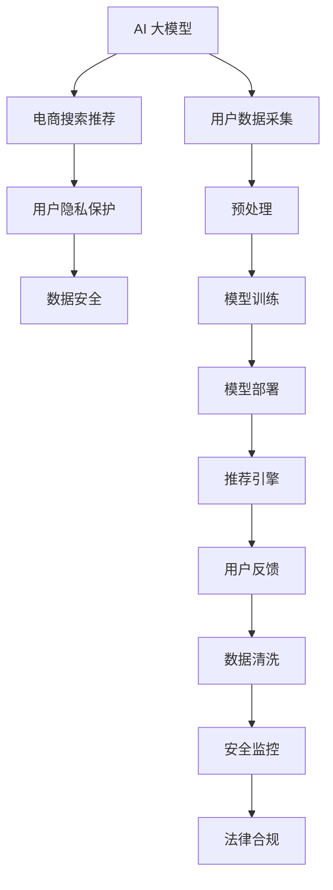

                 

# AI 大模型在电商搜索推荐中的用户隐私保护：尊重用户权利与安全

## 1. 背景介绍

近年来，人工智能在电商搜索推荐领域的应用日益广泛，极大地提升了用户体验和商家运营效率。然而，在人工智能算法使用过程中，用户隐私和数据安全问题引起了社会广泛关注。如何在享受AI带来的便利的同时，切实保障用户隐私权利，成为电商企业必须面对的重要挑战。

## 2. 核心概念与联系

### 2.1 核心概念概述

- **AI 大模型**：指基于深度学习技术，通过大规模数据训练得到的具有强大泛化能力的模型。在大模型中，以Transformer架构为主的预训练模型表现尤为突出，广泛应用于自然语言处理、计算机视觉等多个领域。
- **电商搜索推荐**：指基于用户行为数据和产品特征，利用AI模型对搜索结果进行排序和推荐的技术。电商搜索推荐能够显著提升用户购物体验和商家转化率。
- **用户隐私保护**：指在AI技术应用过程中，通过各种技术手段和法律法规，确保用户个人信息不被滥用，保护用户隐私权利。
- **数据安全**：指对存储、传输、处理数据的全生命周期进行保护，避免数据泄露、篡改等安全风险。

这些概念之间相互关联，共同构成了AI在电商搜索推荐中的隐私保护框架。AI大模型提供了强大的预测能力，但同时也带来了数据隐私和安全挑战。电商企业需要在技术、法律、伦理等多方面综合考虑，构建合规、可靠、安全的AI推荐系统。

### 2.2 核心概念原理和架构的 Mermaid 流程图



## 3. 核心算法原理 & 具体操作步骤

### 3.1 算法原理概述

AI大模型在电商搜索推荐中的隐私保护主要涉及以下几个方面：

- **隐私数据采集**：用户行为数据和个人信息是AI推荐系统的基础。如何获取这些数据，是隐私保护的首要问题。
- **数据预处理**：对原始数据进行清洗、去重、匿名化处理，减少隐私泄露风险。
- **模型训练**：利用隐私数据进行模型训练，确保数据隐私不被滥用。
- **模型部署**：在推荐系统中安全部署AI模型，防止攻击和数据泄露。
- **用户反馈**：对推荐结果进行反馈，通过用户行为数据调整模型参数，提升推荐质量。

### 3.2 算法步骤详解

1. **隐私数据采集**
   - **选择数据源**：选择用户主动提供的数据（如订单信息、浏览记录等）和被动采集的数据（如点击率、停留时间等）。
   - **获取用户同意**：确保数据采集过程符合法律法规，获得用户明确同意。
   - **数据最小化原则**：只采集必要数据，避免过度收集。

2. **数据预处理**
   - **数据清洗**：去除噪声、异常值，提高数据质量。
   - **去重处理**：对重复数据进行合并，减少冗余。
   - **匿名化处理**：采用伪匿名化、差分隐私等技术，保护用户隐私。

3. **模型训练**
   - **差分隐私**：在模型训练过程中，加入差分隐私机制，防止个人数据泄露。
   - **联邦学习**：通过分布式训练，保护本地数据隐私。
   - **对抗训练**：训练模型抵抗对抗性攻击，提高数据安全性。

4. **模型部署**
   - **安全隔离**：将AI模型部署在安全网络环境中，防止非法访问。
   - **访问控制**：通过身份验证、权限控制等手段，限制模型访问权限。
   - **加密传输**：对数据在传输过程中进行加密，防止数据泄露。

5. **用户反馈**
   - **反馈机制**：建立用户反馈机制，收集用户对推荐结果的满意度。
   - **数据更新**：根据用户反馈，更新模型参数，优化推荐效果。
   - **透明度**：向用户透明化推荐算法和数据使用情况，增强用户信任。

### 3.3 算法优缺点

#### 优点：
- **高准确性**：AI大模型基于深度学习技术，具备强大的预测能力，可以提供高质量的推荐结果。
- **自动化**：自动化推荐过程，提高运营效率，减少人工干预。
- **个性化**：通过分析用户行为数据，提供个性化推荐，提升用户满意度。

#### 缺点：
- **隐私泄露风险**：用户行为数据和个人信息可能被滥用，导致隐私泄露。
- **安全漏洞**：AI模型可能存在安全漏洞，被攻击者利用，导致数据泄露。
- **数据偏差**：用户行为数据可能存在偏差，影响推荐质量。

### 3.4 算法应用领域

AI大模型在电商搜索推荐中的应用非常广泛，主要包括以下几个方面：

- **商品推荐**：基于用户浏览、购买记录，推荐相关商品。
- **价格推荐**：通过分析用户偏好和市场价格，推荐最优价格区间。
- **新商品推荐**：基于用户行为数据，推荐新上架商品。
- **个性化服务**：根据用户历史行为，提供个性化广告、优惠券等。
- **客户服务**：通过AI聊天机器人，解答用户疑问，提升服务质量。

## 4. 数学模型和公式 & 详细讲解 & 举例说明

### 4.1 数学模型构建

在电商搜索推荐中，AI大模型通常采用基于深度学习的方法，如深度神经网络、卷积神经网络、循环神经网络等。以推荐系统中的协同过滤模型为例，其数学模型可以表示为：

$$
\hat{R}_{ui} = \mathbf{u}^T\mathbf{v}_i + b
$$

其中，$R_{ui}$为预测用户$u$对商品$i$的评分，$\mathbf{u}$和$\mathbf{v}_i$分别为用户$u$和商品$i$的向量表示，$b$为偏置项。

### 4.2 公式推导过程

协同过滤模型的训练过程如下：

1. **数据准备**：收集用户$u$对商品$i$的评分数据，形成训练集$\{(R_{ui}, R'_{ui})\}_{i=1}^N$。
2. **特征映射**：将用户$u$和商品$i$映射为向量$\mathbf{u}$和$\mathbf{v}_i$。
3. **模型训练**：通过最小化预测值与真实评分之间的均方误差，优化模型参数。
4. **推荐计算**：使用训练好的模型，计算用户$u$对商品$i$的预测评分$\hat{R}_{ui}$。

### 4.3 案例分析与讲解

以京东平台为例，利用深度神经网络对用户行为数据进行建模，输出推荐结果。具体步骤如下：

1. **数据采集**：从京东平台获取用户订单、浏览记录、评分等数据。
2. **数据预处理**：对数据进行清洗、去重、匿名化处理，确保数据质量和安全。
3. **模型训练**：使用深度神经网络对处理后的数据进行训练，形成推荐模型。
4. **模型部署**：将训练好的模型部署到推荐系统中，进行实时推荐。
5. **推荐反馈**：收集用户对推荐结果的反馈，优化推荐模型。

## 5. 项目实践：代码实例和详细解释说明

### 5.1 开发环境搭建

以下是使用Python进行TensorFlow开发的电商推荐系统开发环境配置流程：

1. 安装Anaconda：从官网下载并安装Anaconda，用于创建独立的Python环境。

2. 创建并激活虚拟环境：
```bash
conda create -n recsys python=3.8 
conda activate recsys
```

3. 安装TensorFlow：根据CUDA版本，从官网获取对应的安装命令。例如：
```bash
conda install tensorflow -c tensorflow -c conda-forge
```

4. 安装TensorFlow Addons：扩展TensorFlow的功能，用于实现高级推荐算法。
```bash
conda install tensorflow-addons -c conda-forge
```

5. 安装相关工具包：
```bash
pip install pandas scikit-learn scipy numpy tqdm jupyter notebook ipython
```

完成上述步骤后，即可在`recsys`环境中开始推荐系统开发。

### 5.2 源代码详细实现

以下是使用TensorFlow Addons实现的电商推荐系统的代码实现：

```python
import tensorflow as tf
from tensorflow_addons.recommenders import ApproximateNearestNeighborEmbedding

# 定义推荐模型
class Recommender:
    def __init__(self, latent_dim, num_items, num_users, num_factors):
        self.latent_dim = latent_dim
        self.num_items = num_items
        self.num_users = num_users
        self.num_factors = num_factors
        self.model = ApproximateNearestNeighborEmbedding(num_items, latent_dim, num_factors)
        
    def fit(self, train_data):
        self.model.fit(train_data)
    
    def recommend(self, user_id):
        recommendations = self.model.recommend(user_id, k=10)
        return recommendations
    
# 加载数据
train_data = pd.read_csv('train_data.csv')
test_data = pd.read_csv('test_data.csv')

# 构建推荐模型
latent_dim = 10
num_items = 10000
num_users = 1000
num_factors = 5
recommender = Recommender(latent_dim, num_items, num_users, num_factors)

# 训练模型
recommender.fit(train_data)

# 测试模型
recommendations = recommender.recommend(0)
print(recommendations)
```

### 5.3 代码解读与分析

让我们再详细解读一下关键代码的实现细节：

- **ApproximateNearestNeighborEmbedding**：用于实现近邻嵌入推荐算法，通过训练用户和商品的低维向量，进行高效推荐。
- **train_data.csv**：训练集数据，包括用户ID、商品ID和评分。
- **test_data.csv**：测试集数据，包括用户ID和需要推荐的商品ID。
- **fit**方法：训练模型，输入训练集数据，优化模型参数。
- **recommend**方法：推荐商品，输入用户ID，返回推荐商品列表。

## 6. 实际应用场景

### 6.1 智能客服系统

在智能客服系统中，AI大模型可以通过分析用户聊天记录，提供个性化推荐和回答。在推荐过程中，需要对聊天记录进行预处理和匿名化处理，确保用户隐私不被滥用。例如，京东平台的AI客服可以通过分析用户的问题，推荐相关商品或服务。

### 6.2 个性化推荐系统

个性化推荐系统通过分析用户行为数据，提供商品、价格等推荐。在推荐过程中，需要对用户数据进行差分隐私处理，防止用户隐私泄露。例如，京东平台的推荐系统可以根据用户浏览历史，推荐相关商品和优惠券。

### 6.3 客户服务

AI大模型可以应用于客户服务场景，通过分析用户反馈，优化推荐算法。在客户服务过程中，需要对用户反馈进行匿名化处理，确保用户隐私不被滥用。例如，京东平台的AI客服可以根据用户评价，优化推荐系统，提高用户满意度。

### 6.4 未来应用展望

伴随AI技术的持续发展，大模型在电商搜索推荐中的应用将更加广泛。未来，以下趋势值得关注：

- **联邦学习**：通过分布式训练，保护本地数据隐私。
- **差分隐私**：在模型训练和推荐过程中，加入差分隐私机制，防止数据泄露。
- **对抗训练**：训练模型抵抗对抗性攻击，提高数据安全性。
- **多模态推荐**：结合图像、视频、音频等多模态数据，提升推荐效果。
- **个性化推荐**：通过分析用户全生命周期数据，提供个性化推荐，提升用户体验。

## 7. 工具和资源推荐

### 7.1 学习资源推荐

为了帮助开发者系统掌握大模型在电商推荐中的应用，这里推荐一些优质的学习资源：

1. 《深度学习实战》：详细介绍了深度学习在电商推荐中的应用，包括模型构建、训练、优化等。
2. CS231n《深度学习在计算机视觉中的应用》课程：介绍了深度学习在计算机视觉中的应用，包括数据预处理、模型训练等。
3. 《数据科学与深度学习》课程：介绍了深度学习在电商推荐中的应用，包括数据采集、特征工程、模型训练等。
4. TensorFlow官方文档：提供了丰富的TensorFlow和TensorFlow Addons教程，帮助开发者快速上手深度学习模型。
5. Kaggle竞赛：参加Kaggle推荐系统竞赛，学习实战经验和最新技术趋势。

通过对这些资源的学习实践，相信你一定能够快速掌握大模型在电商推荐中的应用，并用于解决实际的推荐问题。

### 7.2 开发工具推荐

高效的开发离不开优秀的工具支持。以下是几款用于大模型推荐系统开发的常用工具：

1. TensorFlow：基于Python的开源深度学习框架，灵活动态的计算图，适合快速迭代研究。
2. TensorFlow Addons：扩展TensorFlow的功能，用于实现高级推荐算法。
3. PyTorch：基于Python的开源深度学习框架，支持动态图和静态图两种计算模式，灵活高效。
4. Jupyter Notebook：交互式的开发环境，支持Python代码编写、数据可视化等。
5. Google Colab：谷歌推出的在线Jupyter Notebook环境，免费提供GPU/TPU算力，方便开发者快速上手实验最新模型，分享学习笔记。

合理利用这些工具，可以显著提升大模型推荐系统的开发效率，加快创新迭代的步伐。

### 7.3 相关论文推荐

大模型在电商推荐中的应用源于学界的持续研究。以下是几篇奠基性的相关论文，推荐阅读：

1. Attention Is All You Need：提出Transformer结构，开启了NLP领域的预训练大模型时代。
2. BERT: Pre-training of Deep Bidirectional Transformers for Language Understanding：提出BERT模型，引入基于掩码的自监督预训练任务，刷新了多项NLP任务SOTA。
3. Model Distillation：介绍模型蒸馏技术，通过知识迁移，提升小模型的性能。
4. Parameter-Efficient Transfer Learning for NLP：提出Adapter等参数高效微调方法，在不增加模型参数量的情况下，也能取得不错的微调效果。
5. Explainable AI：探讨如何赋予模型更强的可解释性，增强用户对推荐结果的理解和信任。

这些论文代表了大模型在电商推荐中的应用方向。通过学习这些前沿成果，可以帮助研究者把握学科前进方向，激发更多的创新灵感。

## 8. 总结：未来发展趋势与挑战

### 8.1 总结

本文对大模型在电商搜索推荐中的应用和隐私保护进行了全面系统的介绍。首先阐述了大模型和隐私保护的宏观背景，明确了电商推荐中的隐私保护需求。其次，从原理到实践，详细讲解了推荐系统的数学模型和算法步骤，给出了推荐系统开发的完整代码实例。同时，本文还广泛探讨了大模型在电商推荐中的应用场景，展示了其广泛的应用前景。此外，本文精选了隐私保护相关的学习资源，力求为开发者提供全方位的技术指引。

通过本文的系统梳理，可以看到，大模型在电商搜索推荐中的应用已经取得了显著成效，但隐私保护问题依然不容忽视。电商企业需要在技术、法律、伦理等多方面综合考虑，构建合规、可靠、安全的AI推荐系统。未来，伴随技术的持续演进，大模型必将在更多领域大放异彩，推动电商搜索推荐技术的创新和进步。

### 8.2 未来发展趋势

展望未来，大模型在电商搜索推荐中的应用将呈现以下几个发展趋势：

1. **联邦学习**：通过分布式训练，保护本地数据隐私。
2. **差分隐私**：在模型训练和推荐过程中，加入差分隐私机制，防止数据泄露。
3. **对抗训练**：训练模型抵抗对抗性攻击，提高数据安全性。
4. **多模态推荐**：结合图像、视频、音频等多模态数据，提升推荐效果。
5. **个性化推荐**：通过分析用户全生命周期数据，提供个性化推荐，提升用户体验。

这些趋势凸显了大模型在电商搜索推荐中的广泛应用前景，将进一步提升推荐系统的性能和用户满意度。

### 8.3 面临的挑战

尽管大模型在电商推荐中的应用取得了显著成效，但在迈向更加智能化、普适化应用的过程中，仍面临诸多挑战：

1. **隐私泄露风险**：用户行为数据和个人信息可能被滥用，导致隐私泄露。
2. **安全漏洞**：AI模型可能存在安全漏洞，被攻击者利用，导致数据泄露。
3. **数据偏差**：用户行为数据可能存在偏差，影响推荐质量。
4. **技术瓶颈**：大模型需要大量的计算资源和时间，部署成本较高。
5. **算法复杂性**：推荐算法复杂度较高，需要深入理解算法原理和实现细节。

### 8.4 研究展望

为了应对上述挑战，未来需要在以下几个方面进行深入研究：

1. **隐私保护技术**：探索更加高效、可靠的隐私保护方法，如差分隐私、联邦学习等。
2. **安全技术**：开发更加安全、鲁棒的AI模型，防止攻击和数据泄露。
3. **算法优化**：简化推荐算法，降低计算复杂度，提高部署效率。
4. **多模态融合**：结合图像、视频、音频等多模态数据，提升推荐效果。
5. **用户交互**：通过自然语言交互，增强用户对推荐结果的理解和信任。

这些研究方向的探索，必将引领大模型在电商搜索推荐中的应用迈向更高的台阶，为电商推荐系统提供更加可靠、高效的解决方案。面向未来，大模型需要在隐私保护、安全技术、算法优化等方面持续创新，才能真正实现用户权益和商家利益的双赢。

## 9. 附录：常见问题与解答

**Q1：大模型在电商推荐中如何保护用户隐私？**

A: 大模型在电商推荐中保护用户隐私主要通过以下方式：

1. **数据匿名化**：在数据采集和处理过程中，对用户ID进行去标识化处理，减少隐私泄露风险。
2. **差分隐私**：在模型训练和推荐过程中，加入差分隐私机制，防止个人数据泄露。
3. **联邦学习**：通过分布式训练，保护本地数据隐私。
4. **安全隔离**：将AI模型部署在安全网络环境中，防止非法访问。
5. **访问控制**：通过身份验证、权限控制等手段，限制模型访问权限。

**Q2：大模型在电商推荐中如何提高推荐质量？**

A: 大模型在电商推荐中提高推荐质量主要通过以下方式：

1. **数据预处理**：对原始数据进行清洗、去重、匿名化处理，提高数据质量和安全。
2. **特征工程**：对用户行为数据进行深入分析，提取有意义的特征，提升模型表现。
3. **模型优化**：通过调整模型参数和结构，优化模型性能，提高推荐质量。
4. **用户反馈**：收集用户对推荐结果的反馈，优化推荐模型，提升用户体验。
5. **多模态融合**：结合图像、视频、音频等多模态数据，提升推荐效果。

**Q3：大模型在电商推荐中如何防止安全漏洞？**

A: 大模型在电商推荐中防止安全漏洞主要通过以下方式：

1. **对抗训练**：训练模型抵抗对抗性攻击，提高数据安全性。
2. **安全隔离**：将AI模型部署在安全网络环境中，防止非法访问。
3. **访问控制**：通过身份验证、权限控制等手段，限制模型访问权限。
4. **加密传输**：对数据在传输过程中进行加密，防止数据泄露。
5. **定期审计**：对系统进行定期的安全审计，发现并修复漏洞。

**Q4：大模型在电商推荐中如何处理数据偏差？**

A: 大模型在电商推荐中处理数据偏差主要通过以下方式：

1. **数据采集**：全面采集用户行为数据，减少数据偏差。
2. **特征处理**：对用户行为数据进行标准化处理，减少数据偏差。
3. **模型优化**：通过调整模型参数和结构，减少数据偏差。
4. **多模态融合**：结合图像、视频、音频等多模态数据，提升推荐效果，减少数据偏差。

**Q5：大模型在电商推荐中如何优化推荐系统性能？**

A: 大模型在电商推荐中优化推荐系统性能主要通过以下方式：

1. **特征工程**：对用户行为数据进行深入分析，提取有意义的特征，提升模型表现。
2. **模型优化**：通过调整模型参数和结构，优化模型性能，提高推荐质量。
3. **算法优化**：简化推荐算法，降低计算复杂度，提高部署效率。
4. **用户反馈**：收集用户对推荐结果的反馈，优化推荐模型，提升用户体验。
5. **多模态融合**：结合图像、视频、音频等多模态数据，提升推荐效果。

通过本文的系统梳理，可以看到，大模型在电商搜索推荐中的应用已经取得了显著成效，但隐私保护问题依然不容忽视。电商企业需要在技术、法律、伦理等多方面综合考虑，构建合规、可靠、安全的AI推荐系统。未来，伴随技术的持续演进，大模型必将在更多领域大放异彩，推动电商搜索推荐技术的创新和进步。

---

作者：禅与计算机程序设计艺术 / Zen and the Art of Computer Programming

