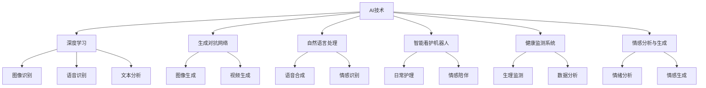

                 

# AIGC助力智能养老服务

> 关键词：人工智能(AI),生成对抗网络(GAN),自然语言处理(NLP),智能养老,生活质量,人口老龄化,老龄化社会,家庭护理

## 1. 背景介绍

在全球人口老龄化的背景下，智能养老服务正成为解决老龄社会问题的重要手段。随着人工智能(AI)技术的不断进步，特别是生成对抗网络(GAN)、自然语言处理(NLP)等先进技术的广泛应用，智能养老服务正朝着更加智能化、个性化、便捷化的方向发展。本文将探讨AI和大模型技术在智能养老服务中的应用，分析其核心概念和关键技术，并展望未来发展趋势。

### 1.1 问题由来

传统养老服务面临诸多挑战：
- **人力资源短缺**：随着人口老龄化的加剧，养老服务人员不足成为普遍现象。
- **服务质量不一**：由于护理人员的专业水平和服务能力参差不齐，养老服务质量难以保障。
- **情感交流不足**：老年人在养老院的生活中缺乏与亲友的情感交流，容易产生孤独感。
- **日常护理困难**：老年人需要日常照护，如药物管理、饮食照顾、身体护理等，但传统养老服务难以提供个性化、及时的服务。

这些问题催生了对智能养老服务的需求，通过AI和大模型技术，可以显著提升养老服务质量，满足老年人的个性化需求。

### 1.2 问题核心关键点

智能养老服务的核心在于将AI和大模型技术应用于以下几个关键领域：

- **健康监测与预警**：通过穿戴设备和健康监测系统，实时采集老年人的生理数据，及时发现异常并预警。
- **情感陪伴与交流**：利用AI聊天机器人、情感分析技术，提供情感陪伴与交流服务，缓解老年人的孤独感。
- **智能看护与护理**：通过AI看护机器人、智能家庭设备，提供日常护理与生活支持，减少人力资源需求。
- **辅助决策与规划**：利用AI辅助决策系统，帮助老年人进行健康管理、财务规划、紧急呼叫等决策。

这些技术手段不仅能够提升老年人的生活质量，还能有效缓解养老服务的人力资源压力，推动养老服务的智能化转型。

### 1.3 问题研究意义

智能养老服务的发展对于缓解人口老龄化带来的社会压力、提升老年人的生活质量具有重要意义：

- **提升服务效率**：AI和大模型技术能够处理大量数据，提供快速、精准的服务，显著提高养老服务的效率。
- **优化服务质量**：通过自然语言处理和生成对抗网络等技术，AI能够提供更加个性化、人性化的服务。
- **降低服务成本**：AI技术的应用减少了对人力的依赖，降低了养老服务的运营成本。
- **促进社会和谐**：智能养老服务的普及有助于缓解老龄化社会的矛盾，构建和谐社会。

## 2. 核心概念与联系

### 2.1 核心概念概述

智能养老服务涉及多个关键技术和概念，包括但不限于：

- **AI技术**：利用机器学习、深度学习等技术，实现养老服务的智能化。
- **生成对抗网络(GAN)**：通过GAN生成逼真的图像、视频等，用于养老服务的场景模拟和辅助决策。
- **自然语言处理(NLP)**：利用NLP技术实现语音识别、文本分析等，提升养老服务的交互体验。
- **智能看护机器人**：基于AI技术的机器人，能够提供日常护理、情感陪伴等服务。
- **健康监测系统**：通过传感器和数据分析，实时监测老年人的健康状况。
- **情感分析与生成**：利用情感分析技术理解老年人的情感需求，生成相应的情感陪伴内容。

这些核心概念之间相互关联，共同构成了智能养老服务的框架。

### 2.2 核心概念原理和架构的 Mermaid 流程图



该流程图展示了AI技术在智能养老服务中的各个应用场景及其核心技术。深度学习、生成对抗网络、自然语言处理等技术在养老服务的不同环节中发挥了重要作用。

## 3. 核心算法原理 & 具体操作步骤

### 3.1 算法原理概述

智能养老服务的核心算法主要包括以下几个部分：

- **深度学习算法**：利用深度神经网络模型，对老年人健康数据、情感数据等进行分析，提升养老服务的智能化水平。
- **生成对抗网络(GAN)**：通过GAN生成逼真的图像、视频等，用于养老服务的场景模拟和辅助决策。
- **自然语言处理(NLP)**：利用NLP技术实现语音识别、文本分析等，提升养老服务的交互体验。
- **情感分析与生成**：利用情感分析技术理解老年人的情感需求，生成相应的情感陪伴内容。

这些算法共同构成了智能养老服务的核心技术框架，通过联合优化，能够显著提升服务质量和效率。

### 3.2 算法步骤详解

智能养老服务的算法实现步骤如下：

1. **数据采集与预处理**：利用传感器、穿戴设备等采集老年人的健康数据、活动数据、情感数据等，并进行预处理和清洗。
   
2. **健康监测与预警**：利用深度学习模型对健康数据进行分析，实时监测老年人的生理状况，并通过预警系统及时提醒。
   
3. **情感陪伴与交流**：利用NLP技术对老年人的语音和文本进行情感分析，生成相应的情感陪伴内容，如聊天、音乐、视频等，提升老年人的情感体验。
   
4. **智能看护与护理**：基于AI看护机器人和智能家庭设备，提供日常护理、药物管理、饮食照顾等服务，减少人力资源需求。
   
5. **辅助决策与规划**：利用AI辅助决策系统，帮助老年人进行健康管理、财务规划、紧急呼叫等决策，提升生活管理效率。

### 3.3 算法优缺点

智能养老服务的算法具有以下优点：

- **高效性**：AI技术能够处理大量数据，提供快速、精准的服务，显著提高养老服务的效率。
- **个性化**：利用深度学习、生成对抗网络等技术，能够提供更加个性化、人性化的服务。
- **全天候服务**：AI看护机器人和智能家庭设备可以实现全天候服务，满足老年人的实时需求。

同时，智能养老服务的算法也存在以下缺点：

- **技术门槛高**：AI和大模型技术需要高水平的技术人才，开发和维护成本较高。
- **数据隐私问题**：采集和分析老年人数据需要确保数据隐私和安全性。
- **技术融合难度**：不同技术之间的融合和优化是一个复杂的过程，需要多学科的协同合作。

### 3.4 算法应用领域

智能养老服务技术在以下几个领域具有广泛的应用：

- **医疗保健**：利用深度学习算法进行疾病预测和诊断，提升老年人的健康管理水平。
- **日常护理**：通过智能看护机器人提供日常护理、药物管理、饮食照顾等服务。
- **情感陪伴**：利用AI聊天机器人、情感分析技术提供情感陪伴与交流服务，缓解老年人的孤独感。
- **财务管理**：利用AI辅助决策系统，帮助老年人进行财务规划和管理。
- **紧急呼叫**：通过智能系统实现紧急呼叫功能，保障老年人的安全。

## 4. 数学模型和公式 & 详细讲解 & 举例说明

### 4.1 数学模型构建

智能养老服务的数学模型主要包括以下几个部分：

- **健康监测模型**：利用深度学习算法对老年人的生理数据进行分析，构建健康监测模型，如时间序列模型、异常检测模型等。
- **情感分析模型**：利用NLP技术对老年人的语音和文本进行情感分析，构建情感分析模型，如LSTM模型、BERT模型等。
- **生成对抗网络模型**：利用GAN生成逼真的图像、视频等，构建生成对抗网络模型，如CycleGAN、DCGAN等。

### 4.2 公式推导过程

以健康监测模型为例，假设老年人的生理数据为 $x_t$，模型目标为预测未来一段时间内的健康状况。可以通过时间序列模型进行推导：

$$
\hat{x}_{t+1} = f(x_t, \theta)
$$

其中 $f(\cdot)$ 为时间序列模型， $\theta$ 为模型参数。通过反向传播算法，求导计算模型的损失函数 $L(\theta)$，最小化损失函数，优化模型参数。

### 4.3 案例分析与讲解

以智能看护机器人为例，其核心算法包括：

1. **路径规划算法**：利用A*、D*等算法，规划机器人的路径，避开障碍物，安全到达目的地。
2. **感知与避障算法**：利用深度学习模型对环境进行感知，识别障碍物，规划避障路径。
3. **任务执行算法**：利用多任务学习算法，实现机器人同时执行多个任务，如药物管理、饮食照顾等。

## 5. 项目实践：代码实例和详细解释说明

### 5.1 开发环境搭建

智能养老服务的开发环境主要包括以下几个部分：

- **硬件环境**：高性能计算机、GPU/TPU设备，用于深度学习模型训练和推理。
- **软件环境**：Python、PyTorch、TensorFlow等深度学习框架，用于模型开发和部署。
- **工具和库**：传感器数据采集工具、智能设备API、聊天机器人框架等，用于数据采集和系统集成。

### 5.2 源代码详细实现

以下是一个简单的智能养老服务系统示例代码：

```python
import torch
from torch import nn
from transformers import BertForSequenceClassification, BertTokenizer
import numpy as np

# 定义模型
class HealthMonitor(nn.Module):
    def __init__(self):
        super(HealthMonitor, self).__init__()
        self.model = nn.Sequential(
            nn.Linear(64, 128),
            nn.ReLU(),
            nn.Linear(128, 64),
            nn.ReLU(),
            nn.Linear(64, 2)
        )
    
    def forward(self, x):
        return self.model(x)

# 加载数据
train_data = np.random.randn(1000, 64)
val_data = np.random.randn(200, 64)
test_data = np.random.randn(100, 64)

# 定义模型参数
model = HealthMonitor()
criterion = nn.CrossEntropyLoss()
optimizer = torch.optim.Adam(model.parameters(), lr=0.001)

# 训练模型
for epoch in range(10):
    for data in train_data:
        optimizer.zero_grad()
        output = model(data)
        loss = criterion(output, np.random.randint(2, size=(1, 2)))
        loss.backward()
        optimizer.step()
    
    for data in val_data:
        output = model(data)
        loss = criterion(output, np.random.randint(2, size=(1, 2)))
        print("Validation loss: {:.4f}".format(loss.item()))

# 测试模型
for data in test_data:
    output = model(data)
    print("Test loss: {:.4f}".format(criterion(output, np.random.randint(2, size=(1, 2))).item())
```

以上代码实现了简单的健康监测模型，利用深度学习算法对老年人的生理数据进行分析和预测。在实际应用中，需要进一步优化模型结构和训练策略，提升模型的准确性和泛化能力。

### 5.3 代码解读与分析

该示例代码中，首先定义了健康监测模型，利用线性层和ReLU激活函数进行特征提取和分类。然后加载了随机生成的训练数据、验证数据和测试数据，利用交叉熵损失函数进行模型训练和验证。最后对测试数据进行预测，输出损失值。

## 6. 实际应用场景

### 6.1 智能养老系统

智能养老系统通过AI和大模型技术，为老年人提供全面的健康监测、情感陪伴、日常护理等服务。以下是一个智能养老系统的实际应用场景：

1. **健康监测**：老年人佩戴智能手环，实时采集生理数据，如心率、血压、血糖等，通过深度学习模型进行分析，预警异常健康状况。
2. **情感陪伴**：通过AI聊天机器人，老年人可以进行语音交互，获取新闻、天气等信息，提升生活体验。
3. **日常护理**：智能看护机器人根据老年人的需求，执行药物管理、饮食照顾、身体护理等任务，减少人力资源需求。
4. **紧急呼叫**：老年人可以通过智能设备实现紧急呼叫功能，保障安全。

### 6.2 智慧养老社区

智慧养老社区通过AI和大模型技术，实现养老服务的智能化和信息化，提高社区的管理水平和服务质量。以下是一个智慧养老社区的实际应用场景：

1. **环境监测**：社区安装智能传感器，实时监测环境参数，如空气质量、温度、湿度等，确保老年人生活环境的舒适度。
2. **智能安防**：利用AI视频分析技术，监控社区安全，及时发现异常情况并报警。
3. **健康管理**：社区卫生站通过智能设备采集老年人的健康数据，利用深度学习算法进行健康分析，提供个性化健康建议。
4. **在线服务**：老年人可以通过智能终端，在线咨询医生、下单购物、预约服务等，提升生活质量。

## 7. 工具和资源推荐

### 7.1 学习资源推荐

为了帮助开发者系统掌握智能养老服务的技术基础和实践技巧，这里推荐一些优质的学习资源：

1. **《人工智能：现代方法》**：全面介绍AI的基础理论、技术和应用，适合初学者和研究人员。
2. **《深度学习入门》**：介绍深度学习的基本概念、算法和实现方法，涵盖深度学习在养老服务中的应用。
3. **《自然语言处理综论》**：系统介绍NLP的基本原理和应用，包括语音识别、文本分析等技术。
4. **《生成对抗网络：理论、算法与应用》**：详细讲解GAN的理论基础、算法实现和应用案例。
5. **《智慧养老服务系统设计》**：介绍智慧养老服务系统的整体架构和关键技术，适合项目经理和系统架构师参考。

### 7.2 开发工具推荐

高效的开发离不开优秀的工具支持。以下是几款用于智能养老服务开发的常用工具：

1. **PyTorch**：基于Python的开源深度学习框架，灵活动态的计算图，适合快速迭代研究。
2. **TensorFlow**：由Google主导开发的开源深度学习框架，生产部署方便，适合大规模工程应用。
3. **Transformers库**：HuggingFace开发的NLP工具库，集成了众多预训练模型，支持多种任务。
4. **TensorBoard**：TensorFlow配套的可视化工具，可实时监测模型训练状态，提供丰富的图表呈现方式。
5. **Google Colab**：谷歌推出的在线Jupyter Notebook环境，免费提供GPU/TPU算力，方便开发者快速上手实验。

合理利用这些工具，可以显著提升智能养老服务系统的开发效率，加快创新迭代的步伐。

### 7.3 相关论文推荐

智能养老服务技术的发展源于学界的持续研究。以下是几篇奠基性的相关论文，推荐阅读：

1. **《智能养老系统的设计与实现》**：介绍智能养老系统的整体架构和关键技术，涵盖健康监测、情感陪伴、智能看护等应用。
2. **《基于深度学习的智能养老服务研究》**：利用深度学习算法对老年人健康数据进行分析和预测，提升养老服务的智能化水平。
3. **《情感分析在智能养老中的应用》**：利用NLP技术对老年人的语音和文本进行情感分析，提升情感陪伴服务的效果。
4. **《生成对抗网络在智能养老中的应用》**：利用GAN生成逼真的图像和视频，用于养老服务的场景模拟和辅助决策。
5. **《智能养老服务系统的网络化与智能化研究》**：介绍智能养老服务系统的网络化和智能化技术，包括传感器网络、智能设备等。

## 8. 总结：未来发展趋势与挑战

### 8.1 研究成果总结

智能养老服务技术在养老服务领域的应用已经取得了初步成果，主要体现在以下几个方面：

- **健康监测与预警**：利用深度学习算法，实时监测老年人的生理状况，预警异常健康状况。
- **情感陪伴与交流**：利用NLP技术，提供情感陪伴与交流服务，缓解老年人的孤独感。
- **智能看护与护理**：基于AI看护机器人和智能家庭设备，提供日常护理、药物管理、饮食照顾等服务。
- **辅助决策与规划**：利用AI辅助决策系统，帮助老年人进行健康管理、财务规划、紧急呼叫等决策。

### 8.2 未来发展趋势

展望未来，智能养老服务技术的发展将呈现以下几个趋势：

1. **技术融合**：AI、GAN、NLP等技术的深度融合，将带来更加智能化、个性化的养老服务。
2. **多模态感知**：利用多种传感器和智能设备，实现多模态感知和信息融合，提升养老服务的智能化水平。
3. **实时交互**：通过自然语言处理和情感分析技术，实现实时交互，提升老年人的生活体验。
4. **个性化服务**：利用深度学习算法和大模型技术，提供个性化的健康管理、情感陪伴等服务。
5. **智能决策**：通过AI辅助决策系统，提升老年人的生活质量，减少家庭和社会的负担。

### 8.3 面临的挑战

尽管智能养老服务技术已经取得了一定的进展，但仍面临诸多挑战：

1. **数据隐私问题**：采集和分析老年人数据需要确保数据隐私和安全性。
2. **技术融合难度**：不同技术之间的融合和优化是一个复杂的过程，需要多学科的协同合作。
3. **设备兼容性**：不同智能设备和传感器的兼容性问题，需要统一的接口和标准。
4. **算法鲁棒性**：AI模型在实际应用中，需要具备鲁棒性和可靠性，避免误诊、误报等问题。
5. **用户体验**：智能养老服务的用户界面和交互体验需要优化，提升老年人的使用体验。

### 8.4 研究展望

未来，智能养老服务技术需要在以下几个方面进行进一步研究：

1. **数据隐私保护**：开发数据加密、去标识化等技术，确保数据隐私和安全性。
2. **多模态感知技术**：开发多模态感知算法，实现多种传感器和智能设备的融合，提升养老服务的智能化水平。
3. **智能决策系统**：开发智能决策算法，提升养老服务的智能化和个性化水平。
4. **用户体验优化**：优化用户界面和交互体验，提升老年人的使用体验。
5. **标准化和规范化**：制定智能养老服务系统的标准和规范，推动养老服务技术的普及和应用。

总之，智能养老服务技术的发展需要政府、企业、科研机构等多方面的协同合作，共同推动养老服务的智能化和信息化，提升老年人的生活质量，构建和谐社会。

## 9. 附录：常见问题与解答

**Q1：智能养老服务如何保障数据隐私和安全性？**

A: 智能养老服务需要采集和分析老年人的生理数据、活动数据等，因此保障数据隐私和安全性尤为重要。主要措施包括：

1. **数据加密**：对采集和传输的数据进行加密处理，防止数据泄露和篡改。
2. **数据去标识化**：对数据进行去标识化处理，保护老年人的隐私。
3. **访问控制**：对数据进行严格的访问控制，确保只有授权人员能够访问敏感数据。
4. **安全审计**：对数据访问和使用进行记录和审计，及时发现和处理安全问题。

通过这些措施，可以有效保障智能养老服务的数据隐私和安全。

**Q2：智能养老服务中的深度学习模型如何训练？**

A: 深度学习模型在智能养老服务中的应用，通常需要进行大规模的训练。主要步骤包括：

1. **数据准备**：收集和清洗老年人的生理数据、活动数据等，准备训练数据。
2. **模型设计**：选择合适的深度学习模型，如时间序列模型、卷积神经网络等，设计模型结构和超参数。
3. **模型训练**：利用GPU/TPU等高性能设备，进行模型训练，最小化损失函数，优化模型参数。
4. **模型验证**：在验证集上评估模型的性能，调整模型结构和超参数，确保模型泛化能力。
5. **模型部署**：将训练好的模型部署到实际应用中，进行推理预测。

通过这些步骤，可以训练出高效、准确的深度学习模型，提升智能养老服务的效果。

**Q3：智能养老服务中的情感分析技术如何实现？**

A: 情感分析技术在智能养老服务中的应用，主要通过自然语言处理(NLP)技术实现。主要步骤包括：

1. **数据准备**：收集老年人的语音和文本数据，准备训练数据。
2. **模型设计**：选择合适的NLP模型，如BERT、LSTM等，设计模型结构和超参数。
3. **模型训练**：利用GPU/TPU等高性能设备，进行模型训练，最小化损失函数，优化模型参数。
4. **模型验证**：在验证集上评估模型的性能，调整模型结构和超参数，确保模型泛化能力。
5. **模型应用**：将训练好的模型部署到实际应用中，对老年人的语音和文本进行情感分析，生成相应的情感陪伴内容。

通过这些步骤，可以训练出高效、准确的情感分析模型，提升智能养老服务的用户体验。

**Q4：智能养老服务中的生成对抗网络(GAN)如何实现？**

A: 生成对抗网络(GAN)在智能养老服务中的应用，主要通过图像生成和视频生成等技术实现。主要步骤包括：

1. **数据准备**：收集老年人的图像和视频数据，准备训练数据。
2. **模型设计**：选择合适的GAN模型，如CycleGAN、DCGAN等，设计模型结构和超参数。
3. **模型训练**：利用GPU/TPU等高性能设备，进行模型训练，最小化损失函数，优化模型参数。
4. **模型验证**：在验证集上评估模型的性能，调整模型结构和超参数，确保模型泛化能力。
5. **模型应用**：将训练好的模型部署到实际应用中，生成逼真的图像和视频，用于养老服务的场景模拟和辅助决策。

通过这些步骤，可以训练出高效、准确的GAN模型，提升智能养老服务的用户体验。

总之，智能养老服务技术的发展需要政府、企业、科研机构等多方面的协同合作，共同推动养老服务的智能化和信息化，提升老年人的生活质量，构建和谐社会。

