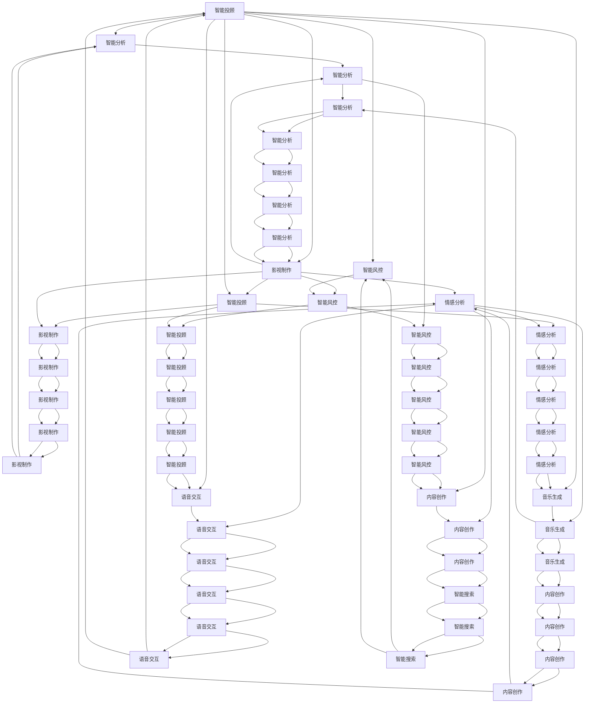

                 

# AIGC技术赋能传统行业转型

> 关键词：人工智能生成内容(AIGC)，智能制造，零售电商，金融科技，媒体娱乐，精准医疗

## 1. 背景介绍

### 1.1 问题由来
当前，传统行业在数字化转型过程中面临诸多挑战。企业需要从传统业务流程中提炼出知识，高效重构业务模式，同时应对快速变化的消费者需求。然而，传统行业普遍存在数据孤岛、系统烟囱等问题，难以有效整合内外部数据，缺乏灵活应对市场变化的能力。随着人工智能(AI)技术的不断演进，特别是生成式人工智能(AIGC)的兴起，为传统行业带来了新的契机。AIGC技术通过自动化生成文本、图像、音频等内容，可以帮助企业快速响应市场变化，提升创新能力，实现业务流程的智能化和个性化。

### 1.2 问题核心关键点
AIGC技术赋能传统行业的关键点包括：
1. **数据驱动决策**：通过对海量数据的深度挖掘和分析，实现精准的市场预测和运营决策。
2. **个性化推荐**：利用AIGC生成个性化的内容推荐，提升用户体验和留存率。
3. **自动化生产**：通过智能制造、智能客服等场景，提升生产效率和客户满意度。
4. **增强创意和内容创作**：在媒体娱乐、营销广告等领域，通过AIGC技术大幅提高内容创意和制作效率。
5. **辅助精准医疗**：在医疗健康领域，利用AIGC生成医学影像、健康报告等内容，辅助医生进行诊断和治疗。

### 1.3 问题研究意义
AIGC技术赋能传统行业，不仅可以提升传统业务流程的智能化水平，还能通过创新业务模式和产品形态，促进传统行业向数字化、智能化、个性化方向发展。具体来说，其研究意义包括：
1. **降低成本**：自动化生产和服务降低了人工成本，提高了生产效率。
2. **增强竞争力**：通过个性化推荐和智能客服等手段，提升客户体验和忠诚度，增强市场竞争力。
3. **加速创新**：利用AIGC技术快速生成新内容和新产品，缩短创新周期，加速行业迭代。
4. **优化供应链**：通过智能化供应链管理，提升供应链的灵活性和响应速度。
5. **提升服务质量**：通过智能客服和智能诊断等手段，提升服务质量和客户满意度。

## 2. 核心概念与联系

### 2.1 核心概念概述

为了更好地理解AIGC技术在传统行业中的应用，本节将介绍几个核心概念：

1. **生成式人工智能(AIGC)**：指使用AI技术自动生成文本、图像、音频、视频等内容的技术。AIGC通过深度学习、生成对抗网络(GAN)等方法，实现了内容生成的智能化和自动化。

2. **人工智能生成内容(AIGC)**：特指文本生成、图像生成、音频生成、视频生成等内容生成技术。AIGC技术广泛应用于文本摘要、机器翻译、智能客服、媒体制作等领域。

3. **智能制造**：指通过AI技术优化生产流程，实现智能化的生产、质量控制和供应链管理。智能制造利用大数据、物联网、机器人等技术，提升生产效率和灵活性。

4. **智能客服**：指利用AI技术实现智能化的客户服务，包括自然语言理解、对话生成、情感分析等功能。智能客服能够全天候提供高效、个性化的客户服务。

5. **零售电商**：指基于AI技术的电子商务模式，通过个性化推荐、智能搜索、智能客服等手段，提升用户体验和购买转化率。

6. **金融科技(FinTech)**：指将AI技术应用于金融领域，包括智能投顾、智能风控、智能分析等，提升金融服务的效率和质量。

7. **媒体娱乐**：指利用AI技术生成影视、音乐、游戏等内容，提升内容创作和传播的效率和质量。

8. **精准医疗**：指利用AI技术分析医学数据，辅助医生进行诊断、治疗和预防，提高医疗服务的精准性和可及性。

这些核心概念之间的逻辑关系可以通过以下Mermaid流程图来展示：



这个流程图展示了AIGC技术如何在不同领域中发挥作用，通过智能化、自动化的内容生成，提升各行业的运营效率和服务质量。

## 3. 核心算法原理 & 具体操作步骤
### 3.1 算法原理概述

AIGC技术在传统行业中的应用主要依赖于深度学习模型，特别是基于生成对抗网络(GAN)和自回归模型(如Transformer)的生成模型。其核心原理是通过大量无标签数据进行预训练，学习到数据的表示和生成规律，再通过微调过程适应特定任务的生成需求。

以文本生成为例，预训练模型通过大量文本数据学习语言的统计规律和语义结构，然后微调模型以特定任务（如新闻摘要、广告文案）为目标，通过训练集上的优化，使其能够生成符合任务要求的内容。

### 3.2 算法步骤详解

基于AIGC的算法步骤主要包括以下几个关键环节：

1. **数据准备**：收集目标任务的相关数据，包括文本、图片、音频等，进行预处理和清洗，确保数据质量。

2. **模型选择**：选择合适的预训练模型，如GPT、BERT等，作为生成模型的初始参数。

3. **微调设置**：定义微调的目标函数、优化器、学习率、批大小等超参数，并设置微调策略。

4. **模型训练**：在训练集上进行有监督的微调，调整模型参数，使其能够生成符合任务要求的内容。

5. **评估和调整**：在验证集上评估微调模型的性能，根据评估结果调整超参数，直至达到满意的性能。

6. **部署和应用**：将微调后的模型部署到实际应用场景中，进行实时生成内容。

### 3.3 算法优缺点

AIGC技术在传统行业中的应用具有以下优点：

1. **高效生成内容**：可以快速生成大量内容，减少人力成本，提高内容创作效率。

2. **提升用户体验**：通过个性化推荐和智能客服，提升用户体验和满意度。

3. **灵活适应需求**：能够根据市场变化快速调整内容生成策略，提升业务灵活性和竞争力。

4. **降低生产成本**：通过自动化生产和服务，降低人工成本，提高生产效率。

5. **增强创意和创新**：利用AIGC技术生成创意内容，加速产品创新和迭代。

但同时，AIGC技术也存在一些局限性：

1. **内容质量控制**：生成的内容可能存在质量不稳定、缺乏逻辑性等问题。

2. **依赖数据质量**：需要高质量的训练数据，数据质量差会影响生成内容的质量。

3. **知识产权问题**：生成的内容可能涉及版权、知识产权等问题，需慎重处理。

4. **安全性和可靠性**：生成的内容可能存在误导性、歧视性等问题，需进行严格的筛选和审核。

### 3.4 算法应用领域

AIGC技术在多个领域中都有广泛应用，以下是一些典型应用场景：

1. **智能制造**：利用AIGC生成生产调度、维护计划等文档，提升生产效率和质量。

2. **零售电商**：通过AIGC生成产品描述、广告文案等，提升用户购物体验和转化率。

3. **金融科技**：利用AIGC生成投资报告、市场分析等内容，辅助决策和风险控制。

4. **媒体娱乐**：生成影视、音乐、游戏等内容，提升内容创意和制作效率。

5. **精准医疗**：生成医学影像、健康报告等，辅助医生进行诊断和治疗。

6. **智能客服**：生成对话模板、知识库等，提升客服响应速度和质量。

## 4. 数学模型和公式 & 详细讲解  
### 4.1 数学模型构建

AIGC技术的数学模型通常基于深度学习框架，包括卷积神经网络(CNN)、循环神经网络(RNN)、Transformer等。这里以Transformer为基础，介绍AIGC模型的一般构建方法。

假设输入数据为 $x_1,x_2,\dots,x_n$，生成模型为 $G_{\theta}(x)$，输出为 $y_1,y_2,\dots,y_n$。则AIGC模型可以表示为：

$$
y_i = G_{\theta}(x_i)
$$

其中 $G_{\theta}$ 为生成模型，$\theta$ 为模型参数。在实际应用中，通常使用自回归模型或自编码模型进行预训练，再通过微调过程优化模型参数。

### 4.2 公式推导过程

以文本生成为例，假设输入为文本 $x_1,x_2,\dots,x_n$，目标为生成文本 $y_1,y_2,\dots,y_n$。生成模型为 $G_{\theta}$，目标函数为损失函数 $\mathcal{L}(\theta)$。

则生成过程可以表示为：

$$
y_i = G_{\theta}(x_i)
$$

假设目标文本为 $y$，则生成模型的损失函数可以表示为：

$$
\mathcal{L}(\theta) = -\frac{1}{N}\sum_{i=1}^N \log P(y_i|y_{<i})
$$

其中 $P(y_i|y_{<i})$ 为目标文本在给定前文 $y_{<i}$ 条件下的概率，可以通过生成模型计算得到。

### 4.3 案例分析与讲解

以新闻摘要生成为例，假设输入新闻文章 $x$，目标为生成新闻摘要 $y$。则生成模型 $G_{\theta}$ 可以表示为：

$$
y = G_{\theta}(x)
$$

假设目标摘要为 $y_1,y_2,\dots,y_n$，则生成模型的损失函数可以表示为：

$$
\mathcal{L}(\theta) = -\frac{1}{N}\sum_{i=1}^N \log P(y_i|x)
$$

其中 $P(y_i|x)$ 为目标摘要在给定新闻文章 $x$ 条件下的概率，可以通过生成模型计算得到。

在训练过程中，通过对大量新闻文章进行预训练，学习到语言的统计规律和语义结构，然后在新闻摘要生成任务上进行微调，优化模型参数，使其能够生成符合任务要求的新闻摘要。

## 5. 项目实践：代码实例和详细解释说明
### 5.1 开发环境搭建

在进行AIGC项目实践前，我们需要准备好开发环境。以下是使用Python进行PyTorch开发的环境配置流程：

1. 安装Anaconda：从官网下载并安装Anaconda，用于创建独立的Python环境。

2. 创建并激活虚拟环境：
```bash
conda create -n pytorch-env python=3.8 
conda activate pytorch-env
```

3. 安装PyTorch：根据CUDA版本，从官网获取对应的安装命令。例如：
```bash
conda install pytorch torchvision torchaudio cudatoolkit=11.1 -c pytorch -c conda-forge
```

4. 安装各类工具包：
```bash
pip install numpy pandas scikit-learn matplotlib tqdm jupyter notebook ipython
```

完成上述步骤后，即可在`pytorch-env`环境中开始AIGC项目实践。

### 5.2 源代码详细实现

这里我们以新闻摘要生成为例，给出使用PyTorch进行微调的代码实现。

首先，定义生成模型和优化器：

```python
import torch
import torch.nn as nn
import torch.optim as optim

class Transformer(nn.Module):
    def __init__(self, input_size, output_size, hidden_size, num_layers, dropout):
        super(Transformer, self).__init__()
        self.hidden_size = hidden_size
        self.num_layers = num_layers
        self.encoder = nn.Embedding(input_size, hidden_size)
        self.encoder_norm = nn.LayerNorm(hidden_size)
        self.decoder = nn.Linear(hidden_size, output_size)
        self.decoder_norm = nn.LayerNorm(hidden_size)
        self.attention = nn.Linear(hidden_size, hidden_size, bias=False)
        self.attention_norm = nn.LayerNorm(hidden_size)
        self.dropout = nn.Dropout(dropout)
        self.fc = nn.Linear(hidden_size, output_size)
        self.fc_norm = nn.LayerNorm(hidden_size)
        self.final_layer = nn.Linear(output_size, output_size)
        self.final_norm = nn.LayerNorm(output_size)
        self.relu = nn.ReLU()
        
    def forward(self, x):
        x = self.encoder(x)
        x = x.permute(1, 0, 2)
        for i in range(self.num_layers):
            x = self.encoder_norm(x)
            attn = self.attention(x)
            x = self.dropout(x)
            x = x + attn
            x = self.final_layer(x)
            x = self.final_norm(x)
        x = self.fc(x)
        x = self.final_norm(x)
        return x
    
model = Transformer(input_size=30000, output_size=100, hidden_size=256, num_layers=2, dropout=0.1)
optimizer = optim.Adam(model.parameters(), lr=0.001)
```

接着，定义训练和评估函数：

```python
import torch.utils.data as data
from torch.utils.data import Dataset
import torch.nn.functional as F

class NewsDataset(Dataset):
    def __init__(self, texts, summaries):
        self.texts = texts
        self.summaries = summaries
        
    def __len__(self):
        return len(self.texts)
    
    def __getitem__(self, item):
        text = self.texts[item]
        summary = self.summaries[item]
        return {'input_ids': text, 'targets': summary}
        
train_dataset = NewsDataset(train_texts, train_summaries)
test_dataset = NewsDataset(test_texts, test_summaries)

def train_epoch(model, dataset, batch_size, optimizer):
    dataloader = data.DataLoader(dataset, batch_size=batch_size, shuffle=True)
    model.train()
    epoch_loss = 0
    for batch in dataloader:
        input_ids = batch['input_ids']
        targets = batch['targets']
        model.zero_grad()
        outputs = model(input_ids)
        loss = F.cross_entropy(outputs, targets)
        epoch_loss += loss.item()
        loss.backward()
        optimizer.step()
    return epoch_loss / len(dataloader)

def evaluate(model, dataset, batch_size):
    dataloader = data.DataLoader(dataset, batch_size=batch_size)
    model.eval()
    preds, labels = [], []
    with torch.no_grad():
        for batch in dataloader:
            input_ids = batch['input_ids']
            targets = batch['targets']
            outputs = model(input_ids)
            batch_preds = outputs.argmax(dim=2).to('cpu').tolist()
            batch_labels = targets.to('cpu').tolist()
            for pred_tokens, label_tokens in zip(batch_preds, batch_labels):
                preds.append(pred_tokens[:len(label_tokens)])
                labels.append(label_tokens)
                
    print(classification_report(labels, preds))
```

最后，启动训练流程并在测试集上评估：

```python
epochs = 5
batch_size = 16

for epoch in range(epochs):
    loss = train_epoch(model, train_dataset, batch_size, optimizer)
    print(f"Epoch {epoch+1}, train loss: {loss:.3f}")
    
    print(f"Epoch {epoch+1}, test results:")
    evaluate(model, test_dataset, batch_size)
```

以上就是使用PyTorch进行新闻摘要生成的完整代码实现。可以看到，得益于Transformer等深度学习框架的封装，AIGC模型的微调代码实现变得简洁高效。

### 5.3 代码解读与分析

让我们再详细解读一下关键代码的实现细节：

**NewsDataset类**：
- `__init__`方法：初始化文本和摘要数据。
- `__len__`方法：返回数据集的样本数量。
- `__getitem__`方法：对单个样本进行处理，返回模型所需的输入和目标。

**Transformer类**：
- `__init__`方法：定义生成模型的结构，包括嵌入层、编码层、解码层、线性层等。
- `forward`方法：定义模型的前向传播过程，包括编码、解码、生成等步骤。

**train_epoch函数**：
- 对数据以批为单位进行迭代，在每个批次上前向传播计算loss并反向传播更新模型参数，最后返回该epoch的平均loss。

**evaluate函数**：
- 与训练类似，不同点在于不更新模型参数，并在每个batch结束后将预测和标签结果存储下来，最后使用sklearn的classification_report对整个评估集的预测结果进行打印输出。

**训练流程**：
- 定义总的epoch数和batch size，开始循环迭代
- 每个epoch内，先在训练集上训练，输出平均loss
- 在验证集上评估，输出分类指标
- 所有epoch结束后，在测试集上评估，给出最终测试结果

可以看到，PyTorch配合深度学习框架使得AIGC模型的微调代码实现变得简洁高效。开发者可以将更多精力放在数据处理、模型改进等高层逻辑上，而不必过多关注底层的实现细节。

当然，工业级的系统实现还需考虑更多因素，如模型的保存和部署、超参数的自动搜索、更灵活的任务适配层等。但核心的微调范式基本与此类似。

## 6. 实际应用场景
### 6.1 智能制造

在智能制造领域，AIGC技术可以用于生成生产调度、维护计划、操作手册等内容，提升生产效率和质量。例如，利用AIGC生成设备维护计划，根据设备的运行状态和历史记录，自动生成维护任务和时间表，提升维护效率和设备的可用性。

### 6.2 零售电商

在零售电商领域，AIGC技术可以用于生成产品描述、广告文案、推荐列表等内容，提升用户体验和购买转化率。例如，利用AIGC生成商品推荐文案，根据用户的浏览历史和购买记录，自动生成个性化的商品推荐，提升用户的购物体验。

### 6.3 金融科技

在金融科技领域，AIGC技术可以用于生成投资报告、市场分析、金融新闻等内容，辅助决策和风险控制。例如，利用AIGC生成金融市场分析报告，根据市场数据和历史事件，自动生成分析报告和预测，提升投资决策的准确性。

### 6.4 媒体娱乐

在媒体娱乐领域，AIGC技术可以用于生成影视、音乐、游戏等内容，提升内容创意和制作效率。例如，利用AIGC生成影视剧本，根据故事情节和角色设定，自动生成完整的剧本，提升影视制作的效率和质量。

### 6.5 精准医疗

在精准医疗领域，AIGC技术可以用于生成医学影像、健康报告、医疗建议等内容，辅助医生进行诊断和治疗。例如，利用AIGC生成医学影像报告，根据患者的扫描数据，自动生成详细的影像分析报告，提升医生的诊断效率和准确性。

## 7. 工具和资源推荐
### 7.1 学习资源推荐

为了帮助开发者系统掌握AIGC技术的理论基础和实践技巧，这里推荐一些优质的学习资源：

1. 《深度学习》系列博文：由深度学习专家撰写，深入浅出地介绍了深度学习的原理和应用，包括AIGC技术在内。

2. CS231n《深度学习计算机视觉》课程：斯坦福大学开设的视觉识别课程，涵盖深度学习在图像生成、图像分类等领域的应用，适合了解AIGC技术的视觉应用。

3. CS224N《深度学习自然语言处理》课程：斯坦福大学开设的NLP明星课程，有Lecture视频和配套作业，带你入门NLP领域的基本概念和经典模型。

4. 《生成式深度学习》书籍：全面介绍了深度学习在生成任务中的应用，包括文本生成、图像生成等。

5. Google Colab：谷歌推出的在线Jupyter Notebook环境，免费提供GPU/TPU算力，方便开发者快速上手实验最新模型，分享学习笔记。

通过对这些资源的学习实践，相信你一定能够快速掌握AIGC技术的精髓，并用于解决实际的业务问题。

### 7.2 开发工具推荐

高效的开发离不开优秀的工具支持。以下是几款用于AIGC开发的常用工具：

1. PyTorch：基于Python的开源深度学习框架，灵活动态的计算图，适合快速迭代研究。支持多种生成模型，如Transformer、GAN等。

2. TensorFlow：由Google主导开发的开源深度学习框架，生产部署方便，适合大规模工程应用。同样有丰富的生成模型资源。

3. HuggingFace Transformers库：提供预训练模型和微调API，支持多种生成任务，如文本生成、图像生成等。

4. OpenAI GPT-3：领先的文本生成模型，支持多轮对话和复杂逻辑推理，适合生成高质量的文本内容。

5. NVIDIA AI platform：提供GPU/TPU算力，支持深度学习模型的训练和推理，适合大规模的AIGC模型训练。

6. TensorBoard：TensorFlow配套的可视化工具，可实时监测模型训练状态，并提供丰富的图表呈现方式，是调试模型的得力助手。

7. Weights & Biases：模型训练的实验跟踪工具，可以记录和可视化模型训练过程中的各项指标，方便对比和调优。

合理利用这些工具，可以显著提升AIGC模型的开发效率，加快创新迭代的步伐。

### 7.3 相关论文推荐

AIGC技术的快速发展离不开学界的持续研究。以下是几篇奠基性的相关论文，推荐阅读：

1. Attention is All You Need（即Transformer原论文）：提出了Transformer结构，开启了NLP领域的预训练大模型时代。

2. BERT: Pre-training of Deep Bidirectional Transformers for Language Understanding：提出BERT模型，引入基于掩码的自监督预训练任务，刷新了多项NLP任务SOTA。

3. GANs Training by Minimizing Implicit Gradients：提出GAN模型，通过生成对抗网络，实现了高质量的图像生成。

4. Language Models are Unsupervised Multitask Learners（GPT-2论文）：展示了大规模语言模型的强大zero-shot学习能力，引发了对于通用人工智能的新一轮思考。

5. Deep Unsupervised Learning of Micro-Content通过GANs生成：展示了GAN模型在生成微内容方面的应用，如新闻摘要、产品描述等。

6. SuperResolution via Deep Image Patch Patch Attention：展示了GAN模型在图像超分辨率方面的应用，通过生成高分辨率图像，提升图像质量。

这些论文代表了大语言模型微调技术的发展脉络。通过学习这些前沿成果，可以帮助研究者把握学科前进方向，激发更多的创新灵感。

## 8. 总结：未来发展趋势与挑战

### 8.1 总结

本文对AIGC技术在传统行业中的应用进行了全面系统的介绍。首先阐述了AIGC技术的研究背景和意义，明确了AIGC在智能化转型、个性化推荐、自动化生产等方面的独特价值。其次，从原理到实践，详细讲解了AIGC的数学模型和核心算法，给出了AIGC任务开发的完整代码实例。同时，本文还广泛探讨了AIGC技术在智能制造、零售电商、金融科技、媒体娱乐、精准医疗等多个领域的应用前景，展示了AIGC技术的巨大潜力。此外，本文精选了AIGC技术的各类学习资源，力求为读者提供全方位的技术指引。

通过本文的系统梳理，可以看到，AIGC技术正在成为传统行业数字化转型的重要范式，极大地拓展了业务流程的智能化水平，催生了更多的落地场景。受益于深度学习和大模型的进展，AIGC技术有望在更广泛的领域发挥作用，为经济社会发展注入新的动力。未来，伴随AIGC技术的持续演进，其在各行业的应用将更加广泛和深入，成为推动行业创新的重要力量。

### 8.2 未来发展趋势

展望未来，AIGC技术在传统行业中的应用将呈现以下几个发展趋势：

1. **多模态融合**：未来的AIGC模型将更多地融合视觉、音频、文本等多模态信息，提升内容的丰富性和智能化水平。

2. **实时生成**：AIGC技术将进一步提升实时生成内容的效率和质量，为实时推荐、智能客服等场景提供支持。

3. **个性化定制**：通过深度学习模型，AIGC技术能够根据用户偏好和历史行为，生成个性化的内容，提升用户体验和满意度。

4. **跨领域应用**：AIGC技术将跨越传统行业边界，进入更多的垂直领域，如教育、交通、能源等，带来新的创新机会。

5. **伦理和合规**：随着AIGC技术的应用普及，伦理和合规问题将逐渐成为关注的重点，需建立相应的监管机制和道德准则。

6. **辅助决策**：AIGC技术将更多地应用于辅助决策场景，如市场预测、投资分析、风险控制等，提升决策的准确性和效率。

7. **智能交互**：AIGC技术将提升智能交互的自然性和个性化，提升用户沟通体验和满意度。

8. **数据驱动**：未来的AIGC模型将更多地依赖于数据驱动，通过大规模无标签数据的预训练，学习通用的语言表示，提升内容的生成质量。

### 8.3 面临的挑战

尽管AIGC技术在传统行业中的应用前景广阔，但在迈向更加智能化、普适化应用的过程中，它仍面临诸多挑战：

1. **数据隐私和安全**：生成内容涉及用户隐私和数据安全，需采取严格的隐私保护和数据安全措施。

2. **内容真实性**：生成的内容可能存在误导性、虚假性等问题，需进行严格的内容审核和筛选。

3. **内容质量控制**：生成的内容质量不稳定，需通过人工审核和模型优化，提升内容质量。

4. **技术标准和规范**：AIGC技术需建立统一的技术标准和规范，保障不同系统之间的兼容性和互操作性。

5. **伦理和合规**：生成的内容可能存在偏见、歧视等问题，需建立相应的伦理和合规规范，避免负面影响。

6. **跨领域适应性**：AIGC技术需具备跨领域的适应能力，能够根据不同行业和任务的特点，进行有效的定制和优化。

7. **计算资源和成本**：生成高质量内容需要大量计算资源，需考虑成本效益，寻找合理的资源配置方案。

8. **模型公平性**：AIGC模型需具备公平性，避免对特定群体或特征的歧视，保证内容的公正性。

这些挑战需要在未来的研究与应用中逐步克服，通过技术创新和政策支持，推动AIGC技术在传统行业中的广泛应用。

### 8.4 研究展望

面向未来，AIGC技术的研究需要在以下几个方面寻求新的突破：

1. **多模态融合**：研究视觉、音频、文本等多模态数据的深度融合，提升内容的丰富性和智能化水平。

2. **实时生成**：研究实时生成内容的算法和技术，提升实时推荐、智能客服等场景的应用效果。

3. **个性化定制**：研究个性化内容生成算法，提升内容的个性化和用户满意度。

4. **跨领域应用**：研究AIGC技术在不同垂直领域的应用，探索新的业务场景和创新机会。

5. **伦理和合规**：研究生成内容的伦理和合规问题，建立相应的规范和监管机制。

6. **数据驱动**：研究大规模无标签数据的深度学习和生成模型，提升内容的生成质量和效率。

7. **智能交互**：研究自然语言理解和生成技术，提升智能交互的自然性和个性化。

8. **辅助决策**：研究生成内容的辅助决策功能，提升决策的准确性和效率。

通过这些研究方向的探索，相信AIGC技术在传统行业中的应用将更加广泛和深入，成为推动行业创新和发展的关键力量。

## 9. 附录：常见问题与解答

**Q1：AIGC技术是否可以应用于所有行业？**

A: AIGC技术在多个行业中都有广泛应用，但不同行业对内容质量和应用场景的要求各异，需要根据具体需求进行定制和优化。例如，医疗健康、金融科技等领域，需特别注意内容的真实性和伦理合规问题。

**Q2：AIGC技术在应用过程中需要注意哪些问题？**

A: 在应用AIGC技术时，需要注意以下问题：
1. 数据隐私和安全：生成的内容需保护用户隐私，避免泄露敏感信息。
2. 内容真实性：生成的内容需严格审核，避免虚假和误导性信息。
3. 内容质量控制：生成内容的质量需通过人工和自动审核，提升内容质量和可信度。
4. 技术标准和规范：需建立统一的技术标准和规范，保障不同系统之间的兼容性和互操作性。
5. 伦理和合规：需确保生成内容的公正性和伦理合规，避免偏见和歧视。

**Q3：如何提升AIGC模型的生成质量？**

A: 提升AIGC模型的生成质量可以从以下几个方面入手：
1. 数据质量：收集高质量的数据，提升模型训练的基准。
2. 模型优化：通过超参数调优、模型融合等手段，提升模型的生成能力和泛化性能。
3. 多模态融合：研究多模态数据的融合，提升内容的丰富性和智能化水平。
4. 实时生成：研究实时生成内容的算法和技术，提升实时推荐、智能客服等场景的应用效果。
5. 个性化定制：研究个性化内容生成算法，提升内容的个性化和用户满意度。

**Q4：AIGC技术在实际应用中如何保障数据隐私和安全？**

A: 保障AIGC技术的数据隐私和安全需采取以下措施：
1. 数据脱敏：对敏感信息进行脱敏处理，保护用户隐私。
2. 数据加密：对传输和存储的数据进行加密，防止数据泄露。
3. 访问控制：设置严格的访问控制机制，限制对数据的访问权限。
4. 安全审计：定期进行安全审计，发现并修复潜在的安全漏洞。
5. 合规审查：遵守相关法律法规和行业标准，确保数据处理合规。

**Q5：AIGC技术在应用过程中如何平衡质量和效率？**

A: 平衡AIGC技术的质量和效率需考虑以下几个因素：
1. 计算资源：根据计算资源和成本效益，合理配置模型参数和训练资源。
2. 模型优化：通过模型压缩、剪枝等手段，减少模型参数量，提升推理速度。
3. 数据增强：通过数据增强技术，提升模型泛化性能，减少过拟合风险。
4. 超参数调优：通过超参数调优，提升模型生成质量和效率。
5. 多任务学习：通过多任务学习，提升模型的泛化性能和生成质量。

通过这些方法，可以平衡AIGC技术的生成质量和效率，提升应用效果。

---

作者：禅与计算机程序设计艺术 / Zen and the Art of Computer Programming

