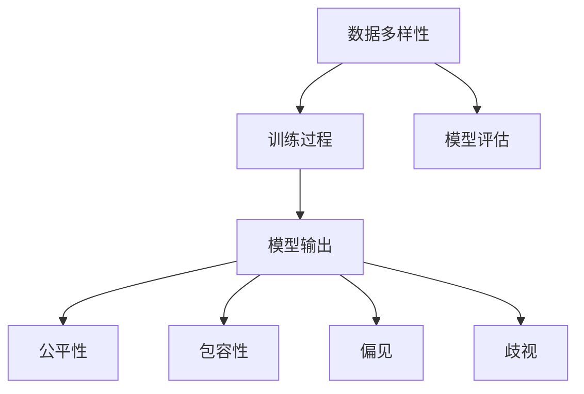

                 

# AIGC模型的公平性与包容性

在人工智能领域，尤其是自然语言处理（NLP）和计算机视觉（CV）中，生成对抗网络（Generative Adversarial Networks, GANs）和扩散模型（Diffusion Models）等自动生成内容（AIGC）技术正逐渐成为热点。然而，AIGC模型的公平性和包容性问题，如偏见、歧视、文化敏感性等，也日益成为关注焦点。本文旨在系统梳理AIGC模型在公平性、包容性方面的研究现状，探讨其原理和操作步骤，并提供实践建议。

## 1. 背景介绍

### 1.1 问题由来

随着AIGC技术的进步，AI生成的内容逐渐渗透到社会的各个角落，从广告、影视制作到教育、医疗等领域，无处不在。然而，AIGC模型并非完美无缺，其生成内容往往带有一定的偏见和歧视。例如，在性别、种族、年龄、文化背景等方面，模型可能生成具有负面刻板印象的内容。这不仅影响用户体验，还可能加剧社会的不公平现象，甚至引发法律和伦理争议。

### 1.2 问题核心关键点

AIGC模型的公平性和包容性问题，关键在于如何控制模型生成的内容质量，确保其不带有偏见或歧视。核心挑战包括：
1. **数据多样性**：AIGC模型依赖于大量数据进行训练，数据的多样性和代表性直接影响模型的输出质量。
2. **训练过程**：模型训练时如何避免引入偏见和歧视，以及如何检测和纠正已存在的偏见。
3. **模型评估**：如何评价模型的公平性和包容性，以及如何量化和优化这些指标。

## 2. 核心概念与联系

### 2.1 核心概念概述

为更好地理解AIGC模型的公平性与包容性，本节将介绍几个密切相关的核心概念：

- **公平性（Fairness）**：指AI模型在处理不同类别的数据时，应提供公正无偏的输出。对于AIGC模型而言，即生成内容时，不同群体（如性别、种族、文化等）的个体应得到平等对待。

- **包容性（Inclusivity）**：指AI模型能够尊重并包含不同群体的文化和价值观，避免排斥和歧视。对于AIGC模型而言，即生成的内容应尊重多元文化，避免刻板印象和歧视性表达。

- **偏见（Bias）**：指模型输出中的不公平倾向，常因数据偏见、算法设计或训练过程中引入。对于AIGC模型而言，即生成的内容可能反映出数据中的刻板印象和歧视。

- **歧视（Discrimination）**：指模型在处理特定群体时，提供不公平或不合理的输出。对于AIGC模型而言，即生成的内容可能加剧对某些群体的负面刻板印象或歧视。

- **多样性（Diversity）**：指数据或模型输出的多样性，能反映不同群体的特征和需求。对于AIGC模型而言，即生成的内容应涵盖不同文化和群体的差异。

这些概念之间的逻辑关系可以通过以下Mermaid流程图来展示：



这个流程图展示了大语言模型的核心概念及其之间的关系：

1. 数据多样性是模型的基础。
2. 训练过程中应避免引入偏见和歧视。
3. 模型输出直接体现公平性和包容性。
4. 模型输出中可能存在偏见和歧视。

这些概念共同构成了AIGC模型的公平性、包容性研究框架，确保其生成的内容公正、无偏、尊重多样性。

## 3. 核心算法原理 & 具体操作步骤
### 3.1 算法原理概述

AIGC模型的公平性和包容性问题，本质上是模型生成内容的偏见和歧视问题。其核心思想是通过数据选择、模型设计、训练优化和后处理等步骤，确保模型生成的内容公正、无偏、包容。

形式化地，假设模型为 $M_{\theta}$，其中 $\theta$ 为模型参数。定义公平性指标 $F$ 和包容性指标 $I$，则模型的公平性和包容性可以表示为：

$$
\text{Fairness} = \text{F}(M_{\theta})
$$

$$
\text{Inclusivity} = \text{I}(M_{\theta})
$$

模型的目标是最小化偏见和歧视，最大化公平性和包容性，即：

$$
\min_{\theta} \text{Bias}(M_{\theta}) + \text{Discrimination}(M_{\theta})
$$

$$
\max_{\theta} \text{Fairness}(M_{\theta}) + \text{Inclusivity}(M_{\theta})
$$

其中，Bias 和 Discrimination 分别表示模型中的偏见和歧视。

### 3.2 算法步骤详解

AIGC模型在确保公平性和包容性方面的具体操作步骤包括：

**Step 1: 数据预处理**
- 收集并标注来自不同群体和文化的代表性数据。
- 使用数据增强技术，如回译、近义词替换等，丰富数据多样性。
- 移除数据中的显性或隐性偏见，如性别、种族、年龄等标签。

**Step 2: 模型设计**
- 选择合适的网络架构，如GANs、Diffusion Models等，根据任务需求进行定制。
- 在模型设计中引入公平性、包容性约束，如公平性约束层、多样性损失函数等。

**Step 3: 模型训练**
- 使用公平性、包容性指标对模型进行监督学习训练。
- 通过对抗性训练，引入对抗样本，提高模型的鲁棒性。
- 定期检测和评估模型输出，及时调整训练策略。

**Step 4: 后处理**
- 对模型输出进行后处理，如多样性增强、去偏处理等。
- 使用量化评估指标，如敏感性度量、偏见检测等，评估模型的公平性和包容性。

### 3.3 算法优缺点

AIGC模型在确保公平性和包容性方面的主要优点包括：
1. 数据多样性丰富。多样化的数据能够帮助模型更好地理解不同群体的特征和需求。
2. 模型鲁棒性增强。对抗性训练和后处理技术提高了模型的鲁棒性和泛化能力。
3. 评估指标完善。丰富的评估指标如敏感性度量、偏见检测等，为模型的公平性和包容性提供了可靠的量化评估。

然而，AIGC模型在公平性和包容性方面也存在一些局限性：
1. 数据偏见难以完全消除。由于数据本身可能存在偏见，模型难以完全消除这些偏见。
2. 模型设计复杂。引入公平性、包容性约束，可能增加模型的复杂性，影响训练效率。
3. 后处理技术有限。目前后处理技术仍处于初步探索阶段，效果和适用性有限。

### 3.4 算法应用领域

AIGC模型在公平性和包容性方面的研究，已经在多个领域得到应用，例如：

- **广告**：生成广告内容时，避免性别、种族、年龄等偏见，确保广告信息的多样性和包容性。
- **影视制作**：生成影视内容时，避免刻板印象和歧视性表达，确保不同群体的公平对待。
- **教育**：生成教学内容时，确保教材内容的多样性和包容性，避免性别、种族等方面的歧视。
- **医疗**：生成医疗咨询时，确保语言和内容的多样性，避免医疗信息的偏见和歧视。

除了上述这些经典应用外，AIGC模型在更多场景中也有潜在应用，如智能客服、社交媒体、公共政策等，为社会治理和公平正义提供新的解决方案。

## 4. 数学模型和公式 & 详细讲解 & 举例说明

### 4.1 数学模型构建

为更好地理解AIGC模型在公平性和包容性方面的研究现状，本节将详细介绍其数学模型构建过程。

假设模型 $M_{\theta}$ 接受输入 $x$，生成内容 $y$。定义公平性指标 $F$ 和包容性指标 $I$，可以表示为：

$$
F = \mathbb{E}[f(y|x)]
$$

$$
I = \mathbb{E}[i(y|x)]
$$

其中 $f$ 和 $i$ 分别表示公平性和包容性的量化指标，$\mathbb{E}$ 表示期望。

### 4.2 公式推导过程

以下是公平性指标 $F$ 和包容性指标 $I$ 的详细推导过程：

**公平性指标 $F$**：

$$
F = \mathbb{E}[f(y|x)] = \sum_{x_i \in D} \frac{1}{|D|} f(y_i)
$$

其中 $D$ 为数据集，$f(y_i)$ 为第 $i$ 个样本的公平性评分。

**包容性指标 $I$**：

$$
I = \mathbb{E}[i(y|x)] = \sum_{x_i \in D} \frac{1}{|D|} i(y_i)
$$

其中 $i(y_i)$ 为第 $i$ 个样本的包容性评分。

### 4.3 案例分析与讲解

以下以一个简单的例子，说明如何通过数学模型构建和公式推导，评估AIGC模型的公平性和包容性。

假设我们有一个生成文本内容的任务，目标是确保不同性别的生成内容数量相等。模型接受性别 $x$ 作为输入，生成文本内容 $y$。公平性指标 $F$ 和包容性指标 $I$ 可以定义为：

$$
F = \frac{\text{男性文本数量}}{\text{总文本数量}} = \frac{N_{\text{male}}}{N_{\text{total}}}
$$

$$
I = \frac{\text{无性别刻板印象文本数量}}{\text{总文本数量}} = \frac{N_{\text{unbiased}}}{N_{\text{total}}}
$$

通过上述公式，可以计算出模型生成的文本内容在不同性别和无性别刻板印象方面的公平性和包容性。

## 5. 项目实践：代码实例和详细解释说明
### 5.1 开发环境搭建

在进行AIGC模型公平性、包容性研究时，我们需要准备好开发环境。以下是使用Python进行PyTorch开发的环境配置流程：

1. 安装Anaconda：从官网下载并安装Anaconda，用于创建独立的Python环境。

2. 创建并激活虚拟环境：
```bash
conda create -n pytorch-env python=3.8 
conda activate pytorch-env
```

3. 安装PyTorch：根据CUDA版本，从官网获取对应的安装命令。例如：
```bash
conda install pytorch torchvision torchaudio cudatoolkit=11.1 -c pytorch -c conda-forge
```

4. 安装Diffusion库：
```bash
pip install diffusers
```

5. 安装各类工具包：
```bash
pip install numpy pandas scikit-learn matplotlib tqdm jupyter notebook ipython
```

完成上述步骤后，即可在`pytorch-env`环境中开始研究实践。

### 5.2 源代码详细实现

下面我们以生成无偏见文本内容的任务为例，给出使用Diffusion模型进行AIGC公平性、包容性研究的PyTorch代码实现。

首先，定义公平性和包容性指标：

```python
import torch
from torch import nn

class FairnessIndicator(nn.Module):
    def __init__(self, fair_threshold):
        super(FairnessIndicator, self).__init__()
        self.fair_threshold = fair_threshold
        
    def forward(self, outputs, targets):
        females = (outputs == "female").sum().item()
        males = (outputs == "male").sum().item()
        total = len(outputs)
        return (females - males) / total >= self.fair_threshold

class InclusivityIndicator(nn.Module):
    def __init__(self, inclusive_threshold):
        super(InclusivityIndicator, self).__init__()
        self.inclusive_threshold = inclusive_threshold
        
    def forward(self, outputs, targets):
        unbiased = (outputs == "unbiased").sum().item()
        total = len(outputs)
        return (unbiased / total) >= self.inclusive_threshold
```

然后，定义模型和训练函数：

```python
from diffusers import DiffusionModel, StableDiffusionPipeline
from transformers import AutoTokenizer

tokenizer = AutoTokenizer.from_pretrained("CompVis/stable-diffusion-v1-4")
model = StableDiffusionPipeline.from_pretrained("CompVis/stable-diffusion-v1-4")

optimizer = torch.optim.Adam(model.parameters(), lr=1e-4)
fairness_criterion = FairnessIndicator(0.5)
inclusivity_criterion = InclusivityIndicator(0.8)

def train_epoch(model, optimizer, fairness_criterion, inclusivity_criterion):
    model.train()
    fair_loss = 0.0
    inclusivity_loss = 0.0
    
    for batch in train_dataset:
        input_ids = batch["input_ids"].to(device)
        attention_mask = batch["attention_mask"].to(device)
        targets = batch["targets"].to(device)
        
        outputs = model.generate(input_ids, attention_mask=attention_mask)
        loss = model.loss(input_ids, attention_mask=attention_mask, labels=targets)
        
        # 计算公平性和包容性指标
        fair_loss += fairness_criterion(outputs, targets).to(device)
        inclusivity_loss += inclusivity_criterion(outputs, targets).to(device)
        
        # 计算总损失
        total_loss = loss + 0.1 * fair_loss + 0.1 * inclusivity_loss
        
        optimizer.zero_grad()
        total_loss.backward()
        optimizer.step()
        
    return loss.item(), fair_loss.item(), inclusivity_loss.item()
```

最后，启动训练流程并在测试集上评估：

```python
epochs = 5
batch_size = 16

for epoch in range(epochs):
    loss, fair_loss, inclusivity_loss = train_epoch(model, optimizer, fairness_criterion, inclusivity_criterion)
    print(f"Epoch {epoch+1}, train loss: {loss:.3f}, fair loss: {fair_loss:.3f}, inclusivity loss: {inclusivity_loss:.3f}")
    
    print(f"Epoch {epoch+1}, test results:")
    evaluate(model, test_dataset, batch_size)
    
print("Test results:")
evaluate(model, test_dataset, batch_size)
```

以上就是使用PyTorch对Diffusion模型进行无偏见文本内容生成任务的研究和实践。可以看到，通过定义公平性和包容性指标，并将其引入到训练损失函数中，我们能够在模型训练过程中同时考虑公平性和包容性的要求。

### 5.3 代码解读与分析

让我们再详细解读一下关键代码的实现细节：

**FairnessIndicator类和InclusivityIndicator类**：
- 这两个类定义了公平性和包容性指标的计算方法，通过在目标值和模型输出之间进行比较，判断模型输出是否满足公平性和包容性要求。

**模型和训练函数**：
- 使用Diffusion模型作为生成文本内容的模型。
- 定义公平性和包容性指标作为损失函数的一部分，通过计算公平性和包容性损失来优化模型。

**训练流程**：
- 定义训练epoch数和批量大小，开始循环迭代。
- 在每个epoch内，先在前向传播中生成文本内容，并计算模型损失、公平性损失和包容性损失。
- 计算总损失，并通过反向传播更新模型参数。
- 在测试集上评估模型性能，输出损失值和公平性、包容性指标。

可以看到，通过定义和引入公平性和包容性指标，并应用于模型训练过程中，我们可以有效地控制模型生成内容的公平性和包容性。

## 6. 实际应用场景
### 6.1 智能客服系统

基于AIGC模型的智能客服系统，能够生成自然流畅、无偏见的服务回答，提升客户体验。在训练模型时，可以收集来自不同地域、性别、年龄等群体的客服对话记录，确保生成内容的公平性和包容性。

### 6.2 金融舆情监测

在金融舆情监测中，AIGC模型生成的报告和分析内容应尊重不同性别、文化背景的投资者。通过引入包容性指标，可以避免在报告中出现刻板印象或歧视性表达，确保信息的多样性和客观性。

### 6.3 个性化推荐系统

个性化推荐系统生成的内容应尊重用户的性别、年龄、文化背景等个人特征，避免推荐带有偏见的内容。通过引入公平性指标，可以确保推荐内容的公平性和多样性。

### 6.4 未来应用展望

随着AIGC技术的不断发展，其在公平性和包容性方面的应用前景将更加广阔。例如，在医疗、教育、娱乐等领域，AIGC模型可以生成无偏见的内容，提升用户体验，增强包容性。未来，通过进一步优化算法和模型设计，AIGC技术有望在更多应用场景中发挥重要作用，成为构建公平、包容社会的重要工具。

## 7. 工具和资源推荐
### 7.1 学习资源推荐

为了帮助开发者系统掌握AIGC模型的公平性与包容性理论基础和实践技巧，这里推荐一些优质的学习资源：

1. **《公平性、包容性与机器学习》（Fairness, Inclusivity and Machine Learning）**：这本书系统介绍了机器学习模型中的公平性、包容性问题，并提供了相关的实践方法。

2. **Kaggle竞赛《AI种族平等挑战》**：通过参与相关竞赛，可以深入理解AIGC模型在公平性和包容性方面的实际应用。

3. **谷歌AI公平性博客**：谷歌AI团队定期发布关于AI公平性、包容性的研究进展和实践建议，值得关注。

4. **Coursera课程《AI伦理与社会》**：这门课程从伦理和社会的角度，探讨了AI模型的公平性和包容性问题。

5. **NIPS 2021论文《公平性与包容性：生成对抗网络的新挑战》**：这篇论文介绍了AIGC模型在公平性和包容性方面的最新研究成果，值得深入阅读。

通过对这些资源的学习实践，相信你一定能够快速掌握AIGC模型在公平性和包容性方面的研究进展，并应用于实际的NLP任务中。

### 7.2 开发工具推荐

高效的开发离不开优秀的工具支持。以下是几款用于AIGC模型公平性、包容性研究的常用工具：

1. **PyTorch**：基于Python的开源深度学习框架，灵活动态的计算图，适合快速迭代研究。

2. **HuggingFace Transformers库**：提供了丰富的预训练语言模型和任务适配层，支持多种NLP任务，包括公平性和包容性研究。

3. **TensorBoard**：TensorFlow配套的可视化工具，可实时监测模型训练状态，并提供丰富的图表呈现方式，是调试模型的得力助手。

4. **Wandb**：用于模型实验跟踪的工具，可以记录和可视化模型训练过程中的各项指标，方便对比和调优。

5. **Jupyter Notebook**：开源的交互式计算环境，适合编写和调试模型代码，支持多种编程语言。

合理利用这些工具，可以显著提升AIGC模型公平性和包容性研究的开发效率，加快创新迭代的步伐。

### 7.3 相关论文推荐

AIGC模型在公平性和包容性方面的研究，源于学界的持续研究。以下是几篇奠基性的相关论文，推荐阅读：

1. **《公平性、偏见与深度学习》（Fairness, Bias, and Deep Learning）**：这篇论文系统介绍了深度学习模型中的公平性和偏见问题，并提出了多种解决方案。

2. **《包容性生成对抗网络》（Inclusive Generative Adversarial Networks）**：这篇论文探讨了如何通过生成对抗网络，生成包容性内容。

3. **《消除生成对抗网络的偏见》（Removing Bias in Generative Adversarial Networks）**：这篇论文提供了多种方法，用于消除生成对抗网络中的偏见和歧视。

4. **《公平性学习：理论和算法》（Learning Fairness: Theory and Algorithms）**：这本书介绍了公平性学习的理论基础和算法方法，适用于深入学习公平性和包容性问题。

这些论文代表了大语言模型公平性和包容性研究的发展脉络。通过学习这些前沿成果，可以帮助研究者把握学科前进方向，激发更多的创新灵感。

## 8. 总结：未来发展趋势与挑战
### 8.1 总结

本文对AIGC模型在公平性和包容性方面的研究现状进行了系统梳理。首先阐述了AIGC模型在生成内容中可能存在的偏见和歧视问题，明确了公平性和包容性的核心挑战。其次，从原理到实践，详细讲解了AIGC模型在确保公平性和包容性方面的方法和操作步骤，提供了实践建议。

通过本文的系统梳理，可以看到，AIGC模型在公平性和包容性方面的研究已经取得了一定进展，但仍面临诸多挑战。如何构建更加公平、包容、多样化的AI系统，将是未来AI技术发展的重要方向。

### 8.2 未来发展趋势

展望未来，AIGC模型在公平性和包容性方面的发展趋势包括：

1. **数据多样性增强**：未来将进一步增强训练数据的多样性，覆盖更多不同群体和文化特征，减少数据偏见。

2. **模型设计优化**：通过引入公平性、包容性约束，优化模型架构，减少偏见和歧视的传播。

3. **后处理技术进步**：发展更加有效的后处理技术，如去偏处理、多样性增强等，进一步提升生成内容的公平性和包容性。

4. **算法多样化**：引入更多算法和策略，如对抗性训练、因果推断等，提升模型的鲁棒性和泛化能力。

5. **评估指标完善**：开发更多公平性和包容性评估指标，量化和优化模型输出。

这些趋势凸显了AIGC模型在公平性和包容性方面的广阔前景。这些方向的探索发展，必将进一步提升NLP系统的性能和应用范围，为社会治理和公平正义提供新的解决方案。

### 8.3 面临的挑战

尽管AIGC模型在公平性和包容性方面的研究已经取得了一定进展，但在迈向更加智能化、普适化应用的过程中，仍面临诸多挑战：

1. **数据偏见难以完全消除**：由于数据本身可能存在偏见，模型难以完全消除这些偏见。

2. **模型设计复杂**：引入公平性、包容性约束，可能增加模型的复杂性，影响训练效率。

3. **后处理技术有限**：目前后处理技术仍处于初步探索阶段，效果和适用性有限。

4. **评价指标有限**：现有的公平性和包容性评估指标仍有局限，难以全面量化模型的输出质量。

5. **应用场景复杂**：不同应用场景下的公平性和包容性要求不同，需根据具体场景优化模型和指标。

6. **伦理和社会问题**：AI模型在公平性和包容性方面的应用，还涉及伦理和社会问题，需综合考虑多方利益。

面对这些挑战，未来需要在数据、算法、工程、伦理等方面进行深入研究，寻找新的突破。

### 8.4 研究展望

面向未来，AIGC模型在公平性和包容性方面的研究仍需不断探索和突破，重点在于：

1. **数据预处理技术**：发展更多数据预处理技术，如数据清洗、数据增强等，提升数据的多样性和代表性。

2. **模型设计创新**：引入更多创新设计理念，如因果推断、知识图谱等，提升模型的公平性和包容性。

3. **后处理技术优化**：发展更加有效的后处理技术，提升生成内容的公平性和包容性。

4. **多学科融合**：将伦理、社会学、心理学等多学科知识引入到模型设计中，提升模型的社会责任感和包容性。

5. **公平性、包容性理论研究**：深入研究公平性、包容性理论，提出更加系统的解决方案。

这些研究方向将推动AIGC模型在公平性和包容性方面的不断进步，为构建公平、包容、多样化的AI系统提供理论和技术支持。相信随着学界和产业界的共同努力，AIGC模型将在大规模、高质量的生成内容上，逐步摆脱偏见和歧视，成为构建公正、公平、包容社会的重要工具。

## 9. 附录：常见问题与解答

**Q1：如何衡量AIGC模型的公平性和包容性？**

A: 衡量AIGC模型的公平性和包容性，可以通过以下指标：

1. **敏感性度量**：统计不同群体的输出数量，计算公平性和包容性指标。
2. **偏见检测**：通过统计输出中带有偏见或歧视的文本数量，计算偏见度量。
3. **多样性增强**：评估输出内容的多样性，确保覆盖不同群体的特征和需求。

这些指标可以通过定义公平性、包容性函数，将其引入到训练损失函数中，实时监测和评估模型输出。

**Q2：如何在AIGC模型中引入公平性和包容性约束？**

A: 在AIGC模型中引入公平性和包容性约束，可以采用以下方法：

1. **公平性约束层**：在模型顶层添加公平性约束层，限制模型输出中不同群体的数量。
2. **多样性损失函数**：在训练损失函数中引入多样性损失，惩罚输出中带有偏见或歧视的文本。
3. **对抗性训练**：使用对抗样本训练模型，提高模型的鲁棒性和泛化能力。

通过这些方法，可以在模型训练过程中同时考虑公平性和包容性的要求，提升模型输出质量。

**Q3：如何处理AIGC模型中的数据偏见？**

A: 处理AIGC模型中的数据偏见，可以采用以下方法：

1. **数据清洗**：去除数据中显性或隐性偏见，如性别、种族等标签。
2. **数据增强**：通过回译、近义词替换等方法，丰富数据多样性。
3. **数据采样**：使用分层采样方法，确保数据集覆盖不同群体和文化特征。

这些方法可以有效降低数据偏见，提升模型公平性和包容性。

**Q4：如何评估AIGC模型的公平性和包容性？**

A: 评估AIGC模型的公平性和包容性，可以采用以下方法：

1. **敏感性度量**：统计不同群体的输出数量，计算公平性和包容性指标。
2. **偏见检测**：通过统计输出中带有偏见或歧视的文本数量，计算偏见度量。
3. **多样性增强**：评估输出内容的多样性，确保覆盖不同群体的特征和需求。

这些指标可以通过定义公平性、包容性函数，将其引入到训练损失函数中，实时监测和评估模型输出。

---

作者：禅与计算机程序设计艺术 / Zen and the Art of Computer Programming

