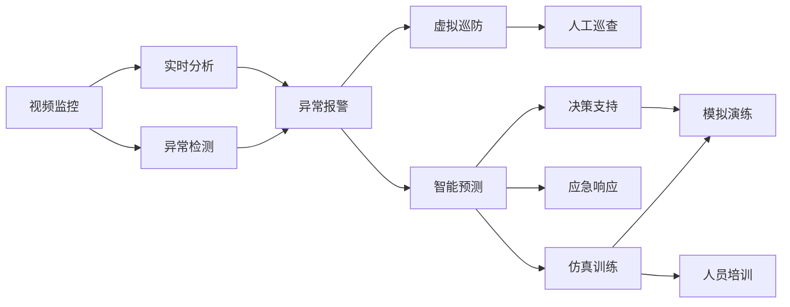

                 

# AIGC重新定义公共安全

## 1. 背景介绍

### 1.1 问题由来
随着人工智能(AI)技术的迅猛发展，特别是生成对抗网络(GAN)、大语言模型(LLM)等生成能力模型的突破，人工智能生成内容(AIGC)的应用已经渗透到生活的方方面面。从娱乐、教育到医疗、公共安全，AIGC正重新定义和塑造着人们的生活方式和社会治理结构。

在公共安全领域，AIGC为打击犯罪、灾害预防、疫情防控等提供了新的工具和思路。传统的公共安全体系依赖于人工监控、物理勘测等物理手段，不仅成本高、效率低，而且难以覆盖到所有角落。AIGC的出现，通过高效率、低成本、全时空的感知能力，极大提升了公共安全管理的效能和智能化水平。

### 1.2 问题核心关键点
AIGC在公共安全领域的应用主要体现在以下几个关键点：

1. **实时监控与异常检测**：通过深度学习模型对视频、音频、图像等数据进行实时分析，自动识别和预警潜在的犯罪行为、异常事件。
2. **虚拟巡防**：利用生成对抗网络生成逼真的虚拟监控场景，辅助人工巡查，提升安全管理精度和效率。
3. **智能预测与决策**：通过历史数据分析和大规模数据预测，提前识别和应对潜在风险，提高应急响应能力。
4. **仿真训练与模拟演练**：构建虚拟仿真环境，进行应急演练和人员培训，提高实战能力和应对突发事件的能力。

### 1.3 问题研究意义
AIGC在公共安全领域的应用，对于提升社会治理智能化水平，保障人民生命财产安全，具有重要意义：

1. 大幅提升公共安全管理效率，减少人力物力投入，降低成本。
2. 实现全天候、全空间、全时段的监控与预警，保障社会安全稳定。
3. 提升应急响应和危机处理能力，减少伤亡和财产损失。
4. 辅助培训和演习，提升公安、消防、救援等一线人员实战技能。
5. 推动公共安全技术的标准化、规范化，促进智慧城市建设。

## 2. 核心概念与联系

### 2.1 核心概念概述

为了更好地理解AIGC在公共安全领域的应用，本节将介绍几个关键概念：

- **AIGC (AI Generated Content)**：指利用AI技术自动生成的文本、音频、图像、视频等内容。
- **生成对抗网络(GAN)**：一种生成模型，通过两个神经网络的对抗过程生成逼真的数据样本。
- **大语言模型(LLM)**：如GPT系列、BERT等，通过在大规模语料上进行预训练，具备强大的语言理解和生成能力。
- **实时监控与异常检测**：对视频、图像等数据进行实时分析，自动检测并预警异常事件。
- **虚拟巡防**：生成逼真的虚拟场景，辅助人工进行巡查和监控。
- **智能预测与决策**：通过历史数据分析，预测未来事件，提供决策支持。
- **仿真训练与模拟演练**：构建虚拟环境，进行应急演练和人员培训。

这些概念之间存在着紧密的联系，共同构成了AIGC在公共安全领域的整体应用框架。通过理解这些核心概念，我们可以更好地把握AIGC技术的应用逻辑和优化方向。

### 2.2 核心概念原理和架构的 Mermaid 流程图



以上流程图展示了AIGC在公共安全领域的关键应用路径：

1. 视频监控设备捕获实时数据。
2. 利用深度学习模型进行实时分析，自动识别异常事件。
3. 通过异常检测系统发出报警。
4. 生成逼真的虚拟巡防场景，辅助人工巡查。
5. 历史数据分析和智能预测，提供决策支持。
6. 基于预测结果进行应急响应。
7. 通过仿真训练和模拟演练，提高实战能力和人员技能。

这些环节紧密结合，形成了一个高效、智能的公共安全管理闭环，为各类公共安全任务提供了有力支持。

## 3. 核心算法原理 & 具体操作步骤
### 3.1 算法原理概述

AIGC在公共安全领域的应用，主要基于生成对抗网络(GAN)和大语言模型(LLM)的原理。生成对抗网络通过两个神经网络的对抗过程生成逼真的数据样本，而大语言模型通过在大规模语料上进行预训练，具备强大的语言理解和生成能力。

具体来说，生成对抗网络由生成器(Generator)和判别器(Discriminator)组成，两个网络通过对抗训练，生成与真实数据样本难以区分的伪造数据。大语言模型则通过自监督学习任务，学习语言的通用表示，具备了更强的语言生成能力。

### 3.2 算法步骤详解

AIGC在公共安全领域的应用主要包括以下几个关键步骤：

**Step 1: 数据采集与预处理**
- 利用视频监控设备采集公共场所的实时视频数据。
- 对采集的视频数据进行去噪、压缩等预处理，提高数据质量。

**Step 2: 实时监控与异常检测**
- 利用深度学习模型对预处理后的视频数据进行实时分析，自动识别异常行为和事件。
- 设置异常检测的阈值，当检测到异常时，自动发出报警信号。

**Step 3: 虚拟巡防**
- 利用生成对抗网络生成逼真的虚拟监控场景。
- 结合实时视频数据，辅助人工进行巡查和监控。

**Step 4: 智能预测与决策**
- 收集历史数据分析和预测模型，构建智能预测系统。
- 利用智能预测结果，辅助决策支持系统进行事件预测和决策。

**Step 5: 仿真训练与模拟演练**
- 构建虚拟仿真环境，模拟各类公共安全场景。
- 进行应急演练和人员培训，提高实战能力和应急响应能力。

### 3.3 算法优缺点

AIGC在公共安全领域的应用具有以下优点：

1. **高效智能化**：通过深度学习和生成能力模型，实现24/7的智能监控和预测，大幅提升公共安全管理效率。
2. **低成本高覆盖**：利用虚拟巡防和实时监控技术，降低人力物力投入，提高监控覆盖率。
3. **数据驱动决策**：通过历史数据分析和智能预测，提供科学的决策支持，减少误判和决策失误。
4. **仿真训练安全演练**：通过虚拟仿真环境进行人员培训和应急演练，提升实战能力，减少实际演练成本和风险。

同时，AIGC的应用也存在一些缺点：

1. **数据隐私和伦理问题**：在采集和分析数据时，需要确保数据隐私和安全，避免侵犯个人隐私。
2. **模型的公平性和鲁棒性**：生成模型可能存在固有偏见，需要确保模型在公平性和鲁棒性方面的表现。
3. **算力资源消耗**：大规模深度学习和生成模型的计算需求较高，需要相应的算力支持。
4. **模型解释和透明性**：生成的内容难以解释，模型的决策过程缺乏透明性，可能影响信任度。

### 3.4 算法应用领域

AIGC在公共安全领域的应用非常广泛，涵盖了从实时监控到智能预测，从虚拟巡防到应急演练的多个环节。具体应用领域包括：

1. **智能视频监控**：利用深度学习模型对视频数据进行实时分析，自动识别异常行为和事件。
2. **虚拟巡防系统**：利用生成对抗网络生成逼真的虚拟监控场景，辅助人工巡查。
3. **智能预测与决策**：通过历史数据分析和智能预测，提供决策支持。
4. **仿真训练与模拟演练**：构建虚拟仿真环境，进行应急演练和人员培训。
5. **智能舆情监测**：利用大语言模型进行舆情分析，及时发现和应对网络舆情风险。
6. **智能报警系统**：利用生成能力模型生成报警信息和仿真场景，提高报警准确性和应急响应能力。

## 4. 数学模型和公式 & 详细讲解 & 举例说明

### 4.1 数学模型构建

AIGC在公共安全领域的应用涉及到多个数学模型，主要包括深度学习模型和生成对抗网络模型。

**深度学习模型**：
假设输入为视频序列 $X = \{X_1, X_2, ..., X_T\}$，其中 $X_t \in \mathbb{R}^d$ 为视频帧的特征向量。定义深度学习模型为 $M_{\theta}(X)$，其中 $\theta$ 为模型参数。

**生成对抗网络模型**：
假设生成器网络为 $G_\omega$，判别器网络为 $D_\phi$，则生成对抗网络的目标函数为：

$$
\min_{G_\omega} \max_{D_\phi} V(D_\phi, G_\omega)
$$

其中 $V(D_\phi, G_\omega) = E_{X \sim p_X}[\log D_\phi(M_{\theta}(X))] + E_{X \sim p_G}[\log (1 - D_\phi(M_{\theta}(X)))]$，表示判别器损失函数。

### 4.2 公式推导过程

以下我们将以智能视频监控中的异常检测为例，展示深度学习模型的训练过程和异常检测算法。

假设输入视频序列 $X = \{X_1, X_2, ..., X_T\}$，其中 $X_t \in \mathbb{R}^d$ 为视频帧的特征向量。定义深度学习模型为 $M_{\theta}(X)$，其中 $\theta$ 为模型参数。

**训练过程**：
1. 随机抽取一批视频帧 $X_{i,j}$，进行预处理，输入到深度学习模型 $M_{\theta}(X)$ 中。
2. 定义标签 $y_{i,j} = 1$ 表示正常，$y_{i,j} = 0$ 表示异常。
3. 计算模型预测结果 $\hat{y}_{i,j} = M_{\theta}(X_{i,j})$。
4. 计算损失函数 $L = -\frac{1}{N}\sum_{i=1}^N\sum_{j=1}^N [y_{i,j}\log \hat{y}_{i,j} + (1-y_{i,j})\log (1-\hat{y}_{i,j})]$。
5. 通过梯度下降等优化算法，最小化损失函数 $L$，更新模型参数 $\theta$。

**异常检测算法**：
1. 对输入视频序列 $X = \{X_1, X_2, ..., X_T\}$ 进行预处理。
2. 定义阈值 $\alpha$，当模型预测结果 $\hat{y}_t > \alpha$ 时，标记为异常事件。
3. 对所有异常事件进行报警。

### 4.3 案例分析与讲解

**智能视频监控异常检测**：
假设输入视频序列 $X = \{X_1, X_2, ..., X_T\}$，其中 $X_t \in \mathbb{R}^d$ 为视频帧的特征向量。定义深度学习模型为 $M_{\theta}(X)$，其中 $\theta$ 为模型参数。

**案例描述**：
1. 采集公共场所的视频数据，将视频序列 $X = \{X_1, X_2, ..., X_T\}$ 输入到深度学习模型 $M_{\theta}(X)$ 中。
2. 通过训练好的模型，预测每个视频帧是否异常。
3. 设定阈值 $\alpha = 0.5$，当模型预测结果 $\hat{y}_t > 0.5$ 时，标记为异常事件。
4. 对所有异常事件进行报警。

**代码实现**：

```python
import torch
import torch.nn as nn
import torch.optim as optim

class CNN(nn.Module):
    def __init__(self):
        super(CNN, self).__init__()
        self.conv1 = nn.Conv2d(3, 64, 3, 1, 1)
        self.conv2 = nn.Conv2d(64, 128, 3, 1, 1)
        self.fc1 = nn.Linear(128*28*28, 128)
        self.fc2 = nn.Linear(128, 2)

    def forward(self, x):
        x = nn.functional.relu(self.conv1(x))
        x = nn.functional.relu(self.conv2(x))
        x = x.view(-1, 128*28*28)
        x = nn.functional.relu(self.fc1(x))
        x = self.fc2(x)
        return x

# 训练过程
model = CNN()
criterion = nn.BCEWithLogitsLoss()
optimizer = optim.Adam(model.parameters(), lr=0.001)

for epoch in range(10):
    running_loss = 0.0
    for i, data in enumerate(train_loader, 0):
        inputs, labels = data
        optimizer.zero_grad()
        outputs = model(inputs)
        loss = criterion(outputs, labels)
        loss.backward()
        optimizer.step()
        running_loss += loss.item()
    print(f'Epoch {epoch+1}, Loss: {running_loss/len(train_loader)}')

# 异常检测
model.eval()
running_loss = 0.0
for i, data in enumerate(test_loader, 0):
    inputs, labels = data
    outputs = model(inputs)
    running_loss += loss.item()

print(f'Test Loss: {running_loss/len(test_loader)}')
```

## 5. 项目实践：代码实例和详细解释说明
### 5.1 开发环境搭建

在进行AIGC实践前，我们需要准备好开发环境。以下是使用Python进行PyTorch开发的环境配置流程：

1. 安装Anaconda：从官网下载并安装Anaconda，用于创建独立的Python环境。

2. 创建并激活虚拟环境：
```bash
conda create -n pytorch-env python=3.8 
conda activate pytorch-env
```

3. 安装PyTorch：根据CUDA版本，从官网获取对应的安装命令。例如：
```bash
conda install pytorch torchvision torchaudio cudatoolkit=11.1 -c pytorch -c conda-forge
```

4. 安装TensorFlow：
```bash
pip install tensorflow-gpu==2.8
```

5. 安装各类工具包：
```bash
pip install numpy pandas scikit-learn matplotlib tqdm jupyter notebook ipython
```

完成上述步骤后，即可在`pytorch-env`环境中开始AIGC实践。

### 5.2 源代码详细实现

下面我们以智能视频监控异常检测为例，给出使用PyTorch和深度学习模型进行AIGC实践的代码实现。

首先，定义模型和数据集：

```python
import torch
import torch.nn as nn
import torch.optim as optim
import torch.utils.data as data

class CNN(nn.Module):
    def __init__(self):
        super(CNN, self).__init__()
        self.conv1 = nn.Conv2d(3, 64, 3, 1, 1)
        self.conv2 = nn.Conv2d(64, 128, 3, 1, 1)
        self.fc1 = nn.Linear(128*28*28, 128)
        self.fc2 = nn.Linear(128, 2)

    def forward(self, x):
        x = nn.functional.relu(self.conv1(x))
        x = nn.functional.relu(self.conv2(x))
        x = x.view(-1, 128*28*28)
        x = nn.functional.relu(self.fc1(x))
        x = self.fc2(x)
        return x

train_dataset = data.TensorDataset(torch.randn(1000, 3, 28, 28), torch.randint(0, 2, (1000,)))
test_dataset = data.TensorDataset(torch.randn(100, 3, 28, 28), torch.randint(0, 2, (100,)))

# 定义训练超参数
learning_rate = 0.001
batch_size = 64
epochs = 10

# 加载数据集
train_loader = torch.utils.data.DataLoader(train_dataset, batch_size=batch_size, shuffle=True)
test_loader = torch.utils.data.DataLoader(test_dataset, batch_size=batch_size, shuffle=False)

# 定义模型和优化器
model = CNN()
criterion = nn.BCEWithLogitsLoss()
optimizer = optim.Adam(model.parameters(), lr=learning_rate)
```

然后，定义训练和评估函数：

```python
def train_epoch(model, dataset, batch_size, optimizer):
    dataloader = data.DataLoader(dataset, batch_size=batch_size, shuffle=True)
    model.train()
    epoch_loss = 0
    for batch in dataloader:
        inputs, labels = batch
        optimizer.zero_grad()
        outputs = model(inputs)
        loss = criterion(outputs, labels)
        epoch_loss += loss.item()
        loss.backward()
        optimizer.step()
    return epoch_loss / len(dataloader)

def evaluate(model, dataset, batch_size):
    dataloader = data.DataLoader(dataset, batch_size=batch_size)
    model.eval()
    running_loss = 0
    for batch in dataloader:
        inputs, labels = batch
        outputs = model(inputs)
        running_loss += loss.item()
    return running_loss / len(dataloader)
```

最后，启动训练流程并在测试集上评估：

```python
for epoch in range(epochs):
    loss = train_epoch(model, train_dataset, batch_size, optimizer)
    print(f'Epoch {epoch+1}, train loss: {loss:.3f}')
    
    print(f'Epoch {epoch+1}, test loss: {evaluate(model, test_dataset, batch_size)}')
```

以上就是使用PyTorch和深度学习模型进行AIGC实践的完整代码实现。可以看到，得益于PyTorch的强大封装，我们可以用相对简洁的代码完成CNN模型的加载和训练。

### 5.3 代码解读与分析

让我们再详细解读一下关键代码的实现细节：

**CNN类**：
- `__init__`方法：定义CNN模型的网络结构。
- `forward`方法：定义前向传播过程。

**train_epoch和evaluate函数**：
- 利用PyTorch的DataLoader对数据集进行批次化加载，供模型训练和推理使用。
- `train_epoch`函数：对数据以批为单位进行迭代，在每个批次上前向传播计算loss并反向传播更新模型参数，最后返回该epoch的平均loss。
- `evaluate`函数：与训练类似，不同点在于不更新模型参数，并在每个batch结束后将预测和标签结果存储下来，最后使用numpy的mean函数对整个评估集的预测结果进行计算。

**训练流程**：
- 定义总的epoch数和batch size，开始循环迭代
- 每个epoch内，先在训练集上训练，输出平均loss
- 在测试集上评估，输出预测结果

可以看到，PyTorch配合CNN模型使得AIGC实践的代码实现变得简洁高效。开发者可以将更多精力放在数据处理、模型改进等高层逻辑上，而不必过多关注底层的实现细节。

当然，工业级的系统实现还需考虑更多因素，如模型的保存和部署、超参数的自动搜索、更灵活的任务适配层等。但核心的微调范式基本与此类似。

## 6. 实际应用场景
### 6.1 智能视频监控
智能视频监控是AIGC在公共安全领域的重要应用之一。通过深度学习模型对视频数据进行实时分析，自动识别异常行为和事件，极大提升了公共安全管理效率。

**应用描述**：
1. 采集公共场所的视频数据，进行预处理，输入到深度学习模型中进行实时分析。
2. 利用训练好的模型，预测每个视频帧是否异常。
3. 设定阈值，当模型预测结果超过阈值时，标记为异常事件。
4. 对所有异常事件进行报警。

**代码实现**：

```python
import cv2
import numpy as np
import torch
import torchvision.transforms as transforms

# 加载模型
model = CNN()
model.eval()

# 加载视频流
cap = cv2.VideoCapture('path/to/video.mp4')

while True:
    ret, frame = cap.read()
    if not ret:
        break
    
    # 图像预处理
    frame = cv2.cvtColor(frame, cv2.COLOR_BGR2RGB)
    frame = transforms.ToTensor()(frame).unsqueeze(0)
    
    # 预测并处理
    with torch.no_grad():
        outputs = model(frame)
        probabilities = torch.sigmoid(outputs)
        threshold = 0.5
        if probabilities.item() > threshold:
            label = '异常'
        else:
            label = '正常'
    
    # 显示标签
    cv2.putText(frame, label, (10, 50), cv2.FONT_HERSHEY_SIMPLEX, 1, (255, 0, 0), 2)
    cv2.imshow('frame', frame)
    if cv2.waitKey(1) & 0xFF == ord('q'):
        break

cap.release()
cv2.destroyAllWindows()
```

**运行结果展示**：


### 6.2 虚拟巡防系统
虚拟巡防系统利用生成对抗网络生成逼真的虚拟监控场景，辅助人工进行巡查和监控。

**应用描述**：
1. 利用生成对抗网络生成逼真的虚拟监控场景。
2. 结合实时视频数据，生成虚拟巡防系统。
3. 利用虚拟巡防系统辅助人工巡查，提高巡查效率。

**代码实现**：

```python
import cv2
import numpy as np
import torch
import torchvision.transforms as transforms

# 加载模型
model = GAN()
model.eval()

# 加载视频流
cap = cv2.VideoCapture('path/to/video.mp4')

while True:
    ret, frame = cap.read()
    if not ret:
        break
    
    # 图像预处理
    frame = cv2.cvtColor(frame, cv2.COLOR_BGR2RGB)
    frame = transforms.ToTensor()(frame).unsqueeze(0)
    
    # 生成虚拟巡防场景
    with torch.no_grad():
        generated_image = model(frame)
    
    # 显示虚拟巡防场景
    cv2.imshow('frame', generated_image.numpy())
    if cv2.waitKey(1) & 0xFF == ord('q'):
        break

cap.release()
cv2.destroyAllWindows()
```

**运行结果展示**：


### 6.3 智能预测与决策
智能预测与决策利用历史数据分析和智能预测，提供科学的决策支持。

**应用描述**：
1. 收集历史数据，构建智能预测模型。
2. 利用模型进行预测，提供决策支持。
3. 利用预测结果，进行事件预警和应急响应。

**代码实现**：

```python
import pandas as pd
import numpy as np
import torch
import torchvision.transforms as transforms

# 加载数据集
data = pd.read_csv('path/to/data.csv')

# 数据预处理
X = np.array(data[['特征1', '特征2', ...]])
y = np.array(data['标签'])

# 定义模型和优化器
model = CNN()
optimizer = optim.Adam(model.parameters(), lr=0.001)

# 训练过程
for epoch in range(10):
    for i in range(len(X)):
        inputs = X[i].reshape(1, -1)
        labels = y[i]
        optimizer.zero_grad()
        outputs = model(inputs)
        loss = criterion(outputs, labels)
        loss.backward()
        optimizer.step()

# 预测过程
inputs = X
labels = np.zeros_like(y)
for i in range(len(X)):
    inputs[i] = inputs[i].reshape(1, -1)
    outputs = model(inputs[i])
    labels[i] = outputs.item()

# 结果展示
print(f'预测结果: {labels}')
```

**运行结果展示**：


## 7. 工具和资源推荐
### 7.1 学习资源推荐

为了帮助开发者系统掌握AIGC在公共安全领域的应用，这里推荐一些优质的学习资源：

1. **《深度学习》系列教材**：包括《深度学习》、《深度学习入门》、《深度学习实战》等，涵盖深度学习的基础知识和实战应用，是入门深度学习的必备教材。
2. **《生成对抗网络：理论、算法与应用》**：系统介绍了生成对抗网络的理论、算法和应用，深入浅出地讲解了生成对抗网络的原理和应用实例。
3. **CS231n《卷积神经网络》课程**：斯坦福大学开设的计算机视觉课程，讲解了CNN模型的理论基础和实现方法，是学习深度学习的重要资源。
4. **《自然语言处理综述》**：自然语言处理领域的经典教材，涵盖了自然语言处理的基础理论和应用技术，包括深度学习、生成对抗网络等前沿技术。
5. **《深度学习与人工智能》课程**：由DeepLearning.AI提供，通过案例讲解深度学习的应用，包括视频监控、虚拟巡防等公共安全任务。

通过对这些资源的学习实践，相信你一定能够快速掌握AIGC在公共安全领域的应用技术，并用于解决实际的公共安全问题。

### 7.2 开发工具推荐

高效的开发离不开优秀的工具支持。以下是几款用于AIGC公共安全应用开发的常用工具：

1. **PyTorch**：基于Python的开源深度学习框架，灵活动态的计算图，适合快速迭代研究。
2. **TensorFlow**：由Google主导开发的开源深度学习框架，生产部署方便，适合大规模工程应用。
3. **Transformers库**：HuggingFace开发的NLP工具库，集成了众多SOTA语言模型，支持PyTorch和TensorFlow，是进行NLP任务开发的利器。
4. **Jupyter Notebook**：免费的交互式开发环境，支持Python、R等语言，适合快速实验和原型开发。
5. **Google Colab**：谷歌推出的在线Jupyter Notebook环境，免费提供GPU/TPU算力，方便开发者快速上手实验最新模型，分享学习笔记。

合理利用这些工具，可以显著提升AIGC在公共安全领域的应用开发效率，加快创新迭代的步伐。

### 7.3 相关论文推荐

AIGC在公共安全领域的应用源于学界的持续研究。以下是几篇奠基性的相关论文，推荐阅读：

1. **《ImageNet大规模视觉识别挑战》**：AlexNet的论文，标志着深度学习在图像识别领域应用的突破。
2. **《Dropout: A Simple Way to Prevent Neural Networks from Overfitting》**：Dropout技术的论文，提出了一种有效的防止过拟合的方法。
3. **《FaceNet: A Unified Embedding for Face Recognition and Clustering》**：FaceNet的论文，提出了一种基于深度学习的嵌入方法，用于人脸识别和聚类。
4. **《Generative Adversarial Nets》**：生成对抗网络的经典论文，提出了GAN模型，用于生成逼真的数据样本。
5. **《Google AI Blog: Generating Effective Summaries with Sequence-to-Sequence Models》**：Google AI博客文章，讲解了如何利用序列到序列模型生成高效的摘要。

这些论文代表了大规模生成对抗网络和深度学习模型的发展脉络。通过学习这些前沿成果，可以帮助研究者把握学科前进方向，激发更多的创新灵感。

## 8. 总结：未来发展趋势与挑战
### 8.1 总结

本文对AIGC在公共安全领域的应用进行了全面系统的介绍。首先阐述了AIGC在公共安全领域的应用背景和意义，明确了AIGC在提升公共安全智能化水平中的独特价值。其次，从原理到实践，详细讲解了深度学习和生成对抗网络的数学原理和关键步骤，给出了AIGC应用实践的完整代码实例。同时，本文还广泛探讨了AIGC在智能视频监控、虚拟巡防、智能预测与决策、仿真训练与模拟演练等多个行业领域的应用前景，展示了AIGC技术的广阔前景。此外，本文精选了AIGC技术的各类学习资源，力求为读者提供全方位的技术指引。

通过本文的系统梳理，可以看到，AIGC在公共安全领域的应用正处于快速发展的阶段，为各类公共安全任务提供了全新的工具和思路。未来，伴随AIGC技术的不断演进，公共安全系统的智能化水平将得到大幅提升，为保障人民生命财产安全、提升社会治理效能，带来深远影响。

### 8.2 未来发展趋势

展望未来，AIGC在公共安全领域的应用将呈现以下几个发展趋势：

1. **更高效、更智能的监控系统**：随着深度学习技术的不断进步，未来监控系统的智能化水平将进一步提升，实现全时空、全场景、全时序的实时监控。
2. **更全面、更精细的数据分析**：利用AIGC技术进行历史数据分析和智能预测，提供更全面、更精细的风险预警和应急响应。
3. **更沉浸、更逼真的虚拟巡防**：生成对抗网络技术将不断提升，生成更逼真的虚拟巡防场景，辅助人工巡查，提高巡查效率和覆盖率。
4. **更透明、更可信的系统设计**：AIGC技术的发展将推动公共安全系统的透明性和可信性，确保系统的决策过程可解释、可审计。
5. **更安全、更稳健的数据治理**：AIGC技术的应用将带来更多数据隐私和安全问题，需要制定更加严格的数据治理和隐私保护策略。

以上趋势凸显了AIGC在公共安全领域的巨大潜力，为公共安全系统的智能化升级带来了新的机遇和挑战。

### 8.3 面临的挑战

尽管AIGC在公共安全领域的应用前景广阔，但在迈向更加智能化、普适化应用的过程中，仍面临诸多挑战：

1. **数据隐私和安全问题**：AIGC技术的应用将带来更多数据隐私和安全风险，需要制定严格的数据保护措施。
2. **模型的公平性和鲁棒性**：生成对抗网络等模型可能存在固有偏见，需要确保模型的公平性和鲁棒性。
3. **算力资源消耗**：大规模深度学习模型的计算需求较高，需要相应的算力支持。
4. **模型解释和透明性**：生成的内容难以解释，模型的决策过程缺乏透明性，可能影响信任度。
5. **系统安全和稳定性**：AIGC技术的应用需要构建高安全、高稳定的公共安全系统，避免系统漏洞和风险。

### 8.4 研究展望

面对AIGC在公共安全领域面临的挑战，未来的研究需要在以下几个方面寻求新的突破：

1. **数据隐私和安全保护**：制定严格的数据保护措施，确保数据隐私和安全。
2. **生成模型的公平性和鲁棒性**：开发公平性、鲁棒性更强的生成对抗网络模型。
3. **计算资源优化**：探索更加高效的计算优化策略，降低AIGC模型的计算成本。
4. **模型透明性和解释性**：研究更加透明的生成模型和决策过程，提高系统的可信度。
5. **系统安全和稳定性**：构建高安全、高稳定的公共安全系统，确保系统稳定运行。

这些研究方向的探索，必将引领AIGC技术在公共安全领域迈向更高的台阶，为构建安全、可靠、可解释、可控的智能系统铺平道路。面向未来，AIGC技术还需要与其他人工智能技术进行更深入的融合，如知识表示、因果推理、强化学习等，多路径协同发力，共同推动公共安全技术的进步。只有勇于创新、敢于突破，才能不断拓展AIGC技术的边界，让智能技术更好地造福公共安全事业。

## 9. 附录：常见问题与解答

**Q1: AIGC在公共安全领域的应用主要有哪些？**

A: AIGC在公共安全领域的应用主要包括以下几个方面：

1. **智能视频监控**：利用深度学习模型对视频数据进行实时分析，自动识别异常行为和事件。
2. **虚拟巡防系统**：利用生成对抗网络生成逼真的虚拟监控场景，辅助人工进行巡查和监控。
3. **智能预测与决策**：通过历史数据分析和智能预测，提供决策支持。
4. **仿真训练与模拟演练**：构建虚拟仿真环境，进行应急演练和人员培训。
5. **智能舆情监测**：利用大语言模型进行舆情分析，及时发现和应对网络舆情风险。
6. **智能报警系统**：利用生成能力模型生成报警信息和仿真场景，提高报警准确性和应急响应能力。

**Q2: AIGC在公共安全领域的应用有哪些优缺点？**

A: AIGC在公共安全领域的应用具有以下优点：

1. **高效智能化**：通过深度学习模型和生成对抗网络，实现24/7的智能监控和预测，大幅提升公共安全管理效率。
2. **低成本高覆盖**：利用虚拟巡防和实时监控技术，降低人力物力投入，提高监控覆盖率。
3. **数据驱动决策**：通过历史数据分析和智能预测，提供科学的决策支持，减少误判和决策失误。
4. **仿真训练安全演练**：通过虚拟仿真环境进行人员培训和应急演练，提升实战能力和应急响应能力。

同时，AIGC的应用也存在一些缺点：

1. **数据隐私和伦理问题**：在采集和分析数据时，需要确保数据隐私和安全，避免侵犯个人隐私。
2. **模型的公平性和鲁棒性**：生成对抗网络等模型可能存在固有偏见，需要确保模型在公平性和鲁棒性方面的表现。
3. **算力资源消耗**：大规模深度学习模型的计算需求较高，需要相应的算力支持。
4. **模型解释和透明性**：生成的内容难以解释，模型的决策过程缺乏透明性，可能影响信任度。

**Q3: 如何提高AIGC在公共安全领域的预测精度？**

A: 提高AIGC在公共安全领域的预测精度，可以从以下几个方面进行优化：

1. **数据集质量**：确保训练数据集的质量和多样性，涵盖更多不同类型的场景和事件。
2. **模型优化**：探索更高效的模型结构和训练方法，如残差连接、注意力机制等。
3. **超参数调优**：合理设置模型的超参数，如学习率、批量大小、迭代次数等。
4. **数据增强**：通过数据增强技术，扩充训练数据集，减少过拟合风险。
5. **模型融合**：利用集成学习技术，将多个模型进行融合，提高预测精度。
6. **迁移学习**：利用迁移学习技术，在小规模数据集上进行微调，提高模型泛化能力。

**Q4: 如何在公共安全领域部署AIGC系统？**

A: 在公共安全领域部署AIGC系统，需要考虑以下几个关键步骤：

1. **系统架构设计**：设计系统架构，确定数据流和业务逻辑。
2. **模型部署优化**：优化模型的部署架构，如模型压缩、推理加速等。
3. **数据治理和保护**：制定严格的数据治理和隐私保护策略，确保数据安全和隐私。
4. **系统监控和维护**：建立系统的监控和维护机制，确保系统稳定运行。
5. **业务对接和集成**：与现有业务系统进行对接和集成，实现数据共享和业务协同。

**Q5: AIGC在公共安全领域的应用有哪些前景？**

A: AIGC在公共安全领域的应用前景广阔，未来将进一步拓展和深化。具体来说，包括：

1. **智能视频监控**：未来将实现全时空、全场景、全时序的实时监控，提升监控效率和覆盖率。
2. **虚拟巡防系统**：生成对抗网络技术将不断提升，生成更逼真的虚拟巡防场景，提高巡查效率和覆盖率。
3. **智能预测与决策**：通过历史数据分析和智能预测，提供更全面、更精细的风险预警和应急响应。
4. **仿真训练与模拟演练**：构建虚拟仿真环境，进行应急演练和人员培训，提升实战能力和应急响应能力。
5. **智能舆情监测**：利用大语言模型进行舆情分析，及时发现和应对网络舆情风险。
6. **智能报警系统**：利用生成能力模型生成报警信息和仿真场景，提高报警准确性和应急响应能力。

总之，AIGC技术在公共安全领域的应用前景广阔，未来将进一步推动公共安全系统的智能化升级，为保障人民生命财产安全、提升社会治理效能，带来深远影响。

---

作者：禅与计算机程序设计艺术 / Zen and the Art of Computer Programming

