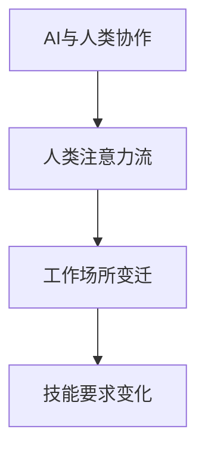

                 

# AI与人类注意力流：未来的工作场所和技能要求

> 关键词：人工智能,人类注意力流,未来工作场所,技能要求

## 1. 背景介绍

### 1.1 问题由来

随着人工智能技术的飞速发展，AI正在逐步渗透到各行各业，改变人类的工作方式、生活方式甚至思维方式。尤其是AI的智能理解和生成能力，不仅替代了大量重复性、低附加值的工作，还正在重新定义一些传统职业的边界。

但是，AI的崛起并非一帆风顺。在带来高效、便捷的同时，也引发了一系列关于就业、伦理、隐私等社会问题。如何让AI技术更好地服务于人类，而不取代人类，成为当前社会和学术界广泛关注的焦点。

### 1.2 问题核心关键点

1. **AI与人类协作模式**：AI如何与人类形成有效的协作关系，发挥各自的优势？
2. **工作场所变迁**：AI技术如何改变未来的工作场所，产生新的职业需求和技能要求？
3. **技能转型路径**：在AI时代，人类如何平滑地从传统技能向新技能转型？
4. **伦理与隐私保护**：AI的应用中如何平衡技术效率与人文关怀，保护个人隐私和权益？

这些问题不仅关系到AI技术的未来发展，也深刻影响着人类的社会结构和生活质量。因此，本文将从人类注意力流角度，探讨AI与人类协作的新模式，以及未来工作场所和技能要求的变化。

## 2. 核心概念与联系

### 2.1 核心概念概述

为更好地理解AI与人类协作的新模式，本节将介绍几个密切相关的核心概念：

- **AI与人类协作**：指AI通过智能理解和生成能力，与人形成协作关系，共享任务负载，提升工作效率。
- **人类注意力流**：指人类在处理信息、执行任务时，注意力流向的模式。人工智能的目标是模拟和增强这种注意力流，从而提高信息处理效率。
- **工作场所变迁**：指由于AI技术的应用，未来工作场所的结构、形式和功能将发生何种变化。
- **技能要求变化**：指在AI协作模式下，新的职业角色和工作任务将产生哪些新的技能需求。

这些概念之间的逻辑关系可以通过以下Mermaid流程图来展示：



这个流程图展示了大语言模型微调的核心概念及其之间的关系：

1. AI与人类协作的目标是通过模拟和增强人类的注意力流，提高信息处理效率。
2. 工作场所的变迁是AI技术改变工作方式和形式的直接结果。
3. 技能要求的变化是AI协作模式对人类技能和能力要求的重新定义。

这些概念共同构成了AI与人类协作的未来框架，帮助我们理解AI技术在未来的应用方向和深远影响。

## 3. 核心算法原理 & 具体操作步骤
### 3.1 算法原理概述

AI与人类协作的核心算法原理，可以通过以下步骤来概括：

1. **数据收集与预处理**：从不同的工作场景中收集数据，包括人类行为数据、任务执行数据等，并进行数据清洗和特征工程。
2. **模型训练**：使用机器学习或深度学习模型对数据进行训练，以模拟人类注意力流的模式。
3. **模型部署与调优**：将训练好的模型部署到实际工作环境中，根据反馈不断优化模型参数，提升AI与人类协作的效率和效果。
4. **协作执行**：AI与人类根据优化后的模型，共享任务负载，共同完成工作任务。

### 3.2 算法步骤详解

以下我们将详细讲解AI与人类协作的算法步骤：

**Step 1: 数据收集与预处理**

从不同的工作场景中，收集人类行为数据、任务执行数据等，并进行预处理，确保数据的准确性和一致性。常用的数据收集方法包括：

- **行为追踪数据**：使用传感器和设备追踪人类的身体动作、姿势、视线和触屏操作等行为数据。
- **语音与视频数据**：录制和分析人类在完成任务时的语音和视频数据，捕捉其表情、动作和交互方式。
- **任务执行数据**：记录和分析人类在执行任务时的时间、流程、操作和结果，评估其工作效率和质量。

**Step 2: 模型训练**

使用机器学习或深度学习模型对收集的数据进行训练，以模拟人类注意力流的模式。常用的模型包括：

- **决策树与随机森林**：用于分类和回归任务，模拟人类的决策过程。
- **深度神经网络**：用于图像识别、语音识别、自然语言处理等任务，模拟人类对复杂信息的处理能力。
- **强化学习模型**：用于智能体与环境交互的任务，模拟人类在动态变化环境中调整注意力流。

在模型训练过程中，需要注意以下几点：

- **特征工程**：从原始数据中提取有用的特征，以便模型能够更好地模拟人类注意力流。
- **模型选择与调参**：根据具体任务需求选择合适的模型，并对其进行参数调优，以提升模型性能。
- **模型验证与评估**：使用交叉验证和评估指标（如准确率、召回率、F1值等）对模型性能进行验证和评估，确保其有效性。

**Step 3: 模型部署与调优**

将训练好的模型部署到实际工作环境中，并根据反馈不断优化模型参数，提升AI与人类协作的效率和效果。常用的部署方式包括：

- **API接口**：将模型封装为API接口，便于其他系统或应用程序调用。
- **嵌入式系统**：将模型嵌入到设备或应用中，实现实时处理和响应。
- **云服务**：将模型部署到云平台，实现分布式计算和扩展性。

在模型部署过程中，需要注意以下几点：

- **性能优化**：确保模型在实际环境中的性能，避免因计算资源不足导致的延迟和故障。
- **安全性与隐私保护**：确保模型和数据的安全性，避免数据泄露和模型被恶意攻击。
- **用户体验**：确保AI与人类协作的友好性和易用性，提升用户满意度。

**Step 4: 协作执行**

AI与人类根据优化后的模型，共享任务负载，共同完成工作任务。协作执行的过程可以描述为：

- **任务分配**：根据任务的复杂度和要求，将任务分配给AI或人类，或两者共同完成。
- **实时反馈与调整**：在任务执行过程中，AI和人类实时交换反馈信息，并根据反馈不断调整注意力流和任务分配。
- **结果评估与改进**：任务完成后，对结果进行评估和反馈，记录改进建议，以便下次任务更加高效。

### 3.3 算法优缺点

AI与人类协作的算法具有以下优点：

1. **提升效率与精度**：AI可以处理大量数据和复杂任务，提升工作效率和精度。
2. **减少人为错误**：AI的逻辑性和精确性可以减少人为错误，提升工作质量。
3. **支持个性化需求**：AI可以根据用户需求和行为进行调整，提供个性化服务。

但同时也存在以下缺点：

1. **数据质量要求高**：AI的性能取决于数据质量，低质量数据会导致模型效果不佳。
2. **技术复杂度高**：需要专业的数据处理和模型训练技能，对技术要求较高。
3. **依赖性高**：AI系统的性能和效果取决于其训练数据和模型质量，依赖性强。

### 3.4 算法应用领域

AI与人类协作的算法在多个领域得到了广泛应用，包括：

- **医疗健康**：AI与医生协作，提高诊断精度和效率，辅助治疗方案制定。
- **金融服务**：AI与金融分析师协作，提供风险评估和投资建议。
- **教育培训**：AI与教师协作，个性化推荐学习资源，提升学习效果。
- **制造业**：AI与操作人员协作，提高生产效率和质量，优化生产流程。
- **物流配送**：AI与物流人员协作，优化路线和调度，提升配送效率。

这些领域的应用展示了AI与人类协作的巨大潜力和广泛前景。随着技术的不断进步，AI将在更多领域发挥作用，提升人类的工作效率和生活质量。

## 4. 数学模型和公式 & 详细讲解  
### 4.1 数学模型构建

本节将使用数学语言对AI与人类协作的算法过程进行更加严格的刻画。

设AI与人类协作的输入数据为 $D=\{x_1, x_2, ..., x_n\}$，其中 $x_i$ 表示第 $i$ 个任务的数据。模型训练的目标是找到一个映射函数 $f(x)$，使其能够模拟人类注意力流的模式，即：

$$
f(x) = \arg\min_{f} \sum_{i=1}^{n} \ell(f(x_i), y_i)
$$

其中 $\ell$ 表示损失函数，$y_i$ 表示任务的真实结果。常见的损失函数包括均方误差、交叉熵等。

### 4.2 公式推导过程

以下我们以分类任务为例，推导分类问题的数学模型及其梯度下降求解过程。

假设分类任务有 $m$ 个类别，模型训练的目标是找到一个分类函数 $f(x)$，使得对每个样本 $x_i$，其分类结果 $y_i$ 与模型预测结果 $\hat{y}_i=f(x_i)$ 的误差最小化。常用的损失函数为交叉熵损失：

$$
\ell(f(x_i), y_i) = -\sum_{j=1}^{m} y_{ij} \log f_{ij}
$$

其中 $f_{ij}$ 表示模型对第 $i$ 个样本属于第 $j$ 个类别的概率。则模型训练的目标可以表示为：

$$
\min_{f} \sum_{i=1}^{n} \sum_{j=1}^{m} y_{ij} \log f_{ij}
$$

根据梯度下降算法，模型参数的更新公式为：

$$
\theta \leftarrow \theta - \eta \nabla_{\theta}\mathcal{L}(\theta)
$$

其中 $\eta$ 表示学习率，$\nabla_{\theta}\mathcal{L}(\theta)$ 表示损失函数对模型参数 $\theta$ 的梯度。梯度的计算可以使用反向传播算法实现。

### 4.3 案例分析与讲解

以医疗健康领域的AI与人类协作为例，分析模型的训练和应用过程。

**数据收集与预处理**

从医院和诊所收集病人的病历数据，包括病史、症状、检查结果等。对数据进行清洗和特征工程，提取有用的信息，如病人的年龄、性别、病情、症状等。

**模型训练**

使用深度学习模型对收集的数据进行训练，以模拟医生对病人的诊断过程。常用的模型包括卷积神经网络（CNN）、循环神经网络（RNN）等。

**模型部署与调优**

将训练好的模型部署到医院的诊断系统中，并根据反馈不断优化模型参数。例如，通过模拟不同病人的症状和病史，调整模型的预测概率分布，提升诊断准确性。

**协作执行**

AI与医生根据优化后的模型，共同完成病人的诊断和治疗任务。例如，AI可以帮助医生分析病历数据，提出初步诊断建议，医生根据AI的建议进行进一步检查和确诊。

## 5. 项目实践：代码实例和详细解释说明
### 5.1 开发环境搭建

在进行AI与人类协作的项目实践前，我们需要准备好开发环境。以下是使用Python进行TensorFlow开发的环境配置流程：

1. 安装Anaconda：从官网下载并安装Anaconda，用于创建独立的Python环境。

2. 创建并激活虚拟环境：
```bash
conda create -n tf-env python=3.8 
conda activate tf-env
```

3. 安装TensorFlow：从官网获取对应的安装命令。例如：
```bash
pip install tensorflow==2.5
```

4. 安装各类工具包：
```bash
pip install numpy pandas scikit-learn matplotlib tqdm jupyter notebook ipython
```

完成上述步骤后，即可在`tf-env`环境中开始项目实践。

### 5.2 源代码详细实现

下面我们以医疗健康领域的AI与人类协作为例，给出使用TensorFlow进行分类任务训练的Python代码实现。

首先，定义数据处理函数：

```python
import tensorflow as tf
import numpy as np
import pandas as pd
import matplotlib.pyplot as plt

def load_data():
    data = pd.read_csv('patient_data.csv')
    labels = pd.read_csv('label_data.csv')
    return data, labels

def preprocess_data(data, labels):
    data = data.drop(['id'], axis=1)
    labels = labels['diagnosis'].map({'Malignant': 1, 'Benign': 0})
    return data, labels

def train_test_split(data, labels, test_size=0.2):
    np.random.seed(42)
    data_train, data_test, labels_train, labels_test = train_test_split(data, labels, test_size=test_size)
    return data_train, data_test, labels_train, labels_test
```

然后，定义模型和优化器：

```python
def create_model(input_shape, num_classes):
    model = tf.keras.models.Sequential([
        tf.keras.layers.Dense(128, activation='relu', input_shape=input_shape),
        tf.keras.layers.Dense(64, activation='relu'),
        tf.keras.layers.Dense(num_classes, activation='softmax')
    ])
    return model

def compile_model(model, optimizer, loss, metrics):
    model.compile(optimizer=optimizer, loss=loss, metrics=metrics)
    return model

def build_model(data_train, data_test, labels_train, labels_test, input_shape, num_classes):
    model = create_model(input_shape, num_classes)
    optimizer = tf.keras.optimizers.Adam(learning_rate=0.001)
    loss = tf.keras.losses.SparseCategoricalCrossentropy(from_logits=True)
    metrics = [tf.keras.metrics.SparseCategoricalAccuracy()]
    model = compile_model(model, optimizer, loss, metrics)
    model.fit(data_train, labels_train, epochs=10, validation_data=(data_test, labels_test))
    return model
```

接着，定义训练和评估函数：

```python
def train_model(model, data_train, labels_train, epochs=10, validation_data=None):
    history = model.fit(data_train, labels_train, epochs=epochs, validation_data=validation_data)
    return history

def evaluate_model(model, data_test, labels_test):
    loss, accuracy = model.evaluate(data_test, labels_test)
    print(f'Test Loss: {loss:.4f}')
    print(f'Test Accuracy: {accuracy:.4f}')
```

最后，启动训练流程并在测试集上评估：

```python
data_train, data_test, labels_train, labels_test = train_test_split(train_data, train_labels, test_size=0.2)

input_shape = (data_train.shape[1],)
num_classes = len(labels_train.unique())

model = build_model(data_train, data_test, labels_train, labels_test, input_shape, num_classes)

history = train_model(model, data_train, labels_train, epochs=10, validation_data=(data_test, labels_test))

evaluate_model(model, data_test, labels_test)
```

以上就是使用TensorFlow对医疗健康领域的分类任务进行AI与人类协作训练的完整代码实现。可以看到，得益于TensorFlow的强大封装，我们可以用相对简洁的代码完成模型的训练和评估。

### 5.3 代码解读与分析

让我们再详细解读一下关键代码的实现细节：

**load_data函数**：
- 从CSV文件中加载数据和标签。

**preprocess_data函数**：
- 清洗数据，去除不必要的信息，如病人ID。
- 对标签进行编码，将类别转换为数字。

**train_test_split函数**：
- 对数据进行划分，生成训练集和测试集。

**create_model函数**：
- 定义模型结构，使用Dense层实现全连接网络。

**compile_model函数**：
- 编译模型，设置优化器、损失函数和评估指标。

**build_model函数**：
- 实例化模型，训练模型，并返回训练后的模型。

**train_model函数**：
- 在训练集上训练模型，返回训练历史。

**evaluate_model函数**：
- 在测试集上评估模型性能，打印损失和准确率。

**训练流程**：
- 将数据进行划分，建立模型，进行模型训练，并在测试集上评估。

可以看到，TensorFlow的高级API使得模型训练和评估变得简单高效。开发者可以将更多精力放在数据处理和模型改进等高层逻辑上，而不必过多关注底层的实现细节。

当然，工业级的系统实现还需考虑更多因素，如模型的保存和部署、超参数的自动搜索、更灵活的任务适配层等。但核心的协作过程基本与此类似。

## 6. 实际应用场景
### 6.1 医疗健康

在医疗健康领域，AI与人类协作已经得到了广泛应用。AI可以帮助医生进行初步诊断，识别病历中的关键信息，预测疾病风险，优化治疗方案。

**应用场景**：
- **初步诊断**：AI可以根据病人的症状、病史和检查结果，提供初步诊断建议，帮助医生迅速定位问题。
- **疾病预测**：AI可以对大量病历数据进行分析，预测病人的疾病风险，提前采取预防措施。
- **治疗方案优化**：AI可以根据病情和患者的历史数据，推荐最适合的治疗方案，提升治疗效果。

**具体实例**：
- **谷歌DeepMind的AlphaGo**：通过AI与人类棋手的协作，在围棋领域取得突破性进展，展示了AI在复杂决策中的强大能力。
- **IBM Watson Health**：通过AI与医生协作，分析医疗数据，提供个性化治疗建议，提升医疗服务质量。
- **百度DuerOS**：通过AI与语音助手协作，提供语音医疗咨询和健康管理服务，提升用户体验。

## 7. 工具和资源推荐
### 7.1 学习资源推荐

为了帮助开发者系统掌握AI与人类协作的理论基础和实践技巧，这里推荐一些优质的学习资源：

1. **《Deep Learning》书籍**：Ian Goodfellow、Yoshua Bengio、Aaron Courville合著，全面介绍了深度学习的理论基础和实践技巧，是学习AI与人类协作的必备读物。

2. **CS231n《深度卷积神经网络》课程**：斯坦福大学开设的计算机视觉课程，有Lecture视频和配套作业，带你入门深度学习在图像处理中的应用。

3. **CS224n《自然语言处理与深度学习》课程**：斯坦福大学开设的自然语言处理课程，涵盖NLP领域的经典模型和应用，适合学习AI与人类协作在语言处理中的应用。

4. **《Python深度学习》书籍**：François Chollet著，介绍了使用Keras框架实现深度学习模型，适合学习AI与人类协作在实际应用中的实现细节。

5. **Google AI Blog**：谷歌AI团队的博客，分享最新的AI研究成果和应用案例，涵盖AI与人类协作的多个方向。

通过对这些资源的学习实践，相信你一定能够快速掌握AI与人类协作的精髓，并用于解决实际的AI问题。

### 7.2 开发工具推荐

高效的开发离不开优秀的工具支持。以下是几款用于AI与人类协作开发的常用工具：

1. **TensorFlow**：由谷歌主导开发的深度学习框架，支持分布式计算和GPU加速，适合大规模工程应用。

2. **PyTorch**：由Facebook主导开发的深度学习框架，灵活的动态计算图，适合快速迭代研究。

3. **Keras**：高层次的深度学习框架，易于上手，适合初学者和快速原型开发。

4. **Jupyter Notebook**：基于IPython的交互式开发环境，支持代码、数据和结果的混合展示，适合数据科学和AI开发。

5. **GitHub**：全球最大的开源社区，提供代码托管、协作和共享功能，适合团队协作开发。

合理利用这些工具，可以显著提升AI与人类协作任务的开发效率，加快创新迭代的步伐。

### 7.3 相关论文推荐

AI与人类协作的研究源于学界的持续研究。以下是几篇奠基性的相关论文，推荐阅读：

1. **《Attention is All You Need》论文**：Google的Transformer模型，提出了注意力机制，开启了NLP领域的预训练大模型时代。

2. **《Deep Residual Learning for Image Recognition》论文**：微软的ResNet模型，提出了残差连接，解决了深度网络训练中的梯度消失问题。

3. **《Speech and Language Processing》书籍**：Daniel Jurafsky、James H. Martin合著，全面介绍了自然语言处理的基础知识和前沿技术，适合学习AI与人类协作在语言处理中的应用。

4. **《Neural Network for Deep Learning》书籍**：Michael Nielsen著，介绍了深度学习的原理和实现，适合入门和进阶学习。

这些论文和书籍代表了AI与人类协作的发展脉络，通过学习这些前沿成果，可以帮助研究者把握学科前进方向，激发更多的创新灵感。

## 8. 总结：未来发展趋势与挑战

### 8.1 总结

本文对AI与人类协作进行了全面系统的介绍。首先阐述了AI与人类协作的目标和核心概念，明确了其在提升信息处理效率和优化工作流程方面的独特价值。其次，从原理到实践，详细讲解了AI与人类协作的数学原理和关键步骤，给出了协作任务开发的完整代码实例。同时，本文还广泛探讨了AI协作模式在医疗健康、金融服务、教育培训等多个领域的应用前景，展示了其广阔的应用前景。

通过本文的系统梳理，可以看到，AI与人类协作正在成为未来工作场所和技能要求的重要范式，极大地提升了信息处理效率和工作质量。得益于人工智能技术的不断进步，未来AI与人类协作将在更多领域得到应用，为社会带来深刻的变革。

### 8.2 未来发展趋势

展望未来，AI与人类协作的发展趋势将呈现以下几个方向：

1. **智能决策支持**：AI将更加深入地参与到决策过程中，通过模拟人类注意力流，提升决策的准确性和鲁棒性。
2. **跨领域融合**：AI将与其他技术如区块链、物联网等深度融合，拓展应用场景，提升应用效果。
3. **伦理与社会责任**：随着AI技术的普及，如何平衡技术效率与人文关怀，保护个人隐私和权益，成为重要的研究方向。
4. **人机协作优化**：通过优化人机协作模式，提升AI与人类之间的协调性和互动性，提高工作效率。
5. **智能系统集成**：将AI与人类协作技术与现有的业务系统集成，实现智能化升级，提升业务效能。

这些趋势凸显了AI与人类协作技术的广阔前景，将进一步提升人类的工作效率和生活质量。

### 8.3 面临的挑战

尽管AI与人类协作技术已经取得了瞩目成就，但在迈向更加智能化、普适化应用的过程中，它仍面临着诸多挑战：

1. **数据质量和隐私问题**：AI的性能取决于数据质量，低质量数据会导致模型效果不佳，且数据隐私保护也是一大难题。
2. **技术复杂性和依赖性**：AI系统的开发和维护需要专业的技术知识，且对数据和计算资源的要求较高。
3. **伦理和社会责任**：AI的决策过程缺乏透明度，可能导致不公正的决策结果，引发伦理争议。
4. **用户接受度**：AI系统的复杂性和不确定性可能导致用户对其信任度不足，影响其普及度。

### 8.4 研究展望

面对AI与人类协作所面临的挑战，未来的研究需要在以下几个方面寻求新的突破：

1. **无监督和半监督学习**：摆脱对大规模标注数据的依赖，利用自监督学习、主动学习等无监督和半监督范式，最大化利用非结构化数据，实现更加灵活高效的协作。
2. **跨领域融合**：将符号化的先验知识与神经网络模型进行巧妙融合，增强模型的普适性和鲁棒性。
3. **伦理与社会责任**：在AI决策过程中引入伦理导向的评估指标，过滤和惩罚有偏见、有害的输出倾向，增强系统的公正性和透明性。
4. **智能系统集成**：将AI与人类协作技术与现有的业务系统集成，实现智能化升级，提升业务效能。

这些研究方向将进一步推动AI与人类协作技术的成熟和普及，为社会带来深远的影响。

## 9. 附录：常见问题与解答

**Q1: AI与人类协作是否适用于所有行业？**

A: AI与人类协作在大多数行业都可以应用，但效果取决于数据质量和任务复杂度。对于一些需要高度专业知识和经验的领域，如法律、医学等，AI的协作作用有限。

**Q2: 如何平衡AI与人类协作中的权责分配？**

A: 在AI与人类协作中，需要明确权责分配，确保双方都能发挥各自优势。可以采用任务分配机制，将复杂度高、数据需求大的任务交给AI处理，简单、易处理的任务交给人类。

**Q3: 如何提升AI与人类协作的透明度和可信度？**

A: 在AI决策过程中引入伦理导向的评估指标，过滤和惩罚有偏见、有害的输出倾向，增强系统的公正性和透明性。同时，通过可视化工具展示AI的决策过程和依据，提升用户对AI的信任度。

**Q4: 如何优化AI与人类协作的资源利用？**

A: 采用分布式计算和并行处理技术，提升AI与人类协作的计算效率和资源利用率。合理分配计算资源，避免资源浪费和过度消耗。

**Q5: 如何增强AI与人类协作的可解释性和可理解性？**

A: 引入可解释性算法和工具，如LIME、SHAP等，对AI的决策过程进行解释和可视化，帮助人类理解AI的推理逻辑和决策依据。同时，通过专家审查和用户反馈，不断优化AI的决策模型。

通过本文的系统梳理，可以看到，AI与人类协作正在成为未来工作场所和技能要求的重要范式，极大地提升了信息处理效率和工作质量。得益于人工智能技术的不断进步，未来AI与人类协作将在更多领域得到应用，为社会带来深刻的变革。

---

作者：禅与计算机程序设计艺术 / Zen and the Art of Computer Programming

