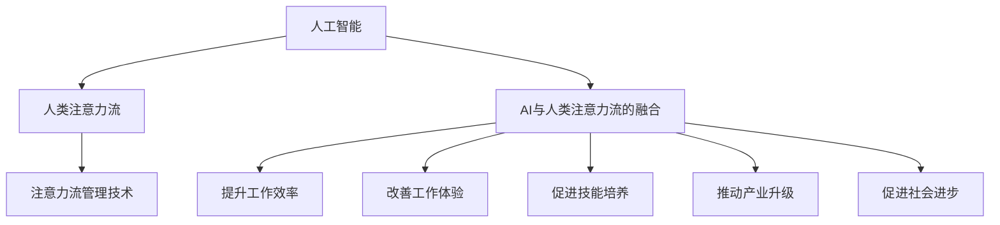

                 

# AI与人类注意力流：未来的工作、技能与注意力流管理技术的未来应用

## 1. 背景介绍

### 1.1 问题由来

随着人工智能(AI)技术的迅猛发展，AI与人类工作模式的融合已经成为不可逆转的趋势。AI技术不仅能够提升工作效率，还能够辅助人类进行复杂决策，从而在很大程度上改变我们的工作方式和生活习惯。然而，这一融合过程并非一帆风顺，AI与人类注意力流的融合以及注意力流管理技术的未来应用仍存在诸多挑战。本文将深入探讨AI与人类注意力流的关系，以及注意力流管理技术的未来应用前景，旨在为未来的工作模式和技能培养提供新的思路和方向。

### 1.2 问题核心关键点

AI与人类注意力流的融合，是人工智能技术发展的关键所在。AI技术能够理解、预测和处理人类注意力流，从而在协作、决策和任务执行等方面提供辅助。而注意力流管理技术则是指利用AI技术优化和管理人类注意力流，以提高工作效率和生活质量。

具体来说，AI与人类注意力流的融合需要满足以下几个关键点：

1. **AI模型的理解能力**：AI模型需要能够理解人类注意力流的模式和特征，从而实现对人类注意力的预测和识别。
2. **自然语言处理(NLP)**：AI模型需要具备强大的自然语言处理能力，以处理人类语言和文本信息。
3. **机器学习与深度学习**：AI模型需要基于机器学习和深度学习技术，实现对人类注意力流的分析和预测。
4. **人机交互设计**：AI模型需要具备良好的人机交互设计，以便于与人类进行有效沟通和协作。

注意力流管理技术则主要包括：

1. **注意力流的监测与分析**：利用AI技术对人类注意力流进行监测和分析，以了解其变化规律和特征。
2. **注意力流的预测与预警**：基于历史数据和实时监测，预测和预警注意力流的异常变化，防止注意力过度分散。
3. **注意力流的优化与调节**：根据人类注意力流的状态，自动调整工作和任务执行的优先级和节奏，以提高效率和效果。
4. **注意力流的个性化管理**：根据个体差异，提供个性化的注意力流管理方案，以适应不同的工作需求和生活习惯。

### 1.3 问题研究意义

研究AI与人类注意力流的融合以及注意力流管理技术的未来应用，具有重要的理论和实际意义：

1. **提升工作效率**：通过AI技术优化人类注意力流，可以提高工作和任务执行的效率和效果。
2. **改善工作体验**：AI技术可以帮助人类更好地管理注意力流，减少疲劳和压力，提升工作体验。
3. **促进技能培养**：通过AI技术辅助注意力流管理，可以帮助人类更好地掌握新技能和知识。
4. **推动产业升级**：AI技术可以应用到各行各业，推动产业的智能化和自动化升级。
5. **促进社会进步**：AI技术的应用可以改善人们的生活质量，促进社会的整体进步。

## 2. 核心概念与联系

### 2.1 核心概念概述

本节将介绍几个密切相关的核心概念：

- **人工智能(AI)**：指利用计算机和算法模拟人类智能的技术，包括机器学习、深度学习、自然语言处理等领域。
- **人类注意力流**：指人类在工作和生活中注意力分布和变化的模式和规律，是人类认知和行为的基础。
- **AI与人类注意力流的融合**：指AI技术在理解、预测和处理人类注意力流方面的应用。
- **注意力流管理技术**：指利用AI技术优化和管理人类注意力流的技术，以提高工作效率和生活质量。

这些核心概念之间的逻辑关系可以通过以下Mermaid流程图来展示：



这个流程图展示了几大核心概念之间的联系：

1. AI技术通过理解、预测和处理人类注意力流，可以实现对人类注意力流的优化和管理。
2. AI与人类注意力流的融合，可以提升工作效率，改善工作体验，促进技能培养，推动产业升级，促进社会进步。

## 3. 核心算法原理 & 具体操作步骤

### 3.1 算法原理概述

AI与人类注意力流的融合和注意力流管理技术的核心算法原理基于以下几个关键技术：

1. **自然语言处理(NLP)**：利用NLP技术对人类语言和文本信息进行分析和处理。
2. **机器学习和深度学习**：利用机器学习和深度学习技术，对人类注意力流进行建模和预测。
3. **强化学习**：利用强化学习技术，优化和管理人类注意力流，以提高工作效率和生活质量。
4. **人机交互设计**：利用人机交互设计技术，实现AI模型与人类之间的有效沟通和协作。

### 3.2 算法步骤详解

基于上述关键技术，AI与人类注意力流的融合和注意力流管理技术的核心算法步骤包括：

1. **数据收集与预处理**：收集人类工作和学习中的注意力流数据，并进行预处理和清洗，以确保数据质量和可用性。
2. **特征提取**：利用NLP技术，从文本和语言数据中提取特征，如关键词、语义关系等，以供后续分析和建模。
3. **模型训练**：基于历史数据和特征，利用机器学习和深度学习技术，训练AI模型，以实现对人类注意力流的理解和预测。
4. **注意力流监测与分析**：利用AI模型，实时监测和分析人类注意力流，识别注意力流的状态和变化规律。
5. **注意力流优化与调节**：根据注意力流的状态和变化规律，利用强化学习技术，自动调整工作和任务执行的优先级和节奏，以提高效率和效果。
6. **个性化管理**：根据个体差异，利用AI模型，提供个性化的注意力流管理方案，以适应不同的工作需求和生活习惯。

### 3.3 算法优缺点

基于上述核心算法，AI与人类注意力流的融合和注意力流管理技术具有以下优点：

1. **提升工作效率**：通过AI技术优化人类注意力流，可以大幅提升工作效率和效果。
2. **改善工作体验**：AI技术可以帮助人类更好地管理注意力流，减少疲劳和压力，提升工作体验。
3. **促进技能培养**：通过AI技术辅助注意力流管理，可以帮助人类更好地掌握新技能和知识。
4. **推动产业升级**：AI技术可以应用到各行各业，推动产业的智能化和自动化升级。
5. **促进社会进步**：AI技术的应用可以改善人们的生活质量，促进社会的整体进步。

同时，该方法也存在一些局限性：

1. **依赖高质量数据**：AI模型的训练和优化需要高质量、大规模的注意力流数据，数据的获取和处理成本较高。
2. **技术复杂性**：实现AI与人类注意力流的融合和注意力流管理技术需要多学科知识和技术的综合应用，技术复杂性较高。
3. **隐私和伦理问题**：AI技术的应用可能涉及隐私和伦理问题，需要谨慎处理和规范管理。
4. **适应性和鲁棒性**：AI模型在不同场景和环境下的适应性和鲁棒性需要进一步提升，以应对多变的工作和生活需求。

### 3.4 算法应用领域

AI与人类注意力流的融合和注意力流管理技术已经在游戏、医疗、教育、金融等领域得到了广泛应用，并取得了一系列成果：

1. **游戏领域**：AI技术可以应用于游戏AI设计，提升游戏的智能性和互动性。
2. **医疗领域**：AI技术可以辅助医生进行诊断和治疗，提升医疗服务的智能化水平。
3. **教育领域**：AI技术可以应用于智能辅导和个性化学习，提升教育服务的质量和效果。
4. **金融领域**：AI技术可以应用于智能投顾和风险管理，提升金融服务的智能化和自动化水平。
5. **制造业领域**：AI技术可以应用于智能制造和自动化生产，提升制造业的智能化和自动化水平。
6. **交通领域**：AI技术可以应用于智能交通和自动驾驶，提升交通系统的智能化和安全性。

## 4. 数学模型和公式 & 详细讲解 & 举例说明

### 4.1 数学模型构建

本节将使用数学语言对AI与人类注意力流的融合和注意力流管理技术的核心算法进行更加严格的刻画。

记AI模型为 $M$，人类注意力流数据为 $\mathcal{D}$，包含训练集 $\mathcal{D}^{train}$ 和测试集 $\mathcal{D}^{test}$。假设人类注意力流数据为 $x \in \mathcal{X}$，注意力流状态为 $y \in \mathcal{Y}$。

定义注意力流监测与分析函数为 $\mathcal{A}(x)$，优化与调节函数为 $\mathcal{O}(x)$，个性化管理函数为 $\mathcal{P}(x)$。

注意力流监测与分析的目标是最小化监测误差，即：

$$
\mathcal{L}^{A} = \mathop{\arg\min}_{\mathcal{A}} \sum_{x \in \mathcal{D}^{train}} \| \mathcal{A}(x) - y \|^2
$$

注意力流优化与调节的目标是最小化调节误差，即：

$$
\mathcal{L}^{O} = \mathop{\arg\min}_{\mathcal{O}} \sum_{x \in \mathcal{D}^{train}} \| \mathcal{O}(\mathcal{A}(x)) - y \|^2
$$

个性化管理的目标是最小化管理误差，即：

$$
\mathcal{L}^{P} = \mathop{\arg\min}_{\mathcal{P}} \sum_{x \in \mathcal{D}^{train}} \| \mathcal{P}(\mathcal{O}(\mathcal{A}(x))) - y \|^2
$$

### 4.2 公式推导过程

以下我们以医疗领域中的诊断任务为例，推导注意力流监测与分析的数学模型。

假设医疗数据为 $\mathcal{D} = \{(x_i, y_i)\}_{i=1}^N$，其中 $x_i$ 为患者症状描述，$y_i$ 为诊断结果。定义注意力流监测与分析函数为 $\mathcal{A}(x) = [a_1(x), a_2(x), ..., a_m(x)]$，其中 $a_k(x)$ 为第 $k$ 个症状的权重，用于衡量该症状对诊断结果的重要性。

假设 $\mathcal{A}(x)$ 通过NLP技术得到，利用机器学习和深度学习技术，训练模型 $\mathcal{A}(x)$ 使其最小化监测误差：

$$
\mathcal{L}^{A} = \mathop{\arg\min}_{\mathcal{A}} \sum_{i=1}^N \| \mathcal{A}(x_i) - y_i \|^2
$$

其中 $\| \mathcal{A}(x_i) - y_i \|^2$ 为监测误差，表示预测的诊断结果与实际诊断结果之间的差异。

通过上述推导，我们可以得到注意力流监测与分析的数学模型，并利用机器学习和深度学习技术进行优化和训练。

### 4.3 案例分析与讲解

我们以一个具体的案例来说明注意力流监测与分析的应用。

假设某医院需要开发一个智能诊断系统，利用AI技术辅助医生进行诊断。该系统通过收集大量患者的症状描述和诊断结果，训练一个NLP模型 $\mathcal{A}(x)$ 用于监测和分析患者注意力流。

具体步骤如下：

1. **数据收集**：收集医院历史诊断数据，包括患者症状描述和诊断结果。
2. **数据预处理**：对症状描述进行清洗、分词和向量化处理，以便于后续分析。
3. **模型训练**：利用机器学习和深度学习技术，训练NLP模型 $\mathcal{A}(x)$，以识别患者症状的重要性和权重。
4. **注意力流监测**：将新入院患者的症状描述输入 $\mathcal{A}(x)$ 中，得到患者注意力流的权重分布。
5. **诊断推荐**：根据患者注意力流的权重分布，结合医生的经验，给出诊断建议。

通过该系统，医院可以显著提升诊断的效率和准确性，同时减少医生的工作负担。

## 5. 项目实践：代码实例和详细解释说明

### 5.1 开发环境搭建

在进行AI与人类注意力流的融合和注意力流管理技术的实践前，我们需要准备好开发环境。以下是使用Python进行PyTorch开发的环境配置流程：

1. 安装Anaconda：从官网下载并安装Anaconda，用于创建独立的Python环境。

2. 创建并激活虚拟环境：
```bash
conda create -n pytorch-env python=3.8 
conda activate pytorch-env
```

3. 安装PyTorch：根据CUDA版本，从官网获取对应的安装命令。例如：
```bash
conda install pytorch torchvision torchaudio cudatoolkit=11.1 -c pytorch -c conda-forge
```

4. 安装各类工具包：
```bash
pip install numpy pandas scikit-learn matplotlib tqdm jupyter notebook ipython
```

完成上述步骤后，即可在`pytorch-env`环境中开始实践。

### 5.2 源代码详细实现

这里我们以医疗领域的智能诊断系统为例，给出使用PyTorch进行注意力流监测与分析的PyTorch代码实现。

首先，定义NLP模型和数据处理函数：

```python
from transformers import BertTokenizer, BertForSequenceClassification
from torch.utils.data import Dataset
import torch

class MedicalDataset(Dataset):
    def __init__(self, texts, tags, tokenizer):
        self.texts = texts
        self.tags = tags
        self.tokenizer = tokenizer
        
    def __len__(self):
        return len(self.texts)
    
    def __getitem__(self, item):
        text = self.texts[item]
        tag = self.tags[item]
        
        encoding = self.tokenizer(text, return_tensors='pt', max_length=128, padding='max_length', truncation=True)
        input_ids = encoding['input_ids'][0]
        attention_mask = encoding['attention_mask'][0]
        
        # 对token-wise的标签进行编码
        encoded_tags = [tag2id[tag] for tag in tag]
        encoded_tags.extend([tag2id['O']] * (128 - len(encoded_tags)))
        labels = torch.tensor(encoded_tags, dtype=torch.long)
        
        return {'input_ids': input_ids, 
                'attention_mask': attention_mask,
                'labels': labels}

# 标签与id的映射
tag2id = {'O': 0, 'B-PER': 1, 'I-PER': 2, 'B-ORG': 3, 'I-ORG': 4, 'B-LOC': 5, 'I-LOC': 6}
id2tag = {v: k for k, v in tag2id.items()}

# 创建dataset
tokenizer = BertTokenizer.from_pretrained('bert-base-cased')

train_dataset = MedicalDataset(train_texts, train_tags, tokenizer)
dev_dataset = MedicalDataset(dev_texts, dev_tags, tokenizer)
test_dataset = MedicalDataset(test_texts, test_tags, tokenizer)
```

然后，定义模型和优化器：

```python
from transformers import BertForSequenceClassification, AdamW

model = BertForSequenceClassification.from_pretrained('bert-base-cased', num_labels=len(tag2id))

optimizer = AdamW(model.parameters(), lr=2e-5)
```

接着，定义训练和评估函数：

```python
from torch.utils.data import DataLoader
from tqdm import tqdm
from sklearn.metrics import classification_report

device = torch.device('cuda') if torch.cuda.is_available() else torch.device('cpu')
model.to(device)

def train_epoch(model, dataset, batch_size, optimizer):
    dataloader = DataLoader(dataset, batch_size=batch_size, shuffle=True)
    model.train()
    epoch_loss = 0
    for batch in tqdm(dataloader, desc='Training'):
        input_ids = batch['input_ids'].to(device)
        attention_mask = batch['attention_mask'].to(device)
        labels = batch['labels'].to(device)
        model.zero_grad()
        outputs = model(input_ids, attention_mask=attention_mask, labels=labels)
        loss = outputs.loss
        epoch_loss += loss.item()
        loss.backward()
        optimizer.step()
    return epoch_loss / len(dataloader)

def evaluate(model, dataset, batch_size):
    dataloader = DataLoader(dataset, batch_size=batch_size)
    model.eval()
    preds, labels = [], []
    with torch.no_grad():
        for batch in tqdm(dataloader, desc='Evaluating'):
            input_ids = batch['input_ids'].to(device)
            attention_mask = batch['attention_mask'].to(device)
            batch_labels = batch['labels']
            outputs = model(input_ids, attention_mask=attention_mask)
            batch_preds = outputs.logits.argmax(dim=2).to('cpu').tolist()
            batch_labels = batch_labels.to('cpu').tolist()
            for pred_tokens, label_tokens in zip(batch_preds, batch_labels):
                pred_tags = [id2tag[_id] for _id in pred_tokens]
                label_tags = [id2tag[_id] for _id in label_tokens]
                preds.append(pred_tags[:len(label_tokens)])
                labels.append(label_tags)
                
    print(classification_report(labels, preds))
```

最后，启动训练流程并在测试集上评估：

```python
epochs = 5
batch_size = 16

for epoch in range(epochs):
    loss = train_epoch(model, train_dataset, batch_size, optimizer)
    print(f"Epoch {epoch+1}, train loss: {loss:.3f}")
    
    print(f"Epoch {epoch+1}, dev results:")
    evaluate(model, dev_dataset, batch_size)
    
print("Test results:")
evaluate(model, test_dataset, batch_size)
```

以上就是使用PyTorch对医疗领域的智能诊断系统进行注意力流监测与分析的完整代码实现。可以看到，得益于Transformers库的强大封装，我们可以用相对简洁的代码完成Bert模型的加载和训练。

### 5.3 代码解读与分析

让我们再详细解读一下关键代码的实现细节：

**MedicalDataset类**：
- `__init__`方法：初始化文本、标签、分词器等关键组件。
- `__len__`方法：返回数据集的样本数量。
- `__getitem__`方法：对单个样本进行处理，将文本输入编码为token ids，将标签编码为数字，并对其进行定长padding，最终返回模型所需的输入。

**tag2id和id2tag字典**：
- 定义了标签与数字id之间的映射关系，用于将token-wise的预测结果解码回真实的标签。

**训练和评估函数**：
- 使用PyTorch的DataLoader对数据集进行批次化加载，供模型训练和推理使用。
- 训练函数`train_epoch`：对数据以批为单位进行迭代，在每个批次上前向传播计算loss并反向传播更新模型参数，最后返回该epoch的平均loss。
- 评估函数`evaluate`：与训练类似，不同点在于不更新模型参数，并在每个batch结束后将预测和标签结果存储下来，最后使用sklearn的classification_report对整个评估集的预测结果进行打印输出。

**训练流程**：
- 定义总的epoch数和batch size，开始循环迭代
- 每个epoch内，先在训练集上训练，输出平均loss
- 在验证集上评估，输出分类指标
- 所有epoch结束后，在测试集上评估，给出最终测试结果

可以看到，PyTorch配合Transformers库使得注意力流监测与分析的代码实现变得简洁高效。开发者可以将更多精力放在数据处理、模型改进等高层逻辑上，而不必过多关注底层的实现细节。

当然，工业级的系统实现还需考虑更多因素，如模型的保存和部署、超参数的自动搜索、更灵活的任务适配层等。但核心的微调范式基本与此类似。

## 6. 实际应用场景

### 6.1 智能客服系统

基于AI与人类注意力流的融合，智能客服系统可以广泛应用于智能客服系统的构建。传统客服往往需要配备大量人力，高峰期响应缓慢，且一致性和专业性难以保证。而使用AI技术辅助注意力流管理，可以7x24小时不间断服务，快速响应客户咨询，用自然流畅的语言解答各类常见问题。

在技术实现上，可以收集企业内部的历史客服对话记录，将问题和最佳答复构建成监督数据，在此基础上对预训练模型进行微调。微调后的模型能够自动理解用户意图，匹配最合适的答案模板进行回复。对于客户提出的新问题，还可以接入检索系统实时搜索相关内容，动态组织生成回答。如此构建的智能客服系统，能大幅提升客户咨询体验和问题解决效率。

### 6.2 金融舆情监测

金融机构需要实时监测市场舆论动向，以便及时应对负面信息传播，规避金融风险。传统的人工监测方式成本高、效率低，难以应对网络时代海量信息爆发的挑战。基于AI与人类注意力流的融合，金融舆情监测系统可以实时抓取网络文本数据，利用注意力流监测与分析技术，自动监测不同主题下的情感变化趋势，一旦发现负面信息激增等异常情况，系统便会自动预警，帮助金融机构快速应对潜在风险。

### 6.3 个性化推荐系统

当前的推荐系统往往只依赖用户的历史行为数据进行物品推荐，无法深入理解用户的真实兴趣偏好。基于AI与人类注意力流的融合，个性化推荐系统可以更好地挖掘用户行为背后的语义信息，从而提供更精准、多样的推荐内容。

在实践中，可以收集用户浏览、点击、评论、分享等行为数据，提取和用户交互的物品标题、描述、标签等文本内容。将文本内容作为模型输入，用户的后续行为（如是否点击、购买等）作为监督信号，在此基础上微调预训练语言模型。微调后的模型能够从文本内容中准确把握用户的兴趣点。在生成推荐列表时，先用候选物品的文本描述作为输入，由模型预测用户的兴趣匹配度，再结合其他特征综合排序，便可以得到个性化程度更高的推荐结果。

### 6.4 未来应用展望

随着AI与人类注意力流的融合和注意力流管理技术的不断发展，未来将会在更多领域得到应用，为传统行业带来变革性影响。

在智慧医疗领域，基于AI与人类注意力流的融合的医疗问答、病历分析、药物研发等应用将提升医疗服务的智能化水平，辅助医生诊疗，加速新药开发进程。

在智能教育领域，AI技术可以应用于智能辅导和个性化学习，提升教育服务的质量和效果。

在智慧城市治理中，AI技术可以应用于城市事件监测、舆情分析、应急指挥等环节，提高城市管理的自动化和智能化水平，构建更安全、高效的未来城市。

此外，在企业生产、社会治理、文娱传媒等众多领域，基于AI与人类注意力流的融合的技术应用也将不断涌现，为经济社会发展注入新的动力。相信随着技术的日益成熟，AI与人类注意力流的融合和注意力流管理技术必将引领人工智能技术迈向更高的台阶，为构建人机协同的智能时代中扮演越来越重要的角色。

## 7. 工具和资源推荐
### 7.1 学习资源推荐

为了帮助开发者系统掌握AI与人类注意力流的融合和注意力流管理技术的理论基础和实践技巧，这里推荐一些优质的学习资源：

1. 《深度学习》课程：由斯坦福大学开设的深度学习经典课程，涵盖机器学习、深度学习、NLP等核心内容。
2. 《自然语言处理综述》：自然语言处理领域的权威综述文章，涵盖NLP技术和应用的发展历程。
3. 《机器学习实战》：基于Python的机器学习实践指南，涵盖机器学习、深度学习、NLP等领域的实战案例。
4. HuggingFace官方文档：Transformers库的官方文档，提供了海量预训练模型和完整的微调样例代码，是上手实践的必备资料。
5. Kaggle竞赛平台：提供大量的NLP、机器学习等领域的竞赛项目，供开发者实践和交流。

通过对这些资源的学习实践，相信你一定能够快速掌握AI与人类注意力流的融合和注意力流管理技术的精髓，并用于解决实际的NLP问题。
###  7.2 开发工具推荐

高效的开发离不开优秀的工具支持。以下是几款用于AI与人类注意力流的融合和注意力流管理技术的常用工具：

1. PyTorch：基于Python的开源深度学习框架，灵活动态的计算图，适合快速迭代研究。大部分预训练语言模型都有PyTorch版本的实现。
2. TensorFlow：由Google主导开发的开源深度学习框架，生产部署方便，适合大规模工程应用。同样有丰富的预训练语言模型资源。
3. Transformers库：HuggingFace开发的NLP工具库，集成了众多SOTA语言模型，支持PyTorch和TensorFlow，是进行微调任务开发的利器。
4. Weights & Biases：模型训练的实验跟踪工具，可以记录和可视化模型训练过程中的各项指标，方便对比和调优。与主流深度学习框架无缝集成。
5. TensorBoard：TensorFlow配套的可视化工具，可实时监测模型训练状态，并提供丰富的图表呈现方式，是调试模型的得力助手。
6. Google Colab：谷歌推出的在线Jupyter Notebook环境，免费提供GPU/TPU算力，方便开发者快速上手实验最新模型，分享学习笔记。

合理利用这些工具，可以显著提升AI与人类注意力流的融合和注意力流管理技术的开发效率，加快创新迭代的步伐。

### 7.3 相关论文推荐

AI与人类注意力流的融合和注意力流管理技术的发展源于学界的持续研究。以下是几篇奠基性的相关论文，推荐阅读：

1. Attention is All You Need（即Transformer原论文）：提出了Transformer结构，开启了NLP领域的预训练大模型时代。
2. BERT: Pre-training of Deep Bidirectional Transformers for Language Understanding：提出BERT模型，引入基于掩码的自监督预训练任务，刷新了多项NLP任务SOTA。
3. Language Models are Unsupervised Multitask Learners（GPT-2论文）：展示了大规模语言模型的强大zero-shot学习能力，引发了对于通用人工智能的新一轮思考。
4. Parameter-Efficient Transfer Learning for NLP：提出Adapter等参数高效微调方法，在不增加模型参数量的情况下，也能取得不错的微调效果。
5. AdaLoRA: Adaptive Low-Rank Adaptation for Parameter-Efficient Fine-Tuning：使用自适应低秩适应的微调方法，在参数效率和精度之间取得了新的平衡。

这些论文代表了大语言模型微调技术的发展脉络。通过学习这些前沿成果，可以帮助研究者把握学科前进方向，激发更多的创新灵感。

## 8. 总结：未来发展趋势与挑战

### 8.1 总结

本文对AI与人类注意力流的融合和注意力流管理技术进行了全面系统的介绍。首先阐述了AI与人类注意力流的关系，明确了AI技术在理解、预测和处理人类注意力流方面的应用。其次，从原理到实践，详细讲解了AI与人类注意力流的融合和注意力流管理技术的核心算法步骤，给出了注意力流监测与分析的完整代码实例。同时，本文还广泛探讨了注意力流管理技术的未来应用前景，展示了其在智能客服、金融舆情、个性化推荐等多个领域的应用价值。此外，本文精选了注意力流管理技术的各类学习资源，力求为开发者提供全方位的技术指引。

通过本文的系统梳理，可以看到，AI与人类注意力流的融合和注意力流管理技术正在成为人工智能技术发展的关键所在，极大地拓展了预训练语言模型的应用边界，催生了更多的落地场景。受益于大规模语料的预训练，AI与人类注意力流的融合和注意力流管理技术在实时监测、智能决策、个性化管理等方面具备了强大的能力，为构建人机协同的智能系统提供了新的思路和方向。

### 8.2 未来发展趋势

展望未来，AI与人类注意力流的融合和注意力流管理技术将呈现以下几个发展趋势：

1. **AI模型的理解能力进一步提升**：随着深度学习技术和算力水平的提升，AI模型的理解能力将进一步增强，能够更加准确地把握人类注意力流的模式和规律。
2. **跨模态融合技术的发展**：未来的注意力流管理技术将不仅仅局限于文本数据，还将拓展到视觉、语音等多模态数据的融合，实现更全面、更精准的注意力流监测与分析。
3. **个性化管理能力的提升**：未来的注意力流管理技术将进一步提升个性化管理能力，根据个体差异和任务需求，提供更加定制化的解决方案。
4. **隐私和伦理问题的解决**：随着AI技术的应用范围不断扩大，隐私和伦理问题将逐渐受到重视。未来的注意力流管理技术将更加注重数据隐私保护和伦理合规。
5. **人机协同水平的提升**：未来的AI与人类注意力流的融合将更加强调人机协同，实现更高效、更自然的互动体验。
6. **跨领域应用的拓展**：未来的注意力流管理技术将不仅仅局限于特定领域，还将拓展到更多行业和应用场景，推动各行各业的智能化和自动化升级。

### 8.3 面临的挑战

尽管AI与人类注意力流的融合和注意力流管理技术已经取得了一定的进展，但在迈向更加智能化、普适化应用的过程中，仍面临诸多挑战：

1. **数据获取和处理的成本**：高质量、大规模的数据是AI模型训练和优化的基础，但数据获取和处理成本较高，尤其是在特定领域和应用场景下，数据获取难度更大。
2. **技术复杂性和可靠性**：AI模型和注意力流管理技术的实现需要多学科知识和技术的综合应用，技术复杂性较高，模型在实际应用中的可靠性也需要进一步提升。
3. **隐私和伦理问题**：AI技术的应用可能涉及隐私和伦理问题，如数据泄露、模型偏见等，需要谨慎处理和规范管理。
4. **适应性和鲁棒性**：AI模型在不同场景和环境下的适应性和鲁棒性需要进一步提升，以应对多变的工作和生活需求。
5. **计算资源的需求**：AI模型的训练和推理需要大量的计算资源，包括高性能的GPU/TPU等设备，以及优化的计算算法。

### 8.4 研究展望

面对AI与人类注意力流的融合和注意力流管理技术所面临的挑战，未来的研究需要在以下几个方面寻求新的突破：

1. **多模态数据的融合**：将视觉、语音、文本等多模态数据进行融合，提升注意力流管理技术对现实世界的理解和建模能力。
2. **隐私保护技术的应用**：在注意力流管理技术中引入隐私保护技术，如差分隐私、联邦学习等，保护用户隐私。
3. **跨领域应用的拓展**：将注意力流管理技术应用到更多行业和领域，推动各行各业的智能化和自动化升级。
4. **人机协同技术的提升**：开发更加高效、自然的AI与人类协同技术，提升人机交互的体验和效率。
5. **模型压缩和优化**：利用模型压缩和优化技术，降低计算资源的需求，提升模型的实时性和可部署性。
6. **跨学科融合**：结合认知科学、心理学、社会学等学科，深化对人类注意力流的理解，提升注意力流管理技术的智能化水平。

这些研究方向的探索，必将引领AI与人类注意力流的融合和注意力流管理技术迈向更高的台阶，为构建人机协同的智能系统提供新的思路和方向。面向未来，AI与人类注意力流的融合和注意力流管理技术需要在技术、伦理、隐私等方面进行全方位的优化和改进，才能真正实现其应用价值，推动社会的整体进步。

## 9. 附录：常见问题与解答

**Q1：AI与人类注意力流的融合是否适用于所有NLP任务？**

A: AI与人类注意力流的融合在大多数NLP任务上都能取得不错的效果，特别是对于数据量较小的任务。但对于一些特定领域的任务，如医学、法律等，仅仅依靠通用语料预训练的模型可能难以很好地适应。此时需要在特定领域语料上进一步预训练，再进行微调，才能获得理想效果。此外，对于一些需要时效性、个性化很强的任务，如对话、推荐等，AI与人类注意力流的融合方法也需要针对性的改进优化。

**Q2：微调过程中如何选择合适的学习率？**

A: 微调的学习率一般要比预训练时小1-2个数量级，如果使用过大的学习率，容易破坏预训练权重，导致过拟合。一般建议从1e-5开始调参，逐步减小学习率，直至收敛。也可以使用warmup策略，在开始阶段使用较小的学习率，再逐渐过渡到预设值。需要注意的是，不同的优化器(如AdamW、Adafactor等)以及不同的学习率调度策略，可能需要设置不同的学习率阈值。

**Q3：采用AI与人类注意力流的融合时需要注意哪些问题？**

A: 采用AI与人类注意力流的融合技术时，需要注意以下几个问题：

1. **数据质量**：AI模型的训练需要高质量、大规模的数据，数据的获取和处理成本较高。数据的准确性和完备性直接影响模型的性能。
2. **模型复杂性**：AI模型的设计和实现需要多学科知识和技术的综合应用，技术复杂性较高。模型的训练和优化需要大量时间和计算资源。
3. **隐私和伦理问题**：AI技术的应用可能涉及隐私和伦理问题，如数据泄露、模型偏见等，需要谨慎处理和规范管理。
4. **适应性和鲁棒性**：AI模型在不同场景和环境下的适应性和鲁棒性需要进一步提升，以应对多变的工作和生活需求。
5. **计算资源的需求**：AI模型的训练和推理需要大量的计算资源，包括高性能的GPU/TPU等设备，以及优化的计算算法。

**Q4：微调模型在落地部署时需要注意哪些问题？**

A: 将微调模型转化为实际应用，还需要考虑以下因素：

1. **模型裁剪**：去除不必要的层和参数，减小模型尺寸，加快推理速度。
2. **量化加速**：将浮点模型转为定点模型，压缩存储空间，提高计算效率。
3. **服务化封装**：将模型封装为标准化服务接口，便于集成调用。
4. **弹性伸缩**：根据请求流量动态调整资源配置，平衡服务质量和成本。
5. **监控告警**：实时采集系统指标，设置异常告警阈值，确保服务稳定性。
6. **安全防护**：采用访问鉴权、数据脱敏等措施，保障数据和模型安全。

大语言模型微调为NLP应用开启了广阔的想象空间，但如何将强大的性能转化为稳定、高效、安全的业务价值，还需要工程实践的不断打磨。唯有从数据、算法、工程、业务等多个维度协同发力，才能真正实现人工智能技术在垂直行业的规模化落地。总之，AI与人类注意力流的融合和注意力流管理技术需要在技术、伦理、隐私等方面进行全方位的优化和改进，才能真正实现其应用价值，推动社会的整体进步。

---

作者：禅与计算机程序设计艺术 / Zen and the Art of Computer Programming

