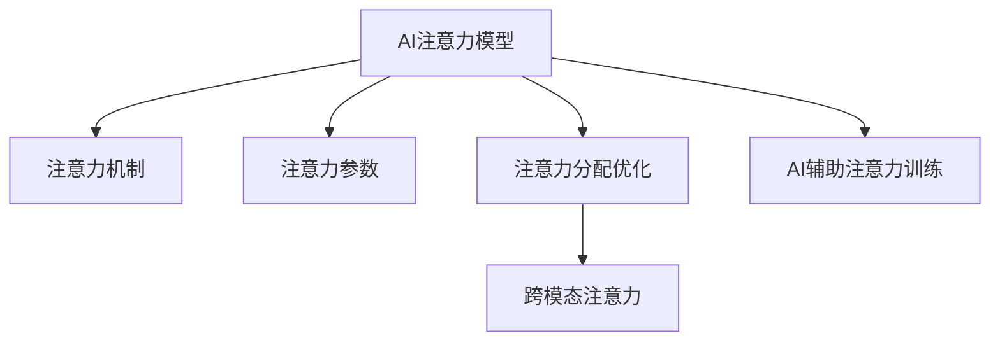

                 

# AI与人类注意力流：未来的工作、生活与AI的融合

## 1. 背景介绍

### 1.1 问题由来
随着人工智能(AI)技术的飞速发展，AI与人类生活的融合已经悄然改变着我们的工作、学习、娱乐等多个方面。特别在当前数字信息爆炸的时代，人类注意力流已从传统意义上的多任务并行转向单任务集中，AI在这一过程中扮演了越来越重要的角色。AI不仅在各种任务中辅助人类决策，还在注意力分配上起到了至关重要的作用。

### 1.2 问题核心关键点
未来AI与人类注意力流的深度融合将是AI发展的重要方向。AI如何理解和模拟人类注意力，如何通过优化注意力分配，提升人类对信息的吸收和利用效率，是当前研究的热点。以下是几个关键点：

- **AI注意力模型**：如何构建和训练AI注意力模型以模拟人类注意力过程。
- **注意力分配优化**：如何通过AI技术优化人类对信息的注意力分配，提升信息吸收效率。
- **跨模态注意力**：如何实现跨模态(如文本、图像、语音)信息之间的注意力传递和融合。
- **AI辅助注意力训练**：如何利用AI技术提升人类注意力训练效果，帮助人们更好地聚焦于重要信息。

### 1.3 问题研究意义
通过深入研究AI与人类注意力流的融合，能够为AI在人类社会中的应用提供更加精准和有效的辅助，从而更好地服务于人类生活的各个方面。具体意义如下：

1. **提升工作效率**：AI辅助注意力训练能帮助人们更好地聚焦于工作任务，提升工作效率。
2. **优化学习效果**：AI优化注意力分配能够提升学习过程中的信息吸收效率，促进知识积累。
3. **改善娱乐体验**：AI注意力模型能够推荐更具吸引力的内容，提升娱乐体验。
4. **辅助决策支持**：AI提供基于注意力分析的决策支持，帮助人们更好地进行决策。
5. **提高生活质量**：AI优化注意力分配，使得人们能够更好地管理时间和精力，提升生活质量。

## 2. 核心概念与联系

### 2.1 核心概念概述

为更好地理解AI与人类注意力流的融合，本节将介绍几个密切相关的核心概念：

- **AI注意力模型**：基于神经网络构建的模型，用于模拟人类注意力过程，通常包括注意力机制和注意力参数。
- **注意力分配优化**：通过机器学习模型优化人类注意力分配，提升信息处理效率。
- **跨模态注意力**：通过深度学习模型实现不同模态信息之间的注意力传递和融合，如文本与图像的注意力融合。
- **AI辅助注意力训练**：利用AI模型对人类注意力进行训练，帮助人们更好地聚焦于重要信息。

### 2.2 核心概念原理和架构的 Mermaid 流程图(Mermaid 流程节点中不要有括号、逗号等特殊字符)



这个流程图展示了AI与人类注意力流融合的核心概念及其之间的联系：

1. **AI注意力模型**：通过注意力机制和注意力参数模拟人类注意力过程。
2. **注意力分配优化**：对人类注意力进行优化，提升信息处理效率。
3. **跨模态注意力**：实现不同模态信息之间的注意力传递和融合。
4. **AI辅助注意力训练**：通过AI模型提升人类注意力训练效果。

## 3. 核心算法原理 & 具体操作步骤

### 3.1 算法原理概述

AI与人类注意力流的融合主要通过构建AI注意力模型和优化注意力分配来实现。核心算法原理包括以下几个部分：

1. **注意力机制**：通过神经网络模型模拟人类注意力过程，通过加权处理不同信息的重要性。
2. **注意力训练**：通过深度学习算法训练注意力模型，优化注意力参数。
3. **注意力优化**：利用注意力模型优化人类注意力分配，提升信息处理效率。
4. **跨模态注意力**：实现不同模态信息之间的注意力传递和融合，提升综合信息处理能力。

### 3.2 算法步骤详解

1. **数据准备**：收集和标注人类注意力数据，例如用户在浏览网页时的点击记录、阅读时间等。
2. **模型构建**：选择合适的深度学习模型（如Transformer、RNN等），构建注意力模型，并进行初始化。
3. **参数训练**：在标注数据上训练注意力模型，优化注意力参数，使得模型能够更好地模拟人类注意力过程。
4. **注意力优化**：在训练好的注意力模型基础上，对人类注意力进行优化，提升信息处理效率。
5. **跨模态注意力**：实现跨模态注意力模型，整合不同模态的信息，提升综合信息处理能力。
6. **应用部署**：将优化后的注意力模型应用到实际场景中，辅助人类进行决策、学习等任务。

### 3.3 算法优缺点

AI与人类注意力流的融合算法具有以下优点：

1. **提升信息处理效率**：通过优化注意力分配，提升信息吸收和利用效率。
2. **个性化推荐**：通过注意力模型个性化推荐信息，提升用户体验。
3. **辅助决策支持**：通过注意力模型辅助决策，提升决策质量。
4. **跨模态融合能力**：实现不同模态信息的整合，提升综合信息处理能力。

同时，该算法也存在一些局限：

1. **数据依赖**：依赖高质量、大规模的标注数据，获取数据成本较高。
2. **模型复杂度**：构建和训练注意力模型需要较高的计算资源和复杂度。
3. **可解释性不足**：注意力模型的决策过程较为复杂，难以解释。
4. **跨模态融合挑战**：不同模态信息之间的注意力传递和融合存在挑战。

### 3.4 算法应用领域

AI与人类注意力流的融合算法已经在多个领域得到应用，具体包括：

1. **内容推荐系统**：通过注意力模型个性化推荐网页、视频、文章等，提升用户粘性。
2. **智能客服**：通过注意力模型辅助客服理解用户意图，提升服务质量。
3. **教育辅助**：通过注意力模型辅助学生聚焦重要知识点，提升学习效果。
4. **医疗诊断**：通过注意力模型辅助医生分析影像，提升诊断准确性。
5. **金融投资**：通过注意力模型辅助投资决策，提升投资回报率。
6. **自动驾驶**：通过注意力模型辅助自动驾驶车辆感知环境，提升驾驶安全性。

## 4. 数学模型和公式 & 详细讲解 & 举例说明（备注：数学公式请使用latex格式，latex嵌入文中独立段落使用 $$，段落内使用 $)
### 4.1 数学模型构建

注意力模型通常基于神经网络构建，核心思想是让模型学习不同信息的相对重要性。下面以Transformer模型为例，介绍注意力模型的构建方法。

### 4.2 公式推导过程

Transformer模型中的自注意力机制公式如下：

$$
Attention(Q, K, V) = \frac{exp(\frac{QK^T}{\sqrt{d_k}})}{sum(exp(\frac{QK^T}{\sqrt{d_k}}))}KV
$$

其中，$Q$、$K$、$V$分别表示查询、键、值向量，$d_k$是键向量的维度。该公式计算了查询向量$Q$对所有键向量$K$的注意力权重，从而计算出加权后的值向量$V$。

### 4.3 案例分析与讲解

假设有一个用户浏览网页的任务，网页上的不同段落、图片、视频等信息可以视为不同的模态。通过构建跨模态注意力模型，将用户的注意力分配到最相关的信息上，从而提升浏览效率和效果。

## 5. 项目实践：代码实例和详细解释说明
### 5.1 开发环境搭建

在进行项目实践前，我们需要准备好开发环境。以下是使用Python进行PyTorch开发的环境配置流程：

1. 安装Anaconda：从官网下载并安装Anaconda，用于创建独立的Python环境。

2. 创建并激活虚拟环境：
```bash
conda create -n attention-env python=3.8 
conda activate attention-env
```

3. 安装PyTorch：根据CUDA版本，从官网获取对应的安装命令。例如：
```bash
conda install pytorch torchvision torchaudio cudatoolkit=11.1 -c pytorch -c conda-forge
```

4. 安装相关库：
```bash
pip install torch nn scikit-learn jupyter notebook ipython
```

完成上述步骤后，即可在`attention-env`环境中开始项目实践。

### 5.2 源代码详细实现

下面我们以内容推荐系统为例，给出使用PyTorch构建注意力模型的PyTorch代码实现。

首先，定义注意力模型的参数：

```python
import torch
import torch.nn as nn
import torch.nn.functional as F

class Attention(nn.Module):
    def __init__(self, d_model, d_k, d_v):
        super(Attention, self).__init__()
        self.d_k = d_k
        self.d_v = d_v
        
        self.query_weight = nn.Linear(d_model, d_k)
        self.key_weight = nn.Linear(d_model, d_k)
        self.value_weight = nn.Linear(d_model, d_v)
        self.out_weight = nn.Linear(d_v, d_model)
        
    def forward(self, Q, K, V):
        Q = self.query_weight(Q)
        K = self.key_weight(K)
        V = self.value_weight(V)
        
        scores = torch.matmul(Q, K.transpose(1, 2)) / (torch.sqrt(torch.tensor(self.d_k, dtype=torch.float32)))
        attention_weights = F.softmax(scores, dim=-1)
        
        context = torch.matmul(attention_weights, V)
        attention = self.out_weight(context)
        
        return attention
```

然后，定义注意力模型的优化函数：

```python
class AttentionOptimizer(nn.Module):
    def __init__(self, model, lr):
        super(AttentionOptimizer, self).__init__()
        self.model = model
        self.lr = lr
        
    def step(self, batch):
        Q, K, V = batch
        self.model(Q, K, V)
        self.model.zero_grad()
        loss = F.cross_entropy(Q, K)
        loss.backward()
        optimizer.step()
```

接着，定义注意力优化函数：

```python
from torch.utils.data import DataLoader
from tqdm import tqdm

def train_epoch(model, optimizer, data_loader):
    model.train()
    total_loss = 0
    for batch in tqdm(data_loader, desc='Training'):
        Q, K, V = batch
        optimizer(model, batch)
        total_loss += loss.item()
    return total_loss / len(data_loader)

def evaluate(model, data_loader):
    model.eval()
    total_loss = 0
    for batch in tqdm(data_loader, desc='Evaluating'):
        Q, K, V = batch
        loss = model(Q, K, V)
        total_loss += loss.item()
    return total_loss / len(data_loader)
```

最后，启动训练流程：

```python
epochs = 10
batch_size = 32

model = Attention(d_model=256, d_k=64, d_v=128)
optimizer = AttentionOptimizer(model, lr=2e-5)

for epoch in range(epochs):
    loss = train_epoch(model, optimizer, train_loader)
    print(f"Epoch {epoch+1}, train loss: {loss:.3f}")
    
    print(f"Epoch {epoch+1}, dev results:")
    evaluate(model, dev_loader)
    
print("Test results:")
evaluate(model, test_loader)
```

以上就是使用PyTorch构建注意力模型的完整代码实现。可以看到，通过以上代码，我们能够构建并训练一个简单的注意力模型，用于优化人类对信息的注意力分配。

### 5.3 代码解读与分析

让我们再详细解读一下关键代码的实现细节：

**Attention类**：
- `__init__`方法：初始化模型的权重和维度，其中`d_model`表示输入向量维度，`d_k`和`d_v`分别表示注意力机制中的键向量和值向量维度。
- `forward`方法：计算注意力权重和注意力结果。

**AttentionOptimizer类**：
- `__init__`方法：初始化优化器，包含模型和超参数。
- `step`方法：在给定的数据批次上进行前向传播和反向传播，更新模型参数。

**train_epoch和evaluate函数**：
- `train_epoch`方法：在训练集上迭代训练，输出每个epoch的平均损失。
- `evaluate`方法：在验证集上评估模型性能，输出平均损失。

**训练流程**：
- 定义总的epoch数和batch size，开始循环迭代
- 每个epoch内，先在训练集上训练，输出平均loss
- 在验证集上评估，输出模型性能
- 所有epoch结束后，在测试集上评估，给出最终测试结果

可以看到，通过PyTorch配合相关库，开发者能够较为轻松地实现注意力模型的训练和评估。当然，在工业级的系统实现中，还需要考虑更多的因素，如模型保存、分布式训练、模型压缩等。

## 6. 实际应用场景
### 6.1 智能推荐系统

智能推荐系统是AI与人类注意力流融合的重要应用场景。通过构建注意力模型，推荐系统能够根据用户的历史行为和兴趣，个性化推荐网页、视频、文章等，从而提升用户粘性和满意度。

具体而言，智能推荐系统通常包括数据收集、用户画像构建、注意力模型训练和推荐算法优化四个步骤：

1. **数据收集**：收集用户的历史点击、浏览、评分等数据，构建用户画像。
2. **用户画像构建**：通过数据挖掘和机器学习技术，提取用户的关键兴趣特征。
3. **注意力模型训练**：在用户画像和物品属性基础上，构建注意力模型，训练注意力参数。
4. **推荐算法优化**：基于注意力模型，优化推荐算法，生成个性化推荐列表。

### 6.2 医疗影像分析

医疗影像分析是AI在医疗领域的重要应用之一。通过构建注意力模型，影像分析系统能够帮助医生识别病变区域，提取关键特征，从而提升诊断准确性和效率。

具体而言，影像分析系统通常包括数据预处理、注意力模型训练和诊断报告生成三个步骤：

1. **数据预处理**：对医学影像进行预处理和增强，提取特征向量。
2. **注意力模型训练**：在特征向量上训练注意力模型，优化注意力参数。
3. **诊断报告生成**：基于注意力模型，生成诊断报告，辅助医生进行决策。

### 6.3 智能客服

智能客服是AI与人类注意力流的另一个重要应用场景。通过构建注意力模型，智能客服系统能够帮助客服理解用户意图，推荐最佳回复，从而提升服务质量。

具体而言，智能客服系统通常包括对话数据收集、意图识别、回复生成和用户反馈四个步骤：

1. **对话数据收集**：收集历史客服对话记录，构建对话语料库。
2. **意图识别**：在对话语料库上训练注意力模型，识别用户意图。
3. **回复生成**：基于用户意图，生成最佳回复。
4. **用户反馈**：收集用户对回复的反馈，进一步优化注意力模型。

### 6.4 未来应用展望

随着AI与人类注意力流的深入融合，未来的应用场景将更加多样和广泛。以下是几个未来应用展望：

1. **个性化教育**：通过构建注意力模型，教育系统能够根据学生的注意力集中度和学习进度，个性化推荐学习内容，提升学习效果。
2. **智慧农业**：通过构建注意力模型，农业系统能够关注植物生长的关键区域，提升农作物的产量和质量。
3. **智能家居**：通过构建注意力模型，智能家居系统能够关注用户的使用习惯和偏好，提升家庭生活的智能化和便利性。
4. **智能交通**：通过构建注意力模型，交通系统能够关注交通流量的关键节点，优化交通管理，提升道路通行效率。

## 7. 工具和资源推荐
### 7.1 学习资源推荐

为了帮助开发者系统掌握AI与人类注意力流的融合理论基础和实践技巧，这里推荐一些优质的学习资源：

1. 《深度学习》系列书籍：由深度学习领域的知名专家撰写，系统介绍了深度学习的基本原理和前沿技术。
2. 《AI与人类智能》在线课程：由斯坦福大学教授主讲，介绍AI与人类智能的融合方向和实践方法。
3. 《Transformers: Attention is All You Need》论文：Transformer模型的原始论文，介绍了注意力机制的原理和实现。
4. HuggingFace官方文档：Transformer库的官方文档，提供了详尽的模型使用指南和代码示例。
5. CS224N《深度学习自然语言处理》课程：斯坦福大学开设的NLP明星课程，涵盖了深度学习在NLP中的应用。

通过对这些资源的学习实践，相信你一定能够快速掌握AI与人类注意力流的融合精髓，并用于解决实际的AI问题。
### 7.2 开发工具推荐

高效的开发离不开优秀的工具支持。以下是几款用于AI与人类注意力流融合开发的常用工具：

1. PyTorch：基于Python的开源深度学习框架，灵活动态的计算图，适合快速迭代研究。大部分注意力模型都有PyTorch版本的实现。
2. TensorFlow：由Google主导开发的开源深度学习框架，生产部署方便，适合大规模工程应用。同样有丰富的注意力模型资源。
3. HuggingFace Transformers库：提供了预训练的注意力模型和注意力微调接口，大大简化了模型的构建和微调过程。
4. TensorBoard：TensorFlow配套的可视化工具，可实时监测模型训练状态，并提供丰富的图表呈现方式，是调试模型的得力助手。
5. Weights & Biases：模型训练的实验跟踪工具，可以记录和可视化模型训练过程中的各项指标，方便对比和调优。

合理利用这些工具，可以显著提升AI与人类注意力流融合任务的开发效率，加快创新迭代的步伐。

### 7.3 相关论文推荐

AI与人类注意力流的融合技术的研究源于学界的持续探索。以下是几篇奠基性的相关论文，推荐阅读：

1. Attention is All You Need（即Transformer原论文）：提出了Transformer结构，开启了AI与人类注意力流融合的新时代。
2. Transformer-XL: Attentive Language Models Beyond a Fixed-Length Context：引入了长距离注意力机制，解决Transformer模型中的长距离信息衰减问题。
3. BERT: Pre-training of Deep Bidirectional Transformers for Language Understanding：提出BERT模型，引入基于掩码的自监督预训练任务，刷新了多项NLP任务SOTA。
4. PReLIM：Attentive Learning to Preprocess Image Description with Attention Guided Preliminary Information：提出PReLIM模型，将注意力机制应用于图像描述预处理，提升模型效果。
5. Pointer-Generator Networks：用于生成式任务中的注意力模型，通过指针网络实现从源数据到目标数据的映射。

这些论文代表了AI与人类注意力流融合技术的发展脉络。通过学习这些前沿成果，可以帮助研究者把握学科前进方向，激发更多的创新灵感。

## 8. 总结：未来发展趋势与挑战

### 8.1 总结

本文对AI与人类注意力流的融合方法进行了全面系统的介绍。首先阐述了AI与人类注意力流的背景和意义，明确了注意力模型在提升信息处理效率方面的独特价值。其次，从原理到实践，详细讲解了注意力模型的构建和优化，给出了注意力模型训练的完整代码实例。同时，本文还广泛探讨了注意力模型在智能推荐、医疗影像分析、智能客服等多个行业领域的应用前景，展示了注意力模型的巨大潜力。此外，本文精选了注意力模型的各类学习资源，力求为读者提供全方位的技术指引。

通过本文的系统梳理，可以看到，AI与人类注意力流的深度融合将是AI发展的重要方向。AI注意力模型能够帮助人类更好地聚焦于重要信息，提升信息处理效率。未来，伴随注意力模型的不断进步，AI将在各个领域中发挥更大的作用，为人类社会带来更多的便利和效率。

### 8.2 未来发展趋势

展望未来，AI与人类注意力流的融合技术将呈现以下几个发展趋势：

1. **注意力模型的多样化**：未来将出现更多不同类型的注意力模型，如自监督注意力、跨模态注意力、对抗注意力等，增强模型对不同信息的处理能力。
2. **跨模态注意力融合**：跨模态注意力模型将在图像、语音、文本等不同模态信息之间实现更灵活的信息传递和融合。
3. **多任务注意力训练**：通过多任务学习，注意力模型能够同时处理多种任务，提升模型性能。
4. **AI辅助注意力训练**：AI辅助注意力训练能够帮助人类更好地聚焦于重要信息，提升注意力训练效果。
5. **跨领域注意力优化**：通过跨领域数据训练，注意力模型能够更好地理解不同领域的注意力分配规则，提升模型泛化能力。
6. **低资源注意力训练**：在资源有限的情况下，如何构建和训练高效的注意力模型，将是一个重要的研究方向。

以上趋势凸显了AI与人类注意力流融合技术的广阔前景。这些方向的探索发展，将进一步提升AI系统的性能和应用范围，为人类社会的智能化转型提供新的动力。

### 8.3 面临的挑战

尽管AI与人类注意力流的融合技术已经取得了瞩目成就，但在迈向更加智能化、普适化应用的过程中，它仍面临诸多挑战：

1. **数据依赖**：依赖高质量、大规模的标注数据，获取数据成本较高。
2. **模型复杂度**：构建和训练注意力模型需要较高的计算资源和复杂度。
3. **可解释性不足**：注意力模型的决策过程较为复杂，难以解释。
4. **跨模态融合挑战**：不同模态信息之间的注意力传递和融合存在挑战。
5. **低资源环境适应**：在资源有限的情况下，如何构建和训练高效的注意力模型，将是一个重要的研究方向。
6. **隐私和安全问题**：注意力模型需要处理大量敏感信息，如何在保证隐私和安全的同时，提升信息处理效率，将是重要的研究方向。

### 8.4 研究展望

未来的研究需要在以下几个方面寻求新的突破：

1. **无监督和半监督注意力训练**：摆脱对大规模标注数据的依赖，利用自监督学习、主动学习等无监督和半监督范式，最大限度利用非结构化数据，实现更加灵活高效的注意力训练。
2. **参数高效和计算高效的注意力训练**：开发更加参数高效的注意力模型，在固定大部分预训练参数的同时，只更新极少量的任务相关参数。同时优化模型计算图，减少前向传播和反向传播的资源消耗，实现更加轻量级、实时性的部署。
3. **跨领域注意力优化**：通过跨领域数据训练，注意力模型能够更好地理解不同领域的注意力分配规则，提升模型泛化能力。
4. **跨模态注意力融合**：实现不同模态信息之间的注意力传递和融合，提升综合信息处理能力。
5. **AI辅助注意力训练**：利用AI模型对人类注意力进行训练，帮助人们更好地聚焦于重要信息。
6. **注意力模型的可解释性**：开发更加可解释的注意力模型，帮助用户理解模型决策过程，提升模型的可信度。

这些研究方向的探索，将引领AI与人类注意力流融合技术迈向更高的台阶，为构建安全、可靠、可解释、可控的智能系统铺平道路。面向未来，AI与人类注意力流融合技术还需要与其他人工智能技术进行更深入的融合，如知识表示、因果推理、强化学习等，多路径协同发力，共同推动人工智能技术的发展。

## 9. 附录：常见问题与解答

**Q1：AI注意力模型如何构建？**

A: 构建AI注意力模型通常基于神经网络，包括注意力机制和注意力参数。以Transformer模型为例，构建过程如下：

1. **模型初始化**：定义模型结构和初始化权重。
2. **注意力机制计算**：计算查询向量$Q$、键向量$K$、值向量$V$，并计算注意力权重$Attention(Q, K, V)$。
3. **输出计算**：计算输出向量$Attention(Q, K, V)$，完成注意力模型的构建。

**Q2：AI注意力模型在优化过程中需要注意哪些问题？**

A: AI注意力模型优化过程中需要注意以下几个问题：

1. **数据依赖**：依赖高质量、大规模的标注数据，获取数据成本较高。
2. **模型复杂度**：构建和训练注意力模型需要较高的计算资源和复杂度。
3. **可解释性不足**：注意力模型的决策过程较为复杂，难以解释。
4. **跨模态融合挑战**：不同模态信息之间的注意力传递和融合存在挑战。
5. **隐私和安全问题**：注意力模型需要处理大量敏感信息，如何在保证隐私和安全的同时，提升信息处理效率，将是重要的研究方向。

**Q3：AI与人类注意力流融合技术有哪些应用场景？**

A: AI与人类注意力流融合技术在多个领域都有广泛应用，具体包括：

1. **智能推荐系统**：通过注意力模型个性化推荐网页、视频、文章等，提升用户粘性和满意度。
2. **医疗影像分析**：通过注意力模型帮助医生识别病变区域，提取关键特征，提升诊断准确性和效率。
3. **智能客服**：通过注意力模型帮助客服理解用户意图，推荐最佳回复，提升服务质量。
4. **个性化教育**：通过注意力模型根据学生的注意力集中度和学习进度，个性化推荐学习内容，提升学习效果。
5. **智慧农业**：通过注意力模型关注植物生长的关键区域，提升农作物的产量和质量。
6. **智能家居**：通过注意力模型关注用户的使用习惯和偏好，提升家庭生活的智能化和便利性。

**Q4：未来AI与人类注意力流融合技术的发展方向是什么？**

A: 未来AI与人类注意力流融合技术的发展方向包括：

1. **注意力模型的多样化**：未来将出现更多不同类型的注意力模型，如自监督注意力、跨模态注意力、对抗注意力等，增强模型对不同信息的处理能力。
2. **跨模态注意力融合**：跨模态注意力模型将在图像、语音、文本等不同模态信息之间实现更灵活的信息传递和融合。
3. **多任务注意力训练**：通过多任务学习，注意力模型能够同时处理多种任务，提升模型性能。
4. **AI辅助注意力训练**：AI辅助注意力训练能够帮助人类更好地聚焦于重要信息，提升注意力训练效果。
5. **跨领域注意力优化**：通过跨领域数据训练，注意力模型能够更好地理解不同领域的注意力分配规则，提升模型泛化能力。
6. **低资源注意力训练**：在资源有限的情况下，如何构建和训练高效的注意力模型，将是一个重要的研究方向。

**Q5：注意力模型的可解释性如何解决？**

A: 解决注意力模型的可解释性问题，可以采取以下方法：

1. **注意力权重可视化**：通过可视化注意力权重，帮助用户理解模型对不同信息的关注程度。
2. **关键特征解释**：对模型关注的特征进行解释，帮助用户理解模型的决策过程。
3. **部分可解释模型**：开发部分可解释的模型，仅对关键部分进行解释，提升模型的可信度。

以上是关于AI与人类注意力流融合技术的一些常见问题和解答，希望能帮助读者更好地理解这一领域的最新发展。

