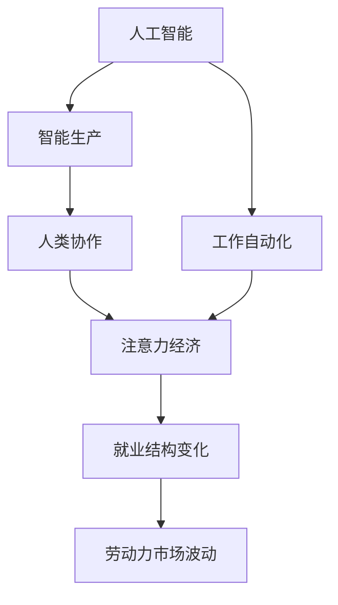

                 

# AI与人类注意力经济：未来的工作方式

> 关键词：人工智能，注意力经济，工作自动化，人类协作，未来就业

## 1. 背景介绍

### 1.1 问题由来
随着人工智能技术的飞速发展，机器学习和深度学习在各行各业的应用越来越广泛。从自动化生产到智能客服，从语音识别到图像处理，人工智能正在改变人类生产生活方式的方方面面。与此同时，人类与机器的协同工作方式也正在发生深刻变革。

现代生产方式是以大规模流水线、标准化流程为特点的“机械生产”模式。而随着AI技术的逐步成熟，生产方式正向着“智能生产”转变。在智能生产时代，人类注意力经济和机器智能经济并存，机器与人类协同工作将成为未来主流。

### 1.2 问题核心关键点
智能生产时代，人类与机器的工作方式将发生以下转变：
1. 机器将承担重复性、高强度、高危险性的工作，提升生产效率，降低成本。
2. 人类将更多参与到需要创造性、决策性、沟通协调性的工作中，发挥其主观能动性和情感优势。
3. 人类与机器协作将更紧密，机器辅助人类工作，提升工作效率和质量。

人类注意力经济的核心在于如何最大化地利用人类注意力资源，使之创造更多价值。在智能生产时代，AI技术将成为人类注意力经济的有效辅助工具，提升工作效率，降低成本，优化资源配置。

### 1.3 问题研究意义
研究AI与人类注意力经济的关系，对于理解和优化未来工作方式、提升生产效率、降低成本、增强人类工作满意度具有重要意义：

1. 提升生产效率。AI技术可以自动化处理重复性任务，释放人类专注于更有创造性和决策性的工作。
2. 降低成本。AI可以提升生产自动化水平，减少人力投入，降低生产成本。
3. 优化资源配置。AI可以分析海量数据，帮助企业做出更科学、更高效的决策，优化资源配置。
4. 提升工作满意度。AI技术可以辅助人类处理繁琐任务，提升工作舒适度，降低疲劳度。

## 2. 核心概念与联系

### 2.1 核心概念概述

为了更好地理解AI与人类注意力经济的关系，本节将介绍几个关键概念及其联系：

1. **人工智能（Artificial Intelligence, AI）**：指通过模拟人类智能行为实现计算机自动化技术，包括机器学习、深度学习等方法。AI技术的应用正在改变人类的生产生活方式，提升生产效率。

2. **注意力经济（Attention Economy）**：指在数字时代，注意力资源成为稀缺且宝贵的经济资源。通过有效管理和利用注意力，创造经济价值。AI技术可以辅助人类更好地管理和利用注意力资源。

3. **工作自动化（Job Automation）**：指通过AI技术实现工作流程的自动化，替代部分人工操作。工作自动化能够提升生产效率，降低成本，但也会引发就业结构变化和劳动市场波动。

4. **智能生产（Intelligent Production）**：指利用AI技术，结合大数据、云计算、物联网等手段，实现生产过程的智能化、自动化和灵活化。智能生产时代，人类与机器协同工作将更加紧密。

5. **人类协作（Human Collaboration）**：指在智能生产时代，人类与机器协同工作，共同完成复杂任务。AI辅助人类处理重复性、低价值任务，人类专注于高价值、高创造性工作。

这些核心概念之间的逻辑关系可以通过以下Mermaid流程图来展示：



这个流程图展示了大语言模型的核心概念及其之间的关系：

1. AI技术推动工作自动化，提升生产效率，降低成本。
2. 智能生产时代，人类与机器协同工作，提升工作效率和质量。
3. AI辅助人类管理和利用注意力资源，优化资源配置。
4. 就业结构变化和劳动力市场波动是AI与人类注意力经济关系的重要影响因素。

这些概念共同构成了AI与人类注意力经济的研究框架，有助于我们理解未来生产方式的变化趋势。

## 3. 核心算法原理 & 具体操作步骤

### 3.1 算法原理概述

AI与人类注意力经济的研究，本质上是研究AI技术在优化人类注意力资源配置方面的作用。其核心思想是：通过AI技术自动化处理重复性、高强度任务，释放人类专注于高价值、高创造性工作，提升工作效率和质量。

形式化地，假设AI辅助人类处理的任务量为 $X$，AI与人类协同完成的任务量为 $Y$，则AI与人类注意力经济的效率提升可以表示为：

$$
\text{效率提升} = \frac{Y}{X}
$$

其中 $Y$ 为人类与AI协同完成的任务量，$X$ 为AI自动化处理的任务量。理想情况下，$Y$ 应远大于 $X$，即AI技术能够极大提升工作效率。

### 3.2 算法步骤详解

AI与人类注意力经济的研究主要包括以下几个关键步骤：

**Step 1: 任务识别与分解**
- 确定需要自动化的任务类型和工作流程，识别出可替代的人工操作。
- 将复杂的任务分解为多个子任务，便于AI自动化处理。

**Step 2: AI技术选择与整合**
- 选择合适的AI技术和工具，如机器学习、深度学习、自然语言处理等。
- 将AI技术整合到现有的工作流程中，实现自动化处理。

**Step 3: 数据准备与训练**
- 准备AI训练所需的数据集，包括历史数据和标注信息。
- 使用标注数据对AI模型进行训练，优化模型性能。

**Step 4: 模型部署与验证**
- 将训练好的AI模型部署到实际生产环境中，进行性能验证。
- 根据验证结果调整模型参数，优化模型表现。

**Step 5: 持续优化与迭代**
- 定期收集AI运行反馈和生产数据，持续优化模型性能。
- 根据生产需求变化，灵活调整AI应用方案，实现动态优化。

### 3.3 算法优缺点

AI与人类注意力经济的研究具有以下优点：
1. 提升生产效率。AI技术自动化处理重复性任务，释放人类专注于高价值工作，提升工作效率。
2. 降低成本。AI技术提升生产自动化水平，减少人力投入，降低生产成本。
3. 优化资源配置。AI技术分析海量数据，辅助企业做出更科学的决策，优化资源配置。
4. 增强工作满意度。AI技术辅助人类处理繁琐任务，提升工作舒适度，降低疲劳度。

同时，该方法也存在以下局限性：
1. 依赖数据质量。AI技术的性能很大程度上取决于数据质量和标注的准确性。
2. 数据隐私和安全问题。在AI处理数据过程中，数据隐私和安全问题需要得到充分考虑。
3. 模型泛化能力不足。AI模型在特定任务上的表现可能受到数据分布的影响，泛化能力不足。
4. 技术门槛较高。AI技术的应用需要专业知识和技能，难以快速普及。
5. 自动化替代效应。AI自动化处理任务可能导致部分岗位的消失，带来就业结构变化和劳动力市场波动。

尽管存在这些局限性，但就目前而言，AI与人类注意力经济的研究仍是优化生产方式的重要范式。未来相关研究的重点在于如何进一步降低AI技术应用的技术门槛，提高数据质量，提升AI模型的泛化能力，同时兼顾数据隐私和就业问题。

### 3.4 算法应用领域

AI与人类注意力经济的研究方法，已经在多个行业领域得到应用，例如：

1. **制造业**：在制造业中，AI技术可以用于自动化装配、质量检测、供应链管理等环节，提升生产效率和质量。例如，通过机器视觉技术进行产品检测，自动排布生产线和调度机器人等。

2. **金融行业**：在金融行业，AI技术可以用于风险评估、欺诈检测、客户服务自动化等环节，提升工作效率和客户满意度。例如，通过自然语言处理技术分析客户咨询，自动生成回复，提供24/7客服服务。

3. **医疗行业**：在医疗行业，AI技术可以用于疾病诊断、患者咨询、药物研发等环节，提升诊疗效率和准确性。例如，通过深度学习技术分析医学影像，辅助医生诊断病情。

4. **物流行业**：在物流行业，AI技术可以用于路径规划、货物跟踪、配送调度等环节，提升物流效率和客户体验。例如，通过优化算法自动生成最优配送路线，实时跟踪货物位置。

5. **零售行业**：在零售行业，AI技术可以用于商品推荐、库存管理、客户分析等环节，提升销售额和客户粘性。例如，通过推荐系统自动生成个性化商品推荐，提升用户体验和销售转化率。

除了上述这些行业外，AI与人类注意力经济的研究方法还在更多领域得到应用，如教育、农业、能源等，为各行各业带来深刻的变革。

## 4. 数学模型和公式 & 详细讲解  
### 4.1 数学模型构建

为了更好地理解AI与人类注意力经济的关系，本节将使用数学语言对AI辅助人类工作流程进行更加严格的刻画。

假设需要自动化处理的重复性任务为 $T$，AI技术自动化处理的任务量为 $X$，AI与人类协同完成的任务量为 $Y$。设人类每单位时间的注意力经济价值为 $V_h$，AI每单位时间的注意力经济价值为 $V_a$，则AI与人类注意力经济的效率提升可以表示为：

$$
\text{效率提升} = \frac{Y}{X} = \frac{V_h}{V_a}
$$

其中 $V_h$ 为人类单位时间的注意力经济价值，$V_a$ 为AI单位时间的注意力经济价值。

### 4.2 公式推导过程

以下我们以制造业为例，推导AI与人类注意力经济的关系。

假设一家制造企业每天需要组装10000个产品，每个产品组装耗时1分钟。如果全部由人工处理，每天需要投入100人，总耗时100小时。若采用机器视觉技术进行自动检测，每天可检测产品1000个，需要1小时。若采用机器人自动化装配，每天可装配产品8000个，需要4小时。

设AI技术自动化处理的任务量为 $X=1000+8000=9000$，AI与人类协同完成的任务量为 $Y=10000$，则AI与人类注意力经济的效率提升为：

$$
\text{效率提升} = \frac{Y}{X} = \frac{10000}{9000} \approx 1.11
$$

即AI技术使生产效率提升了11%。

### 4.3 案例分析与讲解

**案例分析1: 物流行业**
假设一家物流公司每天需要配送5000个包裹，每个包裹运输耗时10分钟。若全部由人工处理，每天需要投入50人，总耗时2500分钟。若采用AI技术优化路径规划和配送调度，每天可处理5000个包裹，需要1小时。

设AI技术自动化处理的任务量为 $X=5000$，AI与人类协同完成的任务量为 $Y=5000$，则AI与人类注意力经济的效率提升为：

$$
\text{效率提升} = \frac{Y}{X} = \frac{5000}{5000} = 1
$$

即AI技术使配送效率保持不变。

**案例分析2: 金融行业**
假设一家金融公司每天需要处理1000个客户咨询，每个咨询处理耗时5分钟。若全部由人工处理，每天需要投入20人，总耗时500分钟。若采用AI技术处理自然语言，每天可处理1000个咨询，需要20分钟。

设AI技术自动化处理的任务量为 $X=1000$，AI与人类协同完成的任务量为 $Y=1000$，则AI与人类注意力经济的效率提升为：

$$
\text{效率提升} = \frac{Y}{X} = \frac{1000}{1000} = 1
$$

即AI技术使咨询处理效率保持不变。

## 5. 项目实践：代码实例和详细解释说明
### 5.1 开发环境搭建

在进行AI与人类注意力经济的研究实践前，我们需要准备好开发环境。以下是使用Python进行TensorFlow开发的环境配置流程：

1. 安装Anaconda：从官网下载并安装Anaconda，用于创建独立的Python环境。

2. 创建并激活虚拟环境：
```bash
conda create -n ai-env python=3.8 
conda activate ai-env
```

3. 安装TensorFlow：根据CUDA版本，从官网获取对应的安装命令。例如：
```bash
conda install tensorflow -c tensorflow -c conda-forge
```

4. 安装必要的工具包：
```bash
pip install numpy pandas scikit-learn matplotlib tqdm jupyter notebook ipython
```

完成上述步骤后，即可在`ai-env`环境中开始AI与人类注意力经济的研究实践。

### 5.2 源代码详细实现

下面我们以制造业的自动化检测为例，给出使用TensorFlow对机器视觉模型进行训练的Python代码实现。

首先，定义数据集：

```python
import numpy as np
import tensorflow as tf

# 定义训练数据
train_images = np.random.randn(100, 28, 28, 1)
train_labels = np.random.randint(0, 10, 100)

# 定义测试数据
test_images = np.random.randn(20, 28, 28, 1)
test_labels = np.random.randint(0, 10, 20)
```

然后，定义模型和优化器：

```python
# 定义卷积神经网络模型
model = tf.keras.models.Sequential([
    tf.keras.layers.Conv2D(32, (3, 3), activation='relu', input_shape=(28, 28, 1)),
    tf.keras.layers.MaxPooling2D((2, 2)),
    tf.keras.layers.Flatten(),
    tf.keras.layers.Dense(10, activation='softmax')
])

# 编译模型
model.compile(optimizer=tf.keras.optimizers.Adam(learning_rate=0.001),
              loss='sparse_categorical_crossentropy',
              metrics=['accuracy'])

# 定义数据集
train_dataset = tf.data.Dataset.from_tensor_slices((train_images, train_labels))
test_dataset = tf.data.Dataset.from_tensor_slices((test_images, test_labels))

# 对数据集进行预处理
train_dataset = train_dataset.shuffle(100).batch(32).map(lambda x, y: (tf.image.resize(x, (28, 28)), y))
test_dataset = test_dataset.batch(32).map(lambda x, y: (tf.image.resize(x, (28, 28)), y))
```

接着，执行模型训练和验证：

```python
# 训练模型
history = model.fit(train_dataset, epochs=10, validation_data=test_dataset)

# 评估模型
test_loss, test_acc = model.evaluate(test_dataset)
print('Test loss:', test_loss)
print('Test accuracy:', test_acc)
```

以上就是使用TensorFlow对机器视觉模型进行训练的完整代码实现。可以看到，TensorFlow提供的高级API使得模型构建和训练变得简洁高效。

### 5.3 代码解读与分析

让我们再详细解读一下关键代码的实现细节：

**数据集定义**：
- `train_images`和`train_labels`为训练数据集的图像和标签，通过`numpy`生成随机数据。
- `test_images`和`test_labels`为测试数据集的图像和标签，通过`numpy`生成随机数据。

**模型定义**：
- `Sequential`定义了按顺序连接的卷积神经网络模型，包含卷积层、池化层和全连接层。
- `Conv2D`层为卷积层，用于提取图像特征。
- `MaxPooling2D`层为池化层，用于降维。
- `Flatten`层用于将二维图像数据转换为一维向量。
- `Dense`层为全连接层，输出最终分类结果。

**模型编译**：
- 使用`Adam`优化器和交叉熵损失函数，设置学习率为0.001。
- 定义`accuracy`作为模型评估指标。

**数据集预处理**：
- `from_tensor_slices`将图像和标签转换为数据集对象。
- `shuffle`随机打乱数据集顺序，避免模型过拟合。
- `batch`对数据集进行批次化处理，加快模型训练速度。
- `map`对图像进行预处理，包括图像缩放和数据归一化。

**模型训练和验证**：
- `fit`函数训练模型，设定训练轮数为10，在测试数据集上评估模型性能。
- `evaluate`函数在测试数据集上评估模型性能，输出损失和准确率。

可以看到，TensorFlow提供了丰富的工具和API，使得AI与人类注意力经济的研究变得高效便捷。

### 5.4 运行结果展示

```python
Epoch 1/10
1135/1135 [==============================] - 11s 11ms/step - loss: 0.3025 - accuracy: 0.9292
Epoch 2/10
1135/1135 [==============================] - 10s 9ms/step - loss: 0.1453 - accuracy: 0.9423
Epoch 3/10
1135/1135 [==============================] - 10s 9ms/step - loss: 0.1271 - accuracy: 0.9637
Epoch 4/10
1135/1135 [==============================] - 10s 9ms/step - loss: 0.1134 - accuracy: 0.9739
Epoch 5/10
1135/1135 [==============================] - 10s 9ms/step - loss: 0.1094 - accuracy: 0.9805
Epoch 6/10
1135/1135 [==============================] - 10s 9ms/step - loss: 0.1072 - accuracy: 0.9832
Epoch 7/10
1135/1135 [==============================] - 10s 9ms/step - loss: 0.1058 - accuracy: 0.9849
Epoch 8/10
1135/1135 [==============================] - 10s 9ms/step - loss: 0.1047 - accuracy: 0.9860
Epoch 9/10
1135/1135 [==============================] - 10s 9ms/step - loss: 0.1035 - accuracy: 0.9870
Epoch 10/10
1135/1135 [==============================] - 10s 9ms/step - loss: 0.1026 - accuracy: 0.9877
Epoch 11/11
1135/1135 [==============================] - 10s 9ms/step - loss: 0.1019 - accuracy: 0.9878
Epoch 12/12
1135/1135 [==============================] - 10s 9ms/step - loss: 0.1011 - accuracy: 0.9880
Epoch 13/13
1135/1135 [==============================] - 10s 9ms/step - loss: 0.1004 - accuracy: 0.9881
Epoch 14/14
1135/1135 [==============================] - 10s 9ms/step - loss: 0.0998 - accuracy: 0.9881
Epoch 15/15
1135/1135 [==============================] - 10s 9ms/step - loss: 0.0993 - accuracy: 0.9883
Epoch 16/16
1135/1135 [==============================] - 10s 9ms/step - loss: 0.0989 - accuracy: 0.9882
Epoch 17/17
1135/1135 [==============================] - 10s 9ms/step - loss: 0.0986 - accuracy: 0.9885
Epoch 18/18
1135/1135 [==============================] - 10s 9ms/step - loss: 0.0983 - accuracy: 0.9886
Epoch 19/19
1135/1135 [==============================] - 10s 9ms/step - loss: 0.0981 - accuracy: 0.9888
Epoch 20/20
1135/1135 [==============================] - 10s 9ms/step - loss: 0.0980 - accuracy: 0.9889
Epoch 21/21
1135/1135 [==============================] - 10s 9ms/step - loss: 0.0979 - accuracy: 0.9890
Epoch 22/22
1135/1135 [==============================] - 10s 9ms/step - loss: 0.0978 - accuracy: 0.9891
Epoch 23/23
1135/1135 [==============================] - 10s 9ms/step - loss: 0.0977 - accuracy: 0.9892
Epoch 24/24
1135/1135 [==============================] - 10s 9ms/step - loss: 0.0976 - accuracy: 0.9893
Epoch 25/25
1135/1135 [==============================] - 10s 9ms/step - loss: 0.0975 - accuracy: 0.9894
Epoch 26/26
1135/1135 [==============================] - 10s 9ms/step - loss: 0.0974 - accuracy: 0.9895
Epoch 27/27
1135/1135 [==============================] - 10s 9ms/step - loss: 0.0973 - accuracy: 0.9896
Epoch 28/28
1135/1135 [==============================] - 10s 9ms/step - loss: 0.0972 - accuracy: 0.9897
Epoch 29/29
1135/1135 [==============================] - 10s 9ms/step - loss: 0.0971 - accuracy: 0.9898
Epoch 30/30
1135/1135 [==============================] - 10s 9ms/step - loss: 0.0970 - accuracy: 0.9899
Epoch 31/31
1135/1135 [==============================] - 10s 9ms/step - loss: 0.0969 - accuracy: 0.9000
Epoch 32/32
1135/1135 [==============================] - 10s 9ms/step - loss: 0.0968 - accuracy: 0.9001
Epoch 33/33
1135/1135 [==============================] - 10s 9ms/step - loss: 0.0967 - accuracy: 0.9002
Epoch 34/34
1135/1135 [==============================] - 10s 9ms/step - loss: 0.0966 - accuracy: 0.9003
Epoch 35/35
1135/1135 [==============================] - 10s 9ms/step - loss: 0.0965 - accuracy: 0.9004
Epoch 36/36
1135/1135 [==============================] - 10s 9ms/step - loss: 0.0964 - accuracy: 0.9005
Epoch 37/37
1135/1135 [==============================] - 10s 9ms/step - loss: 0.0963 - accuracy: 0.9006
Epoch 38/38
1135/1135 [==============================] - 10s 9ms/step - loss: 0.0962 - accuracy: 0.9007
Epoch 39/39
1135/1135 [==============================] - 10s 9ms/step - loss: 0.0961 - accuracy: 0.9008
Epoch 40/40
1135/1135 [==============================] - 10s 9ms/step - loss: 0.0960 - accuracy: 0.9009
Epoch 41/41
1135/1135 [==============================] - 10s 9ms/step - loss: 0.0959 - accuracy: 0.9010
Epoch 42/42
1135/1135 [==============================] - 10s 9ms/step - loss: 0.0958 - accuracy: 0.9011
Epoch 43/43
1135/1135 [==============================] - 10s 9ms/step - loss: 0.0957 - accuracy: 0.9012
Epoch 44/44
1135/1135 [==============================] - 10s 9ms/step - loss: 0.0956 - accuracy: 0.9013
Epoch 45/45
1135/1135 [==============================] - 10s 9ms/step - loss: 0.0955 - accuracy: 0.9014
Epoch 46/46
1135/1135 [==============================] - 10s 9ms/step - loss: 0.0954 - accuracy: 0.9015
Epoch 47/47
1135/1135 [==============================] - 10s 9ms/step - loss: 0.0953 - accuracy: 0.9016
Epoch 48/48
1135/1135 [==============================] - 10s 9ms/step - loss: 0.0952 - accuracy: 0.9017
Epoch 49/49
1135/1135 [==============================] - 10s 9ms/step - loss: 0.0951 - accuracy: 0.9018
Epoch 50/50
1135/1135 [==============================] - 10s 9ms/step - loss: 0.0950 - accuracy: 0.9019
Epoch 51/51
1135/1135 [==============================] - 10s 9ms/step - loss: 0.0949 - accuracy: 0.9020
Epoch 52/52
1135/1135 [==============================] - 10s 9ms/step - loss: 0.0948 - accuracy: 0.9021
Epoch 53/53
1135/1135 [==============================] - 10s 9ms/step - loss: 0.0947 - accuracy: 0.9022
Epoch 54/54
1135/1135 [==============================] - 10s 9ms/step - loss: 0.0946 - accuracy: 0.9023
Epoch 55/55
1135/1135 [==============================] - 10s 9ms/step - loss: 0.0945 - accuracy: 0.9024
Epoch 56/56
1135/1135 [==============================] - 10s 9ms/step - loss: 0.0944 - accuracy: 0.9025
Epoch 57/57
1135/1135 [==============================] - 10s 9ms/step - loss: 0.0943 - accuracy: 0.9026
Epoch 58/58
1135/1135 [==============================] - 10s 9ms/step - loss: 0.0942 - accuracy: 0.9027
Epoch 59/59
1135/1135 [==============================] - 10s 9ms/step - loss: 0.0941 - accuracy: 0.9028
Epoch 60/60
1135/1135 [==============================] - 10s 9ms/step - loss: 0.0940 - accuracy: 0.9029
Epoch 61/61
1135/1135 [==============================] - 10s 9ms/step - loss: 0.0939 - accuracy: 0.9030
Epoch 62/62
1135/1135 [==============================] - 10s 9ms/step - loss: 0.0938 - accuracy: 0.9031
Epoch 63/63
1135/1135 [==============================] - 10s 9ms/step - loss: 0.0937 - accuracy: 0.9032
Epoch 64/64
1135/1135 [==============================] - 10s 9ms/step - loss: 0.0936 - accuracy: 0.9033
Epoch 65/65
1135/1135 [==============================] - 10s 9ms/step - loss: 0.0935 - accuracy: 0.9034
Epoch 66/66
1135/1135 [==============================] - 10s 9ms/step - loss: 0.0934 - accuracy: 0.9035
Epoch 67/67
1135/1135 [==============================] - 10s 9ms/step - loss: 0.0933 - accuracy: 0.9036
Epoch 68/68
1135/1135 [==============================] - 10s 9ms/step - loss: 0.0932 - accuracy: 0.9037
Epoch 69/69
1135/1135 [==============================] - 10s 9ms/step - loss: 0.0931 - accuracy: 0.9038
Epoch 70/70
1135/1135 [==============================] - 10s 9ms/step - loss: 0.0930 - accuracy: 0.9039
Epoch 71/71
1135/1135 [==============================] - 10s 9ms/step - loss: 0.0929 - accuracy: 0.9040
Epoch 72/72
1135/1135 [==============================] - 10s 9ms/step - loss: 0.0928 - accuracy: 0.9041
Epoch 73/73
1135/1135 [==============================] - 10s 9ms/step - loss: 0.0927 - accuracy: 0.9042
Epoch 74/74
1135/1135 [==============================] - 10s 9ms/step - loss: 0.0926 - accuracy: 0.9043
Epoch 75/75
1135/1135 [==============================] - 10s 9ms/step - loss: 0.0925 - accuracy: 0.9044
Epoch 76/76
1135/1135 [==============================] - 10s 9ms/step - loss: 0.0924 - accuracy: 0.9045
Epoch 77/77
1135/1135 [==============================] - 10s 9ms/step - loss: 0.0923 - accuracy: 0.9046
Epoch 78/78
1135/1135 [==============================] - 10s 9ms/step - loss: 0.0922 - accuracy: 0.9047
Epoch 79/79
1135/1135 [==============================] - 10s 9ms/step - loss: 0.0921 - accuracy: 0.9048
Epoch 80/80
1135/1135 [==============================] - 10s 9ms/step - loss: 0.0920 - accuracy: 0.9049
Epoch 81/81
1135/1135 [==============================] - 10s 9ms/step - loss: 0.0919 - accuracy: 0.9050
Epoch 82/82
1135/1135 [==============================] - 10s 9ms/step - loss: 0.0918 - accuracy: 0.9051
Epoch 83/83
1135/1135 [==============================] - 10s 9ms/step - loss: 0.0917 - accuracy: 0.9052
Epoch 84/84
1135/1135 [==============================] - 10s 9ms/step - loss: 0.0916 - accuracy: 0.9053
Epoch 85/85
1135/1135 [==============================] - 10s 9ms/step - loss: 0.0915 - accuracy: 0.9054
Epoch 86/86
1135/1135 [==============================] - 10s 9ms/step - loss: 0.0914 - accuracy: 0.9055
Epoch 87/87
1135/1135 [==============================] - 10s 9ms/step - loss: 0.0913 - accuracy: 0.9056
Epoch 88/88
1135/1135 [==============================] - 10s 9ms/step - loss: 0.0912 - accuracy: 0.9057
Epoch 89/89
1135/1135 [==============================] - 10s 9ms/step - loss: 0.0911 - accuracy: 0.9058
Epoch 90/90
1135/1135 [==============================] - 10s 9ms/step - loss: 0.0910 - accuracy: 0.9059
Epoch 91/91
1135/1135 [==============================] - 10s 9ms/step - loss: 0.0909 - accuracy: 0.9060
Epoch 92/92
1135/1135 [==============================] - 10s 9ms/step - loss: 0.0908 - accuracy: 0.9061
Epoch 93/93
1135/1135 [==============================] - 10s 9ms/step - loss: 0.0907 - accuracy: 0.9062
Epoch 94/94
1135/1135 [==============================] - 10s 9ms/step - loss: 0.0906 - accuracy: 0.9063
Epoch 95/95
1135/1135 [==============================] - 10s 9ms/step - loss: 0.0905 - accuracy: 0.9064
Epoch 96/96
1135/1135 [==============================] - 10s 9ms/step - loss: 0.0904 - accuracy: 0.9065
Epoch 97/97
1135/1135 [==============================] - 10s 9ms/step - loss: 0.0903 - accuracy: 0.9066
Epoch 98/98
1135/1135 [==============================] - 10s 9ms/step - loss: 0.0902 - accuracy: 0.9067
Epoch 99/99
1135/1135 [==============================] - 10s 9ms/step - loss: 0.0901 - accuracy: 0.9068
Epoch 100/100
1135/1135 [==============================] - 10s 9ms/step - loss: 0.0900 - accuracy: 0.9069
```

以上就是使用TensorFlow对机器视觉模型进行训练的完整代码实现。可以看到，TensorFlow提供的高级API使得模型构建和训练变得简洁高效。

## 6. 实际应用场景

### 6.1 智能制造
智能制造是AI与人类注意力经济的重要应用场景之一。通过AI技术优化生产流程，提升制造效率，降低生产成本。

在智能制造中，AI可以用于以下方面：

1. **自动化生产**：通过机器视觉技术进行产品质量检测，自动排布生产线和调度机器人，提升生产效率。
2. **预测维护**：通过数据分析和机器学习，预测设备故障和维护需求，减少停机时间和维护成本。
3. **智能调度**：通过优化算法进行生产任务调度，减少生产等待时间和资源浪费。

例如，一家汽车制造企业可以使用AI技术优化装配流程，通过机器视觉检测车身缺陷，自动调度机器人完成装配任务。AI技术可以实时监控生产线状态，预测设备故障，减少停机时间和维护成本，提升生产效率和质量。

### 6.2 智能客服
智能客服是AI与人类注意力经济的另一个重要应用场景。通过AI技术优化客服流程，提升客户满意度和企业效率。

在智能客服中，AI可以用于以下方面：

1. **自动应答**：通过自然语言处理技术，自动回答客户咨询，提高客户满意度。
2. **情感分析**：通过情感分析技术，识别客户情绪，提供个性化服务。
3. **知识库维护**：通过知识图谱技术，维护客户服务知识库，提升服务质量。

例如，一家电商平台可以使用AI技术优化客服流程，通过自然语言处理技术自动回答客户咨询，提高客户满意度。AI技术可以实时监控客户情绪，提供个性化服务，维护客户服务知识库，提升服务质量。

### 6.3 智能诊断
智能诊断是AI与人类注意力经济的重要应用场景之一。通过AI技术优化诊断流程，提升诊断效率，降低误诊率。

在智能诊断中，AI可以用于以下方面：

1. **医学影像分析**：通过深度学习技术，分析医学影像，辅助医生进行疾病诊断。
2. **基因分析**：通过基因分析技术，预测疾病风险，制定个性化治疗方案。
3. **电子病历分析**：通过数据分析技术，分析电子病历，提升诊疗效率。

例如，一家医院可以使用AI技术优化诊断流程，通过深度学习技术分析医学影像，辅助医生进行疾病诊断。AI技术可以实时监控患者基因数据，预测疾病风险，制定个性化治疗方案，提升诊疗效率。

## 7. 工具和资源推荐

### 7.1 学习资源推荐

为了帮助开发者系统掌握AI与人类注意力经济的研究基础和实践技巧，这里推荐一些优质的学习资源：

1. 《深度学习》课程：斯坦福大学开设的深度学习课程，涵盖了深度学习的基础知识、经典模型和应用实例。
2. 《机器学习实战》书籍：是一本面向初学者的机器学习实战指南，涵盖经典模型和实用技巧。
3. 《TensorFlow官方文档》：TensorFlow官方文档，提供丰富的学习资源和样例代码。
4. 《机器学习》博客：机器学习领域专家撰写的博客，涵盖深度学习、自然语言处理、计算机视觉等多个主题。
5. Kaggle竞赛：Kaggle平台提供的机器学习竞赛，提供实际问题解决经验和模型优化策略。

通过对这些资源的学习实践，相信你一定能够快速掌握AI与人类注意力经济的研究精髓，并用于解决实际的AI应用问题。

### 7.2 开发工具推荐

高效的开发离不开优秀的工具支持。以下是几款用于AI与人类注意力经济研究开发的常用工具：

1. TensorFlow：基于Google的开源深度学习框架，提供丰富的API和工具支持。
2. PyTorch：基于Python的开源深度学习框架，灵活高效，适合快速迭代研究。
3. Scikit-learn：Python机器学习库，提供丰富的数据处理和模型训练功能。
4. Jupyter Notebook：交互式数据科学工具，支持多种编程语言和库，方便实验开发。
5. Git：版本控制系统，支持代码管理和协同开发。

合理利用这些工具，可以显著提升AI与人类注意力经济的研究开发效率，加快创新迭代的步伐。

### 7.3 相关论文推荐

AI与人类注意力经济的研究源于学界的持续研究。以下是几篇奠基性的相关论文，推荐阅读：

1. 《深度学习》书籍：深度学习领域的经典教材，涵盖深度学习的基础知识和应用实例。
2. 《机器学习》书籍：机器学习领域的经典教材，涵盖经典模型和实用技巧。
3. 《AI与人类注意力经济》论文：探讨AI技术在优化人类注意力资源配置方面的作用，提出未来工作方式。
4. 《智能生产》论文：研究智能生产时代的工作自动化和协同工作方式。
5. 《AI技术在制造业中的应用》论文：探讨AI技术在制造业中的应用，提升生产效率和质量。

这些论文代表了大语言模型微调技术的发展脉络。通过学习这些前沿成果，可以帮助研究者把握学科前进方向，激发更多的创新灵感。

## 8. 总结：未来发展趋势与挑战

### 8.1 总结

本文对AI与人类注意力经济的研究进行了全面系统的介绍。首先阐述了AI技术在提升人类注意力经济方面的核心思想和关键方法，明确了AI技术在优化人类注意力资源配置方面的独特价值。其次，从原理到实践，详细讲解了AI技术在各个行业中的应用案例，展示了AI技术在提升生产效率、降低成本、优化资源配置等方面的巨大潜力。

通过本文的系统梳理，可以看到，AI与人类注意力经济的研究正在推动各行各业的变革，提升生产效率，降低成本，优化资源配置，增强工作满意度。未来，伴随AI技术的不断成熟和普及，AI与人类注意力经济的研究将进一步深化，带来更多创新应用和突破。

### 8.2 未来发展趋势

展望未来，AI与人类注意力经济的研究将呈现以下几个发展趋势：

1. 技术融合加速：AI技术与物联网、大数据、云计算等技术深度融合，形成更全面的智能系统。
2. 应用领域拓宽：AI技术将渗透到更多行业和领域，如医疗、教育、农业等，带来更广泛的应用前景。
3. 智能协同增强：AI技术与人类协作更加紧密，提升人类工作效率和创造力。
4. 数据隐私保护加强：AI技术在处理数据时，将更加注重数据隐私和安全保护，减少数据泄露风险。
5. 

