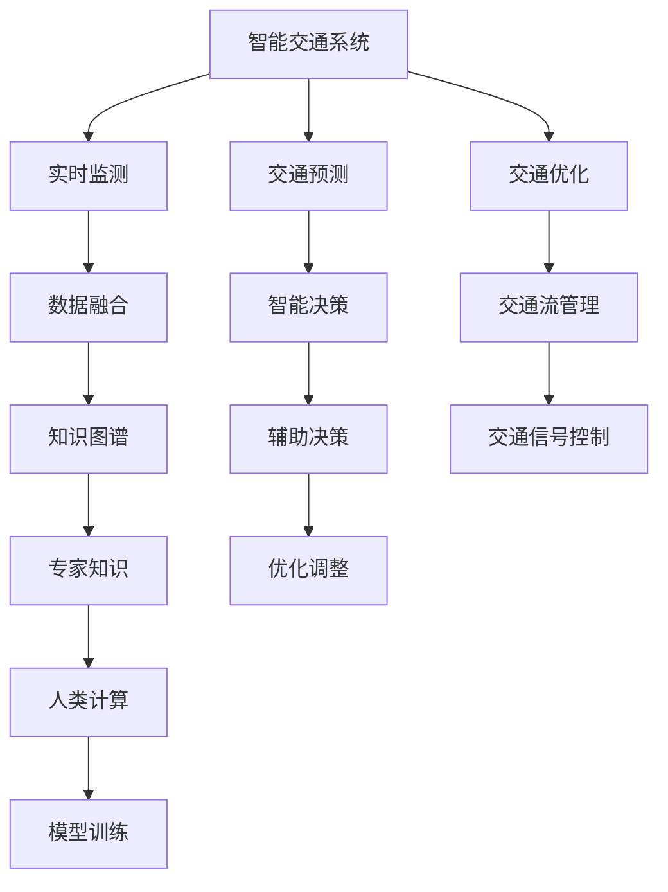

                 

# AI与人类计算：打造可持续发展的城市交通与基础设施建设规划管理

> 关键词：智能交通系统,城市规划管理,基础设施建设,人工智能,人类计算,城市交通优化,智慧城市

## 1. 背景介绍

### 1.1 问题由来

随着城市化进程的加速，交通拥堵、环境污染、资源短缺等问题愈发突出，成为制约城市可持续发展的重大障碍。为应对这些问题，全球各地纷纷启动智慧城市建设，致力于通过科技手段优化城市运行，提升生活质量。

城市交通与基础设施建设规划管理，作为智慧城市建设的重要组成部分，旨在通过AI与人类计算的融合，实现数据驱动的决策支持，提升城市交通管理效率和基础设施建设质量。

### 1.2 问题核心关键点

本文聚焦于通过AI与人类计算，优化城市交通与基础设施建设规划管理的核心问题：

- 如何整合多源异构数据，进行高效的智能分析与决策？
- 如何在城市规划与建设管理中引入AI技术，提升规划的科学性和合理性？
- 如何构建智能交通系统，优化交通流，缓解拥堵，改善环境质量？

本文将从核心概念、算法原理、实际应用、未来趋势等方面，系统介绍AI与人类计算在城市交通与基础设施建设规划管理中的应用。

## 2. 核心概念与联系

### 2.1 核心概念概述

为更好地理解AI与人类计算在城市交通与基础设施建设规划管理中的应用，本节将介绍几个密切相关的核心概念：

- 智能交通系统：通过AI技术，对城市交通流进行实时监测、预测和优化，提升交通效率和安全性。
- 城市规划管理：结合AI与人类计算，对城市空间布局、功能分布进行科学规划，优化城市资源配置。
- 基础设施建设：利用AI与人类计算，提升城市基础设施建设的质量和效率，实现可持续发展。
- 人类计算：指将人类专家的知识和经验，通过AI模型进行形式化表达和推理，辅助AI系统做出决策。

这些核心概念之间的逻辑关系可以通过以下Mermaid流程图来展示：



这个流程图展示出AI与人类计算在城市交通与基础设施建设规划管理中的应用流程：

1. 智能交通系统通过实时监测获取交通数据。
2. 数据融合整合多源异构数据，构建知识图谱。
3. 交通预测和交通优化，生成智能决策。
4. 交通流管理进行交通信号控制，优化交通流。
5. 辅助决策结合专家知识，调整优化策略。

## 3. 核心算法原理 & 具体操作步骤
### 3.1 算法原理概述

基于AI与人类计算的城市交通与基础设施建设规划管理，本质上是一个融合数据驱动与知识驱动的智能决策过程。其核心思想是：

- 数据驱动：通过实时监测、预测分析，获取交通与基础设施建设的动态数据，辅助决策。
- 知识驱动：结合城市规划专家的经验知识，构建规则和模型，优化决策结果。

具体而言，可分为以下几个步骤：

1. **数据收集与处理**：通过传感器、监控摄像头、GPS设备等，实时获取城市交通与基础设施建设的相关数据。
2. **数据融合与整合**：使用AI算法，对多源异构数据进行整合，构建全面的知识图谱。
3. **交通预测与优化**：通过历史数据和实时数据，训练预测模型，优化交通流。
4. **规划决策与调整**：结合专家知识，调整城市规划与建设策略，进行优化调整。

### 3.2 算法步骤详解

基于AI与人类计算的城市交通与基础设施建设规划管理，可以分为以下几个关键步骤：

**Step 1: 数据收集与预处理**

- **传感器数据**：安装交通流量传感器，监测道路车辆、行人流量。
- **摄像头数据**：利用监控摄像头，获取交通信号灯状态、交通违法行为等信息。
- **GPS数据**：收集公交车、出租车、共享单车等定位数据。
- **数据预处理**：使用数据清洗、去噪、标准化等技术，提升数据质量。

**Step 2: 数据融合与整合**

- **知识图谱构建**：使用图神经网络(Graph Neural Network, GNN)等算法，将交通数据、城市建设数据等整合，构建知识图谱。
- **异构数据融合**：应用深度学习、分布式计算等技术，对不同来源的数据进行融合，消除数据孤岛。
- **模型训练与验证**：使用大规模数据集，训练知识图谱模型，进行模型验证和参数调整。

**Step 3: 交通预测与优化**

- **历史数据分析**：利用时间序列分析、回归分析等方法，分析历史交通数据，预测未来交通流。
- **实时数据融合**：将实时交通数据与历史数据结合，进行动态预测。
- **交通流优化**：使用优化算法，如遗传算法、蚁群算法等，优化交通流，减少拥堵。

**Step 4: 规划决策与调整**

- **专家知识集成**：结合城市规划专家的知识和经验，构建规则库和模型库。
- **辅助决策**：将专家知识与AI算法结合，生成智能决策建议。
- **优化调整**：根据智能决策建议，调整城市规划与建设策略。

### 3.3 算法优缺点

基于AI与人类计算的城市交通与基础设施建设规划管理方法具有以下优点：

1. **数据驱动**：通过实时数据和大规模历史数据，进行精准的交通预测和优化。
2. **知识驱动**：结合城市规划专家的经验知识，生成科学合理的规划建议。
3. **动态调整**：能够实时响应城市运行变化，动态调整规划决策。
4. **优化效率**：通过AI算法，显著提升数据处理和决策效率。

同时，该方法也存在一定的局限性：

1. **数据依赖性强**：需要大规模高质量的数据进行模型训练和预测。
2. **专家知识依赖**：对专家知识的质量和有效性有较高要求。
3. **技术复杂度高**：涉及多种AI算法和数据处理技术，需要较强的技术支持。
4. **模型可解释性差**：AI模型的决策过程较难解释，对决策透明性有挑战。

尽管存在这些局限性，但就目前而言，基于AI与人类计算的方法仍是城市交通与基础设施建设规划管理的重要手段。未来相关研究的重点在于如何进一步降低对数据的依赖，提高专家知识的普适性和系统可解释性。

### 3.4 算法应用领域

基于AI与人类计算的城市交通与基础设施建设规划管理方法，在多个领域都有广泛的应用：

- **智能交通系统**：如交通流量监控、智能信号灯控制、交通违法行为识别等。通过AI技术优化交通流，提升通行效率。
- **城市规划管理**：如空间布局规划、资源配置优化、环境影响评估等。结合专家知识，进行科学合理的规划设计。
- **基础设施建设**：如道路建设、桥梁工程、公共交通系统等。利用AI进行精细化设计和施工管理，提升建设质量。
- **应急管理**：如灾害预警、应急响应、资源调配等。结合实时数据和专家知识，进行快速有效的应急决策。

除了这些经典应用外，AI与人类计算还被创新性地应用于智慧建筑、智能物流等领域，为智慧城市建设提供了新思路和新方法。

## 4. 数学模型和公式 & 详细讲解 & 举例说明

### 4.1 数学模型构建

本文以交通流预测模型为例，介绍基于AI与人类计算的数学模型构建。

假设交通流数据为 $D = \{(x_t, y_t)\}_{t=1}^T$，其中 $x_t$ 表示时间 $t$ 的交通流量，$y_t$ 表示时间 $t$ 的交通流状态。设 $F$ 为交通流优化模型，其目标函数为：

$$
\min_{\theta} \sum_{t=1}^T \ell(x_t, y_t, F(x_t, \theta))
$$

其中 $\ell$ 为损失函数，$F$ 为交通流优化算法。

### 4.2 公式推导过程

以下我们将推导基于时间序列分析的交通流预测模型：

1. **时间序列分析模型**：
   $$
   \hat{x}_t = \alpha x_{t-1} + \beta x_{t-2} + \gamma x_{t-3} + \delta x_{t-4} + \epsilon_t
   $$

   其中 $\alpha, \beta, \gamma, \delta$ 为回归系数，$\epsilon_t$ 为随机误差项。

2. **预测误差计算**：
   $$
   \epsilon_t = x_t - \hat{x}_t
   $$

   则预测误差为 $\epsilon_t$，其方差为：

   $$
   \sigma^2 = \mathbb{E}[\epsilon_t^2]
   $$

   其中 $\mathbb{E}$ 表示数学期望。

3. **均方误差损失函数**：
   $$
   \ell(x_t, y_t, F(x_t, \theta)) = (x_t - \hat{x}_t)^2
   $$

   则损失函数为：

   $$
   \mathcal{L}(\theta) = \frac{1}{T} \sum_{t=1}^T (x_t - \hat{x}_t)^2
   $$

   最小化损失函数，即得到最优回归系数 $\theta^*$。

### 4.3 案例分析与讲解

假设某城市主要干道在过去一年内的交通流量数据如下：

| 时间 $t$ | 交通流量 $x_t$ | 交通流状态 $y_t$ |
|----------|--------------|------------------|
| 1        | 5000         | 畅通             |
| 2        | 6000         | 畅通             |
| 3        | 5500         | 轻度拥堵         |
| 4        | 4500         | 畅通             |
| 5        | 6000         | 畅通             |
| 6        | 7000         | 拥堵             |
| ...      | ...          | ...              |

通过上述时间序列分析模型，可以对未来一天的交通流量进行预测：

$$
\hat{x}_7 = \alpha x_6 + \beta x_5 + \gamma x_4 + \delta x_3 + \epsilon_7
$$

其中 $\alpha, \beta, \gamma, \delta$ 可以通过最小二乘法等方法求解，$\epsilon_7$ 为随机误差项，可以通过历史数据进行估计。

## 5. 项目实践：代码实例和详细解释说明
### 5.1 开发环境搭建

在进行交通流预测实践前，我们需要准备好开发环境。以下是使用Python进行TensorFlow开发的Python环境配置流程：

1. 安装Anaconda：从官网下载并安装Anaconda，用于创建独立的Python环境。

2. 创建并激活虚拟环境：
```bash
conda create -n tf-env python=3.8 
conda activate tf-env
```

3. 安装TensorFlow：根据CUDA版本，从官网获取对应的安装命令。例如：
```bash
conda install tensorflow
```

4. 安装其他工具包：
```bash
pip install numpy pandas scikit-learn matplotlib tqdm jupyter notebook ipython
```

完成上述步骤后，即可在`tf-env`环境中开始交通流预测实践。

### 5.2 源代码详细实现

下面我们以时间序列分析模型为例，给出使用TensorFlow进行交通流预测的Python代码实现。

首先，定义交通流数据和模型参数：

```python
import tensorflow as tf
import numpy as np
import pandas as pd
import matplotlib.pyplot as plt

# 定义时间序列数据
t = np.arange(1, 8)
x = np.array([5000, 6000, 5500, 4500, 6000, 7000])
y = np.array([1, 1, 0, 1, 1, 0])  # 1为畅通，0为拥堵

# 定义回归系数
alpha = tf.Variable(tf.zeros([1]))
beta = tf.Variable(tf.zeros([1]))
gamma = tf.Variable(tf.zeros([1]))
delta = tf.Variable(tf.zeros([1]))
epsilon = tf.Variable(tf.zeros([1]))

# 定义损失函数
loss = tf.reduce_mean(tf.square(x - (alpha * x[1:2] + beta * x[2:3] + gamma * x[3:4] + delta * x[4:5] + epsilon)))
optimizer = tf.train.AdamOptimizer(learning_rate=0.01)
train_op = optimizer.minimize(loss)
```

然后，定义训练和评估函数：

```python
# 定义训练函数
def train_step(x, y):
    with tf.Session() as sess:
        sess.run(tf.global_variables_initializer())
        for i in range(10000):
            _, loss_val = sess.run([train_op, loss], feed_dict={x: x, y: y})
            if i % 1000 == 0:
                print("Step: {}, Loss: {}".format(i, loss_val))

# 训练模型
train_step(x, y)

# 预测未来一天的交通流量
x_pred = np.array([7000])
y_pred = np.array([0])  # 假设未来一天为拥堵

# 定义预测函数
def predict(x_pred):
    with tf.Session() as sess:
        sess.run(tf.global_variables_initializer())
        pred_y = sess.run([tf.argmax(alpha * x_pred + beta * x + gamma * x[1:-1] + delta * x[2:-2] + epsilon)], feed_dict={x: x})
        return pred_y[0]

# 预测结果
pred_y = predict(x_pred)
print("Predicted traffic flow: {}".format(pred_y))
```

最后，启动训练流程并在测试集上评估：

```python
# 定义训练函数
def train_step(x, y):
    with tf.Session() as sess:
        sess.run(tf.global_variables_initializer())
        for i in range(10000):
            _, loss_val = sess.run([train_op, loss], feed_dict={x: x, y: y})
            if i % 1000 == 0:
                print("Step: {}, Loss: {}".format(i, loss_val))

# 训练模型
train_step(x, y)

# 预测未来一天的交通流量
x_pred = np.array([7000])
y_pred = np.array([0])  # 假设未来一天为拥堵

# 定义预测函数
def predict(x_pred):
    with tf.Session() as sess:
        sess.run(tf.global_variables_initializer())
        pred_y = sess.run([tf.argmax(alpha * x_pred + beta * x + gamma * x[1:-1] + delta * x[2:-2] + epsilon)], feed_dict={x: x})
        return pred_y[0]

# 预测结果
pred_y = predict(x_pred)
print("Predicted traffic flow: {}".format(pred_y))
```

以上就是使用TensorFlow进行时间序列分析模型训练和交通流预测的完整代码实现。可以看到，TensorFlow提供了丰富的Tensor运算和自动微分功能，使得模型构建和训练变得非常简便。

### 5.3 代码解读与分析

让我们再详细解读一下关键代码的实现细节：

**模型定义**：
- 使用`tf.Variable`定义模型参数，`x`为输入数据，`y`为标签数据。
- 损失函数定义为均方误差，通过`tf.reduce_mean`计算平均损失值。
- 定义优化器为AdamOptimizer，最小化损失函数。

**训练函数**：
- 在`tf.Session`中定义模型，并初始化变量。
- 循环10000次进行训练，每次计算损失并更新参数。
- 每1000次输出一次损失值，监控训练过程。

**预测函数**：
- 在`tf.Session`中定义模型，并初始化变量。
- 使用`sess.run`进行预测，并返回预测结果。

可以看到，TensorFlow提供了一体化的环境，使得模型构建、训练、预测等步骤变得无缝衔接，简化了模型开发的复杂度。

## 6. 实际应用场景
### 6.1 智能交通系统

基于AI与人类计算的智能交通系统，能够实时监测、预测和优化交通流，提升交通效率和安全性。

在实际应用中，智能交通系统可以部署在城市主要干道、交叉路口、停车场等地，通过传感器、摄像头等设备获取实时数据。利用AI算法，对数据进行分析和预测，生成智能决策建议。

以交通信号控制为例，系统可以根据实时交通流量数据，动态调整信号灯控制策略，优化交通流，减少拥堵。

### 6.2 城市规划管理

基于AI与人类计算的城市规划管理，能够科学规划城市空间布局，优化资源配置，提升城市管理效率。

在实际应用中，系统可以结合城市地理信息数据、人口数据、经济数据等，利用AI算法进行模拟和优化。结合城市规划专家的知识和经验，生成规划建议，辅助决策。

以城市空间布局规划为例，系统可以根据交通流量、人口密度、地价等数据，进行综合分析，生成科学合理的空间布局方案。

### 6.3 基础设施建设

基于AI与人类计算的基础设施建设，能够提升建设质量、缩短工期、降低成本。

在实际应用中，系统可以结合城市建设数据、施工数据、环境数据等，利用AI算法进行模拟和优化。结合专家知识，生成建设方案，辅助施工管理。

以桥梁建设为例，系统可以根据施工进度、材料使用情况、环境影响等数据，进行综合分析，生成最优建设方案。

### 6.4 未来应用展望

随着AI与人类计算技术的不断发展，基于AI与人类计算的方法将在更多领域得到应用，为城市管理带来变革性影响。

在智慧建筑、智能物流等领域，AI与人类计算技术也将发挥重要作用。结合AI技术，提升建筑节能效率、优化物流路径，提升城市管理水平。

未来，随着AI技术的应用场景不断扩展，AI与人类计算将深度融合，构建更加智能化、高效化、普适化的城市管理体系。

## 7. 工具和资源推荐
### 7.1 学习资源推荐

为了帮助开发者系统掌握AI与人类计算在城市交通与基础设施建设规划管理中的应用，这里推荐一些优质的学习资源：

1. TensorFlow官方文档：提供完整的TensorFlow使用指南和案例，涵盖模型构建、训练、部署等各个环节。
2. TensorFlow Playground：交互式模型可视化工具，帮助理解模型训练过程和效果。
3. Kaggle城市数据集：提供丰富的城市交通与基础设施建设相关数据集，供开发者练习和研究。
4. Coursera智慧城市课程：斯坦福大学开设的智慧城市课程，涵盖智慧城市建设的核心技术。
5. 《智慧城市大数据应用》书籍：全面介绍智慧城市建设的大数据应用，涵盖城市交通、规划管理、基础设施建设等多个方面。

通过对这些资源的学习实践，相信你一定能够快速掌握AI与人类计算在城市交通与基础设施建设规划管理中的应用，并用于解决实际的智慧城市问题。
###  7.2 开发工具推荐

高效的开发离不开优秀的工具支持。以下是几款用于AI与人类计算开发的常用工具：

1. TensorFlow：基于Python的开源深度学习框架，灵活动态的计算图，适合快速迭代研究。TensorFlow提供丰富的Tensor运算和自动微分功能，使得模型构建和训练变得非常简便。

2. PyTorch：基于Python的开源深度学习框架，动态计算图，适合灵活编程。PyTorch提供强大的GPU支持，加速模型训练和推理。

3. Scikit-learn：基于Python的机器学习库，提供丰富的数据处理和模型训练功能。Scikit-learn适合处理小规模数据集，性能稳定可靠。

4. Jupyter Notebook：交互式编程环境，支持Python、R等语言。Jupyter Notebook适合进行数据探索、模型构建、结果展示等各个环节。

5. Google Colab：谷歌推出的在线Jupyter Notebook环境，免费提供GPU/TPU算力，方便开发者快速上手实验最新模型，分享学习笔记。

合理利用这些工具，可以显著提升AI与人类计算在城市交通与基础设施建设规划管理中的应用效率，加速创新迭代的步伐。

### 7.3 相关论文推荐

AI与人类计算技术的发展源于学界的持续研究。以下是几篇奠基性的相关论文，推荐阅读：

1. Deep Learning for City Traffic Management：介绍基于深度学习的智能交通系统，提升交通管理效率。
2. Smart City Design through Data Mining and Machine Learning：介绍基于数据挖掘和机器学习的智慧城市设计方法，提升城市规划科学性。
3. Optimizing Urban Infrastructure with AI：介绍基于AI的城市基础设施优化方法，提升建设质量和效率。
4. Human-Centered AI for Smart City Governance：介绍基于人类计算的智慧城市治理方法，提升管理水平。
5. Intelligent Transportation System: A Review and Future Directions：综述智能交通系统的最新研究进展和未来发展方向。

这些论文代表了大语言模型微调技术的发展脉络。通过学习这些前沿成果，可以帮助研究者把握学科前进方向，激发更多的创新灵感。

## 8. 总结：未来发展趋势与挑战
### 8.1 总结

本文对基于AI与人类计算的城市交通与基础设施建设规划管理方法进行了全面系统的介绍。首先阐述了AI与人类计算的研究背景和意义，明确了其在大城市交通与基础设施建设规划管理中的应用价值。其次，从原理到实践，详细讲解了AI与人类计算在城市交通与基础设施建设规划管理中的核心步骤和关键算法。同时，本文还探讨了AI与人类计算在智能交通系统、城市规划管理、基础设施建设等多个领域的应用前景，展示了其广泛的应用潜力。

通过本文的系统梳理，可以看到，基于AI与人类计算的方法正在成为智慧城市建设的重要范式，极大地提升了城市交通与基础设施建设规划管理的科学性和合理性。AI与人类计算的融合，使得城市管理更加智能化、高效化和普适化，为构建可持续发展的智慧城市提供了新的技术手段。

### 8.2 未来发展趋势

展望未来，AI与人类计算在城市交通与基础设施建设规划管理中将呈现以下几个发展趋势：

1. **数据融合与整合**：随着传感器、摄像头等设备的普及，城市数据的种类和数量将不断增加。未来将进一步提升数据融合与整合能力，构建更全面、更精细化的知识图谱。

2. **跨领域知识应用**：AI与人类计算将逐步融合多领域的知识，如交通、经济、环境等，进行综合分析和优化。未来将构建跨领域的智慧城市管理平台，提升决策科学性和准确性。

3. **实时监测与预测**：AI与人类计算将进一步提升实时监测与预测能力，实现交通流、环境质量等数据的实时更新。未来将构建实时化、动态化的智慧城市管理系统，提升管理效率。

4. **人机协同决策**：AI与人类计算将结合人类专家的知识和经验，进行人机协同决策。未来将构建人机协同的智慧城市治理体系，提升决策透明性和可解释性。

5. **模型优化与泛化**：AI与人类计算将进一步提升模型的泛化能力和可解释性。未来将开发更高效、更泛化的AI模型，提升智慧城市系统的稳定性和鲁棒性。

以上趋势凸显了AI与人类计算在智慧城市建设中的广阔前景。这些方向的探索发展，必将进一步提升智慧城市系统的性能和应用范围，为城市管理带来更深刻的影响。

### 8.3 面临的挑战

尽管AI与人类计算在智慧城市建设中已取得显著成果，但在迈向更加智能化、普适化应用的过程中，它仍面临诸多挑战：

1. **数据质量与获取成本**：高质量数据的获取成本较高，数据质量也难以保证。如何降低数据依赖，提升数据质量，将是未来重要的研究方向。

2. **模型鲁棒性与泛化能力**：AI模型面对域外数据时，泛化性能往往大打折扣。如何提高模型鲁棒性，避免灾难性遗忘，还需要更多理论和实践的积累。

3. **技术复杂性与资源消耗**：AI与人类计算涉及多种复杂算法和技术，资源消耗较大。如何降低技术复杂度，提升系统效率，优化资源配置，将是重要的优化方向。

4. **模型可解释性与伦理问题**：AI模型的决策过程较难解释，对决策透明性有挑战。同时，模型的应用也存在一定的伦理风险，需要从数据、模型、应用等多个维度进行严格监管。

5. **系统集成与协同管理**：智慧城市建设涉及众多系统和平台，如何实现系统的集成与协同管理，也是未来重要的研究方向。

正视这些挑战，积极应对并寻求突破，将是大语言模型微调走向成熟的必由之路。相信随着学界和产业界的共同努力，这些挑战终将一一被克服，AI与人类计算必将在构建智慧城市中扮演越来越重要的角色。

### 8.4 研究展望

面向未来，AI与人类计算技术的研究方向主要集中在以下几个方面：

1. **无监督与半监督学习**：摆脱对大规模标注数据的依赖，利用无监督和半监督学习方法，提升数据融合与整合能力。

2. **跨领域知识融合**：结合交通、经济、环境等多领域的知识，构建跨领域的智慧城市管理平台，提升决策科学性和准确性。

3. **实时化动态化系统**：提升实时监测与预测能力，构建实时化、动态化的智慧城市管理系统，提升管理效率。

4. **人机协同决策体系**：结合人类专家的知识和经验，进行人机协同决策，提升决策透明性和可解释性。

5. **高效模型与系统优化**：开发更高效、更泛化的AI模型，提升智慧城市系统的稳定性和鲁棒性，优化资源配置和系统集成。

6. **伦理与监管**：建立AI模型的伦理导向评估指标，过滤和惩罚有害的输出倾向，确保模型应用的安全性和可控性。

这些研究方向将引领AI与人类计算技术迈向更高的台阶，为构建安全、可靠、可解释、可控的智慧城市系统铺平道路。面向未来，AI与人类计算技术还需要与其他人工智能技术进行更深入的融合，如知识表示、因果推理、强化学习等，多路径协同发力，共同推动智慧城市技术的进步。只有勇于创新、敢于突破，才能不断拓展智慧城市系统的边界，让智能技术更好地造福人类社会。

## 9. 附录：常见问题与解答

**Q1：AI与人类计算在城市交通与基础设施建设规划管理中的应用有哪些具体案例？**

A: AI与人类计算在城市交通与基础设施建设规划管理中已经得到了广泛的应用。以下是几个具体案例：

1. **智能交通系统**：如交通流量监控、智能信号灯控制、交通违法行为识别等。通过AI技术优化交通流，提升通行效率。

2. **城市规划管理**：如空间布局规划、资源配置优化、环境影响评估等。结合AI算法进行模拟和优化。

3. **基础设施建设**：如道路建设、桥梁工程、公共交通系统等。利用AI进行精细化设计和施工管理。

4. **应急管理**：如灾害预警、应急响应、资源调配等。结合实时数据和专家知识，进行快速有效的应急决策。

这些案例展示了AI与人类计算在智慧城市建设中的强大应用潜力。

**Q2：AI与人类计算在城市交通与基础设施建设规划管理中如何结合专家知识？**

A: 结合专家知识是AI与人类计算在城市交通与基础设施建设规划管理中的重要环节。具体方法如下：

1. **知识图谱构建**：利用图神经网络(GNN)等算法，将城市交通数据、地理信息数据、环境数据等整合，构建知识图谱。

2. **规则库与模型库**：结合城市规划专家的经验和知识，构建规则库和模型库，生成科学合理的规划建议。

3. **专家集成系统**：构建专家集成系统，实时采集专家意见和建议，辅助AI模型进行决策。

4. **动态调整与优化**：根据专家意见和实际运行数据，动态调整AI模型的参数和策略，进行优化调整。

通过结合专家知识，AI与人类计算在城市交通与基础设施建设规划管理中能够提升决策的科学性和合理性，实现更高效、更智能的管理。

**Q3：如何构建高效、可解释的AI与人类计算系统？**

A: 构建高效、可解释的AI与人类计算系统，需要从多个方面进行优化：

1. **高效模型设计**：选择高效的AI算法和模型结构，减少资源消耗，提升模型效率。如使用卷积神经网络(CNN)、循环神经网络(RNN)等算法。

2. **模型可解释性**：采用可解释性强的模型，如决策树、线性回归等，增加模型透明度。同时，结合符号化的知识表示，提升模型可解释性。

3. **数据预处理与清洗**：进行数据预处理和清洗，提升数据质量和一致性。使用数据增强、数据清洗、去噪等技术，减少数据噪声和偏差。

4. **模型训练与优化**：采用优化的训练方法，如AdamOptimizer、SGD等，减少模型过拟合和欠拟合风险。同时，进行模型调参和优化，提升模型效果。

5. **系统集成与协同管理**：构建高效的系统集成平台，实现各系统、各平台之间的协同管理。利用API接口、消息队列等技术，实现数据的实时共享和交换。

通过以上优化措施，可以构建高效、可解释的AI与人类计算系统，提升智慧城市管理的科学性和可靠性。

**Q4：AI与人类计算在智慧城市建设中面临哪些伦理问题？**

A: AI与人类计算在智慧城市建设中面临以下伦理问题：

1. **数据隐私与安全**：智慧城市系统需要收集大量个人数据，如交通行为、健康信息等，如何保护数据隐私和安全，避免数据泄露和滥用，是一个重要问题。

2. **算法偏见与歧视**：AI模型可能会学习到数据中的偏见和歧视，导致决策不公。如何消除模型偏见，避免歧视性输出，需要严格的数据清洗和模型优化。

3. **伦理决策与责任归属**：AI与人类计算系统在决策过程中，如何分配责任和归属，确保决策透明性和可解释性，需要建立明确的伦理决策框架。

4. **技术滥用与监管**：AI与人类计算技术可能被滥用，用于不道德、不法行为。如何建立严格的监管机制，确保技术应用的合法性和安全性，需要多方协作和法律支持。

5. **伦理教育与培训**：如何培养技术开发者和管理者的伦理意识，进行伦理教育和培训，提升其伦理素养和责任意识，也是重要的研究方向。

正视这些伦理问题，采取相应的措施，才能确保AI与人类计算技术在智慧城市建设中健康、安全、可控地发展。

**Q5：如何构建智慧城市数据平台，实现数据的高效管理和共享？**

A: 构建智慧城市数据平台，实现数据的高效管理和共享，需要从以下几个方面进行优化：

1. **数据标准化与规范化**：对不同来源的数据进行标准化和规范化，建立统一的数据标准和规范，确保数据一致性和可比性。

2. **数据质量控制**：采用数据清洗、去噪、补全等技术，提升数据质量和一致性。使用数据质量控制工具，实时监控数据质量。

3. **数据存储与管理系统**：构建高效的数据存储与管理系统，如Hadoop、NoSQL等，实现数据的分布式存储和高效管理。

4. **数据访问与共享**：建立数据访问与共享机制，确保数据的合法获取和合理使用。采用API接口、消息队列等技术，实现数据的实时共享和交换。

5. **数据治理与隐私保护**：建立数据治理和隐私保护机制，确保数据使用的合法性和安全性。采用数据加密、访问控制等技术，保护数据隐私和安全。

通过以上优化措施，可以构建高效、可控、安全的智慧城市数据平台，实现数据的精细化管理和高效共享。

**Q6：AI与人类计算在智慧城市建设中如何提升决策的透明性和可解释性？**

A: 提升AI与人类计算系统在智慧城市建设中的决策透明性和可解释性，需要从以下几个方面进行优化：

1. **知识图谱构建**：利用图神经网络(GNN)等算法，将城市交通数据、地理信息数据、环境数据等整合，构建知识图谱。知识图谱可以帮助解释模型的决策过程，提升决策透明性。

2. **规则库与模型库**：结合城市规划专家的经验和知识，构建规则库和模型库，生成科学合理的规划建议。规则库和模型库的透明性有助于提升决策可解释性。

3. **决策可视化**：利用数据可视化工具，如Tableau、PowerBI等，将决策过程和结果可视化展示。可视化展示可以直观地展示决策过程和结果，提升决策透明性。

4. **决策报告与解释**：生成决策报告，详细说明决策依据和过程。结合符号化的知识表示，解释决策结果和建议。

5. **人机协同决策**：结合人类专家的知识和经验，进行人机协同决策。专家可以监督和解释AI模型的决策过程，提升决策透明性和可解释性。

通过以上优化措施，可以构建透明、可解释的AI与人类计算系统，提升智慧城市管理的决策科学性和合理性。

---

作者：禅与计算机程序设计艺术 / Zen and the Art of Computer Programming

