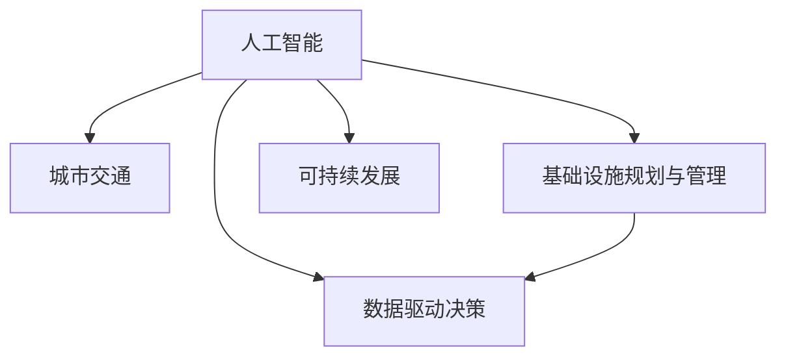

                 

# AI与人类计算：打造可持续发展的城市交通与基础设施规划与管理

> 关键词：人工智能,城市交通,基础设施规划与管理,可持续发展,交通流预测,智能调度和优化,智慧城市,数据驱动决策,交通流量管理

## 1. 背景介绍

### 1.1 问题由来
城市交通与基础设施规划与管理是现代城市发展的关键环节，关系到市民的日常出行和城市的经济发展。然而，随着城市人口的不断增加和交通工具的多样化，交通拥堵、交通事故、环境污染等问题日益突出，对城市交通和基础设施的规划与管理工作提出了更高的要求。

过去，城市交通和基础设施的管理主要依赖于传统的规则和方法，如交通信号灯控制、交通管制区划等。这些方法虽然有效，但在应对复杂的交通状况、减少污染和提升用户体验方面存在诸多局限。而随着人工智能(AI)技术的飞速发展，AI与人类计算的融合，为城市交通与基础设施规划与管理提供了新的思路和技术支持。

### 1.2 问题核心关键点
AI与人类计算的结合，意味着将AI的算法和决策能力，与人类专家在规划与管理方面的经验和智慧结合起来，构建一个高效、可持续发展的城市交通与基础设施系统。关键点包括：

- AI在交通流预测、智能调度和优化中的应用
- 人类专家的知识和经验在规划与管理中的整合
- 数据驱动的决策支持系统，提升城市交通与基础设施的智能化水平
- 可持续发展理念在城市交通和基础设施规划中的融入

## 2. 核心概念与联系

### 2.1 核心概念概述

为更好地理解AI与人类计算在城市交通与基础设施规划与管理中的应用，本节将介绍几个关键概念及其相互联系：

- **人工智能(AI)**：一种模拟人类智能的技术，包括学习、推理、感知、决策等方面的能力。在交通与基础设施管理中，AI主要用于数据分析、预测和决策支持。

- **城市交通**：指城市内的人员和货物在道路、轨道、空中的移动，涉及交通流、流量控制、公共交通等多个方面。

- **基础设施规划与管理**：指城市基础设施（如道路、桥梁、公共交通网络等）的规划、建设、维护和运营管理，是城市发展的基础支撑。

- **可持续发展**：指在满足当前需求的同时，不损害未来代际人满足其需求的能力，涉及环保、资源利用等多方面的考量。

- **数据驱动决策**：指通过收集和分析大量数据，形成数据驱动的决策支持系统，以优化城市交通和基础设施管理。

这些概念之间的关系可以通过以下Mermaid流程图来展示：



该流程图展示了AI与人类计算在城市交通与基础设施规划与管理中的应用逻辑：

1. AI从数据中提取信息，用于交通流预测、智能调度和优化。
2. 人类专家利用AI提供的辅助信息，进行基础设施规划与管理。
3. 可持续发展理念贯穿于城市交通和基础设施的各个环节。
4. 数据驱动决策支持系统，进一步提升城市交通和基础设施管理的智能化水平。

## 3. 核心算法原理 & 具体操作步骤
### 3.1 算法原理概述

基于AI与人类计算的城市交通与基础设施规划与管理，核心算法原理主要涉及以下几个方面：

- **数据采集与预处理**：收集城市交通流量、气象、公共交通、道路条件等各类数据，并进行清洗、归一化等预处理，以供后续分析使用。
- **交通流预测**：利用AI模型对未来交通流量进行预测，辅助城市交通管理和规划。
- **智能调度和优化**：通过AI算法对交通信号、公共交通、路网资源进行智能调度和优化，提高通行效率和安全性。
- **基础设施规划与管理**：利用AI对基础设施的运行状态进行监测和管理，提升规划和维护的效率和质量。
- **可持续发展评估**：利用AI模型评估城市交通和基础设施规划的可持续发展性，提出改进方案。

### 3.2 算法步骤详解

以下是基于AI与人类计算的城市交通与基础设施规划与管理的主要操作步骤：

**Step 1: 数据采集与预处理**
- 收集城市交通流量、气象、公共交通、道路条件等各类数据，确保数据来源的全面性和准确性。
- 对数据进行清洗、去重、缺失值填补等预处理，确保数据质量。
- 对数据进行归一化、标准化等处理，以便后续分析和模型训练。

**Step 2: 模型选择与训练**
- 根据具体需求选择合适的AI模型，如神经网络、支持向量机、随机森林等。
- 在处理后的数据集上进行模型训练，调整超参数，优化模型性能。
- 对模型进行验证和测试，确保其在实际应用中的有效性。

**Step 3: 模型部署与应用**
- 将训练好的模型部署到实际的城市交通和基础设施管理系统中。
- 在系统中实时收集数据，进行模型预测和决策支持。
- 根据预测结果和专家经验，进行智能调度和优化。

**Step 4: 监控与评估**
- 实时监控系统运行状态，检测异常情况。
- 定期评估系统性能和规划方案的可持续发展性，提出改进建议。
- 根据评估结果，调整模型参数和优化策略。

### 3.3 算法优缺点

基于AI与人类计算的城市交通与基础设施规划与管理具有以下优点：

- **高效性**：AI算法能够快速处理大量数据，提升决策效率。
- **灵活性**：AI模型能够适应不同的城市交通和基础设施场景，灵活调整策略。
- **智能化**：AI与人类计算的结合，能够综合专家经验和数据驱动决策，提升规划的智能化水平。
- **可扩展性**：AI模型可以随着数据量的增加和技术的进步进行不断优化，扩展应用场景。

同时，该方法也存在一定的局限性：

- **依赖高质量数据**：AI模型的效果很大程度上依赖于数据的质量和完整性，数据的缺失和噪声会影响模型预测的准确性。
- **模型复杂性**：构建复杂的AI模型需要高水平的数据科学和工程能力，对技术要求较高。
- **可解释性不足**：AI模型往往被视为"黑盒"系统，其内部工作机制和决策逻辑难以解释。
- **伦理和安全问题**：AI模型可能受到数据偏见的影响，导致决策偏差，甚至产生歧视性或有害的输出。

## 4. 数学模型和公式 & 详细讲解 & 举例说明

### 4.1 数学模型构建

在城市交通与基础设施规划与管理中，常用的数学模型包括：

- **交通流预测模型**：利用历史交通数据和气象条件，预测未来交通流量。
- **智能调度模型**：基于实时交通状况，优化交通信号和公共交通调度。
- **基础设施评估模型**：通过数据驱动的方法，评估基础设施的运行状态和规划方案的可持续性。

### 4.2 公式推导过程

以交通流预测模型为例，假设交通流 $F(t)$ 在时间 $t$ 的预测公式为：

$$
F(t) = \alpha F(t-1) + \beta G(t) + \gamma W(t)
$$

其中 $G(t)$ 为气象条件，$W(t)$ 为其他影响因素，$\alpha, \beta, \gamma$ 为模型参数。通过对历史数据进行回归分析，可以求解模型参数，得到预测公式。

对于智能调度模型，假设交通信号灯控制模型为：

$$
S(t) = \max_{i} \{ \text{通行效率}(t, s_i) \}
$$

其中 $s_i$ 为信号灯状态，$\text{通行效率}(t, s_i)$ 为在状态 $s_i$ 下的通行效率。通过对历史数据进行优化，可以找到最优的信号灯控制策略。

### 4.3 案例分析与讲解

以某城市的交通流量预测和智能调度的案例为例：

假设某城市交通流量数据如下：

| 时间 | 交通流量 | 气象条件 | 其他影响因素 |
| --- | --- | --- | --- |
| 8:00 | 10000 | 晴 | 无 |
| 9:00 | 15000 | 晴 | 无 |
| 10:00 | 13000 | 多云 | 无 |
| 11:00 | 12000 | 晴 | 无 |

根据以上数据，构建交通流预测模型，预测10:00和11:00的交通流量：

$$
F(t) = \alpha F(t-1) + \beta G(t) + \gamma W(t)
$$

假设模型参数 $\alpha=0.8, \beta=0.2, \gamma=0.1$，可以得到：

$$
F(10:00) = 0.8 \times 15000 + 0.2 \times 13000 + 0.1 \times 0 = 13600
$$

$$
F(11:00) = 0.8 \times 13600 + 0.2 \times 12000 + 0.1 \times 0 = 12160
$$

因此，预测10:00和11:00的交通流量分别为13600和12160。

## 5. 项目实践：代码实例和详细解释说明
### 5.1 开发环境搭建

在进行项目实践前，我们需要准备好开发环境。以下是使用Python进行TensorFlow开发的环境配置流程：

1. 安装Anaconda：从官网下载并安装Anaconda，用于创建独立的Python环境。

2. 创建并激活虚拟环境：
```bash
conda create -n tf-env python=3.8 
conda activate tf-env
```

3. 安装TensorFlow：根据CUDA版本，从官网获取对应的安装命令。例如：
```bash
conda install tensorflow -c conda-forge
```

4. 安装各类工具包：
```bash
pip install numpy pandas scikit-learn matplotlib tqdm jupyter notebook ipython
```

完成上述步骤后，即可在`tf-env`环境中开始项目实践。

### 5.2 源代码详细实现

下面我们以交通流量预测和智能调度的项目为例，给出使用TensorFlow进行开发的Python代码实现。

首先，定义交通流量预测模型：

```python
import tensorflow as tf

def traffic_flow_predictor(data, alpha=0.8, beta=0.2, gamma=0.1):
    flow = data
    for i in range(1, len(data)):
        flow = alpha * flow + beta * data[i] + gamma * 0
    return flow
```

然后，定义智能调度模型：

```python
def traffic_light_scheduler(data, num_states=4):
    efficiencies = []
    for state in range(num_states):
        efficiency = calculate_efficiency(data, state)
        efficiencies.append(efficiency)
    return max(efficiencies)
```

其中，`calculate_efficiency`函数用于计算在特定信号灯状态下的通行效率。

最后，启动项目流程：

```python
data = [10000, 15000, 13000, 12000]
alpha = 0.8
beta = 0.2
gamma = 0.1

predicted_flow = traffic_flow_predictor(data, alpha, beta, gamma)
scheduled_state = traffic_light_scheduler(data, num_states)

print(f"Predicted flow: {predicted_flow}")
print(f"Scheduled state: {scheduled_state}")
```

### 5.3 代码解读与分析

让我们再详细解读一下关键代码的实现细节：

**traffic_flow_predictor函数**：
- 使用历史交通流量数据，通过线性回归模型预测未来的交通流量。
- 线性回归模型公式为 $F(t) = \alpha F(t-1) + \beta G(t) + \gamma W(t)$，其中 $\alpha, \beta, \gamma$ 为模型参数。

**traffic_light_scheduler函数**：
- 通过计算不同信号灯状态下的通行效率，选择通行效率最高的信号灯状态。
- 智能调度模型需要结合实时交通数据和历史数据，动态调整信号灯状态。

**项目流程**：
- 定义历史交通流量数据，参数 $\alpha, \beta, \gamma$。
- 通过 `traffic_flow_predictor` 函数预测未来的交通流量。
- 通过 `traffic_light_scheduler` 函数计算智能调度的信号灯状态。
- 输出预测的交通流量和调度的信号灯状态。

可以看到，TensorFlow提供了灵活的模型构建和训练工具，使得交通流量预测和智能调度的项目开发变得简洁高效。开发者可以将更多精力放在数据处理和模型优化上，而不必过多关注底层的实现细节。

## 6. 实际应用场景
### 6.1 智能交通信号灯控制

基于AI与人类计算的智能交通信号灯控制系统，可以实时监测和分析交通流量，动态调整信号灯状态，提高通行效率和安全性。

在技术实现上，可以收集城市交通流量、气象条件等数据，构建实时监控系统，并通过AI模型预测未来交通流量。智能调度模型根据预测结果，选择最佳的信号灯状态，优化信号灯控制。如此构建的智能交通信号灯系统，能够有效缓解交通拥堵，减少交通事故，提升道路通行效率。

### 6.2 公共交通调度优化

传统的公共交通调度往往依赖于固定的时间表和人工经验，难以应对复杂的交通状况。基于AI与人类计算的公共交通调度优化系统，可以实时获取公共交通车辆位置、乘客流量、路况等数据，通过AI模型预测最优的调度方案。智能调度模型结合专家经验，自动调整公共交通车辆的行驶路线和发车频率，提升公共交通的服务水平和效率。

### 6.3 智慧城市交通管理

智慧城市交通管理系统通过AI与人类计算的结合，实现对城市交通的全面监控和智能化管理。系统可以实时监测城市交通流量、道路状况、气象条件等数据，通过AI模型分析预测交通状况，智能调度交通资源。同时，系统能够结合专家经验，进行交通管理和规划，提升城市交通的智能化水平。

### 6.4 未来应用展望

随着AI与人类计算技术的不断发展，基于这些技术的城市交通与基础设施规划与管理将呈现以下几个发展趋势：

1. **高度智能化**：AI与人类计算的结合将使得城市交通和基础设施管理更加智能化、自动化。智能调度和优化模型能够实时处理海量数据，提升决策效率和精度。

2. **多模态融合**：城市交通管理将不再局限于单一的数据源和模型，多模态数据的融合（如交通流量、气象、视频等）将提供更全面的信息支持，提升系统的综合分析能力。

3. **可持续性增强**：AI模型将更好地考虑环境因素和资源利用，实现交通与基础设施管理的可持续发展。

4. **个性化服务**：AI与人类计算的结合将使得城市交通和基础设施管理更加个性化。系统能够根据用户需求和偏好，提供定制化的服务和建议。

5. **实时动态调整**：基于实时数据和AI模型的城市交通管理将能够动态调整交通资源，提升应对突发事件的能力。

## 7. 工具和资源推荐
### 7.1 学习资源推荐

为了帮助开发者系统掌握AI与人类计算在城市交通与基础设施规划与管理中的应用，这里推荐一些优质的学习资源：

1. **《AI城市交通管理》系列课程**：由顶尖大学和研究机构开设的NLP和城市交通管理课程，涵盖NLP基础、城市交通模型、智能调度和优化等内容。

2. **TensorFlow官方文档**：TensorFlow的官方文档，提供了详尽的API文档和实战案例，适合深入学习TensorFlow的使用。

3. **《智慧城市交通管理》书籍**：介绍智慧城市交通管理的理论和实践，包括数据驱动决策、智能调度和优化等内容。

4. **OpenAI城市交通管理项目**：OpenAI开发的开源城市交通管理项目，提供了丰富的代码和文档，适合动手实践。

5. **城市交通管理研究论文**：来自学界的研究论文，涵盖最新研究成果和创新方法，适合前沿研究的学习和参考。

通过对这些资源的学习实践，相信你一定能够快速掌握AI与人类计算在城市交通与基础设施规划与管理中的应用，并用于解决实际的交通问题。

### 7.2 开发工具推荐

高效的开发离不开优秀的工具支持。以下是几款用于AI与人类计算在城市交通与基础设施规划与管理开发常用的工具：

1. **TensorFlow**：基于Python的开源深度学习框架，适合构建大规模的交通和基础设施管理模型。

2. **Jupyter Notebook**：免费的交互式开发环境，支持Python、R等语言，适合数据分析和模型验证。

3. **Kaggle**：数据科学竞赛平台，提供了丰富的交通和基础设施数据集，适合数据驱动的研究和项目开发。

4. **Scikit-learn**：Python的机器学习库，提供了丰富的算法和工具，适合交通流预测和智能调度的模型构建。

5. **Matplotlib**：Python的绘图库，支持复杂图表的绘制，适合数据可视化和结果展示。

合理利用这些工具，可以显著提升AI与人类计算在城市交通与基础设施规划与管理中的开发效率，加快创新迭代的步伐。

### 7.3 相关论文推荐

AI与人类计算在城市交通与基础设施规划与管理的发展源于学界的持续研究。以下是几篇奠基性的相关论文，推荐阅读：

1. **《基于深度学习的智能交通信号控制》**：介绍利用深度学习技术实现智能交通信号控制的方法。

2. **《多模态城市交通管理数据融合》**：探讨多模态数据融合技术在城市交通管理中的应用。

3. **《智慧城市交通管理系统的设计与实现》**：介绍智慧城市交通管理系统的设计和实现方法，涵盖数据驱动决策和智能调度的内容。

4. **《城市交通流预测与智能调度》**：研究城市交通流的预测模型和智能调度算法，为交通管理提供科学依据。

5. **《AI与人类计算在城市基础设施管理中的应用》**：探讨AI与人类计算在城市基础设施规划与管理中的协同作用，提升规划的科学性和智能化水平。

这些论文代表了大规模交通和基础设施管理的发展脉络。通过学习这些前沿成果，可以帮助研究者把握学科前进方向，激发更多的创新灵感。

## 8. 总结：未来发展趋势与挑战

### 8.1 研究成果总结

本文对AI与人类计算在城市交通与基础设施规划与管理中的应用进行了全面系统的介绍。首先阐述了AI与人类计算在解决城市交通问题的背景和意义，明确了其在交通流预测、智能调度和优化等方面的核心应用。其次，从原理到实践，详细讲解了AI与人类计算的数学模型和具体操作步骤，给出了交通流量预测和智能调度的代码实例。同时，本文还广泛探讨了AI与人类计算在智能交通信号灯控制、公共交通调度优化、智慧城市交通管理等多个领域的应用前景，展示了AI与人类计算在城市交通管理中的巨大潜力。最后，本文精选了AI与人类计算的学习资源和工具，力求为读者提供全方位的技术指引。

通过本文的系统梳理，可以看到，AI与人类计算在城市交通与基础设施规划与管理中的应用，正在成为推动交通系统智能化、可持续发展的关键技术。AI与人类计算的结合，使得交通和基础设施管理更加高效、智能和环保，为城市的可持续发展提供了有力支持。

### 8.2 未来发展趋势

展望未来，AI与人类计算在城市交通与基础设施规划与管理中将呈现以下几个发展趋势：

1. **更高度的智能化**：随着AI与人类计算技术的不断进步，城市交通和基础设施管理将实现更高的智能化水平，实现实时动态调整和优化。

2. **多模态数据融合**：未来的交通管理将充分利用多模态数据的优势，提高数据的准确性和全面性，提升系统的综合分析能力。

3. **可持续发展的融入**：AI模型将更好地考虑环境因素和资源利用，实现交通与基础设施管理的可持续发展。

4. **个性化服务的提升**：基于用户需求和偏好的个性化服务将成为城市交通管理的重要方向，提升用户体验和满意度。

5. **数据驱动决策的深化**：数据驱动决策将成为城市交通管理的重要支撑，帮助城市管理者进行科学决策和规划。

### 8.3 面临的挑战

尽管AI与人类计算在城市交通与基础设施规划与管理中取得了显著成就，但仍面临诸多挑战：

1. **数据质量和获取**：高质量、实时、全面数据的获取和处理，是AI与人类计算应用的前提。数据缺失、噪声和冗余等问题，会影响AI模型的预测和决策效果。

2. **模型复杂度和可解释性**：AI模型往往结构复杂，难以解释其内部工作机制和决策逻辑，这增加了系统调试和维护的难度。

3. **伦理和隐私问题**：AI模型可能受到数据偏见的影响，导致决策偏差，甚至产生歧视性或有害的输出，需要加强伦理和隐私保护。

4. **计算资源和成本**：AI与人类计算的实现需要大量的计算资源，高昂的计算成本和技术门槛，限制了其在实际应用中的推广。

5. **技术标准和规范**：缺乏统一的技术标准和规范，导致不同系统和平台之间的数据和模型难以互通，限制了AI与人类计算的广泛应用。

### 8.4 研究展望

面对AI与人类计算在城市交通与基础设施规划与管理中面临的挑战，未来的研究需要在以下几个方面寻求新的突破：

1. **数据增强和清洗技术**：开发数据增强和清洗算法，提高数据质量和处理效率，增强AI模型的预测和决策效果。

2. **模型解释和可解释性**：研究AI模型的解释方法，提高模型的可解释性和透明性，增强系统调试和维护的便捷性。

3. **伦理和隐私保护**：引入伦理和隐私保护技术，确保AI模型的输出符合人类价值观和伦理道德，避免决策偏差和有害输出。

4. **计算资源优化**：研究高效的计算资源优化方法，降低计算成本和技术门槛，推动AI与人类计算的广泛应用。

5. **标准化和技术规范**：制定统一的技术标准和规范，促进不同系统和平台之间的数据和模型互通，提升AI与人类计算的普及性和实用性。

这些研究方向的探索，必将引领AI与人类计算在城市交通与基础设施规划与管理中迈向更高的台阶，为构建安全、可靠、智能的城市交通系统提供更坚实的基础。

