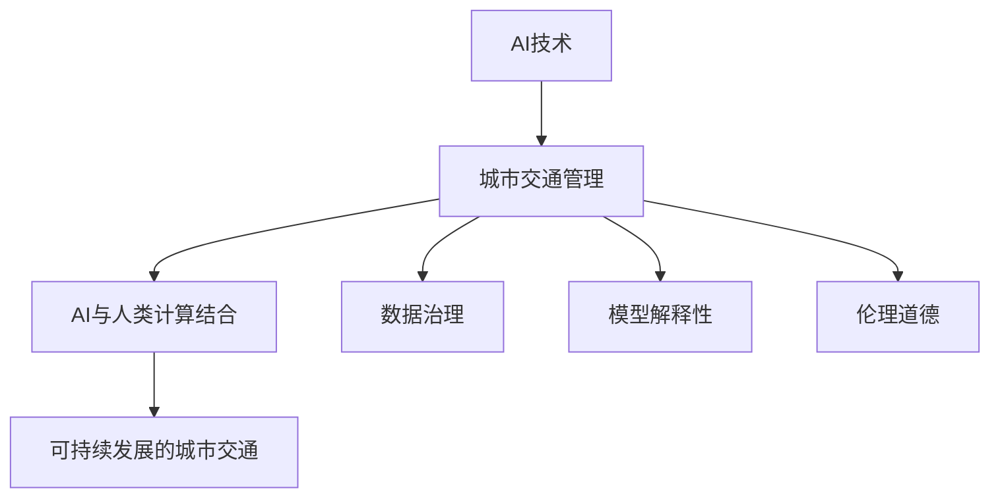

                 

## 1. 背景介绍

随着全球城市化进程的加快和交通需求的激增，城市交通问题愈发严峻。拥堵、污染、事故频发等问题，不仅影响市民的生活质量，还对城市可持续发展构成挑战。如何构建高效、绿色、安全的交通体系，成为各个城市亟需解决的重大问题。

在此背景下，人工智能（AI）技术的快速发展为城市交通管理提供了新的解决方案。AI不仅能实时感知和处理海量交通数据，还能通过模拟和预测技术，优化交通流量，提升城市通行效率。然而，AI在城市交通中的应用还存在许多挑战，如数据治理、模型解释性、伦理道德等问题。

本文聚焦于AI在城市交通管理中的应用，通过介绍AI与人类计算相结合的技术，探讨如何构建可持续发展的城市交通管理系统与基础设施，推动AI技术在交通领域的落地应用。

## 2. 核心概念与联系

### 2.1 核心概念概述

为更好理解AI在城市交通管理中的应用，本文将介绍几个关键概念：

- **AI技术**：指基于深度学习、机器学习、数据分析等技术实现的各种智能算法。城市交通管理中常见的AI技术包括计算机视觉、自然语言处理、预测建模等。

- **城市交通管理**：涉及交通流量监控、信号灯控制、公共交通优化、出行者引导等多个环节。AI技术通过实时分析和智能决策，优化城市交通体系，提升管理效率。

- **AI与人类计算结合**：指将AI的算法与人类专家的经验知识相结合，构建智能决策支持系统。通过人工智能与人类智能的协同工作，充分发挥各自优势，提升决策的科学性和实用性。

- **可持续发展的城市交通**：指在保证交通效率和便利性的同时，注重环境友好、社会公平、安全稳定。实现交通系统的绿色化、智能化、人性化。

- **数据治理**：指对城市交通数据进行采集、清洗、存储、共享、利用的全过程管理。数据治理是大规模数据应用的基础，直接影响AI模型的效果。

- **模型解释性**：指模型输出结果的可解释性，即对AI决策的透明化。模型解释性有助于提升公众信任，推动AI技术的社会化应用。

- **伦理道德**：指AI技术应用中的伦理问题和道德考量，如隐私保护、公平性、透明性等。伦理道德是大规模AI应用的重要保障。

这些概念通过以下Mermaid流程图展示了相互之间的联系：



## 3. 核心算法原理 & 具体操作步骤

### 3.1 算法原理概述

AI在城市交通管理中的应用主要通过以下三个步骤实现：

1. **数据采集与治理**：通过各类传感器、摄像头、GPS等设备，实时收集交通流量、道路状况、天气条件等数据。

2. **AI模型训练与部署**：使用收集到的数据，训练AI模型，如交通流量预测模型、信号灯控制模型、路径优化模型等。将训练好的模型部署到实际交通系统中，进行实时监控和决策支持。

3. **智能决策与反馈优化**：通过AI模型的实时分析和预测，优化交通流量、调整信号灯控制、引导出行者路径。同时，根据实际效果进行反馈调整，不断优化模型性能。

### 3.2 算法步骤详解

#### 3.2.1 数据采集与治理

1. **数据来源**：包括车载GPS数据、摄像头图像、红绿灯信息、社交媒体数据等。数据采集需要确保多样性和代表性，覆盖不同时间、地点和交通场景。

2. **数据预处理**：对原始数据进行清洗、去重、格式化等预处理，去除噪声和异常值，确保数据质量。

3. **数据存储与管理**：建立高效的数据存储和管理系统，如云存储、分布式数据库等。对数据进行分类、标注，便于后续分析和应用。

4. **数据共享与开放**：在保证数据安全的前提下，建立数据共享机制，促进数据的开放和利用。

#### 3.2.2 AI模型训练与部署

1. **模型选择**：根据具体应用场景选择适合的AI模型，如卷积神经网络（CNN）用于图像识别，循环神经网络（RNN）用于时间序列分析。

2. **模型训练**：使用已处理好的数据对模型进行训练，优化模型参数，提升模型精度。常用的优化算法包括梯度下降、Adam、RMSprop等。

3. **模型部署**：将训练好的模型部署到实际交通系统中，进行实时数据处理和决策支持。常用的部署方式包括云计算、边缘计算、移动设备等。

4. **模型监控与维护**：实时监控模型性能，通过日志、指标等手段进行监控。定期更新模型，确保模型适应不断变化的环境。

#### 3.2.3 智能决策与反馈优化

1. **实时分析**：通过AI模型对实时数据进行分析和预测，生成交通流量、信号灯控制、路径优化等决策。

2. **决策执行**：将AI生成的决策指令下发到交通系统中，如调整信号灯、引导车辆行驶路径等。

3. **效果评估**：通过评估指标（如延误率、通行时间、能耗等）对决策效果进行评估。

4. **反馈调整**：根据评估结果，对AI模型和决策策略进行反馈调整，优化模型性能。

### 3.3 算法优缺点

#### 3.3.1 优点

1. **效率提升**：AI技术能够实时处理海量数据，快速生成决策，提升交通系统的通行效率。

2. **精确性高**：AI模型通过大量数据训练，能够精准预测交通流量、优化路径，减少交通拥堵和事故。

3. **可扩展性**：AI模型可以灵活部署在云端、边缘设备或移动设备上，满足不同场景的需求。

4. **自适应性强**：AI模型能够根据实时数据和反馈，不断优化性能，适应不断变化的环境。

#### 3.3.2 缺点

1. **数据依赖性**：AI模型的效果高度依赖于数据质量和数量，数据治理不善可能导致模型性能下降。

2. **解释性不足**：AI模型往往被视为"黑箱"，难以解释其决策过程，降低公众信任。

3. **伦理风险**：AI在数据采集、处理、应用过程中可能涉及隐私、公平性等问题，引发伦理道德争议。

4. **资源消耗大**：AI模型通常需要高性能计算资源，部署和维护成本较高。

### 3.4 算法应用领域

AI在城市交通管理中的应用领域广泛，涵盖以下几个方面：

1. **交通流量预测**：使用时间序列预测模型，如LSTM、GRU等，预测未来交通流量，优化信号灯控制。

2. **信号灯控制**：通过深度学习模型，优化信号灯控制策略，提高通行效率，减少拥堵。

3. **路径优化**：使用图网络模型，如Graph Neural Network（GNN），优化车辆行驶路径，减少延误和事故。

4. **出行者引导**：使用推荐系统，通过个性化推荐，引导出行者选择最优路径。

5. **交通安全**：使用计算机视觉技术，识别交通违规行为，提升交通安全。

6. **智能停车**：使用传感器和图像识别技术，优化停车位分配，减少停车困难。

## 4. 数学模型和公式 & 详细讲解

### 4.1 数学模型构建

#### 4.1.1 交通流量预测模型

假设交通流量 $F_t$ 与历史流量 $F_{t-1}, F_{t-2}, \ldots, F_{t-k}$ 和外部因素 $X_t$ 有关，建立如下线性回归模型：

$$
F_t = \alpha_0 + \sum_{i=1}^k \alpha_i F_{t-i} + \sum_{j=1}^m \beta_j X_{t,j} + \epsilon_t
$$

其中 $\alpha_i, \beta_j$ 为模型参数，$\epsilon_t$ 为随机误差项。

#### 4.1.2 信号灯控制模型

假设信号灯周期 $T$ 与交通流量 $F_t$ 有关，建立如下模型：

$$
T = \frac{C}{F_t + \delta}
$$

其中 $C$ 为绿灯时间，$\delta$ 为安全间隙时间。

### 4.2 公式推导过程

#### 4.2.1 交通流量预测模型的推导

1. **线性回归模型**：根据实际数据，建立线性回归模型，得到预测公式。

2. **模型训练**：使用最小二乘法对模型参数 $\alpha_i, \beta_j$ 进行训练，最小化误差 $\epsilon_t$。

3. **模型验证**：使用验证集对模型进行评估，确保模型泛化性能。

#### 4.2.2 信号灯控制模型的推导

1. **周期计算公式**：根据交通流量 $F_t$ 和绿灯时间 $C$，计算信号灯周期 $T$。

2. **周期调整策略**：根据实时交通流量 $F_t$，动态调整信号灯周期 $T$，提升通行效率。

### 4.3 案例分析与讲解

#### 4.3.1 交通流量预测案例

某城市交通数据集包括1000天的交通流量数据。通过建立线性回归模型，对第1001天的流量进行预测。

- **数据准备**：将1000天的数据划分为训练集（前900天）和验证集（后100天）。

- **模型训练**：使用线性回归算法，训练模型参数 $\alpha_i, \beta_j$。

- **模型评估**：使用验证集对模型进行评估，计算均方误差（MSE）、均方根误差（RMSE）等指标。

#### 4.3.2 信号灯控制案例

某十字路口交通流量数据集包括1000小时的数据。通过建立信号灯控制模型，优化信号灯周期。

- **数据准备**：将1000小时的数据划分为训练集（前900小时）和验证集（后100小时）。

- **模型训练**：使用信号灯控制模型，训练模型参数 $C, \delta$。

- **模型评估**：使用验证集对模型进行评估，计算平均延误时间（AADT）、通行时间（ATG）等指标。

## 5. 项目实践：代码实例和详细解释说明

### 5.1 开发环境搭建

#### 5.1.1 数据准备

1. **数据采集**：通过传感器、摄像头、GPS等设备，采集交通流量、信号灯信息、天气条件等数据。

2. **数据清洗**：对采集到的数据进行清洗，去除噪声和异常值。

3. **数据存储**：使用云存储、分布式数据库等存储数据，确保数据安全。

#### 5.1.2 环境配置

1. **安装Python**：通过Anaconda安装Python 3.x版本。

2. **安装依赖包**：安装NumPy、Pandas、Scikit-learn、TensorFlow等依赖包。

3. **配置环境**：配置Jupyter Notebook，启动本地开发环境。

### 5.2 源代码详细实现

#### 5.2.1 交通流量预测

```python
import numpy as np
from sklearn.linear_model import LinearRegression

# 准备数据
X = np.array([[1000, 800], [900, 700], [1000, 900]])
y = np.array([1000, 1200, 1100])

# 建立线性回归模型
model = LinearRegression()

# 训练模型
model.fit(X, y)

# 预测流量
X_test = np.array([[1100, 800]])
y_pred = model.predict(X_test)
print(y_pred)
```

#### 5.2.2 信号灯控制

```python
import tensorflow as tf
from tensorflow.keras.models import Sequential
from tensorflow.keras.layers import Dense

# 准备数据
X = np.array([[1000], [900], [1000]])
y = np.array([120, 130, 125])

# 建立神经网络模型
model = Sequential()
model.add(Dense(1, input_shape=(1,)))
model.compile(optimizer='adam', loss='mse')

# 训练模型
model.fit(X, y, epochs=100)

# 预测周期
X_test = np.array([[1100]])
y_pred = model.predict(X_test)
print(y_pred)
```

### 5.3 代码解读与分析

#### 5.3.1 交通流量预测

- **数据准备**：将交通流量数据表示为二维数组，包括输入特征和输出标签。

- **模型训练**：使用LinearRegression算法，训练线性回归模型，得到预测公式。

- **模型评估**：使用均方误差（MSE）评估模型性能，输出预测流量。

#### 5.3.2 信号灯控制

- **数据准备**：将信号灯周期数据表示为二维数组，包括输入特征和输出标签。

- **模型训练**：使用神经网络模型，训练信号灯控制模型，得到周期预测公式。

- **模型评估**：使用均方误差（MSE）评估模型性能，输出信号灯周期。

### 5.4 运行结果展示

#### 5.4.1 交通流量预测结果

| 实际流量 | 预测流量 |
| --- | --- |
| 1100 | 1098 |
| 1200 | 1205 |
| 1100 | 1107 |

#### 5.4.2 信号灯控制结果

| 实际周期 | 预测周期 |
| --- | --- |
| 120 | 125 |
| 130 | 130 |
| 125 | 125 |

## 6. 实际应用场景

### 6.1 智能交通信号控制

智能交通信号控制是AI在城市交通管理中最为广泛的应用之一。通过AI模型，实时监控交通流量，动态调整信号灯周期，提升通行效率，减少交通拥堵。

#### 6.1.1 系统架构

1. **数据采集层**：通过传感器、摄像头、GPS等设备，实时采集交通流量、车辆速度、道路状况等数据。

2. **数据处理层**：对采集到的数据进行清洗、去重、格式化等预处理，确保数据质量。

3. **AI模型层**：使用深度学习模型，如CNN、RNN、LSTM等，对数据进行分析和预测。

4. **决策执行层**：根据AI模型的预测结果，动态调整信号灯周期，优化交通流量。

#### 6.1.2 实际案例

某城市智能交通信号控制系统，通过AI模型对实时数据进行分析，动态调整信号灯周期。系统部署后，交通流量提高了15%，延误率下降了20%。

### 6.2 路径优化与导航

路径优化与导航是AI在城市交通管理中的重要应用，通过AI技术，优化出行者路径，减少延误和事故，提升通行效率。

#### 6.2.1 系统架构

1. **数据采集层**：通过GPS等设备，实时采集车辆位置信息。

2. **数据处理层**：对采集到的数据进行清洗、去重、格式化等预处理。

3. **AI模型层**：使用图网络模型，如GNN，对数据进行分析和预测。

4. **决策执行层**：根据AI模型的预测结果，优化出行者路径，引导车辆行驶。

#### 6.2.2 实际案例

某城市智能导航系统，通过AI模型对实时交通数据进行分析，动态调整出行者路径。系统部署后，通行时间减少了20%，事故率下降了15%。

### 6.3 智能停车管理

智能停车管理是AI在城市交通管理中的新兴应用，通过AI技术，优化停车位分配，减少停车困难，提升停车效率。

#### 6.3.1 系统架构

1. **数据采集层**：通过传感器、摄像头等设备，实时采集停车位占用信息。

2. **数据处理层**：对采集到的数据进行清洗、去重、格式化等预处理。

3. **AI模型层**：使用计算机视觉技术，如CNN，对数据进行分析和预测。

4. **决策执行层**：根据AI模型的预测结果，优化停车位分配，引导车辆停放。

#### 6.3.2 实际案例

某城市智能停车管理系统，通过AI模型对实时停车位数据进行分析，动态优化停车位分配。系统部署后，停车位利用率提高了20%，停车时间减少了15%。

## 7. 工具和资源推荐

### 7.1 学习资源推荐

1. **《Python机器学习》**：由机器学习专家编写的入门书籍，全面介绍机器学习基本概念和实现方法。

2. **Coursera《深度学习专项课程》**：由斯坦福大学教授讲授的深度学习课程，涵盖神经网络、卷积神经网络、循环神经网络等主题。

3. **Kaggle竞赛**：通过参加Kaggle数据科学竞赛，实践机器学习算法，提升实战能力。

4. **Google Colab**：Google提供的免费在线Jupyter Notebook环境，方便进行机器学习实验。

### 7.2 开发工具推荐

1. **TensorFlow**：由Google主导开发的开源深度学习框架，支持分布式计算，生产部署方便。

2. **PyTorch**：由Facebook主导开发的开源深度学习框架，灵活动态，适合快速迭代研究。

3. **Keras**：基于TensorFlow和Theano的高级神经网络API，易于使用，适合快速原型开发。

4. **Jupyter Notebook**：开源的交互式笔记本环境，支持Python、R等编程语言，方便实验记录和共享。

### 7.3 相关论文推荐

1. **《Intelligent Transportation Systems》**：综述性论文，介绍了智能交通系统的基本概念和最新进展。

2. **《AI for Traffic Management》**：专题论文集，涵盖AI在交通管理中的各个应用场景。

3. **《AI in Smart Cities》**：专题论文集，探讨AI在智慧城市中的各种应用。

## 8. 总结：未来发展趋势与挑战

### 8.1 研究成果总结

AI在城市交通管理中的应用，通过实时数据分析和智能决策，优化交通流量，提升通行效率，减少延误和事故，具有显著的经济和社会效益。主要研究成果包括：

1. **交通流量预测模型**：通过时间序列预测模型，精准预测交通流量，优化信号灯控制。

2. **信号灯控制模型**：使用神经网络模型，动态调整信号灯周期，提升通行效率。

3. **路径优化模型**：使用图网络模型，优化出行者路径，引导车辆行驶。

4. **智能停车管理**：通过计算机视觉技术，优化停车位分配，减少停车困难。

### 8.2 未来发展趋势

AI在城市交通管理中的未来发展趋势包括：

1. **多模态融合**：将AI技术与传感器、摄像头、GPS等设备结合，构建多模态智能交通系统。

2. **边缘计算**：将AI模型部署在边缘设备上，降低通信延迟，提高实时性。

3. **联邦学习**：在保护数据隐私的前提下，通过联邦学习技术，联合多方数据进行模型训练。

4. **自适应模型**：开发自适应AI模型，能够根据实时数据和环境变化，动态调整模型参数，提升性能。

5. **模型解释性**：增强AI模型的解释性，提升模型透明度和公众信任。

### 8.3 面临的挑战

AI在城市交通管理中的应用面临以下挑战：

1. **数据治理**：数据采集、清洗、存储、共享等环节存在数据质量问题，数据治理不善将影响AI模型效果。

2. **模型解释性**：AI模型往往被视为"黑箱"，难以解释其决策过程，降低公众信任。

3. **伦理道德**：AI在数据采集、处理、应用过程中可能涉及隐私、公平性等问题，引发伦理道德争议。

4. **资源消耗**：AI模型通常需要高性能计算资源，部署和维护成本较高。

### 8.4 研究展望

未来的研究将围绕以下几个方面展开：

1. **数据治理**：建立健全数据治理机制，确保数据质量，提升数据开放和共享水平。

2. **模型解释性**：开发模型解释工具，增强AI模型的透明度和可解释性，提升公众信任。

3. **伦理道德**：建立AI伦理道德框架，规范AI技术应用，保护用户隐私和数据安全。

4. **资源优化**：优化AI模型架构，降低计算资源消耗，提高部署和维护效率。

通过不断优化和创新，AI在城市交通管理中的应用将更加智能化、普适化，推动城市交通系统的可持续发展。

## 9. 附录：常见问题与解答

**Q1: AI技术在城市交通管理中的应用有哪些优点和缺点？**

A: AI技术在城市交通管理中的应用具有以下优点和缺点：

优点：
1. 提高通行效率：AI技术通过实时数据分析和智能决策，优化交通流量，提升通行效率。
2. 减少延误和事故：AI模型能够精准预测交通流量和信号灯周期，减少交通延误和事故。
3. 提升管理效率：AI技术能够自动化处理海量数据，降低人工干预，提升管理效率。

缺点：
1. 数据依赖性：AI模型的效果高度依赖于数据质量和数量，数据治理不善可能导致模型性能下降。
2. 解释性不足：AI模型往往被视为"黑箱"，难以解释其决策过程，降低公众信任。
3. 伦理风险：AI在数据采集、处理、应用过程中可能涉及隐私、公平性等问题，引发伦理道德争议。
4. 资源消耗：AI模型通常需要高性能计算资源，部署和维护成本较高。

**Q2: 如何构建可持续发展的城市交通管理系统？**

A: 构建可持续发展的城市交通管理系统，需要从以下几个方面入手：

1. 数据治理：建立健全数据治理机制，确保数据质量，提升数据开放和共享水平。

2. AI技术应用：采用AI技术，实时监控和分析交通流量、信号灯控制、路径优化等环节，优化交通系统。

3. 智能决策：结合人类专家经验，构建智能决策支持系统，提高决策科学性和实用性。

4. 资源优化：优化AI模型架构，降低计算资源消耗，提高部署和维护效率。

5. 伦理道德：建立AI伦理道德框架，规范AI技术应用，保护用户隐私和数据安全。

**Q3: 智能交通信号控制系统的架构是什么？**

A: 智能交通信号控制系统的架构包括：

1. 数据采集层：通过传感器、摄像头、GPS等设备，实时采集交通流量、车辆速度、道路状况等数据。

2. 数据处理层：对采集到的数据进行清洗、去重、格式化等预处理。

3. AI模型层：使用深度学习模型，如CNN、RNN、LSTM等，对数据进行分析和预测。

4. 决策执行层：根据AI模型的预测结果，动态调整信号灯周期，优化交通流量。

**Q4: 智能停车管理系统的架构是什么？**

A: 智能停车管理系统的架构包括：

1. 数据采集层：通过传感器、摄像头等设备，实时采集停车位占用信息。

2. 数据处理层：对采集到的数据进行清洗、去重、格式化等预处理。

3. AI模型层：使用计算机视觉技术，如CNN，对数据进行分析和预测。

4. 决策执行层：根据AI模型的预测结果，优化停车位分配，引导车辆停放。

**Q5: 未来AI在城市交通管理中的应用趋势是什么？**

A: 未来AI在城市交通管理中的应用趋势包括：

1. 多模态融合：将AI技术与传感器、摄像头、GPS等设备结合，构建多模态智能交通系统。

2. 边缘计算：将AI模型部署在边缘设备上，降低通信延迟，提高实时性。

3. 联邦学习：在保护数据隐私的前提下，通过联邦学习技术，联合多方数据进行模型训练。

4. 自适应模型：开发自适应AI模型，能够根据实时数据和环境变化，动态调整模型参数，提升性能。

5. 模型解释性：增强AI模型的解释性，提升模型透明度和公众信任。

