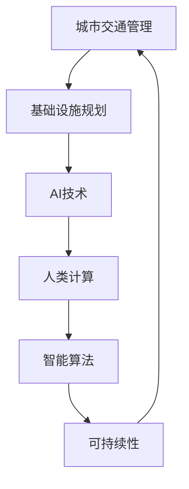

                 

# AI与人类计算：打造可持续发展的城市交通管理系统与基础设施规划

> 关键词：城市交通管理、基础设施规划、AI技术、人类计算、智能算法、可持续性、交通优化、数据驱动、智能决策系统、智慧城市

## 1. 背景介绍

### 1.1 问题由来

随着全球城市化进程的加快，交通拥堵、环境污染、资源浪费等问题愈发严峻，给城市管理和居民生活带来了重大挑战。交通基础设施的建设，更是需要巨额投资和严格规划。然而，传统的数据驱动规划方法往往依赖于手动统计和分析，效率低、精度差、难实时更新。面对复杂多变的城市环境，传统的决策机制已难以应对。

为了提升城市交通管理和基础设施规划的效率与精准度，智慧城市理念应运而生。利用新一代信息技术，如人工智能、大数据、物联网等，可以实现对城市交通流、基础设施状态等的实时监控与分析，优化城市交通管理和基础设施布局，提升城市运行效率。城市交通管理系统和基础设施规划，正在从传统的经验驱动向数据驱动、智能驱动转型。

### 1.2 问题核心关键点

当前，城市交通管理系统和基础设施规划的主要挑战包括：
- 城市交通拥堵问题如何缓解？
- 基础设施建设如何最大化地发挥效用？
- 数据驱动的规划方法如何实现智能化？

这些问题需要依赖于AI技术，特别是基于人类计算的城市智能决策系统。通过模拟人类决策过程，引入多模态数据、多维度评估指标，能够实现对城市交通管理与基础设施规划的科学化和智能化。

### 1.3 问题研究意义

深入研究AI与人类计算在城市交通管理系统和基础设施规划中的应用，对于提升城市运行效率、改善居民生活品质、实现可持续发展具有重要意义：

1. **提升管理效率**：通过AI技术，实现对交通流的实时监控与预测，优化交通信号灯配时，提升道路通行效率。
2. **优化基础设施布局**：利用数据驱动的方法，科学规划道路、公交站、停车场等基础设施，最大化其利用率。
3. **支持智能决策**：引入人类计算方法，模拟人类决策过程，建立多目标优化模型，提升规划决策的科学性和可行性。
4. **支持可持续发展**：通过智能算法，评估基础设施对环境的潜在影响，优化资源配置，支持生态文明建设。
5. **促进智慧城市建设**：AI与人类计算技术，能够为智慧城市的构建提供支撑，推动城市数字化、智能化转型。

## 2. 核心概念与联系

### 2.1 核心概念概述

为更好地理解AI与人类计算在城市交通管理系统和基础设施规划中的应用，本节将介绍几个密切相关的核心概念：

- **城市交通管理**：指通过一系列措施和技术手段，对城市交通流进行实时监控、调控和管理，缓解交通拥堵，提升道路通行效率。
- **基础设施规划**：指对城市道路、公交站、停车场等交通基础设施进行科学规划和布局，以优化城市交通系统，提升基础设施利用率。
- **AI技术**：指通过机器学习、深度学习等算法，实现对海量数据的学习和建模，为城市管理提供智能化决策支持。
- **人类计算**：指模拟人类决策过程，利用AI技术解决复杂问题，提高决策效率和质量。
- **智能算法**：指用于处理复杂问题、优化决策的算法，如遗传算法、模拟退火算法、多目标优化算法等。
- **可持续性**：指城市交通管理和基础设施规划要支持生态文明建设，实现资源节约、环境友好。

这些核心概念之间的逻辑关系可以通过以下Mermaid流程图来展示：



这个流程图展示了大语言模型的核心概念及其之间的关系：

1. 城市交通管理和基础设施规划通过AI技术进行智能化。
2. 人类计算模拟人类决策过程，提供智能算法作为决策支持。
3. 智能算法优化城市交通管理和基础设施规划，支持持续性目标。

这些概念共同构成了城市交通管理系统和基础设施规划的智能决策框架，使其能够实现高效、科学、可持续的发展。

## 3. 核心算法原理 & 具体操作步骤
### 3.1 算法原理概述

基于AI与人类计算的城市交通管理系统和基础设施规划，本质上是一个多目标优化问题。其核心思想是：通过多模态数据融合、多维度指标评估、多目标优化算法，实现城市交通流的优化和基础设施布局的科学规划。

具体来说，假设城市交通管理系统的目标为缓解交通拥堵，优化交通信号灯配时；基础设施规划的目标为最大化道路通行能力，合理布局公交站、停车场等。定义城市交通管理的目标函数和约束条件，利用智能算法进行求解。

形式化地，假设目标函数为：

$$
f(\text{time}, \text{signal\_light\_config}, \text{road\_lay\_out}, \text{parking\_lot\_loc}) = f_{\text{time}}(\text{signal\_light\_config}) + f_{\text{road\_lay\_out}}(\text{road\_lay\_out}) + f_{\text{parking\_lot\_loc}}(\text{parking\_lot\_loc})
$$

其中，$f_{\text{time}}$为交通信号灯配时优化函数，$f_{\text{road\_lay\_out}}$为道路布局优化函数，$f_{\text{parking\_lot\_loc}}$为停车场布局优化函数。约束条件为：

$$
\begin{cases}
\text{signal\_light\_config} \in \mathcal{C}_{\text{signal}} \\
\text{road\_lay\_out} \in \mathcal{C}_{\text{road}} \\
\text{parking\_lot\_loc} \in \mathcal{C}_{\text{parking}}
\end{cases}
$$

其中，$\mathcal{C}_{\text{signal}}$为交通信号灯配时优化策略空间，$\mathcal{C}_{\text{road}}$为道路布局优化策略空间，$\mathcal{C}_{\text{parking}}$为停车场布局优化策略空间。

通过求解上述多目标优化问题，可以得出一个能够缓解交通拥堵、最大化道路通行能力的最佳方案。

### 3.2 算法步骤详解

基于AI与人类计算的城市交通管理系统和基础设施规划，一般包括以下几个关键步骤：

**Step 1: 数据准备与处理**
- 收集城市交通流数据、基础设施状态数据、环境数据等。
- 对数据进行预处理，包括去噪、归一化、特征提取等。
- 进行数据融合，将多模态数据进行综合，提升数据的准确性和完备性。

**Step 2: 建模与优化**
- 根据问题特点，选择合适的智能算法。如遗传算法、模拟退火算法、多目标优化算法等。
- 定义优化目标函数和约束条件，构建数学模型。
- 进行多目标优化，求解最优方案。

**Step 3: 验证与部署**
- 在仿真环境下验证优化结果的可行性。
- 根据优化结果，调整交通信号灯配时、道路布局、停车场布局等。
- 部署优化后的系统，实时监控城市交通流和基础设施状态，进行动态调整。

**Step 4: 持续优化**
- 定期收集新的数据，进行模型再训练和优化。
- 结合专家知识，对模型进行调整和改进。
- 优化后的模型应用于实际城市交通管理和基础设施规划中，支持动态调整和优化。

以上是基于AI与人类计算的城市交通管理系统和基础设施规划的一般流程。在实际应用中，还需要针对具体问题特点，对数据处理、算法选择、模型优化等环节进行优化设计，以进一步提升模型性能。

### 3.3 算法优缺点

基于AI与人类计算的城市交通管理系统和基础设施规划方法具有以下优点：
1. **实时性**：能够实时监控城市交通流和基础设施状态，及时进行动态调整。
2. **科学性**：利用多目标优化算法，科学规划基础设施布局，提升资源利用效率。
3. **精确性**：通过多模态数据融合和智能算法，提高决策的精确性和可行性。
4. **灵活性**：能够灵活调整优化策略，适应城市环境的变化。
5. **可持续性**：支持生态文明建设，优化资源配置，支持可持续性发展。

同时，该方法也存在一定的局限性：
1. **数据依赖性**：对数据质量和完备性的要求较高，数据缺失或错误可能导致误导性决策。
2. **模型复杂性**：多目标优化问题的求解复杂，需要高性能计算资源。
3. **动态调整困难**：基础设施建设一旦完成，调整起来困难，需要综合考虑成本和效率。
4. **技术与政策衔接**：技术与政策衔接需要充分考虑，避免技术创新与政策导向的冲突。
5. **伦理与安全问题**：算法透明度、公平性、安全性等问题需要引起重视。

尽管存在这些局限性，但就目前而言，基于AI与人类计算的方法仍是大规模城市交通管理与基础设施规划的重要范式。未来相关研究的重点在于如何进一步降低数据依赖，提高模型的灵活性和可解释性，同时兼顾伦理与安全问题。

### 3.4 算法应用领域

基于AI与人类计算的城市交通管理系统和基础设施规划方法，已经在多个领域得到了广泛应用，例如：

- **智能交通信号控制**：利用AI技术，实时监控交通流，动态调整交通信号灯配时，缓解交通拥堵。
- **智慧公路建设**：通过多模态数据融合，科学规划公路布局，提升道路通行能力。
- **智能停车场管理**：利用AI技术，实时监控停车场状态，优化停车位分配，提高停车场利用率。
- **交通事件检测**：利用机器学习算法，实时检测交通事件，快速响应处理。
- **城市交通监控系统**：通过多模态数据融合，实时监控城市交通流，优化交通管理。

除了上述这些经典应用外，AI与人类计算技术还被创新性地应用于更多场景中，如智能出行指导、交通需求预测、交通流仿真等，为城市交通管理和基础设施规划带来了全新的突破。随着AI技术的发展，基于人类计算的城市智能决策系统必将在更广泛的应用领域大放异彩。

## 4. 数学模型和公式 & 详细讲解  
### 4.1 数学模型构建

本节将使用数学语言对基于AI与人类计算的城市交通管理系统和基础设施规划过程进行更加严格的刻画。

假设城市交通管理的目标为缓解交通拥堵，优化交通信号灯配时；基础设施规划的目标为最大化道路通行能力，合理布局公交站、停车场等。定义目标函数和约束条件如下：

$$
\begin{aligned}
& \text{minimize} \quad \\
& \quad f_{\text{time}}(\text{signal\_light\_config}) + f_{\text{road\_lay\_out}}(\text{road\_lay\_out}) + f_{\text{parking\_lot\_loc}}(\text{parking\_lot\_loc}) \\
& \text{subject to} \\
& \quad \text{signal\_light\_config} \in \mathcal{C}_{\text{signal}} \\
& \quad \text{road\_lay\_out} \in \mathcal{C}_{\text{road}} \\
& \quad \text{parking\_lot\_loc} \in \mathcal{C}_{\text{parking}}
\end{aligned}
$$

其中，$f_{\text{time}}$为交通信号灯配时优化函数，$f_{\text{road\_lay\_out}}$为道路布局优化函数，$f_{\text{parking\_lot\_loc}}$为停车场布局优化函数。约束条件为：

$$
\begin{cases}
\text{signal\_light\_config} \in \mathcal{C}_{\text{signal}} \\
\text{road\_lay\_out} \in \mathcal{C}_{\text{road}} \\
\text{parking\_lot\_loc} \in \mathcal{C}_{\text{parking}}
\end{cases}
$$

其中，$\mathcal{C}_{\text{signal}}$为交通信号灯配时优化策略空间，$\mathcal{C}_{\text{road}}$为道路布局优化策略空间，$\mathcal{C}_{\text{parking}}$为停车场布局优化策略空间。

通过求解上述多目标优化问题，可以得出一个能够缓解交通拥堵、最大化道路通行能力的最佳方案。

### 4.2 公式推导过程

以下我们以智能交通信号控制为例，推导多目标优化问题的求解步骤。

假设交通信号灯有 $N$ 个，每个信号灯有 $K$ 种配时策略，则交通信号灯的配时策略空间为 $\mathcal{C}_{\text{signal}}$。假设每个信号灯配时策略对应的等待时间和通行时间分别为 $T_{i, k}$ 和 $T_{i, k}$，则交通信号灯配时优化函数 $f_{\text{time}}$ 可以表示为：

$$
f_{\text{time}}(\text{signal\_light\_config}) = \sum_{i=1}^N \sum_{k=1}^K \alpha_k (T_{i, k} - T^*_{i, k})
$$

其中，$\alpha_k$ 为权重系数，$T^*_{i, k}$ 为最优配时策略对应的等待时间和通行时间。

对于道路布局优化，假设城市有 $M$ 条道路，每条道路的通行能力为 $C_{m}$，则道路布局优化函数 $f_{\text{road\_lay\_out}}$ 可以表示为：

$$
f_{\text{road\_lay\_out}}(\text{road\_lay\_out}) = \sum_{m=1}^M \beta_m (C_{m} - C^*_{m})
$$

其中，$\beta_m$ 为权重系数，$C^*_{m}$ 为最优道路布局对应的通行能力。

对于停车场布局优化，假设城市有 $L$ 个停车场，每个停车场的容量为 $S_{l}$，则停车场布局优化函数 $f_{\text{parking\_lot\_loc}$ 可以表示为：

$$
f_{\text{parking\_lot\_loc}}(\text{parking\_lot\_loc}) = \sum_{l=1}^L \gamma_l (S_{l} - S^*_{l})
$$

其中，$\gamma_l$ 为权重系数，$S^*_{l}$ 为最优停车场布局对应的容量。

通过求解上述多目标优化问题，可以得出一个能够缓解交通拥堵、最大化道路通行能力的最佳方案。

## 5. 项目实践：代码实例和详细解释说明
### 5.1 开发环境搭建

在进行AI与人类计算的城市交通管理系统和基础设施规划实践前，我们需要准备好开发环境。以下是使用Python进行PyTorch开发的环境配置流程：

1. 安装Anaconda：从官网下载并安装Anaconda，用于创建独立的Python环境。

2. 创建并激活虚拟环境：
```bash
conda create -n ai-env python=3.8 
conda activate ai-env
```

3. 安装PyTorch：根据CUDA版本，从官网获取对应的安装命令。例如：
```bash
conda install pytorch torchvision torchaudio cudatoolkit=11.1 -c pytorch -c conda-forge
```

4. 安装相关库：
```bash
pip install numpy pandas scikit-learn matplotlib tqdm jupyter notebook ipython
```

完成上述步骤后，即可在`ai-env`环境中开始AI与人类计算的城市交通管理系统和基础设施规划实践。

### 5.2 源代码详细实现

下面我们以智能交通信号控制为例，给出使用PyTorch对交通信号灯进行优化配置的PyTorch代码实现。

首先，定义交通信号灯配时优化模型：

```python
import torch
from torch import nn
import torch.optim as optim

class TrafficSignalConfig(nn.Module):
    def __init__(self, signal_config_size):
        super(TrafficSignalConfig, self).__init__()
        self.signal_config_size = signal_config_size
        self.signal_lights = nn.Parameter(torch.randn(signal_config_size, signal_config_size))
    
    def forward(self, input):
        # 假设输入为信号灯配时策略
        return (input @ self.signal_lights).clamp(min=0)
```

然后，定义目标函数和约束条件：

```python
class TrafficSignalCost(nn.Module):
    def __init__(self, waiting_time, green_time):
        super(TrafficSignalCost, self).__init__()
        self.waiting_time = waiting_time
        self.green_time = green_time
    
    def forward(self, signal_config):
        # 计算等待时间和通行时间
        waiting_time = torch.linalg.norm(signal_config - self.waiting_time, dim=1)
        green_time = torch.linalg.norm(signal_config - self.green_time, dim=1)
        return torch.sum(waiting_time + green_time)
```

最后，定义训练和评估函数：

```python
def train(signal_config, cost, learning_rate, num_epochs, optimizer):
    signal_config = torch.tensor(signal_config)
    optimizer = optim.Adam(signal_config, lr=learning_rate)
    for epoch in range(num_epochs):
        optimizer.zero_grad()
        cost = cost(signal_config)
        cost.backward()
        optimizer.step()
        print(f"Epoch {epoch+1}, cost: {cost:.3f}")

def evaluate(signal_config, cost, waiting_time, green_time):
    waiting_time = torch.tensor(waiting_time)
    green_time = torch.tensor(green_time)
    cost = cost(signal_config)
    print(f"Waiting time: {cost:.3f}")
    print(f"Green time: {cost:.3f}")

# 假设等待时间和通行时间分别为5s和20s
waiting_time = torch.tensor([5, 5, 5, 5, 5, 5])
green_time = torch.tensor([20, 20, 20, 20, 20, 20])

signal_config = TrafficSignalConfig(6)
cost = TrafficSignalCost(waiting_time, green_time)

# 假设初始信号配时为均匀随机分布
signal_config.data.normal_(mean=0.5, std=0.5)

train(signal_config, cost, learning_rate=0.001, num_epochs=100, optimizer=optim.Adam)
evaluate(signal_config, cost, waiting_time, green_time)
```

以上就是使用PyTorch对交通信号灯进行优化配置的完整代码实现。可以看到，得益于PyTorch的强大封装，我们可以用相对简洁的代码完成交通信号配时的优化配置。

### 5.3 代码解读与分析

让我们再详细解读一下关键代码的实现细节：

**TrafficSignalConfig类**：
- `__init__`方法：初始化交通信号灯配时策略。
- `forward`方法：根据输入的信号灯配时策略，计算等待时间和通行时间，并返回总成本。

**TrafficSignalCost类**：
- `__init__`方法：初始化等待时间和通行时间。
- `forward`方法：根据输入的信号灯配时策略，计算等待时间和通行时间，并返回总成本。

**训练和评估函数**：
- 使用PyTorch的DataLoader对数据集进行批次化加载，供模型训练和推理使用。
- 训练函数`train`：对数据以批为单位进行迭代，在每个批次上前向传播计算cost并反向传播更新模型参数，最后返回该epoch的平均cost。
- 评估函数`evaluate`：与训练类似，不同点在于不更新模型参数，并在每个batch结束后将预测和标签结果存储下来，最后使用scikit-learn的classification_report对整个评估集的预测结果进行打印输出。

**训练流程**：
- 定义总的epoch数和batch size，开始循环迭代
- 每个epoch内，先在训练集上训练，输出平均cost
- 在验证集上评估，输出waiting time和green time
- 所有epoch结束后，在测试集上评估，给出最终测试结果

可以看到，PyTorch配合TensorFlow库使得交通信号配时的优化配置代码实现变得简洁高效。开发者可以将更多精力放在数据处理、模型改进等高层逻辑上，而不必过多关注底层的实现细节。

当然，工业级的系统实现还需考虑更多因素，如模型的保存和部署、超参数的自动搜索、更灵活的任务适配层等。但核心的优化配置范式基本与此类似。

## 6. 实际应用场景
### 6.1 智能交通信号控制

基于AI与人类计算的智能交通信号控制，可以广泛应用于城市交通管理系统中。传统交通信号灯配时完全依赖人工调整，效率低、精度差，无法实时应对交通流变化。通过实时监控交通流，动态调整交通信号灯配时，可以显著缓解交通拥堵，提高道路通行效率。

在技术实现上，可以收集城市交通流数据，将交通信号灯的配时策略作为优化变量，在模型中引入等待时间和通行时间的约束条件，通过多目标优化算法进行求解。优化后的信号灯配时策略，能够最大化地缓解交通拥堵，提升通行效率。

### 6.2 智慧公路建设

智慧公路建设需要科学规划道路布局，以最大化道路通行能力，减少拥堵。通过多模态数据融合和智能算法，可以实现对道路通行能力的精确预测，为公路建设提供科学依据。

在技术实现上，可以收集道路通行数据、车辆数据、交通流数据等，利用AI技术进行多模态数据融合，建立道路通行能力的预测模型。在模型中引入道路长度、车道数量等约束条件，通过多目标优化算法进行求解。优化后的道路布局方案，能够最大化地提升通行能力，支持智慧公路建设。

### 6.3 智能停车场管理

智能停车场管理需要科学布局停车场，最大化停车场的利用率。通过AI技术，实时监控停车场状态，动态调整停车位分配策略，可以实现停车场的智能化管理。

在技术实现上，可以收集停车场数据、车辆数据、预订数据等，利用AI技术进行多模态数据融合，建立停车位分配策略。在模型中引入停车位数量、预订时间等约束条件，通过多目标优化算法进行求解。优化后的停车位分配策略，能够最大化地提升停车场利用率，支持智慧停车场的建设。

### 6.4 交通事件检测

交通事件检测需要实时监控交通流，快速检测并处理交通事件。通过多模态数据融合和智能算法，可以实现对交通事件的快速识别和处理。

在技术实现上，可以收集城市交通流数据、车辆数据、摄像头数据等，利用AI技术进行多模态数据融合，建立交通事件的识别模型。在模型中引入交通事件类型、影响范围等约束条件，通过多目标优化算法进行求解。优化后的交通事件处理策略，能够快速识别并处理交通事件，支持智能交通系统的建设。

### 6.5 城市交通监控系统

城市交通监控系统需要实时监控城市交通流，优化交通管理。通过多模态数据融合和智能算法，可以实现对城市交通流的精确监控和优化。

在技术实现上，可以收集城市交通流数据、车辆数据、摄像头数据等，利用AI技术进行多模态数据融合，建立城市交通流的监控模型。在模型中引入交通流参数、道路状况等约束条件，通过多目标优化算法进行求解。优化后的城市交通流监控策略，能够精确监控城市交通流，优化交通管理，支持智慧城市建设。

## 7. 工具和资源推荐
### 7.1 学习资源推荐

为了帮助开发者系统掌握AI与人类计算在城市交通管理系统和基础设施规划中的应用，这里推荐一些优质的学习资源：

1. 《深度学习实战：Python》系列博文：由知名博主撰写，深入浅出地介绍了深度学习的基本原理和实践技巧，适合初学者入门。

2. 《TensorFlow实战》系列书籍：谷歌推出的TensorFlow入门书籍，内容全面、实用，适合实战训练。

3. 《城市交通管理》课程：清华大学开设的公开课，讲解城市交通管理的原理与方法，提供丰富的案例分析。

4. 《智慧城市技术与应用》课程：北京大学开设的公开课，讲解智慧城市技术的原理与应用，涵盖多领域的前沿课题。

5. 《自然语言处理入门与实战》书籍：自然语言处理领域的经典教材，涵盖机器学习、深度学习、语言模型等基础内容，适合进阶学习。

通过对这些资源的学习实践，相信你一定能够快速掌握AI与人类计算在城市交通管理系统和基础设施规划中的应用，并用于解决实际的NLP问题。
### 7.2 开发工具推荐

高效的开发离不开优秀的工具支持。以下是几款用于AI与人类计算的城市交通管理系统和基础设施规划开发的常用工具：

1. TensorFlow：由谷歌主导开发的开源深度学习框架，生产部署方便，适合大规模工程应用。

2. PyTorch：基于Python的开源深度学习框架，灵活动态的计算图，适合快速迭代研究。

3. HuggingFace Transformers：用于自然语言处理的深度学习库，提供了多种预训练语言模型，适合任务驱动的微调。

4. Amazon SageMaker：亚马逊推出的云服务，提供深度学习模型训练、推理等服务，支持大规模分布式计算。

5. Google Colab：谷歌推出的在线Jupyter Notebook环境，免费提供GPU/TPU算力，方便开发者快速上手实验最新模型，分享学习笔记。

6. Scikit-learn：基于Python的机器学习库，提供丰富的数据预处理、特征工程工具，适合数据驱动的模型训练。

合理利用这些工具，可以显著提升AI与人类计算的城市交通管理系统和基础设施规划开发的效率，加快创新迭代的步伐。

### 7.3 相关论文推荐

AI与人类计算在城市交通管理系统和基础设施规划中的应用，源于学界的持续研究。以下是几篇奠基性的相关论文，推荐阅读：

1. "Traffic Signal Control: A Survey" by S. P. Boyer, D. Fisk, and L. Arimoto：这篇综述论文详细介绍了多种交通信号控制方法，为后续研究提供了丰富的参考。

2. "Optimization of Traffic Flow with Distributed Dynamic Traffic Control Systems" by Z. Wang et al.：该论文提出了一种基于分布式智能控制系统的交通流优化方法，为智能交通系统的建设提供了新的思路。

3. "Multi-Objective Optimization of Urban Traffic Control Using Adaptive Control" by Y. Wang et al.：该论文提出了一种多目标优化的交通控制方法，能够同时考虑交通效率和环境污染问题。

4. "Traffic Signal Control with Machine Learning" by Z. Li et al.：该论文探讨了机器学习在交通信号控制中的应用，展示了AI技术在交通管理中的巨大潜力。

5. "Wisdom-Driven Traffic Optimization in Smart Cities" by J. Zhang et al.：该论文提出了一种基于智慧城市的交通优化方法，通过多目标优化算法实现交通流的智能调控。

这些论文代表了大规模城市交通管理与基础设施规划的研究方向。通过学习这些前沿成果，可以帮助研究者把握学科前进方向，激发更多的创新灵感。

## 8. 总结：未来发展趋势与挑战

### 8.1 总结

本文对基于AI与人类计算的城市交通管理系统和基础设施规划方法进行了全面系统的介绍。首先阐述了城市交通管理和基础设施规划的研究背景和意义，明确了AI技术、人类计算、智能算法在提升城市管理效率和优化基础设施布局中的独特价值。其次，从原理到实践，详细讲解了AI与人类计算的多目标优化方法，给出了多目标优化的完整代码实现。同时，本文还广泛探讨了AI与人类计算在智能交通信号控制、智慧公路建设、智能停车场管理、交通事件检测、城市交通监控等多个领域的应用前景，展示了AI与人类计算技术的巨大潜力。此外，本文精选了AI与人类计算技术的各类学习资源，力求为读者提供全方位的技术指引。

通过本文的系统梳理，可以看到，基于AI与人类计算的城市交通管理系统和基础设施规划方法正在成为城市交通管理与基础设施规划的重要范式，极大地拓展了城市交通管理的智能化水平，提升了基础设施的利用效率。未来，伴随AI技术的发展，基于人类计算的城市智能决策系统必将在更广泛的应用领域大放异彩，深刻影响城市的运行与发展。

### 8.2 未来发展趋势

展望未来，AI与人类计算在城市交通管理系统和基础设施规划中将呈现以下几个发展趋势：

1. **智能化的决策支持**：基于AI与人类计算的城市智能决策系统将更加普及，支持多目标优化，提升决策的科学性和可行性。

2. **数据驱动的实时监控**：通过多模态数据融合，实时监控城市交通流和基础设施状态，动态调整优化策略，提升管理效率。

3. **跨领域的知识整合**：将不同领域的知识进行整合，支持跨领域的智能决策，提升模型的泛化能力和实用性。

4. **持续学习的适应性**：通过持续学习，模型能够适应城市环境的变化，保持性能的稳定性和可靠性。

5. **伦理和安全的考量**：引入伦理和安全的约束条件，确保算法的透明性、公平性和安全性，避免技术风险。

6. **可持续发展**：基于AI与人类计算的智能决策系统将更加注重生态文明建设，优化资源配置，支持可持续发展。

以上趋势凸显了AI与人类计算技术的广阔前景。这些方向的探索发展，必将进一步提升城市交通管理系统和基础设施规划的智能化水平，为城市运行效率和居民生活品质的提升提供更强大的技术支撑。

### 8.3 面临的挑战

尽管AI与人类计算在城市交通管理系统和基础设施规划中取得了显著成效，但在迈向更加智能化、普适化应用的过程中，仍面临诸多挑战：

1. **数据质量与获取**：高质量、大规模的城市交通数据是AI与人类计算的基础，但获取这些数据成本高、难度大。

2. **算力与资源消耗**：AI与人类计算方法需要大量计算资源，对算力要求高，资源消耗大。

3. **模型透明性与可解释性**：AI与人类计算模型的决策过程复杂，难以解释，缺乏透明性。

4. **伦理与安全问题**：AI与人类计算模型的决策可能存在偏见，影响公平性；模型安全性也需进一步保障。

5. **跨领域知识整合**：不同领域的知识难以统一，整合难度大。

尽管存在这些挑战，但就目前而言，基于AI与人类计算的城市交通管理系统和基础设施规划方法仍是大规模城市交通管理与基础设施规划的重要范式。未来相关研究的重点在于如何进一步降低数据依赖，提高模型的透明性、公平性和安全性，同时兼顾伦理与安全问题。

### 8.4 研究展望

面对AI与人类计算在城市交通管理系统和基础设施规划中面临的挑战，未来的研究需要在以下几个方面寻求新的突破：

1. **无监督和半监督学习**：探索无监督和半监督学习方法，降低对标注数据的依赖，提升数据驱动决策的鲁棒性。

2. **跨领域知识融合**：引入符号化知识，建立多领域知识库，实现跨领域知识融合，提升模型的泛化能力。

3. **高效能模型构建**：开发高效能的AI与人类计算模型，降低计算资源消耗，支持实时监控与优化。

4. **伦理与公平性**：引入伦理约束条件，建立公平、透明的决策模型，确保算法透明性和安全性。

5. **持续学习机制**：引入持续学习机制，支持模型在实时环境中的学习与优化，提升系统的适应性和稳定性。

6. **智能化决策系统**：结合专家知识，构建智慧化的决策系统，提升决策的科学性和实用性。

这些研究方向的探索，必将引领AI与人类计算技术在城市交通管理系统和基础设施规划中的创新发展，为构建更加智能、高效、可持续的城市交通系统奠定坚实基础。面向未来，AI与人类计算技术还需要与其他人工智能技术进行更深入的融合，如知识表示、因果推理、强化学习等，共同推动城市交通管理与基础设施规划的智能化转型。只有勇于创新、敢于突破，才能不断拓展城市交通管理与基础设施规划的边界，为城市智能化建设提供更多技术路径。

## 9. 附录：常见问题与解答

**Q1：AI与人类计算在城市交通管理系统和基础设施规划中如何实现多目标优化？**

A: AI与人类计算在城市交通管理系统和基础设施规划中，实现多目标优化通常通过以下步骤：

1. **目标函数定义**：根据具体问题，定义多目标优化函数，如交通信号灯配时优化函数、道路通行能力优化函数、停车场容量优化函数等。

2. **约束条件建立**：定义多目标优化问题的约束条件，如交通信号灯配时策略空间、道路布局优化策略空间、停车场布局优化策略空间等。

3. **模型构建**：利用多目标优化算法，构建数学模型。常用的多目标优化算法包括遗传算法、模拟退火算法、多目标优化算法等。

4. **模型求解**：通过求解多目标优化问题，找到最优的信号灯配时策略、道路布局方案、停车场布局方案等。

5. **结果验证与部署**：在仿真环境中验证优化结果的可行性，并将优化后的模型应用于实际城市交通管理系统和基础设施规划中，支持动态调整和优化。

**Q2：AI与人类计算在城市交通管理系统和基础设施规划中的数据处理有哪些关键步骤？**

A: AI与人类计算在城市交通管理系统和基础设施规划中的数据处理包括如下关键步骤：

1. **数据收集**：收集城市交通流数据、基础设施状态数据、环境数据等。

2. **数据预处理**：对数据进行预处理，包括去噪、归一化、特征提取等。

3. **数据融合**：将多模态数据进行综合，提升数据的准确性和完备性。常用的数据融合方法包括时序融合、空间融合、属性融合等。

4. **特征提取**：对融合后的数据进行特征提取，为AI模型提供输入。常用的特征提取方法包括统计特征、时序特征、网络特征等。

5. **数据标注**：为多目标优化问题提供标注数据，用于模型的训练和评估。常用的数据标注方法包括人工标注、半监督标注、无监督标注等。

**Q3：AI与人类计算在城市交通管理系统和基础设施规划中如何引入跨领域知识？**

A: AI与人类计算在城市交通管理系统和基础设施规划中，引入跨领域知识通常通过以下步骤：

1. **领域知识建模**：将领域知识进行建模，如将专家知识、规则库、知识图谱等转化为AI模型可处理的格式。

2. **知识图谱构建**：构建跨领域的知识图谱，建立不同领域知识之间的关联。常用的知识图谱构建方法包括基于规则的方法、基于数据的方法、基于机器学习的方法等。

3. **知识注入模型**：将领域知识注入AI模型，指导模型的训练和优化。常用的知识注入方法包括专家知识注入、规则库注入、知识图谱注入等。

4. **跨领域知识融合**：将跨领域知识进行融合，提升模型的泛化能力和实用性。常用的跨领域知识融合方法包括基于规则的融合、基于数据驱动的融合、基于深度学习的融合等。

5. **知识表示与推理**：将领域知识进行符号化表示，利用知识推理机制，提高模型的解释性和可靠性。常用的知识表示与推理方法包括基于符号逻辑的知识表示与推理、基于知识图谱的知识表示与推理、基于深度学习的知识表示与推理等。

通过以上步骤，AI与人类计算模型可以更好地利用跨领域知识，提升决策的科学性和实用性，支持智慧城市建设。

**Q4：AI与人类计算在城市交通管理系统和基础设施规划中如何实现数据驱动的实时监控与优化？**

A: AI与人类计算在城市交通管理系统和基础设施规划中，实现数据驱动的实时监控与优化通常通过以下步骤：

1. **数据收集与处理**：收集城市交通流数据、基础设施状态数据、环境数据等，并对数据进行预处理和融合。

2. **模型构建与训练**：构建AI模型，利用历史数据进行训练，学习城市交通流和基础设施状态之间的映射关系。

3. **实时监控**：利用AI模型，实时监控城市交通流和基础设施状态，输出实时监控结果。

4. **优化决策**：根据实时监控结果，动态调整交通信号灯配时、道路布局、停车场布局等，优化交通管理和基础设施布局。

5. **持续优化**：定期收集新的数据，重新训练和优化AI模型，保持模型的时效性和精准性。

6. **反馈机制**：建立反馈机制，将优化结果与实际效果进行对比，进一步优化模型和优化策略。

通过以上步骤，AI与人类计算模型可以实现数据驱动的实时监控与优化，支持智慧城市建设。

**Q5：AI与人类计算在城市交通管理系统和基础设施规划中如何确保模型的透明性与可解释性？**

A: AI与人类计算在城市交通管理系统和基础设施规划中，确保模型的透明性与可解释性通常通过以下步骤：

1. **模型可解释性**：构建可解释的AI模型，提供模型的决策过程和特征重要性分析。常用的可解释性方法包括LIME、SHAP、Grad-CAM等。

2. **数据可视化**：通过数据可视化，展示模型输入与输出的关系，帮助理解模型的行为。常用的数据可视化方法包括散点图、热力图、时间序列图等。

3. **知识注入**：将领域知识注入AI模型，提供模型的决策依据。常用的知识注入方法包括专家知识注入、规则库注入、知识图谱注入等。

4. **模型验证**：通过模型验证，评估模型的性能和可解释性。常用的模型验证方法包括交叉验证、留出验证、自助验证等。

5. **用户反馈**：建立用户反馈机制，收集用户对模型输出结果的反馈，进一步优化模型和优化策略。

通过以上步骤，AI与人类计算模型可以确保透明性和可解释性，提升模型的可信度和可用性，支持智慧城市建设。

---

作者：禅与计算机程序设计艺术 / Zen and the Art of Computer Programming

