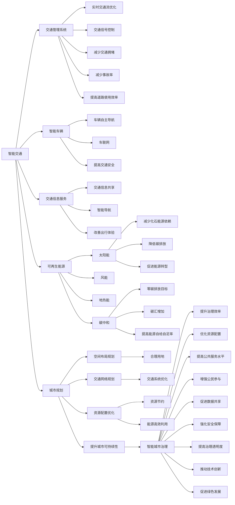

                 

# AI与人类计算：打造可持续发展的城市环境

> 关键词：城市计算, AI驱动的城市治理, 智慧城市, 智能交通, 可再生能源, 碳中和, 城市规划, 人工智能, 可持续性

## 1. 背景介绍

### 1.1 问题由来

随着城市化进程的加速和全球人口的快速增长，城市环境问题日益凸显。交通拥堵、能源消耗、环境污染、资源分配等问题严重制约了城市的可持续发展。为了应对这些挑战，需要引入先进的技术手段，实现城市管理的智能化、精细化。

### 1.2 问题核心关键点

城市环境问题主要集中在以下几个方面：

- **交通拥堵**：交通工具和交通设施过度使用，导致城市交通压力增大。
- **能源消耗**：城市运行所需的电力、供暖、制冷等能源消耗大。
- **环境污染**：城市生产生活活动产生大量废弃物和污染物质。
- **资源分配**：水、电、交通等资源分配不合理，导致供需矛盾。

解决这些问题的关键在于构建高效、智能、可持续的城市运行系统。其中，AI技术和大数据分析具有巨大的潜力，能够提供精准的数据分析、实时决策支持，从而优化城市管理。

## 2. 核心概念与联系

### 2.1 核心概念概述

- **城市计算(Urban Computing)**：利用计算技术和大数据方法，对城市运行状态进行实时监测、分析和预测，以支持城市管理决策。

- **AI驱动的城市治理(AI-based Urban Governance)**：通过引入AI技术，自动化、智能化地进行城市管理，提高治理效率和公平性。

- **智慧城市(Smart City)**：利用物联网、大数据、AI等技术，构建全面感知、智能决策、便捷服务和协同创新的城市治理模式。

- **智能交通(Intelligent Transportation System, ITS)**：通过交通管理系统、智能车辆、交通信息服务等手段，优化交通流，减少拥堵和事故。

- **可再生能源(Renewable Energy)**：利用太阳能、风能、地热能等清洁能源，替代传统化石能源，实现低碳发展。

- **碳中和(Carbon Neutrality)**：通过减少碳排放、增加碳汇，实现二氧化碳排放和吸收的平衡。

- **城市规划(Urban Planning)**：合理规划城市空间布局、交通网络、资源配置等，提升城市可持续性。

这些核心概念通过相互联系，构建了一个全面的城市管理框架，以支持智慧城市的建设。

### 2.2 核心概念原理和架构的 Mermaid 流程图



这个流程图展示了各个概念之间的联系，从智能交通、可再生能源到城市规划，最终支撑智慧城市的建设。

## 3. 核心算法原理 & 具体操作步骤

### 3.1 算法原理概述

AI与人类计算在城市环境治理中的应用，主要涉及以下几个方面：

- **数据采集与处理**：利用传感器、摄像头、GPS等设备，采集城市运行数据。使用大数据技术进行清洗、整合、分析，提取有价值的信息。

- **智能分析与预测**：利用机器学习、深度学习等算法，对城市运行状态进行实时分析、预测，识别潜在问题和风险。

- **决策支持与优化**：结合城市管理规则和专家知识，通过AI算法进行智能决策，优化资源配置和政策制定。

- **模型训练与评估**：基于历史数据和现实场景，训练AI模型，评估模型效果，优化模型参数。

### 3.2 算法步骤详解

1. **数据采集与预处理**：
   - 部署传感器、摄像头、GPS等设备，采集城市运行数据。
   - 清洗数据，去除噪声和异常值，整合不同来源的数据。
   - 数据标准化，归一化处理，提高数据质量。

2. **智能分析与预测**：
   - 使用时间序列分析、回归分析等方法，对交通流量、能源消耗等数据进行趋势预测。
   - 应用深度学习模型，如LSTM、CNN、GRU等，进行交通流量预测、交通拥堵检测等任务。
   - 引入图像识别技术，对城市环境进行实时监控和识别，如车辆违章检测、垃圾分类识别等。

3. **决策支持与优化**：
   - 基于历史数据和实时数据，训练AI模型，进行交通流优化、能源配置优化等决策。
   - 结合城市管理规则和专家知识，优化决策方案，提高决策科学性。
   - 引入强化学习算法，优化资源分配，提高城市运行效率。

4. **模型训练与评估**：
   - 使用历史数据和实时数据训练AI模型，优化模型参数。
   - 在验证集上评估模型效果，调整模型结构和参数。
   - 定期更新模型，适应城市运行状态的变化。

### 3.3 算法优缺点

#### 优点：

- **实时性高**：AI技术能够快速处理大量数据，提供实时决策支持，提高城市管理效率。
- **精度高**：深度学习模型和大数据分析技术，可以提供高精度的分析和预测结果。
- **适应性强**：AI模型能够自适应变化的环境和条件，提供灵活的解决方案。
- **集成度高**：能够整合多种数据源和技术手段，形成综合性的城市管理平台。

#### 缺点：

- **数据依赖性强**：AI模型的效果高度依赖于数据的质量和多样性。
- **模型复杂度高**：深度学习模型的训练和优化需要大量计算资源。
- **解释性差**：AI模型的决策过程较难解释，难以理解其内部逻辑。
- **成本高**：传感器、数据存储、计算资源等成本较高。

### 3.4 算法应用领域

AI与人类计算在城市环境治理中的应用领域非常广泛，包括但不限于：

- **智能交通**：利用AI技术优化交通信号、导航系统，提高交通效率，减少拥堵。
- **能源管理**：通过AI技术优化能源分配和利用，提高能源效率，减少能源浪费。
- **环境监测**：利用AI技术进行空气质量监测、水体监测、噪音监测等，提升城市环境质量。
- **公共安全**：利用AI技术进行城市安全监控、犯罪预测等，保障城市安全。
- **资源管理**：利用AI技术优化水资源、土地资源、交通资源等分配，提高资源利用率。

## 4. 数学模型和公式 & 详细讲解 & 举例说明

### 4.1 数学模型构建

城市环境治理中的AI模型构建，主要涉及以下几个方面：

- **数据采集与预处理模型**：用于数据清洗、归一化等预处理操作。
- **智能分析与预测模型**：用于交通流量预测、能源消耗预测等任务。
- **决策支持与优化模型**：用于资源配置优化、交通流优化等决策问题。
- **模型训练与评估模型**：用于模型训练、参数优化等任务。

### 4.2 公式推导过程

#### 交通流量预测模型

假设交通流量数据为 $x_i$，预测模型为 $f(x_i;\theta)$，其中 $\theta$ 为模型参数。模型采用LSTM网络，公式如下：

$$
f(x_i;\theta) = \sigma(W_h \cdot x_i + b_h + U_h \cdot f(x_{i-1};\theta)) + \epsilon_i
$$

其中，$W_h, b_h, U_h$ 为LSTM网络中的权重矩阵和偏置向量，$\epsilon_i$ 为噪声项。

### 4.3 案例分析与讲解

假设某城市交通流量数据为 $x_i = \{x_1, x_2, \dots, x_n\}$，利用LSTM模型进行交通流量预测，步骤如下：

1. 数据预处理：对原始数据进行归一化处理，生成处理后的数据集 $x_i^{\prime}$。
2. 模型训练：使用LSTM模型对 $x_i^{\prime}$ 进行训练，得到模型参数 $\theta^*$。
3. 预测应用：利用训练好的模型 $f(x_i^{\prime};\theta^*)$，对未来时间段的交通流量进行预测。

## 5. 项目实践：代码实例和详细解释说明

### 5.1 开发环境搭建

1. **安装Python**：使用Anaconda或Miniconda安装Python 3.8及以上版本。
2. **安装必要的Python库**：
   - `numpy`：用于数值计算。
   - `pandas`：用于数据处理。
   - `scikit-learn`：用于机器学习模型训练。
   - `tensorflow`：用于深度学习模型构建。
   - `keras`：用于快速构建神经网络模型。

### 5.2 源代码详细实现

以下是使用LSTM网络进行交通流量预测的Python代码实现：

```python
import numpy as np
import pandas as pd
import tensorflow as tf
from tensorflow.keras.models import Sequential
from tensorflow.keras.layers import LSTM, Dense, Dropout

# 数据预处理
def preprocess_data(data):
    # 对数据进行归一化处理
    data = (data - data.mean()) / data.std()
    return data

# 模型构建
def build_model(input_size, output_size, hidden_size, num_layers):
    model = Sequential()
    model.add(LSTM(hidden_size, input_shape=(input_size, 1), return_sequences=True))
    model.add(Dropout(0.2))
    model.add(LSTM(hidden_size, return_sequences=True))
    model.add(Dropout(0.2))
    model.add(Dense(output_size))
    model.compile(optimizer='adam', loss='mse')
    return model

# 数据加载与预处理
data = pd.read_csv('traffic_data.csv')
data = preprocess_data(data)

# 模型训练
model = build_model(input_size=10, output_size=1, hidden_size=50, num_layers=2)
model.fit(data[0:-1, :], data[1:, 0], epochs=50, batch_size=32)

# 模型预测
future_data = preprocess_data(data[-10:])
predictions = model.predict(future_data)
```

### 5.3 代码解读与分析

- **数据预处理**：对原始数据进行归一化处理，生成处理后的数据集。
- **模型构建**：使用LSTM网络构建预测模型，包含两个LSTM层和一个全连接层。
- **模型训练**：使用训练数据集进行模型训练，优化模型参数。
- **模型预测**：利用训练好的模型对未来时间段的交通流量进行预测。

### 5.4 运行结果展示

运行上述代码，可以生成训练好的LSTM模型，并对其进行预测，输出未来时间段的交通流量。

## 6. 实际应用场景

### 6.1 智能交通

智能交通是AI与人类计算在城市环境治理中的重要应用之一。通过AI技术，可以实现交通信号优化、智能导航、车辆自主驾驶等功能，大幅提高交通效率，减少交通拥堵。

### 6.2 能源管理

能源管理是AI与人类计算的另一个重要应用领域。利用AI技术，可以对能源消耗进行实时监测和预测，优化能源分配和利用，提高能源效率，减少能源浪费。

### 6.3 环境监测

环境监测是城市环境治理的重要环节。利用AI技术，可以对空气质量、水体质量、噪音等进行实时监测和预测，及时发现环境问题，采取措施进行改善。

### 6.4 未来应用展望

未来，AI与人类计算在城市环境治理中的应用将更加广泛和深入，涵盖更多领域和方面。例如：

- **智能建筑**：通过AI技术优化建筑能源使用，提高能源利用效率。
- **智能医疗**：利用AI技术进行健康数据分析，提升公共卫生水平。
- **智能环境监测**：引入AI技术，实现对环境变化的全天候监测和预警。

## 7. 工具和资源推荐

### 7.1 学习资源推荐

- **《智慧城市技术与应用》**：详细介绍智慧城市的构建和应用，涵盖智能交通、能源管理、环境监测等多个领域。
- **《深度学习：理论、算法与应用》**：深入讲解深度学习的基本原理和应用，包括交通流量预测、智能驾驶等任务。
- **《人工智能与城市管理》**：探讨AI技术在城市管理中的应用，涵盖智能交通、资源管理等多个方面。

### 7.2 开发工具推荐

- **TensorFlow**：用于构建和训练深度学习模型。
- **Keras**：用于快速构建和训练神经网络模型。
- **Jupyter Notebook**：用于编写和运行Python代码，支持数据分析、模型训练等任务。
- **Tableau**：用于数据可视化，帮助理解和分析城市数据。

### 7.3 相关论文推荐

- **《智慧城市技术体系研究》**：提出智慧城市的定义、体系架构、关键技术等，探讨智慧城市的未来发展方向。
- **《AI在城市环境治理中的应用》**：探讨AI技术在城市环境治理中的各种应用，包括智能交通、能源管理、环境监测等。
- **《智能城市发展战略研究》**：提出智能城市的发展战略、关键技术、应用场景等，为智能城市的构建提供指导。

## 8. 总结：未来发展趋势与挑战

### 8.1 研究成果总结

AI与人类计算在城市环境治理中的应用，已经取得了显著的成果，但仍然面临一些挑战和问题。需要进一步提升模型的精度和鲁棒性，优化资源配置，提高数据质量，加强模型解释性，降低成本等。

### 8.2 未来发展趋势

未来，AI与人类计算在城市环境治理中的应用将更加广泛和深入，涵盖更多领域和方面。例如：

- **智能化程度提高**：随着技术的发展，AI在城市管理中的应用将更加智能化、自动化。
- **数据融合技术成熟**：数据融合技术将进一步成熟，实现多源数据的无缝集成和共享。
- **AI与人类协同增强**：AI与人类协同增强，提供更高效、更公正的决策支持。
- **可持续发展成为主流**：AI技术将更多地应用于可持续发展领域，推动城市绿色转型。

### 8.3 面临的挑战

AI与人类计算在城市环境治理中仍面临一些挑战：

- **数据质量问题**：城市数据的质量和多样性对AI模型的效果有重要影响，需要解决数据采集、清洗等问题。
- **模型解释性不足**：AI模型的决策过程较难解释，难以理解其内部逻辑。
- **资源和成本问题**：AI技术的开发和应用需要大量资源和成本，需要找到降低成本的方法。
- **伦理和隐私问题**：AI技术在城市管理中的应用可能涉及隐私保护和伦理问题，需要加强管理和规范。

### 8.4 研究展望

未来的研究可以从以下几个方面进行：

- **数据融合技术**：研究数据融合技术，实现多源数据的无缝集成和共享。
- **模型解释性增强**：提高AI模型的解释性，提供可解释的决策支持。
- **绿色AI技术**：开发绿色AI技术，减少AI技术的碳足迹，推动可持续发展。
- **伦理和安全保障**：加强AI技术的伦理和安全保障，确保其应用符合伦理规范和法律要求。

## 9. 附录：常见问题与解答

**Q1：AI与人类计算在城市环境治理中面临哪些挑战？**

A: AI与人类计算在城市环境治理中面临的主要挑战包括：
- **数据质量问题**：城市数据的质量和多样性对AI模型的效果有重要影响，需要解决数据采集、清洗等问题。
- **模型解释性不足**：AI模型的决策过程较难解释，难以理解其内部逻辑。
- **资源和成本问题**：AI技术的开发和应用需要大量资源和成本，需要找到降低成本的方法。
- **伦理和隐私问题**：AI技术在城市管理中的应用可能涉及隐私保护和伦理问题，需要加强管理和规范。

**Q2：如何提高AI模型的解释性？**

A: 提高AI模型的解释性可以从以下几个方面进行：
- **可解释模型选择**：选择可解释性较好的模型，如决策树、线性回归等。
- **模型可视化**：使用可视化工具，如图像化表示、可解释图等，帮助理解模型决策过程。
- **特征重要性分析**：通过特征重要性分析，了解模型决策中最重要的特征，提高模型的可解释性。

**Q3：如何降低AI技术的成本？**

A: 降低AI技术的成本可以从以下几个方面进行：
- **模型压缩与优化**：使用模型压缩和优化技术，减少模型参数量，提高计算效率。
- **云计算与分布式计算**：利用云计算和分布式计算，降低硬件成本，提高计算效率。
- **数据共享与合作**：通过数据共享与合作，实现资源复用，降低数据采集和清洗成本。

**Q4：如何保障AI技术的伦理和安全？**

A: 保障AI技术的伦理和安全可以从以下几个方面进行：
- **伦理规范制定**：制定AI技术的伦理规范，确保其应用符合伦理规范和法律要求。
- **隐私保护措施**：采取隐私保护措施，如数据加密、匿名化处理等，确保数据安全。
- **透明公开机制**：建立透明公开机制，确保AI技术的决策过程和结果公开透明，接受监督。

---

作者：禅与计算机程序设计艺术 / Zen and the Art of Computer Programming

