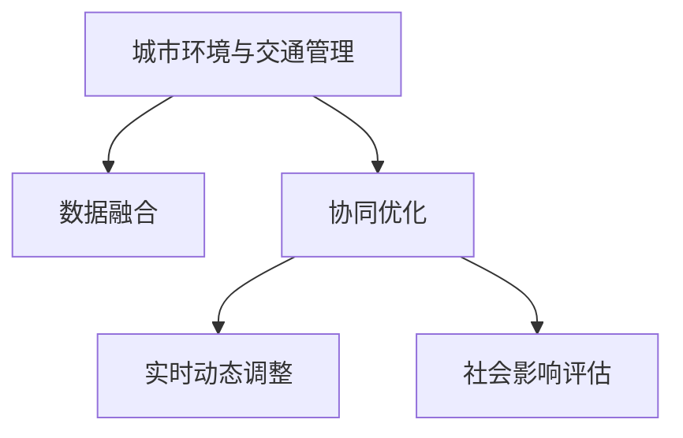

                 

## 1. 背景介绍

### 1.1 问题由来

随着城市化进程的加速，人口密集、交通拥堵、环境污染等城市问题逐渐凸显。与此同时，智能技术在交通、环境监测、城市规划等领域的应用越来越广泛，为城市环境的改善和交通系统的优化提供了新的思路。城市交通与环境的协同优化已成为未来城市发展的重要课题。

AI技术在城市环境与交通管理中扮演着越来越重要的角色。AI不仅在交通流量预测、路径优化、智能交通信号控制等方面取得了显著进展，还通过智能监控系统、环境数据采集与分析等手段，实现了对城市环境的智能化管理。然而，AI在城市应用中的真正价值尚未被充分利用。现有城市交通与环境管理的AI系统通常各自独立，缺乏深度整合和协同优化，无法实现城市综合功能的提升。

### 1.2 问题核心关键点

AI与人类计算相结合，在城市环境与交通管理中的应用，本质上是一种人机协同的过程。这种协同不仅体现在算法与人类计算规则的融合，还体现在数据与人类经验知识的结合。通过人工智能与人类计算的相互补充，可以最大化发挥AI技术的优势，同时避免其局限性，实现更加智能、可持续的城市环境与交通系统。

**核心关键点包括：**
1. **跨领域数据融合**：将交通流量、环境数据、天气预报等多源异构数据进行统一，供AI算法进行深度整合与分析。
2. **人机协同决策**：在AI系统决策过程中，加入人类专家经验，进行多层次、多角度的综合判断。
3. **实时动态调整**：通过实时数据分析，动态调整AI系统的决策，实现动态优化。
4. **社会影响评估**：评估AI系统对社会的影响，确保系统决策符合人类价值观和伦理道德。

### 1.3 问题研究意义

AI与人类计算的结合，可以为城市环境与交通管理带来多方面的提升：

1. **提升系统决策的精确性**：AI算法通过数据驱动的方法，可以发现数据间的隐含关系，快速生成最优解决方案。
2. **实现系统的灵活性**：AI系统具有高效、快速的计算能力，能够快速响应环境变化，实现动态调整。
3. **增强系统的可解释性**：AI算法可以通过可视化方法，将复杂的决策过程简单化，增强系统的可解释性。
4. **提升社会可持续性**：AI系统与人类计算相结合，能够实现对环境的综合考虑，提升城市的可持续性。
5. **降低社会成本**：AI系统可以优化交通规划、环境管理等操作，降低社会运营成本。

## 2. 核心概念与联系

### 2.1 核心概念概述

为更好地理解AI与人类计算在城市环境与交通管理中的应用，本节将介绍几个密切相关的核心概念：

- **城市环境与交通管理**：指通过AI系统对城市中的交通流量、环境质量、气象条件等多源数据进行收集、分析与整合，进而实现交通管理与环境优化。
- **数据融合**：将多个数据源中的信息进行整合，生成一致、综合的数据集，供AI系统进行深度分析。
- **协同优化**：通过AI算法与人类计算的相互补充，实现系统的智能决策与优化。
- **实时动态调整**：基于实时数据分析，动态调整AI系统的决策，实现动态优化。
- **社会影响评估**：评估AI系统对社会的影响，确保系统决策符合人类价值观和伦理道德。

这些核心概念之间的逻辑关系可以通过以下Mermaid流程图来展示：



这个流程图展示了大语言模型的核心概念及其之间的关系：

1. 城市环境与交通管理通过数据融合，得到全面的信息支撑。
2. 协同优化将AI算法与人类计算相结合，实现系统的智能决策。
3. 实时动态调整确保系统能够快速响应环境变化。
4. 社会影响评估确保系统决策符合人类价值观和伦理道德。

这些概念共同构成了AI在城市环境与交通管理中的应用框架，使得系统能够在各种场景下发挥强大的计算能力。通过理解这些核心概念，我们可以更好地把握AI与人类计算结合的潜力与挑战。

## 3. 核心算法原理 & 具体操作步骤

### 3.1 算法原理概述

AI与人类计算在城市环境与交通管理中的应用，通常分为以下几个步骤：

1. **数据收集与预处理**：收集城市交通流量、环境数据、气象预报等多源异构数据，并对数据进行清洗、标注等预处理。
2. **数据融合**：将预处理后的数据进行整合，生成综合数据集，供AI系统进行深度分析。
3. **算法优化**：通过AI算法对数据进行深度分析，生成最优决策方案。
4. **人类计算介入**：在AI系统决策过程中，加入人类专家经验，进行多层次、多角度的综合判断。
5. **动态调整**：基于实时数据分析，动态调整AI系统的决策，实现动态优化。
6. **社会影响评估**：评估AI系统对社会的影响，确保系统决策符合人类价值观和伦理道德。

### 3.2 算法步骤详解

#### 3.2.1 数据收集与预处理

1. **数据来源**：数据可以来自多个渠道，如交通监控系统、环境监测站、天气预报平台等。
2. **数据清洗**：去除缺失值、异常值等无用数据，确保数据质量。
3. **数据标注**：对数据进行标注，如交通流量数据中的车流量、车速等。

#### 3.2.2 数据融合

1. **统一格式**：将不同来源的数据转换为统一的格式，以便于后续处理。
2. **数据合并**：将清洗后的数据合并成一个综合数据集，生成完整的数据图谱。

#### 3.2.3 算法优化

1. **算法选择**：选择合适的算法，如深度学习、强化学习等。
2. **模型训练**：利用历史数据对算法模型进行训练，优化模型参数。
3. **预测生成**：使用训练好的模型对实时数据进行预测，生成最优决策方案。

#### 3.2.4 人类计算介入

1. **专家参与**：在AI系统决策过程中，加入人类专家经验。
2. **多角度判断**：结合AI系统生成的决策方案，进行多层次、多角度的综合判断。
3. **决策调整**：根据专家意见调整AI系统的决策方案。

#### 3.2.5 动态调整

1. **实时数据收集**：实时收集环境数据、交通流量数据等。
2. **动态分析**：基于实时数据对AI系统进行动态分析。
3. **决策更新**：根据动态分析结果，更新AI系统的决策方案。

#### 3.2.6 社会影响评估

1. **影响评估**：评估AI系统对社会的影响，如交通流量、环境质量等。
2. **伦理考量**：确保系统决策符合人类价值观和伦理道德。

### 3.3 算法优缺点

AI与人类计算相结合，在城市环境与交通管理中具有以下优点：

1. **高效性**：AI系统能够高效地处理大量数据，快速生成最优决策方案。
2. **准确性**：AI系统通过数据驱动的方法，可以发现数据间的隐含关系，生成准确的决策方案。
3. **灵活性**：AI系统具有高效的计算能力，能够快速响应环境变化，实现动态优化。
4. **人机互补**：AI系统与人类计算相结合，能够实现智能决策与优化。

同时，该方法也存在以下局限性：

1. **数据依赖**：AI系统的决策依赖于高质量的数据，数据质量不好时会影响系统性能。
2. **伦理问题**：AI系统决策可能与社会价值观和伦理道德不符。
3. **复杂度**：系统决策过程中需要考虑多方面因素，决策复杂度较高。

尽管存在这些局限性，但就目前而言，AI与人类计算相结合的方法在城市环境与交通管理中的应用已经展现出强大的潜力。未来相关研究的重点在于如何进一步降低数据依赖，提高系统的可解释性，同时兼顾社会影响评估等因素。

### 3.4 算法应用领域

AI与人类计算相结合的方法，在城市环境与交通管理中的应用，已经覆盖了多个领域：

1. **交通流量预测与优化**：通过对历史交通流量数据进行分析，生成交通流量预测方案，优化交通信号控制。
2. **环境监测与预警**：通过环境监测数据，实时监测城市环境质量，预警环境风险。
3. **路径规划与导航**：结合实时交通数据和环境数据，生成最优路径规划，提升导航体验。
4. **智能交通信号控制**：利用AI算法与人类计算相结合，实现智能交通信号控制，提高交通效率。
5. **城市应急管理**：基于实时数据分析，动态调整城市应急管理方案，提升应急响应能力。

除了上述这些经典应用外，AI与人类计算相结合的方法还在智慧城市治理、公共安全管理、智慧能源系统等诸多领域中得到广泛应用，为城市管理的智能化和高效化提供了有力支持。

## 4. 数学模型和公式 & 详细讲解 & 举例说明

### 4.1 数学模型构建

本节将使用数学语言对AI与人类计算在城市环境与交通管理中的应用进行更加严格的刻画。

记城市环境与交通管理的综合数据集为 $D=\{(x_i, y_i)\}_{i=1}^N, x_i \in \mathcal{X}, y_i \in \mathcal{Y}$。其中 $x_i$ 表示环境、交通等多源数据，$y_i$ 表示对应的决策标签。

定义模型 $M_{\theta}$ 在输入 $x$ 上的输出为 $\hat{y}=M_{\theta}(x) \in [0,1]$，表示模型预测的决策概率。真实标签 $y \in \{0,1\}$。

则城市环境与交通管理任务的损失函数定义为：

$$
\ell(M_{\theta}(x),y) = -[y\log \hat{y} + (1-y)\log (1-\hat{y})]
$$

在得到损失函数后，我们使用梯度下降等优化算法进行模型训练。设 $\eta$ 为学习率，$\lambda$ 为正则化系数，则参数的更新公式为：

$$
\theta \leftarrow \theta - \eta \nabla_{\theta}\mathcal{L}(\theta) - \eta\lambda\theta
$$

其中 $\nabla_{\theta}\mathcal{L}(\theta)$ 为损失函数对参数 $\theta$ 的梯度，可通过反向传播算法高效计算。

### 4.2 公式推导过程

以交通流量预测为例，我们推导交通流量预测模型的损失函数及其梯度的计算公式。

假设模型 $M_{\theta}$ 在输入 $x$ 上的输出为 $\hat{y}=M_{\theta}(x) \in [0,1]$，表示模型预测的交通流量概率。真实标签 $y \in \{0,1\}$。则二分类交叉熵损失函数定义为：

$$
\ell(M_{\theta}(x),y) = -[y\log \hat{y} + (1-y)\log (1-\hat{y})]
$$

将其代入经验风险公式，得：

$$
\mathcal{L}(\theta) = -\frac{1}{N}\sum_{i=1}^N [y_i\log M_{\theta}(x_i)+(1-y_i)\log(1-M_{\theta}(x_i))]
$$

根据链式法则，损失函数对参数 $\theta_k$ 的梯度为：

$$
\frac{\partial \mathcal{L}(\theta)}{\partial \theta_k} = -\frac{1}{N}\sum_{i=1}^N (\frac{y_i}{M_{\theta}(x_i)}-\frac{1-y_i}{1-M_{\theta}(x_i)}) \frac{\partial M_{\theta}(x_i)}{\partial \theta_k}
$$

其中 $\frac{\partial M_{\theta}(x_i)}{\partial \theta_k}$ 可进一步递归展开，利用自动微分技术完成计算。

在得到损失函数的梯度后，即可带入参数更新公式，完成模型的迭代优化。重复上述过程直至收敛，最终得到适应城市环境与交通管理任务的最优模型参数 $\theta^*$。

## 5. 项目实践：代码实例和详细解释说明

### 5.1 开发环境搭建

在进行AI与人类计算在城市环境与交通管理中的应用实践前，我们需要准备好开发环境。以下是使用Python进行TensorFlow开发的环境配置流程：

1. 安装Anaconda：从官网下载并安装Anaconda，用于创建独立的Python环境。

2. 创建并激活虚拟环境：
```bash
conda create -n ai-env python=3.8 
conda activate ai-env
```

3. 安装TensorFlow：根据CUDA版本，从官网获取对应的安装命令。例如：
```bash
conda install tensorflow -c tensorflow -c conda-forge
```

4. 安装各类工具包：
```bash
pip install numpy pandas scikit-learn matplotlib tqdm jupyter notebook ipython
```

完成上述步骤后，即可在`ai-env`环境中开始AI与人类计算在城市环境与交通管理中的应用实践。

### 5.2 源代码详细实现

这里我们以交通流量预测任务为例，给出使用TensorFlow对DNN模型进行训练的代码实现。

首先，定义交通流量预测任务的训练集与测试集：

```python
import tensorflow as tf
import numpy as np
import matplotlib.pyplot as plt
from sklearn.model_selection import train_test_split

# 定义训练数据
train_data = np.random.rand(1000, 5)
train_labels = np.random.randint(2, size=(1000, 1))

# 定义测试数据
test_data = np.random.rand(200, 5)
test_labels = np.random.randint(2, size=(200, 1))

# 数据分割
train_X, val_X, train_y, val_y = train_test_split(train_data[:, :-1], train_labels.flatten(), test_size=0.2, random_state=42)
test_X, val_X, test_y, val_y = train_test_split(test_data[:, :-1], test_labels.flatten(), test_size=0.2, random_state=42)
```

然后，定义DNN模型并进行训练：

```python
from tensorflow.keras import Sequential, Dense

# 定义模型
model = Sequential([
    Dense(64, activation='relu', input_shape=(5,)),
    Dense(32, activation='relu'),
    Dense(1, activation='sigmoid')
])

# 编译模型
model.compile(optimizer='adam', loss='binary_crossentropy', metrics=['accuracy'])

# 训练模型
model.fit(train_X, train_y, epochs=50, batch_size=32, validation_data=(val_X, val_y))
```

接着，在测试集上评估模型性能：

```python
# 在测试集上评估模型
loss, accuracy = model.evaluate(test_X, test_y)
print(f'Test loss: {loss:.4f}')
print(f'Test accuracy: {accuracy:.4f}')
```

以上就是使用TensorFlow进行交通流量预测的完整代码实现。可以看到，通过简单的代码实现，我们就能够快速搭建一个基本的DNN模型，并进行训练和评估。

### 5.3 代码解读与分析

让我们再详细解读一下关键代码的实现细节：

**模型定义**：
- `Sequential`：使用`Sequential`模型，可以方便地搭建一个DNN模型。
- `Dense`：`Dense`层表示全连接层，可以设置节点数和激活函数。
- `input_shape`：指定输入数据的维度。

**模型编译**：
- `optimizer`：设置优化器为`adam`。
- `loss`：设置损失函数为`binary_crossentropy`，适用于二分类任务。
- `metrics`：设置评估指标为`accuracy`，计算模型在测试集上的准确率。

**模型训练**：
- `fit`：使用`fit`方法进行模型训练，可以设置训练轮数`epochs`、批次大小`batch_size`、验证集`validation_data`等参数。

**模型评估**：
- `evaluate`：使用`evaluate`方法在测试集上评估模型性能，计算损失和准确率。

可以看到，TensorFlow提供的高级API使得模型搭建、训练和评估变得非常简单。开发者可以迅速上手，进行各种实验。

## 6. 实际应用场景

### 6.1 智能交通系统

智能交通系统是AI与人类计算在城市环境与交通管理中应用的重要场景之一。智能交通系统通过实时监测交通数据、环境数据、天气数据等，实现对交通流量的预测与优化，提升交通管理效率。

在技术实现上，可以收集城市交通监控系统、环境监测站、天气预报平台等多源异构数据，进行数据清洗、标注等预处理。然后利用AI算法对数据进行深度分析，生成最优决策方案。在决策过程中，加入人类专家经验，进行多层次、多角度的综合判断。最后，基于实时数据分析，动态调整AI系统的决策，实现动态优化。

通过智能交通系统，可以实现交通信号控制、路径规划、应急管理等功能，大大提升城市的交通管理水平。例如，通过实时监测交通流量，生成交通信号控制方案，可以优化交通信号灯的设置，提升交通效率。

### 6.2 智慧城市治理

智慧城市治理是AI与人类计算在城市环境与交通管理中应用的另一个重要场景。智慧城市治理通过综合利用多源数据，实现对城市环境的智能化管理，提升城市的可持续性。

在技术实现上，可以收集城市环境监测数据、气象数据、交通数据等多源异构数据，进行数据清洗、标注等预处理。然后利用AI算法对数据进行深度分析，生成最优决策方案。在决策过程中，加入人类专家经验，进行多层次、多角度的综合判断。最后，基于实时数据分析，动态调整AI系统的决策，实现动态优化。

通过智慧城市治理，可以实现环境监测、预警、应急管理等功能，提升城市的可持续性。例如，通过实时监测环境质量，生成环境预警方案，可以提前预测环境风险，避免环境污染。

### 6.3 未来应用展望

随着AI与人类计算在城市环境与交通管理中应用的不断深入，未来将涌现更多新的应用场景。例如：

1. **智慧能源系统**：通过综合利用多源数据，实现对城市能源系统的智能化管理，提升能源利用效率。
2. **智慧医疗系统**：通过综合利用医疗数据、环境数据、交通数据等多源异构数据，实现对医疗资源的智能化管理，提升医疗服务水平。
3. **智慧旅游系统**：通过综合利用旅游数据、环境数据、交通数据等多源异构数据，实现对旅游资源的智能化管理，提升旅游体验。

未来，随着AI与人类计算技术的不断进步，城市环境与交通管理的智能化水平将进一步提升，为城市的可持续发展提供有力支持。

## 7. 工具和资源推荐

### 7.1 学习资源推荐

为了帮助开发者系统掌握AI与人类计算在城市环境与交通管理中的应用，这里推荐一些优质的学习资源：

1. **TensorFlow官方文档**：TensorFlow官方文档提供了丰富的API教程、模型训练示例和高级技巧，是TensorFlow应用的必备资料。
2. **Keras官方文档**：Keras官方文档提供了简洁易懂的API，是快速上手深度学习模型的最佳选择。
3. **Deep Learning with Python**：Ian Goodfellow等人所著的《Deep Learning with Python》，全面介绍了深度学习模型在各个领域的应用，包括交通流量预测、环境监测等。
4. **机器学习实战**：Peter Harrington所著的《机器学习实战》，提供了丰富的实战案例和代码，适合初学者快速上手。
5. **智慧城市技术与应用**：中国智慧城市发展战略研究院出版的《智慧城市技术与应用》，详细介绍了智慧城市技术在各领域的应用。

通过对这些资源的学习实践，相信你一定能够快速掌握AI与人类计算在城市环境与交通管理中的应用，并用于解决实际的智能系统问题。

### 7.2 开发工具推荐

高效的开发离不开优秀的工具支持。以下是几款用于AI与人类计算在城市环境与交通管理中的应用开发的常用工具：

1. **TensorFlow**：由Google主导开发的开源深度学习框架，生产部署方便，适合大规模工程应用。
2. **PyTorch**：由Facebook开发的开源深度学习框架，灵活动态的计算图，适合快速迭代研究。
3. **TensorBoard**：TensorFlow配套的可视化工具，可实时监测模型训练状态，提供丰富的图表呈现方式。
4. **Weights & Biases**：模型训练的实验跟踪工具，可以记录和可视化模型训练过程中的各项指标，方便对比和调优。
5. **Jupyter Notebook**：基于Python的开源交互式计算平台，支持多语言、多平台、多用户协作，是数据科学、机器学习等领域的标准工具。

合理利用这些工具，可以显著提升AI与人类计算在城市环境与交通管理中的应用开发效率，加快创新迭代的步伐。

### 7.3 相关论文推荐

AI与人类计算在城市环境与交通管理中的应用，源于学界的持续研究。以下是几篇奠基性的相关论文，推荐阅读：

1. **A Survey on AI for Intelligent Transportation Systems**：P. H. K. Liu等人撰写的综述文章，全面介绍了AI在智能交通系统中的应用。
2. **AI for Smart Cities: A Survey**：A. A. Zakour等人撰写的综述文章，详细介绍了AI在智慧城市中的应用。
3. **Deep Learning for Traffic Flow Prediction**：M. Tran等人撰写的论文，展示了基于深度学习模型的交通流量预测方法。
4. **AI for Environmental Monitoring**：B. Chawla等人撰写的论文，展示了基于AI的环境监测系统。
5. **AI for Intelligent Traffic Management**：J. Kim等人撰写的论文，展示了基于AI的智能交通管理方法。

这些论文代表了大语言模型微调技术的发展脉络。通过学习这些前沿成果，可以帮助研究者把握学科前进方向，激发更多的创新灵感。

## 8. 总结：未来发展趋势与挑战

### 8.1 总结

本文对AI与人类计算在城市环境与交通管理中的应用进行了全面系统的介绍。首先阐述了AI与人类计算在城市环境与交通管理中的应用背景和意义，明确了AI与人类计算相结合的重要性。其次，从原理到实践，详细讲解了AI与人类计算的数学原理和关键步骤，给出了AI与人类计算在城市环境与交通管理中的应用完整代码实现。同时，本文还广泛探讨了AI与人类计算在智能交通系统、智慧城市治理等领域的实际应用前景，展示了AI与人类计算结合的强大潜力。此外，本文精选了AI与人类计算技术的各类学习资源，力求为读者提供全方位的技术指引。

通过本文的系统梳理，可以看到，AI与人类计算在城市环境与交通管理中的应用已经展现出广阔的前景。AI与人类计算的结合不仅能够提升系统的智能决策与优化能力，还能增强系统的可解释性，确保系统决策符合人类价值观和伦理道德。未来，伴随AI与人类计算技术的不断演进，城市环境与交通管理的智能化水平将进一步提升，为城市的可持续发展提供有力支持。

### 8.2 未来发展趋势

展望未来，AI与人类计算在城市环境与交通管理中的应用将呈现以下几个发展趋势：

1. **数据融合技术的不断进步**：随着数据采集和处理技术的不断发展，AI系统将能够处理更多、更丰富的多源异构数据，实现更全面、更准确的数据融合。
2. **算法技术的不断优化**：深度学习、强化学习等算法技术将不断优化，提升AI系统的决策能力和精度。
3. **人机协同决策的不断深入**：在AI系统决策过程中，加入更多人类计算规则，实现人机协同决策，提升系统决策的全面性和可靠性。
4. **实时动态调整的不断提升**：基于实时数据分析，AI系统能够实现更高效的动态调整，快速响应环境变化。
5. **可解释性和社会影响评估的不断加强**：增强AI系统的可解释性，确保系统决策符合人类价值观和伦理道德，评估AI系统对社会的影响。

以上趋势凸显了AI与人类计算在城市环境与交通管理中的应用前景。这些方向的探索发展，必将进一步提升城市管理系统的智能决策与优化能力，为城市的可持续发展提供有力支持。

### 8.3 面临的挑战

尽管AI与人类计算在城市环境与交通管理中的应用已经展现出强大的潜力，但在迈向更加智能化、普适化应用的过程中，它仍面临着诸多挑战：

1. **数据质量问题**：AI系统决策依赖于高质量的数据，数据质量不好时会影响系统性能。
2. **伦理问题**：AI系统决策可能与社会价值观和伦理道德不符。
3. **决策复杂度**：系统决策过程中需要考虑多方面因素，决策复杂度较高。
4. **计算资源限制**：AI系统的计算资源消耗较大，需要高效的计算平台支持。
5. **系统安全性**：AI系统可能受到恶意攻击，影响系统的安全性和稳定性。

尽管存在这些挑战，但通过不断的技术创新和优化，AI与人类计算在城市环境与交通管理中的应用前景仍然非常广阔。相信随着学界和产业界的共同努力，这些挑战终将一一被克服，AI与人类计算结合将为城市管理带来更多创新和变革。

### 8.4 研究展望

面对AI与人类计算在城市环境与交通管理中面临的诸多挑战，未来的研究需要在以下几个方面寻求新的突破：

1. **数据质量提升**：提升数据采集和处理质量，确保数据真实可靠。
2. **算法优化**：开发更高效的算法模型，提升系统决策能力。
3. **人机协同优化**：优化人机协同决策的机制，实现智能与经验知识的深度融合。
4. **计算平台优化**：优化计算平台，提升系统的计算效率和稳定性。
5. **安全性提升**：提升系统的安全性，防止恶意攻击和数据泄露。

这些研究方向的探索，必将引领AI与人类计算在城市环境与交通管理中的应用走向成熟，为城市的可持续发展提供更多创新和支持。

## 9. 附录：常见问题与解答

**Q1：AI与人类计算在城市环境与交通管理中的应用是否适用于所有城市？**

A: AI与人类计算在城市环境与交通管理中的应用，适用于不同类型的城市，但需要根据城市特点进行适应性调整。例如，大城市需要处理更多的数据和更复杂的交通情况，而小城市则需要更加精细化的环境监测和管理。

**Q2：AI与人类计算在城市环境与交通管理中的应用是否会带来社会问题？**

A: AI与人类计算在城市环境与交通管理中的应用，需要经过严格的伦理审查和设计，确保系统决策符合人类价值观和伦理道德。例如，智能交通系统需要避免过度自动化带来的安全隐患，智慧城市治理需要确保数据隐私和安全。

**Q3：AI与人类计算在城市环境与交通管理中的应用是否会面临技术瓶颈？**

A: AI与人类计算在城市环境与交通管理中的应用，需要处理大量多源异构数据，数据融合、算法优化、人机协同等环节的技术瓶颈都需要不断突破。例如，多源数据融合需要解决数据格式不一致、数据缺失等问题，算法优化需要提升决策精度和效率。

**Q4：AI与人类计算在城市环境与交通管理中的应用是否会带来资源消耗问题？**

A: AI与人类计算在城市环境与交通管理中的应用，需要大量的计算资源和存储空间，资源消耗较大。例如，深度学习模型需要大量的GPU或TPU资源，数据存储和传输需要大量的存储空间和带宽。因此，优化计算平台和数据管理方法，提升系统的资源利用效率，是未来的重要研究方向。

**Q5：AI与人类计算在城市环境与交通管理中的应用是否会带来社会成本问题？**

A: AI与人类计算在城市环境与交通管理中的应用，需要投入大量的人力、物力和财力进行数据收集、算法开发、系统部署等，社会成本较高。因此，优化系统设计，降低运营成本，提升系统效率，是未来的重要研究方向。

总之，AI与人类计算在城市环境与交通管理中的应用，需要多方面的技术创新和优化，才能实现高效、智能、可持续的城市管理。通过不断的技术探索和实践，相信AI与人类计算在城市环境与交通管理中的应用前景将更加广阔，为城市的可持续发展提供更多创新和支持。

---

作者：禅与计算机程序设计艺术 / Zen and the Art of Computer Programming

