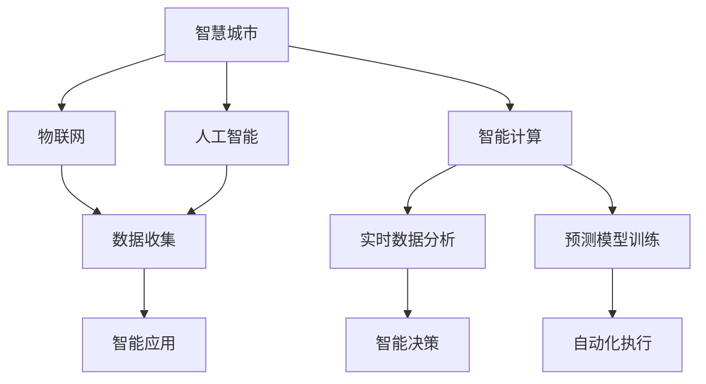

                 

# AI与人类计算：打造可持续发展的城市生活

> 关键词：人工智能,智能计算,城市生活,可持续发展,物联网(IoT),智慧城市,能源管理,垃圾处理,智能交通,公共安全

## 1. 背景介绍

### 1.1 问题由来

随着人口增长和技术进步，城市化进程迅速发展，带来了日益严峻的环境问题和社会挑战。传统城市管理模式已经无法满足日益增长的需求。在此背景下，智慧城市的理念应运而生，旨在通过先进的智能计算技术，优化城市资源配置，提高城市运营效率，实现可持续发展的目标。

城市生活中面临的问题包括但不限于交通堵塞、能源浪费、垃圾处理、公共安全等。这些问题不仅影响市民的生活质量，还对城市的可持续发展构成威胁。为此，需要引入人工智能(AI)技术，实现高效、智能、绿色的城市管理。

### 1.2 问题核心关键点

智慧城市的核心在于通过智能计算技术，全面感知城市运行状态，精确预测和优化城市资源配置。关键点包括：

- 城市数据的全面收集和高效处理
- 实时数据分析与预测
- 智能决策与自动化执行
- 人机协同的城市管理模式

这些关键点需要通过AI与物联网(IoT)的深度融合，实现智能计算技术在城市生活各方面的应用。

## 2. 核心概念与联系

### 2.1 核心概念概述

为更好地理解AI与智慧城市的关系，本节将介绍几个密切相关的核心概念：

- 智慧城市(Smart City)：利用先进的信息技术，包括物联网、云计算、大数据、人工智能等，对城市运行进行智能化管理，提升城市运行效率和服务水平。

- 物联网(IoT)：通过传感器、标签、RFID等技术手段，实时收集城市中的各类数据，实现人、物、环境的全面互联。

- 人工智能(AI)：以模拟人脑的工作原理为基础，利用机器学习、深度学习等技术手段，使计算机具备学习、推理、决策等智能能力。

- 智能计算：通过算法优化和模型训练，使计算资源能够高效处理大量复杂数据，实现精确分析和预测。

- 可持终发展(Sustainable Development)：在满足当前需求的同时，不损害后代人满足其需求的能力。

这些核心概念之间的逻辑关系可以通过以下Mermaid流程图来展示：



这个流程图展示了一个智慧城市中，AI、IoT、智能计算各环节的相互关系：

1. 智慧城市通过物联网技术全面收集城市数据，实现城市运行状态的实时感知。
2. 人工智能技术对收集的数据进行处理和分析，建立精确的预测模型。
3. 智能计算提供强大的计算能力，支持大数据的实时处理和预测分析。
4. 实时数据分析和预测生成智能决策，自动化执行系统进行优化。
5. 智能应用将上述各环节的成果落地，提升城市运行效率和服务水平。

## 3. 核心算法原理 & 具体操作步骤
### 3.1 算法原理概述

AI与智慧城市紧密相关，其核心算法原理主要包括以下几个方面：

- 实时数据采集与预处理：通过物联网技术，全面收集城市运行数据，包括交通流量、环境质量、能源消耗、公共设施状态等。
- 数据融合与特征提取：将采集的各类数据进行整合，提取有用的特征信息。
- 机器学习与深度学习：构建精确的预测模型，如时间序列预测、分类模型、生成模型等，实现智能决策。
- 智能决策与自动化执行：根据预测模型输出，制定智能决策方案，并通过自动化执行系统进行实施。
- 人机协同与优化算法：通过AI技术与人工干预相结合，进行决策优化和问题解决。

### 3.2 算法步骤详解

智慧城市中的AI算法主要分为以下几个步骤：

**Step 1: 数据收集与预处理**
- 通过物联网设备实时采集城市各类数据。
- 对采集到的数据进行清洗和预处理，去除噪声和异常值。

**Step 2: 数据融合与特征提取**
- 将不同来源的数据进行整合，生成统一的数据集。
- 对数据集进行特征工程，提取关键特征，为后续分析提供基础。

**Step 3: 构建预测模型**
- 选择合适的机器学习或深度学习算法，构建预测模型。
- 对模型进行训练和调参，确保模型的预测精度和泛化能力。

**Step 4: 智能决策与执行**
- 根据模型预测结果，制定智能决策方案。
- 通过自动化执行系统，将决策方案转化为具体行动。

**Step 5: 持续优化与改进**
- 实时监测模型预测结果和执行效果，不断优化算法和模型。
- 引入人机协同机制，对重要决策进行人工审核和干预。

### 3.3 算法优缺点

智慧城市中的AI算法具有以下优点：
1. 全面感知：通过物联网设备，实现城市运行状态的实时感知。
2. 精准预测：基于大数据和深度学习，实现高精度的预测和决策。
3. 高效执行：通过自动化执行系统，快速响应和调整城市运行状态。
4. 人机协同：结合人工干预，优化决策方案，确保安全和合理性。

但这些算法也存在一些缺点：
1. 数据隐私和安全：物联网设备广泛部署，可能涉及大量敏感信息，如何保障数据隐私和安全是一个挑战。
2. 模型鲁棒性：在面对异常数据和干扰时，预测模型的鲁棒性可能不足，需要进一步优化算法。
3. 计算资源：智慧城市涉及海量数据处理和实时分析，对计算资源的需求较高，需要优化算法和硬件配置。
4. 算法可解释性：AI模型的决策过程通常较为复杂，难以解释和理解，需要提升算法的可解释性。
5. 伦理和公平性：AI决策可能存在偏见和歧视，如何确保算法公平性和伦理性，是智慧城市应用的重要问题。

### 3.4 算法应用领域

AI与智慧城市的结合，在多个领域得到了广泛应用，例如：

- 智能交通：通过交通监控和预测，优化交通信号灯控制，减少交通拥堵。
- 能源管理：实时监测能源消耗情况，预测能源需求，优化能源分配。
- 垃圾处理：分析垃圾产生量，优化垃圾收集和处理流程，减少环境污染。
- 公共安全：实时监测公共场所安全状态，预警潜在风险，保障市民安全。
- 环境监测：收集环境数据，预测环境变化，制定环保政策。
- 应急响应：实时分析突发事件信息，制定快速响应方案，保障公共安全。

## 4. 数学模型和公式 & 详细讲解 & 举例说明

### 4.1 数学模型构建

智慧城市中常见的数学模型包括时间序列预测、分类模型、生成模型等。以智能交通为例，我们可以构建时间序列预测模型，预测某一路口的交通流量变化。

假设城市某一路口的交通流量 $X_t$ 服从自回归过程，即：

$$
X_t = \alpha + \beta X_{t-1} + \epsilon_t
$$

其中 $\alpha$ 和 $\beta$ 为常数，$\epsilon_t$ 为随机扰动项。为了更好地处理时间序列数据，我们引入季节性因素和趋势项：

$$
X_t = \alpha + \beta X_{t-1} + \gamma T_t + \delta S_t + \epsilon_t
$$

其中 $T_t$ 和 $S_t$ 分别表示时间趋势和季节性因素。

### 4.2 公式推导过程

通过时间序列预测模型，我们可以预测未来某个时间点的交通流量。假设有 $N$ 个历史数据点 $(x_1, x_2, ..., x_N)$，我们需要预测第 $N+1$ 个时间点的交通流量 $x_{N+1}$。

利用历史数据点建立时间序列模型，我们可以得到：

$$
\hat{x}_{N+1} = \alpha + \beta \hat{x}_N + \gamma \hat{T}_{N+1} + \delta \hat{S}_{N+1}
$$

其中 $\hat{x}_N$、$\hat{T}_{N+1}$、$\hat{S}_{N+1}$ 分别为历史数据的均值、时间趋势和季节性因素的预测值。

### 4.3 案例分析与讲解

在实际应用中，我们可以使用LSTM或GRU等深度学习模型，对历史数据进行建模，预测未来交通流量。以LSTM为例，模型结构如下：


LSTM模型通过多层LSTM单元，对时间序列数据进行建模，能够捕捉数据中的长期依赖关系，提高预测精度。

## 5. 项目实践：代码实例和详细解释说明
### 5.1 开发环境搭建

在进行智慧城市项目开发前，我们需要准备好开发环境。以下是使用Python进行TensorFlow开发的环境配置流程：

1. 安装Anaconda：从官网下载并安装Anaconda，用于创建独立的Python环境。

2. 创建并激活虚拟环境：
```bash
conda create -n tf-env python=3.8 
conda activate tf-env
```

3. 安装TensorFlow：根据CUDA版本，从官网获取对应的安装命令。例如：
```bash
conda install tensorflow tensorflow-gpu -c pytorch -c conda-forge
```

4. 安装Pandas、NumPy、Matplotlib等工具包：
```bash
pip install pandas numpy matplotlib seaborn
```

5. 安装TensorBoard：TensorFlow配套的可视化工具，用于模型训练和调参可视化。

```bash
pip install tensorboard
```

完成上述步骤后，即可在`tf-env`环境中开始智慧城市项目开发。

### 5.2 源代码详细实现

这里以智能交通项目为例，展示如何使用TensorFlow进行交通流量预测。

首先，定义时间序列预测函数：

```python
import tensorflow as tf
import numpy as np
import pandas as pd

def time_series_pred(x, t, d):
    y = []
    for i in range(t):
        y.append(x[i+t])
    y = np.array(y)
    y = y.reshape((-1, 1))
    x = x.reshape((-1, 1))
    d = d.reshape((-1, 1))
    return x, y, d
```

然后，准备数据集并进行预处理：

```python
# 读取数据集
data = pd.read_csv('traffic.csv', header=None)
data.columns = ['traffic']

# 分割训练集和测试集
train_size = int(len(data) * 0.8)
train_data = data.iloc[:train_size, 0].values
test_data = data.iloc[train_size:, 0].values

# 归一化处理
mean = train_data.mean()
std = train_data.std()
train_data = (train_data - mean) / std
test_data = (test_data - mean) / std
```

接着，构建LSTM模型：

```python
model = tf.keras.Sequential([
    tf.keras.layers.LSTM(32, input_shape=(d,), return_sequences=True),
    tf.keras.layers.Dropout(0.2),
    tf.keras.layers.LSTM(32, return_sequences=False),
    tf.keras.layers.Dropout(0.2),
    tf.keras.layers.Dense(1)
])

model.compile(optimizer='adam', loss='mse', metrics=['mae', 'mse'])
```

最后，训练模型并进行预测：

```python
# 定义输入数据
train_x, train_y, train_d = time_series_pred(train_data, d, t)
test_x, test_y, test_d = time_series_pred(test_data, d, t)

# 训练模型
history = model.fit(train_x, train_y, epochs=100, batch_size=32, validation_data=(test_x, test_y))

# 预测测试集
y_pred = model.predict(test_x)
```

以上代码展示了使用TensorFlow构建LSTM模型进行交通流量预测的过程。可以看到，TensorFlow提供了强大的深度学习框架，使得模型构建和训练变得简单高效。

### 5.3 代码解读与分析

让我们再详细解读一下关键代码的实现细节：

**time_series_pred函数**：
- 将历史数据划分为输入和输出，并归一化处理。
- 使用LSTM模型进行预测。

**数据预处理**：
- 读取数据集，并分割为训练集和测试集。
- 对数据进行归一化处理，避免模型过拟合。

**模型构建**：
- 使用TensorFlow的Sequential模型，添加LSTM层、Dropout层和Dense层。
- 使用Adam优化器和均方误差损失函数进行模型编译。

**模型训练与预测**：
- 在训练集中训练模型，并在测试集中进行预测。
- 使用TensorBoard进行模型训练的可视化监控。

可以看到，TensorFlow提供了一整套完整的工具链，使得智慧城市项目的开发和训练变得高效便捷。

## 6. 实际应用场景
### 6.1 智能交通

智能交通是智慧城市的重要应用场景之一。通过部署交通监控设备，实时采集道路流量、车速、事故信息等数据，智能交通系统可以实时调整交通信号灯，优化交通流量，减少交通拥堵。

具体应用包括：

- 交通信号灯控制：根据实时流量数据，动态调整信号灯配时，减少交叉口拥堵。
- 路况预测：利用历史数据和实时信息，预测未来交通流量，优化路线规划。
- 事故预警：分析交通事故数据，及时预警潜在风险，保障道路安全。

### 6.2 能源管理

智慧城市的能源管理通过智能感知和优化控制，实现能源的高效利用。能源管理系统可以实时监控电力、燃气、水等能源的使用情况，优化能源分配，降低能源浪费。

具体应用包括：

- 能源监测：通过传感器实时采集能源使用数据，构建能源消耗模型。
- 需求预测：利用时间序列预测模型，预测未来能源需求，优化能源分配策略。
- 自动控制：根据预测结果，自动调节能源使用，实现能源的精细化管理。

### 6.3 垃圾处理

智慧城市的垃圾处理系统通过智能感知和优化控制，实现垃圾收集和处理的自动化。垃圾处理系统可以实时监测垃圾产生量和处理状态，优化垃圾收集和处理流程，减少环境污染。

具体应用包括：

- 垃圾量预测：利用历史数据和实时信息，预测垃圾产生量，优化垃圾收集路线。
- 处理状态监测：通过传感器实时监测垃圾处理设备状态，提高处理效率。
- 资源回收：对垃圾进行分类和回收，实现资源的再利用。

### 6.4 未来应用展望

随着AI技术的不断进步，智慧城市将迎来更多新的应用场景：

- 智能水务：通过实时监测水质和水压，优化供水系统，保障用水安全。
- 智慧医疗：利用AI技术进行健康数据分析，提高疾病预测和诊断准确率。
- 智能安防：通过视频监控和分析，实时监测城市安全状态，保障市民安全。
- 智能教育：利用AI技术进行个性化教学，提高教育资源利用效率。
- 智慧农业：通过智能感知和自动化控制，优化农业生产，提高农业生产效率。

未来，智慧城市的应用将更加广泛和深入，AI技术将助力构建更高效、智能、绿色的城市生活。

## 7. 工具和资源推荐
### 7.1 学习资源推荐

为了帮助开发者系统掌握智慧城市项目开发的理论基础和实践技巧，这里推荐一些优质的学习资源：

1. 《智慧城市：技术、应用与未来》书籍：详细介绍了智慧城市的技术框架和典型应用，有助于理解智慧城市的核心概念和实现方法。

2. 《TensorFlow实战深度学习》书籍：由TensorFlow官方编写，全面介绍了深度学习框架的使用方法，涵盖模型构建、训练、调参等各个环节。

3. Udacity智慧城市专项课程：由Udacity提供，系统介绍了智慧城市中的各类应用，包括智能交通、能源管理、垃圾处理等。

4. Coursera智慧城市课程：斯坦福大学提供的智慧城市课程，涵盖智慧城市的基本概念、技术框架和典型应用，是入门智慧城市项目开发的理想选择。

5. GitHub智慧城市开源项目：GitHub上提供了众多智慧城市项目的开源代码，包括智能交通、能源管理、垃圾处理等，方便开发者学习和复用。

通过对这些资源的学习实践，相信你一定能够快速掌握智慧城市项目的开发方法，并用于解决实际的NLP问题。
###  7.2 开发工具推荐

高效的开发离不开优秀的工具支持。以下是几款用于智慧城市项目开发的常用工具：

1. TensorFlow：由Google主导开发的深度学习框架，生产部署方便，适合大规模工程应用。

2. Keras：基于TensorFlow的高层API，提供简洁易用的API接口，快速构建深度学习模型。

3. Jupyter Notebook：开源的交互式编程环境，支持Python、R等多种编程语言，便于开发和调试。

4. Tableau：数据可视化工具，用于数据探索和展示，支持多种数据源，方便数据分析和报告。

5. GitLab：代码管理平台，支持代码版本控制、CI/CD集成、协作开发等，是软件开发的重要工具。

合理利用这些工具，可以显著提升智慧城市项目开发的效率，加快创新迭代的步伐。

### 7.3 相关论文推荐

智慧城市中的AI技术应用源于学界的持续研究。以下是几篇奠基性的相关论文，推荐阅读：

1. "A Survey on IoT Systems for Smart Cities"：综述了智慧城市中的IoT技术应用，介绍了IoT系统的架构和关键技术。

2. "Artificial Intelligence for Smart Cities"：介绍了AI技术在智慧城市中的典型应用，包括智能交通、能源管理、垃圾处理等。

3. "Modeling and Prediction of Urban Traffic Flow"：讨论了城市交通流量预测的数学模型和方法，提供了实用的应用案例。

4. "AI-Powered Energy Management for Smart Cities"：研究了AI技术在智慧城市能源管理中的应用，包括需求预测、自动控制等。

5. "Smart Waste Management through IoT and AI"：介绍了基于IoT和AI技术的垃圾处理系统，展示了垃圾产生量预测和处理状态监测的实际案例。

这些论文代表了大规模智慧城市项目的技术方向，通过学习这些前沿成果，可以帮助研究者把握学科前进方向，激发更多的创新灵感。

## 8. 总结：未来发展趋势与挑战
### 8.1 总结

本文对AI与智慧城市的关系进行了全面系统的介绍。首先阐述了智慧城市的背景和意义，明确了AI技术在智慧城市中的应用场景和关键点。其次，从原理到实践，详细讲解了智慧城市中的AI算法原理和具体操作步骤，给出了项目开发的具体代码实例。同时，本文还广泛探讨了AI技术在智慧城市中的应用前景，展示了AI技术带来的巨大潜力。

通过本文的系统梳理，可以看到，AI与智慧城市的结合，将为城市管理带来更高效、智能、绿色的解决方案，助力构建可持续发展的未来城市。

### 8.2 未来发展趋势

展望未来，智慧城市中的AI技术将呈现以下几个发展趋势：

1. 全面智能化：通过物联网和AI技术，实现城市运行状态的全面感知和智能化管理。

2. 数据驱动：利用大数据和深度学习技术，实现城市管理的精准预测和优化决策。

3. 人机协同：结合AI技术和人工干预，实现高效、灵活、安全的城市管理模式。

4. 智慧融合：实现城市中各类数据和应用的深度融合，构建综合性智慧城市生态系统。

5. 标准化应用：制定智慧城市的技术标准和规范，推动智慧城市技术的规范化应用。

6. 跨领域协同：实现智慧城市与智能交通、智能医疗、智能教育等领域的多领域协同，推动智慧城市的全面发展。

以上趋势凸显了AI与智慧城市技术的广阔前景。这些方向的探索发展，必将进一步提升智慧城市的管理水平，为市民带来更优质的城市生活体验。

### 8.3 面临的挑战

尽管AI与智慧城市技术已经取得了显著成果，但在迈向更加智能化、普适化应用的过程中，仍面临诸多挑战：

1. 数据隐私和安全：智慧城市涉及海量敏感数据，如何保障数据隐私和安全是一个重大挑战。

2. 模型鲁棒性：面对异常数据和干扰，AI模型的鲁棒性可能不足，需要进一步优化算法。

3. 计算资源：智慧城市涉及海量数据处理和实时分析，对计算资源的需求较高，需要优化算法和硬件配置。

4. 算法可解释性：AI决策过程复杂，难以解释和理解，需要提升算法的可解释性。

5. 伦理和公平性：AI决策可能存在偏见和歧视，如何确保算法公平性和伦理性，是智慧城市应用的重要问题。

6. 技术标准：智慧城市缺乏统一的技术标准和规范，难以实现跨地区、跨部门的协同管理。

7. 社会接受度：智慧城市技术应用需要社会各界的广泛支持和接受，如何提高社会认知度和接受度，是推广智慧城市的重要问题。

这些挑战需要学界和业界共同努力，积极应对并寻求突破，才能真正实现智慧城市的目标。相信随着技术的不断进步和社会认知度的提升，AI与智慧城市的结合将迎来更加广阔的发展前景。

### 8.4 研究展望

未来的研究需要在以下几个方面寻求新的突破：

1. 探索新的AI算法：开发更加高效、鲁棒、可解释的AI算法，提升智慧城市的智能化水平。

2. 融合多源数据：实现多源数据的深度融合，提高智慧城市管理的全面性和准确性。

3. 实现跨领域协同：推动智慧城市与智能交通、智能医疗、智能教育等领域的多领域协同，构建综合性智慧城市生态系统。

4. 制定技术标准：制定智慧城市的技术标准和规范，推动智慧城市技术的规范化应用。

5. 提高社会接受度：通过宣传和教育，提高社会各界的智慧城市认知度和接受度，促进智慧城市的推广和应用。

这些研究方向将进一步推动智慧城市的落地应用，为城市管理带来更高效、智能、绿色的解决方案，助力构建可持续发展的未来城市。

## 9. 附录：常见问题与解答

**Q1：智慧城市中的AI技术如何保障数据隐私和安全？**

A: 智慧城市中的AI技术可以通过以下方式保障数据隐私和安全：

1. 数据匿名化：对数据进行去标识化处理，去除个人敏感信息，保护隐私。
2. 访问控制：对数据访问进行严格控制，限制敏感数据的访问权限。
3. 加密传输：采用加密技术，对数据在传输过程中进行加密保护。
4. 区块链技术：利用区块链技术，实现数据的分布式存储和透明可追溯。
5. 安全审计：定期进行数据安全审计，及时发现和修复潜在的安全漏洞。

通过这些措施，可以有效保障智慧城市中的数据隐私和安全。

**Q2：AI在智慧城市中的应用有哪些优势？**

A: AI在智慧城市中的应用具有以下优势：

1. 全面感知：通过传感器和物联网技术，实现城市运行状态的全面感知。
2. 精准预测：利用大数据和深度学习技术，实现高精度的预测和决策。
3. 高效执行：通过自动化执行系统，快速响应和调整城市运行状态。
4. 人机协同：结合人工干预，优化决策方案，确保安全和合理性。
5. 持续学习：AI模型可以通过不断学习新数据，提升预测精度和决策能力。
6. 绿色环保：AI技术可以优化资源配置，提高能源和物资利用效率，减少环境污染。

通过AI技术的广泛应用，智慧城市可以实现更高效、智能、绿色的管理模式。

**Q3：智慧城市中的AI技术面临哪些挑战？**

A: 智慧城市中的AI技术面临以下挑战：

1. 数据隐私和安全：智慧城市涉及海量敏感数据，如何保障数据隐私和安全是一个重大挑战。
2. 模型鲁棒性：面对异常数据和干扰，AI模型的鲁棒性可能不足，需要进一步优化算法。
3. 计算资源：智慧城市涉及海量数据处理和实时分析，对计算资源的需求较高，需要优化算法和硬件配置。
4. 算法可解释性：AI决策过程复杂，难以解释和理解，需要提升算法的可解释性。
5. 伦理和公平性：AI决策可能存在偏见和歧视，如何确保算法公平性和伦理性，是智慧城市应用的重要问题。

这些挑战需要学界和业界共同努力，积极应对并寻求突破，才能真正实现智慧城市的目标。

**Q4：智慧城市中的AI技术如何提高能源管理效率？**

A: 智慧城市中的AI技术可以通过以下方式提高能源管理效率：

1. 实时监测：通过传感器实时采集能源使用数据，构建能源消耗模型。
2. 需求预测：利用时间序列预测模型，预测未来能源需求，优化能源分配策略。
3. 自动控制：根据预测结果，自动调节能源使用，实现能源的精细化管理。
4. 智能调度：通过智能调度算法，优化能源分配，减少能源浪费。

通过这些措施，可以有效提高智慧城市中的能源管理效率，实现能源的绿色、智能管理。

**Q5：智慧城市中的AI技术如何实现垃圾处理自动化？**

A: 智慧城市中的AI技术可以通过以下方式实现垃圾处理自动化：

1. 垃圾量预测：利用历史数据和实时信息，预测垃圾产生量，优化垃圾收集路线。
2. 处理状态监测：通过传感器实时监测垃圾处理设备状态，提高处理效率。
3. 分类回收：对垃圾进行分类和回收，实现资源的再利用。

通过这些措施，可以有效实现智慧城市中的垃圾处理自动化，提高垃圾处理效率，减少环境污染。

---

作者：禅与计算机程序设计艺术 / Zen and the Art of Computer Programming

