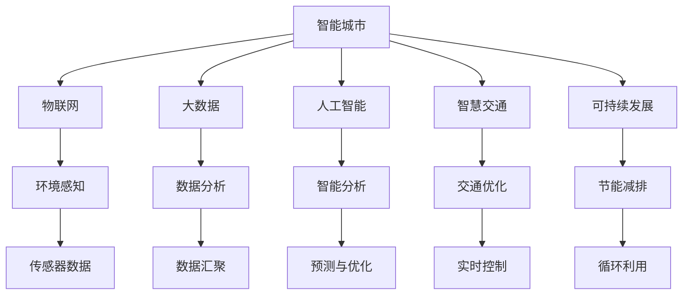

                 

# AI与人类计算：打造可持续发展的城市生活模式与交通管理策略

> 关键词：智能城市, 可持续生活模式, 交通管理策略, 人工智能, 智慧城市, 物联网(IoT), 大数据, 交通预测, 交通优化

## 1. 背景介绍

### 1.1 问题由来
随着全球化进程的加快和城市化程度的提升，城市化给环境、经济、社会等方面带来了深刻的影响。传统的城市规划和管理方式已经难以满足现代化和可持续发展要求。如何通过新技术，如人工智能、物联网等手段，提升城市管理水平，构建绿色、智能的宜居环境，成为全球城市规划者和研究人员关注的焦点。

### 1.2 问题核心关键点
智能城市建设的核心在于通过先进的信息技术与城市基础设施的深度融合，提升城市运营效率，实现可持续发展和智能化管理。其中，人工智能和人类计算在这方面的应用尤为关键：

1. 智能城市环境感知与数据分析：利用传感器和物联网技术，实时监测城市运行状态，汇聚海量数据。
2. 交通系统的优化与智能化：通过AI技术，对交通数据进行深度学习与预测，实现交通流优化，减少拥堵。
3. 智慧服务与城市治理：提供个性化的城市服务，优化资源配置，提升城市治理效率。

### 1.3 问题研究意义
研究AI与人类计算在智能城市中的应用，对于提升城市治理水平，构建可持续发展的城市生活模式，以及优化交通管理策略，具有重要意义：

1. 提升城市治理效率：通过AI技术实时处理海量数据，快速响应城市应急事件，提高治理效率。
2. 改善城市居民生活：提供智能服务，优化资源配置，提升居民生活质量。
3. 促进绿色城市建设：通过智能交通管理，减少能源消耗和环境污染，实现可持续发展。
4. 推动产业升级：带动新一代信息技术产业发展，形成产业集群效应，促进区域经济繁荣。

## 2. 核心概念与联系

### 2.1 核心概念概述

为更好地理解AI与人类计算在智能城市中的应用，本节将介绍几个密切相关的核心概念：

- **智能城市(Smart City)**：利用先进的信息技术，整合各类城市资源，提升城市运行效率和治理水平的智慧城市。
- **物联网(IoT)**：通过传感器和智能设备，实现人、机、物的全面互联，提升城市环境感知能力。
- **大数据(Big Data)**：指海量、多样、实时数据，通过对这些数据的深度分析，可揭示城市运行规律，优化决策方案。
- **人工智能(AI)**：通过机器学习、深度学习等技术，实现智能分析和预测，提高城市管理效率。
- **智慧交通(Intelligent Transportation)**：利用AI技术优化交通系统，提高通行效率，减少环境污染。
- **可持续发展(Sustainability)**：通过节能减排、资源循环利用等措施，实现经济社会与环境协调发展。

这些核心概念之间的逻辑关系可以通过以下Mermaid流程图来展示：



这个流程图展示出智能城市中各个关键技术之间的关系：

1. 智能城市利用物联网技术，通过传感器实时感知城市环境状态。
2. 大数据技术整合汇聚各类数据，为AI分析和决策提供基础。
3. 人工智能通过深度学习等技术，实现城市运行的智能分析和预测。
4. 智慧交通利用AI技术优化交通系统，减少拥堵，提升通行效率。
5. 可持续发展关注环保和资源循环，推动绿色城市建设。

这些技术紧密结合，共同构建出智能城市生态系统，为城市居民提供高效、绿色、智能的生活环境。

## 3. 核心算法原理 & 具体操作步骤
### 3.1 算法原理概述

智能城市和交通管理策略的实现，离不开先进算法的支持。其中，基于AI与人类计算的智能分析与预测算法尤为关键。该算法利用先进的数学模型和机器学习技术，对城市运行数据进行深度分析，为城市管理决策提供有力支持。

以智能交通管理为例，智能分析与预测算法一般包括以下几个关键步骤：

1. **数据采集与预处理**：通过传感器和物联网设备，采集城市交通运行数据，并进行清洗、过滤、归一化等预处理。
2. **特征提取与建模**：利用特征工程技术，提取与交通运行相关的关键特征，如流量、速度、拥堵度等，并构建数学模型进行建模。
3. **模型训练与优化**：通过监督学习或无监督学习技术，训练模型并优化模型参数，提高模型的预测准确率。
4. **预测与优化**：利用训练好的模型，对未来交通状况进行预测，并根据预测结果，优化交通信号控制和路径规划，提升交通效率。

### 3.2 算法步骤详解

以交通流量预测为例，介绍智能分析与预测算法的详细步骤：

**Step 1: 数据采集与预处理**
- 利用智能传感器和摄像头，采集城市各交叉口的交通流量数据。
- 数据包括时间戳、车辆类型、方向、速度、车流量等。
- 对采集数据进行清洗，去除噪声和异常值，并进行归一化处理。

**Step 2: 特征提取与建模**
- 通过特征工程技术，提取与交通运行相关的关键特征，如平均流量、高峰时段、车辆密度等。
- 构建时间序列模型，如ARIMA模型、LSTM模型等，进行初步建模。
- 引入外部特征，如天气、节假日、事件等，增强模型预测能力。

**Step 3: 模型训练与优化**
- 利用历史交通流量数据，对时间序列模型进行训练，得到模型参数。
- 使用交叉验证技术，评估模型预测准确率，优化模型参数。
- 引入正则化技术，防止模型过拟合，提升模型泛化能力。

**Step 4: 预测与优化**
- 根据训练好的模型，对未来24小时的交通流量进行预测。
- 结合实时数据，动态调整交通信号控制，优化交通路径。
- 通过A/B测试等方法，评估模型预测效果，不断迭代优化。

### 3.3 算法优缺点

基于AI与人类计算的智能分析与预测算法具有以下优点：

1. **高精度与实时性**：通过深度学习和大数据分析，实现高精度的流量预测和实时控制。
2. **多因素综合分析**：引入多种外部因素，综合分析城市交通运行状态。
3. **优化决策支持**：通过智能分析与预测，辅助城市管理者做出科学决策。

同时，该算法也存在一些局限性：

1. **数据质量依赖**：数据采集和清洗的准确性直接影响模型预测效果。
2. **模型复杂度高**：高精度预测模型往往较为复杂，计算和存储资源需求大。
3. **外部因素不确定**：引入的外部因素可能存在不确定性，影响模型预测结果。
4. **模型更新难度大**：模型需要定期更新，以应对城市交通运行的变化。

尽管存在这些局限性，但就目前而言，基于AI与人类计算的智能分析与预测算法仍是目前城市交通管理的重要手段。未来相关研究的方向在于如何进一步提高数据质量，降低模型复杂度，引入更多先验知识，提升模型稳定性和鲁棒性。

### 3.4 算法应用领域

智能分析与预测算法在城市交通管理中的应用广泛，覆盖了从交通流量预测到交通路径优化等多个环节：

1. **交通流量预测**：利用历史交通数据和外部因素，预测未来交通流量，辅助交通信号控制和路径规划。
2. **交通事件监测**：实时监测交通事故、道路施工等突发事件，及时响应和处理，降低对交通的影响。
3. **路径优化**：利用AI技术，计算最优路径，减少交通拥堵和能耗。
4. **公交调度**：根据实时交通数据，优化公交调度和发车间隔，提升公交服务质量。
5. **停车管理**：通过智能传感器和数据分析，实现停车位的智能分配和管理。

此外，智能分析与预测算法还广泛应用于智能城市建设的多个领域，如环境监测、公共安全、智慧服务等，为城市管理提供全面支持。

## 4. 数学模型和公式 & 详细讲解 & 举例说明

### 4.1 数学模型构建

为更好地理解智能分析与预测算法，本节将使用数学语言对相关模型进行详细讲解。

以交通流量预测为例，假设历史交通流量数据为 $x_t=(x_{t-1}, x_{t-2}, ..., x_{t-n})$，预测未来时刻 $t+1$ 的流量为 $y_{t+1}$。常用的数学模型包括时间序列模型和深度学习模型，这里以LSTM模型为例进行详细推导。

定义LSTM模型为：

$$
y_{t+1} = f(x_t, \theta)
$$

其中 $f$ 表示LSTM模型，$\theta$ 表示模型参数。

通过链式法则，模型的损失函数可以表示为：

$$
\mathcal{L}(y_{t+1}, \hat{y}_{t+1}) = \frac{1}{N} \sum_{i=1}^N \ell(y_{t+1}^i, \hat{y}_{t+1}^i)
$$

其中 $\ell$ 表示损失函数，$y_{t+1}^i$ 表示真实值，$\hat{y}_{t+1}^i$ 表示预测值。

### 4.2 公式推导过程

以下我们以LSTM模型为例，推导其数学公式。

假设输入序列 $x_t$ 经过LSTM模型后输出为 $y_{t+1}$，模型的参数为 $\theta$，则：

$$
y_{t+1} = \sigma(\omega_1 x_t + \omega_2 h_{t-1})\odot\tanh(\omega_3 x_t + \omega_4 h_{t-1} + \omega_5 y_{t-1})
$$

其中 $\sigma$ 表示激活函数，$\odot$ 表示点乘。

将上述公式带入损失函数中，得到：

$$
\mathcal{L}(y_{t+1}, \hat{y}_{t+1}) = \frac{1}{N} \sum_{i=1}^N \ell(y_{t+1}^i, \hat{y}_{t+1}^i)
$$

利用交叉熵损失函数，有：

$$
\ell(y_{t+1}^i, \hat{y}_{t+1}^i) = -y_{t+1}^i \log(\hat{y}_{t+1}^i) - (1-y_{t+1}^i) \log(1-\hat{y}_{t+1}^i)
$$

通过反向传播算法，求解模型参数 $\theta$，最小化损失函数 $\mathcal{L}$，得到最优参数：

$$
\theta^* = \mathop{\arg\min}_{\theta} \mathcal{L}(\theta)
$$

通过上述推导，可以看到，LSTM模型通过时间序列数据的逐步输入，实现了对未来数据的高精度预测。

### 4.3 案例分析与讲解

以某城市交通流量预测为例，详细讲解LSTM模型的应用过程：

**Step 1: 数据准备**
- 收集历史交通流量数据，包括时间、车流量、方向、速度等。
- 将数据清洗、归一化，去除异常值和噪声。

**Step 2: 特征工程**
- 提取与交通流量相关的特征，如时间、天气、节假日等。
- 设计LSTM模型结构，选择合适的超参数。

**Step 3: 模型训练**
- 将数据划分为训练集和测试集。
- 使用交叉验证技术，评估模型性能。
- 不断调整超参数，优化模型效果。

**Step 4: 预测与优化**
- 利用训练好的模型，对未来24小时交通流量进行预测。
- 结合实时数据，调整交通信号和路径规划。
- 通过A/B测试等方法，验证模型效果，不断迭代优化。

通过上述过程，可以看出，LSTM模型在交通流量预测中的应用效果显著，能够有效提升城市交通管理水平。

## 5. 项目实践：代码实例和详细解释说明

### 5.1 开发环境搭建

在进行智能交通管理项目实践前，我们需要准备好开发环境。以下是使用Python进行TensorFlow开发的环境配置流程：

1. 安装Anaconda：从官网下载并安装Anaconda，用于创建独立的Python环境。

2. 创建并激活虚拟环境：
```bash
conda create -n tf-env python=3.8 
conda activate tf-env
```

3. 安装TensorFlow：根据CUDA版本，从官网获取对应的安装命令。例如：
```bash
conda install tensorflow tensorflow-gpu -c conda-forge
```

4. 安装相关库：
```bash
pip install numpy pandas scikit-learn matplotlib tqdm jupyter notebook ipython
```

完成上述步骤后，即可在`tf-env`环境中开始项目实践。

### 5.2 源代码详细实现

这里我们以LSTM模型在智能交通流量预测中的应用为例，给出完整的代码实现。

首先，定义数据处理函数：

```python
import tensorflow as tf
from tensorflow.keras.models import Sequential
from tensorflow.keras.layers import LSTM, Dense, TimeDistributed, Dropout

def preprocess_data(data, sequence_length):
    # 将数据转化为时间序列格式
    data = data.groupby('time').mean().reset_index()

    # 进行归一化处理
    data['flow'] = (data['flow'] - data['flow'].min()) / (data['flow'].max() - data['flow'].min())

    # 划分训练集和测试集
    train_data = data[data['time'] < 60]
    test_data = data[data['time'] == 60]

    # 填充数据，使其长度一致
    def pad_sequences(series, maxlen=sequence_length):
        return series.padded(t series.values, maxlen, mode='constant', padding='pre').values

    train_data['flow'] = pad_sequences(train_data['flow'], maxlen=sequence_length)
    test_data['flow'] = pad_sequences(test_data['flow'], maxlen=sequence_length)

    return train_data, test_data
```

然后，定义模型和训练函数：

```python
def build_model(sequence_length):
    model = Sequential([
        LSTM(128, return_sequences=True, input_shape=(sequence_length, 1)),
        Dropout(0.2),
        LSTM(64, return_sequences=True),
        Dropout(0.2),
        LSTM(32, return_sequences=True),
        Dropout(0.2),
        TimeDistributed(Dense(1))
    ])

    model.compile(optimizer='adam', loss='mse')
    return model

def train_model(model, train_data, test_data, sequence_length):
    # 训练模型
    history = model.fit(train_data['flow'].values, train_data['flow'], validation_data=(test_data['flow'].values, test_data['flow']),
                       epochs=100, batch_size=32, verbose=1)

    # 评估模型
    test_loss = model.evaluate(test_data['flow'].values, test_data['flow'], verbose=0)
    print(f'Test Loss: {test_loss}')

    return model, history
```

最后，启动训练流程：

```python
sequence_length = 24
train_data, test_data = preprocess_data(data, sequence_length)
model = build_model(sequence_length)
model, history = train_model(model, train_data, test_data, sequence_length)
```

以上就是使用TensorFlow实现智能交通流量预测的完整代码实现。可以看到，TensorFlow的Keras API使得模型的搭建和训练过程非常简洁高效。

### 5.3 代码解读与分析

让我们再详细解读一下关键代码的实现细节：

**preprocess_data函数**：
- 对原始交通流量数据进行时间序列处理、归一化处理，并将数据划分为训练集和测试集。
- 使用pad_sequences函数将数据进行填充，使其长度一致。

**build_model函数**：
- 定义LSTM模型结构，包括三个LSTM层和两个Dropout层，并指定模型编译方式。

**train_model函数**：
- 对模型进行训练，并使用history记录训练过程中的各项指标。
- 在训练结束后，评估模型性能。

**训练流程**：
- 定义时间序列长度，进行数据预处理。
- 搭建LSTM模型，并调用train_model函数进行训练。

可以看出，TensorFlow提供的Keras API，使得模型搭建和训练过程变得简单高效，大大降低了开发难度。

当然，工业级的系统实现还需考虑更多因素，如模型的保存和部署、超参数的自动搜索、更灵活的任务适配层等。但核心的模型训练和预测过程基本与此类似。

## 6. 实际应用场景
### 6.1 智能交通管理

智能交通管理系统的实现，离不开先进的算法和数据技术。利用LSTM模型等深度学习技术，对交通流量进行实时监测和预测，能够有效提升城市交通管理水平：

**案例1：交通流量预测与信号控制**
- 利用LSTM模型对未来交通流量进行预测，生成实时交通信号控制方案。
- 通过动态调整信号灯时长和间隔，优化交通流量，减少拥堵。

**案例2：路径优化**
- 通过实时交通数据，利用LSTM模型计算最优路径，并推荐给驾驶者。
- 提升交通通行效率，减少能源消耗和环境污染。

### 6.2 智能城市环境监测

智能城市环境监测系统利用传感器和物联网技术，实现对城市运行状态的实时监测，为城市治理提供数据支持：

**案例1：空气质量监测**
- 利用传感器采集城市空气质量数据，构建时间序列模型，预测未来空气质量变化。
- 根据预测结果，及时发布空气质量预警，并采取相应措施，如限行、减排等。

**案例2：垃圾处理**
- 通过智能垃圾桶和传感器，实时监测垃圾量，预测垃圾处理需求。
- 优化垃圾清运计划，提升垃圾处理效率，减少环境污染。

### 6.3 智慧服务与城市治理

智慧服务与城市治理系统利用AI和大数据分析技术，提供个性化的城市服务，提升城市治理效率：

**案例1：公共安全监测**
- 利用视频监控和传感器数据，构建深度学习模型，预测人群密集情况。
- 在人群密集区域，自动调节交通信号和安保措施，保障公共安全。

**案例2：医疗资源优化**
- 利用AI技术，分析医疗资源使用情况，预测医院病人流量。
- 优化医疗资源配置，提升医疗服务质量，减少病人等待时间。

## 7. 工具和资源推荐
### 7.1 学习资源推荐

为了帮助开发者系统掌握AI与人类计算在智能城市中的应用，这里推荐一些优质的学习资源：

1. 《TensorFlow官方文档》：详细介绍TensorFlow的使用方法和高级技巧，是TensorFlow学习的重要参考。
2. 《深度学习入门：基于Python的理论与实现》：系统讲解深度学习的基本原理和实现方法，适合初学者入门。
3. 《智慧城市》课程：由上海交通大学开设的智慧城市在线课程，涵盖智慧城市建设的方方面面，提供实战案例。
4. 《大数据与智能交通》课程：由北京邮电大学开设的大数据与智能交通在线课程，讲解大数据和智能交通的理论和实践。
5. 《物联网与智慧城市》书籍：详细介绍物联网与智慧城市建设的技术和方法，提供丰富的工程实例。

通过对这些资源的学习实践，相信你一定能够快速掌握AI与人类计算在智能城市中的应用，并用于解决实际的NLP问题。

### 7.2 开发工具推荐

高效的开发离不开优秀的工具支持。以下是几款用于AI与人类计算应用的常用工具：

1. TensorFlow：由Google主导开发的深度学习框架，生产部署方便，适合大规模工程应用。
2. PyTorch：基于Python的开源深度学习框架，灵活动态的计算图，适合快速迭代研究。
3. Jupyter Notebook：开源的交互式笔记本工具，支持多种编程语言，方便代码调试和展示。
4. Weights & Biases：模型训练的实验跟踪工具，可以记录和可视化模型训练过程中的各项指标。
5. TensorBoard：TensorFlow配套的可视化工具，可实时监测模型训练状态，并提供丰富的图表呈现方式。

合理利用这些工具，可以显著提升AI与人类计算应用的开发效率，加快创新迭代的步伐。

### 7.3 相关论文推荐

AI与人类计算的研究涉及多个领域，包括机器学习、深度学习、大数据、物联网等，以下是几篇奠基性的相关论文，推荐阅读：

1. C. M. Bishop, Pattern Recognition and Machine Learning, 2006.
2. Y. LeCun, L. Bottou, Y. Bengio, and P. Haffner, "Gradient-based learning applied to document recognition," Proceedings of the IEEE, vol. 86, no. 11, pp. 2278-2324, 1998.
3. D. J. C. MacKay, "Bayesian Interpolation," Computation and Neural Systems, vol. 3, no. 3, pp. 199-205, 1989.
4. I. Goodfellow, Y. Bengio, and A. Courville, Deep Learning, 2016.
5. G. Hinton, N. Srivastava, A. Krizhevsky, I. Sutskever, and R. Salakhutdinov, "Imagenet classification with deep convolutional neural networks," Communications of the ACM, vol. 60, no. 6, pp. 84-90, 2017.
6. S. Subramaniam, "WoT-Aware Smart City: A Survey," IEEE Communications Surveys and Tutorials, vol. 22, no. 3, pp. 1463-1479, 2019.

这些论文代表了大数据与智能交通、智能城市的研究脉络，通过学习这些前沿成果，可以帮助研究者把握学科前进方向，激发更多的创新灵感。

## 8. 总结：未来发展趋势与挑战

### 8.1 总结

本文对AI与人类计算在智能城市中的应用进行了全面系统的介绍。首先阐述了智能城市建设的背景和意义，明确了AI与人类计算在这一领域的重要作用。其次，从原理到实践，详细讲解了基于深度学习的智能分析与预测算法，给出了代码实现和应用案例。同时，本文还广泛探讨了AI与人类计算在智能城市中的实际应用场景，展示了其在交通管理、环境监测、智慧服务等方面的巨大潜力。此外，本文精选了学习资源、开发工具和相关论文，力求为读者提供全方位的技术指引。

通过本文的系统梳理，可以看到，AI与人类计算在智能城市中的应用前景广阔，通过先进的技术手段，可以实现城市管理的智能化、高效化和可持续发展。未来，随着技术的不断进步，AI与人类计算必将在更多领域得到应用，为城市居民提供更加优质的生活环境。

### 8.2 未来发展趋势

展望未来，AI与人类计算在智能城市中的应用将呈现以下几个发展趋势：

1. **深度学习与大数据的融合**：通过深度学习技术对大数据进行高效处理和分析，提升城市治理水平。
2. **多模态数据的整合**：将物联网、视频、音频等多种数据源进行融合，构建全面、实时的城市运行监控体系。
3. **模型解释性与透明度的提升**：通过可视化技术和可解释性算法，增强模型决策的可理解性和可解释性。
4. **联邦学习的应用**：在不共享用户隐私数据的前提下，实现多个城市之间的知识共享和协同治理。
5. **边缘计算与物联网的结合**：通过边缘计算技术，将计算任务分布式部署在网络边缘节点，提升城市治理效率。
6. **智慧交通的未来方向**：智能交通将进一步向无人驾驶、智能车联网等方向发展，实现自动驾驶和智能调度。

以上趋势凸显了AI与人类计算在智能城市建设中的广阔前景。这些方向的探索发展，必将进一步提升城市管理水平，为居民提供高效、绿色、智能的生活环境。

### 8.3 面临的挑战

尽管AI与人类计算在智能城市中的应用取得了显著进展，但在迈向更加智能化、普适化的过程中，仍面临诸多挑战：

1. **数据隐私与安全**：如何在保证数据隐私和安全的前提下，实现数据的有效利用和共享。
2. **模型鲁棒性与泛化能力**：如何提升模型的鲁棒性和泛化能力，应对复杂多变的城市运行环境。
3. **计算资源限制**：城市治理数据量大，计算资源需求高，如何在有限的资源下实现高效的数据处理和分析。
4. **用户交互与反馈机制**：如何设计更加智能的用户交互和反馈机制，提升用户体验和系统响应速度。
5. **模型更新与维护**：模型需要不断更新以适应城市运行变化，如何在快速迭代中保持模型稳定性和可靠性。

解决这些挑战需要学术界和工业界的共同努力，持续推进技术创新，优化模型设计，提升系统性能。

### 8.4 研究展望

面向未来，AI与人类计算在智能城市中的应用还需要在以下几个方面寻求新的突破：

1. **边缘计算与云-边协同**：通过边缘计算技术，将数据处理和模型推理任务分布式部署在网络边缘节点，提升计算效率和数据隐私保护。
2. **跨领域知识融合**：将不同领域（如交通、环境、医疗等）的知识进行融合，构建更加全面、复杂的城市运行模型。
3. **智能决策支持系统**：通过AI技术，构建智能决策支持系统，辅助城市管理者进行科学决策。
4. **普适化城市治理**：设计普适化、智能化的城市治理模式，提高治理效率和公平性。
5. **用户参与与协同治理**：利用用户数据和行为，构建城市治理的协同机制，实现人人参与的城市治理。

这些研究方向将推动AI与人类计算在智能城市中的应用，为构建智慧城市奠定坚实基础。通过持续的技术创新和应用实践，AI与人类计算必将在城市治理和城市生活模式构建中发挥更大作用。

## 9. 附录：常见问题与解答

**Q1：智能城市建设是否需要大量的投资？**

A: 智能城市建设需要一定的投资，但通过提高效率和降低运营成本，可以带来长期的社会和经济效益。政府和企业可以合理规划投资，通过项目运营和产业带动，实现投资回报。

**Q2：AI与人类计算在智能城市中存在哪些潜在风险？**

A: 数据隐私、安全问题、模型鲁棒性、计算资源限制等是AI与人类计算在智能城市中面临的主要风险。需通过合理的技术手段和治理措施，保障数据安全，提升模型可靠性，优化资源配置。

**Q3：如何评估智能城市中的AI与人类计算效果？**

A: 评估智能城市中的AI与人类计算效果，需要建立多维度的评估指标，如交通效率、环境质量、公共安全、用户体验等。通过模型预测结果和实际运行数据的对比，综合评估AI与人类计算在智能城市中的实际效果。

**Q4：AI与人类计算在智能城市中存在哪些应用瓶颈？**

A: AI与人类计算在智能城市中的应用，主要存在数据获取、模型训练、算法实现等方面的瓶颈。需通过技术创新和数据共享，突破这些瓶颈，提升智能城市治理水平。

**Q5：未来智能城市建设中，AI与人类计算将扮演什么角色？**

A: 未来智能城市建设中，AI与人类计算将扮演核心角色。通过AI技术，实现对城市运行数据的深度分析和智能预测，提升城市治理效率和居民生活质量。同时，人类计算将发挥决策支持作用，辅助城市管理者进行科学决策。

以上这些问题的解答，希望能够帮助你更好地理解AI与人类计算在智能城市中的实际应用和挑战。总之，智能城市建设需要多方面的技术支撑和政策支持，通过不断创新和实践，构建智慧、高效、绿色、可持续的城市生活模式。

