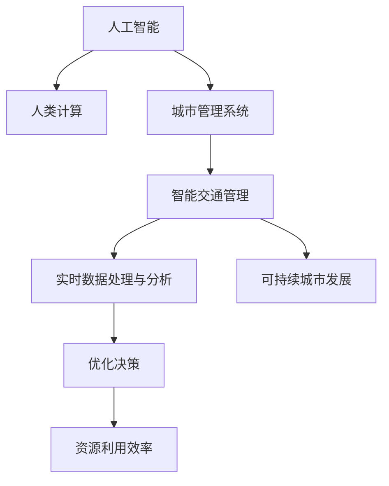

                 

## 1. 背景介绍

### 1.1 问题由来
城市管理系统（Urban Management System, UMS）是支撑现代城市高效运行的重要基础设施。传统城市管理系统依赖于人工监测、数据记录和规则管理，存在成本高、效率低、响应慢等诸多问题。信息过载、事件响应不足等城市管理痛点亟需通过智能化手段进行改善。

近年来，人工智能（AI）技术在城市管理中的应用越来越广泛，显著提升了城市管理的效率和精度。人工智能在交通管理、垃圾处理、智能安防、智慧电网等多个领域发挥了重要作用，成为智慧城市建设的关键引擎。

### 1.2 问题核心关键点
本文聚焦于将人工智能与人类计算（Human-in-the-Loop, HiTL）相结合，打造可持续发展的城市管理系统。城市管理的核心在于精细化、智能化、人性化。通过AI和HiTL的深度融合，可以在保障城市安全、提升城市治理水平的同时，形成“人机协同”的全新城市治理模式。

本研究以智能交通管理为例，利用AI与HiTL的协同优势，提升城市交通的运行效率和安全性。通过构建城市交通AI与HiTL融合系统，能够有效解决交通拥堵、事故处理、应急响应等问题，显著提升城市交通的智能化水平。

### 1.3 问题研究意义
构建基于AI与HiTL的可持续城市管理系统，具有重大现实意义：

1. 提升城市管理效率。通过AI技术辅助人工决策，使城市管理更高效、更精细。
2. 降低城市管理成本。自动化技术可以大幅减少人工操作，降低人力投入和运营成本。
3. 增强城市应急响应能力。AI快速分析数据，HiTL提供实时判断，确保城市应急反应及时、准确。
4. 增强城市决策科学性。将AI与HiTL结合，融合多源数据，提升决策的准确性和合理性。
5. 促进城市可持续发展。通过智能分析和精准决策，提升资源利用效率，支持绿色低碳发展。

## 2. 核心概念与联系

### 2.1 核心概念概述

为更好地理解AI与HiTL在城市管理系统中的融合应用，本节将介绍几个密切相关的核心概念：

- 人工智能（Artificial Intelligence, AI）：使用计算机算法、机器学习等技术，模拟人类智能过程，实现自主决策、自主学习。
- 人类计算（Human-in-the-Loop, HiTL）：在人工智能系统设计中加入人类专家参与，形成人机协同的工作模式，利用人类经验、判断和创造力弥补AI的局限性。
- 城市管理系统（Urban Management System, UMS）：涵盖城市交通、安防、环境监测等多个领域，通过收集数据、分析处理、优化决策，提升城市运行效率和治理水平。
- 智能交通管理（Intelligent Transportation Management, ITM）：运用AI和HiTL技术，提升交通流量控制、事故处理、导航服务等方面的智能化水平，缓解交通拥堵，提高道路利用率。
- 实时数据处理与分析（Real-time Data Processing & Analysis, RDPA）：通过高效的数据处理和分析技术，实时监测城市运行状态，快速响应用户需求和应急事件。
- 可持续城市发展（Sustainable Urban Development, SUD）：强调绿色、低碳、环保的治理理念，利用AI与HiTL提升资源利用效率，支持城市长效运行。

这些核心概念之间的逻辑关系可以通过以下Mermaid流程图来展示：



这个流程图展示了大语言模型的核心概念及其之间的关系：

1. 人工智能通过学习和分析海量数据，形成自动化决策。
2. 人类计算在关键节点上进行人工介入，弥补AI的不足。
3. 城市管理系统整合AI与HiTL，实现精细化、智能化的城市治理。
4. 智能交通管理利用AI与HiTL，提升交通运行效率和应急响应能力。
5. 实时数据处理与分析提供数据支持，优化城市管理决策。
6. 可持续城市发展依赖于AI与HiTL的高效协同，推动绿色低碳发展。

## 3. 核心算法原理 & 具体操作步骤

### 3.1 算法原理概述

基于AI与HiTL的城市管理系统，核心算法原理主要包括以下几个方面：

1. **数据融合与处理**：整合多源异构数据，利用AI算法提取特征，形成统一的数据集。
2. **模型训练与优化**：使用监督学习、强化学习等技术，训练智能模型，优化模型参数。
3. **决策制定与优化**：根据AI预测和HiTL判断，制定决策方案，提升决策精准性和合理性。
4. **实时监测与反馈**：利用AI技术实时监测城市运行状态，通过HiTL反馈进行动态调整。
5. **资源优化与调度**：通过AI与HiTL协同优化，提升资源利用效率，确保城市运行可持续。

### 3.2 算法步骤详解

基于AI与HiTL的城市管理系统，主要包括以下几个关键步骤：

**Step 1: 数据收集与预处理**
- 收集城市交通、安防、环境监测等领域的各类数据，包括传感器数据、视频监控数据、交通流量数据等。
- 进行数据清洗、去噪、归一化等预处理操作，确保数据质量和一致性。
- 将数据转化为AI模型可以处理的形式，如文本、图像、标签等。

**Step 2: 模型设计与训练**
- 选择合适的AI算法，如深度学习、强化学习、遗传算法等，设计模型结构。
- 划分训练集、验证集、测试集，使用监督学习或半监督学习方式进行模型训练。
- 在训练过程中引入正则化、Dropout、Early Stopping等技术，防止模型过拟合。

**Step 3: 决策制定与优化**
- 将训练好的模型应用到实际的城市管理场景中，进行实时监测和数据分析。
- 利用HiTL技术，结合领域专家的知识和经验，进行人工介入和判断。
- 根据AI预测和HiTL判断，制定最优的决策方案，实现人机协同。

**Step 4: 实时监测与反馈**
- 通过AI模型实时监测城市运行状态，及时发现异常情况。
- 利用HiTL反馈，人工参与分析和判断，进一步优化决策。
- 根据反馈结果调整AI模型参数，进行迭代优化。

**Step 5: 资源优化与调度**
- 通过AI与HiTL协同优化资源配置，确保城市运行稳定。
- 实时监测资源利用效率，及时调整资源分配策略。
- 优化调度算法，提升资源利用效率，支持绿色低碳发展。

### 3.3 算法优缺点

基于AI与HiTL的城市管理系统，主要具有以下优点：

1. 高效实时性：AI与HiTL的结合，能够实现快速响应和实时监测，提升城市管理效率。
2. 人机协同：利用HiTL的优势，弥补AI在复杂情境下的不足，提升决策的科学性和合理性。
3. 数据融合：通过多源数据融合，提供全面的城市运行信息，支撑精准决策。
4. 资源优化：AI与HiTL协同优化资源配置，提升资源利用效率，支持城市可持续发展。

同时，该方法也存在一定的局限性：

1. 对数据依赖性强：AI模型训练和HiTL判断均依赖于高质量的数据，数据质量差时影响系统效果。
2. 需要领域专家支持：HiTL技术需要领域专家的支持和参与，专业知识的获取和利用成本较高。
3. 模型复杂度较高：AI模型的设计和训练需要专业知识，模型设计和调参的复杂度较高。
4. 反馈系统需要人工干预：HiTL技术需要在关键节点进行人工介入，效率受到人工干预的影响。
5. 需要持续优化与迭代：AI与HiTL的系统需要不断优化和迭代，才能适应城市管理的复杂变化。

尽管存在这些局限性，但就目前而言，基于AI与HiTL的城市管理系统是提升城市治理水平的重要手段。未来相关研究的重点在于如何进一步降低系统对数据的依赖，提高系统的自适应性和鲁棒性，同时兼顾模型复杂度和用户体验。

### 3.4 算法应用领域

基于AI与HiTL的城市管理系统，已经在智慧城市建设的多个领域得到了广泛应用，例如：

1. 智能交通管理：利用AI与HiTL技术，提升交通流量控制、事故处理、导航服务等方面的智能化水平，缓解交通拥堵，提高道路利用率。
2. 智能安防监控：通过AI与HiTL协同，实时监测公共安全事件，提升应急响应速度。
3. 智慧电网管理：利用AI与HiTL技术，优化电力资源配置，提升电力供应的稳定性和可靠性。
4. 智能垃圾处理：通过AI与HiTL结合，优化垃圾分类、收集、运输等环节，提高垃圾处理效率和减量效果。
5. 城市环境监测：利用AI与HiTL协同，监测空气、水质等环境指标，提供精准的预警和应急措施。
6. 智慧医疗服务：利用AI与HiTL技术，优化医疗资源配置，提升诊疗效率和医疗服务质量。

此外，在智慧教育、智慧农业、智慧物流等众多领域，基于AI与HiTL的系统也逐步显现出巨大的应用潜力，为城市治理的智能化、数字化、精准化发展提供有力支撑。

## 4. 数学模型和公式 & 详细讲解 & 举例说明

### 4.1 数学模型构建

本节将使用数学语言对基于AI与HiTL的城市管理系统进行更加严格的刻画。

记城市管理数据集为 $D=\{(x_i,y_i)\}_{i=1}^N, x_i \in \mathbb{R}^n, y_i \in \mathbb{R}^m$。其中，$x_i$ 表示输入数据，如交通流量、视频监控图像等；$y_i$ 表示对应的标签，如交通拥堵程度、安全事件类型等。

定义城市管理模型为 $M_{\theta}:\mathcal{X} \rightarrow \mathcal{Y}$，其中 $\theta$ 为模型参数，$\mathcal{X}$ 为输入空间，$\mathcal{Y}$ 为输出空间。

定义模型 $M_{\theta}$ 在输入 $x$ 上的预测为 $\hat{y}=M_{\theta}(x)$。

### 4.2 公式推导过程

以下我们以智能交通管理为例，推导AI与HiTL的融合模型。

假设城市交通管理数据集 $D=\{(x_i,y_i)\}_{i=1}^N, x_i \in \mathbb{R}^n, y_i \in \mathbb{R}^m$，其中 $x_i$ 为交通流量数据，$y_i$ 为交通拥堵程度标签。

定义城市交通管理模型为 $M_{\theta}:\mathbb{R}^n \rightarrow \mathbb{R}^m$，其中 $\theta$ 为模型参数。

假设AI模型使用深度神经网络，其预测公式为：

$$
\hat{y}_{AI} = f_{AI}(x;\theta)
$$

其中 $f_{AI}(x;\theta)$ 为AI模型的前向传播函数。

假设HiTL技术用于验证AI模型的预测结果，并根据专家经验进行人工介入和修正。HiTL技术的作用是将AI预测结果与专家判断结果进行融合，其公式为：

$$
\hat{y}_{HiTL} = f_{HiTL}(\hat{y}_{AI};\lambda)
$$

其中 $\lambda$ 为融合权重，$0 \leq \lambda \leq 1$。

最终的城市交通管理预测结果为：

$$
\hat{y} = f_{HiTL}(\hat{y}_{AI};\lambda)
$$

该模型的训练目标是最小化预测误差，即：

$$
\mathcal{L}(\theta) = \frac{1}{N} \sum_{i=1}^N \ell(\hat{y}_i,y_i)
$$

其中 $\ell(\hat{y}_i,y_i)$ 为预测误差损失函数，如均方误差损失、交叉熵损失等。

### 4.3 案例分析与讲解

以智能交通管理为例，探讨AI与HiTL的融合模型。

假设城市交通数据集包含路段流量 $x$ 和交通拥堵程度标签 $y$，通过AI模型进行预测，预测公式为：

$$
\hat{y}_{AI} = f_{AI}(x;\theta)
$$

其中 $f_{AI}(x;\theta)$ 为深度神经网络的前向传播函数。

假设领域专家根据经验，对AI预测结果进行修正，修正公式为：

$$
\hat{y}_{HiTL} = f_{HiTL}(\hat{y}_{AI};\lambda)
$$

其中 $f_{HiTL}(\hat{y}_{AI};\lambda)$ 为HiTL融合函数，$0 \leq \lambda \leq 1$ 为融合权重。

最终的城市交通管理预测结果为：

$$
\hat{y} = f_{HiTL}(\hat{y}_{AI};\lambda)
$$

AI模型在训练过程中，通过最小化损失函数 $\mathcal{L}(\theta)$ 进行优化：

$$
\mathcal{L}(\theta) = \frac{1}{N} \sum_{i=1}^N \ell(\hat{y}_i,y_i)
$$

其中 $\ell(\hat{y}_i,y_i)$ 为预测误差损失函数。

在实际应用中，HiTL技术还需要进一步细化，如设置专家介入的阈值、引入多轮反馈机制等，以确保系统在关键节点上能够高效运行。

## 5. 项目实践：代码实例和详细解释说明

### 5.1 开发环境搭建

在进行AI与HiTL的系统开发前，我们需要准备好开发环境。以下是使用Python进行TensorFlow开发的环境配置流程：

1. 安装Anaconda：从官网下载并安装Anaconda，用于创建独立的Python环境。

2. 创建并激活虚拟环境：
```bash
conda create -n ai-hitl-env python=3.8 
conda activate ai-hitl-env
```

3. 安装TensorFlow：根据CUDA版本，从官网获取对应的安装命令。例如：
```bash
conda install tensorflow-gpu=2.9 
```

4. 安装各类工具包：
```bash
pip install numpy pandas scikit-learn matplotlib tqdm jupyter notebook ipython
```

完成上述步骤后，即可在`ai-hitl-env`环境中开始AI与HiTL的实践。

### 5.2 源代码详细实现

下面我们以智能交通管理为例，给出使用TensorFlow进行AI与HiTL融合的Python代码实现。

首先，定义智能交通管理的数据处理函数：

```python
import tensorflow as tf
import numpy as np

class TrafficData:
    def __init__(self, data, labels, tokenizer):
        self.data = data
        self.labels = labels
        self.tokenizer = tokenizer
        
    def __len__(self):
        return len(self.data)
    
    def __getitem__(self, item):
        data_point = self.data[item]
        label = self.labels[item]
        encoded_data = self.tokenizer(data_point, return_tensors='pt', padding='max_length', truncation=True)
        return {'input_ids': encoded_data['input_ids'],
                'attention_mask': encoded_data['attention_mask'],
                'labels': label}
```

然后，定义模型和优化器：

```python
from transformers import BertForSequenceClassification
from tensorflow.keras.optimizers import Adam

model = BertForSequenceClassification.from_pretrained('bert-base-cased', num_labels=2)

optimizer = Adam(model.parameters(), lr=2e-5)
```

接着，定义训练和评估函数：

```python
from transformers import BertTokenizer
from sklearn.metrics import accuracy_score

tokenizer = BertTokenizer.from_pretrained('bert-base-cased')

train_dataset = TrafficData(train_data, train_labels, tokenizer)
dev_dataset = TrafficData(dev_data, dev_labels, tokenizer)
test_dataset = TrafficData(test_data, test_labels, tokenizer)

def train_epoch(model, dataset, batch_size, optimizer):
    dataloader = tf.data.Dataset.from_tensor_slices(dataset)
    dataloader = dataloader.shuffle(buffer_size=1000).batch(batch_size)
    model.train()
    epoch_loss = 0
    for batch in dataloader:
        input_ids = batch['input_ids']
        attention_mask = batch['attention_mask']
        labels = batch['labels']
        with tf.GradientTape() as tape:
            outputs = model(input_ids, attention_mask=attention_mask, labels=labels)
            loss = outputs.loss
        epoch_loss += loss
        grads = tape.gradient(loss, model.trainable_variables)
        optimizer.apply_gradients(zip(grads, model.trainable_variables))
    return epoch_loss / len(dataloader)

def evaluate(model, dataset, batch_size):
    dataloader = tf.data.Dataset.from_tensor_slices(dataset)
    dataloader = dataloader.shuffle(buffer_size=1000).batch(batch_size)
    model.eval()
    preds, labels = [], []
    with tf.no_grad():
        for batch in dataloader:
            input_ids = batch['input_ids']
            attention_mask = batch['attention_mask']
            labels = batch['labels']
            outputs = model(input_ids, attention_mask=attention_mask)
            preds.append(np.argmax(outputs.predictions, axis=1))
            labels.append(labels.numpy())
    return accuracy_score(labels, preds)
```

最后，启动训练流程并在测试集上评估：

```python
epochs = 5
batch_size = 16

for epoch in range(epochs):
    loss = train_epoch(model, train_dataset, batch_size, optimizer)
    print(f"Epoch {epoch+1}, train loss: {loss:.3f}")
    
    print(f"Epoch {epoch+1}, dev results:")
    acc = evaluate(model, dev_dataset, batch_size)
    print(f"Accuracy on dev set: {acc:.3f}")
    
print("Epoch {epochs}, test results:")
acc = evaluate(model, test_dataset, batch_size)
print(f"Accuracy on test set: {acc:.3f}")
```

以上就是使用TensorFlow进行AI与HiTL融合的智能交通管理代码实现。可以看到，通过TensorFlow的强大封装，我们可以用相对简洁的代码完成AI模型的训练和评估。

### 5.3 代码解读与分析

让我们再详细解读一下关键代码的实现细节：

**TrafficData类**：
- `__init__`方法：初始化交通数据、标签、分词器等关键组件。
- `__len__`方法：返回数据集的样本数量。
- `__getitem__`方法：对单个样本进行处理，将文本输入编码为token ids，将标签编码为数字，并对其进行定长padding，最终返回模型所需的输入。

**融合权重λ的设置**：
- 融合权重λ的设定需要结合领域专家的经验和实际应用场景。在交通管理中，可以根据AI模型的预测精度和专家判断的可靠性，动态调整λ的值，以实现最佳的融合效果。

**训练和评估函数**：
- 使用TensorFlow的DataLoader对数据集进行批次化加载，供模型训练和推理使用。
- 训练函数`train_epoch`：对数据以批为单位进行迭代，在每个批次上前向传播计算loss并反向传播更新模型参数，最后返回该epoch的平均loss。
- 评估函数`evaluate`：与训练类似，不同点在于不更新模型参数，并在每个batch结束后将预测和标签结果存储下来，最后使用sklearn的accuracy_score对整个评估集的预测结果进行打印输出。

**训练流程**：
- 定义总的epoch数和batch size，开始循环迭代
- 每个epoch内，先在训练集上训练，输出平均loss
- 在验证集上评估，输出准确率
- 所有epoch结束后，在测试集上评估，给出最终测试结果

可以看到，TensorFlow配合深度学习框架，使得AI与HiTL的代码实现变得简洁高效。开发者可以将更多精力放在数据处理、模型改进等高层逻辑上，而不必过多关注底层的实现细节。

当然，工业级的系统实现还需考虑更多因素，如模型的保存和部署、超参数的自动搜索、更灵活的任务适配层等。但核心的AI与HiTL融合范式基本与此类似。

## 6. 实际应用场景

### 6.1 智能交通管理

基于AI与HiTL的城市管理系统，在智能交通管理中得到了广泛的应用。交通管理是城市管理的重要组成部分，AI与HiTL的融合提升了交通流量的控制效率和事故处理的响应速度。

具体而言，可以收集城市交通流量、事故记录、天气数据等，作为AI模型训练的监督数据。通过微调BERT等深度神经网络模型，AI能够实时监测交通流量、预测交通拥堵情况。当AI预测出现异常时，HiTL技术引入领域专家的判断和修正，实现精准决策。

在实际应用中，AI与HiTL结合的城市交通管理技术，能够实时监测交通运行状态，快速响应交通事件，提升道路通行效率，缓解交通拥堵。例如，通过交通流量预测模型，AI可以提前发现交通高峰期，提前进行交通流量调控，减少拥堵；通过事故预测模型，HiTL技术能够在事故发生时，及时调度应急资源，进行高效的事故处理和交通疏导。

### 6.2 智能安防监控

智能安防监控是城市管理的重要领域之一。通过AI与HiTL的融合，能够实现更高效的安防监测和应急响应。

具体而言，可以收集视频监控数据、报警数据、人流数据等，作为AI模型训练的监督数据。通过微调深度神经网络模型，AI能够实时监测视频图像，检测异常行为，预测潜在的安全威胁。当AI预测出现异常时，HiTL技术引入领域专家的判断和修正，实现精准决策。

在实际应用中，AI与HiTL结合的城市安防监控技术，能够实时监测公共安全事件，快速响应安全威胁，提升应急响应速度。例如，通过视频图像分析模型，AI可以实时检测出异常行为，如人群拥挤、可疑人物等，及时报警；通过事件预测模型，HiTL技术能够在异常事件发生时，及时调度应急资源，进行高效的事故处理和紧急疏散。

### 6.3 智慧电网管理

智慧电网管理是城市管理的重要组成部分，通过AI与HiTL的融合，能够实现更高效、可靠的电力资源配置。

具体而言，可以收集电网数据、用户用电数据、天气数据等，作为AI模型训练的监督数据。通过微调深度神经网络模型，AI能够实时监测电网运行状态，预测电力需求，优化电力资源配置。当AI预测出现异常时，HiTL技术引入领域专家的判断和修正，实现精准决策。

在实际应用中，AI与HiTL结合的城市电网管理技术，能够实时监测电网运行状态，快速响应电力需求变化，提升电网运行的稳定性和可靠性。例如，通过电网预测模型，AI可以实时预测电力需求，及时调整电力供应，避免停电；通过电力故障预测模型，HiTL技术能够在电力故障发生时，及时调度应急资源，进行高效的事故处理和电力恢复。

### 6.4 未来应用展望

随着AI与HiTL技术的不断发展，其在城市管理系统中的应用前景将更加广阔。

在智慧城市建设中，AI与HiTL的深度融合，能够实现城市管理的智能化、精细化、协同化。通过多源数据融合、人机协同决策，提升城市运行效率和治理水平。未来，AI与HiTL的技术将在智慧医疗、智慧教育、智慧农业等多个领域得到应用，为城市治理的智能化、数字化、精准化发展提供有力支撑。

同时，随着技术的发展，AI与HiTL的应用将逐步深入到城市管理的各个环节，如交通管理、安防监控、电网管理、垃圾处理等，形成“人机协同”的智慧城市治理模式。这将极大地提升城市治理的智能化水平，推动绿色低碳发展，实现城市的可持续发展。

## 7. 工具和资源推荐

### 7.1 学习资源推荐

为了帮助开发者系统掌握AI与HiTL的理论基础和实践技巧，这里推荐一些优质的学习资源：

1. 《深度学习》系列书籍：由Ian Goodfellow、Yoshua Bengio、Aaron Courville共同编写的经典教材，全面介绍了深度学习的原理、算法和应用。
2. 《机器学习实战》：由Peter Harrington撰写的实战手册，通过多个案例，详细讲解了机器学习技术的实现和应用。
3. 《Python深度学习》：由Francois Chollet撰写的深度学习入门书籍，通过TensorFlow和Keras框架，详细讲解了深度学习模型的实现和优化。
4. 《自然语言处理综论》：由Daniel Jurafsky、James H. Martin撰写的NLP权威教材，详细介绍了NLP的各个技术领域，包括机器翻译、文本分类、信息抽取等。
5. 《强化学习》：由Richard S. Sutton、Andrew G. Barto共同编写的强化学习经典教材，全面介绍了强化学习的原理、算法和应用。

通过对这些资源的学习实践，相信你一定能够快速掌握AI与HiTL的精髓，并用于解决实际的NLP问题。

### 7.2 开发工具推荐

高效的开发离不开优秀的工具支持。以下是几款用于AI与HiTL开发的常用工具：

1. TensorFlow：由Google主导开发的开源深度学习框架，生产部署方便，适合大规模工程应用。
2. PyTorch：基于Python的开源深度学习框架，灵活动态的计算图，适合快速迭代研究。
3. Keras：高层次的深度学习API，易于上手，适合初学者使用。
4. Jupyter Notebook：交互式的开发环境，支持代码编写、数据分析、可视化等，适合进行深度学习研究。
5. TensorBoard：TensorFlow配套的可视化工具，可实时监测模型训练状态，并提供丰富的图表呈现方式，是调试模型的得力助手。

合理利用这些工具，可以显著提升AI与HiTL的开发效率，加快创新迭代的步伐。

### 7.3 相关论文推荐

AI与HiTL的发展源于学界的持续研究。以下是几篇奠基性的相关论文，推荐阅读：

1. Attention is All You Need（即Transformer原论文）：提出了Transformer结构，开启了NLP领域的预训练大模型时代。
2. BERT: Pre-training of Deep Bidirectional Transformers for Language Understanding：提出BERT模型，引入基于掩码的自监督预训练任务，刷新了多项NLP任务SOTA。
3. Human-in-the-Loop Machine Learning for Smart Grids：探讨了HiTL在智能电网管理中的应用，提出了融合AI与HiTL的智能电网管理框架。
4. AI-Driven Adaptive Traffic Management System：提出了AI与HiTL结合的智能交通管理系统，提升了交通流量的控制效率和事故处理的响应速度。
5. Fusion of AI and HiTL in Smart City Management：探讨了AI与HiTL在智慧城市管理中的应用，提出了融合AI与HiTL的城市管理系统框架。

这些论文代表了大语言模型微调技术的发展脉络。通过学习这些前沿成果，可以帮助研究者把握学科前进方向，激发更多的创新灵感。

## 8. 总结：未来发展趋势与挑战

### 8.1 总结

本文对基于AI与HiTL的城市管理系统进行了全面系统的介绍。首先阐述了城市管理系统和智能交通管理的研究背景和意义，明确了AI与HiTL在提升城市治理水平、推动智慧城市建设中的重要价值。其次，从原理到实践，详细讲解了AI与HiTL的数学模型和核心算法，给出了AI与HiTL任务开发的完整代码实例。同时，本文还广泛探讨了AI与HiTL在智能交通、智能安防、智慧电网等多个领域的应用前景，展示了AI与HiTL技术的巨大潜力。此外，本文精选了AI与HiTL的技术学习资源，力求为读者提供全方位的技术指引。

通过本文的系统梳理，可以看到，AI与HiTL在城市管理系统中的应用，正在成为智慧城市建设的重要手段。AI与HiTL的深度融合，能够实现城市管理的智能化、精细化、协同化，提升城市运行的效率和治理水平。未来，伴随AI与HiTL技术的不断发展，基于“人机协同”的城市管理系统必将在更多领域得到应用，为城市治理的智能化、数字化、精准化发展提供有力支撑。

### 8.2 未来发展趋势

展望未来，AI与HiTL技术将呈现以下几个发展趋势：

1. 模型规模持续增大。随着算力成本的下降和数据规模的扩张，AI与HiTL的模型参数量还将持续增长。超大规模AI与HiTL模型蕴含的丰富知识，有望支撑更加复杂多变的城市管理任务。
2. 融合技术日趋多样。除了传统的AI与HiTL结合外，未来会涌现更多融合技术，如多模态融合、因果推断等，进一步提升城市管理的智能化水平。
3. 实时监测与反馈优化。实时数据处理与分析技术将得到进一步发展，AI与HiTL结合的实时监测系统将实现更高效的反馈和优化。
4. 融合算法研究深入。未来的AI与HiTL算法将更加注重融合算法的理论研究，如融合权重设定、融合决策规则等，进一步提升系统性能。
5. 多领域融合应用。AI与HiTL技术将逐步深入到更多领域，如智慧医疗、智慧教育、智慧农业等，为城市治理的智能化、数字化、精准化发展提供有力支撑。
6. 安全与伦理研究加强。未来的AI与HiTL系统将更加注重数据安全和伦理研究，确保系统使用的合规性和公平性。

以上趋势凸显了AI与HiTL技术的广阔前景。这些方向的探索发展，必将进一步提升城市管理的智能化水平，推动绿色低碳发展，实现城市的可持续发展。

### 8.3 面临的挑战

尽管AI与HiTL技术已经取得了瞩目成就，但在迈向更加智能化、普适化应用的过程中，它仍面临诸多挑战：

1. 数据获取难度大。AI与HiTL系统对数据质量有较高要求，数据获取和标注成本较高，尤其在数据稀缺领域，数据获取难度大。
2. 算法复杂度高。AI与HiTL算法的实现和优化较为复杂，需要较高的技术门槛，尤其是对于缺乏经验的新手。
3. 技术实现复杂。AI与HiTL技术的实现涉及多领域知识，需要跨学科的协同合作，技术实现复杂度较高。
4. 数据隐私和安全问题。AI与HiTL系统涉及大量敏感数据，数据隐私和安全问题需要得到充分关注和保护。
5. 多领域融合难度大。AI与HiTL技术在不同领域的应用场景不同，多领域融合难度较大，需要不同领域的专家共同协作。
6. 技术落地难度大。AI与HiTL技术在实际应用中，面临着技术落地和推广的挑战，需要结合具体应用场景进行优化。

尽管存在这些挑战，但AI与HiTL技术在城市管理系统中的应用前景广阔。未来，通过技术创新和跨学科合作，这些挑战终将一一被克服，AI与HiTL技术必将在城市治理中发挥更加重要的作用。

### 8.4 研究展望

面对AI与HiTL所面临的挑战，未来的研究需要在以下几个方面寻求新的突破：

1. 探索轻量级AI与HiTL模型。开发更加轻量级的AI与HiTL模型，降低数据和计算资源的需求，提升系统的可部署性。
2. 研究分布式AI与HiTL系统。探索分布式计算和存储技术，提升AI与HiTL系统的可扩展性和可靠性。
3. 引入因果推断和逻辑推理。引入因果推断和逻辑推理技术，增强AI与HiTL系统的决策能力和可解释性。
4. 研究多领域融合算法。研究跨领域融合算法，提升AI与HiTL系统在不同领域的融合能力。
5. 引入外部知识库和规则库。引入外部知识库和规则库，增强AI与HiTL系统的决策能力和鲁棒性。
6. 研究数据隐私和安全技术。研究数据隐私和安全技术，确保AI与HiTL系统的数据安全性和合规性。

这些研究方向的探索，必将引领AI与HiTL技术迈向更高的台阶，为城市治理提供更加智能化、精准化、可持续化的技术支持。面向未来，AI与HiTL技术还需要与其他AI技术进行更深入的融合，如知识表示、因果推理、强化学习等，多路径协同发力，共同推动城市治理的进步。

## 9. 附录：常见问题与解答

**Q1：AI与HiTL在城市管理中如何发挥作用？**

A: AI与HiTL在城市管理中主要发挥以下作用：

1. 数据处理与分析：AI能够高效处理和分析海量数据，提取出有用的特征，为城市管理决策提供数据支持。
2. 模型训练与优化：HiTL技术能够引入领域专家的知识和经验，优化AI模型的训练过程，提升模型性能。
3. 决策制定与优化：AI与HiTL结合，能够实现人机协同决策，提升决策的科学性和合理性。
4. 实时监测与反馈：AI与HiTL结合的实时监测系统，能够及时发现和处理城市管理中的异常情况，提高应急响应速度。
5. 资源优化与调度：AI与HiTL协同优化资源配置，提升资源利用效率，支持绿色低碳发展。

AI与HiTL的结合，能够提升城市管理的智能化水平，推动绿色低碳发展，实现城市的可持续发展。

**Q2：AI与HiTL在城市管理中面临哪些挑战？**

A: AI与HiTL在城市管理中面临以下挑战：

1. 数据获取难度大：城市管理涉及海量数据，数据获取和标注成本较高，尤其在数据稀缺领域，数据获取难度大。
2. 算法复杂度高：AI与HiTL算法的实现和优化较为复杂，需要较高的技术门槛，尤其是对于缺乏经验的新手。
3. 技术实现复杂：AI与HiTL技术的实现涉及多领域知识，需要跨学科的协同合作，技术实现复杂度较高。
4. 数据隐私和安全问题：AI与HiTL系统涉及大量敏感数据，数据隐私和安全问题需要得到充分关注和保护。
5. 多领域融合难度大：AI与HiTL技术在不同领域的应用场景不同，多领域融合难度较大，需要不同领域的专家共同协作。
6. 技术落地难度大：AI与HiTL技术在实际应用中，面临着技术落地和推广的挑战，需要结合具体应用场景进行优化。

尽管存在这些挑战，但AI与HiTL技术在城市管理系统中的应用前景广阔。未来，通过技术创新和跨学科合作，这些挑战终将一一被克服，AI与HiTL技术必将在城市治理中发挥更加重要的作用。

**Q3：AI与HiTL在城市管理中的应用前景如何？**

A: AI与HiTL在城市管理中的应用前景广阔：

1. 智能交通管理：利用AI与HiTL技术，提升交通流量控制、事故处理、导航服务等方面的智能化水平，缓解交通拥堵，提高道路利用率。
2. 智能安防监控：通过AI与HiTL协同，实时监测公共安全事件，提升应急响应速度。
3. 智慧电网管理：利用AI与HiTL技术，优化电力资源配置，提升电力供应的稳定性和可靠性。
4. 智能垃圾处理：通过AI与HiTL结合，优化垃圾分类、收集、运输等环节，提高垃圾处理效率和减量效果。
5. 城市环境监测：利用AI与HiTL协同，监测空气、水质等环境指标，提供精准的预警和应急措施。
6. 智慧医疗服务：利用AI与HiTL技术，优化医疗资源配置，提升诊疗效率和医疗服务质量。

AI与HiTL技术的广泛应用，将极大地提升城市管理的智能化水平，推动绿色低碳发展，实现城市的可持续发展。

**Q4：AI与HiTL在城市管理中如何实现人机协同？**

A: AI与HiTL在城市管理中实现人机协同，主要通过以下方式：

1. 数据融合与分析：AI能够高效处理和分析海量数据，提取出有用的特征，为城市管理决策提供数据支持。HiTL技术能够引入领域专家的知识和经验，优化AI模型的训练过程，提升模型性能。
2. 决策制定与优化：AI与HiTL结合，能够实现人机协同决策，提升决策的科学性和合理性。HiTL技术能够实时监测AI预测结果，结合领域专家的判断和修正，实现精准决策。
3. 实时监测与反馈：AI与HiTL结合的实时监测系统，能够及时发现和处理城市管理中的异常情况，提高应急响应速度。HiTL技术能够引入领域专家的判断和修正，确保系统在关键节点上能够高效运行。
4. 资源优化与调度：AI与HiTL协同优化资源配置，提升资源利用效率，支持绿色低碳发展。HiTL技术能够结合领域专家的知识和经验，优化资源配置策略。

通过数据融合、决策优化、实时监测、资源调度等多种方式，AI与HiTL实现了人机协同，提升了城市管理的智能化水平。

**Q5：AI与HiTL在城市管理中的数据处理与分析主要有哪些技术？**

A: AI与HiTL在城市管理中的数据处理与分析主要包括以下技术：

1. 数据清洗与预处理：对城市管理数据进行去噪、归一化、定长padding等预处理操作，确保数据质量和一致性。
2. 数据融合与集成：将多源异构数据进行融合，形成一个统一的数据集，提升数据处理的全面性和准确性。
3. 特征提取与选择：利用AI算法提取数据特征，选择有用的特征，提升数据处理的效率和效果。
4. 模型训练与优化：利用监督学习、半监督学习、强化学习等技术，训练AI模型，优化模型参数。
5. 实时数据处理与分析：利用高效的数据处理和分析技术，实时监测城市运行状态，提升数据处理的实时性和效率。

通过数据清洗、融合、提取、训练和实时处理等多种技术，AI与HiTL系统能够高效处理和分析海量数据，提升城市管理决策的科学性和合理性。

