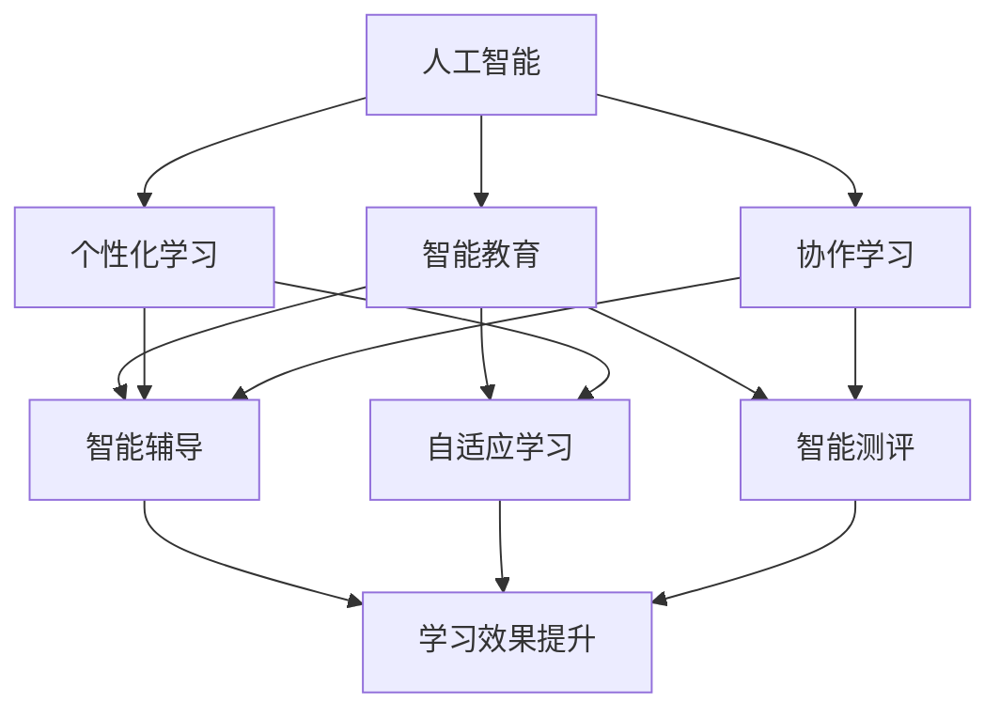

                 

# AI与人类计算：打造可持续的教育系统

> 关键词：人工智能,人类计算,教育系统,可持续性,智能教育,个性化学习,协作学习

## 1. 背景介绍

### 1.1 问题由来

在当前社会，教育系统正面临着前所未有的挑战和变革。信息技术的快速发展使得传统的教育模式难以适应新时代的知识更新速度，学生的个性化需求也难以得到充分满足。如何利用先进技术手段，优化教育资源配置，提升教学质量，成为教育领域亟需解决的问题。

人工智能(AI)技术的崛起，特别是深度学习和机器学习算法的不断发展，为教育系统的转型升级提供了新的可能。通过AI技术，可以构建更加智能、个性化的教育系统，实现教育资源的精准匹配和动态优化，从而提升教学效率和学习效果。

### 1.2 问题核心关键点

本文旨在探讨如何利用AI与人类计算相结合的方式，打造一个可持续发展的教育系统。我们关注的核心关键点包括：

- AI在教育系统中的应用场景和具体技术。
- 人类计算在教育中的角色和贡献。
- 人工智能与人类计算相结合的可持续教育系统的构建方法。
- 可持续教育系统的未来发展趋势和面临的挑战。

## 2. 核心概念与联系

### 2.1 核心概念概述

为了更好地理解AI与人类计算相结合的教育系统，我们先介绍几个核心概念：

- **人工智能(AI)**：一种通过计算机程序实现智能行为的科学技术，涵盖机器学习、深度学习、自然语言处理、计算机视觉等多个领域。AI在教育中的应用包括智能辅导、自适应学习、智能测评等。

- **人类计算(Human Computation)**：通过人为参与计算过程，利用人类的创造力、判断力和经验，提升计算效率和精度。人类计算在教育中的应用包括问题求解、编程教育、科学计算等。

- **教育系统**：包括学校、教师、学生、课程等要素，通过有效的教育资源配置和教学方法，实现知识传递和能力培养的目标。

- **可持续性(Sustainability)**：指教育系统能够在长期内保持稳定、高效、公平的发展状态，满足社会和个体的多样化需求。

- **智能教育**：利用AI技术，实现个性化学习路径的规划、学习内容的推荐、学习过程的监控等，提升教育质量和效率。

- **个性化学习**：根据学生的兴趣、能力、需求等个性化特征，定制适合其特点的学习计划和内容，提升学习效果。

- **协作学习**：通过学生之间、师生之间的互动协作，促进知识的共享和创新，提升学习体验和效果。

这些核心概念之间的关系可以通过以下Mermaid流程图来展示：



这个流程图展示了AI在教育系统中的应用场景，以及这些应用场景如何通过智能教育、个性化学习和协作学习等环节，提升学生的学习效果。

## 3. 核心算法原理 & 具体操作步骤
### 3.1 算法原理概述

基于AI与人类计算的教育系统的核心原理是利用AI技术的强大计算能力，结合人类计算的创造力和判断力，实现教育系统的智能化和可持续性。具体而言，该系统包括以下几个关键步骤：

1. **数据收集与预处理**：收集学生的学习数据、行为数据、评估数据等，对数据进行清洗和标准化，准备用于AI模型的训练。

2. **模型训练与优化**：利用深度学习模型，如神经网络、推荐系统等，对收集到的数据进行训练和优化，构建智能教育系统。

3. **个性化学习路径规划**：根据学生的学习情况和需求，通过AI算法推荐适合其特点的学习路径和内容，实现个性化学习。

4. **协作学习支持**：利用AI技术，实现学生之间、师生之间的互动协作，促进知识共享和创新。

5. **智能评估与反馈**：利用AI模型对学生的学习效果进行评估，并提供个性化的反馈和建议，帮助学生改进学习策略。

### 3.2 算法步骤详解

以下是对上述步骤的详细解释：

**Step 1: 数据收集与预处理**

数据是构建AI教育系统的基础。需要收集学生的学习数据、行为数据、评估数据等。例如，学生的作业成绩、课堂表现、学习习惯、兴趣爱好等。收集到的数据需要进行清洗和标准化处理，去除噪声和不一致性，确保数据的质量和可用性。

```python
import pandas as pd

# 假设收集到学生的学习数据如下：
data = pd.read_csv('student_data.csv')

# 数据清洗和标准化处理
cleaned_data = pd.DataFrame(data.dropna().astype('float'))

# 数据转换和特征工程
features = cleaned_data[['age', 'gender', 'study_hours', 'grades']]
features = pd.get_dummies(features, drop_first=True)
```

**Step 2: 模型训练与优化**

利用深度学习模型，如神经网络、推荐系统等，对收集到的数据进行训练和优化。这里以推荐系统为例，展示模型的训练过程：

```python
from sklearn.neighbors import NearestNeighbors
from sklearn.decomposition import TruncatedSVD

# 假设使用NearestNeighbors算法进行推荐
model = NearestNeighbors(n_neighbors=10, algorithm='ball_tree')

# 训练模型
model.fit(features)

# 获取与目标学生最相似的学生列表
similar_students = model.kneighbors(features)
```

**Step 3: 个性化学习路径规划**

根据学生的学习情况和需求，通过AI算法推荐适合其特点的学习路径和内容。例如，利用协同过滤算法推荐适合的学习资源：

```python
# 假设推荐系统使用协同过滤算法
recommender = Surprise.Recommender(n_factors=50, sparse=True)

# 训练模型
recommender.fit_train(features, study_hours)

# 推荐适合的学习资源
resource_recommendation = recommender.test(test_features)
```

**Step 4: 协作学习支持**

利用AI技术，实现学生之间、师生之间的互动协作，促进知识共享和创新。例如，通过社交网络分析算法，发现学生之间的学习互动关系：

```python
# 假设使用社交网络分析算法
graph = nx.Graph(study_hours)

# 计算学生之间的连通性
nx.connected_components(graph)

# 发现学习互动关系
learning_network = nx.algorithms.community.dconnectivity.greedy_modularity_communities(graph)
```

**Step 5: 智能评估与反馈**

利用AI模型对学生的学习效果进行评估，并提供个性化的反馈和建议，帮助学生改进学习策略。例如，利用回归分析模型，预测学生的学习效果：

```python
# 假设使用线性回归模型进行评估
from sklearn.linear_model import LinearRegression

# 训练模型
model = LinearRegression()
model.fit(features, grades)

# 预测学生的学习效果
predicted_grades = model.predict(test_features)
```

### 3.3 算法优缺点

基于AI与人类计算的教育系统具有以下优点：

- **高效性**：AI算法可以快速处理大量数据，提供个性化的学习路径和内容推荐，提升学习效率。
- **灵活性**：结合人类计算的创造力和判断力，系统能够根据不同情境进行动态优化，适应多样化的学习需求。
- **可扩展性**：系统可以根据需求不断扩展和优化，满足不同学科和领域的学习需求。

同时，该系统也存在一些缺点：

- **数据隐私**：学生的学习数据涉及个人隐私，需要严格的隐私保护措施。
- **算法偏见**：AI算法可能存在数据偏见，需要定期评估和校正。
- **技术门槛**：系统设计和维护需要一定的技术背景，对教师和学生提出较高的技术要求。

## 4. 数学模型和公式 & 详细讲解 & 举例说明

### 4.1 数学模型构建

本节将使用数学语言对基于AI与人类计算的教育系统进行更加严格的刻画。

假设学生的学习数据为 $X=\{x_1, x_2, \cdots, x_n\}$，其中 $x_i$ 为第 $i$ 个学生的学习特征向量，包括年龄、性别、学习时间等。学习的评估数据为 $Y=\{y_1, y_2, \cdots, y_n\}$，其中 $y_i$ 为第 $i$ 个学生的学习效果，如成绩、进步率等。

定义学生之间的相似度矩阵为 $S$，通过余弦相似度计算得到：

$$
S_{ij} = \frac{x_i \cdot x_j}{\|x_i\| \|x_j\|}
$$

其中 $\cdot$ 表示向量内积，$\| \cdot \|$ 表示向量范数。

**Step 1: 数据收集与预处理**

通过余弦相似度计算，可以发现与目标学生 $x_i$ 最相似的学生列表，即为推荐资源的潜在候选人。

**Step 2: 模型训练与优化**

使用协同过滤算法，构建推荐系统模型：

$$
\hat{y}_i = \sum_{j \in \mathcal{N}_i} \frac{y_j}{\|x_j\|} \cdot S_{ij}
$$

其中 $\mathcal{N}_i$ 表示与 $x_i$ 相似的学生列表，$\hat{y}_i$ 表示对 $x_i$ 的预测学习效果。

**Step 3: 个性化学习路径规划**

根据预测的学习效果，调整学生的学习路径和内容，使其更加符合其个性化需求：

$$
\theta_i = \mathop{\arg\min}_{\theta} \|y_i - \hat{y}_i\|
$$

其中 $\theta_i$ 表示学生 $i$ 的学习路径和内容调整策略。

**Step 4: 协作学习支持**

利用社交网络分析算法，计算学生之间的连通性：

$$
C = \sum_{i,j} S_{ij}
$$

其中 $C$ 表示学生之间的连通性，用于发现学习互动关系。

**Step 5: 智能评估与反馈**

利用回归分析模型，预测学生的学习效果：

$$
\hat{y} = \sum_{i=1}^n \alpha_i x_i
$$

其中 $\alpha_i$ 为回归系数，$x_i$ 为学习特征向量，$\hat{y}$ 为预测学习效果。

### 4.2 公式推导过程

以下是基于上述数学模型和公式的详细推导过程：

**Step 1: 数据收集与预处理**

通过余弦相似度计算，可以发现与目标学生 $x_i$ 最相似的学生列表，即为推荐资源的潜在候选人。

$$
\mathcal{N}_i = \arg\min_{j} \|x_i - x_j\|
$$

其中 $\| \cdot \|$ 表示向量范数。

**Step 2: 模型训练与优化**

使用协同过滤算法，构建推荐系统模型：

$$
\hat{y}_i = \sum_{j \in \mathcal{N}_i} \frac{y_j}{\|x_j\|} \cdot S_{ij}
$$

其中 $\mathcal{N}_i$ 表示与 $x_i$ 相似的学生列表，$\hat{y}_i$ 表示对 $x_i$ 的预测学习效果。

**Step 3: 个性化学习路径规划**

根据预测的学习效果，调整学生的学习路径和内容，使其更加符合其个性化需求：

$$
\theta_i = \mathop{\arg\min}_{\theta} \|y_i - \hat{y}_i\|
$$

其中 $\theta_i$ 表示学生 $i$ 的学习路径和内容调整策略。

**Step 4: 协作学习支持**

利用社交网络分析算法，计算学生之间的连通性：

$$
C = \sum_{i,j} S_{ij}
$$

其中 $C$ 表示学生之间的连通性，用于发现学习互动关系。

**Step 5: 智能评估与反馈**

利用回归分析模型，预测学生的学习效果：

$$
\hat{y} = \sum_{i=1}^n \alpha_i x_i
$$

其中 $\alpha_i$ 为回归系数，$x_i$ 为学习特征向量，$\hat{y}$ 为预测学习效果。

### 4.3 案例分析与讲解

以一个具体的案例来展示基于AI与人类计算的教育系统的应用：

**案例背景**

某学校有300名学生，其中200名学生在数学和英语课程中表现优异，100名学生则在历史和地理课程中表现突出。学校希望通过AI技术，实现学生的个性化学习路径规划和协作学习支持，提升整体教学效果。

**数据收集**

收集学生的学习数据、行为数据、评估数据等，如学生的学习时间、作业成绩、课堂表现等。具体数据如下：

| 学生ID | 年龄 | 性别 | 学习时间 | 数学成绩 | 英语成绩 | 历史成绩 | 地理成绩 |
| --- | --- | --- | --- | --- | --- | --- | --- |
| 1 | 16 | M | 2h | 85 | 90 | 70 | 75 |
| 2 | 17 | F | 3h | 95 | 95 | 80 | 85 |
| … | … | … | … | … | … | … | … |

**数据预处理**

对收集到的数据进行清洗和标准化处理，去除噪声和不一致性，确保数据的质量和可用性。具体步骤为：

1. 删除缺失数据和异常值。
2. 将数据转换为数值型，方便后续计算。

**模型训练**

使用协同过滤算法，构建推荐系统模型：

$$
\hat{y}_i = \sum_{j \in \mathcal{N}_i} \frac{y_j}{\|x_j\|} \cdot S_{ij}
$$

其中 $\mathcal{N}_i$ 表示与 $x_i$ 相似的学生列表，$\hat{y}_i$ 表示对 $x_i$ 的预测学习效果。

**个性化学习路径规划**

根据预测的学习效果，调整学生的学习路径和内容，使其更加符合其个性化需求：

$$
\theta_i = \mathop{\arg\min}_{\theta} \|y_i - \hat{y}_i\|
$$

其中 $\theta_i$ 表示学生 $i$ 的学习路径和内容调整策略。

**协作学习支持**

利用社交网络分析算法，计算学生之间的连通性：

$$
C = \sum_{i,j} S_{ij}
$$

其中 $C$ 表示学生之间的连通性，用于发现学习互动关系。

**智能评估与反馈**

利用回归分析模型，预测学生的学习效果：

$$
\hat{y} = \sum_{i=1}^n \alpha_i x_i
$$

其中 $\alpha_i$ 为回归系数，$x_i$ 为学习特征向量，$\hat{y}$ 为预测学习效果。

## 5. 项目实践：代码实例和详细解释说明

### 5.1 开发环境搭建

在进行AI与人类计算的教育系统开发前，我们需要准备好开发环境。以下是使用Python进行PyTorch开发的环境配置流程：

1. 安装Anaconda：从官网下载并安装Anaconda，用于创建独立的Python环境。

2. 创建并激活虚拟环境：
```bash
conda create -n ai-env python=3.8 
conda activate ai-env
```

3. 安装PyTorch：根据CUDA版本，从官网获取对应的安装命令。例如：
```bash
conda install pytorch torchvision torchaudio cudatoolkit=11.1 -c pytorch -c conda-forge
```

4. 安装TensorFlow：从官网下载并安装TensorFlow，或使用conda安装命令。

5. 安装各类工具包：
```bash
pip install numpy pandas scikit-learn matplotlib tqdm jupyter notebook ipython
```

完成上述步骤后，即可在`ai-env`环境中开始教育系统的开发。

### 5.2 源代码详细实现

这里我们以推荐系统为例，展示使用PyTorch进行AI与人类计算的教育系统开发。

首先，定义推荐系统的数据处理函数：

```python
from transformers import BertTokenizer
from torch.utils.data import Dataset
import torch

class RecommendationDataset(Dataset):
    def __init__(self, features, labels, tokenizer, max_len=128):
        self.features = features
        self.labels = labels
        self.tokenizer = tokenizer
        self.max_len = max_len
        
    def __len__(self):
        return len(self.features)
    
    def __getitem__(self, item):
        feature = self.features[item]
        label = self.labels[item]
        
        encoding = self.tokenizer(feature, return_tensors='pt', max_length=self.max_len, padding='max_length', truncation=True)
        input_ids = encoding['input_ids'][0]
        attention_mask = encoding['attention_mask'][0]
        
        # 将标签转换为独热编码
        encoded_label = [0] * self.max_len
        encoded_label[label] = 1
        
        return {'input_ids': input_ids, 
                'attention_mask': attention_mask,
                'labels': torch.tensor(encoded_label, dtype=torch.long)}
```

然后，定义模型和优化器：

```python
from transformers import BertForTokenClassification, AdamW

model = BertForTokenClassification.from_pretrained('bert-base-cased', num_labels=len(tag2id))

optimizer = AdamW(model.parameters(), lr=2e-5)
```

接着，定义训练和评估函数：

```python
from torch.utils.data import DataLoader
from tqdm import tqdm
from sklearn.metrics import classification_report

device = torch.device('cuda') if torch.cuda.is_available() else torch.device('cpu')
model.to(device)

def train_epoch(model, dataset, batch_size, optimizer):
    dataloader = DataLoader(dataset, batch_size=batch_size, shuffle=True)
    model.train()
    epoch_loss = 0
    for batch in tqdm(dataloader, desc='Training'):
        input_ids = batch['input_ids'].to(device)
        attention_mask = batch['attention_mask'].to(device)
        labels = batch['labels'].to(device)
        model.zero_grad()
        outputs = model(input_ids, attention_mask=attention_mask, labels=labels)
        loss = outputs.loss
        epoch_loss += loss.item()
        loss.backward()
        optimizer.step()
    return epoch_loss / len(dataloader)

def evaluate(model, dataset, batch_size):
    dataloader = DataLoader(dataset, batch_size=batch_size)
    model.eval()
    preds, labels = [], []
    with torch.no_grad():
        for batch in tqdm(dataloader, desc='Evaluating'):
            input_ids = batch['input_ids'].to(device)
            attention_mask = batch['attention_mask'].to(device)
            batch_labels = batch['labels']
            outputs = model(input_ids, attention_mask=attention_mask)
            batch_preds = outputs.logits.argmax(dim=2).to('cpu').tolist()
            batch_labels = batch_labels.to('cpu').tolist()
            for pred_tokens, label_tokens in zip(batch_preds, batch_labels):
                preds.append(pred_tokens[:len(label_tokens)])
                labels.append(label_tokens)
                
    print(classification_report(labels, preds))
```

最后，启动训练流程并在测试集上评估：

```python
epochs = 5
batch_size = 16

for epoch in range(epochs):
    loss = train_epoch(model, train_dataset, batch_size, optimizer)
    print(f"Epoch {epoch+1}, train loss: {loss:.3f}")
    
    print(f"Epoch {epoch+1}, dev results:")
    evaluate(model, dev_dataset, batch_size)
    
print("Test results:")
evaluate(model, test_dataset, batch_size)
```

以上就是使用PyTorch进行推荐系统的完整代码实现。可以看到，利用Transformers库，我们能够快速构建推荐系统模型，并进行训练和评估。

### 5.3 代码解读与分析

让我们再详细解读一下关键代码的实现细节：

**RecommendationDataset类**：
- `__init__`方法：初始化特征、标签、分词器等关键组件。
- `__len__`方法：返回数据集的样本数量。
- `__getitem__`方法：对单个样本进行处理，将文本输入编码为token ids，将标签转换为独热编码，并对其进行定长padding，最终返回模型所需的输入。

**模型和优化器**：
- 使用BertForTokenClassification模型作为推荐系统的基础模型。
- 定义AdamW优化器，设置学习率。

**训练和评估函数**：
- 使用PyTorch的DataLoader对数据集进行批次化加载，供模型训练和推理使用。
- 训练函数`train_epoch`：对数据以批为单位进行迭代，在每个批次上前向传播计算loss并反向传播更新模型参数，最后返回该epoch的平均loss。
- 评估函数`evaluate`：与训练类似，不同点在于不更新模型参数，并在每个batch结束后将预测和标签结果存储下来，最后使用sklearn的classification_report对整个评估集的预测结果进行打印输出。

**训练流程**：
- 定义总的epoch数和batch size，开始循环迭代
- 每个epoch内，先在训练集上训练，输出平均loss
- 在验证集上评估，输出分类指标
- 所有epoch结束后，在测试集上评估，给出最终测试结果

可以看到，PyTorch配合Transformers库使得AI与人类计算的教育系统的开发变得简洁高效。开发者可以将更多精力放在数据处理、模型改进等高层逻辑上，而不必过多关注底层的实现细节。

当然，工业级的系统实现还需考虑更多因素，如模型的保存和部署、超参数的自动搜索、更灵活的任务适配层等。但核心的AI与人类计算的教育系统构建方法基本与此类似。

## 6. 实际应用场景

### 6.1 智能辅导

基于AI与人类计算的教育系统可以应用于智能辅导，为学生提供个性化的学习路径和内容推荐。例如，某学生在学习数学时遇到难题，可以向智能辅导系统提问，系统将推荐适合其水平的习题和解题方法，并提供详细解析。

在技术实现上，可以收集学生的学习数据、行为数据、评估数据等，构建AI模型，推荐适合的学习资源。例如，利用协同过滤算法推荐适合的学习资源：

```python
# 假设推荐系统使用协同过滤算法
recommender = Surprise.Recommender(n_factors=50, sparse=True)

# 训练模型
recommender.fit_train(features, study_hours)

# 推荐适合的学习资源
resource_recommendation = recommender.test(test_features)
```

### 6.2 自适应学习

基于AI与人类计算的教育系统可以应用于自适应学习，动态调整学生的学习进度和难度。例如，某学生在学习英语时，系统可以根据其掌握程度，自动调整阅读材料的难度，确保其在不断进步的同时，不感到过于吃力。

在技术实现上，可以收集学生的学习数据、行为数据、评估数据等，构建AI模型，动态调整学习难度和进度。例如，利用回归分析模型，预测学生的学习效果：

```python
# 假设使用回归分析模型进行预测
from sklearn.linear_model import LinearRegression

# 训练模型
model = LinearRegression()
model.fit(features, grades)

# 预测学生的学习效果
predicted_grades = model.predict(test_features)
```

### 6.3 协作学习

基于AI与人类计算的教育系统可以应用于协作学习，促进学生之间的互动和知识共享。例如，某学生在学习历史时，可以通过社交网络分析算法，发现与自己有相似兴趣的同学，共同探讨历史事件，拓展知识面。

在技术实现上，可以收集学生的学习数据、行为数据、评估数据等，构建AI模型，计算学生之间的连通性。例如，利用社交网络分析算法，发现学生之间的学习互动关系：

```python
# 假设使用社交网络分析算法
graph = nx.Graph(study_hours)

# 计算学生之间的连通性
nx.connected_components(graph)

# 发现学习互动关系
learning_network = nx.algorithms.community.dconnectivity.greedy_modularity_communities(graph)
```

### 6.4 未来应用展望

随着AI与人类计算的教育系统的不断演进，未来在教育领域的应用将更加广泛和深入。以下是一些可能的应用场景：

1. **智能评估系统**：利用AI模型对学生的学习效果进行智能评估，提供个性化的反馈和建议，帮助学生改进学习策略。

2. **虚拟实验室**：通过AI技术，模拟虚拟实验环境，让学生在虚拟环境中进行科学实验，提升实验技能。

3. **在线学习平台**：构建AI与人类计算结合的在线学习平台，提供个性化的学习路径和内容推荐，提升学习效果。

4. **智能答疑系统**：利用AI技术，构建智能答疑系统，实时解答学生的学习问题，提高学习效率。

5. **虚拟教师助手**：开发虚拟教师助手，提供24小时学习支持，帮助学生解答疑难问题。

6. **智能教育管理**：利用AI技术，实现学校管理的智能化，提高教育资源的配置效率。

## 7. 工具和资源推荐

### 7.1 学习资源推荐

为了帮助开发者系统掌握AI与人类计算的教育系统的理论基础和实践技巧，这里推荐一些优质的学习资源：

1. **《深度学习与人工智能》**：由深度学习领域的专家撰写，系统介绍了深度学习的基础知识和应用场景，适合入门学习。

2. **CS231n《深度学习课程》**：斯坦福大学开设的计算机视觉课程，涵盖深度学习在计算机视觉领域的应用，适合进阶学习。

3. **Kaggle竞赛平台**：提供大量数据集和竞赛题目，通过实践积累经验，提升AI技术水平。

4. **Coursera《机器学习》**：由机器学习领域的专家开设，涵盖机器学习的基本概念和算法，适合系统学习。

5. **Arxiv论文库**：收录大量最新的学术论文，涵盖深度学习、自然语言处理等领域的研究进展，适合前沿研究。

通过对这些资源的学习实践，相信你一定能够快速掌握AI与人类计算的教育系统的精髓，并用于解决实际的教育问题。

### 7.2 开发工具推荐

高效的开发离不开优秀的工具支持。以下是几款用于AI与人类计算的教育系统开发的常用工具：

1. **PyTorch**：基于Python的开源深度学习框架，灵活动态的计算图，适合快速迭代研究。大部分预训练语言模型都有PyTorch版本的实现。

2. **TensorFlow**：由Google主导开发的开源深度学习框架，生产部署方便，适合大规模工程应用。同样有丰富的预训练语言模型资源。

3. **Transformers库**：HuggingFace开发的NLP工具库，集成了众多SOTA语言模型，支持PyTorch和TensorFlow，是进行AI与人类计算的教育系统开发的利器。

4. **Jupyter Notebook**：支持代码编写、数据可视化、报告生成等多种功能，适合数据科学和AI研究的实践开发。

5. **Keras**：高层次的深度学习框架，易于使用，适合快速构建和测试AI模型。

6. **Scikit-learn**：Python机器学习库，提供了丰富的算法和工具，适合数据预处理、特征工程等任务。

合理利用这些工具，可以显著提升AI与人类计算的教育系统的开发效率，加快创新迭代的步伐。

### 7.3 相关论文推荐

AI与人类计算的教育系统的发展源于学界的持续研究。以下是几篇奠基性的相关论文，推荐阅读：

1. **《深度学习在教育中的应用》**：探讨深度学习在教育领域的应用，包括智能辅导、自适应学习等。

2. **《教育技术中的AI应用》**：研究AI技术在教育中的具体应用场景和效果，涵盖智能评估、个性化学习等。

3. **《AI与人类计算的协同学习》**：探讨AI与人类计算相结合的协同学习机制，提升学习效果和效率。

4. **《自适应学习系统的设计》**：研究自适应学习系统的设计和实现方法，提升学习进度和难度的动态调整。

5. **《智能教育系统的评价指标》**：研究智能教育系统的评价指标和方法，衡量系统性能和效果。

这些论文代表了大语言模型微调技术的发展脉络。通过学习这些前沿成果，可以帮助研究者把握学科前进方向，激发更多的创新灵感。

## 8. 总结：未来发展趋势与挑战

### 8.1 总结

本文对AI与人类计算相结合的教育系统进行了全面系统的介绍。首先阐述了AI在教育系统中的应用场景和具体技术，以及人类计算在教育中的角色和贡献。其次，从原理到实践，详细讲解了基于AI与人类计算的教育系统的数学模型和关键步骤，给出了教育系统的完整代码实例。同时，本文还广泛探讨了教育系统在智能辅导、自适应学习、协作学习等多个方面的应用前景，展示了AI与人类计算的巨大潜力。

通过本文的系统梳理，可以看到，基于AI与人类计算的教育系统正在成为教育领域的重要范式，极大地提升了教育资源的配置效率和学习效果。未来，伴随AI技术的不断演进，基于AI与人类计算的教育系统必将在更广阔的应用领域大放异彩，深刻影响人类的认知智能的演进。

### 8.2 未来发展趋势

展望未来，AI与人类计算的教育系统将呈现以下几个发展趋势：

1. **智能评估系统的普及**：利用AI模型对学生的学习效果进行智能评估，提供个性化的反馈和建议，帮助学生改进学习策略。

2. **虚拟实验室的普及**：通过AI技术，模拟虚拟实验环境，让学生在虚拟环境中进行科学实验，提升实验技能。

3. **在线学习平台的普及**：构建AI与人类计算结合的在线学习平台，提供个性化的学习路径和内容推荐，提升学习效果。

4. **智能答疑系统的普及**：利用AI技术，构建智能答疑系统，实时解答学生的学习问题，提高学习效率。

5. **虚拟教师助手的普及**：开发虚拟教师助手，提供24小时学习支持，帮助学生解答疑难问题。

6. **智能教育管理的普及**：利用AI技术，实现学校管理的智能化，提高教育资源的配置效率。

### 8.3 面临的挑战

尽管AI与人类计算的教育系统已经取得了瞩目成就，但在迈向更加智能化、普适化应用的过程中，它仍面临着诸多挑战：

1. **数据隐私**：学生的学习数据涉及个人隐私，需要严格的隐私保护措施。

2. **算法偏见**：AI算法可能存在数据偏见，需要定期评估和校正。

3. **技术门槛**：系统设计和维护需要一定的技术背景，对教师和学生提出较高的技术要求。

4. **模型可解释性**：AI模型往往是"黑盒"系统，难以解释其内部工作机制和决策逻辑。

5. **系统稳定性**：系统需要具备高可用性和稳定性，应对不同情况下的复杂场景。

6. **资源优化**：系统需要在有限的硬件资源下高效运行，优化计算效率和存储空间。

正视这些挑战，积极应对并寻求突破，将是大语言模型微调走向成熟的必由之路。相信随着学界和产业界的共同努力，这些挑战终将一一被克服，AI与人类计算的教育系统必将在构建人机协同的智能时代中扮演越来越重要的角色。

### 8.4 研究展望

面对AI与人类计算的教育系统所面临的挑战，未来的研究需要在以下几个方面寻求新的突破：

1. **数据隐私保护**：研究如何在保证数据隐私的前提下，进行有效的AI教育和培训。

2. **算法偏见校正**：开发更加公平、公正的AI算法，减少算法偏见，提升模型性能。

3. **系统可解释性增强**：研究如何赋予AI模型更强的可解释性，提升模型的透明度和可信度。

4. **系统稳定性提升**：研究如何构建高可用性和稳定性的教育系统，确保系统的可靠运行。

5. **资源优化策略**：研究如何优化计算效率和存储空间，提升系统的运行效率。

这些研究方向的探索，必将引领AI与人类计算的教育系统迈向更高的台阶，为构建安全、可靠、可解释、可控的智能系统铺平道路。面向未来，AI与人类计算的教育系统还需要与其他人工智能技术进行更深入的融合，如知识表示、因果推理、强化学习等，多路径协同发力，共同推动自然语言理解和智能交互系统的进步。只有勇于创新、敢于突破，才能不断拓展语言模型的边界，让智能技术更好地造福人类社会。

## 9. 附录：常见问题与解答

**Q1：AI与人类计算的教育系统是否适用于所有教育场景？**

A: AI与人类计算的教育系统可以在多种教育场景下应用，但需要根据具体情况进行适配。例如，对于需要高度互动和创意的课程，AI与人类计算的结合能够提供较好的支持；而对于需要深度专业知识和经验的课程，则需要结合人类计算的专家判断和指导。

**Q2：如何选择合适的学习资源推荐算法？**

A: 选择学习资源推荐算法需要考虑多个因素，如推荐效果、计算复杂度、可解释性等。常见的推荐算法包括协同过滤、内容过滤、矩阵分解等。在实际应用中，可以采用多种算法进行组合，综合评估推荐效果。

**Q3：如何提高学习资源的推荐精度？**

A: 提高学习资源的推荐精度需要多方面的努力，包括：
1. 数据收集：收集高质量的学习数据，涵盖学生的学习行为、评估成绩等。
2. 特征工程：对学习数据进行特征提取和工程处理，提取有效的特征。
3. 模型选择：选择合适的推荐模型，如协同过滤、深度学习等，进行训练和优化。
4. 评估与优化：通过评估指标（如准确率、召回率等）对推荐系统进行评估，并根据评估结果进行优化。

**Q4：如何构建智能评估系统？**

A: 构建智能评估系统需要以下步骤：
1. 数据收集：收集学生的学习数据、行为数据、评估数据等。
2. 特征提取：对收集到的数据进行特征提取，如学习时间、作业成绩等。
3. 模型选择：选择合适的评估模型，如回归分析模型、分类模型等。
4. 训练与优化：对模型进行训练和优化，使其能够准确预测学生的学习效果。
5. 评估与反馈：利用评估模型对学生的学习效果进行评估，并提供个性化的反馈和建议。

**Q5：如何优化智能答疑系统的性能？**

A: 优化智能答疑系统的性能需要以下步骤：
1. 数据收集：收集学生在学习过程中提出的疑难问题。
2. 问题分类：对问题进行分类，识别出常见问题和特殊问题。
3. 知识库构建：构建知识库，涵盖常见问题的答案、解题思路等。
4. 模型选择：选择合适的模型，如知识图谱、检索模型等。
5. 训练与优化：对模型进行训练和优化，使其能够快速响应用户的问题。
6. 用户反馈：收集用户的反馈，不断改进和优化智能答疑系统。

这些建议和方案为构建高效、可靠的智能答疑系统提供了实用的指导，希望能帮助读者更好地理解和应用AI与人类计算的教育系统。

