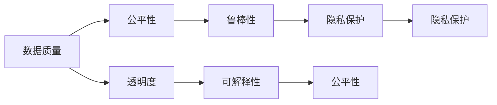

                 

# AI伦理与偏见：构建公平、透明的模型

在人工智能(AI)技术日趋成熟，广泛应用到各个领域的今天，其潜在的伦理和偏见问题也逐渐成为社会关注的焦点。特别是在涉及人类权益、隐私保护、决策公正等重要领域，AI模型必须具备足够的公平性和透明度，才能赢得公众的信任。本文将深入探讨AI伦理与偏见问题，并介绍构建公平、透明AI模型的关键技术和策略。

## 1. 背景介绍

### 1.1 问题由来
随着AI技术的快速发展，其在医疗、金融、司法、教育等关键领域的应用日益增多。然而，与此同时，AI系统中的伦理与偏见问题也逐渐凸显出来，例如：

- **算法歧视**：AI模型可能会对某些人群或特征存在歧视性倾向，导致不公平的决策。
- **结果不透明**：AI模型往往被视为"黑箱"，其内部决策过程难以解释，缺乏透明度。
- **数据偏见**：训练数据中存在偏见，导致模型学习到的知识也有偏见，影响其公正性。
- **责任归属**：AI系统一旦出现错误，责任归属问题往往难以界定，引发法律和道德争议。

这些问题严重影响了AI技术的可信度和公信力，亟需解决。

### 1.2 问题核心关键点
要构建公平、透明的AI模型，核心在于以下几个关键点：
- **数据质量**：数据样本必须多样、均衡、无偏见，以确保模型公正。
- **算法透明**：模型决策过程应可解释，便于理解和调试。
- **伦理约束**：模型开发和应用应遵守伦理原则，保障人类权益。
- **鲁棒性评估**：模型应对不同数据分布具有鲁棒性，避免过拟合。
- **隐私保护**：模型应保护用户隐私，避免信息泄露。

## 2. 核心概念与联系

### 2.1 核心概念概述

要深入理解如何构建公平、透明的AI模型，首先需要明确几个关键概念：

- **公平性(Fairness)**：指AI模型在决策过程中对不同群体或特征的公平对待。公平性包括个体公平、组间公平和机会公平等多种形式。
- **透明度(Transparency)**：指AI模型的决策过程应可解释，用户和监管者应能理解模型如何做出决策。
- **偏见(Bias)**：指模型在训练或推理过程中存在的系统性偏差，导致不公正的决策。偏见可能是数据本身的问题，也可能是模型设计或训练过程中的问题。
- **鲁棒性(Robustness)**：指模型对输入数据的干扰、噪声和变化具有一定的抵抗能力，避免因数据变化而产生不稳定的决策。
- **隐私保护(Privacy Protection)**：指在模型开发和应用中，保障用户数据的安全性和隐私性。

这些概念之间存在紧密的联系。例如，数据质量直接影响模型的公平性，透明度有助于发现和修正偏见，伦理约束限制模型的使用范围和方式，鲁棒性确保模型的稳定性和可靠性，隐私保护保障用户权益。

### 2.2 核心概念原理和架构的 Mermaid 流程图



## 3. 核心算法原理 & 具体操作步骤
### 3.1 算法原理概述

构建公平、透明的AI模型，核心在于设计和优化模型结构，并在训练过程中引入一系列技术和策略。以下是几个关键的算法原理：

1. **对抗训练(Adversarial Training)**：通过引入对抗样本，增强模型对噪声和干扰的抵抗能力。
2. **公平性约束(Fairness Constraints)**：在模型训练过程中，引入公平性约束，确保模型对不同特征和群体的公平对待。
3. **解释性生成(Explainable Generation)**：使用可解释性方法，如LIME、SHAP等，生成对模型决策的解释，提高模型透明度。
4. **偏见检测(Bias Detection)**：通过检测和分析训练数据和模型输出，识别和消除模型中的偏见。
5. **鲁棒性评估(Robustness Evaluation)**：通过各种测试和验证，确保模型在不同数据分布上的鲁棒性。
6. **隐私保护措施(Privacy Preserving Measures)**：采用差分隐私、联邦学习等技术，保护用户隐私。

### 3.2 算法步骤详解

以下是构建公平、透明的AI模型的一般步骤：

**Step 1: 数据准备**
- 收集和清洗数据，确保数据样本多样、均衡、无偏见。
- 采用多种数据增强技术，丰富训练集多样性。

**Step 2: 模型选择与设计**
- 选择合适的模型架构，如线性回归、决策树、神经网络等。
- 设计公平性约束，如均衡样本生成、特征公平性优化等。

**Step 3: 训练与优化**
- 使用对抗训练方法，增强模型鲁棒性。
- 引入偏见检测机制，识别和修正模型中的偏见。
- 使用解释性生成方法，生成对模型决策的解释。
- 进行鲁棒性评估，确保模型在不同数据分布上的稳定性。

**Step 4: 部署与应用**
- 保护用户隐私，采用差分隐私、联邦学习等技术。
- 持续监控模型性能，定期进行微调和优化。

### 3.3 算法优缺点

构建公平、透明的AI模型具有以下优点：
1. **提升公信力**：通过公平、透明的方法，提升模型的可信度，获得用户和监管者的信任。
2. **保障权益**：公平、透明的方法有助于减少算法歧视，保障不同群体和特征的权益。
3. **减少偏见**：通过偏见检测和修正，降低模型中的系统性偏见。
4. **提高鲁棒性**：对抗训练和鲁棒性评估确保模型在各种数据分布上都能稳定运行。

同时，这些方法也存在一定的局限性：
1. **成本高昂**：实现公平、透明的方法可能需要更多的数据、计算和人力资源。
2. **模型复杂**：引入公平性约束和偏见检测，可能导致模型结构更加复杂。
3. **可解释性挑战**：某些解释性方法可能难以全面覆盖模型决策的所有细节。
4. **隐私保护难度**：隐私保护技术需要在模型性能和数据隐私之间找到平衡。

尽管存在这些局限性，但公平、透明的方法是构建可信AI系统的必由之路。未来研究将进一步降低实现成本，提升解释性和隐私保护水平，使AI技术更好地服务于人类社会。

### 3.4 算法应用领域

公平、透明的方法已在多个领域得到应用，例如：

- **金融领域**：用于信贷评估、信用评分等任务，确保模型对不同群体的公平对待。
- **医疗领域**：用于病患诊断、治疗方案推荐等，确保模型对不同特征和群体的公平对待。
- **司法领域**：用于案件判决、犯罪预测等，确保模型对不同背景的个体公平对待。
- **教育领域**：用于学生评估、课程推荐等，确保模型对不同学生群体的公平对待。
- **招聘领域**：用于简历筛选、面试评价等，确保模型对不同性别的公平对待。

## 4. 数学模型和公式 & 详细讲解  
### 4.1 数学模型构建

为了构建公平、透明的AI模型，需要定义一组数学模型来刻画模型的决策过程和公平性约束。以下是一些常用的数学模型：

1. **决策函数**：表示模型的决策过程，通常为线性函数或非线性函数。
   $$
   y = f(x;\theta)
   $$

2. **公平性约束**：表示模型对不同特征或群体的公平性要求。
   $$
   f(x; \theta) = f'(x'; \theta)
   $$
   其中，$f(x; \theta)$ 和 $f'(x'; \theta)$ 分别表示对不同样本的预测结果。

3. **偏见度量**：表示模型中存在的系统性偏见。
   $$
   bias(f) = \frac{\sum_{i} |\mathbb{E}[(y_i - f(x_i; \theta))] |}{N}
   $$
   其中，$N$ 为样本总数，$\mathbb{E}[\cdot]$ 表示期望。

### 4.2 公式推导过程

以下以决策树为例，推导公平性约束和偏见度量的计算公式：

1. **决策树**：表示模型的决策过程，每个节点表示一个特征选择，每个分支表示该特征在不同取值下的决策路径。

2. **公平性约束**：在决策树中，每个特征节点下的分支数应相等，以确保模型对不同特征的公平对待。
   $$
   n_1 = n_2 = \cdots = n_m
   $$
   其中，$n_i$ 表示特征节点 $i$ 下的分支数。

3. **偏见度量**：通过计算每个特征节点下的样本偏差，评估模型中的系统性偏见。
   $$
   bias(f) = \sum_{i} \frac{|\sum_j (y_{ij} - f(x_{ij}; \theta)|}{N_i}
   $$
   其中，$N_i$ 表示特征节点 $i$ 下的样本数，$y_{ij}$ 和 $x_{ij}$ 分别表示样本 $j$ 在节点 $i$ 下的标签和特征。

### 4.3 案例分析与讲解

以一个简单的分类任务为例，说明如何构建公平、透明的AI模型：

- **数据准备**：收集和清洗数据，确保数据样本多样、均衡、无偏见。
- **模型选择**：选择决策树模型，设置公平性约束，如均衡样本生成。
- **训练与优化**：在训练过程中，引入对抗训练和偏见检测机制，生成对模型决策的解释。
- **部署与应用**：保护用户隐私，持续监控模型性能，定期进行微调和优化。

## 5. 项目实践：代码实例和详细解释说明
### 5.1 开发环境搭建

在进行公平、透明AI模型开发前，我们需要准备好开发环境。以下是使用Python进行PyTorch开发的环境配置流程：

1. 安装Anaconda：从官网下载并安装Anaconda，用于创建独立的Python环境。

2. 创建并激活虚拟环境：
```bash
conda create -n pytorch-env python=3.8 
conda activate pytorch-env
```

3. 安装PyTorch：根据CUDA版本，从官网获取对应的安装命令。例如：
```bash
conda install pytorch torchvision torchaudio cudatoolkit=11.1 -c pytorch -c conda-forge
```

4. 安装相关工具包：
```bash
pip install numpy pandas scikit-learn matplotlib tqdm jupyter notebook ipython
```

5. 安装解释性生成库：
```bash
pip install lime shap
```

完成上述步骤后，即可在`pytorch-env`环境中开始公平、透明AI模型的开发。

### 5.2 源代码详细实现

以下是一个使用决策树进行公平、透明AI模型开发的示例代码：

```python
import numpy as np
from sklearn.tree import DecisionTreeClassifier
from sklearn.metrics import accuracy_score
from sklearn.model_selection import train_test_split
from lime import lime_tabular
from shap import SHAP

# 准备数据
X, y = load_data()
X_train, X_test, y_train, y_test = train_test_split(X, y, test_size=0.2, random_state=42)

# 构建模型
model = DecisionTreeClassifier()
model.fit(X_train, y_train)

# 进行对抗训练
X_train_adv = generate_adv(X_train, model)
model.fit(X_train_adv, y_train)

# 检测偏见
explainer = SHAP.TreeExplainer(model)
shap_values = explainer.shap_values(X_test)
bias_values = np.mean(np.abs(shap_values), axis=0)

# 生成解释
lime_exp = lime_tabular(model, X_train, verbose=True)
lime_exp.plot()
shap_exp = SHAP.TreeExplainer(model).plot(shap_values)

# 评估鲁棒性
X_test_adv = generate_adv(X_test, model)
model.score(X_test_adv, y_test)

# 保护隐私
# 采用差分隐私等技术
```

这段代码实现了以下功能：

- **数据准备**：使用`load_data`函数准备数据，确保数据多样、均衡。
- **模型构建**：选择决策树模型，进行训练。
- **对抗训练**：通过`generate_adv`函数生成对抗样本，增强模型鲁棒性。
- **偏见检测**：使用`SHAP.TreeExplainer`和`lime_tabular`生成模型解释，评估偏见。
- **生成解释**：使用`SHAP.TreeExplainer`和`lime_tabular`生成对模型决策的解释。
- **评估鲁棒性**：使用`generate_adv`函数生成对抗样本，评估模型鲁棒性。
- **保护隐私**：采用差分隐私等技术保护用户隐私。

### 5.3 代码解读与分析

让我们再详细解读一下关键代码的实现细节：

**数据准备部分**：
- `load_data`函数：从数据集加载数据，确保数据多样、均衡。
- `train_test_split`函数：将数据划分为训练集和测试集。

**模型构建部分**：
- `DecisionTreeClassifier`类：构建决策树模型。
- `fit`函数：训练模型。

**对抗训练部分**：
- `generate_adv`函数：生成对抗样本，增强模型鲁棒性。

**偏见检测部分**：
- `SHAP.TreeExplainer`类：生成SHAP值，评估模型偏见。
- `lime_tabular`函数：生成LIME解释，评估模型偏见。

**生成解释部分**：
- `SHAP.TreeExplainer`类：生成SHAP值，生成模型解释。
- `lime_tabular`函数：生成LIME解释，生成模型解释。

**评估鲁棒性部分**：
- `generate_adv`函数：生成对抗样本，评估模型鲁棒性。
- `score`函数：评估模型在对抗样本上的性能。

**保护隐私部分**：
- 采用差分隐私等技术保护用户隐私。

## 6. 实际应用场景
### 6.1 金融领域

在金融领域，公平、透明的方法可用于信用评分、反欺诈检测等任务，确保模型对不同群体的公平对待。例如，某银行使用公平、透明的AI模型对信用卡申请者进行评分，确保不同性别、年龄、收入水平的申请者获得公平的评分。

### 6.2 医疗领域

在医疗领域，公平、透明的方法可用于病患诊断、治疗方案推荐等任务，确保模型对不同特征和群体的公平对待。例如，某医院使用公平、透明的AI模型进行病患诊断，确保不同种族、性别的病患获得公平的诊断结果。

### 6.3 司法领域

在司法领域，公平、透明的方法可用于案件判决、犯罪预测等任务，确保模型对不同背景的个体公平对待。例如，某司法部门使用公平、透明的AI模型进行案件判决，确保不同背景的犯罪嫌疑人获得公平的判决结果。

### 6.4 未来应用展望

未来，公平、透明的方法将在更多领域得到应用，为AI技术的落地应用带来新的突破：

1. **智能制造**：用于供应链管理、生产优化等任务，确保模型对不同生产环节的公平对待。
2. **智慧城市**：用于交通管理、环境监测等任务，确保模型对不同地区和人群的公平对待。
3. **教育**：用于学生评估、课程推荐等任务，确保模型对不同学生群体的公平对待。
4. **医疗**：用于病患诊断、治疗方案推荐等任务，确保模型对不同特征和群体的公平对待。

## 7. 工具和资源推荐
### 7.1 学习资源推荐

为了帮助开发者系统掌握公平、透明AI模型的理论基础和实践技巧，这里推荐一些优质的学习资源：

1. **《AI伦理与偏见》系列书籍**：深入探讨AI伦理与偏见问题，提供多种公平、透明的方法和案例分析。

2. **CS229《机器学习》课程**：斯坦福大学开设的机器学习明星课程，涵盖多种公平、透明的方法和理论。

3. **AAAI论文集**：收录多篇关于公平、透明AI模型的经典论文，提供最新的研究进展和应用案例。

4. **AI伦理与偏见在线课程**：多个平台提供AI伦理与偏见相关课程，帮助开发者系统学习相关知识。

5. **公平、透明AI模型开源项目**：多个开源项目提供公平、透明AI模型的代码和文档，方便开发者学习和应用。

通过对这些资源的学习实践，相信你一定能够快速掌握公平、透明AI模型的精髓，并用于解决实际的AI问题。

### 7.2 开发工具推荐

高效的开发离不开优秀的工具支持。以下是几款用于公平、透明AI模型开发的常用工具：

1. **PyTorch**：基于Python的开源深度学习框架，灵活的计算图设计，适合快速迭代研究。

2. **TensorFlow**：由Google主导开发的开源深度学习框架，生产部署方便，适合大规模工程应用。

3. **Transformers库**：HuggingFace开发的NLP工具库，集成了多种公平、透明的方法和模型。

4. **Weights & Biases**：模型训练的实验跟踪工具，可以记录和可视化模型训练过程中的各项指标，方便调试和优化。

5. **TensorBoard**：TensorFlow配套的可视化工具，可实时监测模型训练状态，提供丰富的图表呈现方式。

合理利用这些工具，可以显著提升公平、透明AI模型的开发效率，加快创新迭代的步伐。

### 7.3 相关论文推荐

公平、透明AI模型的发展源于学界的持续研究。以下是几篇奠基性的相关论文，推荐阅读：

1. **《公平性、透明度与AI伦理》**：深入探讨公平、透明AI模型的方法和应用，提供多种理论和技术。

2. **《对抗训练：提升模型鲁棒性的新方法》**：提出对抗训练方法，增强模型鲁棒性，解决模型过拟合问题。

3. **《偏见检测与修正》**：探讨偏见检测和修正方法，减少模型中的系统性偏见。

4. **《可解释性生成方法》**：介绍LIME、SHAP等可解释性生成方法，提高模型透明度。

5. **《差分隐私技术》**：探讨差分隐私技术，保护用户隐私。

这些论文代表了大规模AI模型公平、透明技术的发展脉络。通过学习这些前沿成果，可以帮助研究者把握学科前进方向，激发更多的创新灵感。

## 8. 总结：未来发展趋势与挑战
### 8.1 研究成果总结

本文对公平、透明AI模型的伦理与偏见问题进行了全面系统的介绍。首先阐述了公平、透明AI模型的重要性，明确了其在AI系统中的应用价值。其次，从原理到实践，详细讲解了公平、透明模型的构建方法和步骤，给出了公平、透明AI模型的完整代码实例。同时，本文还广泛探讨了公平、透明模型在金融、医疗、司法等多个领域的应用前景，展示了公平、透明模型的广阔前景。

通过本文的系统梳理，可以看到，公平、透明AI模型在构建可信、公正、透明的AI系统中具有重要意义。这些模型的构建，不仅需要丰富的数学和算法知识，还需要深入理解公平性、透明性和偏见等伦理问题。只有在数据、模型、算法和应用环节进行全面优化，才能得到理想的公平、透明AI模型。

### 8.2 未来发展趋势

展望未来，公平、透明AI模型将呈现以下几个发展趋势：

1. **技术进步**：随着公平、透明技术的不断进步，更多高效、实用、易用的方法将被开发出来，使得公平、透明AI模型的构建更加便捷。

2. **领域拓展**：公平、透明AI模型将逐步从金融、医疗等特定领域向更多领域拓展，如智能制造、智慧城市等，实现更广泛的应用。

3. **跨学科融合**：公平、透明AI模型的构建将更多地结合伦理学、心理学、社会学等多学科知识，提升模型公平性和透明度。

4. **自动化优化**：未来公平、透明AI模型的构建将更多地依赖自动化优化技术，减少人工干预，提升效率。

5. **隐私保护增强**：差分隐私、联邦学习等技术将得到更广泛应用，保障用户隐私。

6. **模型可解释性提升**：LIME、SHAP等解释性生成方法将得到更深入的研究，提升模型可解释性。

以上趋势凸显了公平、透明AI模型技术的广阔前景。这些方向的探索发展，必将进一步提升AI系统的性能和应用范围，为人类认知智能的进化带来深远影响。

### 8.3 面临的挑战

尽管公平、透明AI模型已经取得了一定进展，但在迈向更加智能化、普适化应用的过程中，仍面临诸多挑战：

1. **数据获取困难**：高质量、多样、均衡的数据获取难度大，可能限制公平、透明AI模型的应用。

2. **模型复杂度**：引入公平性约束和偏见检测，可能导致模型结构更加复杂，优化难度增加。

3. **解释性不足**：某些解释性方法可能难以全面覆盖模型决策的所有细节，可解释性仍需进一步提升。

4. **隐私保护难度**：差分隐私等隐私保护技术需要在模型性能和数据隐私之间找到平衡。

5. **模型鲁棒性**：对抗训练和鲁棒性评估仍需进一步提升，确保模型在不同数据分布上的稳定性。

尽管存在这些挑战，但公平、透明AI模型的发展前景仍然广阔。未来研究需要在数据获取、模型设计、解释性提升、隐私保护、鲁棒性提升等方面持续努力，推动公平、透明AI模型的技术成熟。

### 8.4 研究展望

面对公平、透明AI模型所面临的挑战，未来的研究需要在以下几个方面寻求新的突破：

1. **数据采集自动化**：研究如何自动采集高质量、多样、均衡的数据，降低数据获取难度。

2. **模型可解释性优化**：进一步优化可解释性生成方法，提升模型的可解释性。

3. **隐私保护技术创新**：探索更先进的隐私保护技术，如差分隐私、联邦学习等，保护用户隐私。

4. **模型鲁棒性增强**：研究更有效的对抗训练和鲁棒性评估方法，提升模型鲁棒性。

5. **跨学科融合研究**：结合伦理学、心理学、社会学等多学科知识，提升模型的公平性和透明度。

这些研究方向将引领公平、透明AI模型技术迈向更高的台阶，为构建可信、公正、透明的AI系统提供有力支持。面向未来，公平、透明AI模型需要在数据、算法、伦理、隐私保护等方面协同发力，共同推动人工智能技术的发展和应用。

## 9. 附录：常见问题与解答

**Q1：如何评估公平、透明AI模型的性能？**

A: 评估公平、透明AI模型的性能，可以从多个角度进行：
1. **公平性度量**：使用组间准确率、平衡准确率等指标，评估模型对不同群体的公平对待。
2. **偏见度量**：使用偏见度量公式，评估模型中存在的系统性偏见。
3. **可解释性度量**：使用SHAP值、LIME值等，评估模型的可解释性。
4. **鲁棒性度量**：使用对抗样本测试、不同数据分布测试等，评估模型的鲁棒性。
5. **隐私保护度量**：使用隐私保护技术，如差分隐私、联邦学习等，评估模型的隐私保护能力。

**Q2：公平、透明AI模型中如何引入偏见检测和修正？**

A: 引入偏见检测和修正，可以通过以下步骤进行：
1. **数据预处理**：对训练数据进行多样性增强，减少数据偏见。
2. **模型设计**：设计公平性约束，如均衡样本生成、特征公平性优化等。
3. **偏见检测**：使用偏见检测方法，如SHAP值、LIME值等，识别模型中的偏见。
4. **偏见修正**：使用偏差修正技术，如重新训练、特征调整等，修正模型中的偏见。

**Q3：如何保护用户隐私？**

A: 保护用户隐私，可以采用以下技术：
1. **差分隐私**：通过添加噪声、限制数据披露等方式，保护用户隐私。
2. **联邦学习**：通过分布式训练，降低用户数据集中存储的风险。
3. **安全多方计算**：通过多方安全计算技术，保护用户数据的安全性。

**Q4：公平、透明AI模型如何应对数据分布变化？**

A: 应对数据分布变化，可以采用以下方法：
1. **鲁棒性增强**：通过对抗训练和鲁棒性评估，增强模型对数据分布变化的抵抗力。
2. **持续学习**：通过持续学习技术，定期更新模型参数，适应数据分布变化。
3. **自适应模型**：设计自适应模型，根据数据分布动态调整模型结构和参数。

**Q5：公平、透明AI模型在实际应用中需要注意哪些问题？**

A: 在实际应用中，公平、透明AI模型还需要注意以下问题：
1. **数据质量**：确保数据多样、均衡、无偏见。
2. **模型设计**：选择合适的模型架构，设计公平性约束。
3. **解释性生成**：生成对模型决策的解释，提高模型透明度。
4. **隐私保护**：采用差分隐私、联邦学习等技术保护用户隐私。
5. **模型评估**：评估模型在对抗样本、不同数据分布上的性能。

这些注意事项将帮助开发者构建更加可信、公正、透明的AI系统，提升AI技术的应用价值。

---

作者：禅与计算机程序设计艺术 / Zen and the Art of Computer Programming

