                 

# AI伦理的多元化视角:哲学、社会学和法学的交叉

> 关键词：AI伦理、多元化视角、哲学、社会学、法学、交叉学科

## 1. 背景介绍

### 1.1 问题由来
随着人工智能(AI)技术的迅猛发展，其在医疗、金融、交通、教育等领域的应用越来越广泛。AI技术的强大能力使得它能够处理大量复杂的数据，提升工作效率，带来巨大的经济效益。然而，随之而来的AI伦理问题也越来越受到关注。

AI伦理涉及的范畴广泛，从基本的道德问题，到具体的法律、政策、治理问题，都需深入探讨。AI伦理的核心在于如何在技术发展的过程中，保持人类价值和道德标准，防止AI技术的滥用和误用。

近年来，国内外越来越多的学者开始将AI伦理问题作为一个跨学科的课题进行研究，涉及哲学、社会学和法学等多个学科的交叉。这种多元化的视角，使得AI伦理问题得到了更加全面的分析和探讨。

### 1.2 问题核心关键点
AI伦理问题主要集中在以下几个方面：
1. **道德与价值观**：AI系统的行为是否符合人类的道德准则，是否能保持人类价值观。
2. **决策透明度**：AI系统的决策过程是否透明，是否可解释，是否公平公正。
3. **隐私与数据安全**：AI系统在处理数据时是否遵守隐私和数据安全法规。
4. **责任归属**：AI系统在出现错误或造成损害时，责任应如何划分。
5. **社会影响**：AI技术在社会各领域的应用对就业、教育、医疗等造成的影响。
6. **国际规范**：不同国家和地区的AI伦理规范和标准，以及国际间的协调与合作。

以上核心问题需要跨学科的研究视角，将AI伦理问题放在人类社会的大背景中进行深入分析。

## 2. 核心概念与联系

### 2.1 核心概念概述

在探讨AI伦理的多元化视角之前，首先需要理解哲学、社会学和法学这三大学科的核心概念及其相互联系：

- **哲学**：以伦理学为核心，研究人的道德价值、行为的合理性等基本问题。哲学的伦理学为AI伦理提供了理论基础。
- **社会学**：研究社会结构、行为规范以及社会变迁等。社会学有助于理解AI技术对社会的深远影响。
- **法学**：研究法律规范和法律实施，为AI伦理问题提供了法律依据。

哲学、社会学和法学三者的交叉，形成了对AI伦理问题的全面探讨。这种多元化的视角有助于从不同学科的角度，理解AI伦理的本质和挑战，提出解决方案。

### 2.2 核心概念原理和架构的 Mermaid 流程图

```mermaid
graph LR
    A[哲学] --> B[伦理学]
    A --> C[价值观]
    B --> D[决策透明度]
    B --> E[隐私与数据安全]
    B --> F[责任归属]
    C --> G[社会影响]
    D --> H[国际规范]
    E --> I[法律依据]
    F --> J[法律责任]
    G --> K[社会公平]
    H --> L[跨学科协作]
    I --> M[法律法规]
    J --> N[国际规范]
    K --> O[跨领域应用]
    L --> P[治理机制]
    M --> Q[政策制定]
    N --> R[国际合作]
    O --> S[社会治理]
    P --> T[规范制定]
    Q --> U[政策执行]
    R --> V[国际协同]
    S --> W[社会适应]
    T --> X[标准化建设]
    U --> Y[规范落实]
    V --> Z[国际规则]
    W --> AA[公众教育]
    X --> BB[标准体系]
    Y --> CC[规范遵从]
    Z --> DD[国际合作]
    AA --> EE[公众理解]
    BB --> FF[标准化实践]
    CC --> GG[合规执行]
    DD --> HH[国际共识]
    EE --> II[公众信任]
    FF --> JJ[标准化应用]
    GG --> KK[合规保障]
    HH --> LL[国际规则]
    II --> MM[公众信心]
    JJ --> NN[标准执行]
    KK --> OO[合规监管]
    LL --> PP[国际合作]
    MM --> QQ[政策信任]
    NN --> RR[标准应用]
    OO --> SS[合规保障]
    PP --> TT[规范制定]
    QQ --> UU[政策执行]
    RR --> VV[国际协同]
    SS --> WW[社会适应]
    TT --> XX[标准化建设]
    UU --> YY[规范落实]
    VV --> ZZ[国际规则]
    WW --> Aa[公众教育]
    XX --> Ba[标准体系]
    YY --> Ca[规范遵从]
    ZZ --> Da[国际共识]
    Aa --> Eb[公众理解]
    Ba --> Fb[标准化实践]
    Ca --> Gb[合规执行]
    Da --> Hb[国际规则]
    Eb --> Ib[公众信任]
    Fb --> Jb[标准化应用]
    Gb --> Kb[合规保障]
    Hb --> Lb[国际规则]
    Ib --> Mb[公众信心]
    Jb --> Nb[标准执行]
    Kb --> Ob[合规监管]
    Lb --> Pb[国际合作]
    Mb --> Qb[政策信任]
    Nb --> Rb[标准应用]
    Ob --> Sb[合规保障]
    Pb --> Tb[规范制定]
    Qb --> Ub[政策执行]
    Rb --> Vb[国际协同]
    Sb --> Wb[社会适应]
    Tb --> Xb[标准化建设]
    Ub --> Yb[规范落实]
    Vb --> Zb[国际规则]
    Wb --> Ab[公众教育]
    Xb --> Bb[标准体系]
    Yb --> Cb[规范遵从]
    Zb --> Db[国际共识]
    Ab --> Eb[公众理解]
    Bb --> Fb[标准化实践]
    Cb --> Gb[合规执行]
    Db --> Hb[国际规则]
    Eb --> Ib[公众信任]
    Fb --> Jb[标准化应用]
    Gb --> Kb[合规保障]
    Hb --> Lb[国际规则]
    Ib --> Mb[公众信心]
    Jb --> Nb[标准执行]
    Kb --> Ob[合规监管]
    Lb --> Pb[国际合作]
    Mb --> Qb[政策信任]
    Nb --> Rb[标准应用]
    Ob --> Sb[合规保障]
    Pb --> Tb[规范制定]
    Qb --> Ub[政策执行]
    Rb --> Vb[国际协同]
    Sb --> Wb[社会适应]
    Tb --> Xb[标准化建设]
    Ub --> Yb[规范落实]
    Vb --> Zb[国际规则]
    Wb --> Ab[公众教育]
    Xb --> Bb[标准体系]
    Yb --> Cb[规范遵从]
    Zb --> Db[国际共识]
```

这个流程图展示了哲学、社会学和法学之间的相互联系，以及它们在探讨AI伦理问题时的作用。

## 3. 核心算法原理 & 具体操作步骤
### 3.1 算法原理概述

AI伦理问题的探讨需要从多个学科的角度出发，综合考虑多方面的因素。以下是涉及哲学、社会学和法学的核心算法原理：

1. **哲学伦理学原理**：
   - **义务论**：基于义务和责任的伦理理论，强调道德行为的正确性。
   - **结果论**：基于行为结果的伦理理论，注重行为带来的后果。
   - **价值论**：以人的价值为核心，强调个体的幸福和权利。

2. **社会学影响原理**：
   - **社会结构理论**：关注社会结构和层级对AI技术的影响。
   - **社会行为理论**：研究社会行为规范和价值观对AI技术应用的影响。
   - **社会变迁理论**：探讨社会变迁对AI技术需求和应用场景的变化。

3. **法学责任原理**：
   - **法律责任分配**：如何在AI技术中分配责任，处理AI引起的法律问题。
   - **数据隐私保护**：确保数据收集、处理和使用符合隐私保护法规。
   - **知识产权保护**：保护AI技术的创新和应用成果。

### 3.2 算法步骤详解

基于上述原理，AI伦理的探讨可以分为以下步骤：

1. **理论框架建立**：
   - 结合哲学、社会学和法学的理论，构建AI伦理的理论框架。
   - 确定AI伦理的基本原则，如公正、透明、隐私保护等。

2. **伦理问题识别**：
   - 识别AI技术在应用过程中可能遇到的伦理问题，如数据隐私、决策透明度、责任归属等。
   - 分析这些问题对社会的影响，如就业变化、社会公平等。

3. **伦理解决方案提出**：
   - 根据理论框架和伦理问题，提出具体的解决方案。
   - 设计合理的法律法规和技术标准，保障AI伦理原则的落实。

4. **伦理监管和评估**：
   - 建立伦理监管机制，对AI技术应用进行监督和评估。
   - 定期评估AI技术的伦理风险，及时调整和完善。

### 3.3 算法优缺点

AI伦理的多元化视角有如下优点：
1. **全面性**：通过跨学科研究，能够全面考虑AI伦理问题的各个方面，避免单一视角的局限性。
2. **综合性**：结合不同学科的理论和方法，提出更系统、全面的解决方案。
3. **普适性**：能够适应不同国家和地区的文化背景和法律法规，具有广泛的应用前景。

同时，也存在一些缺点：
1. **复杂性**：跨学科的研究增加了问题的复杂性，可能导致研究进展缓慢。
2. **协调困难**：不同学科的理论和方法可能存在冲突，需要协调和折中。
3. **资源需求高**：跨学科研究需要更多的资源，包括时间、人力、资金等。

### 3.4 算法应用领域

AI伦理的多元化视角在多个领域具有广泛的应用前景：

1. **医疗健康**：
   - 探讨AI在诊断、治疗和健康管理中的应用，确保AI系统的伦理性和安全性。
   - 关注AI对医疗资源分配、患者隐私保护等社会公平问题。

2. **金融科技**：
   - 分析AI在风险评估、信用评估、反欺诈等金融应用中的伦理问题。
   - 研究AI在金融决策、算法交易中的应用，确保公正透明。

3. **智能交通**：
   - 研究AI在自动驾驶、智能交通管理中的伦理问题，如数据隐私、算法透明等。
   - 探讨AI在交通流量管理、事故预防中的应用，确保公共安全。

4. **教育培训**：
   - 探讨AI在个性化教育、智能辅导中的应用，确保教育公平。
   - 研究AI在考试评分、内容推荐中的应用，确保公正透明。

5. **司法执法**：
   - 分析AI在智能审判、案件预测中的应用，确保公正透明。
   - 研究AI在证据分析、犯罪预防中的应用，确保隐私保护。

## 4. 数学模型和公式 & 详细讲解 & 举例说明

### 4.1 数学模型构建

AI伦理的多元化视角研究主要涉及哲学的伦理学、社会学的社会行为理论以及法学的法律责任分配。这些理论通常没有具体的数学模型，但可以通过理论分析和案例研究来进行探讨。

### 4.2 公式推导过程

由于AI伦理问题的研究不涉及具体的数学公式推导，这里仅以一个简单的例子来说明：

假设在一个社交网络平台上，AI系统需要根据用户的历史行为来推荐新闻文章。该推荐系统需要满足以下伦理要求：
1. **公正性**：确保所有用户得到公平的推荐。
2. **透明性**：用户需要知道推荐文章的来源和算法。
3. **隐私保护**：用户的个人信息需要得到保护。

一个简单的数学模型可以表示为：
$$
R = f(D, P, C)
$$

其中：
- $R$：推荐结果。
- $D$：用户的历史行为数据。
- $P$：推荐算法的参数。
- $C$：用户的信息披露情况。

### 4.3 案例分析与讲解

假设一个社交平台上的推荐系统，对用户的新闻推荐实现了如下逻辑：

1. **公正性**：通过用户的历史行为和兴趣爱好，推荐其可能感兴趣的文章。算法设计需要确保每个用户都能接收到公正的推荐。
2. **透明性**：平台需要公开推荐算法的具体逻辑，用户可以随时查看推荐规则。
3. **隐私保护**：平台需要确保用户数据的安全性，避免数据泄露和滥用。

平台可以设计如下推荐算法：
- **数据处理**：对用户的历史行为数据进行处理，提取兴趣点和行为模式。
- **算法设计**：设计推荐算法，如基于协同过滤、内容推荐等方法。
- **信息披露**：公开推荐算法的具体逻辑，让用户理解推荐规则。
- **隐私保护**：确保用户数据在传输和存储过程中的安全，遵守相关法律法规。

## 5. 项目实践：代码实例和详细解释说明
### 5.1 开发环境搭建

AI伦理的多元化视角研究主要涉及理论探讨和案例分析，一般不需要编写具体的代码实现。以下是一些推荐的学习资源和开发工具：

1. **学习资源**：
   - **斯坦福大学《人工智能伦理》课程**：介绍了AI伦理的基本概念、伦理原则和应用场景。
   - **麻省理工学院《AI与伦理》公开课**：探讨了AI技术在伦理和社会方面的挑战和解决方案。
   - **《AI伦理指南》**：提供了AI伦理问题的系统分析和解决思路。

2. **开发工具**：
   - **Jupyter Notebook**：用于撰写和分享研究笔记和代码。
   - **LaTeX**：用于撰写学术论文和报告。
   - **Google Scholar**：用于查找和引用相关文献。

### 5.2 源代码详细实现

由于AI伦理问题的研究不涉及具体的代码实现，这里仅以一个简单的AI伦理问题探讨案例来说明：

假设一个AI系统需要推荐医疗治疗方案，需要考虑以下伦理问题：

1. **公正性**：不同患者需要得到公平的治疗方案推荐。
2. **透明性**：医生和患者需要理解推荐方案的依据。
3. **隐私保护**：患者的隐私需要得到保护，避免数据泄露。

可以设计如下推荐算法：
- **数据处理**：收集和处理患者的历史诊疗数据，提取治疗效果和风险。
- **算法设计**：设计推荐算法，如基于治疗效果和风险的推荐模型。
- **信息披露**：向医生和患者公开推荐算法的依据和结果，确保透明性。
- **隐私保护**：确保患者数据在传输和存储过程中的安全，遵守相关法律法规。

### 5.3 代码解读与分析

由于AI伦理问题的研究不涉及具体的代码实现，这里仅以一个简单的AI伦理问题探讨案例来说明：

假设一个AI系统需要推荐医疗治疗方案，需要考虑以下伦理问题：

1. **公正性**：不同患者需要得到公平的治疗方案推荐。
2. **透明性**：医生和患者需要理解推荐方案的依据。
3. **隐私保护**：患者的隐私需要得到保护，避免数据泄露。

可以设计如下推荐算法：
- **数据处理**：收集和处理患者的历史诊疗数据，提取治疗效果和风险。
- **算法设计**：设计推荐算法，如基于治疗效果和风险的推荐模型。
- **信息披露**：向医生和患者公开推荐算法的依据和结果，确保透明性。
- **隐私保护**：确保患者数据在传输和存储过程中的安全，遵守相关法律法规。

### 5.4 运行结果展示

由于AI伦理问题的研究不涉及具体的代码实现，这里仅以一个简单的AI伦理问题探讨案例来说明：

假设一个AI系统需要推荐医疗治疗方案，需要考虑以下伦理问题：

1. **公正性**：不同患者需要得到公平的治疗方案推荐。
2. **透明性**：医生和患者需要理解推荐方案的依据。
3. **隐私保护**：患者的隐私需要得到保护，避免数据泄露。

可以设计如下推荐算法：
- **数据处理**：收集和处理患者的历史诊疗数据，提取治疗效果和风险。
- **算法设计**：设计推荐算法，如基于治疗效果和风险的推荐模型。
- **信息披露**：向医生和患者公开推荐算法的依据和结果，确保透明性。
- **隐私保护**：确保患者数据在传输和存储过程中的安全，遵守相关法律法规。

## 6. 实际应用场景
### 6.1 智能客服系统

智能客服系统在处理用户咨询时，需要考虑以下伦理问题：

1. **公正性**：确保所有用户得到公平的客服服务。
2. **透明性**：客服系统需要公开问题处理流程，用户可以随时查看。
3. **隐私保护**：用户个人信息需要得到保护，避免数据泄露。

智能客服系统可以设计如下：
- **数据处理**：收集和处理用户的历史咨询记录，提取用户需求和问题。
- **算法设计**：设计对话生成算法，如基于自然语言处理的客服系统。
- **信息披露**：向用户公开问题处理流程和结果，确保透明性。
- **隐私保护**：确保用户数据在传输和存储过程中的安全，遵守相关法律法规。

### 6.2 金融舆情监测

金融舆情监测系统在处理市场舆情时，需要考虑以下伦理问题：

1. **公正性**：确保市场舆情分析的公正性，避免对特定群体的不公平对待。
2. **透明性**：系统需要公开舆情分析的算法和依据，用户可以随时查看。
3. **隐私保护**：用户和交易数据需要得到保护，避免数据泄露。

金融舆情监测系统可以设计如下：
- **数据处理**：收集和处理市场舆情数据，提取舆情信息和情感倾向。
- **算法设计**：设计舆情分析算法，如基于情感分析的舆情监测系统。
- **信息披露**：向用户公开舆情分析的依据和结果，确保透明性。
- **隐私保护**：确保用户和交易数据在传输和存储过程中的安全，遵守相关法律法规。

### 6.3 个性化推荐系统

个性化推荐系统在处理用户兴趣推荐时，需要考虑以下伦理问题：

1. **公正性**：确保所有用户得到公平的推荐结果。
2. **透明性**：系统需要公开推荐算法的依据和结果，用户可以随时查看。
3. **隐私保护**：用户数据需要得到保护，避免数据泄露。

个性化推荐系统可以设计如下：
- **数据处理**：收集和处理用户的历史行为数据，提取用户兴趣和偏好。
- **算法设计**：设计推荐算法，如基于协同过滤、内容推荐等方法。
- **信息披露**：向用户公开推荐算法的依据和结果，确保透明性。
- **隐私保护**：确保用户数据在传输和存储过程中的安全，遵守相关法律法规。

### 6.4 未来应用展望

随着AI技术的发展，伦理问题将越来越受到重视。未来，AI伦理的多元化视角将不断演进，在多个领域得到广泛应用。

1. **医疗健康**：AI在医疗诊断和治疗中的应用将面临更多伦理挑战，需要在算法设计和数据处理中更加注重公平性和透明性。
2. **金融科技**：AI在金融决策和风险管理中的应用将需要考虑更多的伦理问题，确保公正透明和隐私保护。
3. **智能交通**：AI在自动驾驶和智能交通管理中的应用将需要考虑更多的伦理问题，确保公共安全和隐私保护。
4. **教育培训**：AI在个性化教育和智能辅导中的应用将需要考虑更多的伦理问题，确保教育公平和隐私保护。
5. **司法执法**：AI在智能审判和案件预测中的应用将需要考虑更多的伦理问题，确保公正透明和隐私保护。

## 7. 工具和资源推荐
### 7.1 学习资源推荐

1. **斯坦福大学《人工智能伦理》课程**：介绍了AI伦理的基本概念、伦理原则和应用场景。
2. **麻省理工学院《AI与伦理》公开课**：探讨了AI技术在伦理和社会方面的挑战和解决方案。
3. **《AI伦理指南》**：提供了AI伦理问题的系统分析和解决思路。

### 7.2 开发工具推荐

1. **Jupyter Notebook**：用于撰写和分享研究笔记和代码。
2. **LaTeX**：用于撰写学术论文和报告。
3. **Google Scholar**：用于查找和引用相关文献。

### 7.3 相关论文推荐

1. **《人工智能伦理：现状与未来》**：系统探讨了AI伦理的研究现状和未来发展方向。
2. **《AI伦理问题的哲学和社会学分析》**：结合哲学和社会学视角，探讨了AI伦理问题的复杂性和解决方案。
3. **《AI伦理与法律框架》**：研究了AI伦理问题在法律法规中的体现和保障措施。

## 8. 总结：未来发展趋势与挑战
### 8.1 研究成果总结

AI伦理的多元化视角研究在多个领域已经取得了显著成果，主要体现在以下几个方面：

1. **理论框架构建**：通过跨学科研究，建立了AI伦理的理论框架，明确了伦理原则和应用场景。
2. **伦理问题识别**：识别了AI技术在应用过程中可能遇到的伦理问题，如公正性、透明性、隐私保护等。
3. **伦理解决方案提出**：提出了具体的解决方案，如算法设计、信息披露、隐私保护等。
4. **伦理监管和评估**：建立了伦理监管机制，对AI技术应用进行监督和评估。

### 8.2 未来发展趋势

AI伦理的多元化视角研究将继续向以下几个方向发展：

1. **跨学科融合**：跨学科的深度融合将进一步深化AI伦理问题的研究，提供更全面、系统的解决方案。
2. **伦理技术创新**：结合最新的AI技术，如因果推断、多模态融合等，提出更高效的伦理解决方案。
3. **国际规范制定**：随着AI技术的全球化应用，国际间的伦理规范和标准将得到更多关注和协调。
4. **公众参与与教育**：通过公众参与和教育，提高公众对AI伦理问题的认识，增强社会的伦理意识。

### 8.3 面临的挑战

AI伦理的多元化视角研究仍面临一些挑战：

1. **跨学科协调**：不同学科的理论和方法可能存在冲突，需要协调和折中。
2. **伦理标准不一**：不同国家和地区的伦理标准和法规可能存在差异，需要国际间的协调与合作。
3. **伦理监管难度**：AI伦理问题的复杂性增加了监管难度，需要建立完善的监管机制。
4. **公众信任缺失**：AI伦理问题的复杂性可能导致公众对AI技术的信任度下降，需要提高透明度和公正性。

### 8.4 研究展望

未来，AI伦理的多元化视角研究需要在以下几个方面进行进一步探索：

1. **伦理理论创新**：结合最新的人工智能技术，提出新的伦理理论和方法。
2. **伦理监管机制完善**：建立完善的伦理监管机制，确保AI技术的应用符合伦理标准。
3. **公众参与与教育**：通过公众参与和教育，提高公众对AI伦理问题的认识，增强社会的伦理意识。
4. **伦理技术应用**：将伦理技术应用到AI系统的设计和实现中，确保AI技术的伦理性和公正性。

## 9. 附录：常见问题与解答

**Q1：AI伦理的多元化视角研究是否适用于所有AI应用？**

A: AI伦理的多元化视角研究适用于大多数AI应用场景，特别是涉及社会公平、隐私保护、决策透明等伦理问题的领域。但对于一些特定领域，如军事、政治等，伦理问题的复杂性可能超出了多元视角的范畴，需要更为严格的伦理审查。

**Q2：AI伦理的多元化视角研究如何处理伦理冲突？**

A: 在处理AI伦理冲突时，需要从多个角度进行综合考虑，优先考虑伦理原则中的最基本原则，如公正性、透明性和隐私保护等。如果无法在多个原则间取得平衡，可以寻求伦理委员会的介入和决策。

**Q3：AI伦理的多元化视角研究对实际应用有哪些建议？**

A: AI伦理的多元化视角研究对实际应用有以下建议：
1. **数据隐私保护**：确保用户数据在传输和存储过程中的安全，遵守相关法律法规。
2. **算法透明性**：公开推荐算法和决策依据，确保透明性。
3. **公正性**：确保所有用户得到公平的推荐或服务。
4. **责任归属**：明确AI系统在出现错误或造成损害时的责任归属。
5. **伦理监管**：建立伦理监管机制，对AI技术应用进行监督和评估。

**Q4：AI伦理的多元化视角研究如何应对未来的技术变化？**

A: 随着AI技术的不断进步，伦理问题的复杂性将进一步增加。AI伦理的多元化视角研究需要持续关注技术变化，结合最新的AI技术，提出新的伦理理论和解决方案。

**Q5：AI伦理的多元化视角研究对企业有哪些建议？**

A: AI伦理的多元化视角研究对企业有以下建议：
1. **伦理审查**：在AI系统的设计和开发过程中，进行伦理审查，确保系统符合伦理标准。
2. **伦理培训**：对员工进行伦理培训，提高对AI伦理问题的认识和处理能力。
3. **伦理评估**：定期对AI系统进行伦理评估，发现并修正伦理问题。
4. **伦理标准**：制定企业内部的AI伦理标准，指导AI系统的设计和应用。

作者：禅与计算机程序设计艺术 / Zen and the Art of Computer Programming

