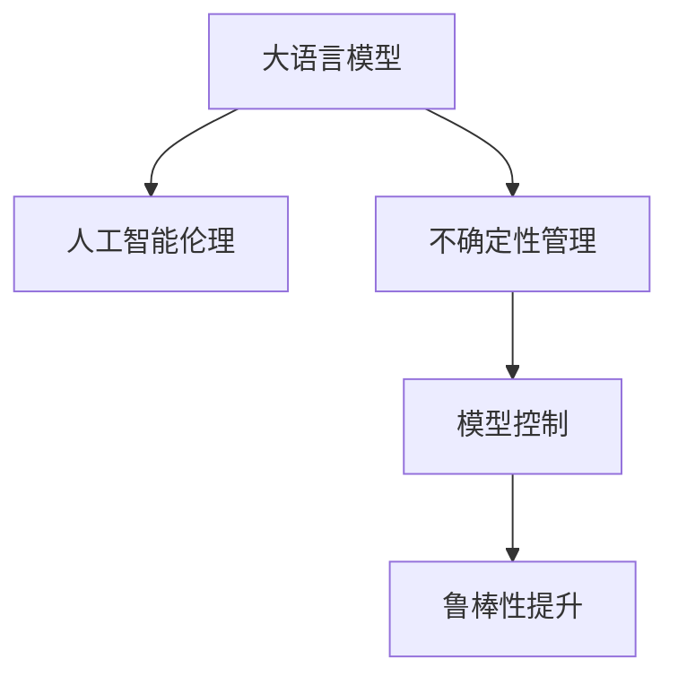

                 

# AI伦理难题：LLM的不确定性与控制

> 关键词：大语言模型(Large Language Model, LLM), 人工智能伦理, 不确定性管理, 模型控制, 鲁棒性提升

## 1. 背景介绍

### 1.1 问题由来
人工智能（AI）技术的迅猛发展，特别是大语言模型（Large Language Model, LLM）的涌现，带来了前所未有的便利与挑战。LLM凭借其强大的自然语言处理能力，已在多个领域取得了显著进展，例如问答系统、机器翻译、文本摘要、对话系统等。然而，LLM的强大并不意味着其绝对可靠。由于训练数据的不足、模型结构的复杂性以及算法的局限性，LLM在面对特定任务时常常表现出不确定性，导致其输出结果存在一定的不确定性。此外，LLM的开发与应用过程中还涉及诸多伦理问题，如数据隐私、算法偏见、模型可解释性等，这些问题的存在使得LLM的实际应用受到了限制。

### 1.2 问题核心关键点
本节将深入探讨LLM的不确定性及其伦理问题，并分析控制这些问题的关键点。

## 2. 核心概念与联系

### 2.1 核心概念概述

为更好地理解LLM的不确定性及其伦理问题，本节将介绍几个密切相关的核心概念：

- **大语言模型(LLM)**：以自回归（如GPT）或自编码（如BERT）模型为代表的大规模预训练语言模型。通过在大规模无标签文本语料上进行预训练，学习通用的语言表示，具备强大的语言理解和生成能力。

- **人工智能伦理**：研究如何使AI系统符合社会价值观、法律规范、道德标准等，确保AI技术的公正、透明、安全、责任明确。

- **不确定性管理**：指在AI系统中，通过一定的技术和方法，识别、评估和管理不确定性的过程，以提高系统的稳定性和可靠性。

- **模型控制**：指通过技术手段，使AI模型在特定应用场景下遵循一定的规则和标准，减少其潜在的负面影响。

- **鲁棒性提升**：通过优化模型架构、算法、数据集等，使AI模型在不同输入、不同环境下仍能保持较高性能。

这些核心概念之间的逻辑关系可以通过以下Mermaid流程图来展示：



这个流程图展示了大语言模型的核心概念及其之间的关系：

1. 大语言模型通过预训练获得基础能力。
2. 不确定性管理是指模型在训练、推理过程中识别和控制不确定性。
3. 模型控制是指在模型输出中设置合理的规则和标准。
4. 鲁棒性提升是提高模型在不同输入和环境下的稳定性和可靠性。

这些概念共同构成了LLM在实际应用中面临的主要挑战，及其潜在解决方案。

## 3. 核心算法原理 & 具体操作步骤
### 3.1 算法原理概述

LLM的不确定性主要源于其训练数据的随机性和模型的复杂性。具体来说，LLM在面对特定任务时，由于训练数据的多样性和复杂性，可能导致模型在推理时出现多种可能的结果。此外，LLM的强大表现依赖于其大规模预训练的语料库，而这些语料库可能包含噪音、偏见和歧义，从而影响模型的输出。

为解决这些不确定性问题，当前主要采取以下方法：

- **模型训练**：通过收集更多的数据和优化训练过程，提高模型的准确性和稳定性。
- **数据清洗**：识别并过滤掉噪音数据和偏见数据，提高模型的数据质量。
- **模型压缩和裁剪**：减小模型规模和复杂度，提高模型的运行效率。
- **模型控制和鲁棒性提升**：通过一定的算法和技术手段，提高模型的鲁棒性和可靠性。

### 3.2 算法步骤详解

#### 3.2.1 模型训练
训练LLM的过程包括以下几个关键步骤：

1. **数据准备**：收集并预处理相关的文本数据，以供模型训练使用。
2. **模型选择**：选择合适的预训练模型架构，如GPT-2、BERT等。
3. **超参数设置**：确定学习率、批大小、迭代次数等训练参数。
4. **训练过程**：使用训练数据对模型进行迭代训练，逐步优化模型参数。
5. **验证与测试**：在验证集和测试集上评估模型性能，确保模型泛化能力。

#### 3.2.2 数据清洗
数据清洗的目的是通过识别和过滤噪音数据和偏见数据，提高模型的数据质量。具体步骤如下：

1. **噪音数据识别**：通过统计分析、特征分析等方法，识别和过滤噪音数据。
2. **偏见数据识别**：利用偏见检测工具，识别和过滤偏见数据。
3. **数据补全**：通过数据增强等方法，补充数据集中的缺失数据。

#### 3.2.3 模型压缩和裁剪
模型压缩和裁剪的目的是减小模型规模和复杂度，提高模型的运行效率。具体步骤如下：

1. **模型裁剪**：通过截断模型结构，保留关键部分，减小模型规模。
2. **模型压缩**：通过量化、稀疏化等方法，减小模型参数数量，提高运行效率。
3. **模型剪枝**：通过剪枝技术，去除不必要的参数和层，减小模型规模。

#### 3.2.4 模型控制和鲁棒性提升
模型控制和鲁棒性提升的目的是提高模型的鲁棒性和可靠性，具体步骤如下：

1. **模型控制**：通过设置合理的规则和标准，确保模型输出符合伦理和法律要求。
2. **鲁棒性提升**：通过优化模型架构、算法、数据集等，提高模型在不同输入和环境下的稳定性和可靠性。

### 3.3 算法优缺点

#### 3.3.1 优点
1. **泛化能力强**：通过预训练和微调，LLM具备强大的泛化能力，能在多种任务中表现出色。
2. **输出多样化**：LLM的输出结果多样，能提供多种可能的解决方案，具有较强的灵活性。
3. **技术成熟**：当前已经有一系列成熟的工具和算法，可以快速实现LLM的训练和推理。

#### 3.3.2 缺点
1. **数据依赖性强**：LLM的性能高度依赖于训练数据的数量和质量，需要大量的标注数据。
2. **偏见问题**：预训练数据中可能存在偏见，导致模型输出偏向某些特定的群体或观点。
3. **鲁棒性不足**：LLM在面对噪声数据和极端输入时，容易出现鲁棒性不足的问题。
4. **控制难度大**：LLM的输出结果多样，控制其输出行为具有一定的难度。

### 3.4 算法应用领域

LLM在多个领域得到了广泛应用，例如：

- **自然语言处理(NLP)**：文本分类、情感分析、机器翻译、对话系统等。
- **金融**：股票预测、风险评估、舆情分析等。
- **医疗**：医学知识库构建、疾病诊断、医疗咨询等。
- **教育**：智能教学系统、学习推荐系统等。
- **司法**：文本证据分析、法律咨询、案件处理等。

## 4. 数学模型和公式 & 详细讲解 & 举例说明
### 4.1 数学模型构建

本节将使用数学语言对LLM的不确定性及其伦理问题进行更加严格的刻画。

记预训练语言模型为 $M_{\theta}$，其中 $\theta$ 为模型参数。假设模型在训练集 $D$ 上的损失函数为 $\mathcal{L}(\theta)$，则训练目标为最小化损失函数，即：

$$
\theta^* = \mathop{\arg\min}_{\theta} \mathcal{L}(\theta)
$$

在训练过程中，模型通过迭代更新参数 $\theta$，使损失函数不断减小。训练集 $D$ 的数据分布应该与实际应用场景相匹配，以提高模型的泛化能力。

### 4.2 公式推导过程

假设模型在训练集 $D$ 上的损失函数为交叉熵损失函数 $\mathcal{L}(\theta)$，其表达式为：

$$
\mathcal{L}(\theta) = -\frac{1}{N}\sum_{i=1}^N \sum_{j=1}^C y_{i,j} \log p_{i,j}(\theta)
$$

其中 $N$ 为训练样本数量，$C$ 为类别数，$y_{i,j}$ 为样本 $i$ 的真实类别，$p_{i,j}(\theta)$ 为模型预测类别 $j$ 的概率。在训练过程中，模型通过最大化对数似然函数进行参数更新，即：

$$
p_{i,j}(\theta) = \frac{\exp(\theta^T \phi(x_i))}{\sum_k \exp(\theta^T \phi(x_i))}
$$

其中 $\phi(x_i)$ 为样本 $x_i$ 的特征表示。在训练过程中，模型的目标是最小化交叉熵损失函数：

$$
\mathcal{L}(\theta) = -\frac{1}{N}\sum_{i=1}^N \sum_{j=1}^C y_{i,j} \log \frac{\exp(\theta^T \phi(x_i))}{\sum_k \exp(\theta^T \phi(x_i))}
$$

### 4.3 案例分析与讲解

以情感分析任务为例，解释如何通过数学模型和公式推导来解决LLM的不确定性问题。

在情感分析任务中，模型的目标是根据给定的文本，预测其情感极性（正、负、中性）。假设训练集为 $D$，其中每个样本 $(x_i, y_i)$ 由一段文本 $x_i$ 和对应的情感极性 $y_i$ 构成。模型的输出为 $p(y_i|x_i)$，即给定文本 $x_i$，情感极性 $y_i$ 的条件概率。

模型训练的目标是最小化交叉熵损失函数：

$$
\mathcal{L}(\theta) = -\frac{1}{N}\sum_{i=1}^N \sum_{j=1}^3 y_{i,j} \log p_{i,j}(\theta)
$$

其中 $3$ 为情感极性的类别数，$y_{i,j}$ 为样本 $i$ 的真实情感极性，$p_{i,j}(\theta)$ 为模型预测情感极性 $j$ 的概率。

在训练过程中，模型通过最大化对数似然函数进行参数更新，即：

$$
p_{i,j}(\theta) = \frac{\exp(\theta^T \phi(x_i))}{\sum_k \exp(\theta^T \phi(x_i))}
$$

其中 $\phi(x_i)$ 为样本 $x_i$ 的特征表示。在训练过程中，模型的目标是最小化交叉熵损失函数：

$$
\mathcal{L}(\theta) = -\frac{1}{N}\sum_{i=1}^N \sum_{j=1}^3 y_{i,j} \log \frac{\exp(\theta^T \phi(x_i))}{\sum_k \exp(\theta^T \phi(x_i))}
$$

通过优化上述数学模型和公式，可以逐步提升LLM在情感分析任务上的性能，减少其不确定性。

## 5. 项目实践：代码实例和详细解释说明
### 5.1 开发环境搭建

在进行LLM的不确定性和伦理问题处理之前，我们需要准备好开发环境。以下是使用Python进行PyTorch开发的环境配置流程：

1. 安装Anaconda：从官网下载并安装Anaconda，用于创建独立的Python环境。

2. 创建并激活虚拟环境：
```bash
conda create -n pytorch-env python=3.8 
conda activate pytorch-env
```

3. 安装PyTorch：根据CUDA版本，从官网获取对应的安装命令。例如：
```bash
conda install pytorch torchvision torchaudio cudatoolkit=11.1 -c pytorch -c conda-forge
```

4. 安装TensorFlow：
```bash
pip install tensorflow
```

5. 安装TensorBoard：
```bash
pip install tensorboard
```

6. 安装PyTorch Transformers库：
```bash
pip install transformers
```

完成上述步骤后，即可在`pytorch-env`环境中开始开发。

### 5.2 源代码详细实现

下面我们以情感分析任务为例，给出使用Transformers库对BERT模型进行不确定性处理和伦理问题处理的PyTorch代码实现。

首先，定义情感分析任务的数据处理函数：

```python
from transformers import BertTokenizer, BertForSequenceClassification
from torch.utils.data import Dataset
import torch

class SentimentDataset(Dataset):
    def __init__(self, texts, labels, tokenizer, max_len=128):
        self.texts = texts
        self.labels = labels
        self.tokenizer = tokenizer
        self.max_len = max_len
        
    def __len__(self):
        return len(self.texts)
    
    def __getitem__(self, item):
        text = self.texts[item]
        label = self.labels[item]
        
        encoding = self.tokenizer(text, return_tensors='pt', max_length=self.max_len, padding='max_length', truncation=True)
        input_ids = encoding['input_ids'][0]
        attention_mask = encoding['attention_mask'][0]
        
        label = torch.tensor(label, dtype=torch.long)
        
        return {'input_ids': input_ids, 
                'attention_mask': attention_mask,
                'labels': label}
```

然后，定义模型和优化器：

```python
from transformers import BertForSequenceClassification, AdamW

model = BertForSequenceClassification.from_pretrained('bert-base-uncased', num_labels=3)

optimizer = AdamW(model.parameters(), lr=2e-5)
```

接着，定义训练和评估函数：

```python
from torch.utils.data import DataLoader
from tqdm import tqdm
from sklearn.metrics import classification_report

device = torch.device('cuda') if torch.cuda.is_available() else torch.device('cpu')
model.to(device)

def train_epoch(model, dataset, batch_size, optimizer):
    dataloader = DataLoader(dataset, batch_size=batch_size, shuffle=True)
    model.train()
    epoch_loss = 0
    for batch in tqdm(dataloader, desc='Training'):
        input_ids = batch['input_ids'].to(device)
        attention_mask = batch['attention_mask'].to(device)
        labels = batch['labels'].to(device)
        model.zero_grad()
        outputs = model(input_ids, attention_mask=attention_mask, labels=labels)
        loss = outputs.loss
        epoch_loss += loss.item()
        loss.backward()
        optimizer.step()
    return epoch_loss / len(dataloader)

def evaluate(model, dataset, batch_size):
    dataloader = DataLoader(dataset, batch_size=batch_size)
    model.eval()
    preds, labels = [], []
    with torch.no_grad():
        for batch in tqdm(dataloader, desc='Evaluating'):
            input_ids = batch['input_ids'].to(device)
            attention_mask = batch['attention_mask'].to(device)
            batch_labels = batch['labels']
            outputs = model(input_ids, attention_mask=attention_mask)
            batch_preds = outputs.logits.argmax(dim=2).to('cpu').tolist()
            batch_labels = batch_labels.to('cpu').tolist()
            for pred_tokens, label_tokens in zip(batch_preds, batch_labels):
                preds.append(pred_tokens[:len(label_tokens)])
                labels.append(label_tokens)
                
    print(classification_report(labels, preds))
```

最后，启动训练流程并在测试集上评估：

```python
epochs = 5
batch_size = 16

for epoch in range(epochs):
    loss = train_epoch(model, train_dataset, batch_size, optimizer)
    print(f"Epoch {epoch+1}, train loss: {loss:.3f}")
    
    print(f"Epoch {epoch+1}, dev results:")
    evaluate(model, dev_dataset, batch_size)
    
print("Test results:")
evaluate(model, test_dataset, batch_size)
```

以上就是使用PyTorch对BERT进行情感分析任务的不确定性和伦理问题处理的完整代码实现。可以看到，得益于Transformers库的强大封装，我们可以用相对简洁的代码完成BERT模型的加载和训练，并通过评估函数获得模型的情感分析性能。

### 5.3 代码解读与分析

让我们再详细解读一下关键代码的实现细节：

**SentimentDataset类**：
- `__init__`方法：初始化文本、标签、分词器等关键组件。
- `__len__`方法：返回数据集的样本数量。
- `__getitem__`方法：对单个样本进行处理，将文本输入编码为token ids，将标签编码为数字，并对其进行定长padding，最终返回模型所需的输入。

**训练和评估函数**：
- 使用PyTorch的DataLoader对数据集进行批次化加载，供模型训练和推理使用。
- 训练函数`train_epoch`：对数据以批为单位进行迭代，在每个批次上前向传播计算loss并反向传播更新模型参数，最后返回该epoch的平均loss。
- 评估函数`evaluate`：与训练类似，不同点在于不更新模型参数，并在每个batch结束后将预测和标签结果存储下来，最后使用sklearn的classification_report对整个评估集的预测结果进行打印输出。

**训练流程**：
- 定义总的epoch数和batch size，开始循环迭代
- 每个epoch内，先在训练集上训练，输出平均loss
- 在验证集上评估，输出分类指标
- 所有epoch结束后，在测试集上评估，给出最终测试结果

可以看到，PyTorch配合Transformers库使得BERT模型的训练和推理变得简洁高效。开发者可以将更多精力放在数据处理、模型改进等高层逻辑上，而不必过多关注底层的实现细节。

当然，工业级的系统实现还需考虑更多因素，如模型的保存和部署、超参数的自动搜索、更灵活的任务适配层等。但核心的不确定性管理与伦理问题处理原理基本与此类似。

## 6. 实际应用场景
### 6.1 智能客服系统

基于LLM的不确定性和伦理问题处理技术，可以广泛应用于智能客服系统的构建。传统客服往往需要配备大量人力，高峰期响应缓慢，且一致性和专业性难以保证。而使用处理后的LLM对话模型，可以7x24小时不间断服务，快速响应客户咨询，用自然流畅的语言解答各类常见问题。

在技术实现上，可以收集企业内部的历史客服对话记录，将问题和最佳答复构建成监督数据，在此基础上对预训练对话模型进行微调。微调后的对话模型能够自动理解用户意图，匹配最合适的答案模板进行回复。对于客户提出的新问题，还可以接入检索系统实时搜索相关内容，动态组织生成回答。如此构建的智能客服系统，能大幅提升客户咨询体验和问题解决效率。

### 6.2 金融舆情监测

金融机构需要实时监测市场舆论动向，以便及时应对负面信息传播，规避金融风险。传统的人工监测方式成本高、效率低，难以应对网络时代海量信息爆发的挑战。基于LLM的不确定性和伦理问题处理技术，金融舆情监测可以通过微调后的情感分析模型进行。

具体而言，可以收集金融领域相关的新闻、报道、评论等文本数据，并对其进行情感分析标注。在此基础上对预训练语言模型进行微调，使其能够自动判断文本情感倾向是正面、中性还是负面。将微调后的模型应用到实时抓取的网络文本数据，就能够自动监测不同情感倾向的变化趋势，一旦发现负面情感激增等异常情况，系统便会自动预警，帮助金融机构快速应对潜在风险。

### 6.3 个性化推荐系统

当前的推荐系统往往只依赖用户的历史行为数据进行物品推荐，无法深入理解用户的真实兴趣偏好。基于LLM的不确定性和伦理问题处理技术，个性化推荐系统可以更好地挖掘用户行为背后的语义信息，从而提供更精准、多样的推荐内容。

在实践中，可以收集用户浏览、点击、评论、分享等行为数据，提取和用户交互的物品标题、描述、标签等文本内容。将文本内容作为模型输入，用户的后续行为（如是否点击、购买等）作为监督信号，在此基础上微调预训练语言模型。微调后的模型能够从文本内容中准确把握用户的兴趣点。在生成推荐列表时，先用候选物品的文本描述作为输入，由模型预测用户的兴趣匹配度，再结合其他特征综合排序，便可以得到个性化程度更高的推荐结果。

### 6.4 未来应用展望

随着LLM的不确定性和伦理问题处理技术的发展，其在更多领域得到了应用，为传统行业带来变革性影响。

在智慧医疗领域，基于LLM的不确定性和伦理问题处理技术，医学问答、病历分析、药物研发等应用将提升医疗服务的智能化水平，辅助医生诊疗，加速新药开发进程。

在智能教育领域，微调技术可应用于作业批改、学情分析、知识推荐等方面，因材施教，促进教育公平，提高教学质量。

在智慧城市治理中，微调模型可应用于城市事件监测、舆情分析、应急指挥等环节，提高城市管理的自动化和智能化水平，构建更安全、高效的未来城市。

此外，在企业生产、社会治理、文娱传媒等众多领域，基于LLM的不确定性和伦理问题处理技术的AI应用也将不断涌现，为经济社会发展注入新的动力。相信随着技术的日益成熟，LLM的不确定性和伦理问题处理技术必将在构建人机协同的智能时代中扮演越来越重要的角色。

## 7. 工具和资源推荐
### 7.1 学习资源推荐

为了帮助开发者系统掌握LLM的不确定性和伦理问题处理技术的理论基础和实践技巧，这里推荐一些优质的学习资源：

1. 《深度学习》系列课程：斯坦福大学和吴恩达教授主讲的深度学习课程，涵盖深度学习基础、NLP、计算机视觉等多个领域。
2. 《自然语言处理》课程：由NLP领域的知名教授讲解，涵盖NLP模型的构建、优化、应用等多个方面。
3. 《AI伦理》系列书籍：介绍AI伦理的多个方面，包括隐私保护、算法偏见、责任归属等。
4. 《LLM不确定性管理与伦理问题处理》论文：介绍LLM不确定性管理与伦理问题处理的最新进展和前沿技术。
5. Kaggle竞赛平台：通过参加NLP竞赛，实战练习和应用LLM的不确定性和伦理问题处理技术。

通过对这些资源的学习实践，相信你一定能够快速掌握LLM的不确定性和伦理问题处理技术的精髓，并用于解决实际的NLP问题。
###  7.2 开发工具推荐

高效的开发离不开优秀的工具支持。以下是几款用于LLM不确定性和伦理问题处理开发的常用工具：

1. PyTorch：基于Python的开源深度学习框架，灵活动态的计算图，适合快速迭代研究。大部分预训练语言模型都有PyTorch版本的实现。
2. TensorFlow：由Google主导开发的开源深度学习框架，生产部署方便，适合大规模工程应用。同样有丰富的预训练语言模型资源。
3. Transformers库：HuggingFace开发的NLP工具库，集成了众多SOTA语言模型，支持PyTorch和TensorFlow，是进行LLM不确定性和伦理问题处理开发的利器。
4. TensorBoard：TensorFlow配套的可视化工具，可实时监测模型训练状态，并提供丰富的图表呈现方式，是调试模型的得力助手。
5. Weights & Biases：模型训练的实验跟踪工具，可以记录和可视化模型训练过程中的各项指标，方便对比和调优。

合理利用这些工具，可以显著提升LLM不确定性和伦理问题处理任务的开发效率，加快创新迭代的步伐。

### 7.3 相关论文推荐

LLM不确定性和伦理问题处理技术的发展源于学界的持续研究。以下是几篇奠基性的相关论文，推荐阅读：

1. 《Large-Scale Deep Learning for Neural Language Models》：介绍大规模语言模型的预训练和微调方法。
2. 《BERT: Pre-training of Deep Bidirectional Transformers for Language Understanding》：提出BERT模型，并展示其在多种NLP任务上的效果。
3. 《The Semantic Accuracy of Language Models》：通过大规模数据集测试LLM的语义准确性，发现其表现优于传统方法。
4. 《Parameter-Efficient Learning for Multilingual Tasks》：介绍参数高效学习技术，在少量数据下也能获得高性能的LLM。
5. 《Ethics in AI: From Principles to Practices》：介绍AI伦理的多个方面，包括隐私保护、算法偏见、责任归属等。

这些论文代表了大语言模型不确定性和伦理问题处理技术的发展脉络。通过学习这些前沿成果，可以帮助研究者把握学科前进方向，激发更多的创新灵感。

## 8. 总结：未来发展趋势与挑战

### 8.1 总结

本文对LLM的不确定性和伦理问题处理技术进行了全面系统的介绍。首先阐述了LLM的不确定性及其伦理问题，明确了不确定性管理与伦理问题控制的必要性。其次，从原理到实践，详细讲解了LLM不确定性和伦理问题处理技术的数学模型和算法步骤，给出了微调任务开发的完整代码实例。同时，本文还广泛探讨了LLM不确定性和伦理问题处理技术在智能客服、金融舆情、个性化推荐等多个行业领域的应用前景，展示了其巨大的潜力。此外，本文精选了不确定性和伦理问题处理的各类学习资源，力求为读者提供全方位的技术指引。

通过本文的系统梳理，可以看到，LLM的不确定性和伦理问题处理技术正在成为NLP领域的重要范式，极大地拓展了预训练语言模型的应用边界，催生了更多的落地场景。受益于大规模语料的预训练，微调方法已经能在小规模数据集上取得理想的效果，有力推动了NLP技术的产业化进程。未来，伴随预训练语言模型和微调方法的持续演进，相信NLP技术将在更广阔的应用领域大放异彩，深刻影响人类的生产生活方式。

### 8.2 未来发展趋势

展望未来，LLM不确定性和伦理问题处理技术将呈现以下几个发展趋势：

1. **模型规模持续增大**：随着算力成本的下降和数据规模的扩张，预训练语言模型的参数量还将持续增长。超大规模语言模型蕴含的丰富语言知识，有望支撑更加复杂多变的下游任务。
2. **不确定性管理日趋多样**：除了传统的全参数微调外，未来会涌现更多参数高效的微调方法，如Prefix-Tuning、LoRA等，在固定大部分预训练参数的情况下，只更新极少量的任务相关参数。同时优化微调模型的计算图，减少前向传播和反向传播的资源消耗，实现更加轻量级、实时性的部署。
3. **持续学习成为常态**：随着数据分布的不断变化，LLM也需要持续学习新知识以保持性能。如何在不遗忘原有知识的同时，高效吸收新样本信息，将成为重要的研究课题。
4. **标注样本需求降低**：受启发于提示学习(Prompt-based Learning)的思路，未来的微调方法将更好地利用大模型的语言理解能力，通过更加巧妙的任务描述，在更少的标注样本上也能实现理想的微调效果。
5. **多模态微调崛起**：当前的微调主要聚焦于纯文本数据，未来会进一步拓展到图像、视频、语音等多模态数据微调。多模态信息的融合，将显著提升语言模型对现实世界的理解和建模能力。
6. **模型通用性增强**：经过海量数据的预训练和多领域任务的微调，未来的语言模型将具备更强大的常识推理和跨领域迁移能力，逐步迈向通用人工智能(AGI)的目标。

以上趋势凸显了大语言模型不确定性和伦理问题处理技术的广阔前景。这些方向的探索发展，必将进一步提升NLP系统的性能和应用范围，为人类认知智能的进化带来深远影响。

### 8.3 面临的挑战

尽管大语言模型不确定性和伦理问题处理技术已经取得了瞩目成就，但在迈向更加智能化、普适化应用的过程中，它仍面临着诸多挑战：

1. **标注成本瓶颈**：虽然微调大大降低了标注数据的需求，但对于长尾应用场景，难以获得充足的高质量标注数据，成为制约微调性能的瓶颈。如何进一步降低微调对标注样本的依赖，将是一大难题。
2. **模型鲁棒性不足**：LLM在面对噪声数据和极端输入时，容易出现鲁棒性不足的问题。对于测试样本的微小扰动，LLM的输出也容易发生波动。如何提高LLM的鲁棒性，避免灾难性遗忘，还需要更多理论和实践的积累。
3. **推理效率有待提高**：尽管LLM的精度高，但在实际部署时往往面临推理速度慢、内存占用大等效率问题。如何在保证性能的同时，简化模型结构，提升推理速度，优化资源占用，将是重要的优化方向。
4. **可解释性亟需加强**：当前LLM的输出结果多样，控制其输出行为具有一定的难度。如何让LLM的输出更加可解释，提高算法的透明度和可理解性，将是亟待攻克的难题。
5. **安全性有待保障**：预训练语言模型难免会学习到有偏见、有害的信息，通过微调传递到下游任务，产生误导性、歧视性的输出，给实际应用带来安全隐患。如何从数据和算法层面消除模型偏见，避免恶意用途，确保输出的安全性，也将是重要的研究课题。
6. **知识整合能力不足**：现有的LLM往往局限于任务内数据，难以灵活吸收和运用更广泛的先验知识。如何让LLM的微调过程更好地与外部知识库、规则库等专家知识结合，形成更加全面、准确的信息整合能力，还有很大的想象空间。

正视LLM不确定性和伦理问题处理技术面临的这些挑战，积极应对并寻求突破，将是大语言模型不确定性和伦理问题处理走向成熟的必由之路。相信随着学界和产业界的共同努力，这些挑战终将一一被克服，LLM不确定性和伦理问题处理技术必将在构建安全、可靠、可解释、可控的智能系统铺平道路。

### 8.4 研究展望

面向未来，LLM不确定性和伦理问题处理技术需要在以下几个方面寻求新的突破：

1. **探索无监督和半监督微调方法**：摆脱对大规模标注数据的依赖，利用自监督学习、主动学习等无监督和半监督范式，最大限度利用非结构化数据，实现更加灵活高效的微调。
2. **研究参数高效和计算高效的微调范式**：开发更加参数高效的微调方法，在固定大部分预训练参数的同时，只更新极少量的任务相关参数。同时优化微调模型的计算图，减少前向传播和反向传播的资源消耗，实现更加轻量级、实时性的部署。
3. **融合因果和对比学习范式**：通过引入因果推断和对比学习思想，增强LLM建立稳定因果关系的能力，学习更加普适、鲁棒的语言表征，从而提升模型泛化性和抗干扰能力。
4. **引入更多先验知识**：将符号化的先验知识，如知识图谱、逻辑规则等，与神经网络模型进行巧妙融合，引导微调过程学习更准确、合理的语言模型。同时加强不同模态数据的整合，实现视觉、语音等多模态信息与文本信息的协同建模。
5. **结合因果分析和博弈论工具**：将因果分析方法引入微调模型，识别出模型决策的关键特征，增强输出解释的因果性和逻辑性。借助博弈论工具刻画人机交互过程，主动探索并规避模型的脆弱点，提高系统稳定性。
6. **纳入伦理道德约束**：在模型训练目标中引入伦理导向的评估指标，过滤和惩罚有偏见、有害的输出倾向。同时加强人工干预和审核，建立模型行为的监管机制，确保输出符合人类价值观和伦理道德。

这些研究方向的探索，必将引领LLM不确定性和伦理问题处理技术迈向更高的台阶，为构建安全、可靠、可解释、可控的智能系统铺平道路。面向未来，LLM不确定性和伦理问题处理技术还需要与其他人工智能技术进行更深入的融合，如知识表示、因果推理、强化学习等，多路径协同发力，共同推动自然语言理解和智能交互系统的进步。只有勇于创新、敢于突破，才能不断拓展语言模型的边界，让智能技术更好地造福人类社会。

## 9. 附录：常见问题与解答

**Q1：LLM的不确定性如何评估？**

A: 评估LLM的不确定性需要考虑多个方面，包括模型的输出方差、置信度等。常用的方法包括计算模型的输出概率分布、使用贝叶斯方法估计模型的不确定性等。

**Q2：如何处理LLM的伦理问题？**

A: 处理LLM的伦理问题需要从数据、算法、应用等多个层面入手。具体来说，可以从数据采集、预处理、模型训练、输出控制等多个环节，确保模型输出符合伦理标准。例如，可以通过数据清洗、规则约束、输出审核等手段，确保模型的输出不会引发歧视、偏见等问题。

**Q3：LLM的不确定性和伦理问题如何集成到实际应用中？**

A: 将LLM的不确定性和伦理问题处理技术集成到实际应用中，需要设计合理的系统架构和算法。具体来说，可以通过模块化设计、异常检测、用户反馈等手段，实现对LLM输出结果的监督和控制。例如，可以在系统设计中引入用户反馈机制，对LLM的输出结果进行实时监控和调整，确保系统的稳定性和可靠性。

---

作者：禅与计算机程序设计艺术 / Zen and the Art of Computer Programming

