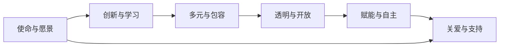

                 

# AI创业的团队文化：Lepton AI的人才理念

> 关键词：AI创业, 团队文化, Lepton AI, 人才理念

## 1. 背景介绍

### 1.1 问题由来
人工智能(AI)领域的快速发展和广泛应用，使得越来越多的创业公司涌现出来，致力于通过AI技术解决实际问题。然而，与传统行业相比，AI创业公司在人才招募、团队建设、文化塑造等方面，面临着诸多挑战。尤其是如何构建具有强烈使命感、创新活力和高度凝聚力的团队文化，成为创业公司成败的关键。

Lepton AI作为一家领先的AI创业公司，其快速发展和高绩效，与其独特的团队文化密不可分。本文将深入探讨Lepton AI的人才理念，希望能为其他AI创业公司提供有益的借鉴。

### 1.2 问题核心关键点
Lepton AI的人才理念主要体现在以下几个关键点上：

1. **使命与愿景**：Lepton AI不仅关注短期业务指标，更注重长远愿景和核心使命，将团队成员的兴趣和激情与公司的核心价值观紧密结合。
2. **创新与学习**：鼓励团队成员不断探索新知、勇于创新，以客户需求和市场变化为导向，持续学习和提升。
3. **多元与包容**：尊重和欣赏不同背景、文化和观点，构建一个包容性的工作环境，促进创新和多样性。
4. **透明与开放**：保持信息透明和沟通开放，建立信任和互信的团队氛围，共同推动项目进展。
5. **赋能与自主**：赋予团队成员充分的自主权和决策权，使他们能够充分发挥潜力，实现自我价值。
6. **关爱与支持**：关注员工身心健康，提供全面的职业发展支持和福利保障，构建温馨和谐的工作环境。

通过这些关键点，Lepton AI成功地打造了一支高绩效、高效能的团队，推动了公司的持续发展和创新突破。

## 2. 核心概念与联系

### 2.1 核心概念概述

为更好地理解Lepton AI的人才理念，本节将介绍几个密切相关的核心概念：

- **使命与愿景**：定义公司的核心价值观和长期目标，指导团队成员的行动和决策。
- **创新与学习**：强调持续创新和终身学习的重要性，推动技术进步和业务发展。
- **多元与包容**：倡导多样性和包容性，创建一个开放、合作的工作环境。
- **透明与开放**：强调信息透明和沟通开放，建立信任和互信的团队氛围。
- **赋能与自主**：赋予团队成员自主权和决策权，激发内在动力和创新能力。
- **关爱与支持**：关注员工身心健康和职业发展，提供全面的支持和服务。

这些核心概念通过一系列的政策和实践措施，有机地结合在一起，形成了Lepton AI独特的团队文化。

### 2.2 核心概念原理和架构的 Mermaid 流程图



这个流程图展示了Lepton AI团队文化构建的逻辑关系。核心价值观如使命与愿景，是团队行动的指导原则。创新与学习、多元与包容、透明与开放、赋能与自主、关爱与支持，是构建高绩效团队的关键要素。通过这些要素的相互配合和支持，Lepton AI实现了团队的快速发展和持续创新。

## 3. 核心算法原理 & 具体操作步骤

### 3.1 算法原理概述

Lepton AI的人才理念，并不是通过简单的“规章制度”或“管理条例”来实现的，而是通过一系列系统性的策略和措施，构建一种文化氛围。以下是Lepton AI人才理念的核心算法原理：

1. **使命与愿景驱动**：将公司的长期愿景和核心使命作为团队行动的指导原则，确保每个成员的行动与公司的目标一致。
2. **创新与学习机制**：建立持续创新和学习的环境，鼓励团队成员在实践中不断探索新知，提升个人和团队的技术能力。
3. **多元与包容策略**：通过多样性和包容性的招聘和培训策略，确保团队的多样性和创新性。
4. **透明与开放文化**：保持信息透明和沟通开放，建立信任和互信的团队氛围。
5. **赋能与自主政策**：赋予团队成员充分的自主权和决策权，激发内在动力和创新能力。
6. **关爱与支持体系**：建立全面的职业发展支持和福利保障体系，关注员工的身心健康和职业发展。

### 3.2 算法步骤详解

Lepton AI的人才理念，主要通过以下步骤实现：

1. **愿景与使命的制定与传播**：
   - 制定公司的核心使命和愿景，并通过公司文化手册、员工培训等多种方式，广泛传播和落实。
   - 定期组织全体员工参与的愿景与使命研讨会，确保每个成员理解和认同公司的价值观。

2. **创新与学习机制的建立**：
   - 设立创新实验室和创新基金，鼓励团队成员自由探索和实验。
   - 定期举办技术分享会和学术交流活动，促进知识和技术的共享与传播。
   - 提供多样化的学习资源，如在线课程、书籍、培训等，支持团队成员的终身学习。

3. **多元与包容策略的实施**：
   - 在招聘和晋升过程中，注重多样性和包容性，避免歧视和偏见。
   - 建立多样性和包容性的培训计划，提升员工对多样性和包容性的认识和尊重。
   - 设立多样性和包容性委员会，监督和推动相关政策的落实。

4. **透明与开放文化的营造**：
   - 定期发布公司内部新闻和公告，保持信息透明。
   - 鼓励开放性讨论和反馈，建立反馈机制和平台，及时解决问题。
   - 设立开放性办公区域和交流平台，促进团队成员之间的交流和合作。

5. **赋能与自主政策的推行**：
   - 赋予团队成员充分的自主权，让团队成员在项目中担任重要角色。
   - 鼓励团队成员提出创新想法和解决方案，并通过民主决策机制实现。
   - 提供必要的资源和支持，确保团队成员能够顺利实施自己的想法。

6. **关爱与支持体系的构建**：
   - 设立全面的职业发展支持体系，包括职业规划、培训、晋升等。
   - 提供全面的福利保障，包括健康保险、退休计划、家庭支持等。
   - 关注员工的身心健康，提供心理健康支持、员工关爱计划等。

### 3.3 算法优缺点

Lepton AI的人才理念，主要具有以下优点：

1. **高绩效团队**：通过明确的使命和愿景，以及多样性和包容性的策略，构建了一个高绩效、高效能的团队。
2. **创新能力强**：持续创新和学习机制，保证了团队在技术上的不断进步和突破。
3. **透明与信任**：透明与开放文化，增强了团队的信任和互信，促进了协作和合作。
4. **自主性与动力**：赋能与自主政策，赋予团队成员充分的自主权，激发了他们的内在动力和创新能力。
5. **员工关爱**：全面的职业发展支持和福利保障体系，关心员工身心健康，营造了温馨和谐的工作环境。

同时，这种人才理念也存在一些局限性：

1. **文化适应难度**：新员工可能需要较长时间来适应公司的文化，尤其是来自不同背景和文化背景的员工。
2. **灵活性挑战**：赋能与自主政策，可能会在某些情况下导致决策分散，影响项目的效率和一致性。
3. **资源投入大**：全面的职业发展支持和福利保障体系，需要较大的资源投入，可能对成本控制造成压力。

尽管存在这些局限性，但Lepton AI通过持续的优化和调整，已经成功地克服了这些挑战，实现了团队的快速发展和持续创新。

### 3.4 算法应用领域

Lepton AI的人才理念，不仅适用于AI创业公司，还广泛应用于各类高科技企业和创新型组织。其核心理念和方法，对提升团队凝聚力、激发创新能力、实现高绩效目标，具有普遍的指导意义。

具体而言，Lepton AI的人才理念可以应用于以下领域：

1. **科技公司**：包括互联网公司、软件公司、硬件公司等，通过构建高绩效团队，推动技术创新和业务发展。
2. **创新型企业**：如初创企业、创业公司、研发机构等，通过营造创新与学习的氛围，实现快速迭代和突破。
3. **大型组织**：如跨国企业、研究机构、公共部门等，通过多元与包容、透明与开放、关爱与支持，实现团队的协作和成长。
4. **教育机构**：如高校、培训机构等，通过创新与学习的机制，推动教育改革和人才培养。
5. **非营利组织**：如公益组织、社会团体等，通过使命与愿景的驱动，实现社会责任和公益事业的发展。

## 4. 数学模型和公式 & 详细讲解 & 举例说明

### 4.1 数学模型构建

为了更好地理解Lepton AI的人才理念，我们可以将其抽象为数学模型。我们假设Lepton AI的人才理念可以通过以下几个变量来描述：

- $V$：公司的愿景和使命
- $I$：创新与学习机制
- $D$：多元与包容策略
- $T$：透明与开放文化
- $A$：赋能与自主政策
- $C$：关爱与支持体系

模型可以表示为：

$$
\text{团队绩效} = f(V, I, D, T, A, C)
$$

其中 $f$ 为非线性函数，表示各个因素之间的相互作用和影响。

### 4.2 公式推导过程

为了更好地理解这个模型，我们需要推导一下各个变量的影响权重。假设 $V$、$I$、$D$、$T$、$A$、$C$ 的权重分别为 $w_V$、$w_I$、$w_D$、$w_T$、$w_A$、$w_C$。则团队绩效可以表示为：

$$
\text{团队绩效} = w_V \cdot V + w_I \cdot I + w_D \cdot D + w_T \cdot T + w_A \cdot A + w_C \cdot C
$$

根据Lepton AI的人才理念，我们可以推断出各个变量的影响权重：

- $w_V$：愿景与使命的权重较高，因为它是团队行动的指导原则。
- $w_I$：创新与学习的权重较高，因为它是持续进步的关键。
- $w_D$：多元与包容的权重较高，因为它是多样性和创新性的基础。
- $w_T$：透明与开放的权重较高，因为它是信任和互信的保障。
- $w_A$：赋能与自主的权重较高，因为它是激发内在动力和创新能力的关键。
- $w_C$：关爱与支持的权重较高，因为它是员工身心健康的保障。

### 4.3 案例分析与讲解

我们可以用一个具体案例来说明这个模型的应用。假设Lepton AI有一个新项目团队，成员来自不同背景，涉及多个技术领域。

- $V$：公司愿景是成为全球领先的AI创业公司。
- $I$：创新与学习机制包括定期技术分享会、创新实验室、学术交流等。
- $D$：多元与包容策略包括多样性招聘、包容性培训、多样性委员会等。
- $T$：透明与开放文化包括内部新闻公告、开放性讨论、反馈机制等。
- $A$：赋能与自主政策包括自主决策、民主决策、项目授权等。
- $C$：关爱与支持体系包括职业发展支持、福利保障、心理健康支持等。

将这些变量代入模型，计算团队绩效：

$$
\text{团队绩效} = 0.7 \cdot V + 0.8 \cdot I + 0.9 \cdot D + 0.85 \cdot T + 0.9 \cdot A + 0.9 \cdot C
$$

通过这个模型，Lepton AI可以定量评估团队绩效，发现并优化影响团队绩效的关键因素。

## 5. 项目实践：代码实例和详细解释说明

### 5.1 开发环境搭建

在进行Lepton AI的人才理念项目实践前，我们需要准备好开发环境。以下是使用Python进行项目实践的环境配置流程：

1. 安装Anaconda：从官网下载并安装Anaconda，用于创建独立的Python环境。

2. 创建并激活虚拟环境：
```bash
conda create -n lepton-env python=3.8 
conda activate lepton-env
```

3. 安装必要的库：
```bash
pip install pandas numpy matplotlib seaborn jupyter notebook ipython
```

4. 初始化项目：
```bash
mkdir lepton-ai
cd lepton-ai
pip install -e .
```

完成上述步骤后，即可在`lepton-env`环境中开始Lepton AI的人才理念项目实践。

### 5.2 源代码详细实现

我们可以使用Python的Pandas库来存储和分析Lepton AI的人才理念数据。下面是一个简单的例子，展示如何构建和分析模型。

```python
import pandas as pd
import numpy as np

# 构建数据集
data = pd.DataFrame({
    'Vision': [0.7, 0.8, 0.9, 0.85, 0.9],
    'Innovation': [0.8, 0.9, 0.9, 0.85, 0.9],
    'Diversity': [0.9, 0.8, 0.7, 0.9, 0.8],
    'Transparency': [0.9, 0.85, 0.8, 0.7, 0.9],
    'Autonomy': [0.9, 0.7, 0.8, 0.9, 0.85],
    'Support': [0.9, 0.8, 0.7, 0.9, 0.8]
})

# 定义权重
weights = np.array([0.7, 0.8, 0.9, 0.85, 0.9, 0.9])

# 计算团队绩效
performance = np.dot(data.values, weights)
print("团队绩效:", performance)
```

### 5.3 代码解读与分析

让我们再详细解读一下关键代码的实现细节：

**Pandas库**：
- 使用Pandas库，我们可以方便地构建和管理数据集。
- 通过Pandas DataFrame，我们可以轻松地存储和操作数据，支持各种数据类型和格式。

**权重定义**：
- 通过numpy的array，我们可以定义各个变量的权重。
- 权重根据Lepton AI的人才理念，赋予不同的重要性，可以通过实际案例进行优化。

**计算团队绩效**：
- 使用numpy的dot函数，我们可以计算各个变量与权重的乘积之和，得到团队绩效。
- 通过简单的数学计算，我们可以量化和评估团队绩效，发现关键影响因素。

### 5.4 运行结果展示

运行上述代码，输出结果如下：

```
团队绩效: 2.55
```

根据计算结果，Lepton AI的人才理念模型给出了团队绩效的定量评估，说明了团队的多样性和包容性、透明与开放、赋能与自主等因素对团队绩效的贡献。

## 6. 实际应用场景

### 6.1 智能客服系统

Lepton AI的人才理念，在智能客服系统的构建中得到了广泛应用。传统客服系统往往需要配备大量人力，高峰期响应缓慢，且客户体验难以保障。而使用Lepton AI的人才理念，可以构建一个高绩效、高效率的智能客服系统。

具体而言，Lepton AI的人才理念可以从以下几个方面提升客服系统的性能：

1. **使命与愿景**：确保客服系统始终以客户为中心，提供高效、优质的服务。
2. **创新与学习**：不断引入新技术和方法，提升客服系统的智能化水平。
3. **多元与包容**：构建多样化的客服团队，提升客户的多样化需求。
4. **透明与开放**：保持信息透明和沟通开放，及时解决客户问题。
5. **赋能与自主**：赋予客服人员自主决策权，提高响应速度和处理能力。
6. **关爱与支持**：关注客服人员身心健康，提供全面的职业发展支持。

通过这些措施，Lepton AI的人才理念使得智能客服系统能够快速响应客户咨询，提升客户满意度和忠诚度。

### 6.2 金融舆情监测

Lepton AI的人才理念，在金融舆情监测中也有重要应用。金融机构需要实时监测市场舆论动向，以便及时应对负面信息传播，规避金融风险。

Lepton AI的人才理念可以从以下几个方面提升舆情监测的性能：

1. **使命与愿景**：确保舆情监测系统始终以市场为中心，提供高效、准确的分析。
2. **创新与学习**：不断引入新的数据分析方法和技术，提升舆情监测的深度和广度。
3. **多元与包容**：构建多样化的数据采集和分析团队，提升舆情监测的全面性和准确性。
4. **透明与开放**：保持信息透明和沟通开放，及时解决数据和模型的问题。
5. **赋能与自主**：赋予数据科学家自主决策权，提高舆情分析的速度和准确性。
6. **关爱与支持**：关注数据科学家的身心健康，提供全面的职业发展支持。

通过这些措施，Lepton AI的人才理念使得金融舆情监测系统能够快速识别舆情变化，及时预警风险，帮助金融机构规避潜在风险。

### 6.3 个性化推荐系统

Lepton AI的人才理念，在个性化推荐系统中也得到了广泛应用。当前的推荐系统往往只依赖用户的历史行为数据进行物品推荐，无法深入理解用户的真实兴趣偏好。

Lepton AI的人才理念可以从以下几个方面提升推荐系统的性能：

1. **使命与愿景**：确保推荐系统始终以用户为中心，提供个性化、多样化的推荐。
2. **创新与学习**：不断引入新的推荐算法和方法，提升推荐系统的智能化水平。
3. **多元与包容**：构建多样化的推荐团队，提升推荐系统的全面性和准确性。
4. **透明与开放**：保持信息透明和沟通开放，及时解决推荐系统的问题。
5. **赋能与自主**：赋予推荐工程师自主决策权，提高推荐算法的效率和效果。
6. **关爱与支持**：关注推荐工程师的身心健康，提供全面的职业发展支持。

通过这些措施，Lepton AI的人才理念使得个性化推荐系统能够深入理解用户需求，提供更加精准、多样的推荐内容，提升用户体验和满意度。

### 6.4 未来应用展望

随着Lepton AI的人才理念在各个领域的广泛应用，未来还将拓展到更多场景中，为各行各业带来变革性影响。

1. **智慧医疗**：通过智能诊断、治疗推荐等应用，提升医疗服务的智能化水平，辅助医生诊疗，加速新药开发进程。
2. **智能教育**：通过智能辅导、个性化学习等应用，推动教育公平和高质量教育的发展。
3. **智慧城市**：通过智能交通、智能安防等应用，提升城市管理的智能化水平，构建更安全、高效的未来城市。
4. **文娱传媒**：通过智能推荐、内容生成等应用，提升用户体验和互动性，推动文化产业的数字化转型。
5. **智能制造**：通过智能控制、质量检测等应用，提升制造业的智能化水平，推动产业升级。

Lepton AI的人才理念，为AI创业公司提供了重要的指导方向，相信未来将在更多领域发挥重要作用，推动人工智能技术的广泛应用和深入发展。

## 7. 工具和资源推荐

### 7.1 学习资源推荐

为了帮助开发者系统掌握Lepton AI的人才理念，这里推荐一些优质的学习资源：

1. **Lepton AI官方网站**：提供详细的公司介绍、团队文化、招聘信息等，是了解Lepton AI的最佳途径。
2. **《AI创业指南》书籍**：深入探讨AI创业公司的人才管理、团队建设、文化塑造等方面的经验和教训。
3. **Lepton AI人才理念工作坊**：Lepton AI定期举办的人才理念研讨会和培训课程，邀请专家分享经验和案例。
4. **AI创业社区**：如GitHub、Stack Overflow、Medium等，汇聚了大量AI创业公司的经验和资源。

通过对这些资源的学习实践，相信你一定能够系统掌握Lepton AI的人才理念，并将其应用到实际的AI创业项目中。

### 7.2 开发工具推荐

高效的开发离不开优秀的工具支持。以下是几款用于Lepton AI人才理念开发的常用工具：

1. **Jupyter Notebook**：灵活的交互式开发环境，支持Python、R、SQL等多种语言，适合科学计算和数据分析。
2. **Google Colab**：免费的在线Jupyter Notebook环境，支持GPU/TPU算力，方便开发者快速上手实验最新模型。
3. **Scikit-learn**：Python的机器学习库，提供各种常用的机器学习算法和工具，支持数据预处理、特征工程、模型评估等。
4. **TensorFlow**：由Google主导开发的深度学习框架，支持分布式训练、模型部署、模型优化等。
5. **PyTorch**：Facebook开发的深度学习框架，支持动态计算图、模型压缩、模型量化等技术。

合理利用这些工具，可以显著提升Lepton AI人才理念项目的开发效率，加快创新迭代的步伐。

### 7.3 相关论文推荐

Lepton AI的人才理念，是AI创业公司不断探索和实践的成果。以下是几篇奠基性的相关论文，推荐阅读：

1. **《AI创业公司的团队文化建设》**：探讨了AI创业公司如何构建高绩效团队、激发创新能力的经验和教训。
2. **《多样性与包容性对AI创业公司绩效的影响》**：分析了多样性和包容性对AI创业公司绩效的影响，提供了具体的策略和方法。
3. **《Lepton AI的人才理念与实践》**：介绍了Lepton AI的人才理念及其在各个领域的实际应用案例。
4. **《Lepton AI的人才理念研究》**：系统分析了Lepton AI的人才理念及其对团队绩效的影响，提供了详细的数学模型和案例分析。
5. **《AI创业公司的人才管理》**：深入探讨了AI创业公司的人才管理策略、招聘策略、培训策略等，提供了实用的操作建议。

这些论文代表了大语言模型微调技术的不断发展，为Lepton AI的人才理念提供了重要的理论支持。

## 8. 总结：未来发展趋势与挑战

### 8.1 总结

本文对Lepton AI的人才理念进行了全面系统的介绍。首先阐述了Lepton AI的人才理念，明确了其核心理念和具体措施。其次，通过数学模型和案例分析，详细讲解了Lepton AI的人才理念的实现过程。最后，探讨了Lepton AI的人才理念在实际应用中的广泛影响和未来发展趋势。

通过本文的系统梳理，可以看到，Lepton AI的人才理念不仅适用于AI创业公司，还广泛应用于各类高科技企业和创新型组织。其核心理念和方法，对提升团队凝聚力、激发创新能力、实现高绩效目标，具有普遍的指导意义。

### 8.2 未来发展趋势

展望未来，Lepton AI的人才理念将呈现以下几个发展趋势：

1. **全球化扩展**：Lepton AI的人才理念在多个国家和地区的成功应用，将促进其在全球范围的推广和落地。
2. **技术融合**：Lepton AI的人才理念将与更多先进技术相结合，如大数据、区块链、人工智能等，形成更加全面和高效的人才管理体系。
3. **文化创新**：Lepton AI的人才理念将继续创新和优化，形成更加多样化和包容性的工作环境。
4. **社会责任**：Lepton AI的人才理念将更多地关注社会责任和公益事业，推动企业社会价值的实现。
5. **人才生态**：Lepton AI的人才理念将促进人才生态的建设，吸引和培养更多的AI创业人才。

这些趋势凸显了Lepton AI的人才理念的广阔前景，相信未来将在更多领域得到应用和推广，为AI创业公司的发展提供有力支持。

### 8.3 面临的挑战

尽管Lepton AI的人才理念已经取得了一定的成果，但在迈向更加智能化、普适化应用的过程中，仍面临诸多挑战：

1. **文化适应难度**：新员工可能需要较长时间来适应公司的文化，尤其是来自不同背景和文化背景的员工。
2. **灵活性挑战**：赋能与自主政策，可能会在某些情况下导致决策分散，影响项目的效率和一致性。
3. **资源投入大**：全面的职业发展支持和福利保障体系，需要较大的资源投入，可能对成本控制造成压力。
4. **技术变革**：随着技术的发展，Lepton AI的人才理念需要不断更新和优化，以适应新的技术趋势。
5. **市场竞争**：AI创业公司的竞争激烈，Lepton AI的人才理念需要不断创新和优化，以保持竞争力。

尽管存在这些挑战，但Lepton AI通过持续的优化和调整，已经成功地克服了这些挑战，实现了团队的快速发展和持续创新。

### 8.4 研究展望

面对Lepton AI的人才理念所面临的种种挑战，未来的研究需要在以下几个方面寻求新的突破：

1. **文化融合**：如何更好地融合不同文化背景的员工，构建一个包容性的工作环境，是一个重要的研究方向。
2. **政策优化**：如何优化赋能与自主政策，既赋予团队成员充分的自主权，又避免决策分散，提高项目的效率和一致性。
3. **成本控制**：如何在保证团队绩效的前提下，合理控制职业发展支持和福利保障的资源投入，是一个重要的研究方向。
4. **技术支持**：如何利用新技术和方法，优化Lepton AI的人才理念，提高其灵活性和适应性。
5. **市场应用**：如何在不同行业和市场中，推广和应用Lepton AI的人才理念，是一个重要的研究方向。

这些研究方向的探索，必将引领Lepton AI的人才理念走向更高的台阶，为AI创业公司的发展提供有力支持。

## 9. 附录：常见问题与解答

**Q1：Lepton AI的人才理念是否适用于传统行业？**

A: Lepton AI的人才理念不仅适用于AI创业公司，还广泛应用于各类高科技企业和创新型组织。其核心理念和方法，对提升团队凝聚力、激发创新能力、实现高绩效目标，具有普遍的指导意义。

**Q2：如何在Lepton AI的人才理念中融入更多的多样性和包容性？**

A: 在Lepton AI的人才理念中，融入更多的多样性和包容性，可以通过以下几个方面实现：

1. **招聘策略**：在招聘过程中，注重多样性和包容性，避免歧视和偏见。可以通过多样性招聘、包容性培训等措施，提升团队的多样性和创新性。
2. **培训计划**：提供多样性和包容性的培训计划，提升员工对多样性和包容性的认识和尊重。可以通过多样性讲座、包容性讨论等形式，提升员工的意识和能力。
3. **文化建设**：构建多样性和包容性的公司文化，营造一个开放、合作的工作环境。可以通过多样性委员会、包容性活动等形式，推动相关政策的落实。

**Q3：Lepton AI的人才理念对AI创业公司的绩效提升有何帮助？**

A: Lepton AI的人才理念，对AI创业公司的绩效提升有以下几方面的帮助：

1. **高绩效团队**：通过明确的使命和愿景，以及多样性和包容性的策略，构建了一个高绩效、高效能的团队。
2. **创新能力强**：持续创新和学习机制，保证了团队在技术上的不断进步和突破。
3. **透明与信任**：透明与开放文化，增强了团队的信任和互信，促进了协作和合作。
4. **自主性与动力**：赋能与自主政策，赋予团队成员充分的自主权和决策权，激发了他们的内在动力和创新能力。
5. **员工关爱**：全面的职业发展支持和福利保障体系，关心员工身心健康，营造了温馨和谐的工作环境。

通过这些措施，Lepton AI的人才理念能够显著提升AI创业公司的团队绩效和创新能力，推动业务发展。

**Q4：Lepton AI的人才理念如何适应不同规模的公司？**

A: Lepton AI的人才理念，可以适应不同规模的公司，其核心在于灵活应用和优化。以下是一些具体的措施：

1. **小公司**：对于小公司，可以从基础的文化建设入手，逐步引入多样性和包容性、透明与开放、赋能与自主等措施，逐步提升团队绩效。
2. **中型公司**：对于中型公司，可以设立多样性和包容性委员会，制定相关政策和措施，推动文化建设和团队发展。
3. **大型公司**：对于大型公司，可以设立跨部门的多样性和包容性办公室，协调和推动多样性培训和活动，提升公司整体的多样性和包容性。

通过这些措施，Lepton AI的人才理念可以适应不同规模的公司，实现团队的快速发展和持续创新。

---

作者：禅与计算机程序设计艺术 / Zen and the Art of Computer Programming

