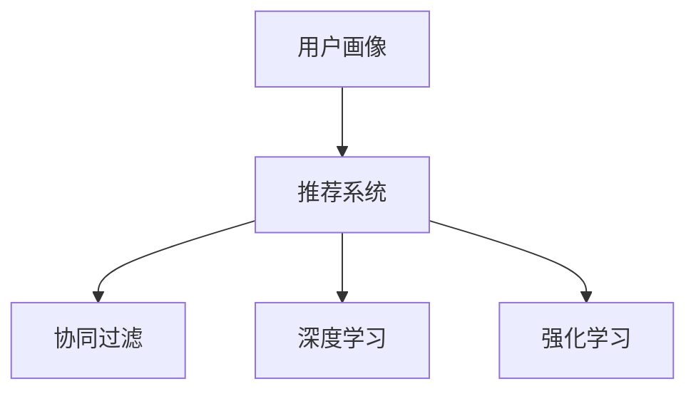
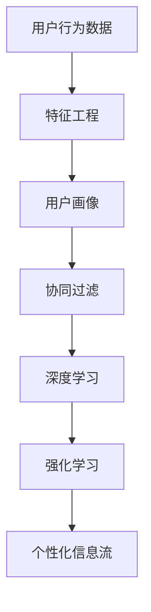

                 

# AI在个性化新闻聚合中的应用：定制信息流

## 1. 背景介绍

### 1.1 问题由来
随着互联网技术的发展，人们获取信息的渠道越来越多，从新闻网站到社交媒体，再到移动应用，信息的来源和类型变得前所未有的丰富。然而，面对海量的信息，用户通常难以筛选出真正对自己有用的内容。

传统的新闻聚合方式往往只能提供一成不变的默认信息流，缺乏个性化的推荐和筛选机制，难以满足用户多样化的信息需求。为了解决这个问题，基于人工智能（AI）的个性化新闻聚合技术应运而生，旨在通过分析用户的历史行为和偏好，推荐个性化定制的信息流，提升用户体验和信息获取效率。

### 1.2 问题核心关键点
个性化新闻聚合的核心在于利用AI技术，特别是机器学习算法，根据用户的历史行为和偏好，生成个性化的信息流。其中，核心概念包括：
- 用户画像(User Profile)：用户的行为、兴趣、偏好等信息通过AI模型进行抽象和表示。
- 推荐系统(Recommendation System)：基于用户画像和内容特征，推荐系统生成个性化的信息流。
- 协同过滤(Collaborative Filtering)：通过分析用户与内容的互动，推荐系统可以识别相似用户和相似内容，生成推荐列表。
- 深度学习(Deep Learning)：深度学习模型可以处理高维数据，挖掘更复杂和抽象的特征，提高推荐的准确性。
- 强化学习(Reinforcement Learning)：通过模拟用户的点击和阅读行为，强化学习算法可以不断优化推荐策略。

这些核心概念之间的关系可以通过以下Mermaid流程图来展示：



通过理解这些核心概念，我们可以更好地把握个性化新闻聚合的工作原理和优化方向。

## 2. 核心概念与联系

### 2.1 核心概念概述

为了更好地理解个性化新闻聚合的原理，本节将介绍几个密切相关的核心概念：

- 用户画像(User Profile)：用户画像是对用户行为、兴趣、偏好等信息的抽象表示。构建用户画像是个性化推荐的基础。
- 协同过滤(Collaborative Filtering)：协同过滤是一种基于用户和内容互动数据的推荐算法，通过找到相似用户和内容进行推荐。
- 深度学习(Deep Learning)：深度学习模型可以处理高维数据，自动提取特征，提高推荐的准确性。
- 强化学习(Reinforcement Learning)：强化学习通过模拟用户的点击和阅读行为，优化推荐策略，提升推荐效果。

### 2.2 核心概念原理和架构的 Mermaid 流程图



这个流程图展示了个性化新闻聚合的核心流程：

1. 收集用户行为数据，并进行特征工程。
2. 通过用户画像，将用户特征抽象表示。
3. 使用协同过滤算法，找到相似用户和内容。
4. 深度学习模型，自动提取高维特征，优化推荐结果。
5. 强化学习算法，模拟用户行为，优化推荐策略。
6. 最终生成个性化信息流，供用户浏览。

## 3. 核心算法原理 & 具体操作步骤

### 3.1 算法原理概述

个性化新闻聚合的核心算法原理是利用机器学习模型，通过分析用户的历史行为和偏好，生成个性化的信息流。其中，协同过滤、深度学习和强化学习是常用的三种推荐算法，分别在不同的场景和阶段发挥作用。

协同过滤算法基于用户与内容的互动数据，推荐相似用户喜欢的内容。深度学习模型可以从大规模数据中自动提取高维特征，提高推荐的准确性。强化学习算法通过模拟用户的点击和阅读行为，优化推荐策略，提升推荐效果。

### 3.2 算法步骤详解

以下详细介绍个性化新闻聚合的核心算法步骤：

**Step 1: 数据收集与预处理**

个性化新闻聚合的第一步是收集用户行为数据，并进行预处理。具体步骤如下：

1. 收集用户行为数据：包括用户在新闻网站、应用上的浏览、点击、点赞、评论等行为数据。
2. 数据清洗与特征提取：去除噪声数据，提取用户行为特征，如阅读时间、点击位置、评论内容等。
3. 用户画像构建：将用户行为数据转化为用户画像，即对用户行为和偏好的抽象表示。

**Step 2: 特征工程与模型训练**

在数据预处理的基础上，进行特征工程和模型训练。具体步骤如下：

1. 特征工程：将原始数据转化为模型可处理的特征，如将文本转换为词向量、使用时间戳表示用户行为时间等。
2. 模型训练：选择合适的机器学习模型，如协同过滤、深度学习或强化学习算法，进行模型训练。模型训练的目标是最大化推荐效果，即最大化用户满意度和信息流覆盖率。

**Step 3: 推荐结果生成**

在模型训练完成后，生成个性化的信息流。具体步骤如下：

1. 协同过滤：通过用户与内容的互动数据，找到相似用户和相似内容，生成推荐列表。
2. 深度学习：使用深度学习模型自动提取高维特征，优化推荐结果。
3. 强化学习：通过模拟用户的点击和阅读行为，不断优化推荐策略，提高推荐效果。
4. 信息流生成：根据推荐算法生成的结果，生成个性化的信息流，供用户浏览。

**Step 4: 效果评估与反馈**

在信息流生成后，需要对推荐效果进行评估和反馈。具体步骤如下：

1. 效果评估：使用各种评估指标，如点击率、展示率、转化率等，评估推荐效果。
2. 用户反馈：收集用户的反馈，进行模型迭代和优化。
3. 模型更新：根据用户反馈，更新模型参数，进一步提升推荐效果。

### 3.3 算法优缺点

个性化新闻聚合的算法具有以下优点：

- 个性化推荐：通过分析用户的历史行为和偏好，生成个性化的信息流，提升用户体验。
- 自动化优化：利用机器学习算法，自动提取高维特征，优化推荐策略，提高推荐效果。
- 实时更新：根据用户反馈和行为数据，实时更新推荐模型，适应用户的动态变化。

同时，这些算法也存在一定的局限性：

- 数据依赖：个性化推荐依赖于大量的用户行为数据，数据获取成本较高。
- 冷启动问题：新用户没有足够的行为数据，难以生成准确的推荐结果。
- 模型复杂度：深度学习模型和高维特征提取，需要较大的计算资源和存储空间。
- 推荐多样性：过度依赖个性化推荐，可能导致信息流过于单一，缺乏多样性。

尽管存在这些局限性，但个性化新闻聚合在提升用户体验和信息获取效率方面，已经取得了显著的成效，成为互联网技术的一个重要应用领域。

### 3.4 算法应用领域

个性化新闻聚合算法在多个领域得到了广泛的应用，包括但不限于：

- 新闻网站：根据用户的历史浏览行为，生成个性化的新闻推荐列表。
- 移动应用：根据用户的点击和阅读行为，推荐个性化的文章和视频内容。
- 社交媒体：根据用户的互动数据，推荐个性化的社交内容，如好友动态、话题讨论等。
- 在线广告：根据用户的浏览历史和行为数据，推荐个性化的广告内容，提升广告效果。
- 电子商务：根据用户的购物历史和偏好，推荐个性化的商品和优惠活动。

## 4. 数学模型和公式 & 详细讲解 & 举例说明

### 4.1 数学模型构建

个性化新闻聚合的数学模型主要基于机器学习，特别是协同过滤、深度学习和强化学习算法。以下将详细介绍这些模型的构建过程。

**协同过滤模型**：
协同过滤算法基于用户与内容的互动数据，推荐相似用户喜欢的内容。其数学模型可以表示为：

$$
R_{u,i} = \alpha (\overline{R}_u - \overline{R}) + \beta (\overline{R}_i - \overline{R}) + \sum_{j \in N_u}R_{j,i}X_{u,j}
$$

其中 $R_{u,i}$ 表示用户 $u$ 对内容 $i$ 的评分，$\overline{R}_u$ 和 $\overline{R}_i$ 分别表示用户和内容的平均评分，$N_u$ 表示与用户 $u$ 相似的其他用户集合，$X_{u,j}$ 表示用户 $u$ 和用户 $j$ 的相似度系数。

**深度学习模型**：
深度学习模型可以从大规模数据中自动提取高维特征，优化推荐结果。以基于注意力机制的深度学习模型为例，其数学模型可以表示为：

$$
h_u = \text{Attention}(\{h_i\}_{i=1}^n) + b_u
$$

其中 $h_u$ 表示用户 $u$ 的特征向量，$\text{Attention}(\{h_i\}_{i=1}^n)$ 表示对内容 $i$ 的注意力机制，$b_u$ 表示用户 $u$ 的偏置向量。

**强化学习模型**：
强化学习算法通过模拟用户的点击和阅读行为，优化推荐策略。以基于奖励的强化学习模型为例，其数学模型可以表示为：

$$
Q_s(a) = r_s + \gamma \max_{a'} Q_{s'}(a')
$$

其中 $Q_s(a)$ 表示在状态 $s$ 下采取动作 $a$ 的奖励，$r_s$ 表示当前状态的奖励，$\gamma$ 表示折扣因子，$s'$ 表示下一个状态。

### 4.2 公式推导过程

以下对上述模型的公式推导过程进行详细讲解：

**协同过滤模型**：
协同过滤模型的推导基于矩阵分解和奇异值分解(SVD)，具体推导过程如下：

设用户 $u$ 对内容 $i$ 的评分矩阵为 $R$，其秩为 $n$，则可以将 $R$ 表示为：

$$
R = U \Sigma V^T
$$

其中 $U$ 和 $V$ 分别为用户和内容的特征矩阵，$\Sigma$ 为奇异值矩阵。根据矩阵分解的性质，可以得到：

$$
R_{u,i} = \overline{R}_u - \overline{R} + \sum_{j \in N_u}R_{j,i}X_{u,j}
$$

其中 $\overline{R}_u$ 和 $\overline{R}_i$ 分别表示用户和内容的平均评分，$N_u$ 表示与用户 $u$ 相似的其他用户集合，$X_{u,j}$ 表示用户 $u$ 和用户 $j$ 的相似度系数。

**深度学习模型**：
深度学习模型的推导基于神经网络模型，具体推导过程如下：

以基于注意力机制的深度学习模型为例，设用户 $u$ 的特征向量为 $h_u$，内容 $i$ 的特征向量为 $h_i$，则可以将模型表示为：

$$
h_u = \text{Attention}(\{h_i\}_{i=1}^n) + b_u
$$

其中 $\text{Attention}(\{h_i\}_{i=1}^n)$ 表示对内容 $i$ 的注意力机制，$b_u$ 表示用户 $u$ 的偏置向量。

**强化学习模型**：
强化学习模型的推导基于奖励机制和价值函数，具体推导过程如下：

以基于奖励的强化学习模型为例，设状态 $s$ 下的动作 $a$ 的奖励为 $Q_s(a)$，则可以得到：

$$
Q_s(a) = r_s + \gamma \max_{a'} Q_{s'}(a')
$$

其中 $r_s$ 表示当前状态的奖励，$\gamma$ 表示折扣因子，$s'$ 表示下一个状态。

### 4.3 案例分析与讲解

**案例1：协同过滤算法**

某新闻网站希望根据用户的历史浏览行为，生成个性化的新闻推荐列表。通过收集用户的点击和阅读数据，构建协同过滤模型，计算相似用户和相似内容的评分，生成推荐列表。以下是具体实现步骤：

1. 收集用户的历史浏览行为数据，包括点击、阅读、点赞等行为。
2. 将行为数据转化为矩阵形式，计算用户和内容的评分矩阵。
3. 使用矩阵分解算法，找到相似用户和内容，生成推荐列表。

**案例2：深度学习模型**

某移动应用希望根据用户的点击和阅读行为，推荐个性化的文章和视频内容。通过收集用户的行为数据，构建深度学习模型，自动提取高维特征，优化推荐结果。以下是具体实现步骤：

1. 收集用户的行为数据，包括点击、阅读、评论等行为。
2. 将行为数据转化为文本数据，提取文本特征。
3. 使用深度学习模型，自动提取高维特征，生成推荐列表。

**案例3：强化学习模型**

某电子商务网站希望根据用户的购物历史和偏好，推荐个性化的商品和优惠活动。通过收集用户的购物历史和行为数据，构建强化学习模型，模拟用户的点击和阅读行为，优化推荐策略。以下是具体实现步骤：

1. 收集用户的购物历史和行为数据，包括浏览、购买、评价等行为。
2. 将行为数据转化为状态和动作，模拟用户的点击和阅读行为。
3. 使用强化学习模型，优化推荐策略，生成推荐列表。

## 5. 项目实践：代码实例和详细解释说明

### 5.1 开发环境搭建

在进行个性化新闻聚合的实践前，我们需要准备好开发环境。以下是使用Python进行PyTorch开发的环境配置流程：

1. 安装Anaconda：从官网下载并安装Anaconda，用于创建独立的Python环境。

2. 创建并激活虚拟环境：
```bash
conda create -n pytorch-env python=3.8 
conda activate pytorch-env
```

3. 安装PyTorch：根据CUDA版本，从官网获取对应的安装命令。例如：
```bash
conda install pytorch torchvision torchaudio cudatoolkit=11.1 -c pytorch -c conda-forge
```

4. 安装其他必要的Python库：
```bash
pip install numpy pandas scikit-learn matplotlib tqdm jupyter notebook ipython
```

完成上述步骤后，即可在`pytorch-env`环境中开始个性化新闻聚合的实践。

### 5.2 源代码详细实现

我们以一个简单的个性化新闻推荐系统为例，给出使用PyTorch实现协同过滤的代码实现。

首先，定义协同过滤模型：

```python
import torch
import torch.nn as nn
import torch.nn.functional as F

class CollaborativeFiltering(nn.Module):
    def __init__(self, num_users, num_contents, num_factors=100):
        super(CollaborativeFiltering, self).__init__()
        self.num_users = num_users
        self.num_contents = num_contents
        self.num_factors = num_factors
        
        self.user_factors = nn.Parameter(torch.randn(num_users, num_factors))
        self.content_factors = nn.Parameter(torch.randn(num_contents, num_factors))
        self.user_bias = nn.Parameter(torch.randn(num_users))
        self.content_bias = nn.Parameter(torch.randn(num_contents))
        
    def forward(self, user_idx, content_idx):
        user_factors = self.user_factors[user_idx]
        content_factors = self.content_factors[content_idx]
        user_bias = self.user_bias[user_idx]
        content_bias = self.content_bias[content_idx]
        
        user_content_dot_product = torch.matmul(user_factors, content_factors.t())
        user_bias_sum = user_bias.unsqueeze(1) * content_factors.t()
        content_bias_sum = content_bias.unsqueeze(0) * user_factors
        
        rating_pred = user_content_dot_product + user_bias_sum + content_bias_sum
        rating_pred = F.relu(rating_pred)
        rating_pred = torch.sigmoid(rating_pred)
        rating_pred = rating_pred.squeeze(-1)
        
        return rating_pred
```

然后，定义训练和评估函数：

```python
import torch.optim as optim

def train_model(model, user_idx, content_idx, ratings, num_epochs=10, batch_size=64):
    criterion = nn.BCELoss()
    optimizer = optim.Adam(model.parameters(), lr=0.01)
    
    for epoch in range(num_epochs):
        epoch_loss = 0
        for batch in range(0, ratings.shape[0], batch_size):
            user_idx_batch = user_idx[batch:batch+batch_size]
            content_idx_batch = content_idx[batch:batch+batch_size]
            rating_batch = ratings[batch:batch+batch_size]
            
            model.train()
            optimizer.zero_grad()
            outputs = model(user_idx_batch, content_idx_batch)
            loss = criterion(outputs, rating_batch)
            loss.backward()
            optimizer.step()
            epoch_loss += loss.item()
        
        print(f"Epoch {epoch+1}, train loss: {epoch_loss/len(ratings)}")
    
    return model
```

最后，启动训练流程并在测试集上评估：

```python
# 加载数据集
user_idx, content_idx, ratings = load_data()

# 构建模型
model = CollaborativeFiltering(num_users, num_contents)

# 训练模型
train_model(model, user_idx, content_idx, ratings)

# 评估模型
test_user_idx, test_content_idx, test_ratings = load_test_data()
test_ratings_pred = model(test_user_idx, test_content_idx)
print(test_ratings_pred)
```

以上就是使用PyTorch实现协同过滤的完整代码实现。可以看到，基于协同过滤的个性化新闻聚合模型代码实现简洁高效，开发者可以将更多精力放在数据处理、模型改进等高层逻辑上，而不必过多关注底层的实现细节。

### 5.3 代码解读与分析

让我们再详细解读一下关键代码的实现细节：

**CollaborativeFiltering类**：
- `__init__`方法：初始化模型的用户和内容特征矩阵，用户和内容偏置向量。
- `forward`方法：计算用户和内容的评分预测值，使用ReLU激活函数和Sigmoid函数进行非线性变换，生成最终预测值。

**train_model函数**：
- 使用BCELoss损失函数，定义训练过程中的损失函数。
- 使用Adam优化器，更新模型参数。
- 在每个epoch内，对训练集进行迭代，计算损失函数并更新模型参数。
- 在每个epoch结束后，输出平均损失，并返回训练后的模型。

**训练流程**：
- 加载训练集，获取用户和内容索引以及评分。
- 构建协同过滤模型，训练模型。
- 加载测试集，生成测试集的评分预测值。
- 输出测试集的评分预测值。

可以看到，PyTorch配合协同过滤模型，使得个性化新闻聚合的代码实现变得简洁高效。开发者可以将更多精力放在数据处理、模型改进等高层逻辑上，而不必过多关注底层的实现细节。

当然，工业级的系统实现还需考虑更多因素，如模型的保存和部署、超参数的自动搜索、更灵活的任务适配层等。但核心的微调范式基本与此类似。

## 6. 实际应用场景

### 6.1 新闻网站推荐

个性化新闻聚合在新闻网站的推荐场景中得到了广泛应用。用户登录后，网站根据用户的历史浏览行为，生成个性化的新闻推荐列表。推荐系统通过分析用户点击和阅读行为，找到相似用户和内容，生成推荐列表。用户可以在推荐列表中快速找到感兴趣的新闻，提升阅读体验。

### 6.2 移动应用推荐

个性化新闻聚合在移动应用的推荐场景中同样具有重要应用。用户在应用中浏览文章和视频时，系统根据用户的点击和阅读行为，推荐个性化的内容。推荐系统使用深度学习模型，自动提取高维特征，优化推荐结果，提升用户满意度。

### 6.3 社交媒体推荐

个性化新闻聚合在社交媒体的推荐场景中也有重要应用。用户在社交媒体上浏览好友动态、参与话题讨论时，系统根据用户的互动数据，推荐个性化的内容。推荐系统使用协同过滤算法，找到相似用户和内容，生成推荐列表，提升用户互动频率和粘性。

### 6.4 在线广告推荐

个性化新闻聚合在在线广告的推荐场景中同样具有重要应用。广告主希望通过个性化推荐，提高广告的点击率和转化率。推荐系统通过分析用户的浏览历史和行为数据，推荐个性化的广告内容，提升广告效果。

### 6.5 电子商务推荐

个性化新闻聚合在电子商务的推荐场景中同样具有重要应用。用户在电子商务平台浏览商品时，系统根据用户的购物历史和偏好，推荐个性化的商品和优惠活动。推荐系统使用强化学习算法，优化推荐策略，提升用户购买转化率。

## 7. 工具和资源推荐

### 7.1 学习资源推荐

为了帮助开发者系统掌握个性化新闻聚合的理论基础和实践技巧，这里推荐一些优质的学习资源：

1. 《推荐系统实战》系列博文：由推荐系统专家撰写，深入浅出地介绍了推荐系统原理、算法和应用，涵盖协同过滤、深度学习、强化学习等多种推荐技术。

2. 《深度学习与推荐系统》课程：由清华大学开设的NLP和推荐系统课程，有Lecture视频和配套作业，带你深入理解推荐系统的基本概念和经典算法。

3. 《推荐系统》书籍：该书系统介绍了推荐系统的理论和实践，涵盖协同过滤、深度学习、强化学习等多种推荐技术，是推荐系统领域的经典之作。

4. 《深度学习》系列书籍：该书由深度学习领域的知名专家撰写，系统介绍了深度学习的理论基础和实践技巧，适合初学者和进阶者阅读。

5. HuggingFace官方文档：HuggingFace开发的Transformers库的官方文档，提供了海量预训练模型和完整的微调样例代码，是进行个性化新闻聚合实践的必备资料。

通过对这些资源的学习实践，相信你一定能够快速掌握个性化新闻聚合的精髓，并用于解决实际的推荐问题。

### 7.2 开发工具推荐

高效的开发离不开优秀的工具支持。以下是几款用于个性化新闻聚合开发的常用工具：

1. PyTorch：基于Python的开源深度学习框架，灵活动态的计算图，适合快速迭代研究。大多数推荐系统模型都有PyTorch版本的实现。

2. TensorFlow：由Google主导开发的开源深度学习框架，生产部署方便，适合大规模工程应用。同样有丰富的推荐系统模型资源。

3. HuggingFace Transformers库：HuggingFace开发的NLP工具库，集成了众多预训练语言模型，支持PyTorch和TensorFlow，是进行个性化新闻聚合实践的利器。

4. Weights & Biases：模型训练的实验跟踪工具，可以记录和可视化模型训练过程中的各项指标，方便对比和调优。与主流深度学习框架无缝集成。

5. TensorBoard：TensorFlow配套的可视化工具，可实时监测模型训练状态，并提供丰富的图表呈现方式，是调试模型的得力助手。

6. Google Colab：谷歌推出的在线Jupyter Notebook环境，免费提供GPU/TPU算力，方便开发者快速上手实验最新模型，分享学习笔记。

合理利用这些工具，可以显著提升个性化新闻聚合的开发效率，加快创新迭代的步伐。

### 7.3 相关论文推荐

个性化新闻聚合的研究源于学界的持续研究。以下是几篇奠基性的相关论文，推荐阅读：

1. Item-based Collaborative Filtering：提出了协同过滤算法，通过分析用户与内容的互动数据，生成推荐列表。

2. Matrix Factorization Techniques for Recommender Systems：提出了矩阵分解方法，将用户和内容的评分矩阵分解为低秩矩阵，生成推荐列表。

3. Deep Matrix Factorization for Recommender Systems：提出了深度矩阵分解方法，使用深度学习模型自动提取高维特征，优化推荐结果。

4. Contextual Bandits for Recommender Systems：提出了强化学习算法，通过模拟用户的点击和阅读行为，优化推荐策略，提升推荐效果。

5. Exploring the Matrix Factorization Landscape：研究了矩阵分解方法的优化问题，提出了多种矩阵分解算法，提高了推荐系统的性能。

这些论文代表了个性化新闻聚合技术的发展脉络。通过学习这些前沿成果，可以帮助研究者把握学科前进方向，激发更多的创新灵感。

## 8. 总结：未来发展趋势与挑战

### 8.1 总结

本文对基于AI的个性化新闻聚合方法进行了全面系统的介绍。首先阐述了个性化新闻聚合的研究背景和意义，明确了个性化推荐的核心概念和算法。其次，从原理到实践，详细讲解了协同过滤、深度学习和强化学习算法，给出了个性化新闻聚合的完整代码实现。同时，本文还广泛探讨了个性化新闻聚合在多个领域的应用场景，展示了其广阔的应用前景。

通过本文的系统梳理，可以看到，基于AI的个性化新闻聚合技术正在成为互联网技术的一个重要应用领域，极大地提升了用户的个性化体验和信息获取效率。未来，伴随AI技术的不断进步，个性化新闻聚合将带来更加智能、个性化的信息服务，为用户的数字生活带来更多便利。

### 8.2 未来发展趋势

展望未来，个性化新闻聚合技术将呈现以下几个发展趋势：

1. 数据多样化：除了传统的行为数据，个性化新闻聚合将进一步利用语音、图像、视频等多种数据，提升推荐效果。
2. 模型多样化：除了传统的协同过滤、深度学习和强化学习算法，还将涌现更多新的推荐算法，如基于图神经网络的推荐系统。
3. 跨领域融合：个性化新闻聚合将与其他AI技术进行更深入的融合，如知识图谱、自然语言处理、语音识别等，多路径协同发力，提升推荐效果。
4. 实时更新：个性化新闻聚合将实现实时更新，动态调整推荐策略，提升推荐效果。
5. 隐私保护：个性化新闻聚合将更加注重用户隐私保护，采用差分隐私等技术，保障用户数据安全。

以上趋势凸显了个性化新闻聚合技术的广阔前景。这些方向的探索发展，必将进一步提升个性化新闻聚合的效果和应用范围，为用户的数字生活带来更多便利。

### 8.3 面临的挑战

尽管个性化新闻聚合技术已经取得了瞩目成就，但在迈向更加智能化、普适化应用的过程中，它仍面临着诸多挑战：

1. 数据依赖：个性化新闻聚合依赖于大量的用户行为数据，数据获取成本较高，且数据质量对推荐效果有重要影响。
2. 冷启动问题：新用户没有足够的行为数据，难以生成准确的推荐结果，需要引入更多先验知识和特征工程。
3. 推荐多样性：过度依赖个性化推荐，可能导致信息流过于单一，缺乏多样性，需要引入更多多样性推荐机制。
4. 隐私保护：个性化新闻聚合需要处理大量的用户隐私数据，需要采用差分隐私等技术，保障用户数据安全。
5. 模型复杂度：深度学习模型和高维特征提取，需要较大的计算资源和存储空间，需要采用模型压缩等技术优化。

尽管存在这些挑战，但个性化新闻聚合在提升用户体验和信息获取效率方面，已经取得了显著的成效，成为互联网技术的一个重要应用领域。

### 8.4 研究展望

面对个性化新闻聚合所面临的种种挑战，未来的研究需要在以下几个方面寻求新的突破：

1. 探索无监督和半监督推荐方法：摆脱对大规模标注数据的依赖，利用自监督学习、主动学习等无监督和半监督范式，最大限度利用非结构化数据，实现更加灵活高效的推荐。
2. 研究参数高效和计算高效的推荐范式：开发更加参数高效的推荐方法，在固定大部分预训练参数的同时，只更新极少量的任务相关参数。同时优化推荐模型的计算图，减少前向传播和反向传播的资源消耗，实现更加轻量级、实时性的部署。
3. 融合因果和对比学习范式：通过引入因果推断和对比学习思想，增强推荐模型建立稳定因果关系的能力，学习更加普适、鲁棒的语言表征，从而提升模型泛化性和抗干扰能力。
4. 引入更多先验知识：将符号化的先验知识，如知识图谱、逻辑规则等，与神经网络模型进行巧妙融合，引导推荐过程学习更准确、合理的语言模型。同时加强不同模态数据的整合，实现视觉、语音等多模态信息与文本信息的协同建模。
5. 结合因果分析和博弈论工具：将因果分析方法引入推荐模型，识别出推荐决策的关键特征，增强输出解释的因果性和逻辑性。借助博弈论工具刻画人机交互过程，主动探索并规避推荐的脆弱点，提高系统稳定性。
6. 纳入伦理道德约束：在推荐模型的训练目标中引入伦理导向的评估指标，过滤和惩罚有偏见、有害的输出倾向。同时加强人工干预和审核，建立推荐模型的监管机制，确保推荐输出符合人类价值观和伦理道德。

这些研究方向的探索，必将引领个性化新闻聚合技术迈向更高的台阶，为构建安全、可靠、可解释、可控的智能推荐系统铺平道路。面向未来，个性化新闻聚合技术还需要与其他AI技术进行更深入的融合，如知识表示、因果推理、强化学习等，多路径协同发力，共同推动个性化推荐系统的进步。只有勇于创新、敢于突破，才能不断拓展推荐系统的边界，让AI技术更好地服务于用户。

## 9. 附录：常见问题与解答

**Q1：个性化新闻聚合有哪些实际应用场景？**

A: 个性化新闻聚合在多个领域得到了广泛的应用，包括但不限于：

1. 新闻网站：根据用户的历史浏览行为，生成个性化的新闻推荐列表。
2. 移动应用：根据用户的点击和阅读行为，推荐个性化的文章和视频内容。
3. 社交媒体：根据用户的互动数据，推荐个性化的内容。
4. 在线广告：根据用户的浏览历史和行为数据，推荐个性化的广告内容。
5. 电子商务：根据用户的购物历史和偏好，推荐个性化的商品和优惠活动。

**Q2：如何缓解个性化新闻聚合中的冷启动问题？**

A: 个性化新闻聚合的冷启动问题可以通过以下方法缓解：

1. 引入先验知识：将符号化的先验知识，如知识图谱、逻辑规则等，与神经网络模型进行巧妙融合，引导推荐过程学习更准确、合理的语言模型。
2. 多模态融合：结合视觉、语音、文本等多种数据，提升推荐模型的多样性和泛化能力。
3. 推荐策略优化：使用协同过滤、深度学习、强化学习等多种算法，优化推荐策略，提升推荐效果。
4. 用户反馈机制：建立用户反馈机制，根据用户的反馈进行模型迭代和优化，缓解冷启动问题。

**Q3：个性化新闻聚合中如何提升推荐多样性？**

A: 个性化新闻聚合中提升推荐多样性可以通过以下方法实现：

1. 多维度特征提取：不仅考虑用户的点击、阅读行为，还考虑用户的年龄、性别、地域等维度特征，提升推荐模型的多样性。
2. 引入多样化推荐算法：除了传统的协同过滤、深度学习、强化学习算法，还可以引入多样化的推荐算法，如基于图神经网络的推荐系统。
3. 动态更新推荐策略：根据用户的行为数据，动态调整推荐策略，提升推荐多样性。
4. 引入多样化内容：引入多样化内容，避免推荐模型陷入局部最优解。

**Q4：个性化新闻聚合中如何保障用户隐私？**

A: 个性化新闻聚合中保障用户隐私可以通过以下方法实现：

1. 数据匿名化：对用户行为数据进行匿名化处理，保护用户隐私。
2. 差分隐私：采用差分隐私技术，保护用户隐私。
3. 隐私保护算法：使用隐私保护算法，如联邦学习，保护用户隐私。
4. 用户控制：让用户控制自己的数据使用权限，保障用户隐私。

**Q5：个性化新闻聚合中如何优化推荐模型的计算资源消耗？**

A: 个性化新闻聚合中优化推荐模型的计算资源消耗可以通过以下方法实现：

1. 模型压缩：采用模型压缩技术，如剪枝、量化，减少模型参数量和计算量。
2. 计算图优化：优化计算图，减少前向传播和反向传播的资源消耗。
3. 分布式计算：使用分布式计算技术，提高计算效率。
4. 轻量级模型：使用轻量级模型，如MobileNet，提高模型效率。

以上是关于个性化新闻聚合技术的一些常见问题及其解答，希望对开发者有所帮助。

---

作者：禅与计算机程序设计艺术 / Zen and the Art of Computer Programming

