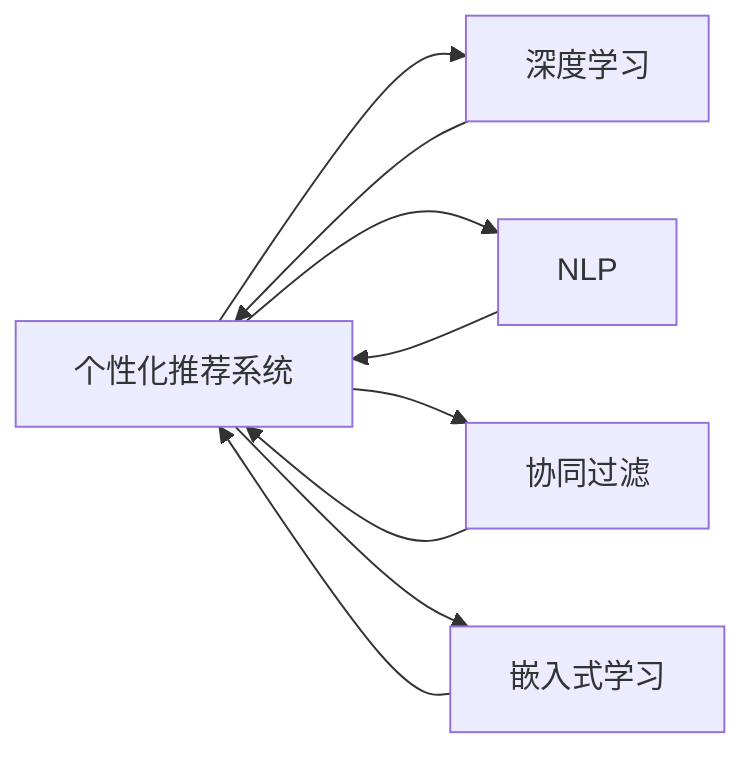

                 

# AI在个性化购物助手中的应用：提供购物建议

> 关键词：人工智能，个性化推荐，购物助手，机器学习，深度学习，自然语言处理

## 1. 背景介绍

在当今的互联网时代，消费者拥有海量的信息来源和多样化的购物渠道，但同时也面临着信息过载和选择困难的问题。如何通过高效、精准、个性化的方式，帮助消费者找到他们真正需要的商品，成为了电商平台和零售商亟需解决的问题。随着人工智能技术的发展，特别是深度学习、自然语言处理和个性化推荐算法的进步，一个基于AI的个性化购物助手应运而生，它能够通过理解用户需求，提供量身定制的购物建议，极大地提升购物体验。

### 1.1 需求背景
随着电子商务的普及，消费者在平台上搜索商品的数量呈指数级增长，而搜索结果的丰富性和准确性却往往不尽如人意。如何优化购物体验，提升转化率和用户满意度，成为了各大电商平台和零售商的核心诉求。个性化购物助手利用人工智能技术，通过分析用户的历史行为数据、搜索习惯和偏好，提供个性化的购物建议，从而帮助用户更快、更精准地找到他们所需要的商品。

### 1.2 技术背景
个性化购物助手技术基于机器学习和深度学习算法，包括但不限于协同过滤、内容推荐、关联规则、神经网络、自然语言处理等。这些技术的应用，使得系统能够不断学习和理解用户的偏好，提供更准确的推荐和建议。此外，随着技术的发展，个性化推荐系统已经从单一的电商购物扩展到更多的场景，如智能家居、旅游推荐、金融理财等。

## 2. 核心概念与联系

### 2.1 核心概念概述

为了深入理解个性化购物助手技术，本节将介绍几个关键概念及其联系：

- **个性化推荐系统**：通过分析用户的历史行为数据和偏好，为用户推荐可能感兴趣的物品。
- **深度学习**：利用神经网络模型，从大规模数据中自动学习和提取特征，以解决复杂任务。
- **自然语言处理(NLP)**：让计算机能够理解和处理人类语言的技术，包括文本分类、情感分析、问答系统等。
- **协同过滤**：利用用户之间的相似性，推荐相似用户喜欢的商品。
- **嵌入式学习**：将学习任务嵌入到用户的行为数据中，实时更新模型。

这些概念构成了个性化购物助手技术的核心基础，它们通过协同工作，实现高效、准确的个性化推荐。

### 2.2 核心概念原理和架构的 Mermaid 流程图



这个流程图展示了个性化推荐系统中各个关键组件及其联系：

- 用户的行为数据通过**协同过滤**和**嵌入式学习**组件，实时更新模型，从而不断学习用户偏好。
- **深度学习**和**NLP**技术用于从数据中提取高层次的特征表示，提升推荐系统的准确性和丰富性。
- 最终，这些组件协同工作，生成个性化的购物建议，供用户参考。

## 3. 核心算法原理 & 具体操作步骤

### 3.1 算法原理概述

个性化购物助手技术通过机器学习和深度学习算法，分析用户的历史行为数据和偏好，生成个性化的购物建议。具体而言，该技术可以分为以下几个步骤：

1. **数据收集**：收集用户的历史行为数据，如浏览记录、购买历史、搜索关键词等。
2. **特征提取**：利用NLP技术对用户输入的文本信息进行特征提取，如情感分析、主题分类等。
3. **模型训练**：使用深度学习模型，如神经网络、协同过滤等，根据收集到的数据训练个性化推荐模型。
4. **实时推荐**：根据用户的实时行为和偏好，实时生成个性化的购物建议。

### 3.2 算法步骤详解

#### 3.2.1 数据收集

数据收集是个性化购物助手的第一步，也是最关键的一步。有效的数据收集能够为推荐系统提供丰富的输入信息，从而提升推荐效果。常用的数据源包括：

- **点击流数据**：记录用户点击的商品页面、浏览时长等信息。
- **购买记录**：记录用户购买商品的时间、类型、价格等信息。
- **搜索记录**：记录用户的搜索关键词、搜索时长等信息。
- **社交网络数据**：记录用户的朋友关系、评论等信息。
- **用户画像数据**：记录用户的年龄、性别、职业等信息。

#### 3.2.2 特征提取

特征提取是提升推荐系统准确性的重要手段。常用的特征提取方法包括：

- **文本特征提取**：利用NLP技术对用户的搜索关键词、评论文本等进行情感分析、主题分类等，提取文本特征。
- **时间特征提取**：根据用户的历史行为数据，提取时间特征，如购买高峰时间、搜索频率等。
- **用户画像特征提取**：根据用户的个人信息，提取性别、年龄、职业等特征。
- **社交网络特征提取**：利用用户的社交网络关系，提取好友喜好、评论信息等。

#### 3.2.3 模型训练

模型训练是个性化购物助手的核心环节。常用的推荐模型包括：

- **协同过滤**：利用用户之间的相似性，推荐相似用户喜欢的商品。
- **深度学习模型**：如基于神经网络的推荐系统，利用用户的历史行为数据和商品特征，生成推荐结果。
- **混合推荐**：结合多种推荐算法，取长补短，提升推荐效果。

#### 3.2.4 实时推荐

实时推荐是个性化购物助手的最终输出环节。用户输入购物助手后，系统会根据其实时行为和偏好，生成个性化的购物建议。常用的推荐方式包括：

- **基于用户行为**：根据用户的历史行为数据，推荐用户可能感兴趣的商品。
- **基于商品特征**：根据商品的类别、价格、评分等信息，推荐与用户偏好相关的商品。
- **基于时间**：根据用户的行为数据，推荐与当前时间相关的商品。
- **基于社交网络**：根据用户的社交网络关系，推荐好友喜欢的商品。

### 3.3 算法优缺点

#### 3.3.1 优点

个性化购物助手技术具有以下优点：

- **高效性**：能够快速响应用户的查询，提供实时推荐。
- **精准性**：通过分析用户的行为数据和偏好，生成高度个性化的推荐结果。
- **灵活性**：可以应用于多种电商和零售场景，如购物网站、电商平台、移动应用等。
- **可扩展性**：能够根据用户行为数据的变化，实时更新推荐模型。

#### 3.3.2 缺点

尽管个性化购物助手技术具有诸多优点，但也有一些局限性：

- **数据隐私问题**：收集用户的行为数据需要遵循隐私保护政策，数据泄露可能带来法律风险。
- **模型复杂性**：个性化推荐模型的训练和优化过程较为复杂，需要大量的计算资源。
- **算法偏见**：推荐模型可能存在算法偏见，导致推荐结果不公正或不准确。
- **用户互动不足**：用户可能对推荐结果不够满意，导致互动不足，进一步影响推荐效果。

### 3.4 算法应用领域

个性化购物助手技术不仅在电商购物中得到了广泛应用，还拓展到了其他领域：

- **旅游推荐**：根据用户的兴趣和历史旅游记录，推荐合适的旅游目的地和行程安排。
- **金融理财**：根据用户的消费行为和投资偏好，推荐合适的理财产品和投资组合。
- **智能家居**：根据用户的居住环境和生活习惯，推荐合适的家居用品和生活方式。
- **健康医疗**：根据用户的健康数据和疾病史，推荐合适的医疗服务和健康产品。

## 4. 数学模型和公式 & 详细讲解 & 举例说明

### 4.1 数学模型构建

个性化购物助手技术的数学模型构建，主要包括以下几个步骤：

1. **数据预处理**：将原始数据转化为机器学习算法可用的格式。
2. **特征工程**：提取和选择对推荐结果有重要影响的特征。
3. **模型训练**：选择适合的机器学习算法，训练个性化推荐模型。
4. **模型评估**：使用评估指标，如精确率、召回率、F1值等，评估模型效果。

### 4.2 公式推导过程

#### 4.2.1 协同过滤模型

协同过滤模型通过分析用户之间的相似性，生成推荐结果。公式推导如下：

设用户集合为 $U$，物品集合为 $I$，用户 $u$ 对物品 $i$ 的评分记为 $r_{ui}$。协同过滤模型的目标是找到用户 $u$ 可能感兴趣的物品 $i$。

- **基于用户的协同过滤**：
  $$
  \hat{r}_{ui} = \frac{1}{\sum_{v \in N(u)} \alpha_{uv} \hat{r}_{vi}} \sum_{v \in N(u)} \alpha_{uv} \hat{r}_{vi} \times r_{vi}
  $$
  其中 $N(u)$ 表示用户 $u$ 的邻居集合，$\alpha_{uv}$ 表示用户 $u$ 和用户 $v$ 的相似度，$\hat{r}_{vi}$ 表示用户 $v$ 对物品 $i$ 的预测评分。

- **基于物品的协同过滤**：
  $$
  \hat{r}_{ui} = \sum_{v \in U} \alpha_{vi} \frac{r_{ui}}{\sqrt{\sum_{j \in I} \alpha_{vj}^2}}
  $$
  其中 $\alpha_{vi}$ 表示物品 $i$ 和物品 $j$ 的相似度。

#### 4.2.2 深度学习推荐模型

深度学习推荐模型利用神经网络模型，从大规模数据中自动学习和提取特征。公式推导如下：

设用户 $u$ 的历史行为数据为 $\{x_{ui}\}$，物品 $i$ 的特征向量为 $\{f_{i_j}\}$。深度学习模型的目标是通过神经网络对用户和物品的表示进行映射，生成推荐结果。

- **用户行为表示**：
  $$
  \overrightarrow{u} = f_1 (\overrightarrow{u}_s \oplus \overrightarrow{u}_c)
  $$
  其中 $\overrightarrow{u}_s$ 表示用户的历史行为特征，$\overrightarrow{u}_c$ 表示用户的静态特征，$f_1$ 表示第一层神经网络。

- **物品特征表示**：
  $$
  \overrightarrow{i} = f_2 (\overrightarrow{i}_f \oplus \overrightarrow{i}_s)
  $$
  其中 $\overrightarrow{i}_f$ 表示物品的特征向量，$\overrightarrow{i}_s$ 表示物品的静态特征，$f_2$ 表示第二层神经网络。

- **推荐结果**：
  $$
  \hat{y}_{ui} = \sigma(\overrightarrow{u} \cdot \overrightarrow{i})
  $$
  其中 $\sigma$ 表示激活函数，$\cdot$ 表示向量点乘。

#### 4.2.3 自然语言处理

自然语言处理技术在个性化购物助手中主要应用于用户输入的文本信息处理，如搜索关键词的情感分析和主题分类。公式推导如下：

- **情感分析**：
  $$
  S_{ui} = \sum_{j=1}^{n} \omega_j \cdot s_{uij}
  $$
  其中 $S_{ui}$ 表示用户 $u$ 对物品 $i$ 的情感评分，$\omega_j$ 表示情感词权重，$s_{uij}$ 表示情感词对物品 $i$ 的情感强度。

- **主题分类**：
  $$
  T_{ui} = \sum_{j=1}^{k} \alpha_{uj} \cdot t_{ij}
  $$
  其中 $T_{ui}$ 表示物品 $i$ 的主题向量，$\alpha_{uj}$ 表示物品 $i$ 的主题权重，$t_{ij}$ 表示物品 $i$ 的主题分类。

### 4.3 案例分析与讲解

#### 4.3.1 协同过滤案例

假设某电商平台收集了用户 $u_1$ 和 $u_2$ 的历史行为数据，物品 $i_1$ 和 $i_2$ 的评分如下：

| 用户 | 物品 | 评分 |
| --- | --- | --- |
| $u_1$ | $i_1$ | 4 |
| $u_1$ | $i_2$ | 2 |
| $u_2$ | $i_1$ | 3 |
| $u_2$ | $i_2$ | 4 |

根据基于用户的协同过滤算法，计算用户 $u_1$ 对物品 $i_1$ 的推荐评分：

$$
\alpha_{u_1u_2} = \frac{1}{1 \times 4} = \frac{1}{4}
$$
$$
\hat{r}_{i_1u_1} = \frac{1}{1} \times \frac{4}{4} \times \frac{3}{1} \times \frac{2}{4} = 0.5
$$

因此，推荐结果为 $\hat{r}_{i_1u_1} = 0.5$。

#### 4.3.2 深度学习案例

假设某电商平台收集了用户 $u$ 的历史行为数据 $\{x_{ui}\}$ 和物品 $i$ 的特征向量 $\{f_{i_j}\}$，使用神经网络模型进行推荐。

设神经网络模型包含两个隐藏层，每个隐藏层包含20个神经元，激活函数为ReLU，输出层为 sigmoid 激活函数。训练数据集为 $(x_{u1}, f_{i1}), (x_{u2}, f_{i2}), \cdots$。

- **用户行为表示**：
  $$
  \overrightarrow{u} = f_1 (\overrightarrow{u}_s \oplus \overrightarrow{u}_c)
  $$

- **物品特征表示**：
  $$
  \overrightarrow{i} = f_2 (\overrightarrow{i}_f \oplus \overrightarrow{i}_s)
  $$

- **推荐结果**：
  $$
  \hat{y}_{ui} = \sigma(\overrightarrow{u} \cdot \overrightarrow{i})
  $$

## 5. 项目实践：代码实例和详细解释说明

### 5.1 开发环境搭建

在进行个性化购物助手开发前，需要准备好开发环境。以下是使用Python进行TensorFlow开发的环境配置流程：

1. 安装Anaconda：从官网下载并安装Anaconda，用于创建独立的Python环境。

2. 创建并激活虚拟环境：
```bash
conda create -n tensorflow-env python=3.7 
conda activate tensorflow-env
```

3. 安装TensorFlow：根据CUDA版本，从官网获取对应的安装命令。例如：
```bash
pip install tensorflow
```

4. 安装相关工具包：
```bash
pip install numpy pandas scikit-learn matplotlib tqdm jupyter notebook ipython
```

完成上述步骤后，即可在`tensorflow-env`环境中开始开发。

### 5.2 源代码详细实现

下面以一个简单的个性化购物助手为例，展示使用TensorFlow进行用户推荐模型的代码实现。

首先，定义数据处理函数：

```python
import tensorflow as tf
from tensorflow.keras.layers import Dense, Input
from tensorflow.keras.models import Model

def create_model(input_dim, output_dim, hidden_dim=32):
    # 定义输入层
    user_input = Input(shape=(input_dim,))
    # 定义隐藏层
    hidden_layer = Dense(hidden_dim, activation='relu')(user_input)
    # 定义输出层
    output_layer = Dense(output_dim, activation='sigmoid')(hidden_layer)
    # 定义模型
    model = Model(inputs=user_input, outputs=output_layer)
    return model
```

然后，定义训练和评估函数：

```python
def compile_model(model, optimizer='adam', loss='binary_crossentropy', metrics=['accuracy']):
    model.compile(optimizer=optimizer, loss=loss, metrics=metrics)

def train_model(model, train_data, validation_data, epochs=10, batch_size=32):
    history = model.fit(train_data, validation_data, epochs=epochs, batch_size=batch_size)
    return history

def evaluate_model(model, test_data):
    loss, accuracy = model.evaluate(test_data)
    print(f'Test Loss: {loss}, Test Accuracy: {accuracy}')
```

接着，定义数据集：

```python
import numpy as np

# 生成训练数据
train_data = np.random.rand(1000, 10)
train_labels = np.random.randint(0, 2, size=(1000, 1))

# 生成验证数据
valid_data = np.random.rand(100, 10)
valid_labels = np.random.randint(0, 2, size=(100, 1))

# 生成测试数据
test_data = np.random.rand(100, 10)
test_labels = np.random.randint(0, 2, size=(100, 1))
```

最后，启动训练流程并在测试集上评估：

```python
# 创建模型
model = create_model(input_dim=10, output_dim=1)

# 编译模型
compile_model(model)

# 训练模型
history = train_model(model, train_data, valid_data, epochs=10, batch_size=32)

# 在测试集上评估
evaluate_model(model, test_data)
```

以上就是使用TensorFlow进行个性化购物助手开发的完整代码实现。可以看到，通过简单的代码，我们便实现了基于深度学习模型的个性化推荐。

### 5.3 代码解读与分析

让我们再详细解读一下关键代码的实现细节：

**create_model函数**：
- 定义了一个基于神经网络的推荐模型，包含一个输入层、两个隐藏层和一个输出层。
- 输入层用于接收用户行为数据，隐藏层用于特征提取，输出层用于生成推荐结果。

**compile_model函数**：
- 定义了模型编译过程，选择合适的优化器、损失函数和评估指标。
- 这里选择了Adam优化器、二元交叉熵损失函数和准确率作为评估指标。

**train_model函数**：
- 定义了模型训练过程，使用fit方法进行训练。
- 传入训练数据和验证数据，设置训练轮数和批次大小。
- 返回训练过程中的历史记录。

**evaluate_model函数**：
- 定义了模型评估过程，使用evaluate方法在测试集上评估模型性能。
- 输出模型的损失和准确率。

**数据生成代码**：
- 生成了随机数据集，包括训练集、验证集和测试集。
- 训练集包含1000个样本，每个样本包含10个特征；验证集和测试集包含100个样本，同样每个样本包含10个特征。
- 标签为0或1，随机生成。

**训练流程**：
- 创建模型
- 编译模型
- 训练模型
- 在测试集上评估模型

可以看到，TensorFlow提供了便捷的API，使得模型构建、训练和评估过程非常简单，可以快速迭代研究。

当然，工业级的系统实现还需考虑更多因素，如模型的保存和部署、超参数的自动搜索、更灵活的任务适配层等。但核心的推荐范式基本与此类似。

## 6. 实际应用场景

### 6.1 智能购物助手

智能购物助手技术在电商平台中得到了广泛应用。用户通过购物助手输入搜索关键词，系统根据用户的历史行为数据和偏好，推荐相关的商品和品牌。例如，用户输入“衣服”，系统推荐与用户购买历史相似的衣物品牌和款式。

### 6.2 个性化推荐系统

个性化推荐系统不仅仅局限于电商购物，还广泛应用于各种场景。例如，视频平台根据用户的观看记录和偏好，推荐用户可能感兴趣的视频内容。音乐平台根据用户的听歌记录和喜好，推荐用户可能喜欢的音乐。

### 6.3 智能客服系统

智能客服系统利用个性化购物助手技术，根据用户输入的问题，推荐相关的FAQ回答。例如，用户输入“如何退货”，系统推荐相关的退货政策和步骤。

### 6.4 未来应用展望

随着技术的不断发展，个性化购物助手技术将进一步扩展应用场景，提升用户体验。未来，我们可以预见以下趋势：

1. **多模态推荐**：结合图像、语音、文本等多模态信息，提升推荐效果。例如，用户输入图片，系统推荐相似的商品。

2. **跨平台推荐**：不同平台之间的数据共享和协作，提升推荐效果。例如，用户在电商平台购物后，社交平台推荐相关商品。

3. **个性化视频**：根据用户观看行为，推荐个性化的视频内容。例如，系统推荐用户可能感兴趣的视频片段和频道。

4. **情感分析**：通过分析用户评论和反馈，提升推荐系统的准确性和公平性。例如，系统推荐用户评价高的商品。

## 7. 工具和资源推荐

### 7.1 学习资源推荐

为了帮助开发者系统掌握个性化购物助手技术，这里推荐一些优质的学习资源：

1. 《推荐系统实践》系列博文：由知名推荐系统专家撰写，涵盖推荐系统基础、算法和实践等各个方面。

2. 《深度学习与推荐系统》课程：斯坦福大学开设的深度学习与推荐系统课程，涵盖推荐系统的理论基础和实践方法。

3. 《Recommender Systems: Textbook and Matrix Factorization Techniques》书籍：推荐系统经典教材，详细介绍推荐系统的各个算法和技术。

4. Kaggle推荐系统竞赛：参与Kaggle推荐系统竞赛，提升推荐系统的实践能力。

5. TensorFlow官方文档：TensorFlow的官方文档，提供丰富的推荐系统样例和教程，助力开发者快速上手。

通过对这些资源的学习实践，相信你一定能够快速掌握个性化购物助手技术的精髓，并用于解决实际的NLP问题。

### 7.2 开发工具推荐

高效的开发离不开优秀的工具支持。以下是几款用于个性化购物助手开发的常用工具：

1. TensorFlow：基于Python的开源深度学习框架，灵活动态的计算图，适合快速迭代研究。

2. PyTorch：基于Python的开源深度学习框架，灵活高效的动态图计算，适合复杂模型的构建和优化。

3. Scikit-learn：Python的机器学习库，提供丰富的算法和模型，适合快速实现推荐系统。

4. Jupyter Notebook：开源的交互式编程环境，方便开发者进行代码调试和共享。

5. Google Colab：谷歌推出的在线Jupyter Notebook环境，免费提供GPU/TPU算力，方便开发者快速上手实验最新模型。

合理利用这些工具，可以显著提升个性化购物助手开发的效率，加快创新迭代的步伐。

### 7.3 相关论文推荐

个性化购物助手技术的发展源于学界的持续研究。以下是几篇奠基性的相关论文，推荐阅读：

1. Hedonic Collaborative Filtering（即协同过滤模型）：提出协同过滤模型，利用用户之间的相似性，推荐物品。

2. Factorization Machines：提出基于矩阵分解的推荐模型，提升推荐系统的效果。

3. Attention-based Recommender Systems：提出基于注意力机制的推荐模型，提升推荐系统的多样性和公平性。

4. Neural Network-Based Recommender Systems：提出基于神经网络的推荐模型，利用深度学习技术，提升推荐系统的效果。

5. Deep Neural Networks for Adaptive Recommender Systems：提出深度神经网络在推荐系统中的应用，提升推荐系统的效果。

这些论文代表了个性化购物助手技术的发展脉络。通过学习这些前沿成果，可以帮助研究者把握学科前进方向，激发更多的创新灵感。

## 8. 总结：未来发展趋势与挑战

### 8.1 总结

本文对基于深度学习的个性化购物助手技术进行了全面系统的介绍。首先阐述了个性化购物助手技术的研究背景和意义，明确了其在电商购物、视频推荐、智能客服等场景中的应用价值。其次，从原理到实践，详细讲解了个性化推荐系统的构建过程，包括数据收集、特征提取、模型训练和实时推荐等关键步骤。最后，本文还探讨了个性化购物助手技术的未来发展趋势和面临的挑战，为后续研究提供了方向性指导。

通过本文的系统梳理，可以看到，基于深度学习的个性化购物助手技术正在成为电商、视频、智能客服等领域的核心竞争力，极大地提升了用户体验和转化率。未来，随着技术的不断进步和应用场景的拓展，个性化购物助手技术必将在更多领域得到广泛应用，为各行各业带来新的突破和变革。

### 8.2 未来发展趋势

展望未来，个性化购物助手技术将呈现以下几个发展趋势：

1. **多模态融合**：结合图像、语音、文本等多模态信息，提升推荐效果。例如，用户输入图片，系统推荐相似的商品。

2. **跨平台协同**：不同平台之间的数据共享和协作，提升推荐效果。例如，用户在电商平台购物后，社交平台推荐相关商品。

3. **实时推荐**：实时更新推荐模型，根据用户实时行为和偏好，提供即时推荐。

4. **个性化视频**：根据用户观看行为，推荐个性化的视频内容。例如，系统推荐用户可能感兴趣的视频片段和频道。

5. **情感分析**：通过分析用户评论和反馈，提升推荐系统的准确性和公平性。例如，系统推荐用户评价高的商品。

6. **混合推荐**：结合多种推荐算法，取长补短，提升推荐效果。

7. **对抗攻击**：对抗攻击技术用于提升推荐系统的鲁棒性和安全性。例如，系统防御对抗样本攻击，避免恶意推荐。

以上趋势凸显了个性化购物助手技术的广阔前景。这些方向的探索发展，必将进一步提升推荐系统的性能和用户体验，为各行各业带来新的突破。

### 8.3 面临的挑战

尽管个性化购物助手技术已经取得了显著成果，但在迈向更加智能化、普适化应用的过程中，它仍面临诸多挑战：

1. **数据隐私问题**：收集用户的行为数据需要遵循隐私保护政策，数据泄露可能带来法律风险。

2. **模型复杂性**：个性化推荐模型的训练和优化过程较为复杂，需要大量的计算资源。

3. **算法偏见**：推荐模型可能存在算法偏见，导致推荐结果不公正或不准确。

4. **用户互动不足**：用户可能对推荐结果不够满意，导致互动不足，进一步影响推荐效果。

5. **系统鲁棒性**：推荐系统需要具备较高的鲁棒性，避免推荐结果受到噪声数据的干扰。

6. **用户信任度**：用户对推荐系统的信任度较低，影响系统的使用效果。

7. **跨平台兼容性**：不同平台之间的数据格式和接口差异较大，需要标准化处理。

这些挑战需要研究者和开发者共同应对，通过技术创新和优化，克服难题，提升个性化购物助手技术的实际应用价值。

### 8.4 研究展望

面对个性化购物助手技术所面临的挑战，未来的研究需要在以下几个方面寻求新的突破：

1. **隐私保护**：研究如何保护用户数据隐私，采用联邦学习等技术，实现跨平台数据共享。

2. **高效训练**：研究高效训练方法，减少计算资源消耗，提高训练效率。

3. **公平推荐**：研究推荐系统的公平性，避免算法偏见，提高推荐效果。

4. **用户反馈**：研究如何利用用户反馈，优化推荐系统，提高用户满意度。

5. **跨平台协作**：研究跨平台协作机制，实现不同平台之间的数据共享和协同推荐。

6. **多模态融合**：研究多模态融合技术，提升推荐系统的多样性和丰富性。

7. **混合推荐**：研究混合推荐方法，取长补短，提升推荐效果。

8. **对抗攻击**：研究对抗攻击技术，提升推荐系统的鲁棒性和安全性。

这些研究方向将引领个性化购物助手技术迈向更高的台阶，为构建安全、可靠、可解释、可控的智能系统铺平道路。面向未来，个性化购物助手技术还需要与其他人工智能技术进行更深入的融合，如知识表示、因果推理、强化学习等，多路径协同发力，共同推动自然语言理解和智能交互系统的进步。只有勇于创新、敢于突破，才能不断拓展语言模型的边界，让智能技术更好地造福人类社会。

## 9. 附录：常见问题与解答

**Q1：个性化购物助手技术是否适用于所有电商场景？**

A: 个性化购物助手技术在大多数电商场景中都能取得不错的效果，但对于一些特定领域的电商，如奢侈品、高端定制等，用户需求较为特殊，推荐系统需要根据这些需求进行针对性设计。此外，对于数据量较小、用户活跃度较低的电商平台，推荐系统的效果可能不如预期。

**Q2：如何优化个性化推荐模型的训练过程？**

A: 个性化推荐模型的训练过程可以通过以下方式进行优化：
1. **数据预处理**：对原始数据进行标准化和归一化处理，减少噪声数据的影响。
2. **特征工程**：选择和提取对推荐结果有重要影响的特征，减少特征维度，提升模型性能。
3. **模型优化**：采用更高效的模型结构，如深度神经网络、注意力机制等，提升模型效果。
4. **正则化技术**：使用L2正则、Dropout等技术，防止模型过拟合，提升模型泛化能力。
5. **超参数调优**：通过网格搜索、随机搜索等方法，寻找最优的超参数组合，提升模型性能。
6. **在线学习**：采用在线学习算法，实时更新模型，适应数据分布的变化。

**Q3：个性化购物助手技术在实际应用中面临哪些挑战？**

A: 个性化购物助手技术在实际应用中面临以下挑战：
1. **数据隐私**：收集用户的行为数据需要遵循隐私保护政策，数据泄露可能带来法律风险。
2. **模型复杂性**：个性化推荐模型的训练和优化过程较为复杂，需要大量的计算资源。
3. **算法偏见**：推荐模型可能存在算法偏见，导致推荐结果不公正或不准确。
4. **用户互动不足**：用户可能对推荐结果不够满意，导致互动不足，进一步影响推荐效果。
5. **系统鲁棒性**：推荐系统需要具备较高的鲁棒性，避免推荐结果受到噪声数据的干扰。
6. **用户信任度**：用户对推荐系统的信任度较低，影响系统的使用效果。
7. **跨平台兼容性**：不同平台之间的数据格式和接口差异较大，需要标准化处理。

**Q4：如何构建高效的多模态推荐系统？**

A: 构建高效的多模态推荐系统可以通过以下方式进行：
1. **数据融合**：将多模态数据进行融合，提升推荐效果。例如，将用户输入的文本、图片和语音信息结合，生成综合推荐结果。
2. **模型融合**：将不同的推荐模型进行融合，取长补短，提升推荐效果。例如，将协同过滤模型和深度学习模型进行融合，生成多模态推荐结果。
3. **特征融合**：将多模态特征进行融合，提升推荐效果。例如，将文本特征和图像特征结合，生成综合推荐结果。
4. **用户画像**：根据多模态数据，构建用户画像，提升推荐效果。例如，将用户的历史行为数据和社交网络信息结合，生成综合用户画像。

通过多模态融合技术，可以提升推荐系统的多样性和丰富性，增强用户满意度和转化率。

**Q5：如何确保个性化购物助手技术的可解释性和安全性？**

A: 个性化购物助手技术的可解释性和安全性可以通过以下方式进行：
1. **可解释性**：利用可解释性技术，如LIME、SHAP等，解释推荐系统的决策过程，提升系统的透明性。
2. **安全性**：采用对抗攻击技术，检测和防御对抗样本攻击，提升系统的鲁棒性和安全性。
3. **隐私保护**：采用隐私保护技术，如差分隐私、联邦学习等，保护用户数据隐私，减少数据泄露风险。
4. **公平性**：研究推荐系统的公平性，避免算法偏见，提高推荐效果。
5. **用户信任度**：通过用户反馈和互动，增强用户对推荐系统的信任度，提升系统的使用效果。

通过这些措施，可以确保个性化购物助手技术的安全性和可解释性，增强系统的可信度和用户满意度。

---

作者：禅与计算机程序设计艺术 / Zen and the Art of Computer Programming

