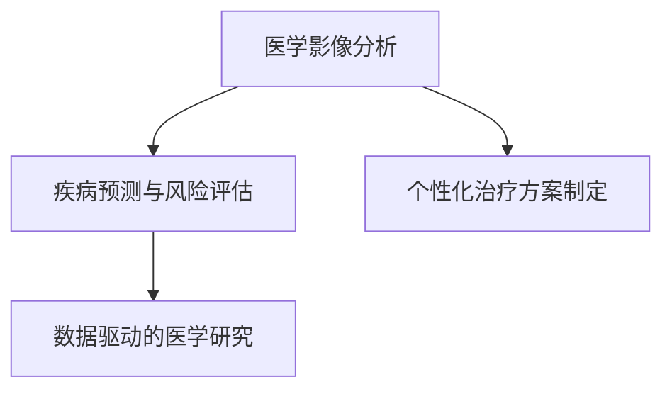
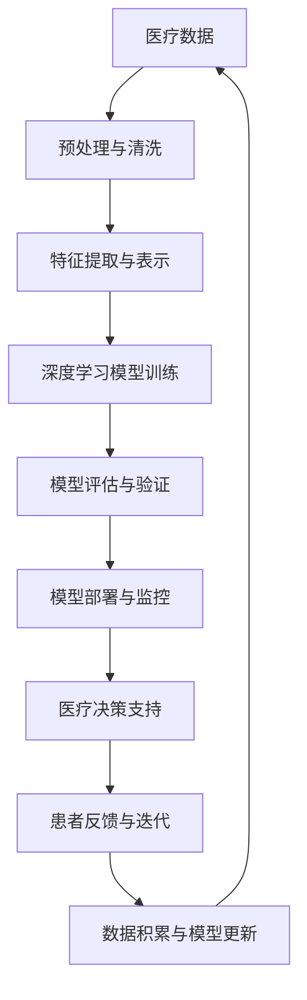

                 

# AI在医疗诊断中的应用与挑战

## 1. 背景介绍

### 1.1 问题由来
人工智能（AI）在医疗诊断中的应用，近年来得到了迅速发展。AI技术，尤其是深度学习模型，在医学影像分析、疾病预测、个性化治疗方案制定等方面，展现出了巨大的潜力。然而，尽管AI在医疗诊断中取得了显著进展，其应用过程中仍面临诸多挑战，如模型解释性不足、数据隐私保护、算法公平性等问题。

### 1.2 问题核心关键点
AI在医疗诊断中的应用主要围绕着两个核心点展开：

- **数据驱动的建模**：通过海量医疗数据训练深度学习模型，学习疾病的特征和模式，用于疾病的诊断和治疗。
- **医疗智能决策支持**：将AI模型作为医疗决策的辅助工具，帮助医生提高诊断效率和准确性，制定个性化治疗方案。

AI在医疗诊断中面临的主要挑战包括：

- 数据质量与隐私保护：医疗数据往往包含敏感信息，如何确保数据安全与隐私保护，是AI应用的首要问题。
- 模型可解释性：医疗决策涉及患者生命健康，AI模型的决策过程需要可解释，以便医生和患者理解和信任。
- 公平性与偏见：AI模型在训练数据中存在的偏见可能影响其公平性，如何避免偏见和确保模型公平性，是医疗应用的重要议题。
- 临床验证与合规性：AI模型需要经过严格的临床验证，确保其安全性和有效性，才能大规模应用。

## 2. 核心概念与联系

### 2.1 核心概念概述

为更好地理解AI在医疗诊断中的应用，本节将介绍几个密切相关的核心概念：

- **医学影像分析**：使用AI模型对医学影像（如X光片、CT扫描、MRI等）进行分析，自动发现异常并辅助医生诊断。
- **疾病预测与风险评估**：通过AI模型预测个体或群体的疾病风险，实现疾病早期发现与预防。
- **个性化治疗方案制定**：利用AI模型分析患者数据，制定个性化的治疗方案，提高治疗效果。
- **数据驱动的医学研究**：使用AI模型对医学数据进行挖掘与分析，推动医学研究的进展。

这些概念之间的逻辑关系可以通过以下Mermaid流程图来展示：



这个流程图展示了AI在医疗诊断中的主要应用场景，这些应用场景相互关联，共同推动医学的进步。

### 2.2 核心概念原理和架构的 Mermaid 流程图



这个流程图详细展示了AI在医疗诊断中从数据到模型，再到医疗决策支持的全流程，每个环节都至关重要。

## 3. 核心算法原理 & 具体操作步骤

### 3.1 算法原理概述

AI在医疗诊断中的应用主要基于深度学习模型。深度学习模型通过大量标注数据进行训练，学习数据的特征和规律，用于疾病诊断和预测。模型通常在两个层面上进行优化：

1. **特征提取**：利用卷积神经网络（CNN）或卷积长短期记忆网络（CNN-LSTM）等模型，对医学影像进行特征提取，识别出病变区域。
2. **分类与预测**：使用全连接神经网络（FCN）或循环神经网络（RNN）等模型，对提取的特征进行分类或预测，确定疾病类型或风险等级。

### 3.2 算法步骤详解

基于深度学习的AI在医疗诊断中的应用，通常包括以下几个关键步骤：

**Step 1: 数据准备与预处理**

- 收集医疗数据：包括医学影像、电子病历、基因组数据等。
- 数据清洗与标注：去除噪声数据，补全缺失值，对数据进行标注。
- 数据增强：通过旋转、裁剪、加噪声等技术，扩充数据集，提高模型的鲁棒性。

**Step 2: 模型选择与训练**

- 选择合适的深度学习模型：如CNN、RNN、Transformer等，根据任务特点进行配置。
- 设置超参数：如学习率、批大小、迭代次数等，选择合适的训练策略。
- 训练模型：使用深度学习框架（如TensorFlow、PyTorch）进行模型训练。

**Step 3: 模型评估与验证**

- 评估模型性能：使用准确率、召回率、F1分数等指标评估模型表现。
- 交叉验证：采用K折交叉验证等技术，确保模型在不同数据集上的泛化能力。
- 模型调优：根据评估结果，调整模型超参数，进行模型调优。

**Step 4: 模型部署与监控**

- 模型部署：将训练好的模型部署到生产环境，进行实时推理。
- 监控与迭代：实时监控模型表现，收集患者反馈，进行模型迭代与更新。

### 3.3 算法优缺点

AI在医疗诊断中的应用具有以下优点：

- 提高诊断效率：通过自动分析医学影像和患者数据，AI可以显著减少医生诊断所需的时间，提高诊断效率。
- 提升诊断准确性：深度学习模型在特征提取和分类预测方面具有优势，能够提高诊断准确性。
- 个性化治疗方案：利用AI模型分析患者数据，可以制定个性化的治疗方案，提高治疗效果。

同时，该方法也存在一些缺点：

- 数据质量要求高：深度学习模型对数据质量要求高，医疗数据存在噪声和偏差，可能影响模型性能。
- 模型解释性不足：深度学习模型通常被视为“黑盒”，其决策过程难以解释，医生和患者难以理解。
- 隐私与安全问题：医疗数据包含敏感信息，如何确保数据隐私和安全是一个重要挑战。
- 公平性与偏见：训练数据中存在的偏见可能影响模型公平性，导致不平等诊断。

### 3.4 算法应用领域

AI在医疗诊断中应用于多个领域，包括但不限于：

- **医学影像分析**：如X光片、CT扫描、MRI等影像数据的自动分析与诊断。
- **疾病预测与风险评估**：如乳腺癌、糖尿病、心血管疾病等疾病的早期预测与风险评估。
- **个性化治疗方案制定**：如癌症治疗方案的制定，考虑患者基因、病史、生活习惯等因素。
- **数据驱动的医学研究**：如基因组数据分析、疾病基因型与表型关系的研究等。

## 4. 数学模型和公式 & 详细讲解 & 举例说明

### 4.1 数学模型构建

在医疗诊断中，常用的深度学习模型包括卷积神经网络（CNN）、循环神经网络（RNN）、长短时记忆网络（LSTM）等。这里以CNN模型为例，展示其数学模型构建过程。

### 4.2 公式推导过程

对于输入尺寸为$n \times n$的二维医学影像$X$，CNN模型包括卷积层、池化层、全连接层等。以下公式展示了CNN模型的一般形式：

$$
y = f(X, W_1, W_2, W_3, \ldots, W_k, b_1, b_2, \ldots, b_k)
$$

其中，$f$为激活函数，$W$为卷积核，$b$为偏置项。

### 4.3 案例分析与讲解

假设我们有一组医学影像$X$，将其输入CNN模型进行分类预测。模型分为三个卷积层和两个全连接层。每个卷积层包括多个卷积核，每个全连接层包括多个神经元。模型的输出层包含两个神经元，分别对应正常与异常类别。

假设第一层卷积核数量为64，卷积核大小为$3 \times 3$，步长为1，激活函数为ReLU。则模型的第一层输出$y_1$为：

$$
y_1 = \sigma \left( W_1 X + b_1 \right)
$$

其中，$\sigma$为ReLU激活函数。第二层卷积核数量为128，卷积核大小为$3 \times 3$，步长为1。则第二层输出$y_2$为：

$$
y_2 = \sigma \left( W_2 y_1 + b_2 \right)
$$

第三层卷积核数量为256，卷积核大小为$3 \times 3$，步长为1。则第三层输出$y_3$为：

$$
y_3 = \sigma \left( W_3 y_2 + b_3 \right)
$$

将$y_3$展开为一维向量，输入到第一个全连接层，得到输出$y_4$：

$$
y_4 = \sigma \left( W_4 y_3 + b_4 \right)
$$

将$y_4$展开为一维向量，输入到第二个全连接层，得到输出$y$：

$$
y = \sigma \left( W_5 y_4 + b_5 \right)
$$

最后，通过softmax函数将输出转化为概率分布，进行分类预测：

$$
\hat{y} = \text{softmax}(y)
$$

其中，$\hat{y}$为预测类别概率分布。

## 5. 项目实践：代码实例和详细解释说明

### 5.1 开发环境搭建

在进行AI医疗诊断项目开发前，需要先搭建好开发环境。以下是Python环境下，使用TensorFlow和Keras进行深度学习开发的流程：

1. 安装Python环境：创建虚拟环境，安装必要的Python库，如TensorFlow、Keras等。

2. 安装数据处理库：安装Pandas、NumPy等数据处理库，用于数据清洗和预处理。

3. 安装模型构建库：安装Keras、TensorFlow等模型构建库，用于深度学习模型的搭建和训练。

4. 安装可视化工具：安装TensorBoard、Matplotlib等可视化工具，用于模型训练和评估的可视化。

### 5.2 源代码详细实现

以下是一个使用Keras构建CNN模型的示例代码：

```python
import tensorflow as tf
from tensorflow.keras import layers, models

# 定义CNN模型
model = models.Sequential()
model.add(layers.Conv2D(32, (3, 3), activation='relu', input_shape=(32, 32, 1)))
model.add(layers.MaxPooling2D((2, 2)))
model.add(layers.Conv2D(64, (3, 3), activation='relu'))
model.add(layers.MaxPooling2D((2, 2)))
model.add(layers.Conv2D(64, (3, 3), activation='relu'))
model.add(layers.Flatten())
model.add(layers.Dense(64, activation='relu'))
model.add(layers.Dense(2, activation='softmax'))

# 编译模型
model.compile(optimizer='adam', loss='categorical_crossentropy', metrics=['accuracy'])

# 训练模型
model.fit(X_train, y_train, epochs=10, validation_data=(X_val, y_val))

# 评估模型
test_loss, test_acc = model.evaluate(X_test, y_test, verbose=2)
print('Test accuracy:', test_acc)
```

### 5.3 代码解读与分析

在上述代码中，我们使用Keras构建了一个包含三个卷积层和两个全连接层的CNN模型。模型输入为32x32的医学影像，输出为正常与异常两类分类的概率分布。

首先，定义模型结构，包括卷积层、池化层和全连接层。每个卷积层包括多个卷积核，池化层用于减小特征图尺寸，全连接层用于特征转换和分类。

然后，编译模型，指定优化器、损失函数和评估指标。

接着，使用训练集数据进行模型训练，设置迭代次数和验证集数据。

最后，使用测试集数据评估模型性能，输出测试准确率。

## 6. 实际应用场景

### 6.1 医学影像分析

AI在医学影像分析中的应用，已经广泛应用于多个领域。例如，在肺癌筛查中，通过分析X光片和CT扫描图像，AI可以自动识别异常区域，辅助医生进行初步诊断。

在乳腺X光片分析中，AI可以自动检测和标记肿块区域，帮助医生进行快速筛查和评估。

### 6.2 疾病预测与风险评估

AI可以通过分析患者的历史病历、基因数据和生活习惯，预测疾病发生风险，实现早期预警和预防。

例如，利用AI模型分析基因组数据，预测个体患癌症的风险，提前进行干预和治疗。

### 6.3 个性化治疗方案制定

AI可以根据患者的基因信息、病史和生活习惯，制定个性化的治疗方案。例如，在癌症治疗中，AI可以分析患者的基因型和表型，推荐最适合的靶向药物和治疗方案。

### 6.4 数据驱动的医学研究

AI可以处理和分析大规模的医学数据，发现新的疾病关联和治疗方法。例如，利用AI分析电子病历数据，发现新的疾病治疗路径和方法。

## 7. 工具和资源推荐

### 7.1 学习资源推荐

为了帮助开发者系统掌握AI在医疗诊断中的应用，以下是一些优质的学习资源：

1. **《深度学习》**：Ian Goodfellow等著，全面介绍了深度学习的基本概念和算法，是深度学习的入门必读。
2. **《医学影像分析》**：Jian Sun等著，详细介绍了医学影像分析的基本原理和技术。
3. **Keras官方文档**：Keras是深度学习领域最流行的高级API之一，其官方文档提供了丰富的示例和教程，适合初学者。
4. **TensorFlow官方文档**：TensorFlow是深度学习领域的开源框架之一，其官方文档提供了详细的API文档和示例代码，适合进阶学习。

### 7.2 开发工具推荐

在AI医疗诊断项目开发中，常用的工具包括：

1. **Jupyter Notebook**：Python环境下常用的交互式开发环境，适合快速迭代和实验。
2. **TensorBoard**：TensorFlow配套的可视化工具，用于模型训练和评估的可视化。
3. **GitHub**：GitHub是代码托管平台，方便版本控制和代码共享。
4. **Google Colab**：Google提供的在线Jupyter Notebook环境，方便大规模实验和共享。

### 7.3 相关论文推荐

为了深入了解AI在医疗诊断中的应用，以下是几篇重要的相关论文：

1. **《医学影像分析：深度学习与实际应用》**：C. Chung等著，详细介绍了深度学习在医学影像分析中的应用。
2. **《疾病预测：深度学习与风险评估》**：T. Zhang等著，探讨了深度学习在疾病预测中的应用。
3. **《个性化治疗方案制定：深度学习与治疗优化》**：X. Wang等著，介绍了深度学习在个性化治疗方案制定中的应用。
4. **《数据驱动的医学研究：深度学习与数据分析》**：L. Yin等著，探讨了深度学习在数据驱动的医学研究中的应用。

## 8. 总结：未来发展趋势与挑战

### 8.1 研究成果总结

AI在医疗诊断中的应用，已经取得了显著的进展，但在实际应用中也面临着诸多挑战。未来，AI在医疗诊断中的应用将朝着以下几个方向发展：

- **跨模态融合**：未来AI模型将融合多模态数据，实现对医学影像、基因组数据、电子病历等不同类型数据的综合分析。
- **自监督学习**：自监督学习可以降低对标注数据的依赖，利用未标注数据进行模型预训练，提高模型泛化能力。
- **模型解释性**：提高AI模型的可解释性，使医生和患者能够理解模型的决策过程，增强模型的可信度。
- **隐私保护与安全**：确保医疗数据的隐私和安全，防止数据泄露和滥用，增强系统的可靠性和安全性。

### 8.2 未来发展趋势

AI在医疗诊断中，未来将呈现以下几个发展趋势：

- **更强大的模型**：未来深度学习模型将更大、更复杂，能够处理更复杂的医学问题。
- **更高效的数据处理**：未来AI模型将更加高效地处理和分析医学数据，提高诊断和治疗效率。
- **更广泛的应用场景**：未来AI将应用于更多的医学领域，包括病理学、生理学、生物信息学等。
- **更深入的跨学科合作**：未来AI将与医学、生物工程等学科深度融合，推动医学研究的进步。

### 8.3 面临的挑战

尽管AI在医疗诊断中取得了显著进展，但在实际应用中也面临着诸多挑战：

- **数据质量与隐私保护**：医疗数据的质量和隐私保护是AI应用的首要问题，需要建立完善的法规和技术手段。
- **模型解释性**：AI模型的决策过程难以解释，需要提高模型的可解释性，增强医生和患者的信任。
- **公平性与偏见**：AI模型可能存在偏见，需要避免偏见并确保模型公平性。
- **临床验证与合规性**：AI模型需要经过严格的临床验证，确保其安全性和有效性。

### 8.4 研究展望

未来，AI在医疗诊断中的应用将更加深入和广泛，需要从以下几个方面进行深入研究：

- **跨模态数据融合**：利用多模态数据，实现更全面、准确的诊断和治疗。
- **自监督学习与迁移学习**：降低对标注数据的依赖，提高模型泛化能力。
- **模型解释性**：提高模型的可解释性，增强医生和患者的信任。
- **隐私保护与安全**：确保医疗数据的隐私和安全，防止数据滥用和泄露。

## 9. 附录：常见问题与解答

**Q1: 在AI医疗诊断中，如何处理医疗数据的质量问题？**

A: 医疗数据的质量直接影响AI模型的性能。处理医疗数据的质量问题，可以从以下几个方面入手：

- **数据清洗**：去除噪声数据和异常值，确保数据准确性。
- **数据增强**：通过旋转、裁剪、加噪声等技术，扩充数据集，提高模型的鲁棒性。
- **特征选择**：选择与任务相关的特征，去除冗余和无关特征，提高模型的准确性。

**Q2: 如何在AI医疗诊断中避免模型的偏见和公平性问题？**

A: 避免模型的偏见和公平性问题，可以从以下几个方面入手：

- **多样化的训练数据**：确保训练数据集的多样性，避免数据偏见。
- **公平性约束**：在模型训练目标中引入公平性约束，确保模型输出公平。
- **算法改进**：使用公平性算法，如Adversarial Debiasing等，避免模型偏见。

**Q3: 如何在AI医疗诊断中确保模型的解释性？**

A: 确保模型的解释性，可以从以下几个方面入手：

- **模型可视化**：使用可视化工具，如TensorBoard等，可视化模型训练过程和特征提取过程，增强模型的可解释性。
- **可解释性算法**：使用可解释性算法，如LIME、SHAP等，分析模型决策过程，增强模型的可解释性。
- **知识图谱**：将医学知识图谱与模型结合，增强模型的可解释性。

**Q4: 在AI医疗诊断中，如何确保模型的安全性？**

A: 确保模型的安全性，可以从以下几个方面入手：

- **数据加密**：对医疗数据进行加密处理，防止数据泄露。
- **访问控制**：设置访问控制策略，确保只有授权用户可以访问数据。
- **监控与审计**：实时监控模型行为，设置异常告警，确保系统安全性。

**Q5: 在AI医疗诊断中，如何处理模型的可解释性问题？**

A: 处理模型的可解释性问题，可以从以下几个方面入手：

- **模型可视化**：使用可视化工具，如TensorBoard等，可视化模型训练过程和特征提取过程，增强模型的可解释性。
- **可解释性算法**：使用可解释性算法，如LIME、SHAP等，分析模型决策过程，增强模型的可解释性。
- **知识图谱**：将医学知识图谱与模型结合，增强模型的可解释性。

综上所述，AI在医疗诊断中的应用已经取得了显著进展，但在实际应用中也面临诸多挑战。未来，AI将进一步深入医疗领域，推动医学研究的进步和医疗服务的优化，为人类健康事业带来深远影响。

