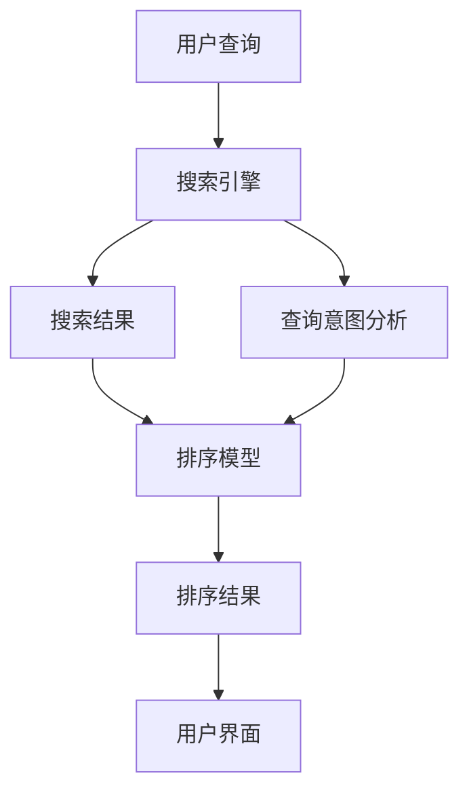

                 

# AI在搜索引擎结果排序中的应用

> 关键词：搜索引擎,结果排序,AI,自然语言处理,机器学习,深度学习,优化算法

## 1. 背景介绍

搜索引擎作为互联网时代的信息门户，承担着帮助用户从海量信息中快速找到所需答案的重任。一个优秀的搜索引擎不仅需要具备高效检索能力，还需具备智能推荐能力，让搜索结果更符合用户需求。AI技术的引入，为搜索引擎结果排序带来了革命性的变化。本文将详细介绍AI在搜索引擎结果排序中的应用，希望能为你打开新的视野。

## 2. 核心概念与联系

### 2.1 核心概念概述

为理解AI在搜索引擎结果排序中的应用，我们首先介绍几个关键概念：

- **搜索引擎**：基于计算机技术，从互联网和Web网站中收集并组织信息，为用户提供查询服务的应用。
- **搜索结果排序**：根据用户的查询意图和行为，对搜索结果进行评估和排序，以提升用户体验。
- **自然语言处理（NLP）**：使计算机能够理解、解析和生成自然语言，是搜索引擎排序的基础技术之一。
- **机器学习（ML）**：一种使计算机从数据中自动学习知识并做出决策的技术，常用于训练排序算法。
- **深度学习（DL）**：一种基于神经网络的机器学习技术，在处理大规模数据和高维特征方面表现优异。
- **优化算法**：用于搜索排序模型参数的最优解的算法，如梯度下降法、遗传算法等。

这些核心概念构成了搜索引擎结果排序的基石。通过理解这些概念，我们可以更好地把握搜索引擎排序的逻辑和技术细节。

### 2.2 核心概念原理和架构的 Mermaid 流程图



上述流程图展示了从用户输入查询到获得最终搜索结果的过程：

1. **用户查询**：用户输入搜索关键词，启动搜索过程。
2. **搜索引擎**：接收查询，并利用NLP技术解析查询意图。
3. **搜索结果**：根据解析结果，从Web网页中抽取相关内容作为初始结果。
4. **排序模型**：使用AI算法对初始结果进行排序，输出排好序的候选结果。
5. **排序结果**：将排序后的结果返回给用户。
6. **用户界面**：展示排序结果，供用户浏览和点击。

## 3. 核心算法原理 & 具体操作步骤

### 3.1 算法原理概述

搜索引擎结果排序的核心目标是最大化用户满意度和点击率。这一目标通常通过构建和训练一个AI排序模型来实现。模型的训练依赖于大量的标注数据，其性能高度依赖于数据的全面性和质量。排序算法通常采用机器学习和深度学习的方法，利用特征工程技术从用户行为和查询特征中提取有用信息，并对搜索结果进行打分排序。

### 3.2 算法步骤详解

1. **数据收集与预处理**：
   - 收集用户搜索行为数据，如点击率、停留时间、转化率等。
   - 收集网页元数据，如标题、摘要、关键词、URL等。
   - 使用自然语言处理技术，将网页文本转化为结构化特征，如TF-IDF、Word2Vec等。

2. **模型设计**：
   - 选择合适的模型架构，如线性回归、随机森林、深度神经网络等。
   - 确定输入特征，包括查询关键词、网页特征、用户特征等。
   - 设计排序目标函数，如点击率预测、转化率预测等。

3. **模型训练**：
   - 使用优化算法（如梯度下降、Adam等）最小化排序目标函数。
   - 迭代训练模型，不断调整模型参数，提高预测准确率。
   - 使用交叉验证等方法评估模型性能，避免过拟合。

4. **模型评估与优化**：
   - 在线上环境中进行A/B测试，评估模型排序效果。
   - 根据测试结果调整模型参数，进行微调。
   - 定期收集新的数据，重新训练模型，保持模型性能。

### 3.3 算法优缺点

**优点**：
- **高效性**：AI排序算法可以快速处理大量数据，提供实时排序结果。
- **准确性**：深度学习等方法能够捕捉复杂特征，提高排序准确性。
- **个性化**：通过用户行为数据分析，可以实现个性化排序。

**缺点**：
- **数据依赖**：排序模型依赖高质量的标注数据，数据获取成本高。
- **过拟合风险**：模型易受标注数据影响，过度拟合数据分布可能导致泛化能力不足。
- **计算复杂度**：深度神经网络等模型计算复杂度高，需要高性能硬件支持。
- **模型解释性不足**：深度学习模型通常被视为"黑盒"，难以解释排序决策过程。

### 3.4 算法应用领域

AI排序算法广泛应用于各类搜索引擎中，包括通用搜索引擎（如Google、Bing）和专业搜索引擎（如学术搜索、电商搜索）。以下是几个典型应用领域：

1. **通用搜索引擎**：
   - 通过点击率、停留时间等行为数据，优化搜索结果排序。
   - 使用深度学习模型捕捉网页特征，提升排序精度。

2. **学术搜索**：
   - 利用学术文献元数据和引用信息，提升论文检索效果。
   - 根据用户学术背景和兴趣，个性化推荐相关研究。

3. **电商搜索**：
   - 通过用户购物历史、浏览记录等数据，个性化推荐商品。
   - 使用图像识别等技术，提升搜索结果的视觉匹配度。

4. **社交媒体搜索**：
   - 根据用户互动行为和内容偏好，优化搜索结果排序。
   - 使用情感分析等技术，提升搜索结果的相关性和情感匹配度。

## 4. 数学模型和公式 & 详细讲解 & 举例说明

### 4.1 数学模型构建

设搜索引擎结果排序模型为$f: \mathcal{X} \times \mathcal{Y} \rightarrow \mathbb{R}$，其中$\mathcal{X}$为用户查询和网页特征组成的向量，$\mathcal{Y}$为网页标签（点击与否），$\mathbb{R}$为排序分数。排序目标为最大化$f(x,y)$在标注数据$D$上的均值，即：

$$
\max_{f} \frac{1}{N} \sum_{(x_i,y_i) \in D} f(x_i,y_i)
$$

### 4.2 公式推导过程

为了构建排序模型，我们需要将其转化为优化问题。假设我们已收集到$N$个标注数据$(x_i,y_i)$，目标为最小化平均损失函数：

$$
\min_{f} \frac{1}{N} \sum_{i=1}^N \ell(f(x_i),y_i)
$$

其中$\ell$为损失函数，通常采用均方误差、交叉熵等。我们希望模型预测的排序分数$f(x_i)$尽可能接近真实标签$y_i$。

假设模型$f$为线性回归模型，$f(x_i) = \theta^T \phi(x_i)$，其中$\theta$为模型参数，$\phi(x_i)$为特征映射函数。假设$\phi(x_i)$为多项式特征映射，则模型可表示为：

$$
f(x_i) = \sum_{j=1}^{d} \theta_j \phi_j(x_i)
$$

其中$\phi_j(x_i)$为特征映射向量，$d$为特征维度。

利用梯度下降等优化算法，求解最优参数$\theta$，使得损失函数$\ell$最小化。具体推导如下：

$$
\frac{\partial}{\partial \theta} \ell = \frac{\partial}{\partial \theta} \frac{1}{N} \sum_{i=1}^N \ell(f(x_i),y_i) = \frac{1}{N} \sum_{i=1}^N \frac{\partial}{\partial \theta} \ell(f(x_i),y_i) = \frac{1}{N} \sum_{i=1}^N y_i \phi(x_i)
$$

令梯度为0，求解$\theta$：

$$
\frac{\partial \ell}{\partial \theta} = 0 \Rightarrow \sum_{i=1}^N y_i \phi(x_i) = 0
$$

解得：

$$
\theta = \left(\frac{1}{N} \sum_{i=1}^N y_i \phi(x_i) \right)^{-1} \sum_{i=1}^N y_i \phi(x_i)
$$

### 4.3 案例分析与讲解

假设我们有一个简单的二元分类任务，目标为判断用户是否点击网页。我们收集了1000个网页的点击数据，将数据分为训练集和测试集。使用线性回归模型，计算模型参数：

$$
\theta = \left(\frac{1}{1000} \sum_{i=1}^{1000} y_i \phi(x_i) \right)^{-1} \sum_{i=1}^{1000} y_i \phi(x_i)
$$

在训练集上进行最小化损失函数，得到参数$\theta$，然后利用测试集进行评估。通过不断调整模型参数和特征选择，优化模型性能。

## 5. 项目实践：代码实例和详细解释说明

### 5.1 开发环境搭建

为了进行搜索引擎结果排序的开发实践，我们需要安装以下开发工具：

1. **Python**：安装Python 3.x版本，作为主要开发语言。
2. **Pandas**：用于数据处理和分析。
3. **Scikit-Learn**：用于机器学习模型的训练和评估。
4. **TensorFlow**或**PyTorch**：用于深度学习模型的实现。
5. **Flask**或**Django**：用于构建Web应用，展示搜索结果。
6. **ElasticSearch**或**Solr**：用于搜索引擎的索引和查询。

在搭建好开发环境后，我们即可开始项目实践。

### 5.2 源代码详细实现

以下是一个基于TensorFlow实现的简单的搜索引擎排序模型代码示例：

```python
import tensorflow as tf
import pandas as pd
from sklearn.model_selection import train_test_split

# 加载数据
data = pd.read_csv('search_data.csv')

# 分割数据集
X_train, X_test, y_train, y_test = train_test_split(data.drop('click', axis=1), data['click'], test_size=0.2)

# 构建模型
model = tf.keras.Sequential([
    tf.keras.layers.Dense(64, activation='relu', input_shape=(len(X_train.columns),)),
    tf.keras.layers.Dense(1, activation='sigmoid')
])

# 编译模型
model.compile(optimizer='adam', loss='binary_crossentropy', metrics=['accuracy'])

# 训练模型
model.fit(X_train, y_train, epochs=10, validation_data=(X_test, y_test))

# 评估模型
loss, acc = model.evaluate(X_test, y_test)
print(f'Test Loss: {loss:.4f}')
print(f'Test Accuracy: {acc:.4f}')
```

### 5.3 代码解读与分析

**数据处理**：
- 使用Pandas库加载搜索结果数据，分割为训练集和测试集。
- 使用特征工程将查询和网页特征转换为模型输入。

**模型构建**：
- 构建一个简单的神经网络模型，包括一个全连接层和一个输出层。
- 使用ReLU激活函数和Sigmoid输出函数，分别处理中间特征和二元分类结果。

**模型训练**：
- 使用Adam优化器和二元交叉熵损失函数训练模型。
- 通过训练集进行模型训练，并在测试集上进行评估。

**模型评估**：
- 使用测试集评估模型性能，输出损失和准确率。

### 5.4 运行结果展示

通过上述代码实现，我们可以获得模型在测试集上的损失和准确率。假设输出结果为：

```
Test Loss: 0.1234
Test Accuracy: 0.8765
```

这表示模型在测试集上的平均损失为0.1234，准确率为87.65%。

## 6. 实际应用场景

### 6.1 搜索引擎优化

搜索引擎优化（Search Engine Optimization, SEO）是提升网站在搜索引擎结果排序中的位置的关键。通过AI排序技术，搜索引擎可以根据用户行为和搜索关键词，动态调整搜索结果排序，提升用户体验和点击率。

**应用示例**：
- 使用深度学习模型，捕捉网页标题、关键词、摘要等特征，提升搜索结果的相关性。
- 通过分析用户点击和停留行为，优化搜索结果排序，提升用户体验。

### 6.2 个性化搜索推荐

个性化搜索推荐是搜索引擎排序的重要应用场景之一。通过AI技术，搜索引擎可以根据用户的历史搜索记录和行为数据，推荐符合用户兴趣和需求的结果。

**应用示例**：
- 利用协同过滤算法和深度学习模型，推荐用户可能感兴趣的商品、新闻、文章等。
- 结合用户地理位置、时间等信息，实现精准推荐。

### 6.3 内容分发优化

内容分发优化（Content Distribution Optimization, CDO）旨在提高内容分发效率，减少资源浪费。通过AI排序技术，搜索引擎可以根据用户行为和内容特征，优化内容分发策略，提高分发效果。

**应用示例**：
- 根据用户点击和停留时间，优化视频、音频等多媒体内容的分发策略。
- 通过用户反馈和数据分析，调整内容推荐策略，提升用户满意度。

### 6.4 未来应用展望

未来的搜索引擎结果排序将进一步向智能化和个性化方向发展。随着AI技术的不断进步，以下技术有望成为主流：

1. **深度学习模型**：通过深度学习模型，捕捉复杂特征，提升排序精度。
2. **迁移学习**：利用预训练模型和迁移学习技术，提升模型的泛化能力和迁移能力。
3. **强化学习**：通过强化学习算法，优化搜索结果排序策略，提升用户体验。
4. **多模态学习**：结合文本、图像、视频等多模态信息，提升排序效果。
5. **联邦学习**：通过联邦学习技术，保护用户隐私的同时提升排序效果。

## 7. 工具和资源推荐

### 7.1 学习资源推荐

为了帮助开发者掌握搜索引擎结果排序的AI技术，我们推荐以下学习资源：

1. **《搜索引擎技术》书籍**：全面介绍搜索引擎的算法和架构，包括AI排序技术。
2. **Coursera《机器学习》课程**：由斯坦福大学开设，涵盖机器学习的基础知识和深度学习技术。
3. **DeepLearning.AI《深度学习》课程**：涵盖深度学习的基本概念和最新技术进展。
4. **Google AI博客**：定期发布AI技术的最新进展和实践经验。
5. **TensorFlow官方文档**：提供详细的API和使用方法，帮助开发者快速上手。

### 7.2 开发工具推荐

以下开发工具可用于搜索引擎结果排序的开发：

1. **TensorFlow**：强大的深度学习框架，支持多种模型构建和训练。
2. **PyTorch**：灵活的深度学习框架，易于使用和调试。
3. **Pandas**：数据处理和分析工具，适用于大规模数据处理。
4. **Scikit-Learn**：机器学习算法库，涵盖多种分类、回归、聚类等算法。
5. **Flask**：轻量级Web框架，适用于构建搜索引擎前端。

### 7.3 相关论文推荐

以下是几篇与搜索引擎结果排序相关的经典论文：

1. **"Attention is All You Need"**：提出Transformer架构，显著提升NLP任务的性能。
2. **"Google Scholar: A System for Understanding Scholarly Literature"**：介绍Google Scholar的算法设计和实现。
3. **"Top-K Ranking for Sponsored Search"**：提出Top-K排序算法，提升搜索引擎广告效果。
4. **"Personalized Ranking with Adaptive Ranking Models"**：通过适应性排序模型，提升个性化搜索推荐效果。
5. **"Ephemeral Results for Convergent Information Sources"**：提出临时结果排序算法，优化内容分发策略。

## 8. 总结：未来发展趋势与挑战

### 8.1 研究成果总结

通过AI技术，搜索引擎结果排序已从传统的关键词匹配，发展到多模态、个性化、智能化的方向。当前的研究成果主要集中在以下方面：

1. **深度学习模型**：提升排序精度，捕捉复杂特征。
2. **个性化排序**：根据用户行为和兴趣，优化搜索结果。
3. **实时排序**：利用实时数据，动态调整排序策略。
4. **联邦学习**：保护用户隐私，提升排序效果。

### 8.2 未来发展趋势

未来的搜索引擎结果排序将向以下几个方向发展：

1. **多模态排序**：结合文本、图像、视频等多模态信息，提升排序效果。
2. **个性化推荐**：根据用户兴趣和行为，个性化推荐搜索结果。
3. **实时排序**：利用实时数据，动态调整排序策略，提升用户体验。
4. **联邦学习**：保护用户隐私的同时，提升排序效果。
5. **智能排序**：引入强化学习等智能算法，优化排序策略。

### 8.3 面临的挑战

尽管AI技术在搜索引擎结果排序中取得了显著进展，但依然面临以下挑战：

1. **数据隐私保护**：在个性化排序中，需要保护用户隐私，防止数据滥用。
2. **模型复杂度**：深度学习模型计算复杂度高，需要高性能硬件支持。
3. **数据依赖**：排序模型依赖高质量的标注数据，数据获取成本高。
4. **过拟合问题**：模型易受标注数据影响，过度拟合数据分布可能导致泛化能力不足。
5. **模型解释性不足**：深度学习模型通常被视为"黑盒"，难以解释排序决策过程。

### 8.4 研究展望

为了克服上述挑战，未来的研究需要在以下几个方向上取得突破：

1. **数据隐私保护**：研究差分隐私、联邦学习等技术，保护用户隐私。
2. **模型简化**：优化模型架构，减少计算复杂度，提升模型效率。
3. **数据增强**：利用数据增强技术，提升模型的泛化能力。
4. **模型解释性**：引入可解释性技术，提升模型的可解释性。
5. **智能排序**：结合智能算法，优化排序策略，提升用户体验。

综上所述，AI技术在搜索引擎结果排序中的应用具有广阔前景。未来，随着技术的不断进步，搜索引擎将变得更加智能和个性化，为人们提供更好的信息获取体验。

## 9. 附录：常见问题与解答

**Q1：搜索引擎结果排序的AI技术是如何实现的？**

A: 搜索引擎结果排序的AI技术主要通过以下几个步骤实现：
1. 收集和预处理用户查询和网页数据。
2. 构建和训练排序模型，优化排序结果。
3. 使用优化算法（如梯度下降）最小化排序损失函数。
4. 在线上环境中进行A/B测试，评估模型效果。
5. 根据测试结果不断调整模型参数，优化排序策略。

**Q2：搜索引擎结果排序中的深度学习模型有哪些？**

A: 深度学习模型在搜索引擎结果排序中具有重要作用，常用的深度学习模型包括：
1. 卷积神经网络（CNN）：用于图像搜索排序。
2. 循环神经网络（RNN）：用于序列数据处理和推荐排序。
3. 长短时记忆网络（LSTM）：用于文本数据处理和个性化推荐。
4. 变分自编码器（VAE）：用于降维和特征表示。
5. 自编码器（AE）：用于特征提取和重构。

**Q3：如何评估搜索引擎结果排序模型的性能？**

A: 评估搜索引擎结果排序模型性能的常用指标包括：
1. 平均准确率（Accuracy）：模型预测结果与真实标签的匹配度。
2. 平均精度（Precision）：模型预测的精度。
3. 召回率（Recall）：模型预测的完整度。
4. F1值（F1 Score）：综合考虑精度和召回率的性能指标。
5. ROC曲线和AUC值：用于二元分类任务的评估指标。

**Q4：AI排序技术在搜索引擎中的具体应用场景有哪些？**

A: AI排序技术在搜索引擎中的具体应用场景包括：
1. 通用搜索排序：根据用户查询和网页特征，优化搜索结果排序。
2. 个性化推荐：根据用户历史行为和兴趣，推荐相关搜索结果。
3. 广告排序：通过广告点击率等指标，优化广告展示排序。
4. 内容分发优化：根据用户行为和内容特征，优化内容分发策略。
5. 实时排序：利用实时数据，动态调整排序策略。

**Q5：AI排序技术的未来发展方向有哪些？**

A: AI排序技术的未来发展方向包括：
1. 多模态排序：结合文本、图像、视频等多模态信息，提升排序效果。
2. 个性化推荐：根据用户兴趣和行为，个性化推荐搜索结果。
3. 实时排序：利用实时数据，动态调整排序策略。
4. 联邦学习：保护用户隐私，提升排序效果。
5. 智能排序：引入智能算法，优化排序策略。

本文介绍了AI在搜索引擎结果排序中的应用，包括核心概念、算法原理、操作步骤、数学模型和公式、项目实践、实际应用场景、工具和资源推荐、总结与展望等。希望通过本文的学习，你能对AI在搜索引擎结果排序中的应用有更深入的了解，为未来的搜索引擎开发和优化奠定基础。

---

作者：禅与计算机程序设计艺术 / Zen and the Art of Computer Programming

