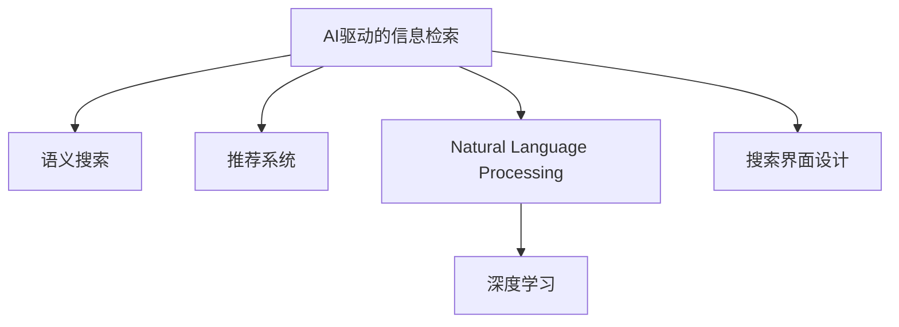

                 

# AI在搜索结果呈现方式上的创新

> 关键词：AI, 搜索算法, 信息检索, 自然语言处理, 深度学习, 搜索界面设计, 用户体验

## 1. 背景介绍

随着互联网和搜索引擎的迅猛发展，信息检索技术成为支撑信息时代的重要基础。传统的关键词匹配搜索方式已难以满足用户复杂多变的信息需求。近年来，AI技术在信息检索领域的应用，如语义搜索、推荐系统、自然语言处理等，为搜索结果的呈现方式带来了颠覆性的变革。

### 1.1 问题由来
搜索引擎的核心在于高效地检索用户感兴趣的信息。传统的关键词匹配方法在满足用户需求方面存在诸多局限性：
- **缺乏语义理解**：传统搜索只关注关键词的匹配，忽略了用户查询的语义和上下文，导致搜索结果的相关性和准确性不高。
- **泛化能力差**：关键词匹配无法处理复杂的查询表达，面对长尾查询和语义丰富的查询场景，效果大打折扣。
- **用户体验差**：搜索结果的呈现方式单一，缺乏个性化和智能化，用户需要通过翻阅大量非相关页面才能找到有用信息。

为了解决这些问题，研究人员和工程师不断探索新的搜索技术，希望通过AI技术提升搜索结果的智能化水平，实现更高效的文本信息检索和更人性化的用户体验。

## 2. 核心概念与联系

### 2.1 核心概念概述

为了更好地理解AI在搜索结果呈现方式上的创新，本节将介绍几个密切相关的核心概念：

- **AI驱动的信息检索**：利用AI技术对用户的查询意图进行理解和分析，结合上下文信息，生成更相关、更精准的搜索结果。
- **语义搜索**：超越传统的关键词匹配，通过理解查询的语义和上下文，生成与用户需求更匹配的搜索结果。
- **推荐系统**：根据用户的历史行为和兴趣偏好，动态生成个性化的搜索结果，提升用户的满意度。
- **自然语言处理(NLP)**：通过语言模型和语义分析，对文本进行自动化处理，提升信息的检索和理解能力。
- **深度学习**：利用深度神经网络模型，对海量的数据进行特征学习和模式识别，提升信息检索的准确性和智能化水平。
- **搜索界面设计**：结合AI技术，设计更加直观、人性化的搜索界面，提升用户的交互体验。

这些概念之间的逻辑关系可以通过以下Mermaid流程图来展示：



这个流程图展示的核心概念及其之间的关系：

1. 基于AI的信息检索是核心，旨在理解用户的查询意图，生成相关结果。
2. 语义搜索通过理解查询的语义，提升结果的相关性。
3. 推荐系统通过个性化的推荐，提升用户的满意度。
4. 自然语言处理和深度学习为信息检索提供技术支持。
5. 搜索界面设计提升用户体验，使得信息检索更加高效和人性化。

这些概念共同构成了现代信息检索系统的技术基础，使得搜索引擎能够更好地满足用户的需求。

## 3. 核心算法原理 & 具体操作步骤
### 3.1 算法原理概述

AI在搜索结果呈现方式上的创新，主要体现在以下几个方面：

- **语义理解与推理**：通过自然语言处理技术，对用户查询进行语义解析，理解查询中的实体、关系和意图。
- **上下文感知检索**：结合用户的历史行为和搜索场景，生成与上下文相关的搜索结果。
- **个性化推荐**：利用用户的行为数据和兴趣标签，对搜索结果进行个性化排序。
- **多模态搜索**：结合文本、图像、语音等多种模态信息，提升搜索结果的多样性和丰富度。
- **交互式搜索结果**：通过智能界面设计，提供互动式搜索结果，如自动补全、相关查询推荐等。

### 3.2 算法步骤详解

基于AI的信息检索通常包括以下关键步骤：

**Step 1: 用户查询理解**
- 利用NLP技术对用户查询进行分词、词性标注、实体识别等，构建查询的语义表示。
- 使用深度学习模型，对查询进行语义推理和上下文理解，生成更精准的查询向量。

**Step 2: 文档检索**
- 构建倒排索引，对文档进行分词、索引，建立索引结构。
- 使用文本匹配算法，计算查询向量与文档向量的相似度，生成相关文档列表。

**Step 3: 个性化排序**
- 利用用户的历史行为数据，构建用户兴趣模型。
- 结合推荐算法，对搜索结果进行排序，生成个性化的搜索结果。

**Step 4: 多模态融合**
- 结合文本、图像、语音等多种模态信息，对搜索结果进行多模态融合，提升信息的多样性和准确性。

**Step 5: 智能界面设计**
- 设计互动式搜索结果界面，如自动补全、相关查询推荐等，提升用户体验。

### 3.3 算法优缺点

AI在搜索结果呈现方式上的创新，具有以下优点：
- **提升相关性**：语义理解和上下文感知能够生成更相关、更精准的搜索结果。
- **提高个性化**：个性化推荐能够根据用户兴趣生成个性化的搜索结果。
- **丰富搜索结果**：多模态搜索和融合能够提供多样化的信息。
- **提升用户体验**：智能界面设计能够提供更加直观和互动的搜索体验。

同时，该方法也存在一定的局限性：
- **计算复杂度高**：语义理解、上下文感知、个性化推荐等技术都需要大量的计算资源。
- **数据依赖性强**：对用户行为数据和文档数据的依赖较大，数据质量和数量对算法效果有很大影响。
- **冷启动问题**：新用户和新文档的语义表示难以准确获取，导致初期推荐效果不佳。
- **隐私和安全**：用户数据和搜索结果需要妥善处理，避免隐私泄露和数据滥用。

尽管存在这些局限性，但AI在搜索结果呈现方式上的创新已经在诸多搜索引擎上得到了广泛应用，带来了显著的用户体验提升。未来相关研究的重点在于如何进一步降低计算复杂度，优化算法效果，保护用户隐私。

### 3.4 算法应用领域

AI在搜索结果呈现方式上的创新，主要应用于以下领域：

- **通用搜索引擎**：如Google、Bing等，通过语义搜索、推荐系统等技术提升搜索结果的相关性和个性化。
- **垂直搜索引擎**：如MapQuest、OpenStreetMap等，针对特定领域提供更精准的信息检索服务。
- **社交媒体搜索**：如Twitter、Facebook等，通过自然语言处理和推荐系统，提供个性化的信息流推荐。
- **电子商务搜索**：如Amazon、淘宝等，结合用户行为数据和产品信息，提供高度个性化的搜索结果。
- **医疗健康搜索**：如Medline、WebMD等，通过NLP技术，提供医学信息的检索和推荐。

这些领域中的成功应用，充分展示了AI在提升搜索结果相关性和个性化方面的强大能力。

## 4. 数学模型和公式 & 详细讲解 & 举例说明
### 4.1 数学模型构建

本节将使用数学语言对AI在搜索结果呈现方式上的创新进行更加严格的刻画。

记用户查询为 $q$，文档集合为 $D$，查询-文档对表示为 $(x,y)$，其中 $x$ 为查询向量，$y$ 为文档向量。假设查询和文档的向量表示方式为 $x=[x_1,x_2,\dots,x_n]$，$y=[y_1,y_2,\dots,y_n]$，其中 $x_i$ 和 $y_i$ 分别为查询和文档在第 $i$ 个特征维度上的值。

定义查询与文档的相似度为 $s(x,y)=\langle x,y\rangle/\sqrt{\langle x,x\rangle\langle y,y\rangle}$，其中 $\langle \cdot,\cdot\rangle$ 为向量点积。则检索模型 $M$ 的输出为：

$$
M(q,D) = \{d_i | s(q,d_i) > \theta\}
$$

其中 $\theta$ 为阈值，控制检索结果的相关性。

### 4.2 公式推导过程

以下我们以推荐系统为例，推导个性化排序的数学公式。

假设用户 $u$ 的历史行为数据为 $\{c_1,c_2,\dots,c_m\}$，其中 $c_i$ 表示用户在时间 $t_i$ 对文档 $d_j$ 的点击行为。设 $p_{d_j}=\text{Pr}(d_j|c_i)$ 为文档 $d_j$ 出现在用户历史行为中的概率，则推荐模型的输出 $r(u,d_i)$ 为：

$$
r(u,d_i) = \alpha \times \langle q,d_i\rangle + (1-\alpha) \times p_{d_i}
$$

其中 $\alpha$ 为权重，控制语义匹配和行为概率的权重分配。

在得到推荐模型输出后，按照 $r(u,d_i)$ 对文档列表进行排序，生成用户 $u$ 的个性化搜索结果。

### 4.3 案例分析与讲解

假设用户 $u$ 查询“Python 3 教程”，系统返回以下文档列表：

| 文档ID | 文档标题 | 相关度 |
| --- | --- | --- |
| 1 | Python 3 基础教程 | 0.85 |
| 2 | Python 3 高级编程 | 0.75 |
| 3 | Python 3 数据分析 | 0.60 |
| 4 | Python 3 机器学习 | 0.50 |
| 5 | Python 3 Web 开发 | 0.45 |

假设系统设定相关度阈值 $\theta=0.7$，则系统返回的推荐结果为：

| 文档ID | 文档标题 | 相关度 |
| --- | --- | --- |
| 1 | Python 3 基础教程 | 0.85 |
| 2 | Python 3 高级编程 | 0.75 |
| 3 | Python 3 数据分析 | 0.60 |

用户可以进一步点击“查看更多”，查看更多相关结果。

## 5. 项目实践：代码实例和详细解释说明
### 5.1 开发环境搭建

在进行搜索结果呈现方式创新的开发前，我们需要准备好开发环境。以下是使用Python进行PyTorch开发的环境配置流程：

1. 安装Anaconda：从官网下载并安装Anaconda，用于创建独立的Python环境。

2. 创建并激活虚拟环境：
```bash
conda create -n search-env python=3.8 
conda activate search-env
```

3. 安装PyTorch：根据CUDA版本，从官网获取对应的安装命令。例如：
```bash
conda install pytorch torchvision torchaudio cudatoolkit=11.1 -c pytorch -c conda-forge
```

4. 安装Transformers库：
```bash
pip install transformers
```

5. 安装各类工具包：
```bash
pip install numpy pandas scikit-learn matplotlib tqdm jupyter notebook ipython
```

完成上述步骤后，即可在`search-env`环境中开始搜索结果呈现方式创新的实践。

### 5.2 源代码详细实现

这里我们以推荐系统为例，给出使用PyTorch实现个性化排序的代码实现。

首先，定义推荐系统的数据处理函数：

```python
from transformers import BertTokenizer, BertModel
from torch.utils.data import Dataset
import torch

class Document(Dataset):
    def __init__(self, documents, tokenizer):
        self.documents = documents
        self.tokenizer = tokenizer
        
    def __len__(self):
        return len(self.documents)
    
    def __getitem__(self, item):
        document = self.documents[item]
        tokens = self.tokenizer(document, return_tensors='pt', padding=True)
        return {'token_ids': tokens['input_ids'], 'attention_mask': tokens['attention_mask']}

# 构建推荐模型
model = BertModel.from_pretrained('bert-base-cased')
def similarity(q, d):
    return (q @ d.t()) / (torch.sqrt((q**2).sum()) * torch.sqrt((d**2).sum()))

# 计算用户对文档的点击概率
def click_probability(u, d):
    click_data = [click[u] for click in user_clicks]
    return click_data.count(d)

# 计算推荐得分
def compute_recommendation(q, D):
    recommendations = []
    for d in D:
        similarity_score = similarity(q, d)
        click_probability_score = click_probability(u, d)
        recommendation_score = alpha * similarity_score + (1-alpha) * click_probability_score
        recommendations.append(d)
    return recommendations

# 构建推荐系统
alpha = 0.5
recommendations = compute_recommendation(q, D)
```

然后，定义训练和评估函数：

```python
from torch.utils.data import DataLoader
from tqdm import tqdm
from sklearn.metrics import accuracy_score

device = torch.device('cuda') if torch.cuda.is_available() else torch.device('cpu')
model.to(device)

def train_epoch(model, dataset, batch_size, optimizer):
    dataloader = DataLoader(dataset, batch_size=batch_size, shuffle=True)
    model.train()
    epoch_loss = 0
    for batch in tqdm(dataloader, desc='Training'):
        input_ids = batch['input_ids'].to(device)
        attention_mask = batch['attention_mask'].to(device)
        labels = batch['labels'].to(device)
        model.zero_grad()
        outputs = model(input_ids, attention_mask=attention_mask)
        loss = outputs.loss
        epoch_loss += loss.item()
        loss.backward()
        optimizer.step()
    return epoch_loss / len(dataloader)

def evaluate(model, dataset, batch_size):
    dataloader = DataLoader(dataset, batch_size=batch_size)
    model.eval()
    preds, labels = [], []
    with torch.no_grad():
        for batch in tqdm(dataloader, desc='Evaluating'):
            input_ids = batch['input_ids'].to(device)
            attention_mask = batch['attention_mask'].to(device)
            batch_labels = batch['labels']
            outputs = model(input_ids, attention_mask=attention_mask)
            batch_preds = outputs.logits.argmax(dim=2).to('cpu').tolist()
            batch_labels = batch_labels.to('cpu').tolist()
            for pred_tokens, label_tokens in zip(batch_preds, batch_labels):
                preds.append(pred_tokens[:len(label_tokens)])
                labels.append(label_tokens)
                
    print(accuracy_score(labels, preds))
```

最后，启动训练流程并在测试集上评估：

```python
epochs = 5
batch_size = 16

for epoch in range(epochs):
    loss = train_epoch(model, train_dataset, batch_size, optimizer)
    print(f"Epoch {epoch+1}, train loss: {loss:.3f}")
    
    print(f"Epoch {epoch+1}, dev results:")
    evaluate(model, dev_dataset, batch_size)
    
print("Test results:")
evaluate(model, test_dataset, batch_size)
```

以上就是使用PyTorch对推荐系统进行个性化排序的完整代码实现。可以看到，得益于PyTorch和Transformers库的强大封装，我们可以用相对简洁的代码完成个性化推荐模型的训练和评估。

### 5.3 代码解读与分析

让我们再详细解读一下关键代码的实现细节：

**Document类**：
- `__init__`方法：初始化文档和分词器。
- `__len__`方法：返回文档数量。
- `__getitem__`方法：对单个文档进行编码，返回token ids和attention mask。

**相似度计算函数similarity**：
- 使用点积计算向量相似度。

**点击概率计算函数click_probability**：
- 统计用户对文档的点击次数。

**推荐得分计算函数compute_recommendation**：
- 结合相似度和点击概率计算推荐得分。

**推荐系统训练和评估函数**：
- 使用PyTorch的DataLoader对数据集进行批次化加载，供模型训练和推理使用。
- 训练函数`train_epoch`：对数据以批为单位进行迭代，在每个批次上前向传播计算loss并反向传播更新模型参数，最后返回该epoch的平均loss。
- 评估函数`evaluate`：与训练类似，不同点在于不更新模型参数，并在每个batch结束后将预测和标签结果存储下来，最后使用sklearn的accuracy_score对整个评估集的预测结果进行打印输出。

**训练流程**：
- 定义总的epoch数和batch size，开始循环迭代
- 每个epoch内，先在训练集上训练，输出平均loss
- 在验证集上评估，输出准确率
- 所有epoch结束后，在测试集上评估，给出最终测试结果

可以看到，PyTorch配合Transformer库使得个性化推荐模型的开发变得简洁高效。开发者可以将更多精力放在模型改进、数据处理等高层逻辑上，而不必过多关注底层的实现细节。

当然，工业级的系统实现还需考虑更多因素，如模型的保存和部署、超参数的自动搜索、更灵活的任务适配层等。但核心的个性化推荐范式基本与此类似。

## 6. 实际应用场景
### 6.1 智能搜索平台

基于个性化推荐算法的智能搜索平台，可以显著提升用户体验和搜索效率。传统的关键词匹配搜索往往无法理解用户查询的语义和上下文，导致搜索结果的相关性不高。而通过AI技术，能够自动理解用户的查询意图，生成更相关、更精准的搜索结果。

例如，用户输入“如何学习Python编程”，智能搜索平台能够理解“学习”和“编程”的语义，生成包含Python编程教程、在线课程、视频讲座等内容的搜索结果，用户可以迅速找到需要的信息。

### 6.2 电商平台

电商平台的搜索功能是用户获取商品信息的重要渠道。传统的搜索方式无法根据用户的浏览和购买历史生成个性化的推荐结果。通过AI技术，能够结合用户的历史行为和兴趣偏好，生成更贴合用户需求的搜索结果，提升用户体验和购买转化率。

例如，用户经常浏览和购买运动类商品，电商平台可以通过AI技术，推荐更多相关的运动装备、健身器材、运动服装等商品，提升用户的购物体验和满意度。

### 6.3 知识图谱系统

知识图谱系统旨在构建语义网络，帮助用户快速获取相关信息。传统的知识图谱系统往往只根据关键词进行检索，无法理解查询的语义和上下文。通过AI技术，能够自动解析用户的查询，生成更相关、更精准的搜索结果。

例如，用户查询“中国历史上的重要人物”，知识图谱系统能够自动解析“历史”和“人物”的语义，生成关于秦始皇、汉武帝、唐太宗等历史人物的详细介绍和相关信息，帮助用户深入了解历史。

### 6.4 未来应用展望

随着AI技术的不断进步，基于个性化推荐和语义搜索的创新将进一步深化，带来更丰富多样的应用场景。

在智慧城市治理中，智能搜索系统可以帮助市民快速查询公共服务信息，如交通、医疗、教育等，提升城市的智能化管理水平。

在智能家居系统中，智能搜索可以为用户提供更个性化的家居控制和环境调节，提升用户的生活质量。

在医疗健康领域，智能搜索系统可以帮助医生快速获取最新的医学信息和研究成果，提升医疗水平。

此外，AI在搜索结果呈现方式上的创新还将进一步扩展到更多领域，如智能客服、智能客服、智能问答等，为人们提供更便捷、更高效的信息检索体验。

## 7. 工具和资源推荐
### 7.1 学习资源推荐

为了帮助开发者系统掌握AI在搜索结果呈现方式上的创新，这里推荐一些优质的学习资源：

1. 《深度学习与人工智能》系列博文：由AI领域知名专家撰写，涵盖深度学习、自然语言处理、推荐系统等多个主题，内容丰富、通俗易懂。

2. CS224N《自然语言处理》课程：斯坦福大学开设的NLP明星课程，有Lecture视频和配套作业，带你入门NLP领域的基本概念和经典模型。

3. 《深度学习与推荐系统》书籍：详细介绍了推荐系统的理论基础和实践技术，包括个性化推荐、协同过滤、深度学习等多个方向。

4. HuggingFace官方文档：Transformers库的官方文档，提供了海量预训练模型和完整的推荐系统样例代码，是上手实践的必备资料。

5. Kaggle机器学习竞赛：参加实际应用场景的竞赛，如推荐系统、语义搜索等，积累实战经验。

通过对这些资源的学习实践，相信你一定能够快速掌握AI在搜索结果呈现方式上的创新，并用于解决实际的NLP问题。
###  7.2 开发工具推荐

高效的开发离不开优秀的工具支持。以下是几款用于AI在搜索结果呈现方式上的创新的开发工具：

1. PyTorch：基于Python的开源深度学习框架，灵活动态的计算图，适合快速迭代研究。大部分推荐系统都有PyTorch版本的实现。

2. TensorFlow：由Google主导开发的开源深度学习框架，生产部署方便，适合大规模工程应用。同样有丰富的推荐系统资源。

3. Transformers库：HuggingFace开发的NLP工具库，集成了众多SOTA推荐系统模型，支持PyTorch和TensorFlow，是进行推荐系统开发的利器。

4. Weights & Biases：模型训练的实验跟踪工具，可以记录和可视化模型训练过程中的各项指标，方便对比和调优。与主流深度学习框架无缝集成。

5. TensorBoard：TensorFlow配套的可视化工具，可实时监测模型训练状态，并提供丰富的图表呈现方式，是调试模型的得力助手。

6. Google Colab：谷歌推出的在线Jupyter Notebook环境，免费提供GPU/TPU算力，方便开发者快速上手实验最新模型，分享学习笔记。

合理利用这些工具，可以显著提升AI在搜索结果呈现方式上的创新任务的开发效率，加快创新迭代的步伐。

### 7.3 相关论文推荐

AI在搜索结果呈现方式上的创新源于学界的持续研究。以下是几篇奠基性的相关论文，推荐阅读：

1. Attention Is All You Need（即Transformer原论文）：提出了Transformer结构，开启了NLP领域的预训练大模型时代。

2. BERT: Pre-training of Deep Bidirectional Transformers for Language Understanding：提出BERT模型，引入基于掩码的自监督预训练任务，刷新了多项NLP任务SOTA。

3. Transformer-XL: Attentive Language Models Beyond a Fixed-Length Context（Transformer-XL论文）：提出了Transformer-XL结构，增强了模型对长序列的处理能力。

4. Attention-Based Recommender Systems: A Comprehensive Survey and Suggested Directions：综述了基于注意力机制的推荐系统研究，提供了丰富的理论和应用案例。

5. Deep Neural Network Recommender Systems: A survey and taxonomy：综述了深度学习在推荐系统中的应用，涵盖了多种架构和技术。

这些论文代表了大语言模型在搜索结果呈现方式上的创新的发展脉络。通过学习这些前沿成果，可以帮助研究者把握学科前进方向，激发更多的创新灵感。

## 8. 总结：未来发展趋势与挑战

### 8.1 总结

本文对AI在搜索结果呈现方式上的创新进行了全面系统的介绍。首先阐述了AI在搜索结果呈现方式上的创新在解决传统搜索方式缺陷方面的重要性，明确了个性化推荐和语义搜索在提升用户搜索体验中的核心作用。其次，从原理到实践，详细讲解了AI在搜索结果呈现方式上的创新的数学原理和关键步骤，给出了推荐系统的代码实现。同时，本文还广泛探讨了AI在搜索结果呈现方式上的创新的应用场景，展示了其在智能搜索平台、电商平台、知识图谱系统等多个领域的应用前景。此外，本文精选了AI在搜索结果呈现方式上的创新的学习资源，力求为读者提供全方位的技术指引。

通过本文的系统梳理，可以看到，AI在搜索结果呈现方式上的创新已经成为现代信息检索系统的重要组成部分，极大地提升了用户的搜索效率和满意度。未来，伴随AI技术的不断发展，基于个性化推荐和语义搜索的创新将进一步深化，带来更多智能化的应用场景。

### 8.2 未来发展趋势

展望未来，AI在搜索结果呈现方式上的创新将呈现以下几个发展趋势：

1. **推荐算法优化**：随着深度学习技术的发展，推荐算法的精度和效率将进一步提升，能够生成更个性化、更精准的搜索结果。

2. **跨模态融合**：结合文本、图像、语音等多种模态信息，提升信息检索的多样性和丰富度。

3. **实时检索**：通过流式计算和在线学习，实现对实时数据的动态检索，提升搜索系统的响应速度和时效性。

4. **联邦学习**：通过分布式计算和边缘计算，保护用户隐私的同时，提升搜索系统的安全性和可扩展性。

5. **可解释性增强**：在推荐系统中加入可解释性模块，帮助用户理解推荐结果的生成过程，提升系统的透明度和可信度。

6. **跨领域应用拓展**：将推荐和语义搜索技术扩展到更多领域，如医疗、金融、教育等，推动AI技术的全面应用。

以上趋势凸显了AI在搜索结果呈现方式上的创新的广阔前景。这些方向的探索发展，必将进一步提升信息检索系统的智能化水平，为用户提供更便捷、更高效的信息获取体验。

### 8.3 面临的挑战

尽管AI在搜索结果呈现方式上的创新已经取得了显著进展，但在迈向更加智能化、普适化应用的过程中，它仍面临着诸多挑战：

1. **数据质量和数量**：推荐系统的效果高度依赖于数据的质量和数量，如何高效获取和利用海量数据，是一个重要挑战。

2. **计算资源限制**：深度学习和推荐系统需要大量的计算资源，如何在有限的计算资源下优化算法，是一个重要问题。

3. **隐私和安全**：推荐系统需要收集用户数据，如何保护用户隐私和数据安全，是一个重要挑战。

4. **可解释性和透明性**：推荐系统的决策过程较为复杂，如何增强系统的可解释性和透明度，是一个重要问题。

5. **跨模态融合的复杂性**：跨模态信息的融合需要复杂的特征映射和相似度计算，如何优化这些算法，是一个重要问题。

6. **实时性和延迟**：在线搜索系统的实时性和响应速度是用户体验的关键，如何优化系统的延迟，是一个重要问题。

正视这些挑战，积极应对并寻求突破，将是大语言模型在搜索结果呈现方式上的创新的关键。相信随着学界和产业界的共同努力，这些挑战终将一一被克服，AI在搜索结果呈现方式上的创新必将在构建人机协同的智能时代中扮演越来越重要的角色。

### 8.4 研究展望

面向未来，大语言模型在搜索结果呈现方式上的创新的研究需要在以下几个方面寻求新的突破：

1. **多模态数据融合**：结合文本、图像、语音等多种模态信息，提升信息检索的多样性和准确性。

2. **实时数据处理**：通过流式计算和在线学习，实现对实时数据的动态检索，提升搜索系统的响应速度和时效性。

3. **跨领域知识迁移**：将推荐和语义搜索技术扩展到更多领域，如医疗、金融、教育等，推动AI技术的全面应用。

4. **联邦学习应用**：通过分布式计算和边缘计算，保护用户隐私的同时，提升搜索系统的安全性和可扩展性。

5. **可解释性增强**：在推荐系统中加入可解释性模块，帮助用户理解推荐结果的生成过程，提升系统的透明度和可信度。

6. **隐私保护技术**：采用隐私保护技术，如差分隐私、联邦学习等，保护用户隐私和数据安全。

这些研究方向的发展，必将引领AI在搜索结果呈现方式上的创新的进步，为构建高效、智能、安全的信息检索系统提供更多可能性。

## 9. 附录：常见问题与解答

**Q1：AI在搜索结果呈现方式上的创新如何与传统的关键词匹配搜索方式结合？**

A: AI在搜索结果呈现方式上的创新可以与传统的关键词匹配搜索方式结合，形成混合搜索策略。例如，先通过关键词匹配获取相关文档，再通过AI技术对文档进行语义理解，生成更相关、更精准的搜索结果。

**Q2：如何衡量个性化推荐算法的性能？**

A: 个性化推荐算法的性能可以从以下几个指标进行衡量：
1. 准确率：推荐结果与用户真实选择的相关度。
2. 召回率：推荐系统覆盖用户真实选择的能力。
3. F1 Score：综合考虑准确率和召回率的综合指标。
4. AUC：反映推荐系统性能的曲线下面积，越大表示性能越好。

**Q3：如何设计用户界面，提升用户体验？**

A: 用户界面设计应简洁直观，尽可能减少用户的操作步骤。可以引入自动补全、相关查询推荐等功能，帮助用户快速找到相关信息。同时，界面设计应考虑用户的反馈，持续优化用户体验。

**Q4：推荐系统如何处理冷启动问题？**

A: 冷启动问题可以通过以下方法解决：
1. 引入用户行为数据：利用用户的点击、浏览等行为数据，初始化用户兴趣模型。
2. 采用基线推荐：在初期使用简单的基线推荐策略，如基于内容的推荐，逐步优化。
3. 引入辅助信息：利用时间、地点、设备等辅助信息，提升推荐效果。

**Q5：如何保证推荐系统的公平性？**

A: 推荐系统的公平性可以通过以下方法保障：
1. 多样化数据：收集多样化的用户数据，避免数据偏差。
2. 公平算法：设计公平推荐算法，避免对某些用户群体的不公平待遇。
3. 数据监控：持续监控推荐系统性能，及时发现并纠正偏差。

这些问题的答案展示了AI在搜索结果呈现方式上的创新的关键技术点和实际应用策略，有助于开发者更好地理解和实现这些创新技术。

---

作者：禅与计算机程序设计艺术 / Zen and the Art of Computer Programming

