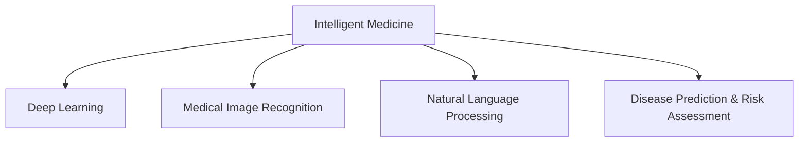

                 

# AI在智能医疗诊断中的应用：辅助医生决策

> 关键词：智能医疗,人工智能,深度学习,图像识别,自然语言处理,辅助决策,疾病预测

## 1. 背景介绍

### 1.1 问题由来
随着科技的进步和医疗水平的提升，AI技术在医疗领域的应用逐渐兴起。在智能医疗的浪潮下，AI已成为辅助医生进行诊断和治疗决策的重要工具。在影像诊断、病理学、药物研发等方面，AI展示了其在处理海量数据和复杂医疗信息方面的巨大潜力。然而，尽管AI在医疗领域取得了显著进展，但完全取代医生进行决策仍存在诸多限制。AI仍需与医生的临床经验和判断相结合，方能发挥最大的效用。

### 1.2 问题核心关键点
AI在智能医疗诊断中的核心目标是通过深度学习、图像识别、自然语言处理等技术，辅助医生提高诊断效率、减少误诊、优化治疗方案。AI辅助诊断的流程通常包括以下几个关键步骤：

1. **数据采集与预处理**：收集病人的电子健康记录、影像数据、基因信息等数据，并进行清洗和标准化处理。
2. **特征提取与模型训练**：通过机器学习算法从数据中提取特征，构建模型进行训练，使AI能够从数据中学习规律和模式。
3. **辅助决策与输出**：利用训练好的模型，对新的数据进行推理，输出诊断结果和治疗建议，辅助医生进行决策。

### 1.3 问题研究意义
AI辅助医疗诊断能够显著提升医疗服务效率和质量，帮助医生在面对复杂病例时提供更准确的诊断和推荐，从而改善病人的治疗效果。具体而言，AI在医疗诊断中的应用有以下几点重要意义：

1. **提高诊断效率**：AI能够自动分析海量医疗数据，比医生更快地发现异常情况，加快诊断速度。
2. **减少误诊率**：AI的准确率高，尤其在重复性较高的任务如影像诊断、病理学检查等方面，能够显著减少误诊率。
3. **优化治疗方案**：AI能结合患者基因信息、病史和实时数据，提供个性化的治疗建议。
4. **减轻医生负担**：AI承担部分重复性高、耗时的任务，让医生专注于复杂和高风险的诊断和治疗。

## 2. 核心概念与联系

### 2.1 核心概念概述

为更好地理解AI在智能医疗诊断中的具体应用，本节将介绍几个密切相关的核心概念：

- **智能医疗**：通过AI技术对医疗数据进行分析，辅助医生进行诊断和治疗决策，提升医疗服务的质量和效率。
- **深度学习**：一种基于人工神经网络的机器学习方法，通过多层非线性变换从数据中学习高级特征，用于图像识别、自然语言处理等任务。
- **医学影像识别**：利用图像识别技术对X光片、CT、MRI等医学影像进行自动分析和诊断，识别出病变部位、大小、性质等。
- **自然语言处理**：对医学文本（如病历、文献等）进行理解和分析，提取关键信息，用于临床决策支持。
- **疾病预测与风险评估**：通过预测模型对患者的疾病风险进行评估，辅助医生进行疾病预防和治疗。

这些核心概念之间的逻辑关系可以通过以下Mermaid流程图来展示：



这个流程图展示了一些核心概念及其之间的关系：

1. 智能医疗通过深度学习、医学影像识别和自然语言处理等技术，辅助医生进行诊断和治疗。
2. 深度学习用于从数据中提取特征，构建预测和分类模型。
3. 医学影像识别通过图像识别技术，对医学影像进行分析，自动诊断疾病。
4. 自然语言处理用于分析医学文本，提取临床决策所需的信息。
5. 疾病预测与风险评估利用预测模型，对患者的疾病风险进行评估。

## 3. 核心算法原理 & 具体操作步骤
### 3.1 算法原理概述

AI在智能医疗诊断中的应用，主要基于深度学习等机器学习技术。核心算法原理包括以下几个方面：

1. **特征提取**：通过卷积神经网络（CNN）、循环神经网络（RNN）等深度学习模型，自动从医学影像、基因数据、病历文本等数据中提取特征。
2. **模型训练**：使用监督学习或无监督学习的方法，从标注数据中训练模型，学习疾病的规律和模式。
3. **辅助诊断**：将新输入的病例数据，输入训练好的模型，得到诊断结果和治疗建议。

### 3.2 算法步骤详解

AI辅助医疗诊断的完整流程可以分为以下几个步骤：

**Step 1: 数据收集与预处理**
- 收集病人的电子健康记录、医学影像、基因数据等医疗数据，进行清洗和标准化处理。
- 对图像数据进行预处理，如归一化、裁剪、增强等操作，确保数据的一致性和质量。

**Step 2: 特征提取**
- 使用深度学习模型，如卷积神经网络（CNN），对医学影像进行特征提取。
- 利用自然语言处理模型，如BERT，从文本数据中提取关键信息。

**Step 3: 模型训练**
- 选择合适的深度学习模型，如卷积神经网络（CNN）、循环神经网络（RNN）、Transformer等，构建模型。
- 使用标注数据对模型进行训练，调整模型参数，使其能够准确识别疾病。

**Step 4: 辅助决策**
- 将新的医疗数据输入训练好的模型，得到诊断结果和治疗建议。
- 将诊断结果输出给医生，辅助其进行决策。

**Step 5: 结果评估与优化**
- 对诊断结果进行评估，使用各种评估指标（如准确率、召回率、F1分数等）进行衡量。
- 根据评估结果调整模型参数，优化模型性能。

### 3.3 算法优缺点

AI在智能医疗诊断中具有以下优点：

1. **高效处理大数据**：深度学习模型能够快速处理海量医疗数据，识别出细微的异常情况。
2. **提高诊断准确率**：利用机器学习算法，AI能够减少人为因素对诊断的影响，提高诊断的准确性。
3. **支持个性化治疗**：通过结合基因信息和病史数据，AI能够提供个性化的治疗方案。

同时，AI在医疗诊断中也有以下局限性：

1. **依赖高质量标注数据**：AI模型的性能很大程度上依赖于训练数据的标注质量，数据标注成本较高。
2. **缺乏临床经验**：AI缺乏人类的临床经验和判断，难以应对复杂和多变的临床情况。
3. **解释性不足**：AI模型的决策过程难以解释，缺乏透明性和可解释性。
4. **数据隐私和安全问题**：医疗数据涉及患者隐私，如何在保障隐私的同时，确保数据安全和合规性，是一个重要挑战。

### 3.4 算法应用领域

AI在智能医疗诊断中的应用广泛，以下是几个主要的应用领域：

- **医学影像诊断**：利用深度学习模型，对X光片、CT、MRI等医学影像进行自动分析和诊断，识别出病变部位、大小、性质等。
- **病理学分析**：利用自然语言处理技术，对病理切片进行文本分析，辅助病理学家的诊断和研究。
- **疾病预测与风险评估**：利用预测模型，对患者的疾病风险进行评估，帮助医生进行疾病预防和治疗决策。
- **药物研发**：通过深度学习技术，从分子数据中筛选出潜在的药物候选，加速新药研发过程。
- **基因组学分析**：利用机器学习算法，从基因组数据中提取关键信息，辅助临床决策和基因诊断。

这些应用领域展示了AI在医疗诊断中的广泛应用，为提升医疗服务质量和效率提供了新的可能。

## 4. 数学模型和公式 & 详细讲解 & 举例说明

### 4.1 数学模型构建

在AI辅助医疗诊断中，常用的数学模型包括卷积神经网络（CNN）、循环神经网络（RNN）、长短期记忆网络（LSTM）、Transformer等。以下是一些典型的数学模型及其应用场景：

- **卷积神经网络（CNN）**：适用于图像识别任务，通过卷积层和池化层提取图像特征，进行分类和定位。
- **循环神经网络（RNN）**：适用于序列数据处理，如时间序列分析和自然语言处理。
- **长短期记忆网络（LSTM）**：用于处理长时间依赖的序列数据，如病历文本分析和基因序列分析。
- **Transformer**：用于处理文本数据，在自然语言处理中应用广泛。

### 4.2 公式推导过程

以卷积神经网络（CNN）为例，介绍其数学模型的构建和推导过程。

卷积神经网络由多个卷积层、池化层和全连接层组成。其核心是卷积层，通过卷积操作提取图像特征。卷积操作的数学表达为：

$$
\mathcal{C} = \mathcal{W} * \mathcal{I}
$$

其中 $\mathcal{C}$ 为卷积层的输出，$\mathcal{W}$ 为卷积核，$\mathcal{I}$ 为输入图像。卷积操作的数学表达如下：

$$
C_{i,j,k} = \sum_{l=0}^{m-1}\sum_{m=0}^{n-1} W_{l,m,k}I_{i+l,j+m,k} + b_k
$$

其中 $W_{l,m,k}$ 为卷积核的权重，$I_{i+l,j+m,k}$ 为输入图像的像素值，$b_k$ 为偏置项。

通过多层的卷积操作，卷积神经网络能够自动提取图像特征，进行分类和定位。以医学影像识别为例，卷积神经网络可以通过学习医学影像中异常区域的特征，自动识别出病变位置和性质。

### 4.3 案例分析与讲解

以下是一个卷积神经网络在医学影像识别中的应用案例。

**案例背景**：医院需要将大量的医学影像数据（如X光片、CT等）进行自动分析和诊断，识别出病变位置和性质。

**解决方案**：
- **数据收集**：收集医院的医学影像数据，并进行标注。
- **模型构建**：使用Keras框架构建卷积神经网络，定义多个卷积层和池化层。
- **模型训练**：使用标注数据对卷积神经网络进行训练，调整网络参数。
- **模型评估**：使用测试数据对模型进行评估，计算准确率和召回率。
- **应用部署**：将训练好的模型部署到医院信息系统（HIS）中，进行自动诊断。

**案例结果**：
- 训练后的卷积神经网络在医学影像识别中取得了较高的准确率，能够自动识别出病变位置和性质。
- 通过将卷积神经网络应用于医学影像分析，医院减少了医生的工作量，提高了诊断效率和准确率。

## 5. 项目实践：代码实例和详细解释说明

### 5.1 开发环境搭建

在进行AI辅助医疗诊断的开发时，需要搭建相应的开发环境。以下是Python开发环境的搭建流程：

1. 安装Anaconda：从官网下载并安装Anaconda，用于创建独立的Python环境。

2. 创建并激活虚拟环境：
```bash
conda create -n ai-medicine python=3.8 
conda activate ai-medicine
```

3. 安装Python相关包：
```bash
pip install numpy scipy scikit-learn matplotlib seaborn jupyter notebook
```

4. 安装深度学习相关包：
```bash
pip install torch torchvision torchtext
```

5. 安装自然语言处理相关包：
```bash
pip install spacy transformers
```

完成上述步骤后，即可在`ai-medicine`环境中进行AI辅助医疗诊断的开发。

### 5.2 源代码详细实现

以下是一个使用PyTorch框架构建卷积神经网络（CNN）的Python代码示例：

```python
import torch
import torch.nn as nn
import torch.optim as optim
import torchvision.transforms as transforms
from torch.utils.data import DataLoader
from torchvision.datasets import CIFAR10

# 定义卷积神经网络
class CNNModel(nn.Module):
    def __init__(self):
        super(CNNModel, self).__init__()
        self.conv1 = nn.Conv2d(3, 32, kernel_size=3, stride=1, padding=1)
        self.pool1 = nn.MaxPool2d(kernel_size=2, stride=2)
        self.conv2 = nn.Conv2d(32, 64, kernel_size=3, stride=1, padding=1)
        self.pool2 = nn.MaxPool2d(kernel_size=2, stride=2)
        self.fc1 = nn.Linear(64 * 8 * 8, 256)
        self.fc2 = nn.Linear(256, 10)

    def forward(self, x):
        x = self.conv1(x)
        x = nn.functional.relu(x)
        x = self.pool1(x)
        x = self.conv2(x)
        x = nn.functional.relu(x)
        x = self.pool2(x)
        x = x.view(-1, 64 * 8 * 8)
        x = self.fc1(x)
        x = nn.functional.relu(x)
        x = self.fc2(x)
        return x

# 定义数据预处理
transform_train = transforms.Compose([
    transforms.RandomCrop(32, padding=4),
    transforms.RandomHorizontalFlip(),
    transforms.ToTensor(),
    transforms.Normalize([0.4914, 0.4822, 0.4465], [0.2023, 0.1994, 0.2010])
])

transform_test = transforms.Compose([
    transforms.ToTensor(),
    transforms.Normalize([0.4914, 0.4822, 0.4465], [0.2023, 0.1994, 0.2010])
])

# 加载数据集
train_dataset = CIFAR10(root='./data', train=True, download=True, transform=transform_train)
test_dataset = CIFAR10(root='./data', train=False, download=True, transform=transform_test)
train_loader = DataLoader(train_dataset, batch_size=64, shuffle=True, num_workers=2)
test_loader = DataLoader(test_dataset, batch_size=64, shuffle=False, num_workers=2)

# 定义模型、损失函数和优化器
model = CNNModel()
criterion = nn.CrossEntropyLoss()
optimizer = optim.Adam(model.parameters(), lr=0.001)

# 训练模型
def train(epoch):
    model.train()
    train_loss = 0.0
    train_acc = 0.0
    for batch_idx, (inputs, targets) in enumerate(train_loader):
        optimizer.zero_grad()
        outputs = model(inputs)
        loss = criterion(outputs, targets)
        loss.backward()
        optimizer.step()
        train_loss += loss.item()
        train_acc += (outputs.argmax(1) == targets).sum().item()
    train_loss /= len(train_loader.dataset)
    train_acc /= len(train_loader.dataset)
    print('Train Epoch: {} \n\tLoss: {:.4f} \n\tAcc: {:.4f}'.format(epoch, train_loss, train_acc))

# 测试模型
def test(epoch):
    model.eval()
    test_loss = 0.0
    test_acc = 0.0
    with torch.no_grad():
        for batch_idx, (inputs, targets) in enumerate(test_loader):
            outputs = model(inputs)
            loss = criterion(outputs, targets)
            test_loss += loss.item()
            test_acc += (outputs.argmax(1) == targets).sum().item()
    test_loss /= len(test_loader.dataset)
    test_acc /= len(test_loader.dataset)
    print('Test Epoch: {} \n\tLoss: {:.4f} \n\tAcc: {:.4f}'.format(epoch, test_loss, test_acc))

# 训练和测试
for epoch in range(10):
    train(epoch)
    test(epoch)
```

### 5.3 代码解读与分析

让我们再详细解读一下关键代码的实现细节：

**CNNModel类**：
- `__init__`方法：定义卷积神经网络的结构，包括卷积层、池化层和全连接层。
- `forward`方法：定义前向传播的计算过程，从输入数据到输出结果。

**数据预处理**：
- `transform_train`和`transform_test`定义了数据的预处理步骤，包括随机裁剪、翻转、归一化等。
- `train_dataset`和`test_dataset`加载了CIFAR-10数据集，并进行了数据预处理。
- `train_loader`和`test_loader`定义了数据加载器，用于批量加载数据。

**模型训练**：
- `model`定义了卷积神经网络的实例。
- `criterion`定义了交叉熵损失函数。
- `optimizer`定义了Adam优化器。
- `train`和`test`函数分别实现了训练和测试过程，计算并输出模型在训练和测试集上的损失和准确率。

**训练和测试循环**：
- 使用`for`循环迭代训练和测试过程，输出每个epoch的损失和准确率。

可以看出，通过这个简单的例子，我们可以使用PyTorch框架快速构建卷积神经网络，并进行训练和测试。在实际应用中，还需要针对具体任务进行更复杂的模型设计和优化。

## 6. 实际应用场景

### 6.1 智能医疗诊断

AI在智能医疗诊断中的应用广泛，以下是几个典型的应用场景：

**案例1: 医学影像诊断**
- **场景描述**：医院需要对大量的医学影像（如X光片、CT等）进行自动分析和诊断，识别出病变位置和性质。
- **解决方案**：使用卷积神经网络（CNN）对医学影像进行特征提取和分类，自动识别病变区域。
- **应用效果**：通过AI辅助诊断，医院减少了医生的工作量，提高了诊断效率和准确率。

**案例2: 病理学分析**
- **场景描述**：医院需要对病理切片进行文本分析，辅助病理学家的诊断和研究。
- **解决方案**：使用自然语言处理（NLP）技术，从病理切片的文本描述中提取关键信息，进行分类和分析。
- **应用效果**：通过AI辅助病理学分析，医院提高了病理诊断的准确性和研究效率。

### 6.2 未来应用展望

随着AI技术的不断进步，其在智能医疗诊断中的应用将更加广泛和深入。未来，AI在医疗领域的应用将呈现以下几个趋势：

1. **多模态融合**：结合医学影像、基因数据、病历文本等多模态信息，进行综合分析和诊断，提升诊断的全面性和准确性。
2. **个性化医疗**：利用基因信息和病史数据，提供个性化的治疗方案，提升治疗效果和病人满意度。
3. **远程医疗**：通过AI辅助诊断系统，实现远程医疗，提高医疗服务的可及性和覆盖面。
4. **实时监控**：利用AI技术对病人的实时生理数据进行监控和分析，及时发现异常情况，进行预警和干预。

## 7. 工具和资源推荐

### 7.1 学习资源推荐

为了帮助开发者系统掌握AI辅助医疗诊断的理论基础和实践技巧，这里推荐一些优质的学习资源：

1. **《深度学习》课程**：斯坦福大学开设的深度学习课程，有Lecture视频和配套作业，带你入门深度学习的基本概念和经典模型。
2. **《医学影像处理》课程**：Coursera上的医学影像处理课程，介绍了医学影像处理的常用技术和算法。
3. **《自然语言处理》课程**：Coursera上的自然语言处理课程，介绍了自然语言处理的常用技术和算法。
4. **《人工智能与医疗》课程**：Google的AI与医疗课程，介绍了AI在医疗领域的应用和挑战。
5. **《医学数据科学》书籍**：介绍了医学数据科学的基本概念和技术，适用于AI在医疗领域的研究和应用。

通过对这些资源的学习实践，相信你一定能够快速掌握AI辅助医疗诊断的精髓，并用于解决实际的医疗问题。

### 7.2 开发工具推荐

高效的开发离不开优秀的工具支持。以下是几款用于AI辅助医疗诊断开发的常用工具：

1. **TensorFlow**：由Google主导开发的深度学习框架，功能丰富，适合大规模工程应用。
2. **PyTorch**：基于Python的深度学习框架，灵活动态，适合快速迭代研究。
3. **Keras**：高级神经网络API，易于使用，适合快速搭建和测试模型。
4. **Scikit-learn**：Python中的机器学习库，提供了丰富的数据预处理和模型评估工具。
5. **Jupyter Notebook**：交互式编程环境，支持Python、R等多种语言，方便实验和协作。

合理利用这些工具，可以显著提升AI辅助医疗诊断的开发效率，加快创新迭代的步伐。

### 7.3 相关论文推荐

AI在智能医疗诊断领域的研究发展迅速，以下是几篇奠基性的相关论文，推荐阅读：

1. **《Deep Learning for Medical Image Analysis: A Review》**：详细介绍了深度学习在医学影像分析中的应用和算法。
2. **《Natural Language Processing for Clinical Practice: A Survey》**：介绍了自然语言处理在临床实践中的应用和挑战。
3. **《Artificial Intelligence in Healthcare: A Systematic Review》**：综述了AI在医疗领域的应用和发展趋势。
4. **《A Survey on Deep Learning Techniques for Medical Image Segmentation》**：介绍了深度学习在医学图像分割中的应用和算法。
5. **《Machine Learning for Healthcare Prediction and Monitoring》**：介绍了机器学习在医疗预测和监控中的应用和挑战。

这些论文代表了大语言模型微调技术的发展脉络。通过学习这些前沿成果，可以帮助研究者把握学科前进方向，激发更多的创新灵感。

## 8. 总结：未来发展趋势与挑战

### 8.1 总结

本文对AI在智能医疗诊断中的应用进行了全面系统的介绍。首先阐述了AI辅助医疗诊断的研究背景和意义，明确了AI在提升医疗服务效率和质量方面的重要作用。其次，从原理到实践，详细讲解了AI辅助医疗诊断的数学模型和关键步骤，给出了具体的代码实例。同时，本文还广泛探讨了AI在智能医疗诊断中的实际应用场景，展示了AI技术的广泛应用前景。此外，本文精选了AI辅助医疗诊断的学习资源和开发工具，力求为读者提供全方位的技术指引。

通过本文的系统梳理，可以看到，AI在智能医疗诊断中的应用前景广阔，尤其是在医学影像识别、病理学分析、疾病预测等方面，AI展示了其强大的数据处理和分析能力。未来，伴随AI技术的不断进步，智能医疗诊断将更加智能化、高效化，为提升医疗服务的质量和效率提供新的动力。

### 8.2 未来发展趋势

展望未来，AI辅助医疗诊断技术将呈现以下几个发展趋势：

1. **多模态融合**：结合医学影像、基因数据、病历文本等多模态信息，进行综合分析和诊断，提升诊断的全面性和准确性。
2. **个性化医疗**：利用基因信息和病史数据，提供个性化的治疗方案，提升治疗效果和病人满意度。
3. **实时监控**：利用AI技术对病人的实时生理数据进行监控和分析，及时发现异常情况，进行预警和干预。
4. **远程医疗**：通过AI辅助诊断系统，实现远程医疗，提高医疗服务的可及性和覆盖面。
5. **决策支持**：利用AI技术提供全面的医疗决策支持，辅助医生进行诊断和治疗决策。

这些趋势凸显了AI在智能医疗诊断中的广阔前景。这些方向的探索发展，必将进一步提升医疗服务质量和效率，为构建安全、可靠、可解释、可控的智能医疗系统铺平道路。

### 8.3 面临的挑战

尽管AI辅助医疗诊断技术已经取得了显著进展，但在迈向更加智能化、普适化应用的过程中，仍面临诸多挑战：

1. **数据隐私和安全问题**：医疗数据涉及患者隐私，如何在保障隐私的同时，确保数据安全和合规性，是一个重要挑战。
2. **临床验证与可信度**：AI辅助诊断系统需要经过严格的临床验证，才能应用于实际医疗场景，确保诊断结果的可信度。
3. **多模态数据的整合**：医学影像、基因数据、病历文本等多模态数据的整合，需要复杂的算法和技术支持，才能实现高效准确的分析。
4. **模型的可解释性**：AI模型的决策过程难以解释，缺乏透明性和可解释性，这对医生和病人都是一大挑战。
5. **模型的泛化能力**：AI模型需要在不同医院、不同病患群体中都能保持良好的泛化性能，这对模型的设计提出了更高的要求。

这些挑战凸显了AI在智能医疗诊断中仍需进一步优化和改进的地方。只有解决好这些挑战，才能充分发挥AI技术的潜力，推动智能医疗诊断的发展。

### 8.4 研究展望

面对AI辅助医疗诊断所面临的挑战，未来的研究需要在以下几个方面寻求新的突破：

1. **多模态数据融合**：开发高效的多模态数据融合算法，实现不同类型数据的高效整合和分析。
2. **可解释性和透明性**：研究可解释性AI技术，提高模型的透明性和可解释性，增强医生和病人的信任。
3. **数据隐私保护**：研究数据隐私保护技术，确保在数据共享和应用中保护患者的隐私。
4. **模型泛化能力**：开发具有良好泛化能力的AI模型，使其在不同医院和病患群体中都能保持稳定的性能。
5. **实时监控与预警**：研究实时监控和预警技术，及时发现异常情况，进行干预和处理。

这些研究方向的研究突破，必将推动AI辅助医疗诊断技术的进一步发展，为构建安全、可靠、可解释、可控的智能医疗系统提供新的动力。

## 9. 附录：常见问题与解答

**Q1：AI辅助医疗诊断是否能够完全替代医生进行诊断？**

A: AI辅助医疗诊断在提升诊断效率和准确性方面具有显著优势，但在面对复杂和多变的临床情况时，仍需依靠医生的临床经验和判断。AI能够提供诊断建议和辅助决策，但不能完全替代医生的诊断工作。

**Q2：AI辅助医疗诊断的准确性如何保障？**

A: AI辅助医疗诊断的准确性主要依赖于高质量的标注数据和优化的算法模型。在数据采集和标注过程中，需要严格控制数据的质量，确保标注的准确性和一致性。同时，需要通过严格的临床验证，确保模型的诊断效果。

**Q3：AI辅助医疗诊断是否存在数据隐私和安全问题？**

A: AI辅助医疗诊断涉及大量的患者隐私数据，数据隐私和安全问题是一个重要挑战。在数据处理和应用过程中，需要严格遵守相关法律法规，确保数据的安全性和隐私保护。

**Q4：AI辅助医疗诊断是否需要大量标注数据？**

A: AI辅助医疗诊断通常需要大量的标注数据进行训练，这些数据需要经过严格的筛选和标注，以确保数据的质量和代表性。对于数据稀缺的领域，可以考虑利用迁移学习、半监督学习等方法，通过小样本学习进行模型训练。

**Q5：AI辅助医疗诊断是否需要考虑伦理道德问题？**

A: AI辅助医疗诊断需要考虑伦理道德问题，如模型偏见、算法透明性、决策可解释性等。在设计和应用AI辅助医疗诊断系统时，需要充分考虑这些伦理道德问题，确保系统的公平性和可解释性。

通过以上问题的解答，可以更全面地了解AI在智能医疗诊断中的应用和挑战，为AI技术的实际应用提供更清晰的指导。总之，AI辅助医疗诊断技术在提升医疗服务效率和质量方面具有重要意义，但也需要注重数据隐私、伦理道德和临床验证等方面的问题，才能充分发挥其潜力。

