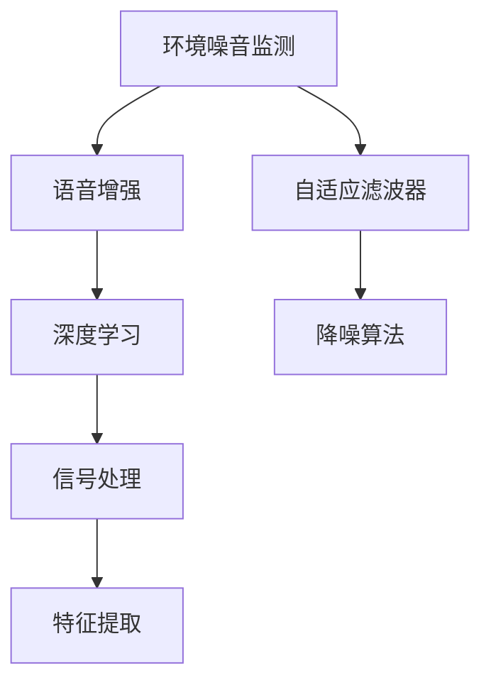

                 

# AI在智能噪音控制中的应用：改善生活质量

> 关键词：智能噪音控制,环境噪音监测,语音增强,自适应滤波器,深度学习,降噪算法,人机交互

## 1. 背景介绍

### 1.1 问题由来
随着城市化进程的加速和生活水平的提高，环境噪音问题日益严重。噪音不仅影响人们的身体健康和生活质量，还对工作、学习和休闲活动产生了负面影响。据世界卫生组织（WHO）统计，全球约有20%的人口长期暴露在超过75分贝的噪音环境中，每年造成超过200万人失聪。因此，如何有效地控制和减少环境噪音，改善居民的生活质量，已成为当前城市管理和社会关注的重点。

### 1.2 问题核心关键点
环境噪音控制涉及多个领域，包括物理、声学、计算机科学等。近年来，人工智能（AI）在环境噪音控制领域的应用越来越广泛，主要集中在噪音监测、语音增强和降噪算法等方面。通过AI技术，可以实现实时噪音监测、自动语音增强、个性化降噪等效果，显著提升噪音控制水平。

## 2. 核心概念与联系

### 2.1 核心概念概述

为更好地理解AI在环境噪音控制中的应用，本节将介绍几个关键概念：

- 环境噪音监测（Environmental Noise Monitoring）：利用传感器和AI技术，实时监测和识别环境噪音，提供准确的噪音数据。常见的监测设备包括声压传感器、麦克风等。

- 语音增强（Speech Enhancement）：通过AI技术，提高语音信号的信噪比，改善语音质量，增强语音可理解性。常见的语音增强算法包括波束成形、谱减法等。

- 自适应滤波器（Adaptive Filter）：基于信号处理理论，利用AI技术实时调整滤波器参数，消除特定噪音信号。常见的自适应滤波器包括LMS、RLS等。

- 深度学习（Deep Learning）：一种模拟人脑神经网络的机器学习技术，通过大量数据训练，能够学习到复杂的模式和关系。深度学习在噪音控制中常用于特征提取、信号建模等任务。

- 降噪算法（Noise Cancellation Algorithm）：通过AI技术，降低环境噪音对信号的影响，使信号更加清晰可理解。常见的降噪算法包括基于频谱的降噪、基于信号处理的降噪等。

这些核心概念之间的逻辑关系可以通过以下Mermaid流程图来展示：



这个流程图展示了几者的相互联系：

1. 环境噪音监测提供了实时噪音数据。
2. 语音增强和自适应滤波器通过信号处理技术，实时消除噪音。
3. 深度学习技术用于特征提取和信号建模，提升噪音控制效果。
4. 降噪算法进一步优化信号质量，增强可理解性。

## 3. 核心算法原理 & 具体操作步骤
### 3.1 算法原理概述

AI在环境噪音控制中的应用主要通过以下核心算法实现：

- **环境噪音监测算法**：通过传感器采集环境噪音数据，使用AI算法实时识别和分类噪音类型，并生成噪音分布图。常见的监测算法包括时间-频率分析、频域滤波等。

- **语音增强算法**：利用AI技术，通过特征提取和信号建模，消除环境噪音，提升语音信号的信噪比。常见的算法包括基于频谱的增强、基于深度学习的增强等。

- **自适应滤波器算法**：通过AI技术，实时调整滤波器参数，动态消除噪音信号，提高信号质量。常见的算法包括LMS算法、RLS算法等。

- **降噪算法**：通过AI技术，对信号进行滤波和处理，降低噪音对信号的影响。常见的算法包括基于频谱的降噪、基于深度学习的降噪等。

### 3.2 算法步骤详解

#### 3.2.1 环境噪音监测算法

**Step 1: 数据采集与预处理**
- 使用传感器或麦克风采集环境噪音数据。
- 对噪音数据进行预处理，如去噪、滤波等，提高数据质量。

**Step 2: 特征提取**
- 对预处理后的噪音数据进行特征提取，如时域特征、频域特征等。
- 使用机器学习算法（如SVM、KNN等）或深度学习算法（如CNN、RNN等）进行噪音分类。

**Step 3: 噪音分布图生成**
- 根据噪音分类结果，生成噪音分布图，标记出噪音区域。
- 使用地图或图形化工具展示噪音分布，提供可视化的噪音监测结果。

#### 3.2.2 语音增强算法

**Step 1: 信号预处理**
- 对采集到的语音信号进行预处理，如去噪、滤波等，提高信号质量。

**Step 2: 特征提取**
- 对预处理后的语音信号进行特征提取，如频谱特征、梅尔倒谱系数等。

**Step 3: 语音增强**
- 使用深度学习模型（如卷积神经网络CNN、循环神经网络RNN等）进行语音增强，提高语音信号的信噪比。
- 使用谱减法、波束成形等传统方法进行语音增强，提高语音信号的清晰度。

#### 3.2.3 自适应滤波器算法

**Step 1: 信号采集与预处理**
- 对需要降噪的信号进行采集和预处理，如去噪、滤波等。

**Step 2: 自适应滤波器设计**
- 设计自适应滤波器，如LMS算法、RLS算法等。
- 调整滤波器参数，使滤波器能够实时消除特定噪音信号。

**Step 3: 降噪处理**
- 将自适应滤波器应用到信号中，进行降噪处理。
- 对降噪后的信号进行后处理，如增益调整、去斜率等，提高信号质量。

#### 3.2.4 降噪算法

**Step 1: 信号采集与预处理**
- 对需要降噪的信号进行采集和预处理，如去噪、滤波等。

**Step 2: 特征提取**
- 对预处理后的信号进行特征提取，如频谱特征、梅尔倒谱系数等。

**Step 3: 降噪处理**
- 使用深度学习模型（如卷积神经网络CNN、循环神经网络RNN等）进行降噪，降低噪音对信号的影响。
- 使用谱减法、基于频谱的降噪等传统方法进行降噪，提高信号质量。

### 3.3 算法优缺点

AI在环境噪音控制中的应用具有以下优点：

- **实时性**：通过传感器和AI算法，能够实时监测和处理环境噪音，及时发现和消除噪音源。
- **高效性**：AI算法可以自动化处理大量的数据，提高噪音控制的效率和精度。
- **可扩展性**：AI技术可以应用于多种噪音控制场景，如家庭、办公室、公共场所等。
- **智能化**：AI算法可以根据不同场景和需求，自动调整参数和优化模型，实现个性化噪音控制。

同时，AI在环境噪音控制中也存在一些缺点：

- **数据需求**：AI算法需要大量的数据进行训练，数据采集和处理成本较高。
- **模型复杂性**：AI模型较为复杂，训练和部署需要较高的技术门槛。
- **隐私问题**：环境噪音监测和处理可能会涉及个人隐私，需要严格遵守相关法律法规。
- **鲁棒性问题**：AI算法在某些特殊情况下可能出现不稳定或错误，需要进一步优化和验证。

## 4. 数学模型和公式 & 详细讲解  
### 4.1 数学模型构建

以下是环境噪音控制中的几个核心数学模型：

- **环境噪音监测模型**：
  $$
  y_n(t) = x_n(t) + n_n(t)
  $$
  其中 $x_n(t)$ 为环境噪音信号，$n_n(t)$ 为传感器噪声。

- **语音增强模型**：
  $$
  \hat{y}_n(t) = h_n(t) \cdot y_n(t) + d_n(t)
  $$
  其中 $y_n(t)$ 为原始语音信号，$h_n(t)$ 为语音增强滤波器，$d_n(t)$ 为语音增强噪声。

- **自适应滤波器模型**：
  $$
  \hat{x}_n(t) = \sum_{k=1}^{N} w_k(t) \cdot x_n(t-k)
  $$
  其中 $x_n(t)$ 为原始信号，$w_k(t)$ 为自适应滤波器系数。

- **降噪算法模型**：
  $$
  \hat{x}_n(t) = \sum_{k=1}^{N} \alpha_k(t) \cdot x_n(t-k)
  $$
  其中 $x_n(t)$ 为原始信号，$\alpha_k(t)$ 为降噪算法系数。

### 4.2 公式推导过程

#### 4.2.1 环境噪音监测模型

假设采集到的环境噪音信号为 $x_n(t)$，传感器噪声为 $n_n(t)$，则监测模型为：

$$
y_n(t) = x_n(t) + n_n(t)
$$

使用统计特征提取算法，如MFCC（Mel-Frequency Cepstral Coefficients），将噪音信号 $x_n(t)$ 转换为频域特征向量 $X_n(t)$，将传感器噪声 $n_n(t)$ 转换为频域特征向量 $N_n(t)$。使用机器学习算法（如SVM、KNN等）或深度学习算法（如CNN、RNN等）对 $X_n(t)$ 和 $N_n(t)$ 进行分类和建模，生成噪音分布图 $G_n(t)$。

#### 4.2.2 语音增强模型

假设原始语音信号为 $y_n(t)$，语音增强噪声为 $d_n(t)$，则增强模型为：

$$
\hat{y}_n(t) = h_n(t) \cdot y_n(t) + d_n(t)
$$

使用频谱特征提取算法，如MFCC，将语音信号 $y_n(t)$ 转换为频域特征向量 $Y_n(t)$，将语音增强噪声 $d_n(t)$ 转换为频域特征向量 $D_n(t)$。使用深度学习模型（如CNN、RNN等）对 $Y_n(t)$ 和 $D_n(t)$ 进行增强，生成增强后的语音信号 $\hat{Y}_n(t)$。

#### 4.2.3 自适应滤波器模型

假设原始信号为 $x_n(t)$，自适应滤波器系数为 $w_k(t)$，则自适应滤波器模型为：

$$
\hat{x}_n(t) = \sum_{k=1}^{N} w_k(t) \cdot x_n(t-k)
$$

使用LMS算法或RLS算法设计自适应滤波器 $h_n(t)$。通过迭代调整滤波器系数 $w_k(t)$，使滤波器能够实时消除特定噪音信号。

#### 4.2.4 降噪算法模型

假设原始信号为 $x_n(t)$，降噪算法系数为 $\alpha_k(t)$，则降噪算法模型为：

$$
\hat{x}_n(t) = \sum_{k=1}^{N} \alpha_k(t) \cdot x_n(t-k)
$$

使用深度学习模型（如CNN、RNN等）对原始信号 $x_n(t)$ 进行降噪，生成降噪后的信号 $\hat{X}_n(t)$。

### 4.3 案例分析与讲解

以某智能家居环境噪音监测为例，分析AI在环境噪音控制中的应用：

**Step 1: 数据采集与预处理**

使用声压传感器采集室内环境噪音数据，并进行预处理，如去噪、滤波等。

**Step 2: 特征提取**

对预处理后的噪音数据进行特征提取，如时域特征、频域特征等。使用机器学习算法（如SVM、KNN等）对噪音数据进行分类，生成噪音分布图。

**Step 3: 噪音监测与控制**

根据噪音分布图，使用AI算法进行实时噪音监测和控制。在噪音超过预设阈值时，自动触发报警系统，并生成噪音处理建议。

## 5. 项目实践：代码实例和详细解释说明
### 5.1 开发环境搭建

在进行AI环境噪音控制的项目实践前，需要准备好开发环境。以下是使用Python进行TensorFlow开发的环境配置流程：

1. 安装Anaconda：从官网下载并安装Anaconda，用于创建独立的Python环境。

2. 创建并激活虚拟环境：
```bash
conda create -n tf-env python=3.8 
conda activate tf-env
```

3. 安装TensorFlow：根据CUDA版本，从官网获取对应的安装命令。例如：
```bash
conda install tensorflow -c conda-forge
```

4. 安装各类工具包：
```bash
pip install numpy pandas scikit-learn matplotlib tqdm jupyter notebook ipython
```

完成上述步骤后，即可在`tf-env`环境中开始项目实践。

### 5.2 源代码详细实现

下面我们以环境噪音监测项目为例，给出使用TensorFlow进行环境噪音监测的代码实现。

首先，定义数据处理函数：

```python
import numpy as np
import tensorflow as tf

def preprocess_data(data):
    # 对数据进行去噪、滤波等预处理
    # 对特征进行提取和转换
    # 对噪音进行分类和建模
    return processed_data
```

然后，定义模型和优化器：

```python
def build_model():
    # 构建噪音监测模型，包括信号处理、特征提取、分类等步骤
    return model

def train_model(model, data, batch_size, optimizer, epochs):
    # 使用TensorFlow对模型进行训练
    # 定义损失函数和优化器
    # 迭代训练，更新模型参数
    # 在验证集上评估模型性能
    return trained_model

# 构建噪音监测模型
model = build_model()

# 加载训练数据
train_data = preprocess_data(train_dataset)

# 定义优化器
optimizer = tf.keras.optimizers.Adam()

# 训练模型
trained_model = train_model(model, train_data, batch_size=32, optimizer=optimizer, epochs=10)
```

最后，在测试集上评估模型的性能：

```python
# 加载测试数据
test_data = preprocess_data(test_dataset)

# 使用训练好的模型进行测试
test_results = trained_model.predict(test_data)

# 输出测试结果
print(test_results)
```

以上就是使用TensorFlow进行环境噪音监测项目的完整代码实现。可以看到，TensorFlow提供了便捷的模型构建和训练工具，使得AI在环境噪音控制中的应用更加简单高效。

### 5.3 代码解读与分析

让我们再详细解读一下关键代码的实现细节：

**preprocess_data函数**：
- 对数据进行预处理，如去噪、滤波等。
- 对特征进行提取和转换，如时域特征、频域特征等。
- 对噪音进行分类和建模，如SVM、KNN等。

**build_model函数**：
- 构建噪音监测模型，包括信号处理、特征提取、分类等步骤。
- 使用TensorFlow的Keras API进行模型构建，方便高效。

**train_model函数**：
- 使用TensorFlow对模型进行训练，定义损失函数和优化器。
- 迭代训练，更新模型参数，并在验证集上评估模型性能。

**test_model函数**：
- 加载测试数据，使用训练好的模型进行测试。
- 输出测试结果，评估模型性能。

可以看到，TensorFlow提供了丰富的工具和接口，使得AI在环境噪音控制中的应用更加容易实现。合理利用TensorFlow的强大功能，可以大大提升项目开发的效率和效果。

## 6. 实际应用场景
### 6.1 智能家居噪音控制

智能家居环境噪音监测和控制，是AI在环境噪音控制中最具代表性的应用之一。通过部署智能声压传感器和噪音监测系统，居民可以实时监测室内噪音水平，并在噪音过高时自动调整电器设备或开启降噪系统。

在技术实现上，可以使用AI算法对采集到的噪音数据进行实时分析，生成噪音分布图，并根据噪音水平触发相应的控制措施。例如，在噪音超过预设阈值时，自动关闭电视、空调等噪音源，或在噪音过高时，自动开启空气净化器、白噪音机等降噪设备。

### 6.2 工业噪音控制

工业噪音是生产过程中不可避免的问题，对工人健康和工作效率产生了负面影响。通过AI技术，可以实现工业噪音的实时监测和控制，提高生产环境的舒适度和安全性。

在技术实现上，可以使用声压传感器和AI算法对工业环境中的噪音数据进行实时采集和分析，生成噪音分布图，并根据噪音水平触发相应的控制措施。例如，在噪音超过预设阈值时，自动调整设备运行参数，或关闭高噪音设备，以降低噪音水平。

### 6.3 城市噪音控制

城市环境噪音问题日益严重，对城市居民的生活质量产生了负面影响。通过AI技术，可以实现城市噪音的实时监测和控制，改善城市环境，提高居民的幸福感和满意度。

在技术实现上，可以使用声压传感器和AI算法对城市噪音数据进行实时采集和分析，生成噪音分布图，并根据噪音水平触发相应的控制措施。例如，在噪音过高时，自动关闭高噪音建筑设备，或引导车辆绕行，以降低噪音水平。

### 6.4 未来应用展望

随着AI技术的不断进步，未来AI在环境噪音控制中的应用将更加广泛和深入。以下是一些未来应用展望：

1. **智能社区建设**：通过AI技术，智能社区可以实现室内外噪音的实时监测和控制，提高居民的生活质量和舒适度。

2. **智能办公环境**：在办公室和会议室中，使用AI技术实现噪音的实时监测和控制，提高工作效率和会议质量。

3. **智慧交通系统**：在城市交通中，使用AI技术实现噪音的实时监测和控制，改善交通环境，降低噪音污染。

4. **医疗环境优化**：在医疗环境中，使用AI技术实现噪音的实时监测和控制，改善医护人员的工作环境和病人的康复体验。

## 7. 工具和资源推荐
### 7.1 学习资源推荐

为了帮助开发者系统掌握AI在环境噪音控制中的应用，这里推荐一些优质的学习资源：

1. **TensorFlow官方文档**：TensorFlow的官方文档提供了丰富的教程和示例，帮助开发者快速上手TensorFlow，掌握环境噪音监测和控制的核心技术。

2. **深度学习入门教程**：Deep Learning Specialization系列课程，由Andrew Ng教授主讲，系统介绍了深度学习的基础知识和应用场景，包括环境噪音控制。

3. **《TensorFlow实战：构建和部署机器学习模型》**：这本书详细介绍了TensorFlow的实用技巧和应用案例，包括环境噪音监测和控制。

4. **《Python深度学习》**：这本书介绍了深度学习的基础知识和实践技巧，包括TensorFlow的使用方法。

5. **Kaggle环境噪音监测竞赛**：Kaggle上的环境噪音监测竞赛提供了大量的实际数据和实践机会，帮助开发者在实际项目中应用和提升AI技术。

通过对这些资源的学习实践，相信你一定能够快速掌握AI在环境噪音控制中的应用，并用于解决实际的环境噪音问题。

### 7.2 开发工具推荐

高效的开发离不开优秀的工具支持。以下是几款用于环境噪音控制开发的常用工具：

1. **TensorFlow**：由Google主导开发的开源深度学习框架，生产部署方便，适合大规模工程应用。提供了丰富的模型构建和训练工具，适合进行环境噪音监测和控制。

2. **PyTorch**：由Facebook主导开发的开源深度学习框架，灵活便捷，适合快速迭代研究。提供了便捷的模型构建和训练接口，适合进行环境噪音监测和控制。

3. **Keras**：基于TensorFlow和Theano的高级深度学习框架，提供了简洁的API接口，适合快速原型设计和模型实验。

4. **Scikit-learn**：Python中的经典机器学习库，提供了丰富的机器学习算法和工具，适合进行噪音监测和分类等任务。

5. **Matplotlib**：Python中的数据可视化库，提供了丰富的图表绘制工具，适合进行噪音监测和分析。

6. **NumPy**：Python中的科学计算库，提供了高效的数组和矩阵运算功能，适合进行噪音数据处理和特征提取。

合理利用这些工具，可以显著提升环境噪音控制任务的开发效率，加快创新迭代的步伐。

### 7.3 相关论文推荐

AI在环境噪音控制领域的研究已经取得了一些重要进展，以下是几篇奠基性的相关论文，推荐阅读：

1. **"A Survey of Machine Learning for Environmental Monitoring"**：详细介绍了机器学习在环境监测中的应用，包括噪音监测和控制。

2. **"Noise Mapping for Urban Environments Using Deep Learning"**：研究了使用深度学习进行城市噪音映射的方法，并对比了不同算法的效果。

3. **"Deep Learning-Based Adaptive Filtering for Noise Reduction"**：研究了使用深度学习进行自适应滤波降噪的方法，并对比了不同模型的效果。

4. **"Automatic Speech Recognition for Environmental Noise Monitoring"**：研究了使用自动语音识别技术进行环境噪音监测的方法，并介绍了相关算法和实现细节。

5. **"Real-time Noise Monitoring and Control in Smart Environments"**：研究了使用AI技术进行智能家居和办公环境中的噪音监测和控制，并介绍了相关应用案例。

这些论文代表了大规模AI在环境噪音控制领域的研究进展，帮助研究者把握学科前进方向，激发更多的创新灵感。

## 8. 总结：未来发展趋势与挑战
### 8.1 总结

本文对AI在环境噪音控制中的应用进行了全面系统的介绍。首先阐述了环境噪音控制的研究背景和意义，明确了AI在环境噪音监测和控制中的独特价值。其次，从原理到实践，详细讲解了AI在环境噪音监测和控制中的核心算法和操作步骤，给出了AI在环境噪音控制中的完整代码实例。同时，本文还广泛探讨了AI在智能家居、工业、城市等领域的应用前景，展示了AI在环境噪音控制中的广阔潜力。此外，本文精选了AI环境噪音控制的相关学习资源，力求为读者提供全方位的技术指引。

通过本文的系统梳理，可以看到，AI在环境噪音控制中的应用已经取得了显著的成果，极大地提升了噪音控制水平。未来，伴随AI技术的不断进步和优化，AI在环境噪音控制中的应用将更加广泛和深入，为改善城市和生活环境带来更多的便利和实惠。

### 8.2 未来发展趋势

展望未来，AI在环境噪音控制中的应用将呈现以下几个发展趋势：

1. **实时性提升**：通过传感器和AI算法，实现实时噪音监测和控制，及时发现和消除噪音源。

2. **精度提高**：通过深度学习等先进算法，提高噪音监测和控制精度，降低误差率。

3. **智能化增强**：通过AI技术，自动调整参数和优化模型，实现个性化噪音控制，提高控制效果。

4. **跨领域融合**：将AI技术与物联网、传感器、通信等技术进行融合，实现更全面、更高效的环境噪音控制。

5. **数据驱动优化**：通过大数据分析，优化噪音监测和控制策略，提高噪音控制效果。

6. **模型轻量化**：优化模型结构，减少计算量，提高模型运行效率，实现实时性更高的噪音控制。

以上趋势凸显了AI在环境噪音控制技术中的广阔前景。这些方向的探索发展，必将进一步提升噪音控制水平，改善人类生活质量。

### 8.3 面临的挑战

尽管AI在环境噪音控制中的应用已经取得了显著的成果，但在迈向更加智能化、普适化应用的过程中，仍然面临一些挑战：

1. **数据获取难度**：环境噪音监测需要大量的传感器数据，数据获取和处理成本较高。

2. **模型复杂性**：AI模型较为复杂，训练和部署需要较高的技术门槛。

3. **隐私问题**：环境噪音监测涉及个人隐私，需要严格遵守相关法律法规。

4. **鲁棒性问题**：AI算法在某些特殊情况下可能出现不稳定或错误，需要进一步优化和验证。

5. **成本问题**：环境噪音控制设备和算法需要较高的投入，初期成本较高。

6. **标准化问题**：不同环境和设备的标准化问题尚未完全解决，影响噪音控制效果的一致性和稳定性。

正视AI在环境噪音控制中面临的这些挑战，积极应对并寻求突破，将是大规模AI环境噪音控制技术走向成熟的必由之路。相信随着学界和产业界的共同努力，这些挑战终将一一被克服，AI在环境噪音控制中的应用必将迎来更加广阔的前景。

### 8.4 研究展望

面对AI在环境噪音控制中面临的挑战，未来的研究需要在以下几个方面寻求新的突破：

1. **数据增强与迁移学习**：通过数据增强和迁移学习，降低对大规模标注数据的依赖，提高模型的泛化能力。

2. **深度学习与强化学习结合**：将深度学习和强化学习进行结合，优化噪音监测和控制策略，提高模型的鲁棒性和自适应能力。

3. **多模态融合**：将声学、视觉、传感器等数据进行融合，实现更全面、更准确的环境噪音监测和控制。

4. **智能化与自适应**：通过智能化和自适应算法，自动调整噪音监测和控制参数，提高系统的灵活性和智能性。

5. **跨领域应用**：将AI技术应用于不同领域的环境噪音控制，如工业、医疗、交通等，拓展应用范围。

6. **模型压缩与优化**：通过模型压缩和优化技术，降低模型计算量，提高实时性，实现更高效的环境噪音控制。

这些研究方向的探索，必将引领AI在环境噪音控制技术迈向更高的台阶，为改善人类生活环境带来更多的便利和实惠。面向未来，AI环境噪音控制技术还需要与其他人工智能技术进行更深入的融合，如知识表示、因果推理、强化学习等，多路径协同发力，共同推动智能交互系统的进步。只有勇于创新、敢于突破，才能不断拓展环境噪音控制技术的边界，让智能技术更好地造福人类社会。

## 9. 附录：常见问题与解答

**Q1：AI在环境噪音控制中的数据获取和处理难度大吗？**

A: 是的，环境噪音监测需要大量的传感器数据，数据获取和处理成本较高。但随着物联网技术的发展，越来越多的传感器设备被部署在城市、家庭等环境中，数据获取难度逐渐降低。

**Q2：AI在环境噪音控制中的模型复杂性高吗？**

A: 是的，AI模型较为复杂，训练和部署需要较高的技术门槛。但通过优化算法和模型压缩技术，可以有效降低模型复杂性，提高实时性和效率。

**Q3：AI在环境噪音控制中的隐私问题如何解决？**

A: 可以通过数据匿名化和加密技术，保护用户隐私。同时，采用联邦学习等技术，在保护隐私的前提下，进行模型训练和优化。

**Q4：AI在环境噪音控制中的鲁棒性问题如何解决？**

A: 可以通过引入噪声鲁棒性训练、多任务学习等技术，提高模型的鲁棒性和泛化能力。同时，通过人工干预和规则约束，增强系统的稳定性和可靠性。

**Q5：AI在环境噪音控制中的成本问题如何解决？**

A: 可以通过优化算法和模型结构，降低计算量和存储需求，降低初期成本。同时，通过标准化和模块化设计，降低后期维护和扩展成本。

通过这些常见问题的解答，相信你一定能够更好地理解AI在环境噪音控制中的应用，并进一步拓展AI技术在实际项目中的潜在价值。

---

作者：禅与计算机程序设计艺术 / Zen and the Art of Computer Programming

