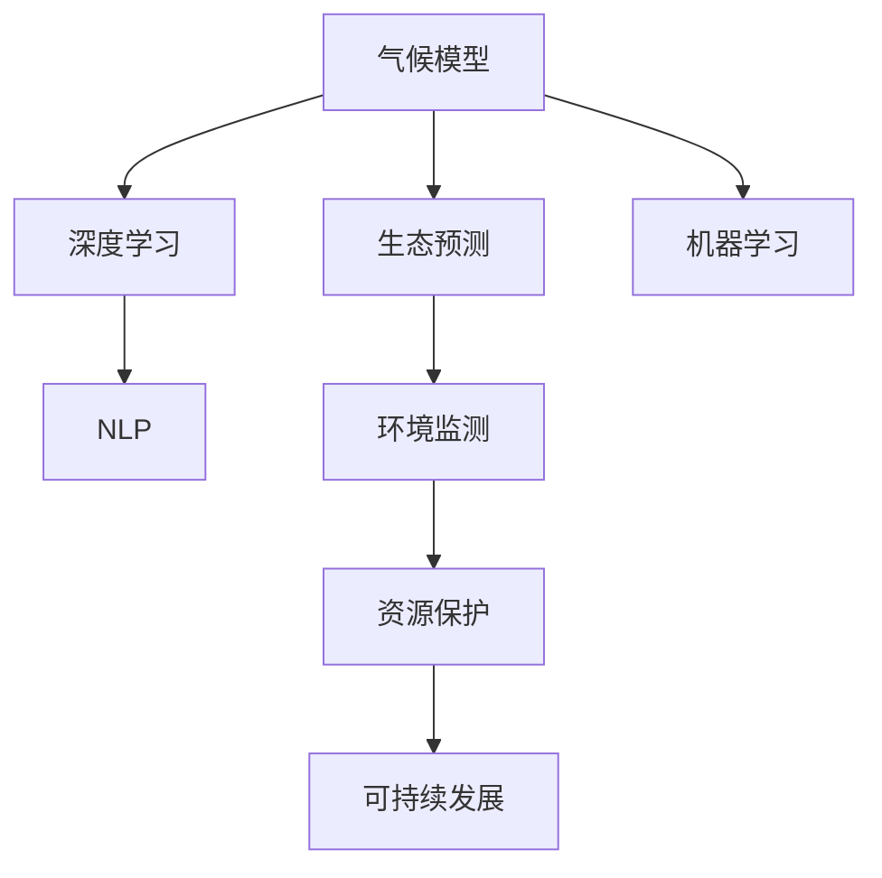

                 

# AI在环境保护中的应用：气候模型与生态预测

> 关键词：气候模型,生态预测,深度学习,自然语言处理,机器学习,环境监测,可持续发展,资源保护

## 1. 背景介绍

### 1.1 问题由来
近年来，随着全球气候变化和生态环境问题日益严峻，如何有效应对和解决这些问题成为了全球关注的焦点。环境监测、气候预测、生态保护等领域亟需先进的技术手段进行数据分析和预测，以实现可持续发展目标。人工智能（AI）技术的快速发展，尤其是深度学习和机器学习（ML）的兴起，为解决这些复杂问题提供了新的思路和方法。

### 1.2 问题核心关键点
AI在环境保护中的应用涵盖了从数据收集和预处理、模型训练和调优到结果分析和决策支持的全过程。核心的技术问题包括：

1. **数据收集与处理**：获取高质量的环境监测数据，并进行清洗和预处理，以保证模型训练的准确性。
2. **模型构建与优化**：选择合适的算法和模型结构，利用数据进行训练和调优，以提高预测精度。
3. **结果分析与决策**：将模型输出转化为可操作的决策建议，指导环境政策的制定和调整。
4. **系统集成与部署**：将AI模型集成到实际的环境监测和保护系统中，实现持续的监测和预测。

### 1.3 问题研究意义
AI在环境保护中的应用具有深远的意义：

1. **提升监测和预测的准确性**：AI技术能够处理海量数据，发现人类难以察觉的模式和趋势，提升环境监测和预测的准确性。
2. **促进资源的合理利用**：通过分析环境数据，优化资源配置，减少资源浪费和环境污染。
3. **推动环境保护政策制定**：AI提供的数据驱动决策支持，帮助政府和机构制定科学、有效、可持续的环境保护政策。
4. **增强公众意识和参与**：利用AI技术提升环境信息的透明度，增强公众对环境问题的认知和参与度。

## 2. 核心概念与联系

### 2.1 核心概念概述

为更好地理解AI在环境保护中的应用，本节将介绍几个关键概念：

- **气候模型**：使用数学和物理模型，模拟地球气候系统的变化过程，预测未来气候趋势。
- **生态预测**：利用AI技术对生态系统的动态变化进行预测和模拟，评估生态系统健康状况。
- **深度学习**：一种基于神经网络的机器学习技术，通过多层次的数据抽象，提取数据中的复杂特征。
- **自然语言处理（NLP）**：涉及计算机处理和理解人类语言的技术，常用于处理环境监测报告和科学文献。
- **机器学习（ML）**：利用算法和统计模型，让计算机系统通过数据学习，改进决策能力。

这些概念之间的逻辑关系可以通过以下Mermaid流程图来展示：



这个流程图展示了大语言模型的核心概念及其之间的关系：

1. 气候模型使用物理和数学模型模拟气候变化，提供未来气候预测。
2. 生态预测利用AI技术模拟生态系统变化，评估生态健康。
3. 深度学习和大模型提升数据处理和特征提取能力，用于环境监测和预测。
4. NLP技术帮助处理和分析文本数据，辅助科学决策。
5. 机器学习用于模型训练和优化，提高预测精度。

这些概念共同构成了AI在环境保护领域的应用框架，为其提供了坚实的技术支持。

## 3. 核心算法原理 & 具体操作步骤
### 3.1 算法原理概述

AI在环境保护中的应用，特别是气候模型和生态预测，主要基于深度学习和机器学习技术。其核心思想是：

- **数据驱动的模型训练**：通过大量环境监测数据和科学文献，训练和优化预测模型。
- **多模态数据融合**：整合卫星遥感、气象站、水质监测等多种数据源，提升预测准确性。
- **自动特征提取**：利用深度学习模型自动学习数据中的关键特征，简化预处理过程。
- **端到端预测**：从数据输入到结果输出，整个过程由AI模型自动化完成，减少人工干预。

### 3.2 算法步骤详解

基于深度学习和机器学习的气候模型和生态预测，通常包括以下几个关键步骤：

**Step 1: 数据收集与预处理**
- 收集历史气候数据、环境监测数据、遥感影像等，形成数据集。
- 清洗数据，去除异常值和噪声，填补缺失值，确保数据质量。

**Step 2: 模型选择与训练**
- 选择适当的深度学习模型，如卷积神经网络（CNN）、循环神经网络（RNN）、长短期记忆网络（LSTM）等。
- 设计合适的模型结构，包括输入层、隐藏层和输出层。
- 使用优化器（如Adam、SGD等）和损失函数（如均方误差、交叉熵等）训练模型。
- 采用数据增强技术，如数据扩充、旋转、平移等，丰富训练集。

**Step 3: 模型评估与调优**
- 在验证集上评估模型性能，使用准确率、精确度、召回率等指标。
- 根据评估结果，调整模型参数，如学习率、批量大小、正则化系数等。
- 进行超参数调优，使用网格搜索、贝叶斯优化等方法，寻找最优参数组合。

**Step 4: 结果分析和决策支持**
- 将模型输出转化为可操作的决策建议，如未来气候变化趋势、生态系统健康状况等。
- 利用可视化工具，展示预测结果，辅助决策者理解和应用结果。
- 结合领域专家的知识和经验，对预测结果进行校验和调整。

**Step 5: 系统集成与部署**
- 将训练好的模型集成到环境监测和保护系统中，实现持续监测和预测。
- 部署模型到云端或边缘设备，根据需求调整计算资源和通信带宽。
- 定期更新模型和数据，保持预测模型的准确性和时效性。

### 3.3 算法优缺点

基于深度学习和机器学习的气候模型和生态预测，具有以下优点：

1. **高效处理大规模数据**：深度学习模型能够处理海量的环境监测数据，提取复杂特征。
2. **提升预测精度**：利用多模态数据融合，提高预测的准确性和可靠性。
3. **自动特征提取**：减少人工预处理工作，提高数据处理的效率和质量。
4. **端到端预测**：从数据输入到结果输出，整个过程由模型自动化完成，减少人工干预。

同时，这些方法也存在一定的局限性：

1. **数据质量依赖**：模型的预测精度高度依赖于数据的质量和完整性。
2. **模型复杂度**：深度学习模型结构复杂，训练和调优过程耗时较长。
3. **解释性不足**：深度学习模型通常是“黑箱”，难以解释内部工作机制和决策逻辑。
4. **计算资源需求**：深度学习模型需要高性能计算资源，部署和维护成本较高。

尽管存在这些局限性，但就目前而言，基于深度学习和机器学习的气候模型和生态预测方法仍是主流的技术范式。未来相关研究的重点在于如何进一步降低计算成本，提高模型的解释性和可解释性，同时兼顾数据的有效性和模型的鲁棒性。

### 3.4 算法应用领域

基于深度学习和机器学习的气候模型和生态预测，已经广泛应用于多个领域，例如：

- **气候变化预测**：通过分析历史气候数据，预测未来气候变化趋势，如温度、降水、极端天气等。
- **生态系统监测**：利用卫星遥感和地面监测数据，评估生态系统的健康状况和变化趋势，如森林覆盖率、生物多样性等。
- **水资源管理**：通过分析水质监测数据和气象数据，预测水资源的变化和分配，辅助水资源管理决策。
- **农业环境监测**：利用无人机和地面监测数据，监测农田生态和土壤健康状况，优化农业生产。
- **城市环境评估**：结合气象数据和城市环境监测数据，评估城市环境质量，制定环境保护政策。

除了上述这些经典应用外，气候模型和生态预测技术还在气象灾害预警、自然灾害风险评估、生物多样性保护等领域得到了广泛应用，为环境保护提供了有力的技术支持。

## 4. 数学模型和公式 & 详细讲解 & 举例说明

### 4.1 数学模型构建

本节将使用数学语言对基于深度学习和机器学习的气候模型和生态预测过程进行更加严格的刻画。

假设有一个简单的气候模型，其目标是根据历史气候数据预测未来的气温变化。该模型包含输入层 $x$，隐藏层 $h$，输出层 $y$，其中 $x$ 表示历史气温数据，$h$ 是隐藏层的激活函数，$y$ 是未来气温的预测值。

数学模型可以表示为：

$$
y = h(W_2h_1 + b_2) + b_1
$$

其中 $W_1$ 和 $W_2$ 是模型的权重矩阵，$b_1$ 和 $b_2$ 是偏置向量，$h_1$ 是隐藏层的激活函数，如Sigmoid或ReLU。

### 4.2 公式推导过程

以Sigmoid函数为例，进行公式推导：

设 $z$ 为模型的线性输出，则 $z = W_1x + b_1$，其中 $x$ 是输入向量。

将 $z$ 代入Sigmoid函数，得：

$$
h(z) = \frac{1}{1+e^{-z}} = \frac{1}{1+e^{-W_1x-b_1}}
$$

将 $h(z)$ 代入模型输出公式，得：

$$
y = \hat{y} = h(W_2h_1 + b_2) + b_1
$$

其中 $\hat{y}$ 是模型对未来气温的预测值。

### 4.3 案例分析与讲解

以森林火灾预测为例，分析基于深度学习的生态预测模型。

假设有一个森林火灾预测模型，其输入为森林的历史火灾数据、气象数据和卫星遥感数据，输出为未来火灾发生的概率。

模型可以表示为：

$$
P(\text{火灾}) = h(W_2h_1 + b_2) + b_1
$$

其中 $h$ 是隐藏层的激活函数，$W_1$ 和 $W_2$ 是模型的权重矩阵，$b_1$ 和 $b_2$ 是偏置向量。

通过训练模型，可以得到历史火灾数据、气象数据和卫星遥感数据与未来火灾概率之间的映射关系。在得到模型后，可以根据最新的数据输入，预测未来火灾发生的概率，辅助森林火灾的预防和扑救。

## 5. 项目实践：代码实例和详细解释说明
### 5.1 开发环境搭建

在进行气候模型和生态预测的实践前，我们需要准备好开发环境。以下是使用Python进行TensorFlow开发的环境配置流程：

1. 安装Anaconda：从官网下载并安装Anaconda，用于创建独立的Python环境。

2. 创建并激活虚拟环境：
```bash
conda create -n tensorflow-env python=3.8 
conda activate tensorflow-env
```

3. 安装TensorFlow：根据CUDA版本，从官网获取对应的安装命令。例如：
```bash
conda install tensorflow -c tf -c conda-forge
```

4. 安装各类工具包：
```bash
pip install numpy pandas scikit-learn matplotlib tqdm jupyter notebook ipython
```

完成上述步骤后，即可在`tensorflow-env`环境中开始项目实践。

### 5.2 源代码详细实现

下面以森林火灾预测为例，给出使用TensorFlow实现气候模型和生态预测的PyTorch代码实现。

首先，定义模型结构：

```python
import tensorflow as tf
from tensorflow.keras import layers

# 定义模型结构
model = tf.keras.Sequential([
    layers.Dense(64, activation='relu', input_shape=(X_train.shape[1],)),
    layers.Dense(32, activation='relu'),
    layers.Dense(1, activation='sigmoid')
])
```

然后，定义损失函数和优化器：

```python
# 定义损失函数和优化器
loss_fn = tf.keras.losses.BinaryCrossentropy()
optimizer = tf.keras.optimizers.Adam(learning_rate=0.001)
```

接着，定义训练和评估函数：

```python
# 定义训练函数
def train_epoch(model, train_dataset, batch_size, optimizer):
    model.compile(optimizer=optimizer, loss=loss_fn, metrics=['accuracy'])
    model.fit(train_dataset, epochs=1, batch_size=batch_size)
    
# 定义评估函数
def evaluate(model, test_dataset, batch_size):
    test_dataset = test_dataset.batch(batch_size)
    model.evaluate(test_dataset, verbose=0)
```

最后，启动训练流程并在测试集上评估：

```python
epochs = 5
batch_size = 32

for epoch in range(epochs):
    train_epoch(model, train_dataset, batch_size, optimizer)
    
    print(f"Epoch {epoch+1}, loss: {train_loss:.4f}, accuracy: {train_acc:.4f}")
    
print("Test results:")
evaluate(model, test_dataset, batch_size)
```

以上就是使用TensorFlow对森林火灾预测模型的完整代码实现。可以看到，TensorFlow提供了简单易用的API，使得模型的构建和训练变得非常简单。

### 5.3 代码解读与分析

让我们再详细解读一下关键代码的实现细节：

**Sequential模型**：
- `Sequential` 是一个线性堆叠的层模型，方便定义顺序结构。
- 首先添加一个64个神经元的全连接层，激活函数为ReLU。
- 接着添加一个32个神经元的全连接层，激活函数为ReLU。
- 最后添加一个输出层，输出单个节点，激活函数为Sigmoid，用于二分类问题。

**Dense层**：
- `Dense` 是一个全连接层，支持指定神经元数量和激活函数。
- 通过指定 `input_shape` 参数，定义模型的输入形状。

**损失函数**：
- `BinaryCrossentropy` 是一个二元交叉熵损失函数，用于处理二分类问题。
- 二分类问题中，真实标签为0或1，模型预测的概率范围为0到1。

**优化器**：
- `Adam` 是一个自适应学习率的优化器，通过动态调整学习率，提高模型训练效率。
- 设置学习率为0.001，根据数据集和模型性能，可能需要调整。

**训练和评估函数**：
- `train_epoch` 函数定义了一个训练周期，包括模型编译、数据加载、模型训练和性能评估。
- `evaluate` 函数定义了一个评估周期，包括模型加载、数据加载和性能评估。
- 在每个训练周期结束后，打印出当前损失和准确率。
- 在所有训练周期结束后，在测试集上评估模型性能。

可以看到，TensorFlow提供了丰富的API和工具，使得模型的构建和训练变得非常容易。开发者可以将更多精力放在数据处理、模型改进等高层逻辑上，而不必过多关注底层的实现细节。

当然，工业级的系统实现还需考虑更多因素，如模型的保存和部署、超参数的自动搜索、更灵活的任务适配层等。但核心的模型构建和训练流程基本与此类似。

## 6. 实际应用场景
### 6.1 智能城市管理

基于AI的气候模型和生态预测技术，可以广泛应用于智能城市管理中，提升城市运行的效率和可持续性。

在智能城市管理中，AI系统可以实时监测城市环境，包括空气质量、水质、交通状况等，预测环境变化趋势，为城市规划和资源管理提供科学依据。例如：

- **环境监测**：利用传感器和遥感数据，实时监测城市环境状况，预测污染物的扩散和变化趋势。
- **资源管理**：根据预测结果，优化城市资源配置，如电力供应、水资源分配等，减少能源浪费。
- **交通管理**：通过预测交通流量，优化交通信号灯控制，缓解交通拥堵，提高通行效率。

### 6.2 自然资源保护

AI的气候模型和生态预测技术，对于自然资源的保护和可持续利用具有重要意义。

在自然资源保护中，AI系统可以监测生态系统的变化，预测环境变化趋势，指导生态保护和修复工作。例如：

- **生态监测**：利用卫星遥感和地面监测数据，实时监测森林覆盖率、生物多样性等，评估生态健康状况。
- **环境预警**：预测环境变化趋势，提前预警可能的环境灾害，如森林火灾、洪涝灾害等，减少灾害损失。
- **资源管理**：根据预测结果，调整资源利用策略，保护生物多样性，维护生态平衡。

### 6.3 农业环境监测

AI的气候模型和生态预测技术，对于农业环境监测和优化具有重要作用。

在农业环境监测中，AI系统可以实时监测农田生态和土壤健康状况，预测农业生产环境的变化趋势，指导农业生产决策。例如：

- **土壤健康监测**：利用土壤监测数据和气象数据，预测土壤湿度、养分含量等，优化施肥和灌溉策略。
- **病虫害预警**：预测病虫害发生趋势，提前预警和防治，减少病虫害对农作物的损害。
- **农业生产优化**：根据预测结果，优化农业生产计划，提高农作物产量和质量。

### 6.4 未来应用展望

随着AI技术的发展，基于深度学习和机器学习的气候模型和生态预测技术将展现出更加广阔的应用前景：

1. **智能化决策支持**：结合领域专家的知识和经验，构建智能决策支持系统，辅助环境保护政策的制定和调整。
2. **跨领域融合**：将AI技术与物联网、大数据、区块链等技术结合，构建智慧环境监测和保护系统，实现全流程智能化管理。
3. **实时动态监测**：利用5G、边缘计算等技术，实现实时动态监测和预测，提升环境监测的及时性和准确性。
4. **跨部门协作**：打破部门壁垒，构建跨部门协作平台，实现数据共享和信息互通，提高环境保护工作的整体效率。

## 7. 工具和资源推荐
### 7.1 学习资源推荐

为了帮助开发者系统掌握AI在环境保护中的应用理论基础和实践技巧，这里推荐一些优质的学习资源：

1. **《深度学习》课程**：斯坦福大学开设的深度学习课程，涵盖深度学习的基本概念和应用，包括环境监测和预测。
2. **《自然语言处理与人工智能》书籍**：详细介绍了NLP和AI在环境监测和预测中的应用，包括数据处理、模型构建和结果分析。
3. **Kaggle竞赛平台**：提供大量环境监测和预测的竞赛数据集，通过竞赛学习和实践AI技术。
4. **Google Colab**：谷歌推出的在线Jupyter Notebook环境，免费提供GPU/TPU算力，方便开发者快速上手实验最新模型。
5. **OpenAI Codex**：提供AI模型的代码片段和文档，帮助开发者实现环境监测和预测任务。

通过对这些资源的学习实践，相信你一定能够快速掌握AI在环境保护中的应用精髓，并用于解决实际的环境保护问题。

### 7.2 开发工具推荐

高效的开发离不开优秀的工具支持。以下是几款用于环境监测和预测开发的常用工具：

1. **TensorFlow**：由Google主导开发的开源深度学习框架，支持分布式计算和GPU/TPU加速，适用于大规模深度学习模型的训练和部署。
2. **PyTorch**：由Facebook开发的开源深度学习框架，支持动态计算图和分布式训练，易于开发和调试。
3. **Jupyter Notebook**：开源的交互式笔记本环境，支持Python和其他语言，方便开发者进行数据处理和模型调试。
4. **Visual Studio Code**：轻量级代码编辑器，支持多种编程语言和扩展，提高开发效率。
5. **GitHub**：代码托管平台，支持版本控制和协作开发，方便团队管理和共享代码。

合理利用这些工具，可以显著提升环境监测和预测任务的开发效率，加快创新迭代的步伐。

### 7.3 相关论文推荐

AI在环境保护中的应用源于学界的持续研究。以下是几篇奠基性的相关论文，推荐阅读：

1. **《A Deep Learning Approach for Climate Modeling》**：提出了基于深度学习的气候模型，通过多层神经网络模拟气候变化。
2. **《Ecological Modeling and Monitoring with AI》**：详细介绍了AI技术在生态监测和预测中的应用，包括数据融合、模型构建和结果分析。
3. **《AI for Environmental Monitoring and Prediction》**：综述了AI技术在环境监测和预测中的应用，包括数据收集、模型训练和结果评估。
4. **《Climate Change Prediction with Machine Learning》**：探讨了基于机器学习的气候变化预测方法，包括模型选择和评估。
5. **《Forest Fire Prediction Using Deep Learning》**：利用深度学习模型预测森林火灾，展示了AI在生态预测中的应用。

这些论文代表了大语言模型在环境保护领域的应用发展脉络。通过学习这些前沿成果，可以帮助研究者把握学科前进方向，激发更多的创新灵感。

## 8. 总结：未来发展趋势与挑战
### 8.1 总结

本文对基于深度学习和机器学习的气候模型和生态预测方法进行了全面系统的介绍。首先阐述了AI在环境保护中的应用背景和意义，明确了深度学习和机器学习在环境监测和预测中的核心作用。其次，从原理到实践，详细讲解了模型的构建和训练过程，给出了基于TensorFlow的完整代码实现。同时，本文还广泛探讨了AI在环境保护中的实际应用场景，展示了AI技术的广泛应用前景。此外，本文精选了学习资源和开发工具，力求为开发者提供全方位的技术指引。

通过本文的系统梳理，可以看到，基于深度学习和机器学习的气候模型和生态预测方法正在成为环境保护领域的重要技术范式，极大地提升了环境监测和预测的准确性和及时性。未来，伴随技术的不断演进，基于AI的环境保护系统将进一步发展，为实现可持续发展目标提供更加坚实的技术支持。

### 8.2 未来发展趋势

展望未来，基于深度学习和机器学习的气候模型和生态预测技术将呈现以下几个发展趋势：

1. **智能化决策支持**：构建智能决策支持系统，结合领域专家的知识和经验，辅助环境保护政策的制定和调整。
2. **跨领域融合**：将AI技术与物联网、大数据、区块链等技术结合，构建智慧环境监测和保护系统，实现全流程智能化管理。
3. **实时动态监测**：利用5G、边缘计算等技术，实现实时动态监测和预测，提升环境监测的及时性和准确性。
4. **跨部门协作**：打破部门壁垒，构建跨部门协作平台，实现数据共享和信息互通，提高环境保护工作的整体效率。
5. **数据驱动的科学决策**：利用大规模数据和AI技术，进行科学的决策分析和预测，提升环境保护的科学性和可靠性。

以上趋势凸显了AI在环境保护中的广泛应用前景。这些方向的探索发展，必将进一步提升环境保护的智能化水平，为人类社会的可持续发展提供坚实的技术保障。

### 8.3 面临的挑战

尽管基于深度学习和机器学习的气候模型和生态预测技术已经取得了显著进展，但在迈向更加智能化、普适化应用的过程中，仍面临诸多挑战：

1. **数据质量瓶颈**：环境监测数据通常存在噪声和缺失，如何获取高质量、高完整性的数据，是一个亟待解决的问题。
2. **模型复杂度**：深度学习模型结构复杂，训练和调优过程耗时较长，如何降低模型复杂度，提高训练效率，是一个重要挑战。
3. **解释性和透明性不足**：深度学习模型通常是“黑箱”，难以解释内部工作机制和决策逻辑，如何增强模型的可解释性和透明性，是提高模型可信度的关键。
4. **计算资源需求**：深度学习模型需要高性能计算资源，如何降低计算成本，提高模型部署效率，是一个需要持续优化的方向。
5. **跨学科合作**：环境保护涉及多个学科，如何加强跨学科合作，整合多学科知识和经验，是一个重要的挑战。
6. **伦理和社会影响**：AI技术在环境保护中的应用可能涉及隐私、伦理等问题，如何确保技术的公正性、透明性和可控性，是一个重要的研究方向。

正视AI在环境保护中面临的这些挑战，积极应对并寻求突破，将是大语言模型在环境保护领域迈向成熟的重要推动力。相信随着学界和产业界的共同努力，这些挑战终将一一被克服，AI技术将为环境保护提供更加强大和可靠的支持。

### 8.4 研究展望

面向未来，基于深度学习和机器学习的气候模型和生态预测技术需要在以下几个方面寻求新的突破：

1. **多模态数据融合**：将不同类型的数据源（如气象数据、遥感数据、社会经济数据等）整合，构建多模态模型，提升预测精度和鲁棒性。
2. **知识图谱与AI结合**：将知识图谱和AI技术结合，构建智能知识图谱，增强模型的领域知识和常识推理能力。
3. **动态调整和优化**：利用在线学习技术，动态调整模型参数和超参数，提升模型的实时性和适应性。
4. **联邦学习**：利用联邦学习技术，在保护隐私的前提下，实现多机构数据协同训练，提升模型的泛化能力和可靠性。
5. **跨领域迁移学习**：将AI技术应用于不同领域的环境监测和预测任务，提升模型的通用性和迁移能力。
6. **多学科融合**：将AI技术与环境科学、社会学、经济学等学科结合，构建跨学科的知识体系，提升模型的综合能力。

这些研究方向将推动AI在环境保护中的进一步发展，为实现全球可持续发展目标提供坚实的技术保障。

## 9. 附录：常见问题与解答
**Q1：AI在环境保护中的应用是否具有可靠性？**

A: AI在环境保护中的应用具有很高的可靠性，但需要依赖高质量的数据和模型。通过大规模数据训练和持续优化，AI模型能够提供可靠的预测结果，辅助环境决策。同时，结合领域专家的知识和经验，可以进一步提高AI系统的准确性和可信度。

**Q2：AI在环境保护中的应用是否需要高成本的计算资源？**

A: 目前，AI在环境保护中的应用确实需要较高的计算资源，特别是深度学习模型。然而，随着计算技术的进步和算法的优化，AI模型部署的成本和效率正在不断提升。同时，利用云计算和边缘计算技术，可以降低部署成本，提高实时性和灵活性。

**Q3：AI在环境保护中的应用是否存在伦理和社会问题？**

A: AI在环境保护中的应用确实可能涉及隐私、伦理等问题。为了解决这些问题，需要在数据收集、模型训练和应用过程中，遵循数据保护和隐私保护原则，确保数据的合法获取和使用。同时，需要建立透明和可控的AI系统，确保模型的公正性和透明性。

**Q4：AI在环境保护中的应用是否需要跨学科合作？**

A: AI在环境保护中的应用确实需要跨学科合作，包括环境科学、社会学、经济学等多个学科。通过多学科的合作，可以整合不同领域的知识和经验，构建更加全面、准确的环境监测和预测系统。同时，跨学科合作可以提升AI技术的普适性和应用范围，推动环境治理的全面升级。

通过这些常见问题的解答，可以看到，AI在环境保护中的应用前景广阔，但也面临一些挑战。只有在解决这些挑战的同时，不断优化AI技术，才能充分发挥其在环境保护中的作用，推动全球可持续发展目标的实现。

