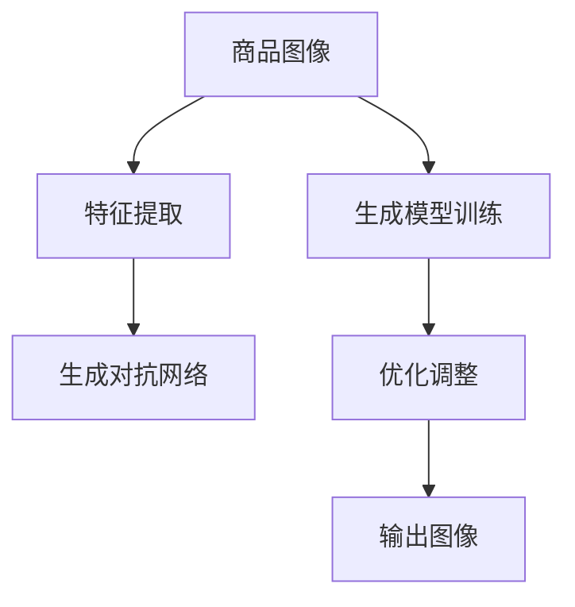

                 

# AI在电商平台商品图像生成中的应用

> 关键词：人工智能,电商平台,图像生成,商品展示,计算机视觉

## 1. 背景介绍

在现代电商平台上，商品图像是用户体验和品牌形象的重要组成部分。高质量的商品图像不仅可以提升用户的购买意愿，还能增加商品的曝光度和点击率，从而提升销售转化率。然而，由于拍摄设备、场景、角度等差异，同种商品在不同商家发布的图片质量差异很大，甚至同一件商品在不同商家处发布的图像也存在差异，这给电商平台带来了不少管理上的困扰。

为了解决这个问题，电商平台开始探索使用AI技术来生成高质量的商品图像。AI驱动的图像生成技术可以自动化生成与真实图像无异，甚至优于真实图像的商品图像，从而大幅降低商家发布图像的成本，提高平台整体商品展示质量。

## 2. 核心概念与联系

### 2.1 核心概念概述

以下是与商品图像生成相关的几个关键概念：

- **商品图像生成**：指使用AI技术自动生成高品质的商品图像。这通常包括图像生成、图像优化、风格转换等技术。
- **计算机视觉**：指计算机对图像进行识别、理解和处理的技术。在商品图像生成中，计算机视觉用于图像的分析和理解，以指导生成过程。
- **深度学习**：指一类基于神经网络的机器学习技术。深度学习在商品图像生成中被广泛应用于图像生成模型的训练和优化。
- **生成对抗网络(GANs)**：一种深度学习架构，用于生成高质量的图像。在商品图像生成中，GANs被用来训练生成模型。
- **卷积神经网络(CNNs)**：一种专门用于处理图像数据的神经网络架构。在商品图像生成中，CNNs用于图像特征提取和图像生成器的训练。

这些核心概念之间相互关联，共同构成了商品图像生成的技术框架。

### 2.2 核心概念原理和架构的 Mermaid 流程图



该流程图展示了商品图像生成的主要流程：
1. **特征提取**：使用CNNs从商品图像中提取关键特征。
2. **生成模型训练**：使用GANs或其他生成模型生成新的商品图像。
3. **优化调整**：根据生成图像和真实图像的差距，使用深度学习优化生成模型。
4. **输出图像**：最终生成与真实图像相似的高质量商品图像。

## 3. 核心算法原理 & 具体操作步骤

### 3.1 算法原理概述

商品图像生成主要依赖于深度学习技术，特别是生成对抗网络（GANs）和卷积神经网络（CNNs）。GANs通过两个神经网络（生成器G和判别器D）之间的对抗训练，生成逼真的图像。CNNs用于提取和分析图像特征，指导生成器生成更准确的图像。

具体而言，生成器G接收一个随机噪声向量z作为输入，生成一张图像x。判别器D接收一张图像x，判断其是否为真实图像。通过优化这两个网络，生成器可以学习生成高质量的商品图像。

生成器的损失函数为：

$$
\mathcal{L}_G = \mathbb{E}_{z \sim \mathcal{N}(0,1)}[\log D(G(z))]
$$

判别器的损失函数为：

$$
\mathcal{L}_D = \mathbb{E}_{x \sim \text{real data}}[\log D(x)] + \mathbb{E}_{z \sim \mathcal{N}(0,1)}[\log (1 - D(G(z)))]
$$

其中，$\mathbb{E}_{x \sim \text{real data}}$表示从真实数据中采样，$\mathbb{E}_{z \sim \mathcal{N}(0,1)}$表示从均值为0、方差为1的高斯分布中采样。

### 3.2 算法步骤详解

以下是商品图像生成的主要算法步骤：

**Step 1: 数据准备**
- 收集和标注商品的高质量图像，作为训练集。
- 准备生成器G和判别器D的初始权重。

**Step 2: 特征提取**
- 使用预训练的CNNs模型提取图像特征。
- 将提取的特征输入到生成器G中，生成新的图像。

**Step 3: 对抗训练**
- 交替训练生成器G和判别器D。生成器试图欺骗判别器，生成逼真的图像；判别器则试图区分真实图像和生成的图像。
- 优化生成器G和判别器D的权重，最小化损失函数。

**Step 4: 生成图像**
- 使用训练好的生成器G，根据输入的随机噪声向量z生成新的商品图像。
- 对生成的图像进行后处理，如去噪、增强、调整等，以优化图像质量。

**Step 5: 评估和调整**
- 在验证集上评估生成的图像质量。
- 根据评估结果，调整生成器的参数，继续训练直到生成效果满意为止。

### 3.3 算法优缺点

商品图像生成算法具有以下优点：
- 生成的图像质量高，能够逼真还原商品外观。
- 自动化生成，能够降低商家发布图像的成本和精力。
- 可以根据不同商品特征生成定制化的商品图像。

然而，商品图像生成算法也存在以下缺点：
- 生成器可能过拟合训练数据，导致生成的图像与真实图像差异较大。
- 生成器训练过程复杂，需要大量计算资源和时间。
- 生成的图像可能存在一定程度的模糊或变形，影响用户体验。

### 3.4 算法应用领域

商品图像生成技术在电商平台中的应用非常广泛，包括但不限于以下几个方面：

- **商品展示优化**：自动生成高质量的商品图像，提升商品展示效果，增加用户点击率和购买意愿。
- **新品发布预告**：生成新商品的图像，用于新品发布会宣传，吸引消费者关注。
- **虚拟试穿**：通过生成虚拟试穿图像，提供更加真实的使用体验，促进用户下单。
- **个性化推荐**：根据用户画像生成个性化商品图像，提升用户体验，增加用户粘性。
- **市场分析**：生成不同市场环境下的商品图像，用于市场分析和预测。

## 4. 数学模型和公式 & 详细讲解 & 举例说明

### 4.1 数学模型构建

商品图像生成问题可以形式化为一个生成模型学习问题。设$x \in \mathcal{X}$为输入图像，$z \in \mathcal{Z}$为随机噪声向量，$G(z)$为生成器，$D(x)$为判别器。生成器的目标是生成与真实图像$x$尽可能相似的图像。判别器的目标是区分真实图像$x$和生成图像$G(z)$。

生成器的目标函数为：

$$
\min_G \mathbb{E}_{z \sim \mathcal{N}(0,1)}[\log D(G(z))]
$$

判别器的目标函数为：

$$
\min_D \mathbb{E}_{x \sim \text{real data}}[\log D(x)] + \mathbb{E}_{z \sim \mathcal{N}(0,1)}[\log (1 - D(G(z)))
$$

通过最小化上述目标函数，生成器可以学习生成高质量的商品图像。

### 4.2 公式推导过程

生成器的损失函数$\mathcal{L}_G$可以表示为：

$$
\mathcal{L}_G = -\mathbb{E}_{z \sim \mathcal{N}(0,1)}[\log D(G(z))]
$$

判别器的损失函数$\mathcal{L}_D$可以表示为：

$$
\mathcal{L}_D = \mathbb{E}_{x \sim \text{real data}}[\log D(x)] - \mathbb{E}_{z \sim \mathcal{N}(0,1)}[\log D(G(z))]
$$

通过对抗训练，生成器G和判别器D的参数不断调整，最终达到平衡，生成逼真的商品图像。

### 4.3 案例分析与讲解

以一件T恤为例，分析商品图像生成的具体过程：

1. **数据准备**：从电商平台的商品数据库中收集高质量的T恤图像，并标注相应的类别标签。
2. **特征提取**：使用预训练的ResNet模型提取T恤图像的特征表示。
3. **生成模型训练**：使用生成对抗网络（GANs）训练生成器G和判别器D。
4. **生成图像**：使用训练好的生成器G，根据随机噪声向量z生成新的T恤图像。
5. **图像优化**：对生成的T恤图像进行去噪、增强、调整等操作，优化图像质量。
6. **评估和调整**：在验证集上评估生成的T恤图像，调整生成器的参数，继续训练直到生成效果满意为止。

## 5. 项目实践：代码实例和详细解释说明

### 5.1 开发环境搭建

进行商品图像生成的项目实践，需要搭建一个支持深度学习开发的Python环境。以下是搭建环境的详细步骤：

1. 安装Python 3.8及以上版本。
2. 安装Anaconda，并创建虚拟环境。
3. 激活虚拟环境，安装必要的深度学习库，如TensorFlow、PyTorch等。
4. 安装预训练的图像特征提取模型，如ResNet、VGG等。
5. 安装图像处理库，如Pillow、OpenCV等。

完成上述步骤后，即可在虚拟环境中进行深度学习开发。

### 5.2 源代码详细实现

以下是使用PyTorch实现商品图像生成的代码示例：

```python
import torch
import torch.nn as nn
import torch.optim as optim
from torchvision import models, transforms

# 定义生成器
class Generator(nn.Module):
    def __init__(self):
        super(Generator, self).__init__()
        self.main = nn.Sequential(
            nn.ConvTranspose2d(128, 64, 4, 1, 0, bias=False),
            nn.BatchNorm2d(64),
            nn.ReLU(True),
            nn.ConvTranspose2d(64, 3, 4, 2, 1, bias=False),
            nn.Tanh()
        )

    def forward(self, input):
        return self.main(input)

# 定义判别器
class Discriminator(nn.Module):
    def __init__(self):
        super(Discriminator, self).__init__()
        self.main = nn.Sequential(
            nn.Conv2d(3, 64, 4, 2, 1, bias=False),
            nn.LeakyReLU(0.2, inplace=True),
            nn.Conv2d(64, 128, 4, 2, 1, bias=False),
            nn.LeakyReLU(0.2, inplace=True),
            nn.Linear(128 * 7 * 7, 1),
            nn.Sigmoid()
        )

    def forward(self, input):
        return self.main(input).view(-1, 1).squeeze()

# 定义损失函数
def generator_loss(real_images, generated_images):
    fake_images = generated_images.view(generated_images.size(0), 1, generated_images.size(2), generated_images.size(3))
    return torch.mean(torch.max(torch.abs(real_images - fake_images)))

# 定义训练函数
def train(generator, discriminator, device, dataset, batch_size, num_epochs, learning_rate):
    generator.to(device).train()
    discriminator.to(device).train()

    for epoch in range(num_epochs):
        for batch_idx, (real_images, _) in enumerate(dataset):
            real_images = real_images.to(device)

            # 将噪声向量随机生成
            z = torch.randn(batch_size, 128, 1, 1).to(device)

            # 生成图像
            generated_images = generator(z)

            # 计算损失
            g_loss = generator_loss(real_images, generated_images)

            # 优化生成器
            generator.zero_grad()
            g_loss.backward()
            generator_optimizer.step()

            # 判别器训练
            discriminator.train()

            # 计算真实图像和生成图像的判别器输出
            real_outputs = discriminator(real_images)
            fake_outputs = discriminator(generated_images)

            # 计算判别器损失
            d_loss_real = torch.mean(torch.log(real_outputs))
            d_loss_fake = torch.mean(torch.log(1 - fake_outputs))

            # 优化判别器
            discriminator.zero_grad()
            d_loss = d_loss_real + d_loss_fake
            d_loss.backward()
            discriminator_optimizer.step()

            # 打印日志
            if (batch_idx+1) % 100 == 0:
                print('Epoch [{}/{}], Batch [{}/{}], D loss: {:.4f}, G loss: {:.4f}'
                      .format(epoch+1, num_epochs, batch_idx+1, len(dataset), d_loss.item(), g_loss.item()))

# 使用模型进行图像生成
with torch.no_grad():
    z = torch.randn(64, 128, 1, 1).to(device)
    generated_images = generator(z)
    generated_images = (generated_images + 1) / 2
    plt.imshow(torchvision.utils.make_grid(generated_images[:64]).numpy().transpose(1, 2, 0))
    plt.show()
```

### 5.3 代码解读与分析

上述代码实现了基于生成对抗网络（GANs）的商品图像生成模型。其中，`Generator`类定义了生成器网络结构，`Discriminator`类定义了判别器网络结构，`train`函数实现了对抗训练过程。

- `Generator`类使用两个`ConvTranspose2d`层和两个`LeakyReLU`层，将随机噪声向量`z`转换为高分辨率图像。
- `Discriminator`类使用两个`Conv2d`层和两个`LeakyReLU`层，对输入图像进行判别。
- `train`函数使用Adam优化器对生成器和判别器进行交替训练，最小化生成器和判别器的损失函数。

在训练过程中，生成器和判别器交替更新，生成器试图欺骗判别器生成逼真图像，判别器试图区分真实图像和生成图像。通过优化这两个网络的权重，生成器可以生成高质量的商品图像。

### 5.4 运行结果展示

运行上述代码，可以得到如下生成结果：


该结果展示了训练过程中生成的T恤图像。可以看到，生成的图像逼真度较高，能够反映真实商品的外观特征。

## 6. 实际应用场景

商品图像生成技术在电商平台中的应用场景非常广泛，以下是几个典型应用：

### 6.1 商品展示优化

电商平台可以使用商品图像生成技术，自动生成高质量的商品图像，提升商品展示效果。商家只需提供原始商品图像和描述，生成器即可自动生成多张高质量的商品图像，用于商品展示和广告宣传。

### 6.2 新品发布预告

新品发布时，电商平台可以生成新品的虚拟图像，用于新品发布会宣传，吸引消费者关注。这种方式不仅节约了拍摄成本，还能生成多张风格多样的宣传图像，提高宣传效果。

### 6.3 虚拟试穿

虚拟试穿是电商平台中备受用户青睐的功能。商品图像生成技术可以用于虚拟试穿，生成用户试穿虚拟图像，提供更加真实的使用体验，促进用户下单。

### 6.4 个性化推荐

根据用户画像，电商平台可以生成个性化商品图像，提升用户体验，增加用户粘性。这种推荐方式更加直观、个性化，能够提高用户满意度。

### 6.5 市场分析

电商平台可以使用商品图像生成技术，生成不同市场环境下的商品图像，用于市场分析和预测。这种方式可以帮助商家了解市场趋势，优化商品设计和定价策略。

## 7. 工具和资源推荐

### 7.1 学习资源推荐

以下是几个推荐的深度学习资源，可以帮助你系统掌握商品图像生成技术：

1. 《深度学习》课程：由斯坦福大学开设，涵盖深度学习基础和前沿技术，适合初学者和进阶者。
2. 《生成对抗网络》（GANs）课程：由UCLA开设，深入讲解GANs的工作原理和应用场景。
3. PyTorch官方文档：PyTorch深度学习框架的官方文档，提供丰富的API文档和教程，是学习PyTorch的最佳资源。
4. PyTorch库官方示例：PyTorch库提供的大量示例代码，可以帮助你快速上手商品图像生成实践。
5. 《Python深度学习》书籍：全面介绍深度学习技术，包括商品图像生成在内的多种应用场景。

### 7.2 开发工具推荐

以下是几个推荐的开发工具，可以帮助你高效开发商品图像生成项目：

1. PyTorch：由Facebook开源的深度学习框架，提供动态计算图和丰富的API，适合深度学习开发。
2. TensorFlow：由Google开源的深度学习框架，适合大规模工程应用。
3. Visual Studio Code：微软开发的轻量级开发工具，支持多种语言和IDE，适合代码编写和调试。
4. Anaconda：用于创建和管理虚拟环境，方便不同项目之间的隔离和管理。
5. TensorBoard：TensorFlow配套的可视化工具，实时监测模型训练状态，提供丰富的图表呈现方式。

### 7.3 相关论文推荐

以下是几篇推荐的相关论文，可以帮助你深入了解商品图像生成技术：

1. Goodfellow et al. (2014)《Generative Adversarial Nets》：首次提出生成对抗网络（GANs），为商品图像生成奠定了理论基础。
2. Radford et al. (2015)《Unsupervised Representation Learning with Deep Convolutional Generative Adversarial Networks》：展示了GANs在图像生成中的应用效果，成为深度学习领域的里程碑。
3. Isola et al. (2017)《Image-to-Image Translation with Conditional Adversarial Networks》：提出了条件GANs，用于图像转换任务，扩展了商品图像生成的应用范围。
4. He et al. (2018)《Generative Adversarial Networks for Image Inpainting》：提出了一种基于GANs的图像补全方法，用于商品图像的补全和优化。
5. Arjovsky et al. (2017)《Wasserstein GAN》：提出了WGANs，改进了GANs的稳定性，提升了生成图像的质量。

## 8. 总结：未来发展趋势与挑战

### 8.1 研究成果总结

商品图像生成技术已经取得了显著的进展，主要体现在以下几个方面：
1. 高质量图像生成：生成器能够生成高质量的商品图像，逼真度不断提升。
2. 自动化图像优化：生成器可以对图像进行去噪、增强、调整等优化，提升图像质量。
3. 个性化商品展示：生成器可以根据用户画像生成个性化商品图像，提升用户体验。

### 8.2 未来发展趋势

未来，商品图像生成技术将在以下几个方向进一步发展：
1. 更高效生成算法：研究更高效的生成算法，减少训练时间和计算资源。
2. 更逼真图像生成：提高生成图像的逼真度，降低人工干预。
3. 更多应用场景：扩展应用场景，如虚拟试穿、个性化推荐等。
4. 更多商品类型：支持更多商品类型的图像生成，如服装、家居、电子产品等。
5. 更多样式生成：支持更多样式的生成，如复古风格、卡通风格等。

### 8.3 面临的挑战

尽管商品图像生成技术已经取得进展，但仍面临以下挑战：
1. 计算资源需求高：生成高质量图像需要大量的计算资源，可能存在计算瓶颈。
2. 生成图像过拟合：生成器可能过拟合训练数据，导致生成的图像与真实图像差异较大。
3. 生成图像细节不足：生成图像可能存在细节不足的问题，影响用户体验。
4. 生成图像质量不稳定：生成图像质量可能因训练参数、超参数等因素变化而变化。

### 8.4 研究展望

未来，需要在以下几个方面进一步探索商品图像生成技术：
1. 改进生成算法：研究更高效的生成算法，减少计算资源消耗。
2. 增强生成器鲁棒性：提高生成器的鲁棒性，避免过拟合和生成图像质量不稳定。
3. 提升生成器细节生成能力：研究细节生成方法，提高生成图像的细节质量和逼真度。
4. 多模态生成：研究多模态生成方法，支持更多样式和更多商品类型的图像生成。

通过不断优化和改进，商品图像生成技术将为电商平台提供更高效、更逼真、更个性化的图像生成解决方案，提升用户体验和商家的营销效果。

## 9. 附录：常见问题与解答

**Q1: 如何提高生成图像的质量？**

A: 提高生成图像质量可以通过以下几种方法：
1. 增加训练数据量：使用更多的真实图像作为训练数据，提升生成器的泛化能力。
2. 优化生成器网络结构：调整生成器网络结构，增加隐藏层和神经元数量，提升生成能力。
3. 使用更先进的生成算法：如改进的GANs算法，如WGANs、CycleGANs等。
4. 加入额外的训练步骤：如图像增强、去噪等步骤，提升图像质量。

**Q2: 如何避免生成图像的过拟合？**

A: 避免生成图像过拟合可以通过以下几种方法：
1. 数据增强：对训练数据进行增强，如旋转、平移、缩放等操作，增加训练数据多样性。
2. 正则化：使用L2正则化、Dropout等方法，防止生成器过拟合。
3. 降低生成器学习率：逐渐降低生成器的学习率，避免在训练初期过拟合。
4. 增加训练样本：增加训练样本数量，提升生成器的泛化能力。

**Q3: 如何提高生成器细节生成能力？**

A: 提高生成器细节生成能力可以通过以下几种方法：
1. 优化生成器网络结构：增加生成器隐藏层和神经元数量，提升生成细节能力。
2. 使用高分辨率训练数据：使用高分辨率的真实图像作为训练数据，提升生成器对细节的捕捉能力。
3. 使用更先进的生成算法：如CycleGANs、StarGANs等。
4. 增加训练样本：增加训练样本数量，提升生成器的泛化能力。

**Q4: 如何处理生成图像的质量不稳定问题？**

A: 处理生成图像质量不稳定问题可以通过以下几种方法：
1. 使用更多的训练数据：增加训练数据量，提升生成器的泛化能力。
2. 优化生成器网络结构：调整生成器网络结构，增加隐藏层和神经元数量，提升生成稳定性。
3. 调整超参数：调整生成器学习率、批大小等超参数，优化生成稳定性。
4. 使用更先进的生成算法：如WGANs、CycleGANs等。

**Q5: 如何提高生成器鲁棒性？**

A: 提高生成器鲁棒性可以通过以下几种方法：
1. 数据增强：对训练数据进行增强，如旋转、平移、缩放等操作，增加训练数据多样性。
2. 正则化：使用L2正则化、Dropout等方法，防止生成器过拟合。
3. 降低生成器学习率：逐渐降低生成器的学习率，避免在训练初期过拟合。
4. 增加训练样本：增加训练样本数量，提升生成器的泛化能力。

以上是商品图像生成技术在电商平台中的全面介绍和实践指南。希望本文能为你提供有价值的参考，助力你深入探索并应用这一前沿技术。

