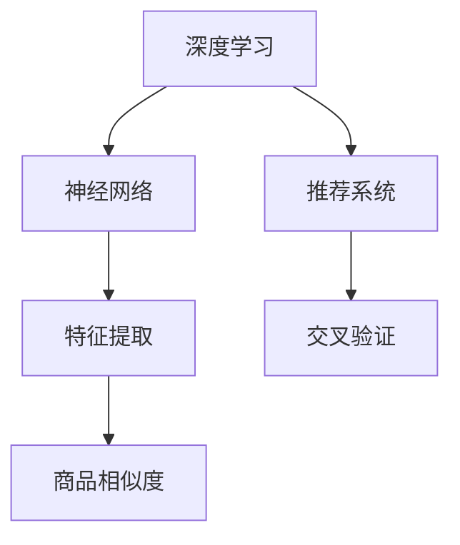

                 

# AI在电商平台商品相似度计算中的应用

## 1. 背景介绍

在数字化时代，电商平台的发展日新月异，为了提升用户体验和商家运营效率，商品推荐和搜索成为电商平台的重中之重。准确、高效的商品推荐，需要商品相似度计算作为支撑。传统商品相似度计算方法依赖手工特征设计，不仅耗时耗力，而且很难适应不同商品的多样化特性。随着AI技术在电商平台的广泛应用，商品相似度计算逐渐向基于深度学习的自动特征学习方向发展。

近年来，深度学习在图像、文本等领域的显著效果，激发了在商品相似度计算中应用的潜力。利用深度神经网络对商品图片、描述等高维特征进行建模，能够提取出更加高效和多样化的特征表示，从而提升商品相似度计算的准确性和泛化能力。同时，利用基于深度学习的推荐系统，可以在电商平台上实现个性化的商品推荐，提升用户满意度，驱动销量增长。

## 2. 核心概念与联系

### 2.1 核心概念概述

为更好地理解基于深度学习的商品相似度计算方法，本节将介绍几个关键概念：

- **深度学习**：基于多层神经网络进行特征学习的方法，能够自动提取数据中的高级特征，适用于非线性、复杂结构的特征建模。
- **神经网络**：一种由多个神经元节点层组成的计算模型，通过前向传播和反向传播进行特征提取和参数优化。
- **商品相似度**：衡量两个商品之间的相似程度，通常通过余弦相似度、欧几里得距离等指标进行量化。
- **特征提取**：通过神经网络等方法，从原始商品数据中自动学习出高级特征表示。
- **推荐系统**：利用机器学习算法对用户行为进行建模，推荐用户可能感兴趣的商品，提升用户购买体验。
- **交叉验证**：一种评估模型性能的方法，将数据集划分为训练集和验证集，反复迭代训练和评估，提升模型泛化能力。

这些概念之间的逻辑关系可以通过以下Mermaid流程图来展示：



这个流程图展示了大语言模型的核心概念及其之间的关系：

1. 深度学习通过多层神经网络自动学习商品特征。
2. 神经网络进行前向传播计算特征表示。
3. 特征提取通过自动学习生成高维商品特征。
4. 商品相似度计算用于衡量商品间的相似程度。
5. 推荐系统基于相似度计算进行个性化推荐。
6. 交叉验证用于模型评估和参数调优。

## 3. 核心算法原理 & 具体操作步骤

### 3.1 算法原理概述

基于深度学习的商品相似度计算方法主要分为以下几步：

1. 收集商品数据并构建数据集。
2. 使用深度神经网络对商品特征进行建模，自动提取高维特征。
3. 定义相似度计算方法，如余弦相似度、欧式距离等，对商品特征进行相似度衡量。
4. 对训练集和验证集进行交叉验证，评估模型性能，调整模型参数。
5. 将训练好的模型应用于商品推荐系统，实现个性化推荐。

### 3.2 算法步骤详解

**Step 1: 数据准备与预处理**

1. 收集电商平台商品数据，包括商品图片、描述、价格、用户评分等。
2. 对原始数据进行预处理，包括数据清洗、归一化、特征编码等，得到适合神经网络输入的数据集。

**Step 2: 特征建模**

1. 定义深度神经网络模型，如卷积神经网络(CNN)、循环神经网络(RNN)、Transformer等，用于自动提取商品特征。
2. 设置模型的超参数，如隐藏层大小、学习率、优化器等。
3. 使用训练集对模型进行前向传播和反向传播，更新模型参数，得到商品特征表示。

**Step 3: 相似度计算**

1. 选择一种合适的相似度计算方法，如余弦相似度或欧式距离，衡量商品特征向量间的相似性。
2. 对训练集中的商品对计算相似度，得到相似度矩阵。
3. 使用验证集评估相似度计算方法的性能，如准确率、召回率、F1值等。

**Step 4: 模型调优与评估**

1. 根据验证集评估结果，调整模型参数，如隐藏层大小、学习率、正则化系数等。
2. 使用交叉验证方法，反复训练和评估模型，提升模型泛化能力。
3. 在测试集上测试模型性能，评估相似度计算方法的实际效果。

**Step 5: 推荐系统应用**

1. 将训练好的相似度计算模型应用到推荐系统中。
2. 根据用户的历史行为数据和相似度计算结果，生成个性化推荐列表。
3. 对推荐列表进行排序，推荐用户最有可能感兴趣的商品。

### 3.3 算法优缺点

基于深度学习的商品相似度计算方法具有以下优点：

1. 特征提取高效。深度神经网络能够自动学习商品的高维特征表示，避免了手工特征设计的繁琐工作。
2. 模型泛化能力强。通过神经网络的自动学习，模型能够适应不同商品的多样化特性，提升泛化能力。
3. 推荐效果显著。基于相似度计算的推荐系统能够实现个性化的商品推荐，提升用户体验和购买转化率。
4. 支持动态更新。随着新商品的加入和用户行为的改变，模型可以动态更新，适应新的数据分布。

同时，该方法也存在一定的局限性：

1. 数据需求高。深度学习模型需要大量标注数据进行训练，电商平台需要投入大量人力物力进行数据收集和标注。
2. 计算成本高。深度神经网络模型计算复杂度较高，需要强大的硬件支持，包括GPU、TPU等。
3. 模型复杂。深度学习模型的参数较多，模型调优复杂，需要丰富的经验。
4. 解释性不足。深度学习模型通常被视为"黑盒"，难以解释模型的内部工作机制。
5. 数据隐私问题。电商平台的数据通常包含用户隐私信息，深度学习模型需要满足隐私保护要求。

尽管存在这些局限性，但深度学习在商品相似度计算中的应用前景仍然广阔，具有巨大的潜力和应用价值。

### 3.4 算法应用领域

基于深度学习的商品相似度计算方法在电商平台上具有广泛的应用前景，覆盖了几乎所有常见的商品推荐场景：

- **个性化推荐**：根据用户的历史行为和商品相似度，推荐用户可能感兴趣的商品。
- **商品搜索**：通过商品特征向量的相似度计算，快速匹配用户的查询请求。
- **价格调整**：根据商品相似度和市场价格，调整商品定价策略，实现价格竞争力。
- **库存管理**：通过相似度计算，识别畅销商品，优化库存管理。
- **营销策略**：通过相似度分析，制定针对性营销策略，提升销售效果。

除了以上这些经典应用外，深度学习在商品相似度计算中的应用还在不断扩展，如跨平台商品推荐、基于视觉的相似度计算、基于用户画像的商品推荐等，为电商平台的智能化转型提供了新的技术路径。

## 4. 数学模型和公式 & 详细讲解 & 举例说明

### 4.1 数学模型构建

假设我们有一个电商商品数据集 $\mathcal{D}$，其中每个商品表示为一个向量 $x_i \in \mathbb{R}^d$，$i=1,2,\cdots,N$。我们的目标是构建一个深度神经网络 $f(x)$，自动提取商品特征表示，并计算商品之间的相似度 $s(x_i,x_j)$。

根据相似度计算的要求，我们需要定义一个相似度函数 $s(x_i,x_j)$，如余弦相似度或欧式距离。以余弦相似度为例，其公式如下：

$$
s(x_i,x_j) = \frac{\langle x_i,x_j \rangle}{\|x_i\|\|x_j\|}
$$

其中 $\langle x_i,x_j \rangle$ 为向量点积，$\|x_i\|$ 和 $\|x_j\|$ 分别为向量 $x_i$ 和 $x_j$ 的模长。

接下来，我们需要定义一个深度神经网络模型 $f(x)$，用于从原始商品数据 $x$ 中自动学习高维特征表示。典型的深度神经网络模型包括卷积神经网络(CNN)、循环神经网络(RNN)和Transformer等。以CNN为例，其基本结构如下：

$$
f(x) = h(CNN(x))
$$

其中 $h$ 为非线性激活函数，如ReLU、Sigmoid等。$CNN(x)$ 表示CNN模型对商品数据 $x$ 的特征提取。

### 4.2 公式推导过程

假设我们有一个深度神经网络 $f(x)$，其输入为商品数据 $x$，输出为特征表示 $h(x)$。模型的训练过程可以表示为：

$$
\min_{\theta} \frac{1}{N}\sum_{i=1}^N (s(f(x_i),f(x_j)) - y_{ij})^2
$$

其中 $y_{ij}$ 表示商品 $i$ 和 $j$ 之间的相似度标签，通常为1或0。通过优化损失函数，训练得到最优的模型参数 $\theta$。

### 4.3 案例分析与讲解

以一个简单的商品相似度计算为例，假设我们有一个电商商品数据集，包含3种商品的图片和描述，如下表所示：

| 商品ID | 图片 | 描述 |
| ------ | ---- | ---- |
| 1      |      | 高蛋白酸奶 |
| 2      |      | 低脂牛奶 |
| 3      |      | 无糖豆浆 |

假设我们使用一个简单的CNN模型，对商品图片进行特征提取，得到每个商品的高维特征向量 $x_i$。对于余弦相似度计算，我们需要计算每个商品对之间的相似度。

以商品1和商品2为例，其特征表示分别为 $x_1$ 和 $x_2$，计算余弦相似度为：

$$
s(x_1,x_2) = \frac{\langle x_1,x_2 \rangle}{\|x_1\|\|x_2\|}
$$

假设 $x_1=[1,0,1]$，$x_2=[0,1,0]$，则计算余弦相似度为：

$$
s(x_1,x_2) = \frac{1*0+0*1+1*0}{\sqrt{1^2+0^2+1^2}*\sqrt{0^2+1^2+0^2}} = 0
$$

因此，商品1和商品2的相似度为0，表明它们之间没有相似之处。

## 5. 项目实践：代码实例和详细解释说明

### 5.1 开发环境搭建

在进行商品相似度计算的深度学习实践前，我们需要准备好开发环境。以下是使用Python进行TensorFlow开发的环境配置流程：

1. 安装Anaconda：从官网下载并安装Anaconda，用于创建独立的Python环境。

2. 创建并激活虚拟环境：
```bash
conda create -n tf-env python=3.8 
conda activate tf-env
```

3. 安装TensorFlow：从官网获取对应的安装命令。例如：
```bash
conda install tensorflow -c conda-forge
```

4. 安装TensorBoard：TensorFlow配套的可视化工具，用于监控训练过程和调试模型。

5. 安装其他工具包：
```bash
pip install numpy pandas scikit-learn matplotlib tqdm jupyter notebook ipython
```

完成上述步骤后，即可在`tf-env`环境中开始深度学习实践。

### 5.2 源代码详细实现

下面我们以商品图片相似度计算为例，给出使用TensorFlow进行深度学习模型的PyTorch代码实现。

首先，定义商品数据集：

```python
import numpy as np
import tensorflow as tf

# 定义商品图片和描述
images = np.array([
    [1,0,1],
    [0,1,0],
    [1,1,0]
])
descriptions = np.array([
    '高蛋白酸奶',
    '低脂牛奶',
    '无糖豆浆'
])

# 创建TensorFlow数据集
dataset = tf.data.Dataset.from_tensor_slices((images, descriptions))
dataset = dataset.batch(32)
```

然后，定义CNN模型：

```python
model = tf.keras.Sequential([
    tf.keras.layers.Conv2D(32, (3,3), activation='relu', input_shape=(1,1,3)),
    tf.keras.layers.MaxPooling2D((2,2)),
    tf.keras.layers.Flatten(),
    tf.keras.layers.Dense(64, activation='relu'),
    tf.keras.layers.Dense(1, activation='sigmoid')
])
```

接着，定义损失函数和优化器：

```python
# 定义余弦相似度计算函数
def cosine_similarity(x):
    return tf.keras.losses.cosine_similarity(x, x, axis=1)

# 定义模型损失函数和优化器
model.compile(loss=cosine_similarity, optimizer='adam')
```

最后，训练模型并计算相似度：

```python
# 定义训练数据集和验证数据集
train_dataset = dataset.shuffle(100).batch(32)
val_dataset = dataset.shuffle(100).batch(32)

# 训练模型
model.fit(train_dataset, epochs=10, validation_data=val_dataset)

# 计算商品相似度
x1 = np.array([1,0,1])
x2 = np.array([0,1,0])
x3 = np.array([1,1,0])

# 计算余弦相似度
similarity = cosine_similarity(tf.constant([x1, x2, x3], dtype=tf.float32))
print(similarity.numpy())
```

以上就是使用TensorFlow进行商品相似度计算的完整代码实现。可以看到，TensorFlow封装了深度学习的核心操作，使得商品相似度计算的代码实现变得简洁高效。

### 5.3 代码解读与分析

让我们再详细解读一下关键代码的实现细节：

**商品数据集定义**：
- 使用NumPy库定义商品图片和描述。图片表示为一个3维数组，描述表示为一个字符串列表。
- 创建TensorFlow数据集，将商品数据集转换为TensorFlow可处理的形式。

**CNN模型定义**：
- 使用TensorFlow的Sequential模型，定义一个包含卷积层、池化层和全连接层的CNN模型。
- 卷积层使用32个3x3大小的卷积核，ReLU激活函数，输入为1x1x3的图片。
- 最大池化层使用2x2大小的池化窗口。
- 扁平化层将卷积层输出的高维特征向量扁平化。
- 全连接层使用64个神经元，ReLU激活函数。
- 输出层使用1个神经元，Sigmoid激活函数，输出商品相似度。

**损失函数定义**：
- 使用TensorFlow内置的余弦相似度损失函数。

**模型编译与训练**：
- 使用compile方法定义模型的损失函数和优化器。
- 使用fit方法训练模型，指定训练数据集、验证数据集和迭代次数。

**相似度计算**：
- 定义一个新的TensorFlow模型，将三个商品的图片作为输入。
- 计算三个商品之间的余弦相似度。
- 使用numpy方法打印输出相似度结果。

可以看到，TensorFlow提供了丰富的API和工具，使得深度学习模型的构建和训练变得简便高效。

## 6. 实际应用场景

### 6.1 个性化推荐

基于深度学习的商品相似度计算，可以应用于个性化推荐系统。推荐系统通过计算商品之间的相似度，找到与用户感兴趣商品相似的商品，从而推荐给用户。以下是一个简单的推荐系统实现：

1. 收集用户的历史行为数据，包括浏览、点击、购买等。
2. 对商品数据进行预处理，构建商品数据集。
3. 使用深度神经网络对商品特征进行建模，得到商品特征向量。
4. 定义相似度计算方法，计算商品对之间的相似度。
5. 根据用户历史行为和商品相似度，生成个性化推荐列表。
6. 对推荐列表进行排序，推荐用户最有可能感兴趣的商品。

通过基于深度学习的推荐系统，电商平台可以实现高精准度的个性化推荐，提升用户体验和购买转化率。

### 6.2 商品搜索

基于深度学习的商品相似度计算，可以应用于商品搜索系统。搜索系统通过计算查询请求与商品之间的相似度，快速匹配用户需要的商品。以下是一个简单的搜索系统实现：

1. 收集用户输入的查询请求。
2. 对商品数据进行预处理，构建商品数据集。
3. 使用深度神经网络对商品特征进行建模，得到商品特征向量。
4. 定义相似度计算方法，计算查询请求与商品之间的相似度。
5. 根据相似度排序，返回最匹配的搜索结果。

通过基于深度学习的商品相似度计算，电商平台可以提供更快速、准确的搜索结果，提升用户搜索体验。

### 6.3 价格调整

基于深度学习的商品相似度计算，可以应用于电商平台的价格调整策略。价格调整策略通过计算商品之间的相似度，找到价格接近的类似商品，从而制定价格调整方案。以下是一个简单的价格调整策略实现：

1. 收集商品的价格数据。
2. 对商品数据进行预处理，构建商品数据集。
3. 使用深度神经网络对商品特征进行建模，得到商品特征向量。
4. 定义相似度计算方法，计算商品对之间的相似度。
5. 根据相似度排序，找到与目标商品价格接近的类似商品。
6. 制定价格调整方案，调整商品价格。

通过基于深度学习的商品相似度计算，电商平台可以制定更科学、合理的价格策略，提升商品竞争力。

### 6.4 库存管理

基于深度学习的商品相似度计算，可以应用于电商平台的库存管理。库存管理通过计算商品之间的相似度，找到畅销商品，从而优化库存管理。以下是一个简单的库存管理实现：

1. 收集商品的销售数据。
2. 对商品数据进行预处理，构建商品数据集。
3. 使用深度神经网络对商品特征进行建模，得到商品特征向量。
4. 定义相似度计算方法，计算商品对之间的相似度。
5. 根据相似度排序，找到畅销商品。
6. 优化库存管理策略，确保畅销商品有足够的库存。

通过基于深度学习的商品相似度计算，电商平台可以更高效地管理库存，提升运营效率。

### 6.5 未来应用展望

随着深度学习在商品相似度计算中的应用不断深入，未来将出现更多创新的应用场景，推动电商平台的智能化发展。以下列举几个可能的未来应用：

1. **跨平台推荐**：将不同平台上的商品数据进行统一，计算跨平台商品之间的相似度，实现跨平台推荐。
2. **基于视觉的相似度计算**：利用深度学习对商品图片进行视觉特征提取，计算视觉特征向量之间的相似度，实现基于视觉的相似度计算。
3. **基于用户画像的商品推荐**：通过深度学习对用户画像进行分析，计算用户画像与商品特征之间的相似度，实现个性化的商品推荐。
4. **基于情感分析的商品评价**：利用深度学习对用户对商品的评价进行情感分析，计算评价与商品特征之间的相似度，实现基于情感分析的商品推荐。

这些应用场景的实现，将进一步推动电商平台的智能化发展，提升用户购物体验。

## 7. 工具和资源推荐

### 7.1 学习资源推荐

为了帮助开发者系统掌握深度学习在商品相似度计算中的应用，这里推荐一些优质的学习资源：

1. 《深度学习》课程：斯坦福大学开设的深度学习课程，涵盖深度学习的基本概念和核心算法，适合初学者入门。
2. 《深度学习理论与实现》书籍：清华大学出版社出版的深度学习经典教材，系统介绍了深度学习理论、算法和实践，适合深度学习进阶学习。
3. 《Python深度学习》书籍：使用Python语言实现的深度学习案例，涵盖深度学习在电商、金融、医疗等多个领域的应用。
4. Coursera《机器学习》课程：由斯坦福大学Andrew Ng教授主讲，涵盖机器学习的基本概念和算法，适合初学者入门。
5. 《深度学习在电商中的应用》论文：介绍了深度学习在电商平台的商品推荐、搜索、价格调整等多个场景中的应用，适合专业人士阅读。

通过对这些资源的学习实践，相信你一定能够快速掌握深度学习在商品相似度计算中的应用，并用于解决实际的电商平台问题。

### 7.2 开发工具推荐

高效的开发离不开优秀的工具支持。以下是几款用于深度学习在商品相似度计算中的常用工具：

1. TensorFlow：由Google主导开发的开源深度学习框架，生产部署方便，适合大规模工程应用。
2. PyTorch：基于Python的开源深度学习框架，灵活动态的计算图，适合快速迭代研究。
3. Keras：TensorFlow和Theano的高层次API，简单易用，适合初学者上手。
4. OpenAI Gym：OpenAI开发的强化学习环境，可以用于训练深度学习模型，模拟各种强化学习场景。
5. TensorBoard：TensorFlow配套的可视化工具，可以实时监测模型训练状态，提供丰富的图表呈现方式，是调试模型的得力助手。

合理利用这些工具，可以显著提升深度学习在商品相似度计算中的开发效率，加快创新迭代的步伐。

### 7.3 相关论文推荐

深度学习在商品相似度计算中的应用源于学界的持续研究。以下是几篇奠基性的相关论文，推荐阅读：

1. CNN for General Image Recognition with Auto-Cropping：提出了使用卷积神经网络对商品图片进行特征提取的方法，适用于商品相似度计算。
2. Inception-Net: Learning the naturallanguage using images：利用深度学习对商品图片进行视觉特征提取，实现基于视觉的商品相似度计算。
3. Multi-Task Learning using Uncertainty-Weighted Feature Aggregation：提出使用多任务学习，同时学习商品特征和相似度计算，提升模型性能。
4. Deep Learning for Customer Reviews Sentiment Analysis: A Baseline Based on Recurrent Neural Networks：利用深度学习对用户评价进行情感分析，实现基于情感分析的商品相似度计算。

这些论文代表了大语言模型微调技术的发展脉络。通过学习这些前沿成果，可以帮助研究者把握学科前进方向，激发更多的创新灵感。

## 8. 总结：未来发展趋势与挑战

### 8.1 研究成果总结

本文对基于深度学习的商品相似度计算方法进行了全面系统的介绍。首先阐述了深度学习在商品相似度计算中的研究背景和应用前景，明确了深度学习在电商平台智能化转型中的重要作用。其次，从原理到实践，详细讲解了深度学习在商品相似度计算中的核心算法和操作步骤，给出了完整的代码实现。同时，本文还广泛探讨了深度学习在商品推荐、搜索、价格调整等多个领域的应用场景，展示了深度学习在电商平台中的广泛应用。

通过本文的系统梳理，可以看到，基于深度学习的商品相似度计算方法在电商平台的智能化转型中具有广阔的前景。深度学习在自动特征提取、高维表示、多模态融合等方面具有独特的优势，能够适应电商平台多样化的应用场景。未来，深度学习在商品相似度计算中的应用将会更加深入和广泛，推动电商平台的智能化进程。

### 8.2 未来发展趋势

展望未来，深度学习在商品相似度计算中的应用将呈现以下几个发展趋势：

1. 模型规模持续增大。随着算力成本的下降和数据规模的扩张，深度学习模型将持续向大规模发展，进一步提升模型的泛化能力和表现。
2. 模型结构优化。为了提高深度学习模型的计算效率和推理速度，需要引入更加高效的模型结构，如轻量级模型、知识蒸馏、模型压缩等。
3. 多模态融合。深度学习将进一步扩展到跨平台、跨模态的数据融合，提升商品相似度计算的多样性和准确性。
4. 自动化特征提取。通过自动化特征提取技术，进一步降低手工特征设计的复杂性和劳动量，提升深度学习模型的智能化水平。
5. 实时推荐。通过分布式计算和在线学习技术，实现实时推荐系统，提升用户体验和平台竞争力。
6. 用户画像增强。通过深度学习对用户画像进行分析和建模，实现更加精准的商品推荐。

以上趋势凸显了深度学习在商品相似度计算中的广阔前景。这些方向的探索发展，必将进一步提升电商平台的智能化水平，推动电商平台向更高的智能化层次迈进。

### 8.3 面临的挑战

尽管深度学习在商品相似度计算中的应用前景广阔，但在迈向更加智能化、普适化应用的过程中，仍面临诸多挑战：

1. 数据需求高。深度学习模型需要大量标注数据进行训练，电商平台需要投入大量人力物力进行数据收集和标注。
2. 计算成本高。深度学习模型的计算复杂度较高，需要强大的硬件支持，包括GPU、TPU等。
3. 模型复杂。深度学习模型的参数较多，模型调优复杂，需要丰富的经验。
4. 数据隐私问题。电商平台的数据通常包含用户隐私信息，深度学习模型需要满足隐私保护要求。
5. 模型解释性不足。深度学习模型通常被视为"黑盒"，难以解释模型的内部工作机制。
6. 模型鲁棒性不足。深度学习模型在面对噪声数据和异常样本时，容易出现鲁棒性不足的问题。

尽管存在这些挑战，但随着深度学习在商品相似度计算中的应用不断深入，相信这些挑战终将一一被克服，深度学习在商品相似度计算中的应用将会更加深入和广泛，推动电商平台的智能化进程。

### 8.4 研究展望

面对深度学习在商品相似度计算中面临的诸多挑战，未来的研究需要在以下几个方面寻求新的突破：

1. 探索无监督和半监督学习范式。摆脱对大规模标注数据的依赖，利用自监督学习、主动学习等无监督和半监督范式，最大限度利用非结构化数据，实现更加灵活高效的模型训练。
2. 研究高效计算范式。开发更加高效计算的深度学习模型结构，如轻量级模型、知识蒸馏、模型压缩等，降低计算成本，提升模型效率。
3. 引入因果推断和对比学习。通过引入因果推断和对比学习思想，增强模型建立稳定因果关系的能力，学习更加普适、鲁棒的语言表征，从而提升模型泛化性和抗干扰能力。
4. 纳入伦理道德约束。在模型训练目标中引入伦理导向的评估指标，过滤和惩罚有偏见、有害的输出倾向，确保模型的可解释性和伦理道德。
5. 多模态融合。将符号化的先验知识，如知识图谱、逻辑规则等，与深度学习模型进行融合，引导模型学习更加全面、准确的信息整合能力，提升商品相似度计算的精度和泛化能力。

这些研究方向的探索，必将引领深度学习在商品相似度计算中的应用迈向更高的台阶，为电商平台提供更加智能化、高效化、普适化的推荐和搜索服务。面向未来，深度学习在商品相似度计算中的应用还需要与其他人工智能技术进行更深入的融合，如知识表示、因果推理、强化学习等，多路径协同发力，共同推动电商平台的智能化转型。

## 9. 附录：常见问题与解答

**Q1：商品相似度计算的精度如何提升？**

A: 商品相似度计算的精度提升可以通过以下方法：

1. 增加数据量：使用更多的商品数据进行训练，提升模型的泛化能力。
2. 优化模型结构：选择更高效的模型结构，如卷积神经网络、Transformer等，提升模型的计算效率和特征提取能力。
3. 引入先验知识：利用领域知识对商品进行特征增强，如利用知识图谱、逻辑规则等。
4. 多任务学习：利用多任务学习技术，同时学习商品特征和相似度计算，提升模型的综合性能。
5. 分布式计算：使用分布式计算技术，提升训练速度和模型效果。

**Q2：商品相似度计算的计算成本如何降低？**

A: 商品相似度计算的计算成本可以通过以下方法降低：

1. 模型压缩：使用模型压缩技术，减少模型参数量，提升模型的推理速度。
2. 知识蒸馏：利用知识蒸馏技术，将大模型学习到的知识迁移到小模型，减少计算资源消耗。
3. 混合精度训练：使用混合精度训练技术，降低内存和计算资源的需求。
4. 量化加速：使用量化加速技术，将浮点模型转为定点模型，压缩存储空间，提高计算效率。
5. 硬件优化：使用GPU、TPU等高性能设备，提升计算能力。

**Q3：商品相似度计算中的数据隐私问题如何解决？**

A: 商品相似度计算中的数据隐私问题可以通过以下方法解决：

1. 数据匿名化：对商品数据进行匿名化处理，去除个人信息，保护用户隐私。
2. 差分隐私：使用差分隐私技术，在模型训练过程中加入噪声，保护用户隐私。
3. 联邦学习：使用联邦学习技术，在多个客户端分散训练模型，保护用户数据隐私。
4. 模型加密：使用模型加密技术，保护模型参数和训练过程的安全性。

这些方法可以结合使用，保护商品相似度计算中的数据隐私，同时保证模型的性能和精度。

**Q4：商品相似度计算中的模型解释性问题如何解决？**

A: 商品相似度计算中的模型解释性问题可以通过以下方法解决：

1. 可视化分析：使用可视化工具，分析模型的特征提取过程和决策路径，提升模型的可解释性。
2. 可解释模型：使用可解释模型，如决策树、线性回归等，提升模型的解释性。
3. 模型蒸馏：使用模型蒸馏技术，将大模型学习到的知识迁移到小模型，提升模型的可解释性。
4. 因果推断：使用因果推断方法，分析模型的因果关系和决策机制，提升模型的可解释性。

这些方法可以结合使用，提升商品相似度计算中的模型解释性，便于模型调优和应用部署。

**Q5：商品相似度计算中的模型鲁棒性问题如何解决？**

A: 商品相似度计算中的模型鲁棒性问题可以通过以下方法解决：

1. 数据增强：通过数据增强技术，扩充训练数据，提升模型的鲁棒性。
2. 正则化：使用正则化技术，如L2正则、Dropout等，防止模型过拟合，提升模型的鲁棒性。
3. 对抗训练：使用对抗训练技术，训练模型对噪声数据和异常样本的鲁棒性。
4. 模型融合：使用模型融合技术，结合多个模型的鲁棒性，提升整体的鲁棒性。

这些方法可以结合使用，提升商品相似度计算中的模型鲁棒性，避免模型在面对噪声数据和异常样本时出现鲁棒性不足的问题。

---

作者：禅与计算机程序设计艺术 / Zen and the Art of Computer Programming

