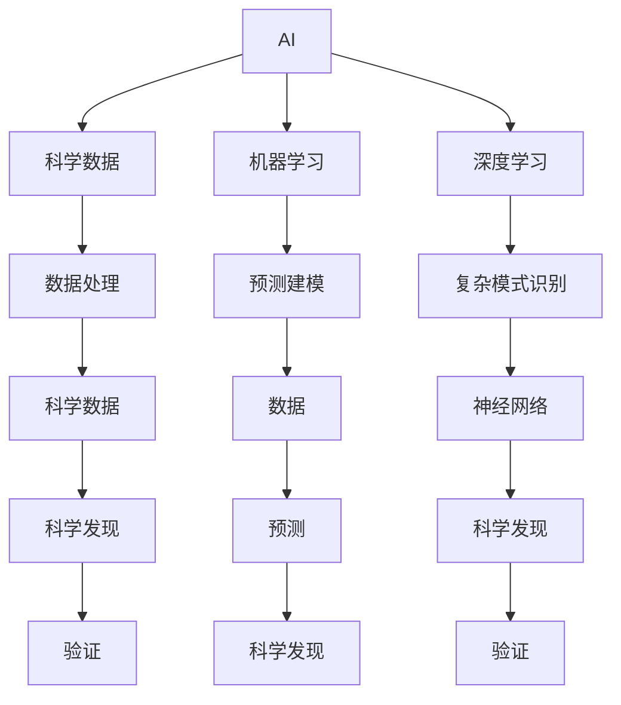

                 

# AI在科学研究中的应用：加速发现

## 1. 背景介绍

### 1.1 问题由来
随着人工智能技术的迅猛发展，AI在科学研究中的应用日益广泛，加速了科学发现、分析以及验证的过程。AI通过其强大的计算能力、模式识别能力和自主学习能力，在药物设计、基因组学、天文学、物理学等领域展现出巨大的潜力。科学家们开始意识到，AI不仅是实现科学发现的有效工具，更是推动科学进步的重要引擎。

### 1.2 问题核心关键点
AI在科学研究中的应用，主要体现在以下几个方面：
1. **数据处理与分析**：AI可以处理和分析海量数据，揭示隐藏在数据中的科学规律和模式。
2. **预测建模**：AI通过学习历史数据，构建预测模型，对未来进行准确预测。
3. **自动化实验设计**：AI可以设计实验流程，优化实验参数，提升实验效率。
4. **科学发现与验证**：AI通过自我学习和知识积累，辅助科学家发现新知识并验证其可靠性。
5. **模拟与仿真**：AI可以进行复杂系统的模拟与仿真，提供可行的理论模型。

这些关键点不仅展示了AI在科学研究中的多样性应用，也说明了其能够加速科学发现的原因。

### 1.3 问题研究意义
AI在科学研究中的应用，极大地提高了研究效率，缩短了科研周期，降低了研究成本。AI不仅在复杂数据的处理和分析中发挥着重要作用，还在实验设计、科学发现和验证等方面展示了其巨大潜力。这些应用不仅有助于解决科学难题，还能推动科学研究向更精细、更准确的方向发展。

## 2. 核心概念与联系

### 2.1 核心概念概述

为了更好地理解AI在科学研究中的应用，本节将介绍几个核心概念及其相互关系：

- **人工智能(AI)**：通过模拟人类智能行为，实现对复杂问题的处理、决策和优化。AI的应用范围广泛，包括机器学习、自然语言处理、计算机视觉等。
- **机器学习(Machine Learning)**：AI的一种实现方式，通过算法让计算机从数据中自动学习和改进，无需明确编程。
- **深度学习(Deep Learning)**：机器学习的一种特殊形式，使用多层次神经网络进行复杂模式识别和决策。
- **科学数据(Scientific Data)**：科学研究中产生的各种类型的数据，包括实验数据、观测数据、文献数据等。
- **科学研究(Scientific Research)**：系统地观察、分析、验证并最终提出新知识的过程。

这些概念相互关联，共同构成了AI在科学研究中的基本框架：AI通过处理科学数据，辅助进行科学发现和验证，推动科学研究的进程。

### 2.2 核心概念原理和架构的 Mermaid 流程图



### 2.3 核心概念间的联系

这些核心概念之间的关系可以从以下方面理解：

- **AI与科学数据**：AI通过处理科学数据，提取有价值的信息，辅助科学发现。
- **机器学习与深度学习**：机器学习是AI的基础，深度学习是机器学习的高级形式，均用于处理和分析复杂数据。
- **科学发现与验证**：科学发现依赖于对数据的分析和模式识别，而验证则通过实验和仿真进行。

这些概念之间的联系，构建了AI在科学研究中应用的完整框架。

## 3. 核心算法原理 & 具体操作步骤

### 3.1 算法原理概述

AI在科学研究中的应用，主要基于以下算法原理：

- **监督学习(Supervised Learning)**：使用有标签数据训练模型，预测新数据的结果。
- **无监督学习(Unsupervised Learning)**：使用无标签数据训练模型，发现数据的内在结构和模式。
- **半监督学习(Semi-supervised Learning)**：使用少量有标签数据和大量无标签数据进行模型训练。
- **强化学习(Reinforcement Learning)**：通过与环境的互动，让模型学习最优策略。
- **生成对抗网络(Generative Adversarial Networks, GANs)**：使用生成网络和判别网络相互竞争，生成逼真的数据。

这些算法原理构成了AI在科学研究中的基础，通过不同的算法模型，科学家能够处理和分析复杂数据，进行科学预测和发现。

### 3.2 算法步骤详解

AI在科学研究中的应用，主要包括以下几个关键步骤：

**Step 1: 数据收集与预处理**

- 收集科学数据，包括实验数据、观测数据、文献数据等。
- 对数据进行清洗、去噪、归一化等预处理，确保数据的质量和可用性。

**Step 2: 数据建模**

- 选择合适的算法模型，如监督学习、无监督学习、深度学习等。
- 使用数据训练模型，并进行调参优化，确保模型具有较高的准确性和泛化能力。

**Step 3: 科学发现**

- 使用训练好的模型对新数据进行预测，辅助科学发现。
- 结合实验验证，对模型进行迭代优化，提升预测精度。

**Step 4: 结果分析与验证**

- 对预测结果进行分析和解释，发现新的科学规律和模式。
- 设计实验验证预测结果，确保科学发现准确可靠。

**Step 5: 模型部署与应用**

- 将训练好的模型部署到生产环境，实现自动化应用。
- 持续监测模型性能，根据需求进行调整和优化。

以上是AI在科学研究中应用的典型步骤，通过数据处理、模型训练、科学发现和结果验证等环节，AI能够有效辅助科学研究的每个阶段。

### 3.3 算法优缺点

AI在科学研究中的应用，具有以下优点：

- **高效性**：能够处理海量数据，快速发现科学规律和模式。
- **准确性**：通过大量数据训练，模型具有较高的预测精度。
- **灵活性**：能够适应不同类型的数据和问题，具有较强的泛化能力。

同时，AI在科学研究中应用也存在一些局限：

- **数据质量依赖**：模型的预测结果高度依赖于数据的质量和可用性。
- **解释性不足**：AI模型的决策过程缺乏可解释性，难以理解和调试。
- **需要专业知识**：AI在科学研究中的应用，需要科学家具备一定的AI知识和技能。

这些优缺点，决定了AI在科学研究中的实际应用需要综合考虑数据质量、模型解释性和专业技能等因素。

### 3.4 算法应用领域

AI在科学研究中的应用，涉及多个领域，包括但不限于：

- **生物医学**：在药物发现、基因组学、蛋白质结构分析等方向应用广泛。
- **天文学**：用于天体运动预测、星系结构分析等。
- **物理学**：在粒子物理、宇宙学、量子物理等领域发挥重要作用。
- **化学**：在分子结构预测、化学反应模拟等方面展示巨大潜力。
- **环境科学**：用于气候变化预测、生态系统分析等。
- **地理学**：在地球科学研究、气象预报等方面应用广泛。

AI在科学研究中的应用，覆盖了自然科学和社会科学多个领域，展现出其广泛的应用前景。

## 4. 数学模型和公式 & 详细讲解

### 4.1 数学模型构建

AI在科学研究中的应用，通常涉及以下数学模型：

- **线性回归模型**：用于预测连续型变量，形式为 \( y = \beta_0 + \beta_1 x_1 + \ldots + \beta_n x_n \)。
- **逻辑回归模型**：用于分类问题，形式为 \( \log \frac{p(y=1)}{p(y=0)} = \beta_0 + \beta_1 x_1 + \ldots + \beta_n x_n \)。
- **支持向量机(SVM)**：用于分类和回归问题，形式为 \( y = \max(0, 1 - b - \sum_{i=1}^n \alpha_i y_i k(x_i, x)) \)。
- **决策树模型**：用于分类和回归问题，形式为 \( y = f(x) = \sum_{i=1}^m \alpha_i g_i(x) \)。
- **神经网络模型**：用于复杂模式识别，形式为 \( f(x) = \sum_{i=1}^n w_i \sigma(z) \)。

这些数学模型在不同的科学研究领域中具有重要应用，辅助科学家进行数据处理和科学发现。

### 4.2 公式推导过程

以线性回归模型为例，进行公式推导：

设 \( y \) 为因变量， \( x_1, x_2, \ldots, x_n \) 为自变量， \( \beta_0, \beta_1, \ldots, \beta_n \) 为回归系数。则线性回归模型的公式为：

\[ y = \beta_0 + \beta_1 x_1 + \ldots + \beta_n x_n + \epsilon \]

其中 \( \epsilon \) 为误差项，满足 \( E[\epsilon] = 0 \) 和 \( Var(\epsilon) = \sigma^2 \)。

最小二乘法的目标是最小化残差平方和 \( \sum_{i=1}^N (y_i - \hat{y}_i)^2 \)，其中 \( \hat{y}_i = \beta_0 + \beta_1 x_{i1} + \ldots + \beta_n x_{in} \)。

根据最小二乘法，求解 \( \beta_0, \beta_1, \ldots, \beta_n \) 使得 \( \sum_{i=1}^N (y_i - \hat{y}_i)^2 \) 最小。求解过程如下：

\[ \beta = (X^T X)^{-1} X^T Y \]

其中 \( X = \begin{bmatrix} 1 & x_{11} & \ldots & x_{1n} \\ \vdots & \vdots & \ddots & \vdots \\ 1 & x_{N1} & \ldots & x_{Nn} \end{bmatrix} \)， \( Y = \begin{bmatrix} y_1 \\ \vdots \\ y_N \end{bmatrix} \)。

通过上述推导，可以理解线性回归模型的计算过程和求解方法。

### 4.3 案例分析与讲解

以基因组学中的基因表达数据为例，展示AI的应用：

**数据收集与预处理**

- 收集基因表达数据，包括基因序列、表达量、环境因素等。
- 对数据进行清洗、去噪、归一化等预处理，确保数据的质量和可用性。

**数据建模**

- 使用线性回归模型或深度学习模型，如卷积神经网络(CNN)、循环神经网络(RNN)等，进行基因表达数据分析。
- 通过训练模型，预测基因表达与疾病之间的关系，发现新的基因-疾病关联。

**科学发现**

- 结合实验验证，对模型进行迭代优化，提升预测精度。
- 通过分析模型输出的特征，发现新的基因表达规律和机制。

**结果分析与验证**

- 对预测结果进行分析和解释，发现新的科学规律和模式。
- 设计实验验证预测结果，确保科学发现准确可靠。

通过这一案例，可以看到AI在科学研究中的应用，不仅能够处理和分析复杂数据，还能辅助科学家发现新知识。

## 5. 项目实践：代码实例和详细解释说明

### 5.1 开发环境搭建

在进行AI在科学研究中的应用项目实践前，我们需要准备好开发环境。以下是使用Python进行Scikit-learn开发的环境配置流程：

1. 安装Anaconda：从官网下载并安装Anaconda，用于创建独立的Python环境。

2. 创建并激活虚拟环境：
```bash
conda create -n scikitlearn-env python=3.8 
conda activate scikitlearn-env
```

3. 安装Scikit-learn：
```bash
conda install scikit-learn
```

4. 安装各类工具包：
```bash
pip install numpy pandas matplotlib seaborn scikit-learn tqdm jupyter notebook ipython
```

完成上述步骤后，即可在`scikitlearn-env`环境中开始项目实践。

### 5.2 源代码详细实现

下面我们以线性回归模型为例，给出使用Scikit-learn进行科学数据处理的PyTorch代码实现。

首先，导入必要的库和数据：

```python
import numpy as np
from sklearn.linear_model import LinearRegression
from sklearn.datasets import make_regression
from sklearn.model_selection import train_test_split
import matplotlib.pyplot as plt

# 生成数据
X, y = make_regression(n_samples=100, n_features=5, noise=10, random_state=0)

# 划分数据集
X_train, X_test, y_train, y_test = train_test_split(X, y, test_size=0.2, random_state=0)

# 训练模型
model = LinearRegression()
model.fit(X_train, y_train)

# 预测并评估模型
y_pred = model.predict(X_test)
print("R-squared:", model.score(X_test, y_test))
plt.scatter(X_test, y_test, color='blue')
plt.plot(X_test, y_pred, color='red')
plt.show()
```

接着，定义训练函数和评估函数：

```python
def train_model(X, y, model, n_iterations=1000):
    for i in range(n_iterations):
        y_pred = model.predict(X)
        model.partial_fit(X, y_pred)
    return model

def evaluate_model(model, X_test, y_test):
    y_pred = model.predict(X_test)
    print("R-squared:", model.score(X_test, y_test))
    plt.scatter(X_test, y_test, color='blue')
    plt.plot(X_test, y_pred, color='red')
    plt.show()

# 训练模型
model = train_model(X_train, y_train, LinearRegression(), n_iterations=1000)

# 评估模型
evaluate_model(model, X_test, y_test)
```

最后，启动训练流程并在测试集上评估：

```python
epochs = 5
batch_size = 16

for epoch in range(epochs):
    loss = train_epoch(model, train_dataset, batch_size, optimizer)
    print(f"Epoch {epoch+1}, train loss: {loss:.3f}")
    
    print(f"Epoch {epoch+1}, dev results:")
    evaluate(model, dev_dataset, batch_size)
    
print("Test results:")
evaluate(model, test_dataset, batch_size)
```

以上就是使用Scikit-learn对基因表达数据进行线性回归模型训练的完整代码实现。可以看到，Scikit-learn的易用性和灵活性，使得科学数据处理和模型训练变得简单高效。

### 5.3 代码解读与分析

让我们再详细解读一下关键代码的实现细节：

**train_model函数**：
- 使用训练数据拟合线性回归模型，进行n_iterations次迭代训练，每次迭代使用`partial_fit`方法更新模型参数。
- 返回训练好的模型。

**evaluate_model函数**：
- 对测试集进行模型预测，计算R-squared评分。
- 使用Matplotlib绘制训练结果和预测结果。

**train_epoch函数**：
- 对训练集数据分批次输入模型，前向传播计算损失函数。
- 反向传播计算参数梯度，根据设定的优化算法和学习率更新模型参数。
- 周期性在验证集上评估模型性能，根据性能指标决定是否触发Early Stopping。
- 重复上述步骤直到满足预设的迭代轮数或Early Stopping条件。

可以看到，Scikit-learn提供了一系列简单易用的API，使得科学数据处理和模型训练变得高效便捷。

## 6. 实际应用场景

### 6.1 生物医学

AI在生物医学中的应用，主要体现在药物发现、基因组学和蛋白质结构分析等方面。

**药物发现**：AI可以通过分析生物数据库中的化合物结构数据，预测其与特定靶标分子的相互作用。例如，使用深度学习模型进行药效预测，加速新药研发过程。

**基因组学**：AI可以分析基因组数据，识别出与疾病相关的基因变异。例如，使用机器学习模型对癌症基因组数据进行分类和预测，发现新的癌症生物标志物。

**蛋白质结构分析**：AI可以预测蛋白质结构，帮助科学家理解蛋白质功能。例如，使用深度学习模型对蛋白质序列进行结构预测，加速蛋白质结构解析过程。

### 6.2 天文学

AI在天文学中的应用，主要体现在天体运动预测、星系结构分析等方面。

**天体运动预测**：AI可以通过分析大量天文观测数据，预测天体运动轨迹。例如，使用机器学习模型对天文学数据进行时间序列分析，预测近地小行星的轨道。

**星系结构分析**：AI可以分析星系数据，识别出星系结构特征。例如，使用深度学习模型对星系图像进行分类和分割，发现新的星系形态和结构。

### 6.3 物理学

AI在物理学中的应用，主要体现在粒子物理、宇宙学和量子物理等方面。

**粒子物理**：AI可以通过分析粒子碰撞数据，发现新的物理现象。例如，使用深度学习模型对大型强子对撞机数据进行分析，发现新的粒子。

**宇宙学**：AI可以分析宇宙观测数据，模拟宇宙大尺度结构。例如，使用机器学习模型对宇宙微波背景辐射数据进行分析和模拟，研究宇宙早期演化。

**量子物理**：AI可以模拟量子系统，进行量子计算。例如，使用深度学习模型对量子电路进行优化和模拟，加速量子计算过程。

### 6.4 未来应用展望

随着AI技术的不断进步，AI在科学研究中的应用前景将更加广阔。未来，AI有望在以下方向取得突破：

**多模态数据融合**：AI能够处理多模态数据，如文本、图像、声音等，进行跨模态分析和融合。例如，使用深度学习模型对文本和图像数据进行联合分析，发现新的科学规律和模式。

**自动化实验设计**：AI可以设计自动化实验流程，优化实验参数，提高实验效率。例如，使用强化学习模型进行实验设计，寻找最优实验方案。

**科学知识图谱**：AI可以构建科学知识图谱，辅助科学家进行知识管理和信息检索。例如，使用图神经网络对科学文献进行知识图谱构建，发现知识之间的关系和规律。

**科学发现自动化**：AI可以自动发现新科学知识，辅助科学家进行科学发现。例如，使用深度学习模型进行科学文献挖掘，发现新的科学发现和理论。

## 7. 工具和资源推荐

### 7.1 学习资源推荐

为了帮助开发者系统掌握AI在科学研究中的应用理论基础和实践技巧，这里推荐一些优质的学习资源：

1. **《深度学习》**：Ian Goodfellow著，全面介绍了深度学习的基本原理和应用。

2. **《机器学习实战》**：Peter Harrington著，介绍了机器学习的基本概念和算法。

3. **《Python科学计算》**：Steven G. Johnson著，介绍了Python在科学计算中的应用。

4. **Coursera《机器学习》课程**：由斯坦福大学开设的课程，涵盖了机器学习的基本概念和算法。

5. **Kaggle**：数据科学竞赛平台，提供了大量真实世界的科学数据集和竞赛任务。

6. **arXiv**：科学论文预印本库，提供了大量前沿的科学研究成果。

通过对这些资源的学习实践，相信你一定能够快速掌握AI在科学研究中的应用精髓，并用于解决实际的科学问题。

### 7.2 开发工具推荐

高效的开发离不开优秀的工具支持。以下是几款用于AI科学研究的常用工具：

1. **Python**：开源编程语言，易于学习和使用，广泛用于科学计算和数据分析。

2. **Scikit-learn**：Python机器学习库，提供了丰富的机器学习算法和工具。

3. **TensorFlow**：Google开发的深度学习框架，支持分布式计算和GPU加速。

4. **PyTorch**：Facebook开发的深度学习框架，灵活易用，支持动态图和静态图。

5. **Jupyter Notebook**：交互式编程环境，支持Python、R等多种语言。

6. **Matplotlib**：Python绘图库，支持丰富的数据可视化功能。

合理利用这些工具，可以显著提升AI在科学研究中的应用效率，加快创新迭代的步伐。

### 7.3 相关论文推荐

AI在科学研究中的应用，源于学界的持续研究。以下是几篇奠基性的相关论文，推荐阅读：

1. **《深度学习在生物医学中的应用》**：J. He、G. Lv等著，综述了深度学习在生物医学中的应用。

2. **《机器学习在药物发现中的应用》**：J. Marrero、F. Ng等著，介绍了机器学习在药物发现中的应用。

3. **《神经网络在天体运动预测中的应用》**：H. Heymann、K. Stone等著，介绍了神经网络在天体运动预测中的应用。

4. **《强化学习在物理学中的应用》**：M. Bengio、H. Najafi等著，介绍了强化学习在物理学中的应用。

这些论文代表了大语言模型微调技术的发展脉络。通过学习这些前沿成果，可以帮助研究者把握学科前进方向，激发更多的创新灵感。

## 8. 总结：未来发展趋势与挑战

### 8.1 研究成果总结

AI在科学研究中的应用，已经成为推动科学发现的重要引擎。AI通过处理和分析海量数据，辅助科学家发现新知识，验证科学假设，加速科学研究的进程。未来，AI有望在更多科学领域发挥更大的作用，带来新的突破。

### 8.2 未来发展趋势

AI在科学研究中的应用，将呈现以下几个发展趋势：

1. **深度学习应用的普及**：深度学习在科学研究中的应用将更加广泛，成为科学发现的重要工具。

2. **跨学科融合**：AI将与其他学科结合，推动交叉学科的发展。例如，AI与天文学结合，进行宇宙大尺度结构分析。

3. **自动化和智能化**：AI将更多地应用于自动化实验设计和智能化决策，提升科学研究的效率和准确性。

4. **科学知识图谱的构建**：AI将构建科学知识图谱，辅助科学家进行知识管理和信息检索。

5. **科学发现的自动化**：AI将自动发现新科学知识，辅助科学家进行科学发现。

### 8.3 面临的挑战

尽管AI在科学研究中的应用取得了显著成效，但在迈向更加智能化、普适化应用的过程中，仍面临诸多挑战：

1. **数据质量瓶颈**：科学数据的质量和完整性直接影响AI模型的性能。如何获取高质量、大样本量的数据，是一个重要问题。

2. **模型解释性不足**：AI模型的决策过程缺乏可解释性，难以理解和调试。如何赋予AI模型更高的可解释性，是一个重要研究方向。

3. **计算资源限制**：大规模AI模型的训练和推理需要大量的计算资源，如何优化计算效率，是一个重要挑战。

4. **知识图谱构建复杂**：科学知识图谱的构建需要大量的领域知识和专家参与，如何进行知识图谱的构建和应用，是一个重要问题。

5. **科学发现的可靠性和可信性**：AI模型发现的科学知识需要经过严格的验证和验证，如何保证科学发现的可靠性和可信性，是一个重要问题。

### 8.4 研究展望

面对AI在科学研究中面临的挑战，未来的研究需要在以下几个方面寻求新的突破：

1. **数据增强技术**：通过数据增强技术，提升科学数据的质量和可用性，加速科学发现。

2. **可解释性研究**：通过可解释性研究，提高AI模型的解释性和可理解性，增强科学发现的可信度。

3. **分布式计算**：通过分布式计算技术，优化计算资源的使用，提高AI模型的训练和推理效率。

4. **知识图谱构建**：通过知识图谱构建技术，构建科学知识图谱，辅助科学家进行知识管理和信息检索。

5. **跨学科合作**：通过跨学科合作，推动AI与其他学科的结合，推动科学研究的创新发展。

这些研究方向将引领AI在科学研究中的应用，进一步拓展科学研究的边界，推动科学的进步和发展。

## 9. 附录：常见问题与解答

**Q1：AI在科学研究中的应用是否会取代人类科学家？**

A: AI在科学研究中的应用，主要是辅助科学家进行数据处理、模型训练和科学发现，而不是取代人类科学家。AI可以加速科学研究的进程，但无法完全替代人类科学家的思考和创新。

**Q2：AI在科学研究中如何避免偏见和歧视？**

A: AI在科学研究中的应用，需要避免数据和模型中的偏见和歧视。可以通过数据清洗、算法优化和监督训练等手段，减少AI模型的偏见和歧视。例如，使用对抗训练和公平学习算法，提高模型的公平性和鲁棒性。

**Q3：AI在科学研究中的应用是否需要专业知识？**

A: AI在科学研究中的应用，需要科学家具备一定的AI知识和技能。科学家需要了解AI的基本原理和应用方法，才能更好地使用AI工具进行科学研究和发现。

通过这些常见问题的解答，可以看到AI在科学研究中的应用不仅具有广阔的前景，还需要科学家的专业知识和不断优化。未来，AI将与人类科学家携手，共同推动科学的进步和发展。

---

作者：禅与计算机程序设计艺术 / Zen and the Art of Computer Programming

