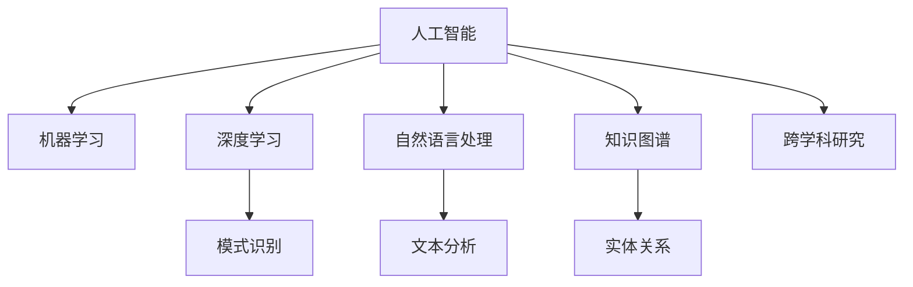

                 

# AI在科研中的应用：加速知识发现

## 1. 背景介绍

### 1.1 问题由来
人工智能（AI）在科研领域的应用日益广泛，成为推动知识发现、数据分析、模型建立、成果转化等诸多环节的重要工具。AI技术的引入不仅极大地提高了科研效率，还推动了新方法、新理论的产生。特别是在数据驱动的科学研究中，AI成为不可或缺的伙伴。

### 1.2 问题核心关键点
AI在科研中的应用主要体现在数据处理、知识发现、模型训练、成果评估等多个环节。AI通过算法模型，能够处理和分析海量的数据，发现其中隐含的知识和规律。尤其在生物医药、天文学、环境科学等领域，AI技术加速了科研进程，提升了研究深度。

### 1.3 问题研究意义
AI技术在科研中的应用，有助于解决传统科研方法中存在的瓶颈问题，如数据量大、处理复杂、结果可解释性差等。AI可以通过自动化、模型化的方法，优化科研流程，提高科研质量，缩短科研周期。此外，AI还能促进跨学科知识的交叉融合，推动科学发现的新范式。

## 2. 核心概念与联系

### 2.1 核心概念概述

为更好地理解AI在科研中的应用，本节将介绍几个核心概念：

- 人工智能（Artificial Intelligence, AI）：通过算法和模型，模拟和扩展人类智能的计算机技术。AI能够感知、理解、学习和执行人类智能的任务。
- 机器学习（Machine Learning, ML）：使计算机系统能够从数据中学习规律，并应用于新数据的任务。机器学习是AI的一个重要分支。
- 深度学习（Deep Learning, DL）：利用多层神经网络模拟人类神经系统的处理方式，学习复杂特征的模式识别任务。深度学习是机器学习的一个重要组成部分。
- 自然语言处理（Natural Language Processing, NLP）：处理和理解人类语言的AI技术。NLP在科研文献分析、生物医学信息提取、智能问答系统等领域有重要应用。
- 知识图谱（Knowledge Graph,KG）：一种通过语义网描述实体及其关系的知识表示技术。知识图谱帮助AI更好地理解和推理，提升科研数据的整合与利用效率。
- 跨学科研究（Interdisciplinary Research）：结合多个学科的知识和视角，解决复杂科研问题。AI技术在促进跨学科研究中扮演了关键角色。

这些核心概念之间的逻辑关系可以通过以下Mermaid流程图来展示：



这个流程图展示了人工智能及其关键技术的应用范围和相互关系：

1. 人工智能是机器学习、深度学习、自然语言处理、知识图谱和跨学科研究的基础。
2. 机器学习和深度学习通过算法模型从数据中学习规律，应用于新数据的处理和预测。
3. 自然语言处理帮助计算机理解和生成人类语言，促进科研文献的自动化处理。
4. 知识图谱通过语义网技术描述实体及其关系，提升科研数据的整合和利用效率。
5. 跨学科研究结合多个学科的知识和视角，解决复杂科研问题，推动科学发现。

## 3. 核心算法原理 & 具体操作步骤
### 3.1 算法原理概述

AI在科研中的应用，主要通过机器学习、深度学习等算法模型，自动化地处理和分析数据，发现知识规律，生成预测模型。其核心思想是利用数据训练模型，并应用于新数据进行推理和预测。

形式化地，假设科研数据为 $D=\{(x_i,y_i)\}_{i=1}^N$，其中 $x_i$ 为特征向量，$y_i$ 为标签。AI的目标是找到最优模型 $M_{\theta}$，使得在新数据 $D'$ 上具有较好的预测性能：

$$
M_{\theta} = \mathop{\arg\min}_{\theta} \mathcal{L}(M_{\theta},D')
$$

其中 $\mathcal{L}$ 为模型在新数据 $D'$ 上的损失函数。常见的损失函数包括均方误差、交叉熵、KL散度等。

通过梯度下降等优化算法，模型参数 $\theta$ 不断更新，最小化损失函数 $\mathcal{L}$，直至收敛。

### 3.2 算法步骤详解

AI在科研中的应用主要包括以下几个关键步骤：

**Step 1: 数据准备与预处理**
- 收集科研数据 $D=\{(x_i,y_i)\}_{i=1}^N$，并进行数据清洗、标准化、归一化等预处理。
- 划分为训练集、验证集和测试集。

**Step 2: 选择模型**
- 根据科研问题的类型和特点，选择适合的数据模型，如回归模型、分类模型、聚类模型等。
- 对于复杂的非线性问题，选择深度学习模型，如神经网络、卷积神经网络（CNN）、循环神经网络（RNN）、生成对抗网络（GAN）等。
- 对于自然语言处理任务，选择语言模型、文本分类模型、序列标注模型等。

**Step 3: 模型训练**
- 利用训练集 $D$ 对模型进行有监督训练，最小化损失函数 $\mathcal{L}(M_{\theta},D)$。
- 在验证集上进行模型选择，选择最优模型 $M_{\theta}$。

**Step 4: 模型评估与优化**
- 在测试集 $D'$ 上评估模型性能，计算准确率、召回率、F1分数等指标。
- 根据测试集评估结果，调整模型超参数，如学习率、批大小、迭代次数等。
- 使用正则化技术、数据增强、对抗训练等方法，优化模型性能。

**Step 5: 模型应用与知识发现**
- 将训练好的模型 $M_{\theta}$ 应用于新数据 $D'$，进行预测或推理。
- 分析模型预测结果，提取新知识、规律和模式，形成新的科研见解。
- 结合跨学科知识和先验信息，对模型结果进行验证和修正。

### 3.3 算法优缺点

AI在科研中的应用，具有以下优点：

1. 数据处理能力强：能够高效处理大规模、高维度的科研数据，发现数据中的隐含规律。
2. 模型可解释性好：通过可视化工具和分析方法，能够理解模型的决策过程，提升科研结果的可解释性。
3. 知识发现能力强：能够从数据中挖掘新知识、新模式，促进科学发现。
4. 预测准确度高：基于已有数据训练的模型，能够在新数据上保持较高的预测精度。

但同时，也存在以下缺点：

1. 数据依赖性强：模型训练依赖于高质量、高标注的数据，难以处理数据质量差、标注不足的问题。
2. 模型复杂度高：深度学习模型参数量庞大，计算资源消耗大，需要高性能计算设备支持。
3. 结果易受数据分布影响：模型预测结果容易受到数据分布变化的影响，需要持续监测和调整。
4. 可解释性不足：复杂模型难以解释其内部决策逻辑，可能带来科研结果的不可靠性。
5. 数据隐私问题：科研数据可能包含敏感信息，需要采取数据隐私保护措施。

尽管存在这些局限性，但就目前而言，AI在科研中的应用已经成为推动科学发现和技术进步的重要手段。未来相关研究的方向将更多地关注模型的解释性和可靠性，以及如何更好地将跨学科知识融入到科研中。

### 3.4 算法应用领域

AI在科研中的应用已经涵盖了生物医药、天文学、环境科学、社会科学等多个领域，具体应用如下：

**1. 生物医药**
- 基因组学研究：AI可以从基因序列数据中发现新基因、新基因组结构。
- 药物研发：AI可以快速筛选出具有潜在药物活性的化合物，加速新药开发。
- 病理分析：AI可以通过影像和基因数据，识别出癌症、糖尿病等疾病的早期迹象。

**2. 天文学**
- 天文数据分析：AI可以快速处理和分析大规模天文观测数据，发现新的天文现象。
- 天体识别：AI可以自动识别天文图像中的天体，辅助天文学家进行研究。
- 引力波探测：AI可以分析引力波数据，辅助天体物理研究。

**3. 环境科学**
- 气候变化研究：AI可以分析和预测气候变化趋势，评估其对环境的影响。
- 污染监测：AI可以监测环境污染数据，辅助环境保护决策。
- 生态系统研究：AI可以分析生态系统数据，发现其变化规律。

**4. 社会科学**
- 社会网络分析：AI可以分析和识别社会网络中的关键节点和关系。
- 经济预测：AI可以分析经济数据，预测经济发展趋势。
- 公共卫生：AI可以分析公共卫生数据，辅助疾病防控。

这些应用领域展示了AI在科研中的广泛潜力和应用价值，推动了各个学科的研究进程。

## 4. 数学模型和公式 & 详细讲解  
### 4.1 数学模型构建

本节将使用数学语言对AI在科研中的应用过程进行更加严格的刻画。

假设科研问题为回归问题，即通过模型 $M_{\theta}$ 预测新数据 $D'$ 中的标签 $y$。设模型 $M_{\theta}$ 为线性回归模型：

$$
y = \theta^T x + b
$$

其中 $x$ 为特征向量，$\theta$ 为模型参数，$b$ 为截距。

数据集 $D=\{(x_i,y_i)\}_{i=1}^N$ 的损失函数为均方误差（Mean Squared Error, MSE）：

$$
\mathcal{L}(\theta) = \frac{1}{N} \sum_{i=1}^N (y_i - \theta^T x_i - b)^2
$$

模型训练的目标是最小化损失函数 $\mathcal{L}(\theta)$，即：

$$
\theta^* = \mathop{\arg\min}_{\theta} \mathcal{L}(\theta)
$$

通过梯度下降等优化算法，模型参数 $\theta$ 不断更新，最终收敛到最优解 $\theta^*$。

### 4.2 公式推导过程

以下我们以线性回归模型为例，推导其损失函数及其梯度的计算公式。

设模型 $M_{\theta}$ 在训练集 $D$ 上的经验风险为：

$$
\mathcal{L}(\theta) = \frac{1}{N} \sum_{i=1}^N (y_i - \theta^T x_i - b)^2
$$

根据链式法则，损失函数对参数 $\theta$ 的梯度为：

$$
\frac{\partial \mathcal{L}(\theta)}{\partial \theta} = -\frac{2}{N} \sum_{i=1}^N (y_i - \theta^T x_i - b) x_i
$$

通过求解该梯度，可以得到模型参数 $\theta$ 的最优解。

### 4.3 案例分析与讲解

**案例：基因组学研究中的AI应用**
假设有一组基因序列数据 $D=\{(x_i,y_i)\}_{i=1}^N$，其中 $x_i$ 表示基因序列特征，$y_i$ 表示基因标签（正常、患病等）。

可以使用线性回归模型 $y = \theta^T x + b$ 对数据进行建模，其中 $\theta$ 为基因特征的权重，$b$ 为截距。

**Step 1: 数据准备与预处理**
收集基因序列数据 $D$，并进行数据清洗、标准化、归一化等预处理。

**Step 2: 模型选择与训练**
选择线性回归模型 $y = \theta^T x + b$ 进行建模。

**Step 3: 模型评估与优化**
在验证集上进行模型选择，选择最优模型 $M_{\theta}$。

**Step 4: 模型应用与知识发现**
将训练好的模型 $M_{\theta}$ 应用于新基因数据 $D'$，进行基因标签预测。

**Step 5: 结果分析与验证**
分析模型预测结果，提取新知识、规律和模式，形成新的基因学见解。

## 5. 项目实践：代码实例和详细解释说明
### 5.1 开发环境搭建

在进行AI应用开发前，我们需要准备好开发环境。以下是使用Python进行TensorFlow开发的环境配置流程：

1. 安装Anaconda：从官网下载并安装Anaconda，用于创建独立的Python环境。

2. 创建并激活虚拟环境：
```bash
conda create -n ai-env python=3.8 
conda activate ai-env
```

3. 安装TensorFlow：根据CUDA版本，从官网获取对应的安装命令。例如：
```bash
conda install tensorflow -c conda-forge
```

4. 安装各类工具包：
```bash
pip install numpy pandas scikit-learn matplotlib tqdm jupyter notebook ipython
```

完成上述步骤后，即可在`ai-env`环境中开始AI应用实践。

### 5.2 源代码详细实现

这里以生物医药领域的药物研发为例，给出使用TensorFlow进行AI应用开发的PyTorch代码实现。

首先，定义药物研发数据处理函数：

```python
import tensorflow as tf
from tensorflow.keras import layers

def load_data():
    train_data = tf.keras.datasets.mnist.load_data()
    test_data = tf.keras.datasets.mnist.load_data()
    train_images, train_labels = train_data
    test_images, test_labels = test_data
    train_images = train_images / 255.0
    test_images = test_images / 255.0
    return train_images, train_labels, test_images, test_labels
```

然后，定义模型和优化器：

```python
def build_model():
    model = tf.keras.models.Sequential([
        layers.Dense(128, activation='relu', input_shape=(784,)),
        layers.Dense(10, activation='softmax')
    ])
    model.compile(optimizer='adam', loss='categorical_crossentropy', metrics=['accuracy'])
    return model

def train_model(model, train_images, train_labels, epochs=10):
    model.fit(train_images, train_labels, epochs=epochs, validation_split=0.2)
```

接着，定义训练和评估函数：

```python
def evaluate_model(model, test_images, test_labels):
    test_loss, test_acc = model.evaluate(test_images, test_labels)
    print('Test loss:', test_loss)
    print('Test accuracy:', test_acc)
```

最后，启动训练流程并在测试集上评估：

```python
train_images, train_labels, test_images, test_labels = load_data()

model = build_model()

train_model(model, train_images, train_labels)

evaluate_model(model, test_images, test_labels)
```

以上就是使用TensorFlow进行药物研发任务AI应用的完整代码实现。可以看到，TensorFlow通过Keras API提供了简单易用的API，使得AI应用的开发变得相对简单。

### 5.3 代码解读与分析

让我们再详细解读一下关键代码的实现细节：

**load_data函数**：
- 加载MNIST手写数字数据集，并进行数据预处理，将像素值归一化到0-1之间。

**build_model函数**：
- 定义多层感知器模型，包含一个全连接层和一个softmax层。
- 使用Adam优化器和交叉熵损失函数编译模型。

**train_model函数**：
- 使用训练集数据对模型进行有监督训练，在每个epoch结束时，将验证集上的性能指标输出。

**evaluate_model函数**：
- 在测试集上评估模型性能，输出损失和准确率。

**训练流程**：
- 加载数据集。
- 定义模型。
- 训练模型。
- 在测试集上评估模型。

可以看到，TensorFlow的Keras API使得模型的构建、训练、评估变得非常简单。开发者可以将更多精力放在数据处理、模型优化等高层逻辑上，而不必过多关注底层的实现细节。

当然，工业级的系统实现还需考虑更多因素，如模型的保存和部署、超参数的自动搜索、更灵活的任务适配层等。但核心的AI应用流程基本与此类似。

## 6. 实际应用场景
### 6.1 智能药厂

AI在智能药厂中的应用，可以显著提升药物研发和生产的效率。传统的药物研发流程耗时长、成本高，且成功率低。而使用AI技术，可以加速药物筛选、分子设计、临床试验等环节，提升研发效率，降低研发成本。

在技术实现上，可以收集历史药物数据和生物实验数据，将药物分子特征和药效作为监督数据，在此基础上对预训练语言模型进行微调。微调后的模型能够自动学习药物分子的结构和活性，预测其药效和副作用，辅助药物研发。同时，AI可以优化生产流程，通过智能控制设备和机器人，提高生产效率，降低生产成本。

### 6.2 智能城市

AI在智能城市中的应用，可以提升城市管理的智能化水平，构建更安全、高效的未来城市。智能交通、智能安防、智能环保等领域，AI技术正发挥着越来越重要的作用。

在技术实现上，可以收集城市运行数据，如交通流量、环境监测、气象数据等，利用AI技术进行数据分析和预测。AI可以优化交通流量控制，减少拥堵；预测环境污染趋势，采取应对措施；智能分析气象数据，辅助灾害预警。通过AI技术，可以实现城市管理的精细化、智能化，提升市民生活质量。

### 6.3 环境监测

AI在环境监测中的应用，可以实时监测环境变化，辅助环境决策。环境污染、气候变化等问题，需要通过大量数据进行分析和预测。AI技术能够高效处理和分析环境数据，发现污染源、预测气候变化趋势，辅助环境保护决策。

在技术实现上，可以收集环境监测数据，如空气质量、水质、气象数据等，利用AI技术进行数据分析和预测。AI可以实时监测环境污染数据，辅助环境保护决策；预测气候变化趋势，采取应对措施；智能分析环境数据，发现污染源，辅助环保治理。通过AI技术，可以实现环境监测的自动化、智能化，提升环境治理效果。

### 6.4 未来应用展望

随着AI技术的不断进步，其在科研中的应用前景将更加广阔。未来可能的方向包括：

1. 更高效的数据处理能力：AI技术可以处理和分析海量科研数据，发现数据中的隐含规律，加速科学发现。

2. 更智能的模型训练：AI技术可以自动化地调整模型超参数，优化模型训练过程，提升模型性能。

3. 更准确的预测和推理：AI技术可以结合跨学科知识，提高模型预测和推理的准确性，辅助科研决策。

4. 更广泛的应用领域：AI技术可以应用于更多科研领域，如生物医药、天文学、环境科学等，推动各学科的进步。

5. 更开放的数据共享：AI技术可以打破科研数据壁垒，促进数据共享和开放，加速科研合作。

6. 更广泛的科学普及：AI技术可以自动化地处理科研数据，生成科普内容，提升公众科学素养。

以上方向展示了AI在科研中的应用前景，推动了科学发现和技术进步，为未来科研发展提供了新的可能。

## 7. 工具和资源推荐
### 7.1 学习资源推荐

为了帮助开发者系统掌握AI在科研中的应用理论基础和实践技巧，这里推荐一些优质的学习资源：

1. 《深度学习》系列书籍：由Ian Goodfellow等著，全面介绍了深度学习的原理、算法和应用。

2. 《Python数据科学手册》：由Jake VanderPlas等著，介绍了Python在数据科学和机器学习中的应用。

3. Coursera《机器学习》课程：由Andrew Ng主讲，涵盖了机器学习的基本概念和算法，适合初学者学习。

4. DeepLearning.AI Master Program：由Andrew Ng等人讲授，提供系统的深度学习课程和实践项目，适合进阶学习。

5. Kaggle：数据科学和机器学习竞赛平台，提供丰富的数据集和代码资源，适合实战练习。

通过对这些资源的学习实践，相信你一定能够快速掌握AI在科研中的应用精髓，并用于解决实际的科研问题。

### 7.2 开发工具推荐

高效的开发离不开优秀的工具支持。以下是几款用于AI应用开发的常用工具：

1. Jupyter Notebook：交互式笔记本环境，适合数据分析、模型训练、代码调试等。

2. TensorBoard：TensorFlow配套的可视化工具，可实时监测模型训练状态，并提供丰富的图表呈现方式。

3. Weights & Biases：模型训练的实验跟踪工具，可以记录和可视化模型训练过程中的各项指标。

4. PyTorch：基于Python的深度学习框架，灵活高效，适合动态图计算。

5. Scikit-learn：Python机器学习库，提供了丰富的模型和算法，适合数据处理和模型训练。

6. Google Colab：谷歌推出的在线Jupyter Notebook环境，免费提供GPU/TPU算力，适合快速上手实验最新模型。

合理利用这些工具，可以显著提升AI应用开发的效率，加快创新迭代的步伐。

### 7.3 相关论文推荐

AI在科研中的应用涉及多个领域的交叉研究，以下是几篇奠基性的相关论文，推荐阅读：

1. 《Deep Learning》（Ian Goodfellow等）：介绍了深度学习的原理、算法和应用，是深度学习领域的经典教材。

2. 《Artificial Intelligence: A Modern Approach》（Russell等）：涵盖了AI的基础概念、算法和应用，是AI领域的经典教材。

3. 《Neural Computation》：包含大量关于神经网络和深度学习的最新研究成果，适合前沿研究阅读。

4. 《Nature Computational Science》：涵盖AI和机器学习领域的最新研究成果，适合跟踪科研前沿。

5. 《IEEE Transactions on Neural Networks and Learning Systems》：包含大量关于神经网络和深度学习的最新研究成果，适合跟踪科研前沿。

这些论文代表了大数据、AI和机器学习领域的发展脉络。通过学习这些前沿成果，可以帮助研究者把握学科前进方向，激发更多的创新灵感。

## 8. 总结：未来发展趋势与挑战

### 8.1 总结

本文对AI在科研中的应用进行了全面系统的介绍。首先阐述了AI在科研中的研究背景和意义，明确了AI技术在数据处理、知识发现、模型训练、成果评估等多个环节的重要作用。其次，从原理到实践，详细讲解了AI在科研中的应用过程，给出了AI应用任务的完整代码实例。同时，本文还广泛探讨了AI在智能药厂、智能城市、环境监测等领域的实际应用前景，展示了AI技术的广泛潜力和应用价值。此外，本文精选了AI技术的各类学习资源，力求为读者提供全方位的技术指引。

通过本文的系统梳理，可以看到，AI技术在科研中的应用已经成为推动科学发现和技术进步的重要手段。AI通过自动化、模型化的方法，优化科研流程，提高科研质量，缩短科研周期。未来，伴随AI技术的不断进步，其在科研中的应用将更加广泛和深入，推动科学发现和技术进步。

### 8.2 未来发展趋势

展望未来，AI在科研中的应用将呈现以下几个发展趋势：

1. 更高效的数据处理能力：AI技术可以处理和分析海量科研数据，发现数据中的隐含规律，加速科学发现。

2. 更智能的模型训练：AI技术可以自动化地调整模型超参数，优化模型训练过程，提升模型性能。

3. 更准确的预测和推理：AI技术可以结合跨学科知识，提高模型预测和推理的准确性，辅助科研决策。

4. 更广泛的应用领域：AI技术可以应用于更多科研领域，如生物医药、天文学、环境科学等，推动各学科的进步。

5. 更开放的数据共享：AI技术可以打破科研数据壁垒，促进数据共享和开放，加速科研合作。

6. 更广泛的科学普及：AI技术可以自动化地处理科研数据，生成科普内容，提升公众科学素养。

以上趋势凸显了AI在科研中的应用前景，推动了科学发现和技术进步，为未来科研发展提供了新的可能。

### 8.3 面临的挑战

尽管AI在科研中的应用已经取得了显著进展，但在迈向更加智能化、普适化应用的过程中，仍面临诸多挑战：

1. 数据依赖性强：模型训练依赖于高质量、高标注的数据，难以处理数据质量差、标注不足的问题。

2. 模型复杂度高：深度学习模型参数量庞大，计算资源消耗大，需要高性能计算设备支持。

3. 结果易受数据分布影响：模型预测结果容易受到数据分布变化的影响，需要持续监测和调整。

4. 可解释性不足：复杂模型难以解释其内部决策逻辑，可能带来科研结果的不可靠性。

5. 数据隐私问题：科研数据可能包含敏感信息，需要采取数据隐私保护措施。

尽管存在这些局限性，但AI在科研中的应用已经成为推动科学发现和技术进步的重要手段。未来相关研究需要在以下几个方面寻求新的突破：

1. 探索无监督和半监督AI技术：摆脱对大规模标注数据的依赖，利用自监督学习、主动学习等无监督和半监督范式，最大限度利用非结构化数据，实现更加灵活高效的AI应用。

2. 研究参数高效和计算高效的AI范式：开发更加参数高效的AI方法，在固定大部分预训练参数的同时，只更新极少量的任务相关参数。同时优化AI计算图，减少前向传播和反向传播的资源消耗，实现更加轻量级、实时性的部署。

3. 融合因果和对比学习范式：通过引入因果推断和对比学习思想，增强AI建立稳定因果关系的能力，学习更加普适、鲁棒的知识表示。

4. 纳入伦理道德约束：在AI训练目标中引入伦理导向的评估指标，过滤和惩罚有害的输出倾向，确保AI应用的伦理性和安全性。

5. 数据隐私保护：采取数据匿名化、差分隐私等技术，保护科研数据的隐私，确保数据安全。

这些研究方向的探索，必将引领AI在科研中的应用迈向更高的台阶，为构建安全、可靠、可解释、可控的科研系统铺平道路。面向未来，AI在科研中的应用还需要与其他AI技术进行更深入的融合，如知识表示、因果推理、强化学习等，多路径协同发力，共同推动科研技术的进步。

### 8.4 研究展望

面对AI在科研中的应用所面临的挑战，未来的研究需要在以下几个方面寻求新的突破：

1. 探索无监督和半监督AI技术：摆脱对大规模标注数据的依赖，利用自监督学习、主动学习等无监督和半监督范式，最大限度利用非结构化数据，实现更加灵活高效的AI应用。

2. 研究参数高效和计算高效的AI范式：开发更加参数高效的AI方法，在固定大部分预训练参数的同时，只更新极少量的任务相关参数。同时优化AI计算图，减少前向传播和反向传播的资源消耗，实现更加轻量级、实时性的部署。

3. 融合因果和对比学习范式：通过引入因果推断和对比学习思想，增强AI建立稳定因果关系的能力，学习更加普适、鲁棒的知识表示。

4. 纳入伦理道德约束：在AI训练目标中引入伦理导向的评估指标，过滤和惩罚有害的输出倾向，确保AI应用的伦理性和安全性。

5. 数据隐私保护：采取数据匿名化、差分隐私等技术，保护科研数据的隐私，确保数据安全。

这些研究方向的探索，必将引领AI在科研中的应用迈向更高的台阶，为构建安全、可靠、可解释、可控的科研系统铺平道路。面向未来，AI在科研中的应用还需要与其他AI技术进行更深入的融合，如知识表示、因果推理、强化学习等，多路径协同发力，共同推动科研技术的进步。只有勇于创新、敢于突破，才能不断拓展AI的应用边界，让AI技术更好地服务于科研。

## 9. 附录：常见问题与解答

**Q1：AI在科研中的应用有哪些？**

A: AI在科研中的应用主要包括以下几个方面：

1. 数据处理：AI可以高效处理和分析海量科研数据，发现数据中的隐含规律，加速科学发现。

2. 知识发现：AI可以从数据中挖掘新知识、新模式，促进科学发现。

3. 模型训练：AI可以自动化地调整模型超参数，优化模型训练过程，提升模型性能。

4. 成果评估：AI可以辅助科研人员评估科研成果，提高科研成果的可靠性。

**Q2：如何选择合适的AI算法模型？**

A: 选择合适的AI算法模型需要考虑以下几个因素：

1. 数据类型：根据数据类型（如文本、图像、时间序列等）选择适合的模型。

2. 问题类型：根据科研问题类型（如回归、分类、聚类等）选择适合的模型。

3. 数据规模：根据数据规模选择适合的模型，如大数据选择分布式模型，小数据选择简单模型。

4. 计算资源：根据计算资源（如GPU、TPU等）选择适合的模型，如计算资源不足选择参数较小的模型。

5. 模型复杂度：根据模型复杂度和预测精度选择适合的模型，如需要高精度选择复杂模型，需要快速预测选择简单模型。

**Q3：AI在科研中的应用需要注意哪些问题？**

A: AI在科研中的应用需要注意以下几个问题：

1. 数据质量：确保科研数据的质量和标注质量，避免数据噪声和标注偏差。

2. 模型性能：确保模型的性能和稳定性，避免过拟合和欠拟合。

3. 模型可解释性：确保模型的可解释性，避免模型黑盒问题。

4. 数据隐私：确保科研数据的隐私和安全性，避免数据泄露和滥用。

5. 伦理道德：确保AI应用的伦理性和安全性，避免模型有害行为。

6. 计算资源：确保计算资源的充足，避免计算资源不足导致的性能下降。

通过合理应对这些问题，可以最大限度地发挥AI在科研中的应用价值。

**Q4：AI在科研中的应用前景如何？**

A: AI在科研中的应用前景非常广阔，主要体现在以下几个方面：

1. 加速科学发现：AI可以自动化地处理和分析科研数据，发现数据中的隐含规律，加速科学发现。

2. 提升科研效率：AI可以自动化地优化科研流程，提高科研效率，缩短科研周期。

3. 促进跨学科研究：AI可以打破科研数据壁垒，促进跨学科数据和知识的共享和整合，推动科学发现。

4. 推动科研创新：AI可以辅助科研人员发现新的研究方向和科研问题，推动科研创新。

5. 提升科研成果可靠性：AI可以辅助科研人员评估科研成果，提高科研成果的可靠性。

总之，AI在科研中的应用将推动科学发现和技术进步，为未来科研发展提供新的可能。

**Q5：AI在科研中的应用有哪些挑战？**

A: AI在科研中的应用面临以下几个挑战：

1. 数据依赖性强：模型训练依赖于高质量、高标注的数据，难以处理数据质量差、标注不足的问题。

2. 模型复杂度高：深度学习模型参数量庞大，计算资源消耗大，需要高性能计算设备支持。

3. 结果易受数据分布影响：模型预测结果容易受到数据分布变化的影响，需要持续监测和调整。

4. 可解释性不足：复杂模型难以解释其内部决策逻辑，可能带来科研结果的不可靠性。

5. 数据隐私问题：科研数据可能包含敏感信息，需要采取数据隐私保护措施。

尽管存在这些局限性，但AI在科研中的应用已经成为推动科学发现和技术进步的重要手段。未来相关研究需要在以下几个方面寻求新的突破：

1. 探索无监督和半监督AI技术：摆脱对大规模标注数据的依赖，利用自监督学习、主动学习等无监督和半监督范式，最大限度利用非结构化数据，实现更加灵活高效的AI应用。

2. 研究参数高效和计算高效的AI范式：开发更加参数高效的AI方法，在固定大部分预训练参数的同时，只更新极少量的任务相关参数。同时优化AI计算图，减少前向传播和反向传播的资源消耗，实现更加轻量级、实时性的部署。

3. 融合因果和对比学习范式：通过引入因果推断和对比学习思想，增强AI建立稳定因果关系的能力，学习更加普适、鲁棒的知识表示。

4. 纳入伦理道德约束：在AI训练目标中引入伦理导向的评估指标，过滤和惩罚有害的输出倾向，确保AI应用的伦理性和安全性。

5. 数据隐私保护：采取数据匿名化、差分隐私等技术，保护科研数据的隐私，确保数据安全。

这些研究方向的探索，必将引领AI在科研中的应用迈向更高的台阶，为构建安全、可靠、可解释、可控的科研系统铺平道路。面向未来，AI在科研中的应用还需要与其他AI技术进行更深入的融合，如知识表示、因果推理、强化学习等，多路径协同发力，共同推动科研技术的进步。只有勇于创新、敢于突破，才能不断拓展AI的应用边界，让AI技术更好地服务于科研。

---
作者：禅与计算机程序设计艺术 / Zen and the Art of Computer Programming

