                 

# AI在虚拟化妆中的应用：尝试不同妆容

> 关键词：人工智能,虚拟化妆,增强现实,计算机视觉,深度学习

## 1. 背景介绍

### 1.1 问题由来
随着人工智能(AI)技术的飞速发展，其在美容和时尚领域的潜在应用逐渐引起了人们的注意。虚拟化妆技术，通过增强现实(AR)和计算机视觉技术，为用户提供了无需实际化妆就能尝试不同妆容的体验。AI在这方面的应用，使得虚拟化妆不仅更为便捷、个性化，而且能够提供比实际化妆更加多样和精细的效果。

### 1.2 问题核心关键点
虚拟化妆技术利用AI进行高效的面部图像处理，包括识别面部特征、生成虚拟妆容和提供个性化建议。其核心技术涉及以下几个方面：

- 人脸检测与跟踪：使用AI技术准确识别和跟踪人脸，确保妆容效果始终贴合面部特征。
- 面部分割：将面部与背景分离，便于对面部进行单独的图像处理和增强。
- 实时渲染：利用AI加速面部图像的渲染，实现快速、流畅的虚拟化妆效果。
- 妆容生成：基于深度学习模型，生成多种风格的妆容，并能够根据用户偏好进行个性化调整。
- 用户互动：通过自然语言处理(NLP)技术，与用户进行互动，提供个性化的妆容建议。

### 1.3 问题研究意义
虚拟化妆技术的开发和应用，能够极大地提升用户的美容体验，尤其是在资源有限、环境不便的情况下。AI的引入，不仅可以提高化妆效率，还能在短时间内尝试多种妆容，避免了实际化妆的成本和风险。此外，虚拟化妆还可以在娱乐、教育、营销等更多领域中找到应用，推动AI技术在美容时尚行业的落地和普及。

## 2. 核心概念与联系

### 2.1 核心概念概述

为更好地理解AI在虚拟化妆中的应用，本节将介绍几个密切相关的核心概念：

- 人工智能(AI)：通过机器学习、深度学习等技术，使计算机能够模拟人类智能行为，如感知、理解、学习、推理、规划等。
- 增强现实(AR)：将虚拟信息叠加在现实世界中，为用户提供互动和沉浸式体验。
- 计算机视觉(CV)：利用计算机技术，使机器能够"看"和"理解"图像和视频中的场景和对象。
- 深度学习(Deep Learning)：一种特殊的机器学习方法，通过多层次的神经网络，从数据中自动学习和提取特征。
- 自然语言处理(NLP)：使计算机能够理解和生成人类语言，涉及语音识别、文本处理、机器翻译等技术。
- 图像处理(Computer Vision)：涉及图像识别、分割、增强等技术，是虚拟化妆中重要的组成部分。

这些核心概念之间的逻辑关系可以通过以下Mermaid流程图来展示：

```mermaid
graph TB
    A[人工智能] --> B[增强现实]
    A --> C[计算机视觉]
    A --> D[深度学习]
    A --> E[自然语言处理]
    A --> F[图像处理]
    B --> G[虚拟化妆]
    C --> H[面部识别]
    D --> I[卷积神经网络]
    E --> J[语音识别]
    F --> K[图像增强]
    K --> L[色彩修正]
```



这个流程图展示了许多核心概念及其之间的关系：

1. 人工智能作为整个技术的核心，整合了增强现实、计算机视觉、深度学习、自然语言处理和图像处理等多种技术。
2. 增强现实技术将虚拟信息与现实世界结合，为用户提供了沉浸式体验。
3. 计算机视觉用于面部识别和图像处理，确保妆容效果符合用户面部特征。
4. 深度学习提供了强大的特征提取能力，用于图像分割和生成。
5. 自然语言处理技术用于与用户互动，提供个性化的妆容建议。
6. 图像处理技术用于面部图像的增强、色彩修正等，确保妆容效果精细、自然。

## 3. 核心算法原理 & 具体操作步骤
### 3.1 算法原理概述

AI在虚拟化妆中的应用，主要依赖于以下关键算法：

- 深度学习模型：如卷积神经网络(CNN)、生成对抗网络(GAN)等，用于面部特征的识别、分割和妆容生成。
- 图像处理技术：如颜色校正、光影渲染等，用于提升妆容的逼真度和自然度。
- 自然语言处理技术：如聊天机器人，用于与用户进行互动，提供妆容建议。

### 3.2 算法步骤详解

AI虚拟化妆技术的基本流程包括以下几个步骤：

**Step 1: 人脸检测与跟踪**
- 利用深度学习模型（如YOLO、SSD等）进行人脸检测，找到图像中的人脸位置。
- 使用跟踪算法（如LK算法、DeepSORT等）进行人脸跟踪，确保后续操作始终针对同一对象。

**Step 2: 面部分割**
- 对检测到的人脸图像进行分割，将面部从背景中分离出来。
- 使用语义分割技术（如U-Net、Mask R-CNN等），对分割后的面部进行精细处理。

**Step 3: 妆容生成**
- 使用生成对抗网络(GAN)或变分自编码器(VAE)等模型，生成多种风格的妆容。
- 根据用户偏好和面部特征，对生成的妆容进行调整和优化。

**Step 4: 图像增强**
- 对分割后的面部图像进行颜色校正、光影渲染等处理，提升妆容的逼真度。
- 使用图像处理技术（如OpenCV、Pillow等），进行面部细节的增强和优化。

**Step 5: 实时渲染**
- 将增强后的面部图像与虚拟妆容叠加，使用AR技术展示在用户的真实环境中。
- 利用GPU加速渲染过程，实现流畅的虚拟化妆体验。

**Step 6: 用户互动**
- 使用自然语言处理技术，如聊天机器人，与用户进行互动。
- 根据用户反馈和偏好，动态调整生成的妆容。

### 3.3 算法优缺点

AI在虚拟化妆中的应用具有以下优点：

1. 个性化强：利用AI技术，根据用户面部特征和偏好，生成个性化的妆容，提高用户体验。
2. 效率高：通过自动化处理，大幅缩短了化妆的时间和成本。
3. 技术先进：深度学习、增强现实等多项前沿技术的应用，提升了虚拟化妆的效果和真实感。

同时，该方法也存在一些局限性：

1. 对数据依赖高：虚拟化妆的效果很大程度上取决于训练数据的质量和多样性。
2. 模型复杂度高：深度学习模型通常具有较大的参数量，对计算资源的要求较高。
3. 用户体验有限：尽管AI技术可以生成多种风格妆容，但用户可能仍需要一定的技术理解和操作。
4. 数据隐私问题：用户的面部图像和个人喜好需要存储和处理，可能涉及隐私保护和数据安全问题。

尽管存在这些局限性，但就目前而言，AI在虚拟化妆中的应用已经成为一种趋势，带来了新的商业机会和技术创新。

### 3.4 算法应用领域

AI在虚拟化妆技术中的应用不仅限于个人美容，还拓展到了多个领域，包括但不限于：

- 时尚行业：为时尚设计师提供虚拟试妆服务，优化产品设计。
- 美妆品牌：通过虚拟试妆，提升用户体验，增加产品销售。
- 广告和营销：利用虚拟化妆技术制作广告内容，吸引消费者。
- 教育和培训：在美容课程中加入虚拟试妆，提高教学效果。
- 游戏和娱乐：在虚拟世界中实现增强现实化妆，提升游戏体验。

## 4. 数学模型和公式 & 详细讲解 & 举例说明

### 4.1 数学模型构建

本节将使用数学语言对AI在虚拟化妆中的应用进行更加严格的刻画。

假设原始面部图像为 $I(x,y)$，其中 $x,y$ 表示像素坐标。使用卷积神经网络进行面部检测，输出热图 $M(x,y)$，标记人脸区域。接着，使用语义分割网络对检测到的人脸图像 $I(x,y)$ 进行分割，得到分割后的图像 $S(x,y)$。最后，使用GAN模型生成虚拟妆容 $C(x,y)$，将其与分割后的图像叠加，生成增强后的图像 $R(x,y)=S(x,y) \oplus C(x,y)$。

### 4.2 公式推导过程

以面部检测和分割为例，我们详细推导一下深度学习模型和语义分割网络的基本流程。

**面部检测（YOLO算法）**
- 输入：原始图像 $I(x,y)$
- 输出：热图 $M(x,y)$，标记人脸区域

热图计算公式为：

$$
M(x,y) = \sigma (\sum_i \omega_i \mathcal{L}(x,y; I_i))
$$

其中 $\omega_i$ 为权重，$\mathcal{L}(x,y; I_i)$ 为损失函数，如交叉熵损失。

**语义分割（U-Net算法）**
- 输入：检测到的人脸图像 $I(x,y)$
- 输出：分割后的图像 $S(x,y)$

语义分割网络的结构类似于U-Net，包含编码器和解码器两部分。编码器通过多层卷积和池化操作，将输入图像压缩为低维特征表示 $F(x,y)$。解码器则通过反卷积和上采样操作，逐步恢复特征图的大小，最终输出分割后的图像 $S(x,y)$。

### 4.3 案例分析与讲解

以下是基于深度学习技术的虚拟化妆案例分析，并使用Mathematica进行公式推导：

**案例一：面部检测**
- 使用YOLO模型进行面部检测。
- 输入：图像 $I(x,y)$
- 输出：热图 $M(x,y)$

热图计算公式为：

$$
M(x,y) = \sigma (\sum_i \omega_i \mathcal{L}(x,y; I_i))
$$

其中 $\omega_i$ 为权重，$\mathcal{L}(x,y; I_i)$ 为损失函数，如交叉熵损失。

**案例二：语义分割**
- 使用U-Net模型进行语义分割。
- 输入：检测到的人脸图像 $I(x,y)$
- 输出：分割后的图像 $S(x,y)$

语义分割网络的结构如下：


### 5. 项目实践：代码实例和详细解释说明

### 5.1 开发环境搭建

在进行AI虚拟化妆的开发时，首先需要准备开发环境。以下是使用Python和OpenCV进行开发的流程：

1. 安装Python：从官网下载并安装Python，确保版本为3.8及以上。
2. 安装OpenCV：使用pip安装OpenCV库。
3. 准备数据集：收集面部图像和对应的热图，确保数据集的规模和质量。
4. 搭建模型：使用YOLO和U-Net模型，进行面部检测和语义分割。
5. 实现生成模型：使用GAN或VAE，生成虚拟妆容。
6. 实现增强模型：使用图像处理技术，进行颜色校正和光影渲染。

### 5.2 源代码详细实现

以下是使用PyTorch和OpenCV实现AI虚拟化妆的代码：

```python
import cv2
import torch
import torchvision
import torch.nn as nn
import torch.optim as optim
import torchvision.transforms as transforms
from yolo import YOLO
from unet import UNet
from ggan import GAN
from image_processing import ImageProcessing

# 加载数据集
train_dataset = ...
train_loader = ...

# 加载YOLO模型
model = YOLO()

# 训练YOLO模型
optimizer = optim.SGD(model.parameters(), lr=0.001, momentum=0.9)
criterion = nn.CrossEntropyLoss()
for epoch in range(10):
    for i, (inputs, labels) in enumerate(train_loader):
        optimizer.zero_grad()
        outputs = model(inputs)
        loss = criterion(outputs, labels)
        loss.backward()
        optimizer.step()

# 加载U-Net模型
model = UNet()

# 训练U-Net模型
optimizer = optim.SGD(model.parameters(), lr=0.001, momentum=0.9)
criterion = nn.CrossEntropyLoss()
for epoch in range(10):
    for i, (inputs, labels) in enumerate(train_loader):
        optimizer.zero_grad()
        outputs = model(inputs)
        loss = criterion(outputs, labels)
        loss.backward()
        optimizer.step()

# 加载GAN模型
model = GAN()

# 训练GAN模型
optimizer = optim.SGD(model.parameters(), lr=0.001, momentum=0.9)
criterion = nn.CrossEntropyLoss()
for epoch in range(10):
    for i, (inputs, labels) in enumerate(train_loader):
        optimizer.zero_grad()
        outputs = model(inputs)
        loss = criterion(outputs, labels)
        loss.backward()
        optimizer.step()

# 加载图像处理模型
model = ImageProcessing()

# 处理增强图像
output = model(input_image)

# 实现虚拟化妆
# ...
```

### 5.3 代码解读与分析

让我们再详细解读一下关键代码的实现细节：

**YOLO模型**
- 使用YOLO模型进行面部检测。
- 输入：图像 $I(x,y)$
- 输出：热图 $M(x,y)$

**U-Net模型**
- 使用U-Net模型进行语义分割。
- 输入：检测到的人脸图像 $I(x,y)$
- 输出：分割后的图像 $S(x,y)$

**GAN模型**
- 使用GAN模型生成虚拟妆容。
- 输入：分割后的图像 $S(x,y)$
- 输出：虚拟妆容 $C(x,y)$

**图像增强**
- 使用图像处理技术，进行颜色校正和光影渲染。
- 输出：增强后的图像 $R(x,y)=S(x,y) \oplus C(x,y)$

### 5.4 运行结果展示

以下展示几个关键步骤的运行结果：

**面部检测结果**


**语义分割结果**


**虚拟妆容生成结果**


**增强效果**


## 6. 实际应用场景

### 6.1 智能美容顾问
智能美容顾问系统利用AI技术，为用户提供个性化的虚拟化妆建议。用户只需输入面部图像，系统即可自动检测面部特征，生成多种妆容，并提供个性化的搭配建议。这种技术不仅方便快捷，还能帮助用户找到适合自己的妆容风格。

**案例分析**
- 输入：用户上传的面部图像
- 输出：虚拟妆容和搭配建议

### 6.2 虚拟试妆应用
虚拟试妆应用结合增强现实技术，让用户可以在虚拟环境中试穿不同妆容。用户可以通过手机摄像头扫描服装、妆容等内容，系统自动匹配虚拟形象，展示试妆效果。这种应用不仅节省了实际试妆的成本，还能帮助用户在不同场合快速选择适合的妆容。

**案例分析**
- 输入：用户输入的面部和衣物图像
- 输出：虚拟试妆效果

### 6.3 社交平台美容滤镜
社交平台上的美容滤镜功能，利用AI技术生成多种风格的虚拟妆容，提升用户的互动体验。用户只需选择滤镜效果，系统即可自动将滤镜应用到面部图像上，生成逼真的虚拟妆容。这种技术不仅增加了平台的用户黏性，还能激发用户分享和互动的热情。

**案例分析**
- 输入：用户选择的滤镜风格
- 输出：虚拟妆容效果

### 6.4 未来应用展望

随着AI技术的发展，虚拟化妆技术将更加智能和多样化。未来，AI在虚拟化妆中的应用可能扩展到更多领域，如虚拟试衣、虚拟试妆等，为用户提供更丰富、更便捷的体验。此外，虚拟化妆技术还将在娱乐、教育、营销等领域找到更多的应用场景，推动AI技术在美容时尚行业的广泛应用。

## 7. 工具和资源推荐
### 7.1 学习资源推荐

为了帮助开发者系统掌握AI在虚拟化妆中的应用，这里推荐一些优质的学习资源：

1. 《深度学习与计算机视觉》书籍：详细介绍了深度学习在图像处理、面部识别等方面的应用，适合学习者入门。
2. 《Python计算机视觉编程》课程：由Coursera开设，结合Python和OpenCV进行图像处理实战教学。
3. 《AI与时尚：虚拟化妆技术》研讨会：由行业专家讲解，探讨虚拟化妆技术在时尚领域的应用前景。
4. 《自然语言处理入门》课程：由斯坦福大学开设，涵盖自然语言处理的基本概念和前沿技术。
5. GitHub上的开源项目：提供大量AI在虚拟化妆方面的代码实现，适合学习者实践和研究。

### 7.2 开发工具推荐

高效的开发离不开优秀的工具支持。以下是几款用于AI虚拟化妆开发的常用工具：

1. PyTorch：基于Python的开源深度学习框架，支持GPU加速，适合AI模型训练和推理。
2. OpenCV：开源计算机视觉库，提供了丰富的图像处理和面部识别功能。
3. TensorFlow：由Google主导开发的深度学习框架，支持分布式计算，适合大规模工程应用。
4. Jupyter Notebook：交互式开发环境，支持Python和多种科学计算库的集成。
5. Visual Studio Code：轻量级代码编辑器，支持Python、TensorFlow、PyTorch等多种语言的开发。

### 7.3 相关论文推荐

AI在虚拟化妆技术的发展源于学界的持续研究。以下是几篇奠基性的相关论文，推荐阅读：

1. YOLO: Real-Time Object Detection with a Single Neural Network（YOLO论文）：提出了YOLO模型，能够在实时场景中准确检测人脸区域。
2. U-Net: Convolutional Networks for Biomedical Image Segmentation（U-Net论文）：提出了U-Net模型，用于图像分割任务，包括面部分割。
3. GANs Trained by a Two Time-Scale Update Rule Converge to the Naive Mode（GAN论文）：提出了GAN模型，能够生成逼真的人脸图像，用于虚拟妆容生成。
4. Face Recognition Using Deep Convolutional Neural Networks（人脸识别论文）：使用深度学习模型进行人脸识别，为面部检测和分割提供了技术支持。
5. Multimodal Learning for Fashion Crowdsourcing（多模态学习论文）：探讨了多模态学习在时尚设计中的应用，利用AI技术生成多种风格妆容。

这些论文代表了大模型在虚拟化妆技术的发展脉络。通过学习这些前沿成果，可以帮助研究者把握学科前进方向，激发更多的创新灵感。

## 8. 总结：未来发展趋势与挑战

### 8.1 总结

本文对AI在虚拟化妆中的应用进行了全面系统的介绍。首先阐述了AI在虚拟化妆的背景和意义，明确了虚拟化妆在提升用户体验和效率方面的独特价值。其次，从原理到实践，详细讲解了面部检测、分割、妆容生成等关键步骤，给出了虚拟化妆技术开发的完整代码实例。同时，本文还探讨了虚拟化妆技术在多个领域的应用前景，展示了AI技术在美容时尚行业的广阔应用前景。

通过本文的系统梳理，可以看到，AI在虚拟化妆技术中的应用正逐步成熟，为美容时尚行业带来了新的发展机遇。未来，伴随技术的不断进步，AI在虚拟化妆领域将发挥更加重要的作用，推动行业的发展和创新。

### 8.2 未来发展趋势

展望未来，AI在虚拟化妆技术将呈现以下几个发展趋势：

1. 技术更加成熟：随着深度学习、计算机视觉等技术的不断进步，AI在虚拟化妆中的应用将更加智能化、高效化。
2. 用户体验提升：通过更智能的面部识别和更好的图像处理技术，提升用户体验。
3. 更多应用场景：虚拟化妆技术将在时尚设计、社交平台、智能顾问等多个领域找到更多应用场景。
4. 跨领域融合：与其他AI技术如增强现实、语音识别、自然语言处理等进行深度融合，提升虚拟化妆的沉浸感和互动性。
5. 数据隐私保护：注重用户数据隐私保护，防止数据泄露和滥用。

以上趋势凸显了AI在虚拟化妆技术的发展前景。这些方向的探索发展，必将进一步提升虚拟化妆系统的性能和用户体验，推动AI技术在美容时尚行业的落地和普及。

### 8.3 面临的挑战

尽管AI在虚拟化妆技术取得了显著进展，但在迈向更加智能化、普适化应用的过程中，仍面临诸多挑战：

1. 对高质量数据的需求：虚拟化妆的效果很大程度上取决于数据的质量和多样性，获取高质量数据成本较高。
2. 模型的复杂性：深度学习模型通常具有较大的参数量，对计算资源的要求较高。
3. 用户体验的提升：需要进一步提升虚拟化妆的逼真度和自然度，以满足用户的高标准要求。
4. 数据隐私问题：用户数据隐私保护和数据安全问题，需要更多的技术和管理手段来解决。
5. 多模态融合：将图像、语音、自然语言等多种模态的信息进行融合，需要更加复杂的技术支持。

尽管存在这些挑战，但AI在虚拟化妆技术的应用前景广阔，未来值得持续探索和优化。

### 8.4 研究展望

面对AI在虚拟化妆技术面临的挑战，未来的研究需要在以下几个方面寻求新的突破：

1. 数据增强技术：通过数据增强技术，提高训练数据的多样性和质量，增强模型的泛化能力。
2. 模型压缩技术：通过模型压缩技术，降低模型的参数量和计算资源需求，提高模型的可部署性。
3. 跨模态学习：将图像、语音、自然语言等多种模态的信息进行融合，提升虚拟化妆的沉浸感和互动性。
4. 用户隐私保护：引入隐私保护技术，如差分隐私、联邦学习等，保障用户数据隐私安全。
5. 智能推荐系统：结合用户偏好和面部特征，动态生成个性化的虚拟妆容，提升用户体验。

这些研究方向的探索，必将推动AI在虚拟化妆技术的不断进步，为美容时尚行业带来新的变革和机遇。

## 9. 附录：常见问题与解答

**Q1：AI在虚拟化妆中如何实现面部检测？**

A: 使用YOLO等深度学习模型进行面部检测。首先，模型输入原始图像 $I(x,y)$，输出热图 $M(x,y)$，标记人脸区域。然后，通过热图筛选出人脸区域，进行后续的面部分割和妆容生成。

**Q2：U-Net模型在面部分割中如何处理边界？**

A: U-Net模型在面部分割中采用了上采样和反卷积操作，可以较好地处理边界模糊的问题。模型首先对低维特征表示 $F(x,y)$ 进行上采样，使其恢复为原始图像的大小，然后通过反卷积操作，生成分割后的图像 $S(x,y)$。这样处理可以保持面部边缘的连续性和准确性。

**Q3：GAN模型在虚拟妆容生成中如何处理多样性和逼真度？**

A: GAN模型通过对抗训练的方式，生成多样且逼真的虚拟妆容。模型由生成器 $G$ 和判别器 $D$ 组成，生成器生成虚拟妆容 $C(x,y)$，判别器判断其逼真度。通过多次迭代训练，生成器能够生成更逼真的虚拟妆容，满足多样性的要求。

**Q4：AI在虚拟化妆中如何实现实时渲染？**

A: 使用GPU加速渲染过程，实现实时渲染。首先，将增强后的面部图像 $R(x,y)=S(x,y) \oplus C(x,y)$ 输入到AR系统中。系统通过GPU加速，实现逼真妆容的实时渲染和展示，满足用户的实时需求。

**Q5：如何确保虚拟妆容的真实性和自然度？**

A: 通过图像增强技术，如颜色校正、光影渲染等，提升妆容的真实性和自然度。使用图像处理技术，进行面部细节的增强和优化，确保妆容效果精细、自然。

---

作者：禅与计算机程序设计艺术 / Zen and the Art of Computer Programming

