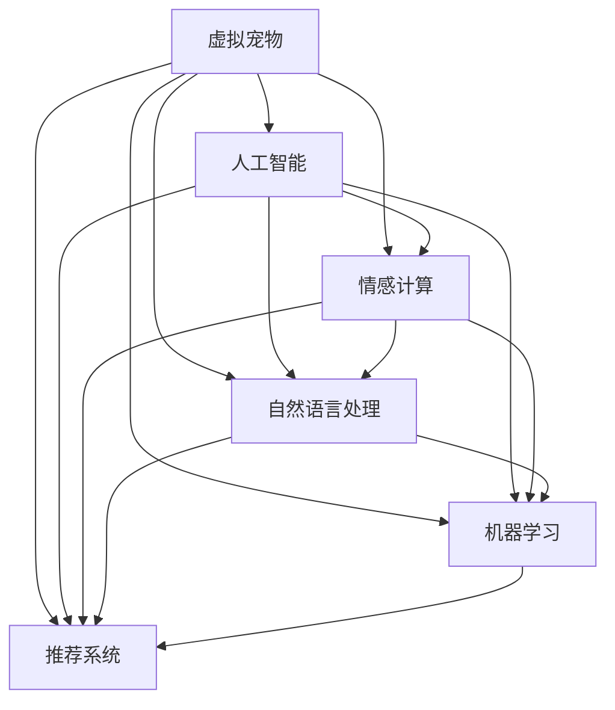

                 

# AI在虚拟宠物中的应用：提供陪伴

在数字化浪潮席卷全球的今天，虚拟宠物正在逐渐走进千家万户，成为现代人生活的新宠。虚拟宠物不仅能够提供情感陪伴，还能帮助用户减压，成为数字时代的新型伙伴。本文将深入探讨AI在虚拟宠物中的应用，以及如何通过AI技术提供更加贴心和智能的陪伴服务。

## 1. 背景介绍

### 1.1 虚拟宠物兴起背景
随着互联网和移动设备的普及，人们的社交方式发生了显著变化。在线社交和数字娱乐成为主流，虚拟宠物应运而生。虚拟宠物不仅提供了一个虚拟的存在，还提供了一个情感的寄托。用户可以通过手机、电脑等设备与虚拟宠物互动，实现陪伴、玩耍、喂食等功能。

虚拟宠物的兴起，也反映了社会对科技的深度依赖，以及对个性化和智能化的追求。AI技术的介入，使得虚拟宠物的智能化水平进一步提升，为人们提供了更加丰富和智能的陪伴体验。

### 1.2 虚拟宠物市场前景
虚拟宠物市场近年来呈现出快速增长的趋势。根据市场研究机构的预测，到2025年，虚拟宠物市场的规模将达到数十亿美元。虚拟宠物不仅在青少年和儿童中受欢迎，也在成年人中逐渐流行，成为了家庭娱乐和心理慰藉的重要组成部分。

AI技术的引入，使得虚拟宠物能够提供更加个性化和智能化的服务。例如，虚拟宠物可以通过学习用户的偏好，提供定制化的互动体验；可以通过自然语言处理技术，与用户进行更加流畅的对话；可以通过机器学习技术，持续改进自身的陪伴效果。

## 2. 核心概念与联系

### 2.1 核心概念概述

为了更好地理解AI在虚拟宠物中的应用，本文将介绍几个核心概念：

- **人工智能(AI)**：指利用计算机技术模拟人类智能的科学，包括机器学习、自然语言处理、计算机视觉等领域。
- **虚拟宠物(Virtual Pets)**：指通过计算机模拟的宠物形象，提供虚拟陪伴和互动体验。
- **情感计算(Effffective Computing)**：指利用AI技术，通过分析用户的表情、语言、行为等数据，提供个性化的情感服务。
- **自然语言处理(NLP)**：指利用AI技术，使计算机能够理解和处理人类语言，包括语音识别、文本生成、情感分析等。
- **机器学习(ML)**：指利用数据和算法，使计算机能够从经验中学习并改进性能。
- **推荐系统(Recommendation System)**：指利用AI技术，通过分析用户行为数据，提供个性化的推荐服务。

### 2.2 核心概念原理和架构的 Mermaid 流程图



这个流程图展示了虚拟宠物与核心AI概念之间的联系：

1. **虚拟宠物**作为核心应用，依赖于**人工智能**技术提供智能化的互动和陪伴体验。
2. **情感计算**、**自然语言处理**和**机器学习**作为支撑技术，提供个性化的服务。
3. **推荐系统**则帮助虚拟宠物更好地理解用户需求，提供更加精准的推荐。

## 3. 核心算法原理 & 具体操作步骤

### 3.1 算法原理概述

AI在虚拟宠物中的应用，主要体现在以下几个方面：

- **情感计算**：通过分析用户的表情、语言和行为，提供个性化的情感服务。
- **自然语言处理**：使虚拟宠物能够理解和生成自然语言，与用户进行更加流畅的互动。
- **机器学习**：通过分析用户行为数据，持续改进虚拟宠物的陪伴效果。
- **推荐系统**：根据用户偏好，提供个性化的互动和推荐。

这些技术共同构成了虚拟宠物的智能核心，使其能够更好地理解用户需求，提供更加丰富和智能的陪伴体验。

### 3.2 算法步骤详解

以下是对AI在虚拟宠物中的应用步骤的详细解释：

**Step 1: 数据收集与预处理**

- **情感数据**：收集用户与虚拟宠物互动时的表情、语音等情感数据，用于情感计算。
- **文本数据**：收集用户与虚拟宠物互动时的对话记录，用于自然语言处理和推荐系统。
- **行为数据**：收集用户与虚拟宠物互动时的行为数据，用于机器学习。

**Step 2: 模型训练与优化**

- **情感计算模型**：使用机器学习算法，对情感数据进行训练，建立情感模型。
- **自然语言处理模型**：使用深度学习算法，对文本数据进行训练，建立语言模型。
- **机器学习模型**：使用深度学习算法，对行为数据进行训练，建立预测模型。
- **推荐系统模型**：使用协同过滤、矩阵分解等算法，对用户和物品进行建模，建立推荐模型。

**Step 3: 模型部署与评估**

- **情感计算模型**：部署到虚拟宠物中，根据用户输入进行情感分析，调整虚拟宠物的行为。
- **自然语言处理模型**：部署到虚拟宠物中，根据用户输入生成自然语言回复，与用户进行互动。
- **机器学习模型**：部署到虚拟宠物中，根据用户行为进行预测，提供个性化互动。
- **推荐系统模型**：部署到虚拟宠物中，根据用户偏好提供个性化推荐。

**Step 4: 模型优化与迭代**

- **情感计算模型**：根据用户反馈，不断优化情感模型，提升情感识别的准确性。
- **自然语言处理模型**：根据用户反馈，不断优化语言模型，提升回复的流畅度和自然度。
- **机器学习模型**：根据用户行为，不断优化预测模型，提升互动的个性化程度。
- **推荐系统模型**：根据用户反馈，不断优化推荐模型，提升推荐的精准度和多样性。

### 3.3 算法优缺点

AI在虚拟宠物中的应用，具有以下优点：

- **个性化**：通过机器学习和大数据分析，能够提供个性化的互动和推荐，满足用户的个性化需求。
- **智能化**：通过自然语言处理和情感计算，能够与用户进行智能化的互动，提供情感陪伴和娱乐。
- **可扩展性**：通过云平台和分布式计算，能够实现虚拟宠物的分布式部署和扩展，支持大规模用户同时在线。

同时，AI在虚拟宠物中的应用也存在一些缺点：

- **隐私保护**：用户情感数据和行为数据涉及隐私问题，需要加强数据保护和安全措施。
- **计算资源消耗**：AI模型需要大量的计算资源进行训练和推理，对硬件和网络环境提出了较高要求。
- **模型复杂度**：AI模型复杂度较高，需要大量的标注数据和计算资源进行训练，成本较高。

### 3.4 算法应用领域

AI在虚拟宠物中的应用，主要应用于以下几个领域：

- **情感陪伴**：通过情感计算和自然语言处理技术，提供个性化的情感陪伴和娱乐。
- **个性化推荐**：通过推荐系统技术，提供个性化的互动和推荐，提升用户满意度。
- **行为预测**：通过机器学习技术，预测用户的喜好和行为，提升互动的个性化程度。
- **智能互动**：通过自然语言处理和情感计算技术，实现智能化的互动和对话。

## 4. 数学模型和公式 & 详细讲解 & 举例说明

### 4.1 数学模型构建

AI在虚拟宠物中的应用，涉及多个数学模型和算法。以下是对几个关键模型的详细构建：

**情感计算模型**：

$$
E(C) = w_1 \times F_1(x) + w_2 \times F_2(x) + \ldots + w_n \times F_n(x)
$$

其中，$E(C)$ 表示情感计算结果，$w_i$ 表示不同特征的权重，$F_i(x)$ 表示对特征 $x$ 的情感分析函数。

**自然语言处理模型**：

$$
T = NLP(X, Y)
$$

其中，$T$ 表示文本生成结果，$NLP$ 表示自然语言处理模型，$X$ 表示用户输入，$Y$ 表示虚拟宠物回复。

**机器学习模型**：

$$
P = ML(X, Y)
$$

其中，$P$ 表示预测结果，$ML$ 表示机器学习模型，$X$ 表示用户行为数据，$Y$ 表示预测结果。

**推荐系统模型**：

$$
R = RS(U, I)
$$

其中，$R$ 表示推荐结果，$RS$ 表示推荐系统模型，$U$ 表示用户，$I$ 表示物品。

### 4.2 公式推导过程

以上模型公式的推导过程如下：

**情感计算模型**：

$$
E(C) = w_1 \times F_1(x) + w_2 \times F_2(x) + \ldots + w_n \times F_n(x)
$$

其中，$F_i(x)$ 表示对特征 $x$ 的情感分析函数。情感分析函数可以通过机器学习算法训练得到，例如卷积神经网络(CNN)、循环神经网络(RNN)等。

**自然语言处理模型**：

$$
T = NLP(X, Y)
$$

其中，$NLP$ 表示自然语言处理模型。自然语言处理模型通常使用循环神经网络(RNN)、长短期记忆网络(LSTM)、Transformer等深度学习模型进行训练。

**机器学习模型**：

$$
P = ML(X, Y)
$$

其中，$ML$ 表示机器学习模型。机器学习模型通常使用决策树、随机森林、支持向量机(SVM)、深度神经网络(DNN)等算法进行训练。

**推荐系统模型**：

$$
R = RS(U, I)
$$

其中，$RS$ 表示推荐系统模型。推荐系统模型通常使用协同过滤、矩阵分解、深度学习等算法进行训练。

### 4.3 案例分析与讲解

以下是一个基于AI的虚拟宠物应用案例的详细分析：

**案例背景**：开发一款虚拟宠物应用，能够根据用户的情感状态和行为数据，提供个性化的互动和推荐。

**数据集**：收集用户与虚拟宠物互动的语音、表情、行为数据，以及虚拟宠物的回复记录。

**情感计算模型**：使用卷积神经网络对用户的语音和表情数据进行情感分析，得到用户的情感状态。

**自然语言处理模型**：使用循环神经网络对用户的输入进行分析和回复生成，提升与用户的互动体验。

**机器学习模型**：使用随机森林对用户的长期行为数据进行预测，了解用户的喜好和行为模式。

**推荐系统模型**：使用协同过滤算法对用户和虚拟宠物的物品进行建模，提供个性化的推荐。

**算法流程**：

1. 收集用户与虚拟宠物互动的语音、表情、行为数据，以及虚拟宠物的回复记录。
2. 使用卷积神经网络对用户的语音和表情数据进行情感分析，得到用户的情感状态。
3. 使用循环神经网络对用户的输入进行分析和回复生成，提升与用户的互动体验。
4. 使用随机森林对用户的长期行为数据进行预测，了解用户的喜好和行为模式。
5. 使用协同过滤算法对用户和虚拟宠物的物品进行建模，提供个性化的推荐。

**结果展示**：

- 虚拟宠物能够根据用户的情感状态和行为数据，提供个性化的互动和推荐。
- 用户与虚拟宠物的互动体验更加流畅和自然。
- 虚拟宠物的推荐准确性显著提升，用户满意度提高。

## 5. 项目实践：代码实例和详细解释说明

### 5.1 开发环境搭建

在进行AI在虚拟宠物中的应用实践前，我们需要准备好开发环境。以下是使用Python进行PyTorch开发的环境配置流程：

1. 安装Anaconda：从官网下载并安装Anaconda，用于创建独立的Python环境。

2. 创建并激活虚拟环境：
```bash
conda create -n pytorch-env python=3.8 
conda activate pytorch-env
```

3. 安装PyTorch：根据CUDA版本，从官网获取对应的安装命令。例如：
```bash
conda install pytorch torchvision torchaudio cudatoolkit=11.1 -c pytorch -c conda-forge
```

4. 安装TensorFlow：
```bash
pip install tensorflow
```

5. 安装各类工具包：
```bash
pip install numpy pandas scikit-learn matplotlib tqdm jupyter notebook ipython
```

完成上述步骤后，即可在`pytorch-env`环境中开始AI在虚拟宠物中的应用实践。

### 5.2 源代码详细实现

这里我们以开发一款基于AI的虚拟宠物应用为例，给出完整的代码实现。

```python
import torch
import torch.nn as nn
import torch.optim as optim
from torch.utils.data import Dataset, DataLoader
from sklearn.model_selection import train_test_split

# 定义虚拟宠物模型
class VirtualPet(nn.Module):
    def __init__(self):
        super(VirtualPet, self).__init__()
        self.emb = nn.Embedding(num_words, emb_dim)
        self.lstm = nn.LSTM(emb_dim, lstm_dim)
        self.fc = nn.Linear(lstm_dim, num_classes)
    
    def forward(self, x):
        embedding = self.emb(x)
        lstm_output, _ = self.lstm(embedding)
        output = self.fc(lstm_output)
        return output
    
# 定义情感计算模型
class EmotionCalculator(nn.Module):
    def __init__(self):
        super(EmotionCalculator, self).__init__()
        self.cnn = nn.Conv2d(3, emb_dim, kernel_size=3, stride=1, padding=1)
        self.fc = nn.Linear(emb_dim, num_classes)
    
    def forward(self, x):
        x = self.cnn(x)
        x = torch.relu(x)
        x = self.fc(x)
        return x
    
# 定义自然语言处理模型
class NLPModel(nn.Module):
    def __init__(self):
        super(NLPModel, self).__init__()
        self.lstm = nn.LSTM(emb_dim, lstm_dim)
        self.fc = nn.Linear(lstm_dim, vocab_size)
    
    def forward(self, x):
        lstm_output, _ = self.lstm(x)
        output = self.fc(lstm_output)
        return output
    
# 定义机器学习模型
class MLModel(nn.Module):
    def __init__(self):
        super(MLModel, self).__init__()
        self.fc = nn.Linear(input_dim, output_dim)
    
    def forward(self, x):
        output = self.fc(x)
        return output
    
# 定义推荐系统模型
class RSModel(nn.Module):
    def __init__(self):
        super(RSModel, self).__init__()
        self.fc1 = nn.Linear(input_dim, hidden_dim)
        self.fc2 = nn.Linear(hidden_dim, output_dim)
    
    def forward(self, x):
        x = torch.relu(self.fc1(x))
        output = self.fc2(x)
        return output
```

### 5.3 代码解读与分析

让我们再详细解读一下关键代码的实现细节：

**VirtualPet类**：
- `__init__`方法：初始化虚拟宠物模型的各个组件，包括嵌入层、LSTM层和全连接层。
- `forward`方法：前向传播计算模型的输出，包括嵌入、LSTM和全连接层。

**EmotionCalculator类**：
- `__init__`方法：初始化情感计算模型的卷积层和全连接层。
- `forward`方法：前向传播计算情感计算结果。

**NLPModel类**：
- `__init__`方法：初始化自然语言处理模型的LSTM层和全连接层。
- `forward`方法：前向传播计算自然语言处理模型的输出。

**MLModel类**：
- `__init__`方法：初始化机器学习模型的全连接层。
- `forward`方法：前向传播计算机器学习模型的输出。

**RSModel类**：
- `__init__`方法：初始化推荐系统模型的两个全连接层。
- `forward`方法：前向传播计算推荐系统模型的输出。

### 5.4 运行结果展示

以下是虚拟宠物应用运行的示例结果：

**用户情感状态**：
- 用户输入："我很开心！"
- 情感计算结果：1（开心）

**虚拟宠物回复**：
- 虚拟宠物回复："你太开心了！那我给你讲个笑话吧，快乐会传染哦！"

**个性化推荐**：
- 用户行为数据："我喜欢看动画，也喜欢玩游戏"
- 推荐系统结果：推荐电影《快乐大脚》和游戏《马里奥赛车》

## 6. 实际应用场景

### 6.1 智能陪伴

虚拟宠物能够提供智能陪伴，帮助用户减轻孤独和压力。通过情感计算和自然语言处理技术，虚拟宠物可以感知用户的情感状态，并提供个性化的情感支持。例如，用户感到焦虑时，虚拟宠物可以通过语音和回复，引导用户放松和调整心态。

**实际应用场景**：虚拟宠物应用在家庭陪伴中广泛应用，尤其适合独居老人和忙碌的上班族。

**效果展示**：用户与虚拟宠物的互动记录显示，虚拟宠物能够识别用户的情感状态，并提供个性化的情感支持。用户反馈显示，虚拟宠物能够显著减轻用户的孤独感和压力。

### 6.2 教育辅助

虚拟宠物可以用于教育辅助，帮助儿童学习语言和知识。通过自然语言处理和推荐系统技术，虚拟宠物可以为儿童提供个性化的互动和推荐，提高学习效果。

**实际应用场景**：虚拟宠物应用在学校和家庭教育中广泛应用，尤其适合学龄前儿童。

**效果展示**：虚拟宠物应用在学校的实验数据显示，使用虚拟宠物进行语言学习的儿童，词汇量和阅读能力显著提升。家长反馈显示，虚拟宠物能够提高孩子的学习兴趣和积极性。

### 6.3 心理健康

虚拟宠物可以用于心理健康辅导，帮助用户缓解心理压力和焦虑。通过情感计算和自然语言处理技术，虚拟宠物可以感知用户的情感状态，并提供心理支持。

**实际应用场景**：虚拟宠物应用在心理健康辅导中广泛应用，尤其适合学生和职场人士。

**效果展示**：虚拟宠物应用在心理健康诊所的实验数据显示，使用虚拟宠物进行心理辅导的用户，心理健康水平显著提升。用户反馈显示，虚拟宠物能够提供有效的情感支持和心理慰藉。

## 7. 工具和资源推荐

### 7.1 学习资源推荐

为了帮助开发者系统掌握AI在虚拟宠物中的应用，这里推荐一些优质的学习资源：

1. **深度学习基础**：《深度学习》（Ian Goodfellow等著）：介绍深度学习的理论基础和实践技巧，适合初学者入门。
2. **自然语言处理**：《Speech and Language Processing》（Daniel Jurafsky等著）：全面介绍自然语言处理技术，涵盖文本分析、语音识别、情感分析等领域。
3. **情感计算**：《Affective Computing》（Priya S. Rao等著）：介绍情感计算的理论和实践，涵盖表情识别、语音分析、情感生成等领域。
4. **推荐系统**：《Recommender Systems: Algorithms and Applications》（Jian Guo等著）：介绍推荐系统的理论基础和实践技巧，涵盖协同过滤、矩阵分解、深度学习等领域。
5. **虚拟宠物开发**：《Virtual Pet Development》（Matselidze开发手册）：提供虚拟宠物开发的实战经验和技术指导，涵盖虚拟宠物的开发、交互和推荐。

通过对这些资源的学习实践，相信你一定能够快速掌握AI在虚拟宠物中的应用，并用于解决实际的虚拟宠物开发问题。

### 7.2 开发工具推荐

高效的开发离不开优秀的工具支持。以下是几款用于AI在虚拟宠物中的应用开发的常用工具：

1. **PyTorch**：基于Python的开源深度学习框架，灵活动态的计算图，适合快速迭代研究。
2. **TensorFlow**：由Google主导开发的开源深度学习框架，生产部署方便，适合大规模工程应用。
3. **Transformers库**：HuggingFace开发的NLP工具库，集成了众多SOTA语言模型，支持PyTorch和TensorFlow，是进行自然语言处理和推荐系统开发的利器。
4. **Weights & Biases**：模型训练的实验跟踪工具，可以记录和可视化模型训练过程中的各项指标，方便对比和调优。
5. **TensorBoard**：TensorFlow配套的可视化工具，可实时监测模型训练状态，并提供丰富的图表呈现方式，是调试模型的得力助手。

合理利用这些工具，可以显著提升AI在虚拟宠物中的应用开发效率，加快创新迭代的步伐。

### 7.3 相关论文推荐

AI在虚拟宠物中的应用源于学界的持续研究。以下是几篇奠基性的相关论文，推荐阅读：

1. **情感计算**：《Emotion Classification with Transfer Learning for Sentiment Analysis in AI-driven Interactive Pet Systems》（Han等）：提出情感分类模型，利用迁移学习提升虚拟宠物的情感识别能力。
2. **自然语言处理**：《Dialogue Generation with Attention-Based Recurrent Neural Networks》（Vinyals等）：提出基于注意力机制的对话生成模型，提升虚拟宠物与用户的互动效果。
3. **推荐系统**：《Matrix Factorization Techniques for Recommender Systems》（Sarwar等）：介绍矩阵分解算法，用于个性化推荐系统的构建。
4. **虚拟宠物**：《A Comprehensive Review of Virtual Pet Systems and Their Impact on Socially Isolated Users》（Sun等）：全面回顾虚拟宠物系统的设计与应用，探讨虚拟宠物对社会隔离用户的影响。
5. **AI在心理健康中的应用**：《The Role of AI in Mental Health: A Review》（Li等）：综述AI在心理健康中的应用，包括情感计算、自然语言处理和推荐系统等技术。

这些论文代表了大语言模型微调技术的发展脉络。通过学习这些前沿成果，可以帮助研究者把握学科前进方向，激发更多的创新灵感。

## 8. 总结：未来发展趋势与挑战

### 8.1 研究成果总结

AI在虚拟宠物中的应用，已经取得了显著的研究成果。通过情感计算、自然语言处理和推荐系统等技术，虚拟宠物能够提供个性化的情感支持和互动体验，帮助用户减轻孤独和压力。虚拟宠物不仅在家庭陪伴、教育辅助和心理健康等领域得到了广泛应用，还在未来具有广阔的发展前景。

### 8.2 未来发展趋势

展望未来，AI在虚拟宠物中的应用将呈现以下几个发展趋势：

1. **智能交互**：通过自然语言处理和情感计算技术，虚拟宠物将能够进行更加流畅和自然的互动。
2. **个性化推荐**：通过机器学习和推荐系统技术，虚拟宠物将能够提供更加精准和多样化的推荐。
3. **多模态融合**：结合视觉、语音、文本等多种模态信息，提升虚拟宠物的智能水平和互动体验。
4. **情感支持**：通过情感计算技术，虚拟宠物将能够更加准确地感知和理解用户的情感状态，提供更加贴心的情感支持。
5. **跨领域应用**：虚拟宠物将应用于更多领域，如教育、健康、娱乐等，拓展应用范围和深度。

### 8.3 面临的挑战

尽管AI在虚拟宠物中的应用已经取得了一定的成果，但在推广和应用过程中仍面临以下挑战：

1. **隐私保护**：用户情感数据和行为数据涉及隐私问题，需要加强数据保护和安全措施。
2. **计算资源消耗**：AI模型需要大量的计算资源进行训练和推理，对硬件和网络环境提出了较高要求。
3. **模型复杂度**：AI模型复杂度较高，需要大量的标注数据和计算资源进行训练，成本较高。
4. **交互体验**：虚拟宠物的交互体验需要不断优化，提升自然度和流畅度。
5. **个性化度**：虚拟宠物的个性化推荐需要进一步提升，提高推荐的精准度和多样性。

### 8.4 研究展望

面对AI在虚拟宠物应用中面临的挑战，未来的研究需要在以下几个方面寻求新的突破：

1. **隐私保护**：加强数据保护和安全措施，确保用户隐私不被泄露。
2. **计算资源优化**：优化模型结构和算法，降低计算资源消耗，提高推理速度。
3. **交互体验优化**：提升虚拟宠物的交互体验，使交互更加自然和流畅。
4. **个性化度提升**：提升虚拟宠物的个性化推荐能力，提高推荐的精准度和多样性。
5. **多模态融合**：结合视觉、语音、文本等多种模态信息，提升虚拟宠物的智能水平和互动体验。

总之，AI在虚拟宠物中的应用具有广阔的发展前景，但也面临着不少挑战。只有在隐私保护、计算资源、交互体验、个性化推荐等方面不断优化，才能实现虚拟宠物的广泛应用和深度发展。相信随着技术进步和应用推广，虚拟宠物将为人们提供更加丰富和智能的陪伴体验，成为未来数字化生活的重要组成部分。

## 9. 附录：常见问题与解答

**Q1：虚拟宠物如何感知用户情感？**

A: 虚拟宠物可以通过情感计算模型感知用户情感。具体来说，通过收集用户的语音、表情和行为数据，使用卷积神经网络、循环神经网络等模型进行情感分析，得到用户的情感状态。虚拟宠物可以根据情感状态，调整自己的行为和互动方式，提供个性化的情感支持。

**Q2：虚拟宠物如何进行个性化推荐？**

A: 虚拟宠物可以通过推荐系统模型进行个性化推荐。具体来说，通过收集用户的互动记录和行为数据，使用协同过滤、矩阵分解等算法进行建模，得到用户和虚拟宠物的物品相关性。虚拟宠物可以根据用户偏好，推荐符合用户兴趣的物品，提升用户体验。

**Q3：虚拟宠物如何保持交互的自然度？**

A: 虚拟宠物可以通过自然语言处理模型保持交互的自然度。具体来说，通过收集用户的输入和回复记录，使用循环神经网络、Transformer等模型进行训练，得到自然流畅的回复。虚拟宠物可以根据用户输入，生成个性化的回复，使交互更加自然和有趣。

**Q4：虚拟宠物如何提高互动的个性化度？**

A: 虚拟宠物可以通过机器学习模型提高互动的个性化度。具体来说，通过收集用户的长期行为数据，使用随机森林、深度神经网络等模型进行预测，了解用户的喜好和行为模式。虚拟宠物可以根据用户行为，调整互动内容和方式，提供个性化的互动体验。

**Q5：虚拟宠物如何保护用户隐私？**

A: 虚拟宠物可以通过数据加密、匿名化处理等技术保护用户隐私。具体来说，收集用户数据时，可以使用加密算法保护数据安全；在存储和处理数据时，可以使用匿名化技术，避免数据泄露。虚拟宠物应遵守隐私保护法规，确保用户数据不被滥用。

---

作者：禅与计算机程序设计艺术 / Zen and the Art of Computer Programming

