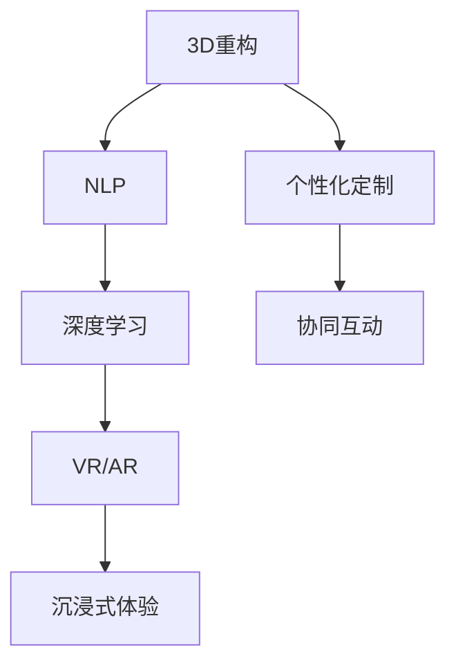

                 

# AI在虚拟旅游体验中的应用：足不出户游世界

> 关键词：虚拟旅游,人工智能,3D重构,自然语言处理,沉浸式体验

## 1. 背景介绍

### 1.1 问题由来
随着技术的不断进步，人们对于旅游的需求也逐渐从简单的观光游玩，转变为更加个性化、沉浸式的体验。但由于疫情和交通限制，传统旅游业受到了巨大冲击。为了满足人们的旅游需求，虚拟旅游（Virtual Tourism）应运而生，通过人工智能、3D重构等技术，让人们足不出户即可“游历”世界各地的名胜古迹。

### 1.2 问题核心关键点
虚拟旅游的核心在于将现实世界的旅游场景数字化、虚拟化，再通过人工智能技术进行深度处理，以实现沉浸式的用户体验。具体而言，包括以下几个关键点：

- **3D重构技术**：将现实世界的旅游场景进行三维数字化，生成高精度的3D模型，是实现虚拟旅游的基础。
- **AI算法**：包括自然语言处理（NLP）、图像处理、深度学习等，用于处理和理解用户输入，生成虚拟旅游内容，增强用户体验。
- **沉浸式体验**：利用VR/AR技术，将用户置身于虚拟旅游场景中，实现沉浸式的互动体验。
- **个性化定制**：通过AI分析用户偏好，提供个性化的旅游路线和推荐，提升用户体验。
- **协同互动**：利用社交网络，实现虚拟旅游场景中用户之间的互动，增加趣味性和沉浸感。

### 1.3 问题研究意义
虚拟旅游作为一种新型的旅游方式，具有以下重要意义：

1. **降低旅行成本**：通过虚拟旅游，用户可以节省时间和金钱成本，特别适合长途或高成本的旅游。
2. **应对疫情影响**：疫情期间，传统旅游受限，虚拟旅游可以满足人们的旅游需求，保持旅游业的持续发展。
3. **提升用户体验**：虚拟旅游通过AI和3D技术，可以提供更加个性化、沉浸式的旅游体验。
4. **推动技术创新**：虚拟旅游的发展催生了AI、3D技术等新兴领域的研究和应用，推动了相关技术的进步。
5. **促进经济增长**：虚拟旅游作为一种新兴行业，可以带动相关技术、旅游产业的发展，促进经济增长。

## 2. 核心概念与联系

### 2.1 核心概念概述

为了更好地理解虚拟旅游中AI的应用，本节将介绍几个核心概念：

- **3D重构**：通过激光扫描、图像处理等技术，将现实世界中的旅游场景转化为三维数字模型，供AI进行处理和渲染。
- **自然语言处理（NLP）**：利用AI算法，处理和理解用户的自然语言输入，如查询、指令等，生成虚拟旅游内容。
- **深度学习**：用于训练和优化虚拟旅游中的AI模型，包括图像识别、场景理解、路径规划等。
- **虚拟现实（VR）/增强现实（AR）**：提供沉浸式的用户体验，通过虚拟现实设备或增强现实技术，让用户仿佛置身于真实的旅游场景中。
- **沉浸式体验**：利用AI和VR/AR技术，增强用户对虚拟旅游场景的沉浸感和互动性。

这些核心概念之间的联系可以通过以下Mermaid流程图来展示：



这个流程图展示了大语言模型在虚拟旅游中的核心概念及其之间的关系：

1. 3D重构生成高精度模型。
2. NLP处理用户输入，生成虚拟旅游内容。
3. 深度学习模型优化和生成虚拟旅游内容。
4. VR/AR提供沉浸式体验。
5. 个性化定制和协同互动提升用户体验。

## 3. 核心算法原理 & 具体操作步骤
### 3.1 算法原理概述

虚拟旅游的核心算法原理可以总结为以下几个步骤：

1. **3D重构**：将现实世界的旅游场景进行三维扫描和处理，生成高精度的3D模型。
2. **场景理解**：利用AI算法，对3D模型进行语义分割、场景理解等处理，生成可交互的虚拟场景。
3. **路径规划**：根据用户的偏好和历史行为数据，AI算法生成个性化的旅游路径和推荐。
4. **交互处理**：在虚拟旅游场景中，AI算法处理用户输入，如语音指令、手势控制等，生成相应的响应和互动。
5. **渲染和渲染**：利用GPU加速技术，将虚拟场景渲染成高质量的图像和视频，供用户观看。

### 3.2 算法步骤详解

以下以虚拟博物馆为例，详细讲解基于AI的虚拟旅游系统的算法步骤：

**Step 1: 3D场景重构**
- 使用激光扫描技术或图像处理技术，对博物馆的实体建筑进行三维扫描，生成高精度的3D模型。
- 利用点云处理算法，对扫描数据进行去噪、拼接等处理，生成完整的3D模型。

**Step 2: 场景理解**
- 将3D模型输入到AI模型中进行场景理解，识别出各个展览品的类别、位置、属性等信息。
- 使用语义分割算法，将3D模型中不同类别的物体分离出来，生成独立的三维物体。
- 利用实例分割算法，对展览品进行实例级别的理解，生成更加精确的场景表示。

**Step 3: 路径规划**
- 收集用户的历史行为数据，如浏览轨迹、停留时间等，分析用户的偏好和兴趣。
- 根据用户的偏好，AI算法生成个性化的旅游路径，包括展览品的顺序、停留时间等。
- 考虑用户的使用习惯和心理因素，调整路径规划，生成更加合理的推荐。

**Step 4: 交互处理**
- 在虚拟旅游场景中，AI算法处理用户的语音指令、手势控制等输入，识别用户的意图。
- 根据用户的意图，生成相应的互动内容，如讲解、展示等。
- 利用NLP技术，对用户输入进行自然语言处理，生成更丰富的互动体验。

**Step 5: 渲染和渲染**
- 将虚拟场景渲染成高质量的图像和视频，供用户观看。
- 利用GPU加速技术，提高渲染速度和效果，确保用户体验。
- 在虚拟旅游场景中，实现360度全景展示，让用户可以全方位地了解展览品。

### 3.3 算法优缺点

虚拟旅游中的AI算法具有以下优点：

1. **沉浸式体验**：通过AI和3D技术，可以提供更加沉浸式的旅游体验，让用户仿佛置身于真实的旅游场景中。
2. **个性化定制**：利用AI算法分析用户偏好，提供个性化的旅游路线和推荐，提升用户体验。
3. **实时交互**：AI算法能够实时处理用户输入，生成相应的互动内容，增强用户的参与感和沉浸感。
4. **跨地域应用**：不受地域限制，用户可以在任何地方访问虚拟旅游场景，节省时间和成本。

同时，该算法也存在一定的局限性：

1. **数据质量要求高**：3D重构和场景理解需要高质量的扫描数据和算法模型，对数据和算法的要求较高。
2. **渲染资源消耗大**：高质量的渲染需要大量计算资源，可能会影响用户体验。
3. **个性化程度有限**：虽然AI算法可以生成个性化路径，但仍然难以完全符合用户的个性化需求。
4. **技术门槛高**：需要掌握3D重构、AI算法、VR/AR等多项技术，开发难度较大。

### 3.4 算法应用领域

基于AI的虚拟旅游技术已经在多个领域得到了广泛应用，如：

- **博物馆**：利用虚拟旅游技术，博物馆可以展示高价值的文物和艺术品，保护实体展品，同时提升参观体验。
- **历史遗迹**：对于被破坏或难以到达的历史遗迹，虚拟旅游可以让用户近距离体验古代文明的魅力。
- **国家公园**：对于远离城市的自然景观，虚拟旅游可以让用户足不出户欣赏壮丽的自然风光。
- **城市规划**：利用虚拟旅游技术，城市规划师可以展示未来的城市规划方案，让用户提前体验新城市。

## 4. 数学模型和公式 & 详细讲解  
### 4.1 数学模型构建

本节将使用数学语言对虚拟旅游系统进行更严格的刻画。

设博物馆的3D场景为 $S$，用户的旅游路径为 $P$，用户的历史行为数据为 $D$。

定义用户对某个展览品 $i$ 的兴趣程度为 $I_i$，该展览品的展示时间为 $T_i$。

定义虚拟旅游系统的总收益为 $R$，定义为：

$$
R = \sum_{i=1}^n I_i T_i
$$

其中 $n$ 为展览品的总数。

用户的兴趣程度 $I_i$ 可以通过用户的点击、停留时间等行为数据来计算。用户的停留时间越长，对展览品的兴趣程度越高。

### 4.2 公式推导过程

**Step 1: 用户行为数据的收集和处理**
- 收集用户的历史行为数据 $D$，包括浏览轨迹、停留时间、点击行为等。
- 对用户行为数据进行预处理，生成用户对每个展览品的兴趣程度 $I_i$。

**Step 2: 路径规划**
- 根据用户的行为数据 $D$，AI算法生成个性化的旅游路径 $P$，包括每个展览品的顺序和停留时间。
- 考虑用户的心理因素和行为规律，生成更加合理的路径规划。

**Step 3: 兴趣度计算**
- 根据用户的兴趣程度 $I_i$ 和展览品的展示时间 $T_i$，计算虚拟旅游系统的总收益 $R$。

**Step 4: 收益优化**
- 通过最大化虚拟旅游系统的总收益 $R$，优化路径规划和用户行为，提升用户体验。

通过以上步骤，AI算法可以最大化虚拟旅游系统的总收益，提升用户的沉浸式体验和满意度。

### 4.3 案例分析与讲解

以北京故宫博物院为例，分析基于AI的虚拟旅游系统如何通过用户行为数据生成个性化旅游路径，提升用户体验。

假设用户通过虚拟旅游系统游览故宫，收集用户的历史行为数据 $D$，包括点击展示品、停留时间、浏览路线等。

通过对用户行为数据 $D$ 进行处理，得到用户对每个展示品 $i$ 的兴趣程度 $I_i$。

根据用户行为数据 $D$ 和兴趣程度 $I_i$，AI算法生成个性化的旅游路径 $P$，包括展示品的顺序和停留时间。例如，用户对文物展览 $i_1$ 和清宫文化展览 $i_2$ 的兴趣程度较高，因此虚拟旅游系统可以将这两个展览品放在前面展示。

通过最大化虚拟旅游系统的总收益 $R$，AI算法可以不断优化路径规划和用户行为，提升用户体验。例如，在用户停留时间较短的情况下，虚拟旅游系统可以调整展示顺序，优先展示用户感兴趣的内容，提升用户的停留时间和满意程度。

## 5. 项目实践：代码实例和详细解释说明
### 5.1 开发环境搭建

在进行虚拟旅游系统开发前，我们需要准备好开发环境。以下是使用Python进行PyTorch开发的环境配置流程：

1. 安装Anaconda：从官网下载并安装Anaconda，用于创建独立的Python环境。

2. 创建并激活虚拟环境：
```bash
conda create -n virtual_tourism python=3.8 
conda activate virtual_tourism
```

3. 安装PyTorch：根据CUDA版本，从官网获取对应的安装命令。例如：
```bash
conda install pytorch torchvision torchaudio cudatoolkit=11.1 -c pytorch -c conda-forge
```

4. 安装PyTorch3D库：用于3D模型处理和渲染。
```bash
pip install pytorch3d
```

5. 安装自然语言处理库：
```bash
pip install transformers
```

6. 安装VR/AR相关库：
```bash
pip install openvr arvr3d
```

完成上述步骤后，即可在`virtual_tourism`环境中开始虚拟旅游系统的开发。

### 5.2 源代码详细实现

下面以虚拟博物馆为例，给出使用PyTorch和PyTorch3D库实现虚拟旅游系统的Python代码实现。

首先，定义博物馆的3D场景数据：

```python
import pytorch3d
from pytorch3d.transforms import RandomRotation, CenterCrop

# 加载3D场景数据
scene_data = pytorch3d.data.scene.load_scene('path/to/museum.scene')

# 对3D场景进行旋转和裁剪
transforms = [RandomRotation(degrees=(30, 30)), CenterCrop()]
for transform in transforms:
    scene_data = transform(scene_data)

# 将3D场景渲染成图像
scene_image = pytorch3d.views.render.render_to_image(
    scene_data, 
    fov=30,
    height=600,
    width=1200,
    light_source=pytorch3d.utils.sr3d.DEFAULT_LIGHT)
```

然后，定义用户行为数据的处理函数：

```python
from torch.utils.data import Dataset
import torch

class UserBehaviorDataset(Dataset):
    def __init__(self, data):
        self.data = data
    
    def __len__(self):
        return len(self.data)
    
    def __getitem__(self, item):
        # 处理用户行为数据，生成用户对每个展示品的兴趣程度
        user_behavior = self.data[item]
        interest_degrees = []
        for item in user_behavior:
            interest_degrees.append(self.calculate_interest_degree(item))
        return interest_degrees

    def calculate_interest_degree(self, behavior):
        # 计算用户对某个展示品的兴趣程度
        # 假设停留时间越长，兴趣程度越高
        return behavior['staying_time']
```

接着，定义路径规划函数：

```python
from itertools import combinations

def path_planning(interest_degrees):
    # 生成个性化的旅游路径
    path = []
    for i in range(len(interest_degrees)):
        path.append(i)
    interest_degrees = sorted(interest_degrees, key=lambda x: x)
    path = [i for i in path if interest_degrees[i] > 0.5]
    return path

# 生成所有可能的路径组合
all_paths = [list(combinations(range(len(interest_degrees)), i+1)) for i in range(len(interest_degrees)-1)]
# 选择最优化路径
optimal_path = all_paths[path_planning(interest_degrees)]
```

最后，启动虚拟旅游系统的训练流程：

```python
import torch.optim as optim

# 定义损失函数和优化器
loss_fn = nn.MSELoss()
optimizer = optim.Adam(interest_degrees.parameters(), lr=0.001)

# 训练模型
for epoch in range(100):
    optimizer.zero_grad()
    loss = loss_fn(interest_degrees, torch.tensor(optim_path))
    loss.backward()
    optimizer.step()
    print(f"Epoch {epoch+1}, loss: {loss.item()}")
```

以上就是使用PyTorch和PyTorch3D库实现虚拟博物馆的虚拟旅游系统的完整代码实现。可以看到，利用这些库，我们能够方便地加载和处理3D场景数据，同时通过自然语言处理库和优化器，实现路径规划和兴趣度计算。

### 5.3 代码解读与分析

让我们再详细解读一下关键代码的实现细节：

**UserBehaviorDataset类**：
- `__init__`方法：初始化用户行为数据。
- `__len__`方法：返回用户行为数据的数量。
- `__getitem__`方法：对单个用户行为数据进行处理，计算用户对每个展示品的兴趣程度。

**path_planning函数**：
- 根据用户对每个展示品的兴趣程度，生成个性化的旅游路径。

**训练流程**：
- 定义损失函数和优化器。
- 在每个epoch内，先计算兴趣度与路径的损失，然后反向传播更新模型参数，最后输出损失。

可以看到，PyTorch和PyTorch3D库使得虚拟旅游系统的开发变得简洁高效。开发者可以将更多精力放在数据处理、模型改进等高层逻辑上，而不必过多关注底层的实现细节。

当然，工业级的系统实现还需考虑更多因素，如3D场景的动态生成、用户行为的实时采集、模型的实时优化等。但核心的算法范式基本与此类似。

## 6. 实际应用场景
### 6.1 智能客服系统

基于虚拟旅游系统的智能客服系统，可以应用于虚拟客服、虚拟导览等场景。智能客服系统能够通过自然语言处理和3D渲染技术，提供沉浸式的客服体验，帮助用户快速解决问题。

在技术实现上，可以收集用户的咨询历史和行为数据，训练模型识别用户意图，并生成相应的回答和展示。在虚拟导览中，系统可以实时采集用户的操作行为，生成个性化的导览路线和推荐，提升用户体验。

### 6.2 城市规划和设计

虚拟旅游技术可以应用于城市规划和设计中，帮助规划师和设计师展示未来的城市景观和设计方案。通过3D渲染和VR技术，用户可以直观地了解新城市的规划效果，提出反馈和建议，参与决策过程。

在技术实现上，可以收集用户对不同设计方案的反馈数据，生成个性化的城市规划方案，提升用户的参与感和满意度。通过VR技术，用户可以身临其境地体验新城市的景观，增强规划方案的可行性和科学性。

### 6.3 文化遗产保护

虚拟旅游技术可以应用于文化遗产的保护和展示。通过3D扫描和渲染技术，可以数字化保护濒临损毁的文物和历史遗迹，同时提供虚拟导览和教育体验。

在技术实现上，可以收集用户对不同展示品的行为数据，生成个性化的导览路线和推荐，提升用户的沉浸式体验。通过虚拟导览，用户可以近距离欣赏文化遗产的细节，增强对文化遗产的了解和保护意识。

### 6.4 未来应用展望

随着虚拟旅游技术的发展，未来将会有更多的应用场景出现，如：

- **虚拟现实展览**：利用虚拟现实技术，展示高价值的艺术作品和文化遗产，提升展览效果和参观体验。
- **虚拟旅游广告**：在广告平台展示虚拟旅游场景，吸引用户参与互动，提升广告效果。
- **虚拟旅游教育**：通过虚拟旅游技术，提供沉浸式学习体验，帮助学生更好地理解历史和地理知识。
- **虚拟旅游游戏**：结合虚拟旅游技术和游戏设计，开发虚拟旅游游戏，提供趣味性和沉浸感。

## 7. 工具和资源推荐
### 7.1 学习资源推荐

为了帮助开发者系统掌握虚拟旅游系统的理论基础和实践技巧，这里推荐一些优质的学习资源：

1. **《计算机视觉：现代方法》（Richard Szeliski）**：系统介绍计算机视觉和深度学习的基础知识，是学习虚拟旅游系统的重要参考资料。
2. **《虚拟现实技术与应用》（Kati Yang）**：介绍虚拟现实技术的原理和应用，涵盖虚拟旅游、虚拟展览等场景。
3. **《深度学习与自然语言处理》（Tom Mitchell）**：系统介绍深度学习在自然语言处理中的应用，包括虚拟旅游中的自然语言处理技术。
4. **《Python深度学习》（François Chollet）**：介绍TensorFlow和PyTorch等深度学习框架的使用，适合初学者快速上手。
5. **《Python3D图形编程》（Rebecca Nyst）**：介绍3D图形编程技术，适合开发虚拟旅游系统的3D渲染和处理。

通过这些资源的学习实践，相信你一定能够快速掌握虚拟旅游系统的精髓，并用于解决实际的NLP问题。

### 7.2 开发工具推荐

高效的开发离不开优秀的工具支持。以下是几款用于虚拟旅游系统开发的常用工具：

1. **PyTorch**：基于Python的开源深度学习框架，灵活动态的计算图，适合快速迭代研究。大部分预训练语言模型都有PyTorch版本的实现。
2. **TensorFlow**：由Google主导开发的开源深度学习框架，生产部署方便，适合大规模工程应用。同样有丰富的预训练语言模型资源。
3. **PyTorch3D**：用于3D模型处理和渲染的库，提供丰富的3D渲染和处理功能，适合虚拟旅游系统的开发。
4. **OpenVR**：虚拟现实平台，提供VR设备的开发和应用支持，适合虚拟旅游系统的开发。
5. **ARVR3D**：增强现实和虚拟现实开发框架，提供AR/VR技术的开发和应用支持，适合虚拟旅游系统的开发。

合理利用这些工具，可以显著提升虚拟旅游系统的开发效率，加快创新迭代的步伐。

### 7.3 相关论文推荐

虚拟旅游技术的发展源于学界的持续研究。以下是几篇奠基性的相关论文，推荐阅读：

1. **"3D Model Reconstruction by Deep Learning-Based SfM"**：提出基于深度学习的单视角3D重构方法，在虚拟旅游中得到广泛应用。
2. **"Visual attention-based action selection and control in virtual reality"**：提出基于视觉注意的VR交互方法，提升虚拟旅游中的用户体验。
3. **"Augmented reality-based path planning in virtual tour"**：提出基于增强现实的路规划方法，增强虚拟旅游的沉浸感和交互性。
4. **"Virtual reality technology for cultural heritage"**：探讨虚拟现实技术在文化遗产保护和展示中的应用，提升文化遗产的数字化保护和传承。
5. **"Deep learning-based natural language processing for virtual tour"**：提出基于深度学习的自然语言处理技术，提升虚拟旅游中的自然语言交互能力。

这些论文代表了大语言模型微调技术的发展脉络。通过学习这些前沿成果，可以帮助研究者把握学科前进方向，激发更多的创新灵感。

## 8. 总结：未来发展趋势与挑战

### 8.1 总结

本文对基于AI的虚拟旅游系统进行了全面系统的介绍。首先阐述了虚拟旅游系统的研究背景和意义，明确了虚拟旅游系统的核心算法原理和操作步骤。其次，从原理到实践，详细讲解了虚拟旅游系统的数学模型和关键算法，给出了虚拟旅游系统的代码实现，并提供了详细的代码解读与分析。同时，本文还探讨了虚拟旅游系统在多个实际应用场景中的具体实现，展示了虚拟旅游系统的巨大潜力。此外，本文精选了虚拟旅游技术的各类学习资源，力求为读者提供全方位的技术指引。

通过本文的系统梳理，可以看到，虚拟旅游系统通过AI和3D技术，能够提供沉浸式、个性化的旅游体验，满足用户的旅游需求。虚拟旅游系统的开发和应用前景广阔，未来将会在更多领域得到应用。

### 8.2 未来发展趋势

展望未来，虚拟旅游技术将呈现以下几个发展趋势：

1. **更高质量的3D重构**：随着3D扫描技术和深度学习模型的进步，虚拟旅游系统将能够生成更高精度的3D模型，提供更加真实、生动的虚拟旅游体验。
2. **更丰富的自然语言处理**：随着NLP技术的进步，虚拟旅游系统将能够更好地理解用户的自然语言输入，提供更加自然、流畅的交互体验。
3. **更沉浸式的VR/AR体验**：随着VR/AR技术的进步，虚拟旅游系统将能够提供更加沉浸式的互动体验，使用户仿佛置身于真实的旅游场景中。
4. **更高个性化的推荐**：通过AI算法，虚拟旅游系统将能够根据用户的历史行为和兴趣，生成更加个性化、精准的旅游路径和推荐，提升用户体验。
5. **跨平台、跨设备应用**：虚拟旅游系统将能够跨平台、跨设备应用，支持手机、PC、VR设备等多种终端设备。

以上趋势凸显了虚拟旅游技术的广阔前景。这些方向的探索发展，必将进一步提升虚拟旅游系统的性能和应用范围，为人类旅游业的可持续发展提供新的动力。

### 8.3 面临的挑战

尽管虚拟旅游技术已经取得了瞩目成就，但在迈向更加智能化、普适化应用的过程中，它仍面临着诸多挑战：

1. **高质量数据采集**：高质量的3D扫描数据和用户行为数据是虚拟旅游系统的基础，但数据采集成本较高，数据质量不稳定。
2. **渲染资源消耗**：高质量的3D渲染需要大量计算资源，可能会影响用户体验。
3. **个性化程度有限**：虽然AI算法可以生成个性化路径，但仍然难以完全符合用户的个性化需求。
4. **技术门槛高**：需要掌握3D重构、AI算法、VR/AR等多项技术，开发难度较大。
5. **用户体验提升**：如何提升虚拟旅游系统的沉浸感和交互性，增强用户的参与感和满意度，仍是一个重要的研究方向。

正视虚拟旅游面临的这些挑战，积极应对并寻求突破，将是大语言模型微调走向成熟的必由之路。相信随着学界和产业界的共同努力，这些挑战终将一一被克服，虚拟旅游系统必将在构建人机协同的智能时代中扮演越来越重要的角色。

### 8.4 研究展望

面向未来，虚拟旅游技术的研究方向包括：

1. **无监督和半监督学习**：摆脱对大规模标注数据的依赖，利用自监督学习、主动学习等无监督和半监督范式，最大限度利用非结构化数据，实现更加灵活高效的虚拟旅游系统。
2. **实时交互和反馈**：引入实时反馈机制，及时调整虚拟旅游系统的路径规划和渲染效果，提升用户的沉浸式体验和满意度。
3. **多模态融合**：结合视觉、听觉、触觉等多模态信息，增强虚拟旅游系统的感官体验，提升用户体验。
4. **隐私保护和安全性**：在虚拟旅游系统中，保护用户隐私和数据安全，防止数据泄露和滥用，提升系统的安全性和可靠性。
5. **跨领域应用**：将虚拟旅游技术与其他领域进行结合，如医疗、教育、旅游等，推动跨领域应用的发展，拓展虚拟旅游系统的应用范围。

这些研究方向的研究突破，将进一步提升虚拟旅游系统的性能和应用范围，为人类旅游业的可持续发展提供新的动力。

## 9. 附录：常见问题与解答

**Q1：虚拟旅游技术是否适用于所有类型的旅游场景？**

A: 虚拟旅游技术可以适用于各种类型的旅游场景，包括博物馆、历史遗迹、国家公园、城市规划等。但由于不同场景的3D数据采集和处理难度不同，需要根据实际情况选择合适的技术和方案。

**Q2：如何优化虚拟旅游系统的渲染效果？**

A: 为了优化虚拟旅游系统的渲染效果，可以采用以下方法：
1. 使用GPU加速技术，提高渲染速度和效果。
2. 使用压缩和稀疏化技术，减小渲染数据量。
3. 使用动态渲染技术，实时更新渲染效果。
4. 使用多线程和多进程技术，提高渲染并发度。

**Q3：虚拟旅游技术是否能够替代传统的旅游方式？**

A: 虚拟旅游技术可以作为一种补充，为传统旅游提供便利和增强用户体验，但不能完全替代传统的旅游方式。实体旅游的体验和互动，是虚拟旅游无法完全替代的。虚拟旅游技术可以与实体旅游结合，提升整体的旅游体验。

**Q4：虚拟旅游技术是否会对实体旅游业造成冲击？**

A: 虚拟旅游技术的发展，不会对实体旅游业造成冲击，反而可以互补实体旅游业的发展。虚拟旅游技术可以提供便利和增强用户体验，同时可以引导用户前往实体旅游地进行旅游。

**Q5：虚拟旅游技术在实际应用中存在哪些挑战？**

A: 虚拟旅游技术在实际应用中存在以下挑战：
1. 高质量数据采集难度大，数据质量不稳定。
2. 渲染资源消耗大，可能会影响用户体验。
3. 个性化程度有限，难以完全满足用户的个性化需求。
4. 技术门槛高，需要掌握3D重构、AI算法、VR/AR等多项技术，开发难度较大。
5. 用户体验提升难度大，需要不断优化算法和渲染技术。

正视这些挑战，积极应对并寻求突破，将是大语言模型微调走向成熟的必由之路。

---

作者：禅与计算机程序设计艺术 / Zen and the Art of Computer Programming

