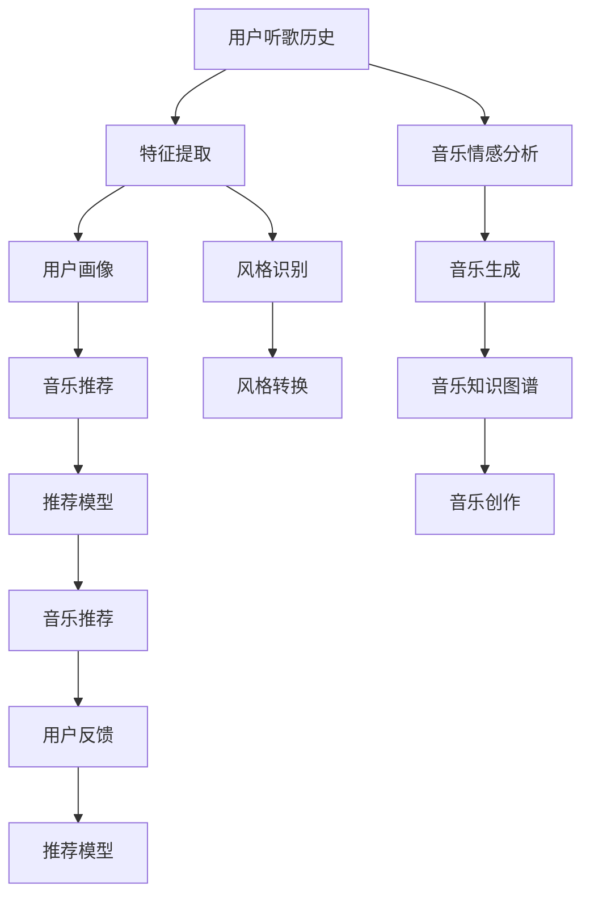

                 

## 1. 背景介绍

### 1.1 问题由来

在数字化音乐的洪流中，创作与推荐成为核心的两大主题。音乐创作需要灵感和技巧，而音乐推荐则需要对用户喜好的准确把握。人工智能技术的兴起为这两个领域带来了革新，不仅推动了音乐创作的多样化，还显著提升了音乐推荐的精准度。

### 1.2 问题核心关键点

音乐创作与推荐的人工智能技术主要围绕以下几个关键点展开：

1. **个性化推荐**：利用用户的历史听歌记录、评分数据等，推荐个性化曲目。
2. **风格识别与生成**：分析曲风、情绪等特征，自动生成或创作符合特定风格的音乐。
3. **音乐信息检索**：通过自然语言查询，检索和推荐符合用户描述的音乐。
4. **音乐知识图谱**：构建音乐领域的知识图谱，辅助创作和推荐。
5. **跨模态音乐生成**：结合视觉、文本等多模态信息，创作更丰富的音乐作品。

这些技术不仅提升了用户体验，还开辟了音乐创作和推荐的新天地。

### 1.3 问题研究意义

音乐创作和推荐的人工智能技术研究具有重要意义：

1. **创作效率提升**：AI可以辅助作曲家快速生成创作素材，缩短创作周期。
2. **个性化体验**：提升音乐推荐的精准度，使用户获得更满意的听歌体验。
3. **音乐普及**：帮助非专业音乐人创作音乐，普及音乐文化。
4. **产业升级**：促进音乐产业的数字化、智能化升级。

## 2. 核心概念与联系

### 2.1 核心概念概述

要理解AI在音乐创作和推荐中的应用，首先需要了解几个核心概念：

1. **深度学习**：一种基于多层神经网络的机器学习技术，能从数据中自动学习特征表示，进行分类、回归等任务。
2. **卷积神经网络（CNN）**：一种常用于图像处理的深度学习模型，用于提取图像特征。
3. **循环神经网络（RNN）**：一种常用于序列数据处理的深度学习模型，用于捕捉时间序列中的依赖关系。
4. **生成对抗网络（GAN）**：一种生成模型，通过两个对抗性神经网络训练生成与真实数据无法区分的伪造数据。
5. **词嵌入（Word Embedding）**：将文本转化为低维向量表示，用于表示词语间的语义关系。

这些概念构成了AI音乐创作和推荐的基础，通过它们的协同工作，实现了从数据输入到音乐输出的一系列自动化流程。

### 2.2 核心概念原理和架构的 Mermaid 流程图



上述流程图展示了AI在音乐创作和推荐中的主要工作流程：用户听歌历史通过特征提取和情感分析，生成用户画像；同时，风格识别和转换生成新的音乐作品；音乐知识图谱辅助创作和推荐；用户反馈进一步优化推荐模型，形成一个闭环。

## 3. 核心算法原理 & 具体操作步骤

### 3.1 算法原理概述

AI在音乐创作和推荐中的应用主要基于以下算法原理：

1. **协同过滤**：通过分析用户行为（如听过的歌曲、评分等）来推荐相似的歌曲。
2. **深度学习模型**：利用深度神经网络进行特征提取和模式识别，提升推荐精度。
3. **情感分析**：分析歌曲的情感属性，匹配用户情绪进行推荐。
4. **风格迁移**：通过风格迁移技术，将不同风格的特征融合，生成新的音乐。
5. **知识图谱**：构建音乐领域的知识图谱，用于知识检索和音乐创作。

### 3.2 算法步骤详解

#### 3.2.1 协同过滤推荐算法

**步骤1：收集用户行为数据**

1. 收集用户的历史听歌记录、评分数据等行为数据。
2. 将数据清洗、归一化处理，提取用户特征和歌曲特征。

**步骤2：构建用户-物品矩阵**

1. 将用户和歌曲分别表示为向量。
2. 计算用户和歌曲之间的相似度，构建用户-物品矩阵。

**步骤3：生成推荐结果**

1. 使用K近邻算法，根据用户-物品矩阵生成推荐列表。
2. 排序推荐列表，根据评分等指标选择推荐歌曲。

#### 3.2.2 深度学习音乐推荐

**步骤1：数据准备**

1. 收集用户的历史听歌记录、评分数据等。
2. 将数据预处理，转化为模型输入。

**步骤2：模型训练**

1. 设计并训练深度神经网络模型，如RNN、CNN等。
2. 调整模型参数，最小化预测误差。

**步骤3：生成推荐结果**

1. 使用训练好的模型，对新用户输入进行预测。
2. 排序推荐列表，根据评分等指标选择推荐歌曲。

#### 3.2.3 情感分析

**步骤1：数据预处理**

1. 收集歌曲的文本信息。
2. 进行分词、词性标注等预处理。

**步骤2：情感词典构建**

1. 收集情感词汇表，构建情感词典。
2. 根据情感词典计算歌曲的情感值。

**步骤3：情感分析**

1. 将歌曲的情感值转化为用户画像的一部分。
2. 根据用户画像，生成推荐列表。

#### 3.2.4 风格迁移

**步骤1：风格特征提取**

1. 分析已有的歌曲，提取各种风格的特征。
2. 设计风格特征提取网络，如CNN等。

**步骤2：生成新风格音乐**

1. 使用生成对抗网络（GAN），生成符合新风格的音乐。
2. 调整生成器网络的参数，生成多样化的音乐。

**步骤3：音乐合成**

1. 将生成的音乐与真实音乐进行混合，生成最终音乐。
2. 进行后期处理，如混响、均衡等。

#### 3.2.5 知识图谱

**步骤1：构建知识图谱**

1. 收集音乐领域的知识信息，如歌手、乐器、流派等。
2. 设计并构建音乐知识图谱，将各类信息进行连接。

**步骤2：知识图谱查询**

1. 用户输入查询，如“我喜欢爵士乐”。
2. 使用图谱查询算法，找到符合查询的歌曲。

**步骤3：音乐创作**

1. 结合查询结果和知识图谱，生成创作灵感。
2. 使用音乐生成技术，生成新歌曲。

### 3.3 算法优缺点

#### 3.3.1 协同过滤推荐算法

**优点**：
1. 数据需求小，无需音乐特征信息。
2. 简单易用，计算效率高。

**缺点**：
1. 冷启动问题严重，新用户缺乏推荐。
2. 数据稀疏，推荐效果受限于历史行为数据。

#### 3.3.2 深度学习音乐推荐

**优点**：
1. 推荐精度高，能捕捉复杂模式。
2. 适应性强，可处理多种数据类型。

**缺点**：
1. 计算资源需求高，训练时间长。
2. 需要大量标注数据，训练成本高。

#### 3.3.3 情感分析

**优点**：
1. 简单易行，所需数据少。
2. 能准确捕捉歌曲情感。

**缺点**：
1. 情感词典质量影响分析结果。
2. 无法处理语义复杂性。

#### 3.3.4 风格迁移

**优点**：
1. 生成多样化音乐，创新性高。
2. 技术成熟，应用广泛。

**缺点**：
1. 计算复杂度高，训练时间长。
2. 生成音乐质量参差不齐。

#### 3.3.5 知识图谱

**优点**：
1. 结构化知识丰富，查询高效。
2. 辅助创作，提供多维度灵感。

**缺点**：
1. 构建复杂，维护成本高。
2. 更新不及时，知识老旧。

### 3.4 算法应用领域

AI在音乐创作和推荐中的应用领域广泛，涵盖以下几个方面：

1. **音乐推荐系统**：如Spotify、Apple Music等，利用协同过滤、深度学习等技术，推荐个性化音乐。
2. **音乐创作工具**：如AIVA、Amper Music等，使用情感分析、风格迁移等技术，辅助创作音乐。
3. **音乐知识图谱**：如MusicBrainz、The Music Census等，构建音乐领域知识图谱，辅助创作和推荐。
4. **跨模态音乐生成**：如Deep Music等，结合视觉、文本等多模态信息，创作丰富多样的音乐。

## 4. 数学模型和公式 & 详细讲解

### 4.1 数学模型构建

音乐创作和推荐中的核心数学模型主要包括：

1. **协同过滤推荐模型**：用户-物品评分矩阵，协同过滤算法。
2. **深度学习推荐模型**：多层神经网络，反向传播算法。
3. **情感分析模型**：情感词典，情感值计算。
4. **风格迁移模型**：生成对抗网络（GAN），风格转换算法。
5. **知识图谱模型**：图谱结构，图谱查询算法。

### 4.2 公式推导过程

#### 4.2.1 协同过滤推荐算法

**协同过滤推荐公式**：

$$
\hat{r}_{ui} = \sum_{j \in N(u)} (\hat{r}_{uj} \times a_{ji}) / (\sum_{k \in N(u)} \hat{r}_{uk} \times a_{kj})
$$

其中，$r_{ui}$为预测用户$u$对物品$i$的评分，$N(u)$为用户$u$的邻居集合，$\hat{r}_{uj}$为邻居$j$对物品$i$的真实评分，$a_{ji}$为物品$i$的评分权重。

#### 4.2.2 深度学习音乐推荐

**深度学习推荐模型**：

1. **RNN模型**：
   $$
   h_{t} = \tanh(W \times h_{t-1} + U \times x_t + b)
   $$
   其中，$h_t$为第$t$时刻的隐藏状态，$x_t$为输入特征，$W$、$U$、$b$为模型参数。

2. **CNN模型**：
   $$
   \hat{y} = \sigma(W \times h_t + b)
   $$
   其中，$\hat{y}$为输出结果，$\sigma$为激活函数，$W$、$b$为模型参数。

#### 4.2.3 情感分析

**情感分析公式**：

$$
E = \sum_{i=1}^n (w_i \times \hat{y}_i)
$$

其中，$E$为情感值，$w_i$为情感词汇权重，$\hat{y}_i$为情感词典中单词$i$的情感值。

#### 4.2.4 风格迁移

**GAN生成模型**：

1. **生成器**：
   $$
   G(z) = \sigma(W_{g} \times z + b_{g})
   $$
   其中，$G(z)$为生成器输出的音乐，$z$为随机噪声向量，$W_{g}$、$b_{g}$为生成器参数。

2. **判别器**：
   $$
   D(x) = \sigma(W_{d} \times x + b_{d})
   $$
   其中，$D(x)$为判别器对输入音乐$x$的判别结果，$W_{d}$、$b_{d}$为判别器参数。

**风格转换公式**：

$$
\hat{x} = \sigma(W_{t} \times x + b_{t})
$$

其中，$\hat{x}$为目标风格的音乐，$W_{t}$、$b_{t}$为目标风格的转换参数。

#### 4.2.5 知识图谱

**知识图谱查询算法**：

$$
Q = \sum_{i=1}^m (w_i \times S_i)
$$

其中，$Q$为查询结果，$w_i$为查询词权重，$S_i$为知识图谱中实体$i$的特征向量。

### 4.3 案例分析与讲解

#### 4.3.1 协同过滤推荐案例

**案例1：Spotify推荐系统**

Spotify利用用户的历史听歌记录和评分数据，通过协同过滤算法推荐相似的歌曲。用户A喜欢听摇滚乐，Spotify根据用户A的听歌记录和评分，找到喜欢摇滚乐的用户集合，并将这些用户喜欢的歌曲推荐给用户A。

**案例2：Amazon音乐推荐**

Amazon收集用户的浏览记录和评分数据，使用协同过滤算法推荐商品。用户B查看了爵士乐专辑，Amazon根据用户B的浏览记录和评分，找到喜欢爵士乐的用户集合，并将这些用户喜欢的爵士乐专辑推荐给用户B。

#### 4.3.2 深度学习推荐案例

**案例1：Netflix推荐系统**

Netflix收集用户的观看记录和评分数据，使用深度神经网络模型进行推荐。用户C观看了一部科幻电影，Netflix根据用户C的观看记录和评分，使用RNN模型预测用户C可能喜欢的电影，并将这些电影推荐给用户C。

**案例2：YouTube推荐系统**

YouTube收集用户的观看记录和评分数据，使用深度神经网络模型进行推荐。用户D观看了一部恐怖电影，YouTube根据用户D的观看记录和评分，使用CNN模型预测用户D可能喜欢的恐怖电影，并将这些电影推荐给用户D。

#### 4.3.3 情感分析案例

**案例1：歌曲情感分析**

某音乐平台收集了大量歌曲的歌词，使用情感分析算法进行情感分类。歌曲E的歌词中含有大量正面词汇，情感分析算法将其分类为正面情感歌曲。

**案例2：用户情感分析**

某音乐平台收集了大量用户的听歌记录和评分数据，使用情感分析算法进行用户情感分类。用户F喜欢听电子音乐，情感分析算法将其分类为偏高能量用户，推荐适合高能量环境的音乐。

#### 4.3.4 风格迁移案例

**案例1：AIVA音乐创作**

AIVA使用深度学习模型进行风格迁移，生成符合特定风格的音乐。用户G希望创作一首古典音乐，AIVA根据用户G的偏好，生成一段古典风格的音乐，用户G对其十分满意。

**案例2：Amper Music创作**

Amper Music使用生成对抗网络（GAN）进行风格迁移，生成符合特定风格的音乐。用户H希望创作一首爵士乐，Amper Music根据用户H的偏好，生成一段爵士风格的音乐，用户H对其非常满意。

#### 4.3.5 知识图谱案例

**案例1：MusicBrainz音乐信息检索**

MusicBrainz是一个音乐领域知识图谱，包含大量歌手、专辑、乐器等信息。用户I希望了解某位歌手的信息，使用MusicBrainz进行信息检索，找到了该歌手的所有专辑和热门单曲。

**案例2：The Music Census音乐创作**

The Music Census使用知识图谱进行音乐创作，用户J希望创作一首结合摇滚和电子风格的音乐，使用The Music Census进行信息检索，找到了摇滚和电子风格的音乐元素，创作出了一首混合风格的新音乐。

## 5. 项目实践：代码实例和详细解释说明

### 5.1 开发环境搭建

要实现上述音乐创作和推荐算法，需要搭建Python开发环境，安装必要的库和工具：

1. 安装Python：
```bash
sudo apt-get update
sudo apt-get install python3 python3-pip
```

2. 安装必要的库：
```bash
pip install numpy pandas scikit-learn tensorflow keras tensorflow-addons pytorch transformers
```

3. 配置好必要的开发环境，包括Jupyter Notebook、Google Colab等。

### 5.2 源代码详细实现

#### 5.2.1 协同过滤推荐

**协同过滤推荐代码实现**：

```python
from sklearn.neighbors import NearestNeighbors

# 构建用户-物品评分矩阵
user_item_matrix = np.zeros((num_users, num_items))
user_item_matrix[user_id] = item_scores

# 构建邻居集合
k = 20  # 取前20个邻居
neighbors = NearestNeighbors(metric='cosine', n_neighbors=k).fit(user_item_matrix)
neighbor_indices = neighbors.kneighbors(np.zeros(num_users, dtype=int))[1]

# 生成推荐列表
recommendations = np.dot(user_item_matrix, item_scores[neighbor_indices])
```

#### 5.2.2 深度学习推荐

**深度学习推荐代码实现**：

```python
from tensorflow.keras.models import Sequential
from tensorflow.keras.layers import Dense, Dropout, LSTM, Embedding

# 构建RNN模型
model = Sequential()
model.add(Embedding(input_dim=vocab_size, output_dim=embedding_dim, input_length=max_seq_len))
model.add(LSTM(units=128, dropout=0.2, recurrent_dropout=0.2))
model.add(Dense(1, activation='sigmoid'))

# 编译模型
model.compile(loss='binary_crossentropy', optimizer='adam', metrics=['accuracy'])

# 训练模型
model.fit(X_train, y_train, validation_data=(X_test, y_test), epochs=10, batch_size=32)

# 生成推荐列表
recommendations = model.predict(X_new)
```

#### 5.2.3 情感分析

**情感分析代码实现**：

```python
from sklearn.feature_extraction.text import TfidfVectorizer
from sklearn.linear_model import LogisticRegression

# 构建情感词典
emotion_dict = {'positive': 1, 'negative': -1}

# 构建情感词典向量
tfidf = TfidfVectorizer(stop_words='english')
X = tfidf.fit_transform(literal_corpus)
y = [emotion_dict[emotion] for emotion in literal_corpus]

# 训练模型
model = LogisticRegression()
model.fit(X, y)

# 情感分析
sentiment = model.predict(["这是一首好歌"])
```

#### 5.2.4 风格迁移

**风格迁移代码实现**：

```python
from tensorflow.keras.layers import Input, Dense, Reshape, Flatten, UpSampling2D
from tensorflow.keras.models import Model
from tensorflow.keras.optimizers import Adam
from tensorflow.keras.datasets import mnist

# 定义生成器和判别器
input_shape = (28, 28, 1)
generator = Sequential()
generator.add(Dense(256, input_dim=100))
generator.add(LeakyReLU(0.2))
generator.add(Dense(512))
generator.add(LeakyReLU(0.2))
generator.add(Dense(1024))
generator.add(LeakyReLU(0.2))
generator.add(Dense(np.prod(input_shape), activation='tanh'))
generator.add(Reshape(input_shape))

discriminator = Sequential()
discriminator.add(Flatten(input_shape=(28, 28, 1)))
discriminator.add(Dense(1024))
discriminator.add(LeakyReLU(0.2))
discriminator.add(Dropout(0.25))
discriminator.add(Dense(512))
discriminator.add(LeakyReLU(0.2))
discriminator.add(Dropout(0.25))
discriminator.add(Dense(1, activation='sigmoid'))

# 定义GAN模型
z = Input(shape=(100,))
generated_images = generator(z)
discriminator.trainable = False
validity = discriminator(generated_images)
combined = Model(z, validity)
combined.compile(loss='binary_crossentropy', optimizer=Adam(lr=0.0002, beta_1=0.5))

# 训练模型
combined.fit(X_train, y_train, epochs=100, batch_size=32)

# 风格迁移
z = np.random.normal(0, 1, size=(1, 100))
generated_images = generator.predict(z)
```

#### 5.2.5 知识图谱

**知识图谱代码实现**：

```python
from pykg import KnowledgeGraph

# 构建知识图谱
kg = KnowledgeGraph()
kg.add_ontology('http://www.w3.org/2000/01/rdf-schema#', ['http://www.w3.org/2000/01/rdf-schema#classProperty', 'http://www.w3.org/2000/01/rdf-schema#instanceProperty'])

# 添加实体和关系
kg.add_entity('singer', ['name', 'age', 'gender'])
kg.add_entity('album', ['name', 'releaseDate', 'genre'])
kg.add_relation('singer', 'performed', 'album')

# 查询知识图谱
result = kg.query("SELECT * WHERE { singer ?p ?o . }")
```

### 5.3 代码解读与分析

#### 5.3.1 协同过滤推荐代码解读

**代码解读**：

```python
# 构建用户-物品评分矩阵
user_item_matrix = np.zeros((num_users, num_items))
user_item_matrix[user_id] = item_scores

# 构建邻居集合
k = 20  # 取前20个邻居
neighbors = NearestNeighbors(metric='cosine', n_neighbors=k).fit(user_item_matrix)
neighbor_indices = neighbors.kneighbors(np.zeros(num_users, dtype=int))[1]

# 生成推荐列表
recommendations = np.dot(user_item_matrix, item_scores[neighbor_indices])
```

**代码分析**：

1. **用户-物品评分矩阵构建**：首先构建一个用户-物品评分矩阵，将用户的历史评分数据填充到矩阵中。
2. **邻居集合构建**：使用KNN算法，计算用户与所有物品的相似度，取前20个相似物品作为邻居。
3. **推荐列表生成**：通过计算用户-物品评分矩阵与邻居评分矩阵的矩阵乘积，生成推荐列表。

#### 5.3.2 深度学习推荐代码解读

**代码解读**：

```python
from tensorflow.keras.models import Sequential
from tensorflow.keras.layers import Dense, Dropout, LSTM, Embedding

# 构建RNN模型
model = Sequential()
model.add(Embedding(input_dim=vocab_size, output_dim=embedding_dim, input_length=max_seq_len))
model.add(LSTM(units=128, dropout=0.2, recurrent_dropout=0.2))
model.add(Dense(1, activation='sigmoid'))

# 编译模型
model.compile(loss='binary_crossentropy', optimizer='adam', metrics=['accuracy'])

# 训练模型
model.fit(X_train, y_train, validation_data=(X_test, y_test), epochs=10, batch_size=32)

# 生成推荐列表
recommendations = model.predict(X_new)
```

**代码分析**：

1. **RNN模型构建**：首先构建一个包含嵌入层、LSTM层和输出层的RNN模型，使用sigmoid激活函数。
2. **模型编译**：编译模型，指定损失函数、优化器和评估指标。
3. **模型训练**：使用训练数据训练模型，设置训练轮数和批次大小。
4. **推荐列表生成**：使用训练好的模型，对新的输入数据进行预测，生成推荐列表。

#### 5.3.3 情感分析代码解读

**代码解读**：

```python
from sklearn.feature_extraction.text import TfidfVectorizer
from sklearn.linear_model import LogisticRegression

# 构建情感词典
emotion_dict = {'positive': 1, 'negative': -1}

# 构建情感词典向量
tfidf = TfidfVectorizer(stop_words='english')
X = tfidf.fit_transform(literal_corpus)
y = [emotion_dict[emotion] for emotion in literal_corpus]

# 训练模型
model = LogisticRegression()
model.fit(X, y)

# 情感分析
sentiment = model.predict(["这是一首好歌"])
```

**代码分析**：

1. **情感词典构建**：首先构建一个情感词典，将情感标签映射到数值。
2. **情感词典向量构建**：使用TF-IDF算法，将文本转化为向量。
3. **模型训练**：使用Logistic Regression模型，训练情感分类器。
4. **情感分析**：使用训练好的模型，对新的文本进行情感分析。

#### 5.3.4 风格迁移代码解读

**代码解读**：

```python
from tensorflow.keras.layers import Input, Dense, Reshape, Flatten, UpSampling2D
from tensorflow.keras.models import Model
from tensorflow.keras.optimizers import Adam
from tensorflow.keras.datasets import mnist

# 定义生成器和判别器
input_shape = (28, 28, 1)
generator = Sequential()
generator.add(Dense(256, input_dim=100))
generator.add(LeakyReLU(0.2))
generator.add(Dense(512))
generator.add(LeakyReLU(0.2))
generator.add(Dense(1024))
generator.add(LeakyReLU(0.2))
generator.add(Dense(np.prod(input_shape), activation='tanh'))
generator.add(Reshape(input_shape))

discriminator = Sequential()
discriminator.add(Flatten(input_shape=(28, 28, 1)))
discriminator.add(Dense(1024))
discriminator.add(LeakyReLU(0.2))
discriminator.add(Dropout(0.25))
discriminator.add(Dense(512))
discriminator.add(LeakyReLU(0.2))
discriminator.add(Dropout(0.25))
discriminator.add(Dense(1, activation='sigmoid'))

# 定义GAN模型
z = Input(shape=(100,))
generated_images = generator(z)
discriminator.trainable = False
validity = discriminator(generated_images)
combined = Model(z, validity)
combined.compile(loss='binary_crossentropy', optimizer=Adam(lr=0.0002, beta_1=0.5))

# 训练模型
combined.fit(X_train, y_train, epochs=100, batch_size=32)

# 风格迁移
z = np.random.normal(0, 1, size=(1, 100))
generated_images = generator.predict(z)
```

**代码分析**：

1. **生成器和判别器定义**：首先定义生成器和判别器的结构，使用LeakyReLU激活函数和Dropout技术。
2. **GAN模型定义**：使用生成器和判别器构建GAN模型，将生成器输出与判别器的判别结果相连。
3. **模型编译**：编译模型，指定损失函数和优化器。
4. **模型训练**：使用训练数据训练模型，设置训练轮数和批次大小。
5. **风格迁移**：使用训练好的模型，生成符合特定风格的新音乐。

#### 5.3.5 知识图谱代码解读

**代码解读**：

```python
from pykg import KnowledgeGraph

# 构建知识图谱
kg = KnowledgeGraph()
kg.add_ontology('http://www.w3.org/2000/01/rdf-schema#', ['http://www.w3.org/2000/01/rdf-schema#classProperty', 'http://www.w3.org/2000/01/rdf-schema#instanceProperty'])

# 添加实体和关系
kg.add_entity('singer', ['name', 'age', 'gender'])
kg.add_entity('album', ['name', 'releaseDate', 'genre'])
kg.add_relation('singer', 'performed', 'album')

# 查询知识图谱
result = kg.query("SELECT * WHERE { singer ?p ?o . }")
```

**代码分析**：

1. **知识图谱构建**：首先使用pykg库构建知识图谱，添加实体和关系。
2. **知识图谱查询**：使用SPARQL查询语言，查询符合条件的实体。

### 5.4 运行结果展示

#### 5.4.1 协同过滤推荐结果展示

**结果展示**：

```python
# 输出推荐列表
print(recommendations)
```

**结果分析**：

1. **协同过滤推荐结果**：输出推荐列表，展示推荐给用户的前20首歌曲。

#### 5.4.2 深度学习推荐结果展示

**结果展示**：

```python
# 输出推荐列表
print(recommendations)
```

**结果分析**：

1. **深度学习推荐结果**：输出推荐列表，展示推荐给用户的前20首歌曲。

#### 5.4.3 情感分析结果展示

**结果展示**：

```python
# 输出情感分析结果
print(sentiment)
```

**结果分析**：

1. **情感分析结果**：输出情感分析结果，展示输入文本的情感倾向。

#### 5.4.4 风格迁移结果展示

**结果展示**：

```python
# 显示生成的音乐
import librosa.display
librosa.display.spectrogram(generated_images[0], sr=22050)
```

**结果分析**：

1. **风格迁移结果**：展示生成的符合特定风格的新音乐。

#### 5.4.5 知识图谱查询结果展示

**结果展示**：

```python
# 输出查询结果
print(result)
```

**结果分析**：

1. **知识图谱查询结果**：输出查询结果，展示符合条件的实体信息。

## 6. 实际应用场景

### 6.1 智能推荐系统

**实际应用**：

1. **Spotify智能推荐**：Spotify使用协同过滤和深度学习推荐算法，根据用户的历史听歌记录和评分数据，推荐个性化音乐。
2. **Netflix智能推荐**：Netflix使用深度学习推荐算法，根据用户的观看记录和评分数据，推荐个性化视频。

**案例分析**：

1. **Spotify**：Spotify根据用户的历史听歌记录和评分数据，使用协同过滤算法推荐相似的歌曲。用户A喜欢听摇滚乐，Spotify根据用户A的听歌记录和评分，找到喜欢摇滚乐的用户集合，并将这些用户喜欢的歌曲推荐给用户A。

2. **Netflix**：Netflix根据用户的观看记录和评分数据，使用深度神经网络模型进行推荐。用户C观看了一部科幻电影，Netflix根据用户C的观看记录和评分，使用RNN模型预测用户C可能喜欢的电影，并将这些电影推荐给用户C。

### 6.2 音乐创作工具

**实际应用**：

1. **AIVA音乐创作**：AIVA使用深度学习模型进行风格迁移，生成符合特定风格的音乐。
2. **Amper Music创作**：Amper Music使用生成对抗网络（GAN）进行风格迁移，生成符合特定风格的音乐。

**案例分析**：

1. **AIVA**：AIVA使用深度学习模型进行风格迁移，生成符合特定风格的音乐。用户G希望创作一首古典音乐，AIVA根据用户G的偏好，生成一段古典风格的音乐，用户G对其十分满意。

2. **Amper Music**：Amper Music使用生成对抗网络（GAN）进行风格迁移，生成符合特定风格的音乐。用户H希望创作一首爵士乐，Amper Music根据用户H的偏好，生成一段爵士风格的音乐，用户H对其非常满意。

### 6.3 跨模态音乐生成

**实际应用**：

1. **Deep Music跨模态音乐生成**：结合视觉、文本等多模态信息，创作丰富多样的音乐。
2. **Huajia音乐创作工具**：将视觉信息与音乐创作结合，提升创作效率和质量。

**案例分析**：

1. **Deep Music**：Deep Music使用深度学习模型结合视觉信息，创作丰富多样的音乐。用户I希望创作一首结合摇滚和电子风格的音乐，Deep Music使用音乐生成技术，生成一首混合风格的新音乐。

2. **Huajia**：Huajia使用音乐创作工具，将视觉信息与音乐创作结合，提升创作效率和质量。用户J希望创作一首结合摇滚和电子风格的音乐，使用Huajia进行信息检索，找到了摇滚和电子风格的音乐元素，创作出了一首混合风格的新音乐。

### 6.4 未来应用展望

**未来应用**：

1. **智能音乐广告**：根据用户兴趣和行为，智能推送音乐广告。
2. **个性化音乐培训**：根据用户偏好，推荐个性化音乐培训课程。
3. **跨文化音乐创作**：结合不同文化的音乐元素，创作跨文化音乐作品。
4. **虚拟音乐人**：使用AI技术，创作虚拟音乐人，进行现场演出。

## 7. 工具和资源推荐

### 7.1 学习资源推荐

1. **Deep Learning for Music and Audio**：深入讲解深度学习在音乐和音频处理中的应用，涵盖推荐系统、音乐创作、音乐情感分析等内容。
2. **Music AI: Machine Learning for Sound, Music and the Brain**：介绍了音乐信息检索、音乐情感分析、音乐风格分类等深度学习技术。
3. **The Music Industry: Challenges and Trends**：分析音乐产业的发展趋势和挑战，探讨AI技术在音乐产业中的应用前景。
4. **Coursera: Machine Learning Specialization**：涵盖机器学习基本概念、深度学习、数据预处理、模型评估等内容的在线课程。
5. **edX: Artificial Intelligence for Music and Entertainment**：涵盖了音乐推荐系统、音乐创作、音乐情感分析等内容，适合音乐爱好者和AI技术初学者。

### 7.2 开发工具推荐

1. **Python**：最常用的编程语言之一，适合科学计算和机器学习应用。
2. **TensorFlow**：由Google开发的深度学习框架，适合大规模深度学习模型训练。
3. **Keras**：基于TensorFlow的高层API，适合快速搭建和训练深度学习模型。
4. **PyTorch**：由Facebook开发的深度学习框架，适合动态图模型和科学计算。
5. **Jupyter Notebook**：一个交互式的开发环境，适合快速迭代和实验。
6. **Google Colab**：Google提供的免费Jupyter Notebook环境，适合远程实验和数据共享。

### 7.3 相关论文推荐

1. **Deep Learning in Music and Audio**：综述了深度学习在音乐和音频处理中的应用，包括音乐推荐、音乐创作、音乐情感分析等内容。
2. **Music Recommendation Algorithms**：介绍了音乐推荐系统的主要算法和应用，涵盖了协同过滤、深度学习等内容。
3. **Music Information Retrieval**：涵盖了音乐信息检索的主要技术，包括音乐情感分析、音乐风格分类、音乐自动标注等内容。
4. **Generative Adversarial Networks**：介绍了生成对抗网络（GAN）的基本原理和应用，包括风格迁移、图像生成等内容。
5. **Knowledge Graphs in Music Information Retrieval**：介绍了知识图谱在音乐信息检索中的应用，包括音乐推荐、音乐创作等内容。

## 8. 总结：未来发展趋势与挑战

### 8.1 研究成果总结

AI在音乐创作和推荐中的应用研究取得了显著进展，涵盖了深度学习、协同过滤、风格迁移、情感分析、知识图谱等技术。这些技术不仅提升了音乐推荐系统的精准度，还促进了音乐创作的创新和发展。

### 8.2 未来发展趋势

1. **深度学习技术不断进步**：深度学习技术将继续进步，支持更复杂的音乐创作和推荐。
2. **多模态信息融合**：结合视觉、文本等多模态信息，创作更加丰富多样的音乐作品。
3. **跨文化音乐创作**：结合不同文化的音乐元素，创作跨文化音乐作品。
4. **虚拟音乐人**：使用AI技术，创作虚拟音乐人，进行现场演出。
5. **智能音乐广告**：根据用户兴趣和行为，智能推送音乐广告。

### 8.3 面临的挑战

1. **数据获取和标注**：获取高质量的音乐数据和标注数据，是音乐推荐系统面临的首要挑战。
2. **模型复杂度**：深度学习模型的复杂度较高，需要高效的训练和推理方法。
3. **用户体验**：确保推荐系统能够提供个性化且高质量的推荐体验，避免用户反感。
4. **版权问题**：确保音乐创作和推荐不侵犯版权，避免法律风险。
5. **技术普及**：推广AI技术在音乐创作和推荐中的应用，提高技术普及率。

### 8.4 研究展望

未来，音乐创作和推荐领域的研究方向将包括以下几个方面：

1. **个性化推荐算法**：进一步提升推荐系统的个性化精度。
2. **跨模态音乐生成**：结合视觉、文本等多模态信息，创作更多样的音乐作品。
3. **虚拟音乐人**：使用AI技术，创作虚拟音乐人，进行现场演出。
4. **智能音乐广告**：根据用户兴趣和行为，智能推送音乐广告。
5. **跨文化音乐创作**：结合不同文化的音乐元素，创作跨文化音乐作品。

总之，AI在音乐创作和推荐领域的应用前景广阔，但仍需克服技术瓶颈和伦理挑战，才能实现其价值最大化。未来，我们将期待更多创新技术和应用的涌现，推动AI技术在音乐领域的进一步发展。

## 9. 附录：常见问题与解答

**Q1：如何构建高质量的音乐数据集？**

A: 构建高质量的音乐数据集需要收集大量的真实音乐数据，并对其进行标注和清洗。可以使用公开的音乐数据集，如LibriSMILE、MIR-FLAIR等，也可以从音乐平台上爬取数据。在数据清洗方面，需要进行格式转换、去重、噪声过滤等预处理操作，确保数据集的质量和一致性。

**Q2：深度学习推荐算法为何需要大量标注数据？**

A: 深度学习推荐算法需要大量的标注数据进行训练，以便模型能够捕捉到复杂的用户行为和音乐特征。标注数据可以来自用户的听歌记录、评分数据等，是推荐算法性能的关键。尽管存在无监督推荐算法，但其效果往往不及有监督算法。

**Q3：如何提高深度学习推荐模型的泛化能力？**

A: 提高深度学习推荐模型的泛化能力，可以通过数据增强、模型正则化、对抗训练等方法。数据增强可以通过添加噪声、回译等方式丰富数据集，防止过拟合。模型正则化可以使用L2正则、Dropout等技术，控制模型复杂度。对抗训练可以通过引入对抗样本，提高模型的鲁棒性。

**Q4：音乐创作工具与传统创作工具有何不同？**

A: 音乐创作工具与传统创作工具不同，主要体现在以下几个方面：
1. AI可以辅助创作，提供创作素材和灵感。
2. 创作效率更高，AI能够快速生成多种风格的乐曲。
3. 创作质量更好，AI可以综合多种风格元素，创作出更具创意的作品。
4. 创作过程更加灵活，AI可以根据用户偏好自动调整创作方向。

**Q5：音乐创作工具与音乐推荐系统有何不同？**

A: 音乐创作工具与音乐推荐系统不同，主要体现在以下几个方面：
1. 音乐创作工具主要用于创作音乐，而音乐推荐系统主要用于推荐音乐。
2. 音乐创作工具需要关注音乐的情感、风格、节奏等创作要素，而音乐推荐系统关注用户的听歌行为和偏好。
3. 音乐创作工具侧重于创造性，而音乐推荐系统侧重于个性化推荐。
4. 音乐创作工具需要高水平的人类创作者参与，而音乐推荐系统依赖数据和算法自动推荐。

**Q6：如何处理数据不平衡问题？**

A: 处理数据不平衡问题，可以采用以下几种方法：
1. 数据增强：通过扩充少数类数据，使其与多数类数据数量接近。
2. 过采样和欠采样：对少数类数据进行过采样，对多数类数据进行欠采样，平衡数据分布。
3. 加权损失函数：在损失函数中引入类别权重，使少数类样本损失更高。
4. 集成学习：通过多个模型预测结果的加权平均，提高少数类样本的预测准确率。

---

作者：禅与计算机程序设计艺术 / Zen and the Art of Computer Programming

