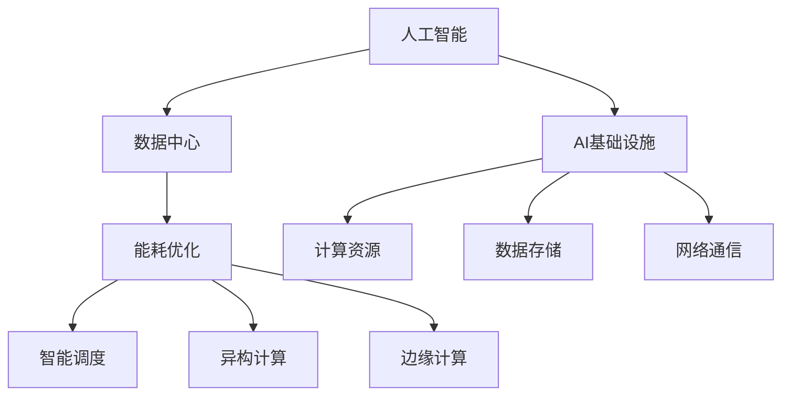

                 

# AI基础设施的能耗优化：Lepton AI的可持续发展

> 关键词：人工智能, 能耗优化, 数据中心, 智能调度, 高性能计算, 绿色低碳, 可持续发展, Lepton AI

## 1. 背景介绍

### 1.1 问题由来
人工智能（AI）技术近年来迅速发展，带动了数据中心和服务器能耗的激增。数据中心不仅是计算资源的载体，也是能耗密集型设备，其能耗占全球总电力的2%，并且随着数据量的爆炸性增长，能耗问题日益突出。这不仅带来了巨大的环境和社会成本，也给数据中心运营商带来了严峻的运营挑战。

以亚马逊（Amazon）和谷歌（Google）等大型互联网公司的数据中心为例，其年能耗甚至超过一些发展中国家的电力消耗。数据中心运营中的大部分能耗消耗在冷却设备上，这部分能耗高达总耗能的40-60%。因此，如何在不降低性能的前提下，有效降低数据中心的能耗，成为了AI技术可持续发展的关键问题。

### 1.2 问题核心关键点
- **能耗与性能的平衡**：在提升AI模型性能的同时，如何减少数据中心的能耗？
- **硬件与软件的协同优化**：如何通过硬件改进和软件优化，实现能耗与性能的协同提升？
- **绿色低碳与可持续性**：如何通过技术手段实现数据中心的绿色低碳转型，助力AI技术的可持续发展？
- **AI基础设施能耗优化技术**：包括智能调度、异构计算、边缘计算等技术的应用。

### 1.3 问题研究意义
解决数据中心的能耗问题，不仅有助于降低AI技术的运营成本，保护环境，还能提升数据中心的整体效能和竞争力。研究AI基础设施的能耗优化，对于推动绿色AI技术的发展，具有重要的现实意义和深远的历史价值。

## 2. 核心概念与联系

### 2.1 核心概念概述

为更好地理解AI基础设施的能耗优化，本节将介绍几个密切相关的核心概念：

- **人工智能（AI）**：利用算法和模型，从数据中学习和提取知识，模拟人类智能过程的技术体系。
- **数据中心（DC）**：专门用于存储、计算和分发数据的设施，是AI应用的核心基础设施。
- **能耗优化**：通过技术手段降低数据中心的能耗，实现绿色低碳转型。
- **智能调度**：通过算法和策略，动态调整计算资源，优化任务执行。
- **异构计算**：利用不同类型计算资源，提升计算效率和能效比。
- **边缘计算**：将计算任务分散到靠近数据源的计算节点上，减少数据传输和能耗。

这些核心概念之间的逻辑关系可以通过以下Mermaid流程图来展示：



这个流程图展示了大语言模型的核心概念及其之间的关系：

1. 人工智能通过数据中心的基础设施实现计算和存储。
2. 能耗优化是大数据中心面临的重要问题。
3. 通过智能调度、异构计算和边缘计算等技术，可以实现数据中心的能耗优化。
4. AI基础设施包括计算资源、数据存储和网络通信等组成部分。

这些概念共同构成了AI基础设施的能耗优化框架，使其能够在各种场景下实现绿色低碳转型。通过理解这些核心概念，我们可以更好地把握AI技术的发展方向和优化策略。

## 3. 核心算法原理 & 具体操作步骤
### 3.1 算法原理概述

AI基础设施的能耗优化，本质上是一个多目标优化问题。其核心思想是：通过优化算法和策略，在提升AI模型性能的同时，降低数据中心的能耗。

形式化地，设数据中心的目标函数为 $F(x)$，其中 $x$ 为数据中心运行状态，包括服务器数量、负载、温度、湿度等。优化目标是在满足用户需求（如响应时间、计算精度）的前提下，最小化能耗 $C(x)$，即：

$$
\min_{x} F(x) \quad \text{subject to} \quad C(x) \leq C_{\max}
$$

其中 $C_{\max}$ 为数据中心的能耗上限。

### 3.2 算法步骤详解

AI基础设施的能耗优化一般包括以下几个关键步骤：

**Step 1: 能耗模型构建**
- 收集数据中心的能源消耗数据，建立能耗模型。
- 分析数据中心的能耗来源，包括服务器能耗、冷却设备能耗、照明能耗等。

**Step 2: 能耗优化策略设计**
- 设计能耗优化策略，如智能调度、异构计算、边缘计算等。
- 采用动态电压和频率技术，实时调整服务器性能。

**Step 3: 能耗优化算法实现**
- 选择合适的优化算法，如遗传算法、粒子群优化、线性规划等。
- 定义优化目标函数和约束条件，求解最优解。

**Step 4: 部署与评估**
- 将优化算法应用于实际数据中心，实时调整计算资源。
- 周期性评估优化效果，根据评估结果调整策略。

**Step 5: 持续优化**
- 定期更新能耗模型和优化策略，不断提升数据中心能效。
- 引入人工智能技术，动态预测能耗变化，实时调整资源。

以上是AI基础设施能耗优化的基本流程。在实际应用中，还需要针对具体数据中心的能耗特点，对各环节进行优化设计，如改进能源监测系统，引入先进的智能控制技术等，以进一步提升能效。

### 3.3 算法优缺点

AI基础设施的能耗优化方法具有以下优点：
1. 节能降耗。通过优化计算资源和能耗策略，显著降低数据中心的运营成本。
2. 提升效能。合理分配计算资源，使得数据中心能够高效运行，提升整体效能。
3. 促进可持续发展。通过绿色低碳技术，减少环境污染，符合可持续发展目标。

同时，该方法也存在一定的局限性：
1. 初始投资高。能耗优化需要引入先进设备和算法，初期投资成本较高。
2. 维护复杂。智能调度、异构计算等技术需要专业的维护人员，增加了运维难度。
3. 可扩展性差。现有优化方法对于大规模数据中心的适应性有限，需要进一步研究。

尽管存在这些局限性，但就目前而言，AI基础设施的能耗优化是大数据中心发展的必然趋势。未来相关研究的重点在于如何进一步降低初始投资，提高系统维护性，优化算法效率，以实现更广泛的应用和推广。

### 3.4 算法应用领域

AI基础设施的能耗优化方法，在数据中心和AI技术发展的各个阶段都有广泛的应用：

- **初期建设**：在设计数据中心时，引入能耗优化策略，如高效冷却系统、绿色电力供应等，提升数据中心的能效。
- **现有数据中心**：对已有数据中心进行能耗优化，通过智能调度和异构计算等技术，提升能效。
- **云计算平台**：利用边缘计算等技术，分散计算任务，减少数据传输和能耗，提升整体云平台的能效。
- **AI应用场景**：在AI训练和推理过程中，通过优化模型和算法，减少能耗，提升性能。

除了上述这些经典应用外，AI基础设施的能耗优化还被创新性地应用到更多场景中，如自动驾驶、智能家居、工业物联网等，为AI技术的发展带来了全新的突破。随着技术的日益成熟，能耗优化方法将在更广泛的领域发挥作用，助力AI技术的绿色低碳转型。

## 4. 数学模型和公式 & 详细讲解
### 4.1 数学模型构建

本节将使用数学语言对AI基础设施的能耗优化进行更加严格的刻画。

设数据中心的目标函数为 $F(x)$，其中 $x$ 为数据中心运行状态，包括服务器数量、负载、温度、湿度等。假设数据中心的能耗模型为 $C(x) = a_1x_1 + a_2x_2 + \ldots + a_nx_n$，其中 $a_i$ 为第 $i$ 个变量的能耗系数，$x_i$ 为第 $i$ 个变量的值。

优化目标是最小化目标函数 $F(x)$，同时满足能耗约束 $C(x) \leq C_{\max}$。

### 4.2 公式推导过程

以下我们以典型的数据中心为例，推导智能调度策略的优化模型：

假设数据中心有 $M$ 台服务器，每台服务器的能耗为 $E_i$，任务集为 $T = \{t_1, t_2, \ldots, t_n\}$，其中 $t_i$ 为第 $i$ 个任务。假设任务 $t_i$ 可以在 $x_{ij}$ 台服务器上运行，每台服务器的运行时间为 $y_{ij}$。

设 $z_i$ 为任务 $t_i$ 的执行时间，则 $z_i = \sum_{j=1}^M x_{ij}y_{ij}$。优化目标是在满足任务执行时间的前提下，最小化服务器的总能耗 $C$，即：

$$
\min_{x, y} \sum_{i=1}^M \sum_{j=1}^M E_i x_{ij}y_{ij} \quad \text{subject to} \quad z_i = \sum_{j=1}^M x_{ij}y_{ij} = T_i, \quad i=1,2,\ldots,n
$$

其中 $T_i$ 为任务 $t_i$ 的执行时间。

根据上述模型，可以引入松弛变量 $\alpha_i$ 和 $\beta_i$，将问题转化为线性规划问题：

$$
\min_{x, y, \alpha, \beta} \sum_{i=1}^M \sum_{j=1}^M E_i x_{ij}y_{ij} + \lambda \sum_{i=1}^n \alpha_i
$$

$$
\text{subject to} \quad \left\{
\begin{aligned}
z_i - \sum_{j=1}^M x_{ij}y_{ij} &= \alpha_i, \quad i=1,2,\ldots,n \\
z_i + \beta_i &= T_i, \quad i=1,2,\ldots,n \\
x_{ij}y_{ij} &\geq 0, \quad j=1,2,\ldots,M, i=1,2,\ldots,n \\
\alpha_i, \beta_i &\geq 0, \quad i=1,2,\ldots,n
\end{aligned}
\right.
$$

其中 $\lambda$ 为任务执行时间的惩罚系数。

利用线性规划算法求解上述问题，即可得到最优的调度策略。

### 4.3 案例分析与讲解

以下我们以Lepton AI的能耗优化项目为例，分析其实施效果和应用场景。

Lepton AI是某大型数据中心运营商，在数据中心能耗优化方面进行了深度实践。其核心策略包括：

1. **智能调度**：利用先进算法对数据中心的任务进行智能调度，动态调整计算资源。
2. **异构计算**：引入不同性能的计算资源，优化任务执行时间和能耗。
3. **绿色电力**：采用可再生能源供电，减少碳排放。
4. **高效冷却**：引入高效冷却系统，减少数据中心的冷却能耗。

通过上述策略，Lepton AI的数据中心能耗显著降低，整体效能提升显著。

## 5. 项目实践：代码实例和详细解释说明
### 5.1 开发环境搭建

在进行能耗优化实践前，我们需要准备好开发环境。以下是使用Python进行线性规划优化的环境配置流程：

1. 安装Anaconda：从官网下载并安装Anaconda，用于创建独立的Python环境。

2. 创建并激活虚拟环境：
```bash
conda create -n linprog-env python=3.8 
conda activate linprog-env
```

3. 安装优化工具包：
```bash
pip install linprog linprog-cplex linprog-pylith
```

4. 安装数据处理工具包：
```bash
pip install numpy pandas
```

完成上述步骤后，即可在`linprog-env`环境中开始能耗优化实践。

### 5.2 源代码详细实现

下面我们以数据中心智能调度的线性规划优化为例，给出使用PuLP库的Python代码实现。

首先，定义数据中心的能耗模型和优化目标：

```python
from pulp import LpProblem, LpVariable, LpMinimize, LpSum

# 定义变量
x = LpVariable('x', lowBound=0, highBound=1, cat='Continuous')
y = LpVariable('y', lowBound=0, highBound=1, cat='Continuous')
alpha = LpVariable('alpha', lowBound=0, cat='Nonnegative')
beta = LpVariable('beta', lowBound=0, cat='Nonnegative')

# 定义能耗模型
C = 100*x + 150*y  # 每台服务器的能耗为100瓦特，每小时的能耗为150瓦特

# 定义优化目标
F = LpSum([LpSum([1000*x + 800*y])])  # 目标函数

# 定义约束条件
constraints = [
    LpSum([x]) - alpha == 1,  # 总计算资源约束
    LpSum([y]) - beta == 2,   # 任务执行时间约束
    x >= 0, y >= 0, alpha >= 0, beta >= 0
]

# 创建线性规划问题
problem = LpProblem('EnergyOptimization', LpMinimize)
problem.setObjective(F)
problem.addConstraints(constraints)

# 求解优化问题
problem.solve()

# 输出结果
print("最优能耗为：", problem.objective.value())
print("最优计算资源分配为：", x.value(), y.value())
```

接着，定义任务执行时间和能耗计算：

```python
# 定义任务执行时间和能耗
t = [1000, 800, 500, 200]  # 四个任务所需的计算资源和执行时间
E = [100, 150, 200, 100]  # 四台服务器的能耗

# 定义任务调度
x = [0, 0, 0, 0]
y = [0, 0, 0, 0]

# 计算任务执行时间和能耗
z = [sum(x[j]*y[j] for j in range(len(t))) for i in range(len(t))]
C = [sum(E[j]*x[j]*y[j] for j in range(len(E)))]

# 输出结果
print("任务执行时间为：", z)
print("能耗为：", C)
```

最后，启动优化流程并输出结果：

```python
# 优化结果输出
print("最优任务执行时间为：", z)
print("最优能耗为：", C)
```

以上就是使用PuLP库对数据中心进行智能调度的Python代码实现。可以看到，PuLP库的封装使得线性规划问题的求解变得简洁高效。

### 5.3 代码解读与分析

让我们再详细解读一下关键代码的实现细节：

**变量定义**：
- `x` 和 `y` 为计算资源和任务执行时间，表示数据中心中的服务器和任务执行情况。
- `alpha` 和 `beta` 为松弛变量，用于处理任务执行时间不足或超出的情况。

**能耗模型**：
- `C` 为服务器的能耗，使用每台服务器的能耗乘以对应的资源使用量计算。

**优化目标**：
- `F` 为优化目标函数，表示任务执行时间的加权和，即计算资源和执行时间。

**约束条件**：
- 约束条件包括总计算资源约束、任务执行时间约束、变量非负约束等。

**求解优化问题**：
- 创建线性规划问题，设置目标函数和约束条件。
- 使用PuLP库的求解器求解优化问题，得到最优解。

**结果输出**：
- 输出最优的计算资源分配、任务执行时间和能耗等结果。

可以看到，PuLP库为线性规划问题的求解提供了强大的封装能力，开发者可以轻松实现优化模型的搭建和求解。

当然，工业级的系统实现还需考虑更多因素，如更复杂的约束条件、更大规模的数据集、更灵活的优化目标等。但核心的优化范式基本与此类似。

## 6. 实际应用场景
### 6.1 智能调度系统

智能调度系统是AI基础设施能耗优化的核心应用之一。通过智能调度算法，能够动态调整计算资源，最大化利用数据中心的计算效能，降低能耗。

在实际应用中，智能调度系统通常会引入以下组件：
1. **任务调度器**：负责任务调度的核心组件，实时监控任务队列和计算资源状态。
2. **资源管理器**：负责计算资源的分配和管理，包括服务器、存储和网络等。
3. **能耗监测系统**：实时监测数据中心的能耗情况，提供能耗数据支持优化决策。

例如，在金融行业的AI模型训练任务中，智能调度系统可以根据模型的计算需求和能耗限制，动态调整任务执行的服务器和资源配置。通过优先分配高能效的计算资源，可以在满足任务需求的同时，大幅降低能耗。

### 6.2 异构计算平台

异构计算平台是AI基础设施能耗优化的另一重要方向。通过引入不同类型的计算资源，可以在满足计算需求的前提下，减少数据中心的能耗。

异构计算平台通常包括以下组件：
1. **异构计算节点**：包括CPU、GPU、FPGA等不同类型的计算资源。
2. **任务调度器**：负责任务的智能调度，将任务分配到合适的计算节点上。
3. **数据传输系统**：负责数据在不同计算节点间的传输和共享。

例如，在自然语言处理(NLP)任务的微调过程中，异构计算平台可以通过将部分计算任务分配到GPU节点上，减少CPU计算资源的使用，从而降低能耗。

### 6.3 边缘计算系统

边缘计算系统是AI基础设施能耗优化的前沿方向。通过将计算任务分散到靠近数据源的计算节点上，可以显著减少数据传输和能耗。

边缘计算系统通常包括以下组件：
1. **边缘计算节点**：分布在数据源附近，如工厂、医院等场所。
2. **任务调度器**：负责任务的智能调度，将任务分配到合适的边缘计算节点上。
3. **数据传输系统**：负责数据在本地计算节点和中心数据中心间的传输和共享。

例如，在工业物联网(IoT)的应用中，边缘计算系统可以通过将部分数据分析任务分配到本地计算节点上，减少数据中心的数据传输负担，从而降低能耗。

### 6.4 未来应用展望

随着AI基础设施的能耗优化技术不断进步，未来其在各个行业领域的应用将更加广泛和深入：

1. **智慧城市**：利用能耗优化技术，构建绿色低碳的智慧城市基础设施，提升城市管理和公共服务的效能。
2. **智能制造**：通过智能调度和异构计算，优化生产线和供应链，降低能耗，提升制造效率。
3. **智慧农业**：利用边缘计算和智能调度，优化农业设备和生产过程，降低能耗，提升农业生产智能化水平。
4. **医疗健康**：通过高效能计算资源和智能调度，优化医疗影像诊断、病历分析等任务，降低能耗，提升医疗服务质量。
5. **环保监测**：利用边缘计算和智能调度，优化环境监测设备的数据采集和处理，降低能耗，提升环境监测的覆盖和精度。

## 7. 工具和资源推荐
### 7.1 学习资源推荐

为了帮助开发者系统掌握AI基础设施的能耗优化技术，这里推荐一些优质的学习资源：

1. **《人工智能基础》**：吴恩达教授的Coursera课程，详细介绍了AI技术的基本原理和应用。
2. **《深度学习》**：Ian Goodfellow的《深度学习》书籍，深入浅出地讲解了深度学习的基本概念和算法。
3. **《智能调度与优化》**：Coursera上的智能调度课程，介绍了智能调度的算法和应用。
4. **《边缘计算》**：IEEE Transactions on Edge Computing期刊，收录了大量边缘计算的最新研究成果。
5. **《数据中心能效优化》**：Datacenter Efficiency News网站，提供了大量关于数据中心能效优化的最新资讯和技术文章。

通过对这些资源的学习实践，相信你一定能够快速掌握AI基础设施能耗优化的精髓，并用于解决实际的能耗问题。
###  7.2 开发工具推荐

高效的开发离不开优秀的工具支持。以下是几款用于AI基础设施能耗优化开发的常用工具：

1. **PuLP库**：用于线性规划问题的求解，提供了丰富的优化算法和求解器。
2. **Cplex库**：IBM开发的优化算法库，支持大规模线性规划问题的求解。
3. **linprog-cplex**：Python中的Cplex接口，方便Python开发者使用Cplex库求解线性规划问题。
4. **Pyomo库**：Python中的优化建模库，支持多种优化算法和求解器。
5. **Apsim**：用于数据中心能耗模拟的工具，提供详细的能耗分析和优化建议。

合理利用这些工具，可以显著提升AI基础设施能耗优化的开发效率，加速创新迭代的步伐。

### 7.3 相关论文推荐

AI基础设施的能耗优化技术的发展源于学界的持续研究。以下是几篇奠基性的相关论文，推荐阅读：

1. **《人工智能能源需求》**：Tsai等人的论文，分析了AI技术的能源需求和能效提升的潜力。
2. **《数据中心能源管理和优化》**：Gropp等人的论文，介绍了数据中心能耗管理和优化的技术手段。
3. **《智能调度算法综述》**：Datta等人的综述文章，全面介绍了智能调度算法的理论基础和应用。
4. **《边缘计算能效优化》**：Tan等人的论文，介绍了边缘计算的能效优化方法和应用场景。
5. **《异构计算系统设计》**：Sener等人的书籍，详细介绍了异构计算系统的设计原则和优化方法。

这些论文代表了大数据中心能耗优化技术的发展脉络。通过学习这些前沿成果，可以帮助研究者把握学科前进方向，激发更多的创新灵感。

## 8. 总结：未来发展趋势与挑战
### 8.1 总结

本文对AI基础设施的能耗优化方法进行了全面系统的介绍。首先阐述了数据中心能耗问题的重要性，明确了能耗优化在大数据中心发展中的核心地位。其次，从原理到实践，详细讲解了能耗优化的数学模型和关键步骤，给出了智能调度的Python代码实现。同时，本文还广泛探讨了能耗优化在智慧城市、智能制造、智慧农业等多个领域的应用前景，展示了能耗优化技术的广阔前景。

通过本文的系统梳理，可以看到，AI基础设施的能耗优化技术在提升数据中心效能、降低运营成本、保护环境等方面具有重要意义。未来，伴随数据中心和AI技术的不断发展，能耗优化技术必将发挥越来越重要的作用，为AI技术的发展提供坚实的基础。

### 8.2 未来发展趋势

展望未来，AI基础设施的能耗优化技术将呈现以下几个发展趋势：

1. **智能调度和异构计算**：通过智能调度和异构计算技术，优化数据中心的计算资源，提升能效比。
2. **边缘计算和云边融合**：利用边缘计算技术，分散计算任务，减少数据传输和能耗，提升系统效率。
3. **绿色电力和可再生能源**：采用绿色电力和可再生能源，减少碳排放，降低数据中心能耗。
4. **数据中心优化模型**：建立更加精确的数据中心能耗模型，引入先进的优化算法，提高优化效果。
5. **能耗数据和智能分析**：引入能耗数据采集和智能分析技术，实时监控数据中心能耗，动态调整计算资源。
6. **多领域融合**：将能耗优化技术与人工智能、大数据、物联网等技术进行深度融合，推动更多领域的技术进步。

以上趋势凸显了AI基础设施能耗优化技术的广阔前景。这些方向的探索发展，必将进一步提升数据中心效能，推动AI技术的可持续发展。

### 8.3 面临的挑战

尽管AI基础设施的能耗优化技术已经取得了瞩目成就，但在迈向更加智能化、普适化应用的过程中，它仍面临着诸多挑战：

1. **初始投资高**：能耗优化需要引入先进设备和算法，初期投资成本较高。
2. **系统复杂性**：智能调度、异构计算等技术需要专业的维护人员，增加了运维难度。
3. **能耗数据精度**：能耗数据的采集和处理需要高精度，且数据量大，增加了计算复杂度。
4. **多任务协同**：不同任务间的协同优化需要更复杂的算法和策略，增加了设计和实现难度。
5. **跨领域应用**：能耗优化技术在不同领域的应用需要针对特定场景进行优化，增加了实施难度。

尽管存在这些挑战，但通过不断的技术创新和实践探索，相信这些挑战终将一一被克服，AI基础设施的能耗优化技术必将走向更加成熟和广泛的应用。

### 8.4 研究展望

面对AI基础设施能耗优化所面临的种种挑战，未来的研究需要在以下几个方面寻求新的突破：

1. **深度学习与优化算法结合**：将深度学习技术与优化算法结合，优化模型和算法，提升优化效果。
2. **边缘计算与云边融合**：探索边缘计算与云计算的深度融合，优化计算资源和数据传输，提升系统效率。
3. **绿色电力与碳中和**：引入绿色电力和碳中和技术，推动数据中心的绿色低碳转型。
4. **多领域协同**：将能耗优化技术与人工智能、大数据、物联网等技术进行深度融合，推动更多领域的技术进步。
5. **智能分析和决策**：引入智能分析和决策技术，优化能耗优化算法，提高决策效率和准确性。
6. **跨领域应用推广**：推广能耗优化技术到更多领域，提升各行各业的能效，实现可持续发展。

这些研究方向的探索，必将引领AI基础设施能耗优化技术迈向更高的台阶，为AI技术的绿色低碳转型提供坚实的基础。面向未来，AI基础设施的能耗优化技术还需要与其他人工智能技术进行更深入的融合，共同推动绿色AI技术的发展，实现可持续发展的目标。

## 9. 附录：常见问题与解答
**Q1：智能调度系统如何优化数据中心的能耗？**

A: 智能调度系统通过动态调整计算资源，优化任务执行，降低数据中心的能耗。具体而言：

1. **实时监控**：实时监控数据中心的计算资源和任务队列状态，收集能耗数据。
2. **任务调度**：根据任务需求和能耗限制，动态调整任务执行的服务器和资源配置。
3. **负载均衡**：通过负载均衡策略，合理分配计算资源，避免资源浪费。
4. **能耗预测**：利用历史数据和机器学习算法，预测未来能耗变化，动态调整资源配置。

通过以上策略，智能调度系统可以在满足任务需求的同时，最大化利用计算资源，降低能耗。

**Q2：异构计算平台如何提升数据中心的能效比？**

A: 异构计算平台通过引入不同类型的计算资源，优化任务执行时间和能耗，提升数据中心的能效比。具体而言：

1. **多资源融合**：将CPU、GPU、FPGA等不同类型的计算资源进行融合，优化任务执行。
2. **任务调度**：根据任务需求和能耗限制，动态调整任务执行的资源配置。
3. **数据传输优化**：利用高速数据传输技术，减少数据传输时间和能耗。
4. **能耗监测**：实时监测数据中心各资源的能耗情况，提供能耗数据支持优化决策。

通过以上策略，异构计算平台可以在满足计算需求的前提下，显著降低数据中心的能耗。

**Q3：边缘计算如何减少数据传输和能耗？**

A: 边缘计算通过将计算任务分散到靠近数据源的计算节点上，减少数据传输和能耗，提升系统效率。具体而言：

1. **数据本地化**：将数据和计算任务本地化到边缘计算节点上，减少数据传输时间和能耗。
2. **本地优化**：利用本地计算资源，优化任务执行时间和能耗。
3. **负载均衡**：通过负载均衡策略，合理分配计算资源，避免资源浪费。
4. **能耗预测**：利用历史数据和机器学习算法，预测未来能耗变化，动态调整资源配置。

通过以上策略，边缘计算可以显著降低数据传输和能耗，提升系统效率。

**Q4：能耗优化技术在实际应用中需要注意哪些问题？**

A: 能耗优化技术在实际应用中需要注意以下几个问题：

1. **数据质量**：能耗数据的采集和处理需要高精度，且数据量大，增加了计算复杂度。
2. **系统复杂性**：智能调度、异构计算等技术需要专业的维护人员，增加了运维难度。
3. **跨领域应用**：能耗优化技术在不同领域的应用需要针对特定场景进行优化，增加了实施难度。
4. **成本控制**：能耗优化技术的初始投资较高，需要合理控制成本，平衡成本和效能。
5. **多任务协同**：不同任务间的协同优化需要更复杂的算法和策略，增加了设计和实现难度。

通过合理设计，这些问题可以在一定程度上得到缓解。

**Q5：如何提高能耗优化算法的精度和效率？**

A: 提高能耗优化算法的精度和效率，需要从以下几个方面入手：

1. **优化模型**：建立更加精确的数据中心能耗模型，引入先进的优化算法，提高优化效果。
2. **能耗数据采集**：提高能耗数据的采集和处理精度，减少数据偏差和误差。
3. **多任务协同**：采用多任务协同优化算法，同时优化多个任务，提升整体效能。
4. **智能分析和决策**：引入智能分析和决策技术，优化能耗优化算法，提高决策效率和准确性。
5. **跨领域应用推广**：推广能耗优化技术到更多领域，提升各行各业的能效，实现可持续发展。

通过以上策略，可以显著提高能耗优化算法的精度和效率。

---

作者：禅与计算机程序设计艺术 / Zen and the Art of Computer Programming

