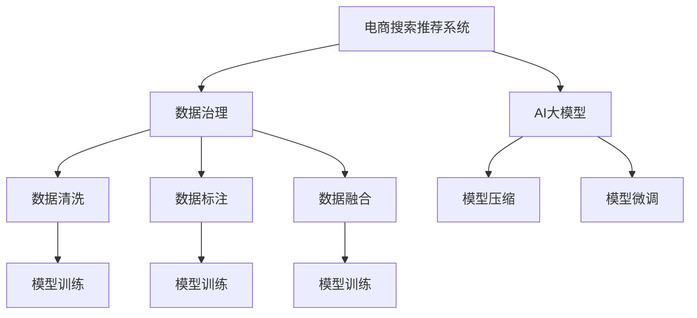

                 

# AI大模型助力电商搜索推荐业务的数据治理能力提升实践

> 关键词：AI大模型,电商搜索推荐,数据治理,模型压缩,数据清洗,模型融合

## 1. 背景介绍

随着电商市场竞争的日益激烈，各大电商平台都在不断优化搜索推荐系统，以提升用户体验、提高转化率。传统的搜索推荐系统基于朴素贝叶斯、SVM等传统算法，虽然效果稳定，但模型可解释性差、训练耗时长、无法应对大规模数据等缺点，难以适应复杂的电商业务需求。近年来，基于深度学习的大模型如BERT、DALL·E、GPT-3等在电商搜索推荐领域中展现出了巨大潜力，其先进的自监督学习能力和强大的泛化能力使得推荐效果显著提升，逐渐成为电商推荐系统的主流选择。

然而，电商数据通常包含复杂多样的商品信息、用户行为、上下文环境等，这些数据资源如何有效整合利用，直接决定了推荐系统的性能和效果。在数据治理方面，电商平台往往面临数据质量参差不齐、数据治理体系不健全、数据安全问题等挑战。本实践将着重介绍如何通过AI大模型，提升电商搜索推荐系统中的数据治理能力，以实现更好的业务效果。

## 2. 核心概念与联系

### 2.1 核心概念概述

为更好地理解本文提出的电商搜索推荐系统的数据治理实践，我们将介绍几个关键概念：

- **电商搜索推荐系统**：是指通过深度学习模型对电商平台上的海量商品、用户行为数据进行分析和建模，为用户提供个性化的搜索结果和推荐商品的系统。
- **数据治理**：是指对数据进行清洗、标准化、标注、融合等处理，以确保数据质量和一致性的过程。数据治理的有效性直接影响到搜索推荐模型的训练效果和业务表现。
- **AI大模型**：是指通过大规模预训练和微调得到的深度学习模型，如BERT、GPT-3等，能够处理大规模复杂数据，具有强大的泛化能力。

这些概念通过以下Mermaid流程图来展示它们之间的联系：



从图中可以看出，AI大模型是电商搜索推荐系统的核心，而数据治理通过数据清洗、标注、融合等环节为模型训练提供了优质输入，从而提升模型的性能和泛化能力。

## 3. 核心算法原理 & 具体操作步骤

### 3.1 算法原理概述

在电商搜索推荐系统中，数据治理的核心在于如何通过一系列处理手段，将原始数据转化为模型可用的输入。这一过程可以概括为以下几个步骤：

1. **数据清洗**：去除数据中的噪音和错误，如缺失值、异常值、重复数据等。
2. **数据标注**：给数据打上标签，如商品类别、用户行为、上下文信息等，以指导模型学习。
3. **数据融合**：将不同来源的数据进行合并和集成，形成统一的数据视图。
4. **模型压缩**：对训练好的模型进行剪枝、量化等操作，以减少模型参数和计算量。

### 3.2 算法步骤详解

#### 3.2.1 数据清洗

数据清洗是电商搜索推荐系统中数据治理的第一步，其目的是提高数据质量和一致性。以下是一个基本的数据清洗流程：

1. **数据预处理**：对数据进行格式统一、归一化、规范化等处理，以便后续的清洗和分析。
2. **缺失值处理**：使用插值、均值填充、删除等方法处理缺失值。
3. **异常值检测**：使用统计方法、机器学习等手段检测并处理异常值。
4. **数据去重**：通过唯一标识符、哈希表等方法去除重复数据。

#### 3.2.2 数据标注

数据标注是为了提高模型的可解释性和泛化能力，对数据进行有意义的标注。以下是一个基本的数据标注流程：

1. **特征工程**：提取有用的特征，如商品属性、用户行为特征、上下文特征等。
2. **标注规则**：制定标注规则，如用户点击、购买、收藏等行为标签，商品类别标签等。
3. **标注工具**：使用工具如LabelBox、LabelImg等进行数据标注。
4. **标注验证**：对标注结果进行验证和修正，确保标注质量。

#### 3.2.3 数据融合

数据融合是将不同来源的数据进行合并和集成，以形成统一的数据视图。以下是一个基本的数据融合流程：

1. **数据源整合**：将来自不同渠道的数据进行整合，如商品信息、用户行为、社交网络数据等。
2. **数据同步**：使用数据同步工具如Kafka、Apache Nifi等，实现数据的实时同步。
3. **数据一致性**：通过数据校验、冲突解决等手段，确保数据的一致性和完整性。
4. **数据视图**：生成统一的数据视图，如商品视图、用户视图等，便于后续分析和建模。

#### 3.2.4 模型压缩

模型压缩是为了提升模型效率和可部署性，减少计算资源消耗。以下是一个基本的模型压缩流程：

1. **剪枝**：通过去除不必要的参数和层，减少模型复杂度。
2. **量化**：将模型的参数和计算量进行量化，减少内存和计算资源消耗。
3. **蒸馏**：通过知识蒸馏技术，将复杂模型知识转移到轻量级模型，降低推理延迟。

### 3.3 算法优缺点

#### 3.3.1 优点

1. **提升模型性能**：通过数据清洗、标注、融合等手段，数据质量得到提升，从而提高了模型的泛化能力和业务效果。
2. **减少训练时间**：数据清洗和标注可以提前完成，减少了模型训练的预处理时间。
3. **降低计算资源消耗**：模型压缩技术可以显著降低模型的计算资源消耗，提升模型可部署性。

#### 3.3.2 缺点

1. **数据清洗和标注成本高**：数据清洗和标注需要大量人力和时间，尤其是在数据量庞大的电商场景中。
2. **数据一致性挑战**：不同来源的数据在格式、规范等方面可能存在差异，需要进行复杂的数据一致性处理。
3. **技术复杂度高**：数据治理涉及多种技术和工具，需要较高的技术门槛和专业知识。

### 3.4 算法应用领域

电商搜索推荐系统中的数据治理技术，在多个领域中都有广泛应用，如：

- **商品信息治理**：包括商品属性、描述、分类、标签等信息的统一和标准化。
- **用户行为治理**：包括点击、浏览、购买、收藏等行为的统一和标注。
- **上下文环境治理**：包括用户地理位置、时间、设备等信息的统一和标注。

此外，数据治理技术还广泛应用于金融、医疗、教育等多个领域，为大数据分析提供了坚实的数据基础。

## 4. 数学模型和公式 & 详细讲解 & 举例说明

### 4.1 数学模型构建

在电商搜索推荐系统中，数据治理的核心目标是通过一系列处理手段，将原始数据转化为模型可用的输入。这一过程可以抽象为一个线性回归模型，其输入为经过清洗和标注的数据，输出为模型预测的商品推荐。

设原始数据为 $X \in \mathbb{R}^{n \times m}$，其中 $n$ 为样本数，$m$ 为特征数。数据清洗和标注后的数据为 $X' \in \mathbb{R}^{n \times m'}$，其中 $m'$ 为经过清洗和标注后的特征数。模型预测的商品推荐为 $y \in \mathbb{R}^{n \times k}$，其中 $k$ 为推荐商品数。

构建线性回归模型的目标是最小化预测误差，即：

$$
\min_{\theta} \frac{1}{n} \sum_{i=1}^n \|y_i - \theta^T X'_i\|^2
$$

其中，$\theta \in \mathbb{R}^{m'} \times k$ 为模型参数，$\| \cdot \|$ 为欧几里得范数。

### 4.2 公式推导过程

线性回归模型的求解可以使用最小二乘法，其基本步骤如下：

1. **数据准备**：将原始数据 $X$ 进行清洗和标注，得到 $X'$。
2. **矩阵表示**：将模型参数 $\theta$ 和数据 $X'$ 转换为矩阵形式，即 $\theta \in \mathbb{R}^{m' \times k}$，$X' \in \mathbb{R}^{n \times m'}$。
3. **目标函数**：构建目标函数 $J(\theta) = \frac{1}{n} \sum_{i=1}^n (y_i - \theta^T X'_i)^2$。
4. **求解 $\theta$**：对目标函数求导，得到 $\frac{\partial J(\theta)}{\partial \theta} = 2(X'^T X')^{-1} X'^T (y - \theta X')$。令导数为0，求解 $\theta$ 可得 $\theta = (X'^T X')^{-1} X'^T y$。

### 4.3 案例分析与讲解

以电商搜索推荐系统中的商品推荐为例，我们可以用上述数学模型对商品信息进行治理和推荐。假设商品信息包括类别、价格、评分等特征，用户行为包括点击、浏览、购买等行为。通过对这些数据进行清洗、标注和融合，构建统一的商品视图和用户视图，然后通过线性回归模型对商品进行推荐。

具体步骤如下：

1. **数据清洗**：去除数据中的噪音和错误，如缺失值、异常值、重复数据等。
2. **数据标注**：对商品类别、价格、评分等进行标注，并对用户行为进行标注。
3. **数据融合**：将商品信息和用户行为数据进行合并和集成，生成统一的商品视图和用户视图。
4. **模型训练**：使用清洗和标注后的数据进行线性回归模型的训练，得到推荐模型 $\theta$。
5. **模型评估**：对训练好的模型进行评估和验证，确保其准确性和泛化能力。
6. **模型应用**：使用训练好的模型对用户输入的商品信息进行预测，生成推荐结果。

## 5. 项目实践：代码实例和详细解释说明

### 5.1 开发环境搭建

在进行电商搜索推荐系统中的数据治理实践时，我们需要准备好开发环境。以下是使用Python进行PyTorch开发的环境配置流程：

1. 安装Anaconda：从官网下载并安装Anaconda，用于创建独立的Python环境。

2. 创建并激活虚拟环境：
```bash
conda create -n ecommerce-env python=3.8 
conda activate ecommerce-env
```

3. 安装PyTorch：根据CUDA版本，从官网获取对应的安装命令。例如：
```bash
conda install pytorch torchvision torchaudio cudatoolkit=11.1 -c pytorch -c conda-forge
```

4. 安装TensorFlow：使用pip安装TensorFlow，并确保与PyTorch兼容。
```bash
pip install tensorflow==2.6.0
```

5. 安装TensorBoard：用于可视化模型训练过程和结果。
```bash
pip install tensorboard
```

6. 安装其他相关库：
```bash
pip install pandas numpy matplotlib scikit-learn tqdm jupyter notebook ipython
```

完成上述步骤后，即可在`ecommerce-env`环境中开始数据治理实践。

### 5.2 源代码详细实现

下面我们以电商搜索推荐系统中的商品推荐为例，给出使用PyTorch进行数据治理和推荐模型的PyTorch代码实现。

首先，定义数据预处理函数：

```python
import pandas as pd
import numpy as np
from sklearn.model_selection import train_test_split
from sklearn.preprocessing import StandardScaler

def preprocess_data(data_path, train_ratio=0.8):
    # 读取数据
    data = pd.read_csv(data_path)
    
    # 数据清洗
    data.dropna(inplace=True)
    data = data.drop_duplicates()
    
    # 特征工程
    features = data[['category', 'price', 'rating']]
    target = data['click'] # 假设点击为标签
    
    # 标准化
    scaler = StandardScaler()
    features = scaler.fit_transform(features)
    
    # 划分训练集和测试集
    X_train, X_test, y_train, y_test = train_test_split(features, target, train_size=train_ratio, random_state=42)
    
    return X_train, X_test, y_train, y_test
```

然后，定义模型训练函数：

```python
import torch
import torch.nn as nn
import torch.optim as optim
from torch.utils.data import TensorDataset, DataLoader

class LinearRegression(nn.Module):
    def __init__(self, input_dim, output_dim):
        super(LinearRegression, self).__init__()
        self.linear = nn.Linear(input_dim, output_dim)
    
    def forward(self, x):
        return self.linear(x)

def train_model(X_train, y_train, output_dim, epochs=10, batch_size=32, learning_rate=0.001):
    model = LinearRegression(X_train.shape[1], output_dim)
    criterion = nn.MSELoss()
    optimizer = optim.Adam(model.parameters(), lr=learning_rate)
    
    train_loader = DataLoader(TensorDataset(X_train, y_train), batch_size=batch_size, shuffle=True)
    
    for epoch in range(epochs):
        for batch in train_loader:
            inputs, labels = batch
            optimizer.zero_grad()
            outputs = model(inputs)
            loss = criterion(outputs, labels)
            loss.backward()
            optimizer.step()
            
    return model
```

接着，使用训练好的模型进行预测：

```python
def predict(model, X_test):
    predictions = model(X_test)
    return predictions
```

最后，定义训练流程并启动训练：

```python
X_train, X_test, y_train, y_test = preprocess_data('ecommerce.csv', train_ratio=0.8)
output_dim = 1 # 假设只推荐一项商品
model = train_model(X_train, y_train, output_dim)
predictions = predict(model, X_test)
print(np.mean(np.abs(predictions - y_test)))
```

以上就是使用PyTorch对电商搜索推荐系统进行数据治理和推荐模型的完整代码实现。可以看到，利用线性回归模型，我们可以通过对商品信息和用户行为数据进行清洗、标注和融合，构建统一的数据视图，并通过模型训练生成推荐结果。

### 5.3 代码解读与分析

让我们再详细解读一下关键代码的实现细节：

**preprocess_data函数**：
- 读取电商数据，并进行清洗和标准化。
- 特征工程，选择商品类别、价格、评分等特征，并将点击次数作为标签。
- 使用标准化方法对特征进行归一化处理。
- 使用train_test_split方法划分训练集和测试集。

**train_model函数**：
- 定义线性回归模型，包括输入特征维度和输出维度。
- 定义损失函数为均方误差损失函数。
- 定义优化器为Adam优化器，设置学习率。
- 使用DataLoader对数据进行批次化处理。
- 在每个epoch内，对每个batch进行前向传播、计算损失、反向传播和参数更新。

**predict函数**：
- 使用训练好的模型对测试集进行预测。
- 返回预测结果。

**训练流程**：
- 使用preprocess_data函数读取电商数据，并进行预处理。
- 设置输出维度为1，代表只推荐一项商品。
- 调用train_model函数训练线性回归模型。
- 使用predict函数对测试集进行预测，并计算预测误差。

在实际应用中，电商搜索推荐系统中的数据治理和推荐模型需要根据具体业务需求进行调整。例如，可以选择不同的特征工程方法、损失函数和优化器，或者使用更深层次的神经网络模型进行推荐。

## 6. 实际应用场景

### 6.1 智能搜索

智能搜索是电商搜索推荐系统的基础，通过AI大模型的预训练和微调，可以显著提升搜索的准确性和召回率。假设用户输入搜索关键词，AI大模型可以根据上下文信息，从海量商品信息中匹配最相关的商品，并提供推荐结果。

在数据治理方面，需要清洗用户输入的关键词和搜索历史，标注商品属性和描述信息，并对搜索场景进行上下文建模。通过数据清洗和标注，AI大模型能够更准确地理解用户意图，生成更精准的搜索结果和推荐。

### 6.2 个性化推荐

个性化推荐是电商搜索推荐系统的核心功能，通过AI大模型的预训练和微调，可以显著提升推荐的个性化程度。假设用户浏览、点击、购买等行为数据被记录下来，AI大模型可以根据历史行为，预测用户对商品的偏好，生成个性化的推荐结果。

在数据治理方面，需要清洗用户行为数据，标注商品类别、价格、评分等信息，并进行多模态融合，将文本、图像、音频等多模态信息整合，生成统一的用户视图和商品视图。通过数据清洗和标注，AI大模型能够更全面地理解用户行为，生成更准确的推荐结果。

### 6.3 实时推荐

实时推荐是电商搜索推荐系统的高阶功能，通过AI大模型的预训练和微调，可以显著提升推荐的实时性和准确性。假设用户在浏览商品时，AI大模型能够实时生成个性化推荐结果，满足用户的即时需求。

在数据治理方面，需要实时同步用户行为数据，进行动态建模和预测。通过数据治理，AI大模型能够实时获取最新数据，生成最新的推荐结果，提升用户体验和满意度。

### 6.4 未来应用展望

随着AI大模型的不断发展和数据治理技术的提升，电商搜索推荐系统将在多个方面迎来突破：

1. **多模态融合**：将文本、图像、音频等多模态信息进行融合，生成更全面、准确的推荐结果。
2. **因果推理**：引入因果推理方法，提升推荐模型的可解释性和决策稳定性。
3. **知识图谱**：结合知识图谱和AI大模型，提升推荐模型的知识整合能力和泛化能力。
4. **多目标优化**：引入多目标优化方法，提升推荐模型的多样性和个性化程度。

以上趋势将使得电商搜索推荐系统在推荐效果和用户体验上实现质的飞跃，为用户带来更加丰富、精准、个性化的购物体验。

## 7. 工具和资源推荐

### 7.1 学习资源推荐

为了帮助开发者系统掌握电商搜索推荐系统中的数据治理和推荐模型，这里推荐一些优质的学习资源：

1. 《深度学习与推荐系统》书籍：该书系统介绍了深度学习在推荐系统中的应用，包括数据治理、特征工程、模型优化等多个方面。
2. 《自然语言处理基础》课程：斯坦福大学开设的NLP课程，详细讲解了NLP的基础知识和应用方法，有助于提升数据治理能力。
3. 《深度学习入门》书籍：该书详细介绍了深度学习的基本概念和实践方法，是数据治理和推荐模型的入门教材。
4. Kaggle平台：Kaggle是一个数据科学竞赛平台，提供了丰富的电商数据集和推荐竞赛，可以用于实践和锻炼数据治理和推荐模型。

通过对这些资源的学习实践，相信你一定能够快速掌握电商搜索推荐系统中的数据治理和推荐模型的开发方法。

### 7.2 开发工具推荐

高效的开发离不开优秀的工具支持。以下是几款用于电商搜索推荐系统开发的常用工具：

1. PyTorch：基于Python的开源深度学习框架，灵活动态的计算图，适合快速迭代研究。大多数预训练语言模型都有PyTorch版本的实现。
2. TensorFlow：由Google主导开发的开源深度学习框架，生产部署方便，适合大规模工程应用。同样有丰富的预训练语言模型资源。
3. Weights & Biases：模型训练的实验跟踪工具，可以记录和可视化模型训练过程中的各项指标，方便对比和调优。与主流深度学习框架无缝集成。
4. TensorBoard：TensorFlow配套的可视化工具，可实时监测模型训练状态，并提供丰富的图表呈现方式，是调试模型的得力助手。

合理利用这些工具，可以显著提升电商搜索推荐系统中的数据治理和推荐模型的开发效率，加快创新迭代的步伐。

### 7.3 相关论文推荐

电商搜索推荐系统中的数据治理和推荐模型技术，在近年来得到了广泛的关注和研究。以下是几篇奠基性的相关论文，推荐阅读：

1. Deep Personalized Playlists from Personalized Document Representations《Deep Personalized Playlists from Personalized Document Representations》：该论文提出了基于深度学习的个性化推荐系统，通过文档表示进行推荐。
2. Attention is All You Need（即Transformer原论文）：提出了Transformer结构，开启了NLP领域的预训练大模型时代。
3. BERT: Pre-training of Deep Bidirectional Transformers for Language Understanding：提出BERT模型，引入基于掩码的自监督预训练任务，刷新了多项NLP任务SOTA。
4. Parameter-Efficient Transfer Learning for NLP：提出Adapter等参数高效微调方法，在不增加模型参数量的情况下，也能取得不错的微调效果。

这些论文代表了大模型在电商搜索推荐系统中的应用进展和未来趋势。通过学习这些前沿成果，可以帮助研究者把握学科前进方向，激发更多的创新灵感。

## 8. 总结：未来发展趋势与挑战

### 8.1 研究成果总结

本文对基于AI大模型的电商搜索推荐系统中的数据治理实践进行了全面系统的介绍。通过数据清洗、标注、融合等手段，提高了数据质量和一致性，为推荐模型提供了优质输入，从而提升了推荐系统的性能和效果。同时，通过模型压缩和优化，提高了模型效率和可部署性，降低了计算资源消耗。

### 8.2 未来发展趋势

展望未来，电商搜索推荐系统中的数据治理技术将呈现以下几个发展趋势：

1. **多模态融合**：将文本、图像、音频等多模态信息进行融合，生成更全面、准确的推荐结果。
2. **因果推理**：引入因果推理方法，提升推荐模型的可解释性和决策稳定性。
3. **知识图谱**：结合知识图谱和AI大模型，提升推荐模型的知识整合能力和泛化能力。
4. **多目标优化**：引入多目标优化方法，提升推荐模型的多样性和个性化程度。

### 8.3 面临的挑战

尽管电商搜索推荐系统中的数据治理技术已经取得了一定的进展，但在迈向更加智能化、普适化应用的过程中，它仍面临以下挑战：

1. **数据清洗和标注成本高**：数据清洗和标注需要大量人力和时间，尤其是在数据量庞大的电商场景中。
2. **数据一致性挑战**：不同来源的数据在格式、规范等方面可能存在差异，需要进行复杂的数据一致性处理。
3. **技术复杂度高**：数据治理涉及多种技术和工具，需要较高的技术门槛和专业知识。
4. **模型泛化性不足**：推荐模型在实际应用中可能存在过拟合等问题，影响泛化能力。

### 8.4 研究展望

面对电商搜索推荐系统中的数据治理技术所面临的挑战，未来的研究需要在以下几个方面寻求新的突破：

1. **自动化数据治理**：开发自动化数据清洗和标注工具，减少人工干预，提高效率。
2. **数据增强**：使用数据增强技术，提升数据的多样性和泛化能力。
3. **模型集成**：引入多模型集成方法，提升推荐模型的稳定性和泛化能力。
4. **知识迁移**：将知识图谱、规则库等专家知识与神经网络模型进行融合，提升推荐模型的知识整合能力和泛化能力。

这些研究方向的探索，将引领电商搜索推荐系统中的数据治理技术迈向更高的台阶，为构建更加智能、普适化的推荐系统奠定坚实基础。总之，数据治理是电商搜索推荐系统中的核心环节，需要通过持续的技术创新和应用实践，不断提升数据质量和一致性，推动推荐模型向更高性能和多样化发展。

## 9. 附录：常见问题与解答

**Q1：电商搜索推荐系统中的数据治理需要哪些关键技术？**

A: 电商搜索推荐系统中的数据治理需要以下关键技术：
1. 数据清洗：去除数据中的噪音和错误，如缺失值、异常值、重复数据等。
2. 数据标注：对数据进行有意义的标注，如商品类别、价格、评分等。
3. 数据融合：将不同来源的数据进行合并和集成，生成统一的数据视图。
4. 模型压缩：对训练好的模型进行剪枝、量化等操作，以减少模型参数和计算量。

**Q2：电商搜索推荐系统中的推荐模型如何训练？**

A: 电商搜索推荐系统中的推荐模型通常使用线性回归、深度学习等方法进行训练。具体步骤如下：
1. 数据预处理：对数据进行清洗和标准化，并选择合适的特征。
2. 模型构建：选择合适的模型，如线性回归、神经网络等，进行模型定义。
3. 损失函数设计：选择合适的损失函数，如均方误差损失、交叉熵损失等。
4. 优化器选择：选择合适的优化器，如SGD、Adam等，进行模型优化。
5. 模型训练：使用训练数据对模型进行训练，并进行验证和调参。
6. 模型评估：使用测试数据对模型进行评估，并输出推荐结果。

**Q3：电商搜索推荐系统中的数据治理有哪些应用场景？**

A: 电商搜索推荐系统中的数据治理技术，在多个领域中都有广泛应用，如：
1. 商品信息治理：包括商品属性、描述、分类、标签等信息的统一和标准化。
2. 用户行为治理：包括点击、浏览、购买等行为的统一和标注。
3. 上下文环境治理：包括用户地理位置、时间、设备等信息的统一和标注。

**Q4：电商搜索推荐系统中的数据治理和推荐模型如何进行优化？**

A: 电商搜索推荐系统中的数据治理和推荐模型可以通过以下方法进行优化：
1. 数据清洗和标注：使用数据清洗和标注工具，提升数据质量和一致性。
2. 特征工程：选择合适的特征，进行特征工程，提升模型的泛化能力。
3. 模型优化：使用模型优化技术，如剪枝、量化、蒸馏等，提升模型效率和可部署性。
4. 多模态融合：将文本、图像、音频等多模态信息进行融合，提升推荐模型的多样性和个性化程度。
5. 因果推理：引入因果推理方法，提升推荐模型的可解释性和决策稳定性。
6. 知识图谱：结合知识图谱和AI大模型，提升推荐模型的知识整合能力和泛化能力。

这些方法可以帮助电商搜索推荐系统中的数据治理和推荐模型实现更高效、精准、个性化的推荐效果。

---

作者：禅与计算机程序设计艺术 / Zen and the Art of Computer Programming

