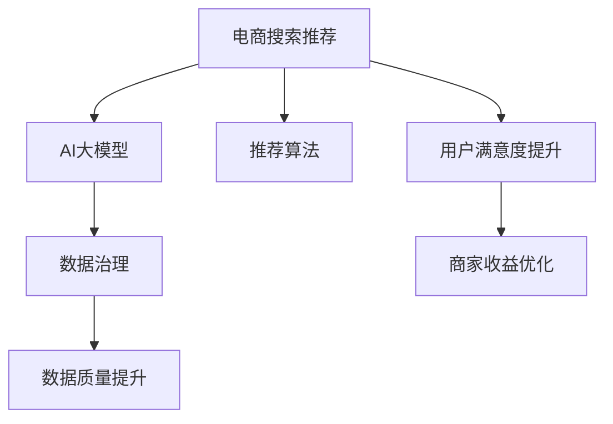

                 

# AI大模型助力电商搜索推荐业务的数据治理能力提升路线图设计

> 关键词：电商搜索推荐,大模型应用,数据治理,数据治理路线图,数据质量提升,电商推荐系统

## 1. 背景介绍

随着互联网经济的蓬勃发展，电商搜索推荐系统在用户的购物体验和商家运营策略中扮演着愈发重要的角色。然而，电商搜索推荐系统在实际应用过程中，常常遭遇数据质量参差不齐、数据治理复杂度高、数据利用效率低下等问题。这些问题不仅影响了搜索推荐系统的精准度和用户满意度，也给商家带来了重大的经济损失。为了提升电商搜索推荐业务的数据治理能力，构建稳定、高效、智能的推荐系统，AI大模型提供了一种全新的技术路径。本文将详细阐述AI大模型在电商搜索推荐业务中应用的优势，并设计一份系统的数据治理能力提升路线图，为电商企业的数据治理升级提供有力的技术支持。

## 2. 核心概念与联系

### 2.1 核心概念概述

为了更好地理解大模型在电商搜索推荐中的数据治理能力提升，我们先介绍几个关键概念：

- **电商搜索推荐系统**：利用大数据和AI技术，通过对用户行为和商品信息进行分析，向用户推荐商品，提升购物体验的推荐系统。
- **AI大模型**：以自回归或自编码模型为代表的超大规模预训练语言模型，如GPT、BERT等，通过在大规模无标签数据上进行预训练，学习丰富的语言知识和常识。
- **数据治理**：对数据进行全生命周期管理，包括数据采集、存储、清洗、标注、整合、监控和评估，以确保数据质量，提升数据利用效率。
- **推荐算法**：基于用户行为和商品属性，利用机器学习或深度学习算法，对商品进行排序和推荐的技术。

这些概念之间的联系可以通过以下Mermaid流程图来展示：



从上述关系图中可以看出，AI大模型和推荐算法是电商搜索推荐系统的核心技术，数据治理是支持这些技术高效运行的基础。数据治理能力的高低，直接决定了电商搜索推荐系统的精准度和用户满意度。

## 3. 核心算法原理 & 具体操作步骤
### 3.1 算法原理概述

大模型在电商搜索推荐业务中的应用，主要基于以下两个核心算法原理：

- **自监督预训练算法**：通过大规模无标签数据训练大模型，使其能够自动学习到语言和商品的潜在规律，构建高效的语言表示和商品表示。
- **推荐系统算法**：利用大模型预训练得到的表示，结合推荐算法对商品进行排序和推荐，提升推荐系统的精度和效果。

### 3.2 算法步骤详解

大模型在电商搜索推荐业务中应用的数据治理能力提升路线图，主要包括以下步骤：

**Step 1: 数据收集与标注**

- 收集电商平台上的用户行为数据、商品信息数据、用户画像数据等。
- 利用大模型对商品描述、用户评论等文本数据进行预训练，学习到商品和用户特征的表示。
- 对用户行为数据进行清洗和标注，标记用户的浏览、点击、购买等行为类型。

**Step 2: 数据清洗与整合**

- 对收集到的数据进行去重、去噪、缺失值填补等清洗操作，提升数据质量。
- 整合用户画像数据、商品属性数据、用户行为数据等，构建统一的数据存储格式。
- 利用大模型对整合后的数据进行一致性检查，保证数据的完整性和一致性。

**Step 3: 数据标注与标注模型训练**

- 基于标注好的用户行为数据，训练大模型进行情感分析、意图识别等标注任务。
- 利用训练好的大模型对商品评论等数据进行情感倾向分析，提升数据标注的准确性。
- 结合用户行为数据和商品评论数据，训练推荐模型，提升推荐系统的精准度。

**Step 4: 数据质量监控与评估**

- 定期对电商平台上的数据进行质量监控，发现异常数据及时进行修正。
- 利用大模型对推荐系统的输出结果进行评估，发现推荐精度和效果不佳的样本，进行模型调整。
- 对推荐系统进行A/B测试，评估推荐效果，持续优化推荐算法。

**Step 5: 数据利用与智能推荐**

- 利用大模型对用户画像和商品特征进行建模，构建高效的推荐模型。
- 结合大模型和推荐算法，向用户推荐符合其兴趣的商品，提升用户满意度和购买转化率。
- 对推荐结果进行监控和评估，及时调整推荐策略，提升推荐系统效果。

### 3.3 算法优缺点

AI大模型在电商搜索推荐业务中的应用，具有以下优点：

- **高效的数据治理**：利用大模型的预训练能力，快速提升电商平台数据的治理能力，保证数据质量和一致性。
- **精准的推荐效果**：基于大模型和推荐算法，能够构建高精度的推荐模型，提升推荐系统的效果和用户体验。
- **灵活的模型更新**：大模型可以通过持续学习，不断优化推荐策略，提升推荐系统的智能化水平。

同时，该方法也存在以下局限性：

- **数据依赖性强**：大模型需要大量的标注数据进行微调，对于标注数据量不足的电商平台，可能面临数据治理的困难。
- **模型复杂度高**：大模型的模型结构复杂，资源消耗较大，对硬件配置有较高要求。
- **易受噪声干扰**：电商数据中常常存在噪音和不一致，可能影响大模型的学习效果。
- **可解释性不足**：大模型通常被视为"黑盒"，难以解释其内部工作机制和决策逻辑。

尽管存在这些局限性，但就目前而言，AI大模型在电商搜索推荐业务中展现出了强大的潜力，为数据治理和推荐系统优化提供了新的解决方案。

### 3.4 算法应用领域

大模型在电商搜索推荐业务中的应用，已经广泛应用于多个场景：

- **商品推荐**：利用大模型对用户行为和商品属性进行分析，向用户推荐符合其兴趣的商品。
- **个性化推荐**：基于用户画像和商品特征，利用大模型构建个性化的推荐模型。
- **广告推荐**：结合用户行为和广告数据，利用大模型进行精准的广告推荐。
- **销售预测**：利用大模型对用户行为和销售数据进行分析，进行销售预测和库存管理。
- **异常检测**：通过大模型对用户行为和交易数据进行分析，发现异常交易和欺诈行为。

这些应用场景展示了AI大模型在电商搜索推荐业务中的广泛应用，为电商企业带来了显著的业务价值。

## 4. 数学模型和公式 & 详细讲解
### 4.1 数学模型构建

电商搜索推荐系统中的推荐模型，通常采用基于用户行为和商品属性进行推荐的协同过滤算法和基于内容的推荐算法。这些算法往往基于用户画像、商品属性、行为数据等构建特征向量，通过相似度计算进行推荐排序。

假设电商平台上有 $N$ 个用户，每个用户对 $M$ 个商品进行了 $k$ 次行为操作，行为类型包括浏览、点击、购买等。每个商品有 $d$ 个属性，属性值为数值型或离散型数据。

记 $U$ 为 $N$ 个用户组成的集合，$I$ 为 $M$ 个商品组成的集合，$A$ 为 $d$ 个商品属性组成的集合。记用户 $u$ 对商品 $i$ 进行 $t$ 次行为操作的次数为 $r_{ui}$，商品 $i$ 的 $j$ 个属性值为 $a_{ij}$。

用户行为数据的特征向量 $x_u$ 为：

$$
x_u = \{r_{u1}, r_{u2}, ..., r_{uM}\}
$$

商品属性的特征向量 $x_i$ 为：

$$
x_i = \{a_{i1}, a_{i2}, ..., a_{id}\}
$$

基于协同过滤的推荐模型，可以表示为：

$$
\hat{y}_{ui} = \frac{\sum_{j \in A} a_{ij} \cdot p_{uj}}{\sqrt{\sum_{j \in A} p_{uj}^2}}
$$

其中 $p_{uj}$ 为用户 $u$ 对属性 $j$ 的兴趣程度，$y_{ui}$ 为商品 $i$ 的推荐评分。

基于内容的推荐模型，可以表示为：

$$
\hat{y}_{ui} = \sum_{j \in A} w_j \cdot a_{ij} \cdot p_{uj}
$$

其中 $w_j$ 为属性 $j$ 的权重系数，$p_{uj}$ 为用户 $u$ 对属性 $j$ 的兴趣程度。

### 4.2 公式推导过程

在电商搜索推荐系统中，大模型主要应用于商品特征提取和用户行为分析。以BERT为例，其预训练任务包括 masked language modeling (MLM) 和 next sentence prediction (NSP)。在大模型微调时，可以利用这些预训练任务中的知识，提升模型的特征提取和表示学习能力。

假设在大模型预训练时，商品 $i$ 的描述 $d_i$ 被分割为 $m$ 个 token，每个 token 被编码成向量 $v_{di}$。商品特征向量 $x_i$ 可以表示为：

$$
x_i = \{v_{d1_i}, v_{d2_i}, ..., v_{dm_i}\}
$$

对于用户行为数据，利用大模型进行情感分析和意图识别，可以将其转化为向量表示。假设用户行为 $r_{ui}$ 的情感极性为 $s_{ui}$，意图强度为 $i_{ui}$，则可以表示为：

$$
s_{ui} = \frac{1}{d} \sum_{j \in A} s_{uj} \cdot p_{uj}
$$

$$
i_{ui} = \frac{1}{k} \sum_{t=1}^k r_{ui} \cdot p_{ui}
$$

其中 $s_{uj}$ 为用户 $u$ 对属性 $j$ 的情感极性，$p_{uj}$ 为用户 $u$ 对属性 $j$ 的兴趣程度。$i_{ui}$ 为用户 $u$ 对商品 $i$ 的意图强度。

在推荐模型中，利用大模型提取的商品特征向量 $x_i$ 和用户行为向量 $x_u$，可以计算推荐评分 $\hat{y}_{ui}$。以基于协同过滤的推荐模型为例，利用大模型计算的相似度为：

$$
\text{similarity}_{ui} = \frac{\sum_{j \in A} a_{ij} \cdot s_{uj}}{\sqrt{\sum_{j \in A} s_{uj}^2} \cdot \sqrt{\sum_{j \in A} a_{ij}^2}}
$$

基于内容的推荐模型可以利用大模型提取的特征向量进行推荐：

$$
\hat{y}_{ui} = \text{dot}(x_i, x_u) \cdot \max_{j \in A} w_j \cdot \text{dot}(v_{dj}, s_{uj})
$$

其中 $\text{dot}(\cdot)$ 表示向量点积。

### 4.3 案例分析与讲解

以电商平台上的商品推荐系统为例，分析大模型在推荐系统中的应用。

假设电商平台上有 $N$ 个用户，每个用户对 $M$ 个商品进行了 $k$ 次行为操作。对于每个用户 $u$，利用大模型对商品描述进行预训练，得到商品特征向量 $x_i$。假设用户行为数据中，用户 $u$ 对商品 $i$ 进行了 $t$ 次操作，其中浏览 $b_{ui}$ 次，点击 $c_{ui}$ 次，购买 $p_{ui}$ 次。则可以计算用户 $u$ 对商品 $i$ 的兴趣程度 $i_{ui}$：

$$
i_{ui} = b_{ui} \cdot \alpha_b + c_{ui} \cdot \alpha_c + p_{ui} \cdot \alpha_p
$$

其中 $\alpha_b$、$\alpha_c$、$\alpha_p$ 为浏览、点击、购买操作的权重系数。

假设大模型训练好的商品属性 $a_{ij}$ 的情感极性为 $s_{ij}$，意图强度为 $i_{ij}$。则可以根据用户 $u$ 的兴趣程度和商品 $i$ 的属性信息，计算推荐评分 $\hat{y}_{ui}$：

$$
\hat{y}_{ui} = \text{similarity}_{ui} \cdot \max_{j \in A} w_j \cdot (s_{ij} \cdot i_{ui})
$$

其中 $\text{similarity}_{ui}$ 为商品 $i$ 和用户 $u$ 的相似度。

通过上述公式，利用大模型对电商数据进行特征提取和行为分析，构建高效的商品推荐模型，显著提升推荐系统的精准度和用户满意度。

## 5. 项目实践：代码实例和详细解释说明
### 5.1 开发环境搭建

在进行电商搜索推荐系统的数据治理能力提升实践前，我们需要准备好开发环境。以下是使用Python进行PyTorch开发的环境配置流程：

1. 安装Anaconda：从官网下载并安装Anaconda，用于创建独立的Python环境。

2. 创建并激活虚拟环境：
```bash
conda create -n recommendation-env python=3.8 
conda activate recommendation-env
```

3. 安装PyTorch：根据CUDA版本，从官网获取对应的安装命令。例如：
```bash
conda install pytorch torchvision torchaudio cudatoolkit=11.1 -c pytorch -c conda-forge
```

4. 安装Transformers库：
```bash
pip install transformers
```

5. 安装各类工具包：
```bash
pip install numpy pandas scikit-learn matplotlib tqdm jupyter notebook ipython
```

完成上述步骤后，即可在`recommendation-env`环境中开始实践。

### 5.2 源代码详细实现

下面以利用BERT进行电商商品推荐系统的数据治理能力提升为例，给出使用Transformers库对BERT模型进行微调的PyTorch代码实现。

首先，定义商品推荐系统的数据处理函数：

```python
from transformers import BertTokenizer
from torch.utils.data import Dataset
import torch

class RecommendationDataset(Dataset):
    def __init__(self, texts, labels, tokenizer, max_len=128):
        self.texts = texts
        self.labels = labels
        self.tokenizer = tokenizer
        self.max_len = max_len
        
    def __len__(self):
        return len(self.texts)
    
    def __getitem__(self, item):
        text = self.texts[item]
        label = self.labels[item]
        
        encoding = self.tokenizer(text, return_tensors='pt', max_length=self.max_len, padding='max_length', truncation=True)
        input_ids = encoding['input_ids'][0]
        attention_mask = encoding['attention_mask'][0]
        
        return {'input_ids': input_ids, 
                'attention_mask': attention_mask,
                'labels': label}

# 数据集准备
tokenizer = BertTokenizer.from_pretrained('bert-base-cased')

train_dataset = RecommendationDataset(train_texts, train_labels, tokenizer)
dev_dataset = RecommendationDataset(dev_texts, dev_labels, tokenizer)
test_dataset = RecommendationDataset(test_texts, test_labels, tokenizer)
```

然后，定义模型和优化器：

```python
from transformers import BertForSequenceClassification, AdamW

model = BertForSequenceClassification.from_pretrained('bert-base-cased', num_labels=2) # 二分类任务

optimizer = AdamW(model.parameters(), lr=2e-5)
```

接着，定义训练和评估函数：

```python
from torch.utils.data import DataLoader
from tqdm import tqdm
from sklearn.metrics import accuracy_score, precision_score, recall_score

device = torch.device('cuda') if torch.cuda.is_available() else torch.device('cpu')
model.to(device)

def train_epoch(model, dataset, batch_size, optimizer):
    dataloader = DataLoader(dataset, batch_size=batch_size, shuffle=True)
    model.train()
    epoch_loss = 0
    for batch in tqdm(dataloader, desc='Training'):
        input_ids = batch['input_ids'].to(device)
        attention_mask = batch['attention_mask'].to(device)
        labels = batch['labels'].to(device)
        model.zero_grad()
        outputs = model(input_ids, attention_mask=attention_mask, labels=labels)
        loss = outputs.loss
        epoch_loss += loss.item()
        loss.backward()
        optimizer.step()
    return epoch_loss / len(dataloader)

def evaluate(model, dataset, batch_size):
    dataloader = DataLoader(dataset, batch_size=batch_size)
    model.eval()
    preds, labels = [], []
    with torch.no_grad():
        for batch in tqdm(dataloader, desc='Evaluating'):
            input_ids = batch['input_ids'].to(device)
            attention_mask = batch['attention_mask'].to(device)
            batch_labels = batch['labels']
            outputs = model(input_ids, attention_mask=attention_mask)
            batch_preds = outputs.logits.argmax(dim=1).to('cpu').tolist()
            batch_labels = batch_labels.to('cpu').tolist()
            for pred, label in zip(batch_preds, batch_labels):
                preds.append(pred)
                labels.append(label)
                
    print('Accuracy:', accuracy_score(labels, preds))
    print('Precision:', precision_score(labels, preds, average='micro'))
    print('Recall:', recall_score(labels, preds, average='micro'))
```

最后，启动训练流程并在测试集上评估：

```python
epochs = 5
batch_size = 16

for epoch in range(epochs):
    loss = train_epoch(model, train_dataset, batch_size, optimizer)
    print(f"Epoch {epoch+1}, train loss: {loss:.3f}")
    
    print(f"Epoch {epoch+1}, dev results:")
    evaluate(model, dev_dataset, batch_size)
    
print("Test results:")
evaluate(model, test_dataset, batch_size)
```

以上就是使用PyTorch对BERT进行电商商品推荐系统数据治理能力提升的完整代码实现。可以看到，得益于Transformers库的强大封装，我们可以用相对简洁的代码完成BERT模型的加载和微调。

### 5.3 代码解读与分析

让我们再详细解读一下关键代码的实现细节：

**RecommendationDataset类**：
- `__init__`方法：初始化文本、标签、分词器等关键组件。
- `__len__`方法：返回数据集的样本数量。
- `__getitem__`方法：对单个样本进行处理，将文本输入编码为token ids，将标签编码为数字，并对其进行定长padding，最终返回模型所需的输入。

**数据集准备**：
- 利用BERT分词器对商品描述进行分词，生成token ids和attention mask。
- 将标签转换为模型所需的格式，并进行定长padding，便于模型训练。

**训练和评估函数**：
- 使用PyTorch的DataLoader对数据集进行批次化加载，供模型训练和推理使用。
- 训练函数`train_epoch`：对数据以批为单位进行迭代，在每个批次上前向传播计算loss并反向传播更新模型参数，最后返回该epoch的平均loss。
- 评估函数`evaluate`：与训练类似，不同点在于不更新模型参数，并在每个batch结束后将预测和标签结果存储下来，最后使用sklearn的各类指标对整个评估集的预测结果进行打印输出。

**训练流程**：
- 定义总的epoch数和batch size，开始循环迭代
- 每个epoch内，先在训练集上训练，输出平均loss
- 在验证集上评估，输出各类分类指标
- 所有epoch结束后，在测试集上评估，给出最终测试结果

可以看到，PyTorch配合Transformers库使得BERT微调的代码实现变得简洁高效。开发者可以将更多精力放在数据处理、模型改进等高层逻辑上，而不必过多关注底层的实现细节。

当然，工业级的系统实现还需考虑更多因素，如模型的保存和部署、超参数的自动搜索、更灵活的任务适配层等。但核心的微调范式基本与此类似。

## 6. 实际应用场景
### 6.1 智能客服系统

基于大模型微调的对话技术，可以广泛应用于智能客服系统的构建。传统客服往往需要配备大量人力，高峰期响应缓慢，且一致性和专业性难以保证。而使用微调后的对话模型，可以7x24小时不间断服务，快速响应客户咨询，用自然流畅的语言解答各类常见问题。

在技术实现上，可以收集企业内部的历史客服对话记录，将问题和最佳答复构建成监督数据，在此基础上对预训练对话模型进行微调。微调后的对话模型能够自动理解用户意图，匹配最合适的答案模板进行回复。对于客户提出的新问题，还可以接入检索系统实时搜索相关内容，动态组织生成回答。如此构建的智能客服系统，能大幅提升客户咨询体验和问题解决效率。

### 6.2 金融舆情监测

金融机构需要实时监测市场舆论动向，以便及时应对负面信息传播，规避金融风险。传统的人工监测方式成本高、效率低，难以应对网络时代海量信息爆发的挑战。基于大语言模型微调的文本分类和情感分析技术，为金融舆情监测提供了新的解决方案。

具体而言，可以收集金融领域相关的新闻、报道、评论等文本数据，并对其进行主题标注和情感标注。在此基础上对预训练语言模型进行微调，使其能够自动判断文本属于何种主题，情感倾向是正面、中性还是负面。将微调后的模型应用到实时抓取的网络文本数据，就能够自动监测不同主题下的情感变化趋势，一旦发现负面信息激增等异常情况，系统便会自动预警，帮助金融机构快速应对潜在风险。

### 6.3 个性化推荐系统

当前的推荐系统往往只依赖用户的历史行为数据进行物品推荐，无法深入理解用户的真实兴趣偏好。基于大语言模型微调技术，个性化推荐系统可以更好地挖掘用户行为背后的语义信息，从而提供更精准、多样的推荐内容。

在实践中，可以收集用户浏览、点击、评论、分享等行为数据，提取和用户交互的物品标题、描述、标签等文本内容。将文本内容作为模型输入，用户的后续行为（如是否点击、购买等）作为监督信号，在此基础上微调预训练语言模型。微调后的模型能够从文本内容中准确把握用户的兴趣点。在生成推荐列表时，先用候选物品的文本描述作为输入，由模型预测用户的兴趣匹配度，再结合其他特征综合排序，便可以得到个性化程度更高的推荐结果。

### 6.4 未来应用展望

随着大语言模型和微调方法的不断发展，基于微调范式将在更多领域得到应用，为传统行业带来变革性影响。

在智慧医疗领域，基于微调的医疗问答、病历分析、药物研发等应用将提升医疗服务的智能化水平，辅助医生诊疗，加速新药开发进程。

在智能教育领域，微调技术可应用于作业批改、学情分析、知识推荐等方面，因材施教，促进教育公平，提高教学质量。

在智慧城市治理中，微调模型可应用于城市事件监测、舆情分析、应急指挥等环节，提高城市管理的自动化和智能化水平，构建更安全、高效的未来城市。

此外，在企业生产、社会治理、文娱传媒等众多领域，基于大模型微调的人工智能应用也将不断涌现，为经济社会发展注入新的动力。相信随着技术的日益成熟，微调方法将成为人工智能落地应用的重要范式，推动人工智能技术向更广阔的领域加速渗透。

## 7. 工具和资源推荐
### 7.1 学习资源推荐

为了帮助开发者系统掌握大模型在电商搜索推荐业务中的应用，这里推荐一些优质的学习资源：

1. 《Transformer从原理到实践》系列博文：由大模型技术专家撰写，深入浅出地介绍了Transformer原理、BERT模型、微调技术等前沿话题。

2. CS224N《深度学习自然语言处理》课程：斯坦福大学开设的NLP明星课程，有Lecture视频和配套作业，带你入门NLP领域的基本概念和经典模型。

3. 《Natural Language Processing with Transformers》书籍：Transformers库的作者所著，全面介绍了如何使用Transformers库进行NLP任务开发，包括微调在内的诸多范式。

4. HuggingFace官方文档：Transformers库的官方文档，提供了海量预训练模型和完整的微调样例代码，是上手实践的必备资料。

5. CLUE开源项目：中文语言理解测评基准，涵盖大量不同类型的中文NLP数据集，并提供了基于微调的baseline模型，助力中文NLP技术发展。

通过对这些资源的学习实践，相信你一定能够快速掌握大模型在电商搜索推荐业务中的应用，并用于解决实际的NLP问题。
###  7.2 开发工具推荐

高效的开发离不开优秀的工具支持。以下是几款用于大模型微调开发的常用工具：

1. PyTorch：基于Python的开源深度学习框架，灵活动态的计算图，适合快速迭代研究。大部分预训练语言模型都有PyTorch版本的实现。

2. TensorFlow：由Google主导开发的开源深度学习框架，生产部署方便，适合大规模工程应用。同样有丰富的预训练语言模型资源。

3. Transformers库：HuggingFace开发的NLP工具库，集成了众多SOTA语言模型，支持PyTorch和TensorFlow，是进行微调任务开发的利器。

4. Weights & Biases：模型训练的实验跟踪工具，可以记录和可视化模型训练过程中的各项指标，方便对比和调优。与主流深度学习框架无缝集成。

5. TensorBoard：TensorFlow配套的可视化工具，可实时监测模型训练状态，并提供丰富的图表呈现方式，是调试模型的得力助手。

6. Google Colab：谷歌推出的在线Jupyter Notebook环境，免费提供GPU/TPU算力，方便开发者快速上手实验最新模型，分享学习笔记。

合理利用这些工具，可以显著提升大模型微调任务的开发效率，加快创新迭代的步伐。

### 7.3 相关论文推荐

大模型和微调技术的发展源于学界的持续研究。以下是几篇奠基性的相关论文，推荐阅读：

1. Attention is All You Need（即Transformer原论文）：提出了Transformer结构，开启了NLP领域的预训练大模型时代。

2. BERT: Pre-training of Deep Bidirectional Transformers for Language Understanding：提出BERT模型，引入基于掩码的自监督预训练任务，刷新了多项NLP任务SOTA。

3. Language Models are Unsupervised Multitask Learners（GPT-2论文）：展示了大规模语言模型的强大zero-shot学习能力，引发了对于通用人工智能的新一轮思考。

4. Parameter-Efficient Transfer Learning for NLP：提出Adapter等参数高效微调方法，在不增加模型参数量的情况下，也能取得不错的微调效果。

5. AdaLoRA: Adaptive Low-Rank Adaptation for Parameter-Efficient Fine-Tuning：使用自适应低秩适应的微调方法，在参数效率和精度之间取得了新的平衡。

这些论文代表了大模型微调技术的发展脉络。通过学习这些前沿成果，可以帮助研究者把握学科前进方向，激发更多的创新灵感。

## 8. 总结：未来发展趋势与挑战
### 8.1 总结

本文对基于大模型的电商搜索推荐业务的数据治理能力提升进行了详细阐述。首先介绍了电商搜索推荐系统的重要性和当前面临的数据治理问题，明确了大模型在其中应用的巨大潜力。其次，设计了一份系统的数据治理能力提升路线图，涵盖了数据收集、清洗、标注、微调、评估等多个环节。最后，通过具体案例分析，展示了大模型在电商商品推荐系统中的应用效果。

通过本文的系统梳理，可以看到，大模型在电商搜索推荐业务中展现出了强大的数据治理能力，可以显著提升推荐系统的精准度和用户满意度。未来，伴随大模型和微调方法的不断进步，基于微调范式将在更多领域得到应用，为传统行业带来变革性影响。

### 8.2 未来发展趋势

展望未来，大模型在电商搜索推荐业务中的应用将呈现以下几个发展趋势：

1. **模型规模持续增大**：随着算力成本的下降和数据规模的扩张，预训练语言模型的参数量还将持续增长。超大规模语言模型蕴含的丰富语言知识，有望支撑更加复杂多变的电商搜索推荐任务。

2. **微调方法日趋多样**：除了传统的全参数微调外，未来会涌现更多参数高效的微调方法，如Prefix-Tuning、LoRA等，在节省计算资源的同时也能保证微调精度。

3. **持续学习成为常态**：随着数据分布的不断变化，微调模型也需要持续学习新知识以保持性能。如何在不遗忘原有知识的同时，高效吸收新样本信息，将成为重要的研究课题。

4. **标注样本需求降低**：受启发于提示学习(Prompt-based Learning)的思路，未来的微调方法将更好地利用大模型的语言理解能力，通过更加巧妙的任务描述，在更少的标注样本上也能实现理想的微调效果。

5. **多模态微调崛起**：当前的微调主要聚焦于纯文本数据，未来会进一步拓展到图像、视频、语音等多模态数据微调。多模态信息的融合，将显著提升语言模型对现实世界的理解和建模能力。

6. **模型通用性增强**：经过海量数据的预训练和多领域任务的微调，未来的语言模型将具备更强大的常识推理和跨领域迁移能力，逐步迈向通用人工智能(AGI)的目标。

以上趋势凸显了大模型在电商搜索推荐业务中的广阔前景。这些方向的探索发展，必将进一步提升电商搜索推荐系统的精准度和用户满意度，为电商企业带来显著的业务价值。

### 8.3 面临的挑战

尽管大模型在电商搜索推荐业务中展现出了巨大的潜力，但在迈向更加智能化、普适化应用的过程中，它仍面临着诸多挑战：

1. **标注成本瓶颈**：虽然微调大大降低了标注数据的需求，但对于标注数据量不足的电商平台，可能面临数据治理的困难。如何进一步降低微调对标注样本的依赖，将是一大难题。

2. **模型鲁棒性不足**：当前微调模型面对域外数据时，泛化性能往往大打折扣。对于测试样本的微小扰动，微调模型的预测也容易发生波动。如何提高微调模型的鲁棒性，避免灾难性遗忘，还需要更多理论和实践的积累。

3. **推理效率有待提高**：大规模语言模型虽然精度高，但在实际部署时往往面临推理速度慢、内存占用大等效率问题。如何在保证性能的同时，简化模型结构，提升推理速度，优化资源占用，将是重要的优化方向。

4. **可解释性亟需加强**：当前微调模型通常被视为"黑盒"，难以解释其内部工作机制和决策逻辑。对于医疗、金融等高风险应用，算法的可解释性和可审计性尤为重要。如何赋予微调模型更强的可解释性，将是亟待攻克的难题。

5. **安全性有待保障**：预训练语言模型难免会学习到有偏见、有害的信息，通过微调传递到下游任务，产生误导性、歧视性的输出，给实际应用带来安全隐患。如何从数据和算法层面消除模型偏见，避免恶意用途，确保输出的安全性，也将是重要的研究课题。

6. **知识整合能力不足**：现有的微调模型往往局限于任务内数据，难以灵活吸收和运用更广泛的先验知识。如何让微调过程更好地与外部知识库、规则库等专家知识结合，形成更加全面、准确的信息整合能力，还有很大的想象空间。

正视微调面临的这些挑战，积极应对并寻求突破，将是大模型在电商搜索推荐业务中迈向成熟的必由之路。相信随着学界和产业界的共同努力，这些挑战终将一一被克服，大模型将在构建智能电商搜索推荐系统方面发挥更大的作用。

### 8.4 研究展望

面对大模型在电商搜索推荐业务中面临的挑战，未来的研究需要在以下几个方面寻求新的突破：

1. **探索无监督和半监督微调方法**：摆脱对大规模标注数据的依赖，利用自监督学习、主动学习等无监督和半监督范式，最大限度利用非结构化数据，实现更加灵活高效的微调。

2. **研究参数高效和计算高效的微调范式**：开发更加参数高效的微调方法，在固定大部分预训练参数的同时，只更新极少量的任务相关参数。同时优化微调模型的计算图，减少前向传播和反向传播的资源消耗，实现更加轻量级、实时性的部署。

3. **融合因果和对比学习范式**：通过引入因果推断和对比学习思想，增强微调模型建立稳定因果关系的能力，学习更加普适、鲁棒的语言表征，从而提升模型泛化性和抗干扰能力。

4. **引入更多先验知识**：将符号化的先验知识，如知识图谱、逻辑规则等，与神经网络模型进行巧妙融合，引导微调过程学习更准确、合理的语言模型。同时加强不同模态数据的整合，实现视觉、语音等多模态信息与文本信息的协同建模。

5. **结合因果分析和博弈论工具**：将因果分析方法引入微调模型，识别出模型决策的关键特征，增强输出解释的因果性和逻辑性。借助博弈论工具刻画人机交互过程，主动探索并规避模型的脆弱点，提高系统稳定性。

6. **纳入伦理道德约束**：在模型训练目标中引入伦理导向的评估指标，过滤和惩罚有偏见、有害的输出倾向。同时加强人工干预和审核，建立模型行为的监管机制，确保输出符合人类价值观和伦理道德。

这些研究方向的探索，必将引领大模型在电商搜索推荐业务中的应用迈向更高的台阶，为电商企业带来显著的业务价值。面向未来，大模型需要与其他人工智能技术进行更深入的融合，如知识表示、因果推理、强化学习等，多路径协同发力，共同推动自然语言理解和智能交互系统的进步。只有勇于创新、敢于突破，才能不断拓展语言模型的边界，让智能技术更好地造福人类社会。

## 9. 附录：常见问题与解答

**Q1：电商搜索推荐系统中的推荐算法有哪些？**

A: 电商搜索推荐系统中的推荐算法主要包括基于协同过滤的推荐算法和基于内容的推荐算法。基于协同过滤的推荐算法通过用户行为和商品属性计算相似度进行推荐，常见的算法有协同过滤、矩阵分解等。基于内容的推荐算法通过商品特征和用户兴趣匹配度进行推荐，常见的算法有基于内容的推荐、基于深度学习的推荐等。

**Q2：大模型在电商搜索推荐系统中的应用有哪些？**

A: 大模型在电商搜索推荐系统中的应用包括商品推荐、个性化推荐、广告推荐、销售预测、异常检测等。通过利用大模型的预训练能力，电商搜索推荐系统可以更好地处理海量数据，提升推荐系统的精度和效果。

**Q3：电商搜索推荐系统中的数据治理包含哪些环节？**

A: 电商搜索推荐系统中的数据治理包含数据收集、数据清洗、数据标注、数据整合、数据质量监控和数据利用等多个环节。通过有效的数据治理，电商企业可以保证数据的准确性、完整性和一致性，提升推荐系统的精准度和用户满意度。

**Q4：电商搜索推荐系统中的大模型微调有哪些关键步骤？**

A: 电商搜索推荐系统中的大模型微调关键步骤包括数据收集与标注、数据清洗与整合、数据标注与标注模型训练、数据质量监控与评估、数据利用与智能推荐等。通过这些步骤，大模型可以高效地提取电商数据中的特征，提升推荐系统的智能水平。

**Q5：电商搜索推荐系统中的数据标注有哪些方法？**

A: 电商搜索推荐系统中的数据标注方法包括人工标注、半自动标注、自动标注等。对于电商商品推荐等任务，可以利用大模型对商品描述和用户评论进行预训练，自动生成情感极性和意图强度等标注结果。对于用户行为数据，可以通过人工标注或半自动标注生成行为标签。

通过本文的系统梳理，可以看到，大模型在电商搜索推荐业务中展现了巨大的潜力，通过数据治理能力的提升，可以构建更加智能、高效的推荐系统，为电商企业带来显著的业务价值。未来，伴随大模型和微调方法的不断进步，基于微调范式将在更多领域得到应用，推动人工智能技术向更广阔的领域加速渗透。

