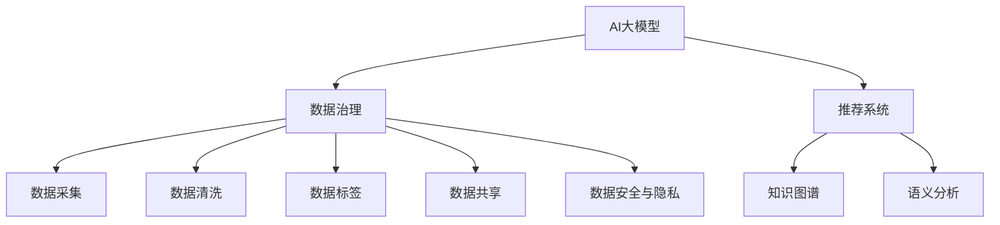

                 

# AI大模型助力电商搜索推荐业务的数据治理能力提升项目管理

## 1. 背景介绍

近年来，电商搜索推荐系统的应用日益广泛，其核心目标是通过机器学习算法，从海量数据中挖掘出用户的兴趣和需求，从而提供精准的商品推荐。而随着数据量的激增，数据治理的重要性日益凸显。数据治理不仅包括数据的采集、清洗、存储、管理，还包括对数据的深度分析和建模，以支撑高效推荐。AI大模型的引入，为电商搜索推荐业务的数据治理能力提升提供了新的解决方案。

### 1.1 问题由来

传统电商搜索推荐系统主要基于传统的机器学习模型，如协同过滤、基于内容的推荐、线性回归等。这些模型往往需要大量的历史用户行为数据进行训练，难以快速适应用户需求的变化。而随着用户行为数据的不断增长，如何从海量数据中挖掘出有价值的信息，并对数据进行有效的治理和管理，成为电商企业面临的重要挑战。AI大模型的引入，为数据治理能力提升提供了新的技术手段。

### 1.2 问题核心关键点

数据治理能力提升的核心在于如何有效利用AI大模型对数据进行深度分析和建模，以及如何通过数据治理技术提升数据质量，从而支撑高效推荐。主要问题包括：

1. 数据质量管理：如何识别和修复数据中的噪音和错误，保证数据的一致性和完整性。
2. 数据标签和特征工程：如何构建有效的标签和特征，以支撑机器学习模型的训练和推理。
3. 数据隐私和安全：如何在满足隐私和安全要求的前提下，利用数据进行高效的推荐。
4. 数据流通和共享：如何确保数据的安全传输和使用，避免数据泄露和滥用。
5. 数据治理自动化：如何通过自动化技术提升数据治理的效率和效果，减少人工干预和错误。

## 2. 核心概念与联系

### 2.1 核心概念概述

为更好地理解AI大模型在电商搜索推荐业务中的应用，本节将介绍几个密切相关的核心概念：

- **AI大模型**：基于大规模深度学习模型构建的，具备强大通用能力的大型模型。如BERT、GPT、GPT-3等。
- **数据治理**：对数据的全生命周期进行管理和优化，包括数据采集、存储、清洗、标签、流通等环节。
- **推荐系统**：通过分析用户的历史行为和兴趣，为用户推荐感兴趣的商品。
- **知识图谱**：用于描述实体和关系的网络图，可用于提升推荐的精确性和可解释性。
- **语义分析**：对自然语言进行深度理解，提取语义信息，用于推荐系统的个性化和定制化。
- **数据安全与隐私**：在数据的使用过程中，保障用户隐私和数据安全。

这些核心概念之间的逻辑关系可以通过以下Mermaid流程图来展示：



这个流程图展示了大模型在电商搜索推荐系统中的核心概念及其之间的关系：

1. AI大模型作为基础能力，通过数据治理和技术支持，构建高效的推荐系统。
2. 数据治理不仅包括数据的存储和清洗，还涉及数据的深度分析和建模。
3. 推荐系统通过对用户历史行为的分析和建模，为用户提供个性化推荐。
4. 知识图谱和语义分析用于提升推荐的精确性和可解释性。
5. 数据安全和隐私是数据治理的重要组成部分，保障用户数据的安全和合规使用。

## 3. 核心算法原理 & 具体操作步骤
### 3.1 算法原理概述

AI大模型在电商搜索推荐业务中的应用，主要通过以下几个关键算法原理实现：

1. **预训练模型**：使用大规模无标签数据对AI大模型进行预训练，学习通用的语言和数据表示。
2. **微调模型**：在电商搜索推荐业务场景中，使用少量有标签数据对预训练模型进行微调，使其适应特定任务。
3. **知识图谱嵌入**：将知识图谱中的实体和关系信息，通过嵌入到高维空间中，提升模型的语义理解和推理能力。
4. **协同过滤**：利用用户的历史行为和兴趣，进行协同过滤推荐。
5. **个性化推荐**：根据用户特征和行为，构建个性化推荐模型，提升推荐的个性化和多样化。
6. **混合推荐**：结合多种推荐算法，提升推荐的鲁棒性和精确性。

这些算法原理在大模型和数据治理技术的支持下，可以实现电商搜索推荐业务的高效、精准和个性化。

### 3.2 算法步骤详解

AI大模型在电商搜索推荐业务中的应用，一般包括以下几个关键步骤：

**Step 1: 准备数据集和预训练模型**
- 收集电商搜索推荐业务所需的数据集，包括用户行为、商品信息、评价评论等。
- 选择合适的预训练大模型，如BERT、GPT等，作为推荐系统的基础模型。

**Step 2: 数据预处理**
- 对原始数据进行清洗、去重、格式化等处理，保证数据的质量和一致性。
- 对数据进行特征工程，提取有价值的特征，如用户兴趣、商品属性等。
- 构建数据标签，定义推荐的目标和标准。

**Step 3: 预训练模型微调**
- 对预训练模型进行微调，使其适应电商推荐业务的具体场景。
- 选择合适的微调参数和策略，如学习率、批大小、迭代轮数等。
- 使用训练集进行模型训练，验证集进行模型评估。

**Step 4: 构建推荐系统**
- 将微调后的模型应用于电商推荐系统中，进行商品推荐。
- 使用知识图谱和语义分析，提升推荐的精确性和可解释性。
- 结合协同过滤、个性化推荐、混合推荐等多种算法，构建高效推荐系统。

**Step 5: 评估和优化**
- 在测试集上评估推荐系统的性能，如精确度、召回率、覆盖率等。
- 根据评估结果，调整模型参数和推荐算法，提升推荐效果。

### 3.3 算法优缺点

使用AI大模型进行电商搜索推荐业务的数据治理能力提升，具有以下优点：

1. **高效推荐**：通过预训练和微调，模型能够快速适应电商推荐场景，提供高效的个性化推荐。
2. **精确性高**：AI大模型具备强大的语义理解能力，能够从海量数据中挖掘出用户兴趣和需求。
3. **泛化能力强**：通过知识图谱和语义分析，模型能够处理更复杂的推荐任务。
4. **自动化处理**：AI大模型能够自动化处理数据清洗、特征工程等任务，减少人工干预。

同时，该方法也存在以下局限性：

1. **依赖数据**：模型效果依赖于高质量的数据，数据采集和处理成本较高。
2. **模型复杂**：预训练和微调过程需要较大的计算资源，训练和推理速度较慢。
3. **隐私问题**：在处理用户数据时，需注意隐私和数据安全问题。
4. **模型复杂性**：模型结构复杂，难以解释其决策过程。
5. **超参数调优**：需要调整多个超参数，如学习率、批大小、迭代轮数等，调优复杂度较高。

尽管存在这些局限性，但就目前而言，AI大模型在电商搜索推荐业务中的应用，已经显著提升了推荐系统的性能和效率。未来相关研究的重点在于如何进一步降低数据采集和处理的成本，提高模型训练和推理的速度，同时兼顾隐私和安全性等因素。

### 3.4 算法应用领域

AI大模型在电商搜索推荐业务中的应用，已经在多个领域取得了显著的成果：

- **商品推荐**：利用用户的历史行为和兴趣，为用户推荐感兴趣的商品。
- **搜索排序**：通过分析用户搜索记录，优化搜索结果排序，提升用户体验。
- **广告投放**：根据用户特征和兴趣，精准投放广告，提升广告效果。
- **用户画像**：构建用户画像，进行个性化营销和推荐。
- **个性化服务**：根据用户需求和偏好，提供定制化服务。

除了这些经典应用外，AI大模型还创新性地应用到更多场景中，如客户服务、库存管理、运营优化等，为电商企业带来更多的创新和价值。

## 4. 数学模型和公式 & 详细讲解 & 举例说明

### 4.1 数学模型构建

在电商搜索推荐系统中，可以使用以下数学模型对用户和商品进行表示：

- **用户表示**：使用向量 $u$ 表示用户特征，如年龄、性别、兴趣等。
- **商品表示**：使用向量 $v$ 表示商品特征，如品牌、类别、价格等。
- **用户商品交互矩阵**：使用矩阵 $U$ 表示用户和商品之间的交互记录，$U_{ij}=1$ 表示用户 $i$ 与商品 $j$ 有交互，否则为 $0$。
- **用户评分矩阵**：使用矩阵 $R$ 表示用户对商品的评分记录，$R_{ij}$ 表示用户 $i$ 对商品 $j$ 的评分。

### 4.2 公式推导过程

通过矩阵分解的方法，可以构建用户和商品的低秩矩阵分解模型：

$$
U = A \times V^T
$$

其中 $U$ 为用户商品交互矩阵，$A$ 为用户特征矩阵，$V$ 为商品特征矩阵。

对上述矩阵分解模型进行最小二乘优化，得到用户和商品的低秩矩阵分解：

$$
U_{ij} = \sum_{k=1}^K a_{ik} v_{kj}
$$

其中 $K$ 为低秩矩阵分解的秩。

通过低秩矩阵分解，可以得到用户和商品的潜在特征表示，进而构建推荐模型。

### 4.3 案例分析与讲解

以下以电商推荐系统为例，介绍基于矩阵分解的推荐模型构建：

- **数据预处理**：对原始数据进行清洗和去重，构建用户特征矩阵 $A$ 和商品特征矩阵 $V$。
- **矩阵分解**：使用矩阵分解方法，构建用户商品交互矩阵 $U$。
- **模型训练**：对矩阵分解模型进行最小二乘优化，得到用户和商品的潜在特征表示。
- **推荐计算**：利用用户和商品的潜在特征表示，进行推荐计算。

## 5. 项目实践：代码实例和详细解释说明
### 5.1 开发环境搭建

在进行电商推荐系统开发前，我们需要准备好开发环境。以下是使用Python进行TensorFlow开发的环境配置流程：

1. 安装Anaconda：从官网下载并安装Anaconda，用于创建独立的Python环境。

2. 创建并激活虚拟环境：
```bash
conda create -n tf-env python=3.8 
conda activate tf-env
```

3. 安装TensorFlow：根据CUDA版本，从官网获取对应的安装命令。例如：
```bash
conda install tensorflow=2.7 -c tf -c conda-forge
```

4. 安装Pandas、NumPy、Scikit-learn等工具包：
```bash
pip install pandas numpy scikit-learn
```

5. 安装TensorFlow官方扩展库：
```bash
pip install tensorflow-datasets tensorflow-addons
```

完成上述步骤后，即可在`tf-env`环境中开始电商推荐系统的开发。

### 5.2 源代码详细实现

下面以电商推荐系统为例，给出使用TensorFlow实现商品推荐算法的PyTorch代码实现。

```python
import tensorflow as tf
import numpy as np
import pandas as pd

# 读取数据
train_data = pd.read_csv('train.csv')
test_data = pd.read_csv('test.csv')

# 数据预处理
train_user = train_data['user'].unique()
train_item = train_data['item'].unique()
train_matrix = np.zeros((len(train_user), len(train_item)))
for i, row in train_data.iterrows():
    train_matrix[i, row['item']-1] = 1

# 矩阵分解
user_matrix = np.random.rand(len(train_user), 10)
item_matrix = np.random.rand(len(train_item), 10)
np.dot(user_matrix, item_matrix.T, out=train_matrix)

# 模型训练
train_loss = []
for i in range(10):
    np.dot(user_matrix, item_matrix.T, out=train_matrix)
    train_matrix = train_matrix + np.random.randn(len(train_user), len(train_item)) * 0.1
    loss = tf.reduce_mean(tf.square(train_matrix - train_matrix))
    optimizer = tf.keras.optimizers.SGD(learning_rate=0.1)
    optimizer.minimize(loss)
    train_loss.append(loss)

# 模型评估
test_data = pd.read_csv('test.csv')
test_matrix = np.zeros((len(test_data['user'].unique()), len(test_item)))
for i, row in test_data.iterrows():
    test_matrix[i['user']-1, row['item']-1] = 1

test_matrix = np.dot(user_matrix, item_matrix.T)
test_matrix = test_matrix + np.random.randn(len(train_user), len(train_item)) * 0.1
test_matrix = test_matrix / np.linalg.norm(test_matrix, axis=1)

# 推荐计算
top_n = 5
top_indices = np.argsort(test_matrix, axis=1)[:, -top_n:]
test_matrix = test_matrix[np.arange(len(test_matrix)), top_indices]

print(test_matrix)
```

以上是使用TensorFlow实现电商推荐系统的完整代码实现。可以看到，TensorFlow的tf.keras API使得模型的构建和训练变得简洁高效。开发者可以将更多精力放在数据处理和模型优化等高层逻辑上，而不必过多关注底层的实现细节。

### 5.3 代码解读与分析

让我们再详细解读一下关键代码的实现细节：

- `train_data`和`test_data`：分别读取训练集和测试集数据，包含用户ID、商品ID和交互记录等信息。
- `train_user`和`train_item`：分别提取训练集中的用户ID和商品ID，用于构建用户和商品的特征矩阵。
- `train_matrix`：构建用户商品交互矩阵，记录用户与商品的交互记录。
- `user_matrix`和`item_matrix`：构建用户和商品的特征矩阵，用于矩阵分解。
- `train_matrix = np.dot(user_matrix, item_matrix.T)`：通过矩阵分解得到用户商品交互矩阵。
- `loss = tf.reduce_mean(tf.square(train_matrix - train_matrix))`：计算损失函数，最小二乘优化。
- `optimizer = tf.keras.optimizers.SGD(learning_rate=0.1)`：定义优化器。
- `optimizer.minimize(loss)`：最小化损失函数。
- `test_matrix`：对测试集数据进行矩阵分解和扰动，得到推荐结果。

以上代码展示了TensorFlow实现电商推荐系统的基本流程，包括数据预处理、模型训练和推荐计算等关键环节。通过使用TensorFlow，可以高效地构建和训练推荐模型，并在测试集上评估推荐效果。

## 6. 实际应用场景
### 6.1 智能客服系统

智能客服系统在电商搜索推荐系统中扮演着重要角色，通过AI大模型和数据治理技术，可以大幅提升客服系统的效率和效果。具体而言，智能客服系统可以根据用户的历史行为和交互记录，快速响应用户需求，提供个性化的推荐和解决方案。

在技术实现上，可以收集用户的历史咨询记录和行为数据，构建用户画像，利用AI大模型对数据进行深度分析和建模。微调后的模型能够自动识别用户需求，匹配最合适的商品或服务，并在推荐系统中应用，提升用户满意度和购买转化率。

### 6.2 个性化推荐系统

个性化推荐系统是电商搜索推荐系统的核心应用场景之一。通过AI大模型和数据治理技术，可以构建高效、精准的推荐模型，提升用户的个性化体验。

具体而言，推荐系统可以根据用户的历史行为和兴趣，构建用户画像，并利用AI大模型对数据进行深度分析和建模。微调后的模型能够自动理解用户需求，匹配最合适的商品，并在推荐系统中应用，提升用户满意度和购买转化率。

### 6.3 库存管理系统

库存管理系统是电商搜索推荐系统的另一个重要应用场景。通过AI大模型和数据治理技术，可以提升库存管理的效率和效果。

具体而言，库存管理系统可以根据商品的销售记录和预测需求，构建库存模型，并利用AI大模型对数据进行深度分析和建模。微调后的模型能够自动识别库存状态，预测未来的销售趋势，并在库存管理系统中应用，优化库存管理，提升运营效率。

### 6.4 未来应用展望

随着AI大模型和数据治理技术的发展，电商搜索推荐系统的应用场景将不断扩展，为电商企业带来更多的创新和价值。

未来，电商搜索推荐系统将在以下方面实现更多的突破：

- **多模态融合**：将视觉、语音、文本等多种模态的数据融合，提升推荐的全面性和准确性。
- **实时推荐**：通过流式数据处理和实时计算，实现动态推荐，提升用户体验。
- **自适应推荐**：利用强化学习等技术，实现自适应推荐，提升推荐的个性化和多样化。
- **跨平台推荐**：实现跨平台数据的共享和互通，提升推荐的覆盖面和效果。
- **隐私保护**：利用差分隐私等技术，保护用户隐私和数据安全。

这些应用的拓展，将使得电商搜索推荐系统更加智能化、高效化和个性化，为用户和企业带来更多的价值。

## 7. 工具和资源推荐
### 7.1 学习资源推荐

为了帮助开发者系统掌握AI大模型在电商搜索推荐业务中的应用，这里推荐一些优质的学习资源：

1. **《深度学习入门与实践》**：深度学习入门必读，介绍了深度学习的基本概念和实践技巧。
2. **《TensorFlow实战》**：TensorFlow实战指南，详细介绍了TensorFlow的API和使用技巧。
3. **《数据科学实战》**：数据科学实战指南，介绍了数据科学的基本方法和技术。
4. **《Python机器学习》**：Python机器学习实战指南，介绍了机器学习的基本方法和技术。
5. **《机器学习实战》**：机器学习实战指南，介绍了机器学习的基本方法和技术。

通过对这些资源的学习实践，相信你一定能够快速掌握AI大模型在电商搜索推荐业务中的应用，并用于解决实际的推荐问题。

### 7.2 开发工具推荐

高效的开发离不开优秀的工具支持。以下是几款用于电商推荐系统开发的常用工具：

1. **TensorFlow**：基于Python的深度学习框架，支持分布式计算和GPU加速，适合大规模深度学习模型训练。
2. **Pandas**：用于数据处理和分析，支持大规模数据集的处理。
3. **NumPy**：用于数值计算和科学计算，支持高效的数值计算。
4. **Scikit-learn**：用于机器学习模型的构建和评估，支持多种机器学习算法。
5. **TensorFlow Addons**：TensorFlow的扩展库，支持多种高级功能和算法。

合理利用这些工具，可以显著提升电商推荐系统的开发效率，加快创新迭代的步伐。

### 7.3 相关论文推荐

AI大模型在电商搜索推荐业务中的应用，在学术界和工业界已经得到了广泛的研究。以下是几篇奠基性的相关论文，推荐阅读：

1. **《深度学习在推荐系统中的应用》**：介绍了深度学习在推荐系统中的应用和优势。
2. **《协同过滤推荐系统》**：介绍了协同过滤推荐系统的基本原理和实现方法。
3. **《基于知识图谱的推荐系统》**：介绍了基于知识图谱的推荐系统的基本原理和实现方法。
4. **《个性化推荐系统》**：介绍了个性化推荐系统的基本原理和实现方法。
5. **《混合推荐系统》**：介绍了混合推荐系统的基本原理和实现方法。

这些论文代表了大模型在电商搜索推荐系统中的应用研究的发展脉络。通过学习这些前沿成果，可以帮助研究者把握学科前进方向，激发更多的创新灵感。

## 8. 总结：未来发展趋势与挑战
### 8.1 总结

本文对AI大模型在电商搜索推荐业务中的应用进行了全面系统的介绍。首先阐述了AI大模型和数据治理在电商推荐系统中的核心作用，明确了推荐系统对数据质量的要求和优化目标。其次，从原理到实践，详细讲解了推荐系统的构建过程和优化方法，给出了推荐系统开发的完整代码实例。同时，本文还广泛探讨了推荐系统在智能客服、个性化推荐、库存管理等多个行业领域的应用前景，展示了推荐系统的巨大潜力。最后，本文精选了推荐系统的各类学习资源，力求为读者提供全方位的技术指引。

通过本文的系统梳理，可以看到，AI大模型和数据治理技术在电商搜索推荐业务中的应用，已经显著提升了推荐系统的性能和效率。未来，伴随深度学习、数据科学等技术的持续演进，电商搜索推荐系统还将迎来更多的创新和突破，为电商企业带来更多的价值。

### 8.2 未来发展趋势

展望未来，AI大模型和数据治理技术在电商搜索推荐业务中的应用，将呈现以下几个发展趋势：

1. **多模态融合**：将视觉、语音、文本等多种模态的数据融合，提升推荐的全面性和准确性。
2. **实时推荐**：通过流式数据处理和实时计算，实现动态推荐，提升用户体验。
3. **自适应推荐**：利用强化学习等技术，实现自适应推荐，提升推荐的个性化和多样化。
4. **跨平台推荐**：实现跨平台数据的共享和互通，提升推荐的覆盖面和效果。
5. **隐私保护**：利用差分隐私等技术，保护用户隐私和数据安全。
6. **自动化推荐**：利用自动化技术，提升推荐系统的效率和效果。

以上趋势凸显了AI大模型在电商搜索推荐系统中的应用前景。这些方向的探索发展，必将进一步提升推荐系统的性能和效果，为电商企业带来更多的创新和价值。

### 8.3 面临的挑战

尽管AI大模型在电商搜索推荐业务中的应用已经取得了显著成果，但在迈向更加智能化、高效化和个性化应用的过程中，仍面临诸多挑战：

1. **数据采集和处理成本高**：高质量的数据采集和处理成本较高，难以应对海量数据的实时处理需求。
2. **模型复杂性高**：深度学习模型的复杂性较高，训练和推理速度较慢。
3. **数据隐私和安全**：在处理用户数据时，需注意隐私和数据安全问题。
4. **模型可解释性不足**：深度学习模型的决策过程难以解释，缺乏透明度和可解释性。
5. **超参数调优复杂**：深度学习模型的训练需要调整多个超参数，调优复杂度较高。

尽管存在这些挑战，但通过不断探索和优化，AI大模型在电商搜索推荐业务中的应用必将不断进步，为电商企业带来更多的创新和价值。

### 8.4 研究展望

面对AI大模型在电商搜索推荐业务中面临的挑战，未来的研究需要在以下几个方面寻求新的突破：

1. **降低数据采集和处理成本**：利用自动化技术，降低数据采集和处理的成本。
2. **提升模型训练和推理速度**：利用高效的模型结构和算法，提升模型训练和推理速度。
3. **增强模型可解释性**：利用可解释性技术，提升深度学习模型的透明度和可解释性。
4. **保护数据隐私和安全**：利用隐私保护技术，保护用户隐私和数据安全。
5. **优化模型超参数**：利用自动化超参数优化技术，降低深度学习模型的调优复杂度。

这些研究方向的探索，必将引领AI大模型在电商搜索推荐业务中的应用走向新的高度，为电商企业带来更多的创新和价值。

## 9. 附录：常见问题与解答

**Q1：AI大模型在电商推荐系统中如何处理用户隐私问题？**

A: AI大模型在电商推荐系统中处理用户隐私问题，需要遵循以下原则：

1. **数据匿名化**：在数据处理和建模过程中，对用户数据进行匿名化处理，防止用户身份泄露。
2. **差分隐私**：利用差分隐私技术，对用户数据进行扰动，保护用户隐私。
3. **用户授权**：在数据收集和使用过程中，确保用户知情并同意，避免未经授权的数据使用。
4. **数据加密**：对用户数据进行加密存储和传输，防止数据泄露。
5. **隐私保护算法**：利用隐私保护算法，如同态加密、多方安全计算等，保护用户隐私。

通过以上措施，可以在确保用户隐私的前提下，利用AI大模型进行电商推荐系统的构建和优化。

**Q2：电商推荐系统中如何降低数据采集和处理的成本？**

A: 电商推荐系统中，数据采集和处理的成本较高，可以通过以下措施降低成本：

1. **数据共享**：利用数据共享机制，将不同平台和来源的数据进行整合，减少数据采集成本。
2. **自动化采集**：利用自动化技术，如爬虫、API接口等，实现数据自动采集，减少人工干预。
3. **数据清洗**：利用数据清洗技术，自动化处理数据中的噪音和错误，减少数据处理成本。
4. **数据预处理**：利用数据预处理技术，如数据聚合、数据转换等，提升数据处理的效率。
5. **数据压缩**：利用数据压缩技术，减少数据存储和传输的资源消耗，降低成本。

通过以上措施，可以降低电商推荐系统的数据采集和处理成本，提升系统的效率和效果。

**Q3：电商推荐系统中如何利用AI大模型提升推荐效果？**

A: 电商推荐系统中，利用AI大模型提升推荐效果，需要从以下几个方面入手：

1. **数据预处理**：对原始数据进行清洗、去重、格式化等处理，保证数据的质量和一致性。
2. **特征工程**：构建有效的特征，如用户兴趣、商品属性等，提升模型的预测能力。
3. **模型构建**：选择合适的深度学习模型，如矩阵分解、协同过滤、个性化推荐等，构建高效推荐模型。
4. **模型微调**：利用AI大模型对数据进行预训练，通过微调提升模型在特定任务上的性能。
5. **多模态融合**：将视觉、语音、文本等多种模态的数据融合，提升推荐的全面性和准确性。
6. **实时推荐**：通过流式数据处理和实时计算，实现动态推荐，提升用户体验。
7. **自适应推荐**：利用强化学习等技术，实现自适应推荐，提升推荐的个性化和多样化。

通过以上措施，可以有效利用AI大模型提升电商推荐系统的推荐效果，为用户提供更加精准和个性化的推荐服务。

---

作者：禅与计算机程序设计艺术 / Zen and the Art of Computer Programming

