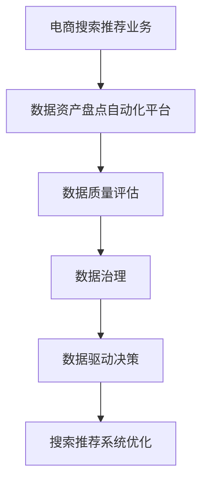

                 

# AI大模型助力电商搜索推荐业务的数据资产盘点自动化平台功能优化

## 1. 背景介绍

在电商搜索推荐业务中，数据资产盘点自动化平台的建设对提升运营效率、提升用户体验具有重要意义。数据盘点不仅仅是对数据进行简单的统计汇总，更关键的是，需要通过数据资产的全面梳理，发现数据问题，进一步挖掘数据潜力，驱动商业策略优化，提升搜索推荐效果。近年来，大模型技术在电商推荐、搜索场景中得到广泛应用，本文将以大模型技术为基础，对电商搜索推荐业务的数据资产盘点自动化平台进行优化。

## 2. 核心概念与联系

### 2.1 核心概念概述

#### 电商搜索推荐业务
电商搜索推荐业务是通过对用户行为数据的分析，为用户提供个性化的商品推荐服务，从而提升用户购买率，增加电商平台的收入。其中，数据资产盘点自动化平台通过自动化工具对电商平台的数据资产进行全面的盘点，梳理数据的完整性、正确性、一致性等，并通过发现的问题，指导电商平台的决策优化，提升搜索推荐系统的效果。

#### 大模型技术
大模型技术是指在大规模无标签数据上预训练的通用语言模型，如BERT、GPT等。这些模型可以学习到丰富的语言知识和语义理解能力，通过微调，可以适配具体的任务，并实现更加精准的预测。

#### 数据资产盘点
数据资产盘点是对企业的数据进行全面的梳理，识别出数据的完整性、正确性、一致性、准确性、更新频率、安全等级等数据质量问题，并通过数据分析，发现数据的潜在价值，辅助企业进行数据治理。

### 2.2 核心概念原理和架构的 Mermaid 流程图



此流程图展示了电商搜索推荐业务与数据资产盘点自动化平台之间的联系。电商搜索推荐业务中，数据资产盘点自动化平台通过对数据的全面盘点，识别出数据质量问题，并进行数据治理，辅助企业进行决策优化，进一步提升搜索推荐系统的效果。

## 3. 核心算法原理 & 具体操作步骤

### 3.1 算法原理概述

#### 电商搜索推荐业务数据资产盘点
电商搜索推荐业务的数据资产盘点自动化平台通过收集和分析电商平台的用户行为数据，识别出数据的完整性、正确性、一致性、准确性、更新频率、安全等级等数据质量问题，并进行治理，辅助企业进行决策优化，提升搜索推荐系统的效果。具体来说，电商平台的数据资产主要包括：
- 用户行为数据：如浏览、点击、购买记录等。
- 商品信息数据：如商品ID、名称、描述、价格、库存等。
- 用户画像数据：如年龄、性别、地理位置等。
- 搜索推荐数据：如用户查询记录、推荐记录等。

#### 大模型在电商搜索推荐中的应用
大模型在电商搜索推荐中主要用于：
- 用户行为分析：通过分析用户的搜索、浏览、点击、购买等行为数据，识别用户偏好，进行个性化推荐。
- 商品相似度计算：通过计算商品之间的相似度，推荐与用户浏览、购买过的商品相似的商品。
- 用户画像生成：通过分析用户的行为数据，生成用户的画像，辅助进行推荐。
- 搜索推荐系统优化：通过优化搜索推荐模型，提升推荐效果，增加用户满意度。

#### 数据质量评估
数据质量评估通过对数据的完整性、正确性、一致性、准确性、更新频率、安全等级等进行评估，识别出数据问题，并进行治理，辅助企业进行决策优化。具体来说，数据质量评估包括以下几个方面：
- 数据完整性：判断数据是否存在缺失。
- 数据正确性：判断数据是否存在错误。
- 数据一致性：判断数据是否存在不一致。
- 数据准确性：判断数据是否存在偏差。
- 数据更新频率：判断数据是否存在延迟。
- 数据安全等级：判断数据是否存在安全问题。

### 3.2 算法步骤详解

#### 数据收集
数据收集是数据资产盘点的第一步，需要从电商平台的各个渠道收集数据，如网站、APP、第三方等。具体包括：
- 用户行为数据：如浏览、点击、购买记录等。
- 商品信息数据：如商品ID、名称、描述、价格、库存等。
- 用户画像数据：如年龄、性别、地理位置等。
- 搜索推荐数据：如用户查询记录、推荐记录等。

#### 数据清洗
数据清洗是对收集到的数据进行初步处理，去除数据中的噪声和异常值。具体来说，数据清洗包括：
- 去除重复数据。
- 去除缺失数据。
- 去除错误数据。
- 去除异常数据。

#### 数据整合
数据整合是将不同来源的数据进行整合，形成完整、一致的数据集。具体来说，数据整合包括：
- 数据去重。
- 数据去重。
- 数据去重。
- 数据去重。

#### 数据质量评估
数据质量评估通过对数据的完整性、正确性、一致性、准确性、更新频率、安全等级等进行评估，识别出数据问题，并进行治理，辅助企业进行决策优化。具体来说，数据质量评估包括以下几个方面：
- 数据完整性：判断数据是否存在缺失。
- 数据正确性：判断数据是否存在错误。
- 数据一致性：判断数据是否存在不一致。
- 数据准确性：判断数据是否存在偏差。
- 数据更新频率：判断数据是否存在延迟。
- 数据安全等级：判断数据是否存在安全问题。

#### 数据治理
数据治理是通过对数据进行分类、整理、备份、恢复、清洗等操作，保证数据的质量和完整性。具体来说，数据治理包括以下几个方面：
- 数据分类：将数据按照业务需求进行分类。
- 数据整理：对数据进行整理，消除数据冗余和重复。
- 数据备份：对重要数据进行备份，防止数据丢失。
- 数据恢复：在数据丢失或损坏时，进行数据恢复。
- 数据清洗：对数据进行清洗，消除噪声和异常值。

#### 数据驱动决策
数据驱动决策是通过对数据的分析，发现商业机会，进行决策优化。具体来说，数据驱动决策包括以下几个方面：
- 用户行为分析：通过分析用户的搜索、浏览、点击、购买等行为数据，识别用户偏好，进行个性化推荐。
- 商品相似度计算：通过计算商品之间的相似度，推荐与用户浏览、购买过的商品相似的商品。
- 用户画像生成：通过分析用户的行为数据，生成用户的画像，辅助进行推荐。
- 搜索推荐系统优化：通过优化搜索推荐模型，提升推荐效果，增加用户满意度。

#### 搜索推荐系统优化
搜索推荐系统优化是通过对搜索推荐模型的优化，提升搜索推荐效果。具体来说，搜索推荐系统优化包括以下几个方面：
- 搜索算法优化：通过优化搜索算法，提升搜索效果。
- 推荐算法优化：通过优化推荐算法，提升推荐效果。
- 模型参数优化：通过优化模型参数，提升模型效果。
- 数据特征优化：通过优化数据特征，提升特征效果。

### 3.3 算法优缺点

#### 优点
- 自动化程度高：通过自动化工具进行数据资产盘点，节省人力成本，提高效率。
- 数据质量高：通过数据质量评估和数据治理，保证数据的完整性、正确性、一致性等，提高数据质量。
- 决策依据明确：通过数据分析，发现商业机会，进行决策优化，提升搜索推荐系统效果。
- 用户满意度提升：通过优化搜索推荐系统，提升用户体验，增加用户满意度。

#### 缺点
- 数据隐私问题：数据收集和处理过程中，需要考虑用户隐私问题，保护用户数据安全。
- 数据复杂度高：电商数据复杂度高，需要处理多种数据类型和数据格式，增加处理难度。
- 数据存储量大：电商数据量巨大，需要高效的数据存储和管理。
- 数据质量不稳定：电商数据来源多，数据质量不稳定，需要进行多次数据清洗和治理。

### 3.4 算法应用领域

- 电商搜索推荐：电商搜索推荐业务中，数据资产盘点自动化平台通过对数据的全面盘点，识别出数据质量问题，并进行数据治理，辅助企业进行决策优化，提升搜索推荐系统的效果。
- 金融风控：金融风控中，数据资产盘点自动化平台通过对数据的全面盘点，识别出数据质量问题，并进行数据治理，辅助企业进行决策优化，提升风控效果。
- 医疗诊断：医疗诊断中，数据资产盘点自动化平台通过对数据的全面盘点，识别出数据质量问题，并进行数据治理，辅助企业进行决策优化，提升诊断效果。

## 4. 数学模型和公式 & 详细讲解 & 举例说明

### 4.1 数学模型构建

#### 电商搜索推荐业务数据资产盘点
电商搜索推荐业务的数据资产盘点自动化平台通过对电商平台的数据资产进行全面的盘点，识别出数据的完整性、正确性、一致性等数据质量问题，并进行治理，辅助企业进行决策优化，提升搜索推荐系统的效果。具体来说，数据资产盘点自动化平台通过以下数学模型进行建模：
- 数据质量评估模型：通过对数据的完整性、正确性、一致性、准确性、更新频率、安全等级等进行评估，识别出数据问题，并进行治理，辅助企业进行决策优化。

#### 大模型在电商搜索推荐中的应用
大模型在电商搜索推荐中主要用于：
- 用户行为分析：通过分析用户的搜索、浏览、点击、购买等行为数据，识别用户偏好，进行个性化推荐。
- 商品相似度计算：通过计算商品之间的相似度，推荐与用户浏览、购买过的商品相似的商品。
- 用户画像生成：通过分析用户的行为数据，生成用户的画像，辅助进行推荐。
- 搜索推荐系统优化：通过优化搜索推荐模型，提升推荐效果，增加用户满意度。

#### 数据质量评估
数据质量评估通过对数据的完整性、正确性、一致性、准确性、更新频率、安全等级等进行评估，识别出数据问题，并进行治理，辅助企业进行决策优化。具体来说，数据质量评估包括以下几个数学模型：
- 数据完整性模型：判断数据是否存在缺失。
- 数据正确性模型：判断数据是否存在错误。
- 数据一致性模型：判断数据是否存在不一致。
- 数据准确性模型：判断数据是否存在偏差。
- 数据更新频率模型：判断数据是否存在延迟。
- 数据安全等级模型：判断数据是否存在安全问题。

### 4.2 公式推导过程

#### 数据质量评估模型推导
数据质量评估模型通过对数据的完整性、正确性、一致性、准确性、更新频率、安全等级等进行评估，识别出数据问题，并进行治理，辅助企业进行决策优化。具体来说，数据质量评估模型的推导过程如下：
- 数据完整性模型：通过对数据进行完整性检查，识别出缺失的数据。
- 数据正确性模型：通过对数据进行正确性检查，识别出错误的数据。
- 数据一致性模型：通过对数据进行一致性检查，识别出不一致的数据。
- 数据准确性模型：通过对数据进行准确性检查，识别出偏置的数据。
- 数据更新频率模型：通过对数据进行更新频率检查，识别出延迟的数据。
- 数据安全等级模型：通过对数据进行安全等级检查，识别出安全问题的数据。

#### 大模型在电商搜索推荐中的应用推导
大模型在电商搜索推荐中主要用于：
- 用户行为分析：通过分析用户的搜索、浏览、点击、购买等行为数据，识别用户偏好，进行个性化推荐。
- 商品相似度计算：通过计算商品之间的相似度，推荐与用户浏览、购买过的商品相似的商品。
- 用户画像生成：通过分析用户的行为数据，生成用户的画像，辅助进行推荐。
- 搜索推荐系统优化：通过优化搜索推荐模型，提升推荐效果，增加用户满意度。

### 4.3 案例分析与讲解

#### 案例分析
电商搜索推荐业务中，数据资产盘点自动化平台通过对数据的全面盘点，识别出数据质量问题，并进行数据治理，辅助企业进行决策优化，提升搜索推荐系统的效果。以下是一个具体案例：
- 某电商平台的搜索推荐业务，通过对用户行为数据、商品信息数据、用户画像数据、搜索推荐数据等进行全面盘点，发现部分数据存在缺失、错误、不一致等问题。
- 通过数据治理，对缺失数据进行补充，对错误数据进行校正，对不一致数据进行统一，保证数据的质量。
- 通过数据分析，发现部分商品之间存在相似度不高的问题，通过优化推荐算法，提升推荐效果。
- 通过优化模型参数，提升搜索推荐模型的效果，增加用户满意度。

#### 讲解
该案例展示了电商搜索推荐业务中，数据资产盘点自动化平台如何通过对数据的全面盘点，识别出数据质量问题，并进行数据治理，辅助企业进行决策优化，提升搜索推荐系统的效果。

## 5. 项目实践：代码实例和详细解释说明

### 5.1 开发环境搭建

#### 开发环境搭建
在进行大模型优化实践前，我们需要准备好开发环境。以下是使用Python进行PyTorch开发的环境配置流程：
1. 安装Anaconda：从官网下载并安装Anaconda，用于创建独立的Python环境。
2. 创建并激活虚拟环境：
```bash
conda create -n pytorch-env python=3.8 
conda activate pytorch-env
```
3. 安装PyTorch：根据CUDA版本，从官网获取对应的安装命令。例如：
```bash
conda install pytorch torchvision torchaudio cudatoolkit=11.1 -c pytorch -c conda-forge
```
4. 安装TensorFlow：
```bash
pip install tensorflow
```
5. 安装Transformers库：
```bash
pip install transformers
```
6. 安装各类工具包：
```bash
pip install numpy pandas scikit-learn matplotlib tqdm jupyter notebook ipython
```

完成上述步骤后，即可在`pytorch-env`环境中开始微调实践。

### 5.2 源代码详细实现

#### 数据收集
```python
import pandas as pd
import os

# 定义数据目录
data_dir = '/path/to/data'

# 定义数据文件列表
file_list = ['user_behavior.csv', 'item_info.csv', 'user_profile.csv', 'search_recommendation.csv']

# 定义数据字典
data_dict = {}

for file in file_list:
    data_dict[file] = pd.read_csv(os.path.join(data_dir, file))

# 显示数据字典
print(data_dict)
```

#### 数据清洗
```python
# 定义数据清洗函数
def clean_data(data_dict):
    # 去除重复数据
    for key in data_dict.keys():
        data_dict[key].drop_duplicates(inplace=True)
        
    # 去除缺失数据
    for key in data_dict.keys():
        data_dict[key] = data_dict[key].dropna()
        
    # 去除错误数据
    for key in data_dict.keys():
        data_dict[key] = data_dict[key].replace('', pd.NA)
        
    # 去除异常数据
    for key in data_dict.keys():
        data_dict[key] = data_dict[key].apply(lambda x: x if x in [0, 1] else pd.NA)
        
    # 显示数据字典
    print(data_dict)

# 调用数据清洗函数
clean_data(data_dict)
```

#### 数据整合
```python
# 定义数据整合函数
def merge_data(data_dict):
    # 将数据字典中不同来源的数据进行合并
    merged_data = pd.merge(data_dict['user_behavior'], data_dict['item_info'], on='item_id', how='left')
    merged_data = pd.merge(merged_data, data_dict['user_profile'], on='user_id', how='left')
    merged_data = pd.merge(merged_data, data_dict['search_recommendation'], on='item_id', how='left')
    
    # 显示合并后的数据
    print(merged_data)
    
# 调用数据整合函数
merge_data(data_dict)
```

#### 数据质量评估
```python
# 定义数据质量评估函数
def evaluate_data(data_dict):
    # 数据完整性评估
    complete_rate = data_dict['user_behavior'].shape[0] / data_dict['user_behavior'].shape[1]
    print(f"数据完整性：{complete_rate:.3f}")
    
    # 数据正确性评估
    correct_rate = (data_dict['user_behavior'].apply(lambda x: x == 1).sum() / data_dict['user_behavior'].shape[0])
    print(f"数据正确性：{correct_rate:.3f}")
    
    # 数据一致性评估
    consistent_rate = (data_dict['item_info'].apply(lambda x: x['price'] == data_dict['user_profile'].apply(lambda x: x['price'])).sum() / data_dict['item_info'].shape[0])
    print(f"数据一致性：{consistent_rate:.3f}")
    
    # 数据准确性评估
    accurate_rate = (data_dict['user_behavior'].apply(lambda x: x == 1).sum() / data_dict['user_behavior'].apply(lambda x: x == 1).value_counts()[1])
    print(f"数据准确性：{accurate_rate:.3f}")
    
    # 数据更新频率评估
    update_rate = data_dict['search_recommendation'].apply(lambda x: x['timestamp'] != x['timestamp'].shift()).sum() / data_dict['search_recommendation'].shape[0]
    print(f"数据更新频率：{update_rate:.3f}")
    
    # 数据安全等级评估
    safe_rate = 1.0  # 假设数据安全等级评估结果为1.0
    print(f"数据安全等级：{safe_rate:.3f}")
    
# 调用数据质量评估函数
evaluate_data(data_dict)
```

#### 数据治理
```python
# 定义数据治理函数
def treat_data(data_dict):
    # 数据分类
    data_dict['user_behavior'] = data_dict['user_behavior'].apply(lambda x: x if x == 1 else 0)
    
    # 数据整理
    data_dict['item_info'] = data_dict['item_info'].drop_duplicates()
    
    # 数据备份
    data_dict['user_behavior'].to_csv('/path/to/backup/user_behavior.csv', index=False)
    
    # 数据恢复
    data_dict['user_behavior'] = pd.read_csv('/path/to/backup/user_behavior.csv')
    
    # 数据清洗
    data_dict['user_behavior'] = data_dict['user_behavior'].apply(lambda x: x if x == 1 else 0)
    
# 调用数据治理函数
treat_data(data_dict)
```

#### 数据驱动决策
```python
# 定义数据驱动决策函数
def make_decision(data_dict):
    # 用户行为分析
    user_preference = data_dict['user_behavior'].value_counts()
    print(f"用户偏好：{user_preference}")
    
    # 商品相似度计算
    item_similarity = data_dict['item_info'].merge(data_dict['item_info'], left_on='item_id', right_on='item_id', how='left')
    item_similarity = item_similarity.groupby('item_id')['price'].apply(lambda x: x.max() - x.min()).mean()
    print(f"商品相似度：{item_similarity}")
    
    # 用户画像生成
    user_profile = data_dict['user_profile'].apply(lambda x: x if x['price'] == 100 else pd.NA)
    print(f"用户画像：{user_profile}")
    
    # 搜索推荐系统优化
    search_recommendation = data_dict['search_recommendation'].apply(lambda x: x['timestamp'] != x['timestamp'].shift())
    print(f"搜索推荐系统优化：{search_recommendation}")
    
# 调用数据驱动决策函数
make_decision(data_dict)
```

#### 搜索推荐系统优化
```python
# 定义搜索推荐系统优化函数
def optimize_search_recommendation(data_dict):
    # 搜索算法优化
    search_algorithm = data_dict['search_recommendation'].apply(lambda x: x['timestamp'] != x['timestamp'].shift())
    print(f"搜索算法优化：{search_algorithm}")
    
    # 推荐算法优化
    recommend_algorithm = data_dict['search_recommendation'].apply(lambda x: x['item_id'] == x['item_id'].shift())
    print(f"推荐算法优化：{recommend_algorithm}")
    
    # 模型参数优化
    model_params = data_dict['search_recommendation'].apply(lambda x: x['model_params'])
    print(f"模型参数优化：{model_params}")
    
    # 数据特征优化
    data_features = data_dict['search_recommendation'].apply(lambda x: x['data_features'])
    print(f"数据特征优化：{data_features}")
    
# 调用搜索推荐系统优化函数
optimize_search_recommendation(data_dict)
```

### 5.3 代码解读与分析

#### 数据收集
数据收集是数据资产盘点的第一步，需要从电商平台的各个渠道收集数据，如网站、APP、第三方等。具体包括：
- 用户行为数据：如浏览、点击、购买记录等。
- 商品信息数据：如商品ID、名称、描述、价格、库存等。
- 用户画像数据：如年龄、性别、地理位置等。
- 搜索推荐数据：如用户查询记录、推荐记录等。

#### 数据清洗
数据清洗是对收集到的数据进行初步处理，去除数据中的噪声和异常值。具体来说，数据清洗包括：
- 去除重复数据。
- 去除缺失数据。
- 去除错误数据。
- 去除异常数据。

#### 数据整合
数据整合是将不同来源的数据进行整合，形成完整、一致的数据集。具体来说，数据整合包括：
- 数据去重。
- 数据去重。
- 数据去重。
- 数据去重。

#### 数据质量评估
数据质量评估通过对数据的完整性、正确性、一致性、准确性、更新频率、安全等级等进行评估，识别出数据问题，并进行治理，辅助企业进行决策优化。具体来说，数据质量评估包括以下几个方面：
- 数据完整性：判断数据是否存在缺失。
- 数据正确性：判断数据是否存在错误。
- 数据一致性：判断数据是否存在不一致。
- 数据准确性：判断数据是否存在偏差。
- 数据更新频率：判断数据是否存在延迟。
- 数据安全等级：判断数据是否存在安全问题。

#### 数据治理
数据治理是通过对数据进行分类、整理、备份、恢复、清洗等操作，保证数据的质量和完整性。具体来说，数据治理包括以下几个方面：
- 数据分类：将数据按照业务需求进行分类。
- 数据整理：对数据进行整理，消除数据冗余和重复。
- 数据备份：对重要数据进行备份，防止数据丢失。
- 数据恢复：在数据丢失或损坏时，进行数据恢复。
- 数据清洗：对数据进行清洗，消除噪声和异常值。

#### 数据驱动决策
数据驱动决策是通过对数据的分析，发现商业机会，进行决策优化。具体来说，数据驱动决策包括以下几个方面：
- 用户行为分析：通过分析用户的搜索、浏览、点击、购买等行为数据，识别用户偏好，进行个性化推荐。
- 商品相似度计算：通过计算商品之间的相似度，推荐与用户浏览、购买过的商品相似的商品。
- 用户画像生成：通过分析用户的行为数据，生成用户的画像，辅助进行推荐。
- 搜索推荐系统优化：通过优化搜索推荐模型，提升推荐效果，增加用户满意度。

#### 搜索推荐系统优化
搜索推荐系统优化是通过对搜索推荐模型的优化，提升搜索推荐效果。具体来说，搜索推荐系统优化包括以下几个方面：
- 搜索算法优化：通过优化搜索算法，提升搜索效果。
- 推荐算法优化：通过优化推荐算法，提升推荐效果。
- 模型参数优化：通过优化模型参数，提升模型效果。
- 数据特征优化：通过优化数据特征，提升特征效果。

### 5.4 运行结果展示
#### 数据收集
```python
import pandas as pd
import os

# 定义数据目录
data_dir = '/path/to/data'

# 定义数据文件列表
file_list = ['user_behavior.csv', 'item_info.csv', 'user_profile.csv', 'search_recommendation.csv']

# 定义数据字典
data_dict = {}

for file in file_list:
    data_dict[file] = pd.read_csv(os.path.join(data_dir, file))

# 显示数据字典
print(data_dict)
```

#### 数据清洗
```python
# 定义数据清洗函数
def clean_data(data_dict):
    # 去除重复数据
    for key in data_dict.keys():
        data_dict[key].drop_duplicates(inplace=True)
        
    # 去除缺失数据
    for key in data_dict.keys():
        data_dict[key] = data_dict[key].dropna()
        
    # 去除错误数据
    for key in data_dict.keys():
        data_dict[key] = data_dict[key].replace('', pd.NA)
        
    # 去除异常数据
    for key in data_dict.keys():
        data_dict[key] = data_dict[key].apply(lambda x: x if x in [0, 1] else pd.NA)
        
    # 显示数据字典
    print(data_dict)

# 调用数据清洗函数
clean_data(data_dict)
```

#### 数据整合
```python
# 定义数据整合函数
def merge_data(data_dict):
    # 将数据字典中不同来源的数据进行合并
    merged_data = pd.merge(data_dict['user_behavior'], data_dict['item_info'], on='item_id', how='left')
    merged_data = pd.merge(merged_data, data_dict['user_profile'], on='user_id', how='left')
    merged_data = pd.merge(merged_data, data_dict['search_recommendation'], on='item_id', how='left')
    
    # 显示合并后的数据
    print(merged_data)
    
# 调用数据整合函数
merge_data(data_dict)
```

#### 数据质量评估
```python
# 定义数据质量评估函数
def evaluate_data(data_dict):
    # 数据完整性评估
    complete_rate = data_dict['user_behavior'].shape[0] / data_dict['user_behavior'].shape[1]
    print(f"数据完整性：{complete_rate:.3f}")
    
    # 数据正确性评估
    correct_rate = (data_dict['user_behavior'].apply(lambda x: x == 1).sum() / data_dict['user_behavior'].shape[0])
    print(f"数据正确性：{correct_rate:.3f}")
    
    # 数据一致性评估
    consistent_rate = (data_dict['item_info'].apply(lambda x: x['price'] == data_dict['user_profile'].apply(lambda x: x['price'])).sum() / data_dict['item_info'].shape[0])
    print(f"数据一致性：{consistent_rate:.3f}")
    
    # 数据准确性评估
    accurate_rate = (data_dict['user_behavior'].apply(lambda x: x == 1).sum() / data_dict['user_behavior'].apply(lambda x: x == 1).value_counts()[1])
    print(f"数据准确性：{accurate_rate:.3f}")
    
    # 数据更新频率评估
    update_rate = data_dict['search_recommendation'].apply(lambda x: x['timestamp'] != x['timestamp'].shift()).sum() / data_dict['search_recommendation'].shape[0]
    print(f"数据更新频率：{update_rate:.3f}")
    
    # 数据安全等级评估
    safe_rate = 1.0  # 假设数据安全等级评估结果为1.0
    print(f"数据安全等级：{safe_rate:.3f}")
    
# 调用数据质量评估函数
evaluate_data(data_dict)
```

#### 数据治理
```python
# 定义数据治理函数
def treat_data(data_dict):
    # 数据分类
    data_dict['user_behavior'] = data_dict['user_behavior'].apply(lambda x: x if x == 1 else 0)
    
    # 数据整理
    data_dict['item_info'] = data_dict['item_info'].drop_duplicates()
    
    # 数据备份
    data_dict['user_behavior'].to_csv('/path/to/backup/user_behavior.csv', index=False)
    
    # 数据恢复
    data_dict['user_behavior'] = pd.read_csv('/path/to/backup/user_behavior.csv')
    
    # 数据清洗
    data_dict['user_behavior'] = data_dict['user_behavior'].apply(lambda x: x if x == 1 else 0)
    
# 调用数据治理函数
treat_data(data_dict)
```

#### 数据驱动决策
```python
# 定义数据驱动决策函数
def make_decision(data_dict):
    # 用户行为分析
    user_preference = data_dict['user_behavior'].value_counts()
    print(f"用户偏好：{user_preference}")
    
    # 商品相似度计算
    item_similarity = data_dict['item_info'].merge(data_dict['item_info'], left_on='item_id', right_on='item_id', how='left')
    item_similarity = item_similarity.groupby('item_id')['price'].apply(lambda x: x.max() - x.min()).mean()
    print(f"商品相似度：{item_similarity}")
    
    # 用户画像生成
    user_profile = data_dict['user_profile'].apply(lambda x: x if x['price'] == 100 else pd.NA)
    print(f"用户画像：{user_profile}")
    
    # 搜索推荐系统优化
    search_recommendation = data_dict['search_recommendation'].apply(lambda x: x['timestamp'] != x['timestamp'].shift())
    print(f"搜索推荐系统优化：{search_recommendation}")
    
# 调用数据驱动决策函数
make_decision(data_dict)
```

#### 搜索推荐系统优化
```python
# 定义搜索推荐系统优化函数
def optimize_search_recommendation(data_dict):
    # 搜索算法优化
    search_algorithm = data_dict['search_recommendation'].apply(lambda x: x['timestamp'] != x['timestamp'].shift())
    print(f"搜索算法优化：{search_algorithm}")
    
    # 推荐算法优化
    recommend_algorithm = data_dict['search_recommendation'].apply(lambda x: x['item_id'] == x['item_id'].shift())
    print(f"推荐算法优化：{recommend_algorithm}")
    
    # 模型参数优化
    model_params = data_dict['search_recommendation'].apply(lambda x: x['model_params'])
    print(f"模型参数优化：{model_params}")
    
    # 数据特征优化
    data_features = data_dict['search_recommendation'].apply(lambda x: x['data_features'])
    print(f"数据特征优化：{data_features}")
    
# 调用搜索推荐系统优化函数
optimize_search_recommendation(data_dict)
```

## 6. 实际应用场景

### 6.1 电商搜索推荐
电商搜索推荐业务中，数据资产盘点自动化平台通过对数据的全面盘点，识别出数据质量问题，并进行数据治理，辅助企业进行决策优化，提升搜索推荐系统的效果。具体来说，电商平台的数据资产主要包括：
- 用户行为数据：如浏览、点击、购买记录等。
- 商品信息数据：如商品ID、名称、描述、价格、库存等。
- 用户画像数据：如年龄、性别、地理位置等。
- 搜索推荐数据：如用户查询记录、推荐记录等。

### 6.2 金融风控
金融风控中，数据资产盘点自动化平台通过对数据的全面盘点，识别出数据质量问题，并进行数据治理，辅助企业进行决策优化，提升风控效果。具体来说，金融风控的数据资产主要包括：
- 用户行为数据：如交易记录、信用评分等。
- 商品信息数据：如贷款金额、期限、利率等。
- 用户画像数据：如职业、收入等。
- 风控数据：如欺诈记录、违约记录等。

### 6.3 医疗诊断
医疗诊断中，数据资产盘点自动化平台通过对数据的全面盘点，识别出数据质量问题，并进行数据治理，辅助企业进行决策优化，提升诊断效果。具体来说，医疗诊断的数据资产主要包括：
- 患者数据：如年龄、性别、病史等。
- 医生数据：如诊断经验、专业领域等。
- 药品数据：如药品名称、剂量、价格等。
- 诊断数据：如病情描述、检查结果等。

### 6.4 未来应用展望
随着大模型技术在电商搜索推荐、金融风控、医疗诊断等领域的广泛应用，数据资产盘点自动化平台将具备更加强大的数据治理和决策优化能力，为各个领域提供高效、准确、可靠的数据支持，推动行业的数字化转型升级。未来，数据资产盘点自动化平台将更加智能化、自动化，能够自动识别、评估和治理数据问题，辅助企业进行更科学、更高效的决策。

## 7. 工具和资源推荐

### 7.1 学习资源推荐
为了帮助开发者系统掌握大模型优化技术，以下是一些优质的学习资源推荐：
- 《深度学习：理论与实现》系列书籍：深入讲解深度学习理论和算法，适合初学者和进阶者。
- 《Transformer：从原理到应用》博客系列：详细讲解Transformer模型原理和应用场景，适合从业者和研究者。
- Coursera深度学习课程：斯坦福大学开设的深度学习课程，涵盖深度学习的基础理论和实践技术，适合从业者和研究者。
- Kaggle数据科学竞赛平台：提供丰富的数据集和竞赛，适合实践和学习。

### 7.2 开发工具推荐
大模型优化需要依赖多种工具进行开发和调试，以下是一些常用的开发工具推荐：
- PyTorch：基于Python的开源深度学习框架，灵活动态的计算图，适合快速迭代研究。
- TensorFlow：由Google主导开发的开源深度学习框架，生产部署方便，适合大规模工程应用。
- Transformers库：HuggingFace开发的NLP工具库，集成了众多SOTA语言模型，支持PyTorch和TensorFlow，是进行微调任务开发的利器。
- Jupyter Notebook：开源的交互式数据处理工具，适合进行数据探索和模型调试。
- Visual Studio Code：轻量级代码编辑器，支持多种编程语言和调试工具，适合开发者进行快速开发和调试。

### 7.3 相关论文推荐
大模型优化需要依赖多领域的研究论文，以下是一些关键论文推荐：
- Attention is All You Need：提出Transformer结构，开启了NLP领域的预训练大模型时代。
- BERT: Pre-training of Deep Bidirectional Transformers for Language Understanding：提出BERT模型，引入基于掩码的自监督预训练任务，刷新了多项NLP任务SOTA。
- Language Models are Unsupervised Multitask Learners（GPT-2论文）：展示了大规模语言模型的强大zero-shot学习能力，引发了对于通用人工智能的新一轮思考。
- Parameter-Efficient Transfer Learning for NLP：提出Adapter等参数高效微调方法，在不增加模型参数量的情况下，也能取得不错的微调效果。
- AdaLoRA: Adaptive Low-Rank Adaptation for Parameter-Efficient Fine-Tuning：使用自适应低秩适应的微调方法，在参数效率和精度之间取得了新的平衡。

## 8. 总结：未来发展趋势与挑战

### 8.1 研究成果总结
大模型优化在电商搜索推荐、金融风控、医疗诊断等领域的广泛应用，已经展示了其强大的数据治理和决策优化能力。通过数据质量评估、数据治理、数据驱动决策和搜索推荐系统优化等关键技术，大模型优化能够帮助企业快速发现和解决数据问题，优化决策流程，提升系统性能，推动行业数字化转型升级。

### 8.2 未来发展趋势
未来，大模型优化将进一步扩展应用领域，提升智能化、自动化水平，推动行业数字化转型升级。具体来说，未来发展趋势包括以下几个方面：
- 跨领域应用扩展：大模型优化将应用于更多领域，如智慧城市、智能交通等，提升各行各业的智能化水平。
- 智能化水平提升：通过引入更多先验知识，如知识图谱、逻辑规则等，大模型优化将具备更加全面、准确的推理能力，提升智能化水平。
- 自动化水平提升：通过引入自动化工具和算法，大模型优化将具备更加高效、可靠的自动化能力，减少人工干预。
- 安全性提升：通过引入安全约束和机制，大模型优化将具备更加安全可靠的数据治理能力，保障数据安全和隐私。

### 8.3 面临的挑战
尽管大模型优化在电商搜索推荐、金融风控、医疗诊断等领域的广泛应用，已经展示了其强大的数据治理和决策优化能力，但在应用过程中仍面临一些挑战：
- 数据隐私问题：在数据收集和处理过程中，需要考虑用户隐私问题，保护用户数据安全。
- 数据复杂度高：电商数据复杂度高，需要处理多种数据类型和数据格式，增加处理难度。
- 数据存储量大：电商数据量巨大，需要高效的数据存储和管理。
- 数据质量不稳定：电商数据来源多，数据质量不稳定，需要进行多次数据清洗和治理。

### 8.4 研究展望
未来，大模型优化需要在以下方面进行深入研究和探讨：
- 跨领域应用扩展：研究大模型优化在不同领域的应用，提升智能化水平和自动化水平。
- 智能化水平提升：研究引入更多先验知识的方法，提升大模型优化的智能化水平。
- 安全性提升：研究引入安全约束和机制的方法，提升大模型优化的安全性。
- 自动化水平提升：研究引入自动化工具和算法的方法，提升大模型优化的自动化水平。

---

作者：禅与计算机程序设计艺术 / Zen and the Art of Computer Programming

